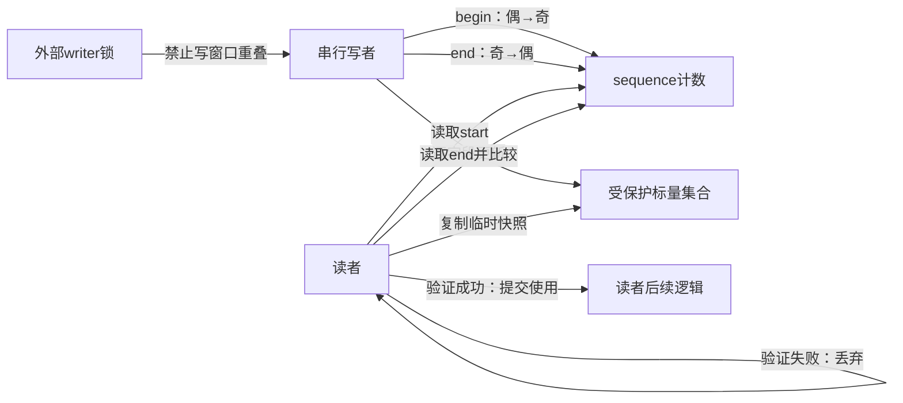
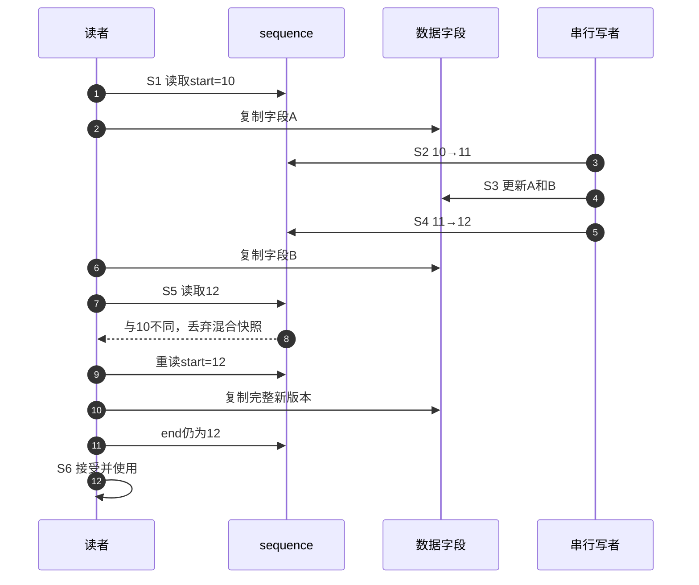

# 第2章\_一致快照的证明模型

## 2.1\_旧方案的价值与缺口

上一章已经见过“复制后验证”的读法，现在先不使用Linux接口，只问它凭什么成立。设一个采样设备保存两个参数A和B，每次配置必须一起从(0, 0)更新为(1, 1)。监控任务只要取得任一完整版本即可；(0, 1)或(1, 0)都不是设备真正提交过的配置。这里讨论内存中的标量副本，不在读区内访问硬件。

读写锁提供一个直接方案：读者持读锁复制A、B，写者取得写锁后更新。读者复制期间，写者不能进入；读者不用承担丢弃和重做的责任。若读者还必须执行一次不能撤回的动作，或者要让共享对象在整个操作期间保持不变，这个保证可能正是需要的，不该先把锁当作错误方案。

但在多个CPU高频读取两个短字段、写者很少更新的负载下，保护动作可能比复制本身更重。以共享读者计数的实现为例，CPU0取得读锁要更新计数，CPU1随后也要更新同一缓存行；缓存一致性协议需要把该行的可写所有权交给当前修改者，其他核的副本失效或被更新。离开读区还要再次记账。业务字段本来只读，锁状态却有多核写入；核数、读频率和缓存布局决定成本是否显著，不能由“用了读锁”直接断言性能差。具体锁可能采用不同的读者记账方式，这只是看见成本的一个模型。

若允许偶尔重读，新的目标是：读者只读共享数据，在自己的局部变量里保存候选结果；写者不等这些读者退出，读者最后自行判断候选结果是否可以使用。代价由读锁记账转为版本观察与失败重做。单核、低频读取或写入很密集时，原来的锁方案仍可能更简单、也更可预测。

## 2.2\_朴素版本号为什么还不够

先尝试只在写完后version++。初始version=0，数据为(0, 0)。下面的动作都按表中顺序完成，不需要任何内存乱序就会出错。

| 次序 | 执行者与动作 | 读者已经取得的证据 |
| --- | --- | --- |
| 1 | 写者把A写成1，尚未写B | 无 |
| 2 | 读者读version=0 | start=0 |
| 3 | 读者复制A=1、B=0 | 候选是混合版本 |
| 4 | 读者再次读version=0，比较相等 | 错误接受(1, 0) |
| 5 | 写者把B写成1，再把version增加 | 来不及撤回读者刚才的使用 |

缺少的不是“再多检查一次”，而是写入进行中没有留下可观察证据。让写者在第一次修改字段前把sequence从偶数变成奇数，全部字段写完后再变成下一个偶数，读者就能区分“稳定版本”和“尚未提交的窗口”。前后相等还不够，起始值也必须是偶数。

这一步仍是有序动作模型：假定开窗在字段写入前可见、关窗在全部字段完成后可见，读者的两次取证确实包住复制。第3章才把这些顺序要求映射到内核接口，不能把这里的sequence++直接移植成C/C++多线程算法。

## 2.3\_角色与状态地址



sequence只记录代际，不保存读者名单；读者的start和临时副本归各自栈/寄存器所有。写者之间的互斥由外部锁或单一writer协议提供。没有读者上报、回调或IPI通知来宣布“我看完了”：写者直接更新共享版本和数据，CPU缓存一致性承载这些共享访问，读者通过主动读取取得证据。被移除的是读者登记写操作，不是所有共享通信。

## 2.4\_S0到S6的完整读写周期

| 阶段 | 触发 | sequence | 数据状态 | 结论 |
| --- | --- | --- | --- | --- |
| S0 稳定 | 无 writer 在窗口内 | 偶数 `2n` | 完整旧版本 | 读者可开始 |
| S1 读者取证 | 读 begin | 记录 `start=2n` | 尚未承诺快照正确 | 只保存局部证据 |
| S2 写者开窗 | writer 取得外部串行权 | `2n→2n+1` | 即将不稳定 | 新读者不能接受该代际 |
| S3 非原子更新 | writer 修改多字段 | 奇数 | 允许出现临时组合 | 读者只能暂存 |
| S4 写者关窗 | 字段全部完成 | `2n+1→2n+2` | 完整新版本 | 发布新稳定代际 |
| S5 读者验证 | 读 retry | 与 start 比较 | 相同偶数才一致 | 失败回 S1 |
| S6 使用 | 验证成功 | 无需写共享状态 | 使用本地副本 | 本轮结束 |

## 2.5\_正常与交错时序



算法不要求读者从未接触临时值，只要求 **在临时值产生副作用以前验证**。所以读侧可以复制整数和内嵌结构，却不能先解引用可能失效的指针、发起 I/O 或释放资源再尝试“回滚”。

## 2.6\_证明成立的前提

1. 所有 writer 严格串行，否则两个 writer 的奇偶变化可能相互抵消，让读者接受重叠更新。
2. 普通 seqcount 的 writer 奇数窗口不能被能持续读取它的高优先级上下文无限抢占。
3. begin、数据读取、retry 与 writer 的顺序由官方接口提供，不能手写普通 load/store。
4. sequence 在一次读区间内不能完整回绕到同一值；读区必须短到满足版本宽度的工程假设。
5. 读者验证前的所有动作都可安全丢弃。

为什么写者串行是证明的一部分？写者甲开窗把0变1，尚未结束；写者乙也开窗把1变2。如果读者此刻两次都看到2，它可能接受甲乙交错产生的数据。偶数只有在“至多一个写窗口活动”时才代表稳定，版本计数不能替写者拿锁。

为什么普通读者不能中断同CPU的奇数窗口并等待它结束？此时让sequence恢复偶数的写者就压在当前读者下面，读者持续检查也无法让写者执行下一条指令。跨CPU读者仍可能等到写者完成；同CPU高优先级读者却可能阻止它完成。要么限制读者上下文并保护写窗口，要么引入后文latch的双副本方案，而不是增加重试次数。

无回绕和上述顺序成立时，读者从偶数开始，结束还是同一个值，意味着这段复制区间没有跨过任何完整写周期；正在进行的写周期也会留下奇数或变化值。因此可以接受该候选。这个论证只给出某个稳定窗口的快照，不保证它在验证成功后仍是最新全局状态；写者下一刻仍可更新，调用者应使用已经验证的局部副本。

### 2.6.1\_用完整C程序枚举有序交错

把两个字段的完整版本设为(0, 0)和(1, 1)，只要接受了两字段不相等的候选，就找到了错误。程序在单线程中枚举动作顺序；结构体按值复制保存每条分支状态，没有真实并发，也没有C数据竞争。错误方案有3个写动作和4个读动作，共35种交错；奇偶方案有4个写动作和4个读动作，共70种。

```c
#include <assert.h>
#include <stdbool.h>
#include <stdio.h>

struct snapshot_state {
    unsigned sequence;
    unsigned a;
    unsigned b;
    unsigned start;
    unsigned end;
    unsigned copy_a;
    unsigned copy_b;
};

struct totals {
    unsigned schedules;
    unsigned accepted;
    unsigned mixed_accepted;
};

/* 单线程枚举保持双方内部顺序的交错，不运行共享内存并发。 */
static void explore(bool odd_even, unsigned writer_step,
                    unsigned reader_step, struct snapshot_state state,
                    struct totals *totals)
{
    unsigned writer_steps = odd_even ? 4u : 3u;

    if (writer_step == writer_steps && reader_step == 4u) {
        bool accepted = state.start == state.end &&
                        (!odd_even || (state.start & 1u) == 0u);
        totals->schedules++;
        if (accepted) {
            totals->accepted++;
            if (state.copy_a != state.copy_b)
                totals->mixed_accepted++;
        }
        return;
    }
    if (writer_step < writer_steps) {
        struct snapshot_state next = state;
        if (odd_even) {
            switch (writer_step) {
            case 0: next.sequence++; break; /* 先发布奇数窗口。 */
            case 1: next.a = 1; break;
            case 2: next.b = 1; break;
            case 3: next.sequence++; break; /* 数据齐全后恢复偶数。 */
            }
        } else {
            switch (writer_step) {
            case 0: next.a = 1; break;
            case 1: next.b = 1; break;
            case 2: next.sequence++; break; /* 错误方案只在结尾改版号。 */
            }
        }
        explore(odd_even, writer_step + 1u, reader_step, next, totals);
    }
    if (reader_step < 4u) {
        struct snapshot_state next = state;
        switch (reader_step) {
        case 0: next.start = next.sequence; break;
        case 1: next.copy_a = next.a; break;
        case 2: next.copy_b = next.b; break;
        case 3: next.end = next.sequence; break;
        }
        explore(odd_even, writer_step, reader_step + 1u, next, totals);
    }
}

int main(void)
{
    struct snapshot_state initial = {0};
    struct totals end_only = {0};
    struct totals odd_even = {0};

    explore(false, 0, 0, initial, &end_only);
    explore(true, 0, 0, initial, &odd_even);
    assert(end_only.schedules == 35u);
    assert(odd_even.schedules == 70u);
    assert(end_only.mixed_accepted > 0u);
    assert(odd_even.mixed_accepted == 0u);
    assert(odd_even.accepted > 0u);
    printf("end_only: schedules=%u accepted=%u mixed=%u\n",
           end_only.schedules, end_only.accepted, end_only.mixed_accepted);
    printf("odd_even: schedules=%u accepted=%u mixed=%u\n",
           odd_even.schedules, odd_even.accepted, odd_even.mixed_accepted);
    return 0;
}
```

保存为snapshot_model.c，使用`cc -std=c11 -Wall -Wextra -Werror -O2 snapshot_model.c -o snapshot_model`编译，然后运行`./snapshot_model`。本轮Windows宿主GCC14.2与Clang18.1.8运行结果一致：

```text
end_only: schedules=35 accepted=16 mixed=5
odd_even: schedules=70 accepted=2 mixed=0
```

程序把一次候选读取全部走完，再统一检查；即便start为奇数也继续枚举后续复制，但绝不接受它。这是为了比较接受条件而放宽的观察模型，真实read_seqcount_begin会先等偶数。本程序不模拟这种等待、重试下一轮、缓存传播或编译器重排；70种交错零错误不证明完整内存模型和运行进展。

先预测再修改：把奇偶检查去掉，会接受哪些写到一半的值？只保留奇偶检查而不比较start/end，跨过完整写周期是否仍安全？最后解释为什么当前assert只能证明一个写者的一次更新，不能覆盖写者重叠、计数回绕和被释放指针。这些缺口应增加模型或约束，不能靠把循环多跑几次解决。

## 2.7\_被移除的读侧成本去了哪里

读者不再获取共享读锁，也不登记自己；代价转移为：

- writer 额外写两次 sequence 并承担外部串行化；
- reader 读取两次 sequence，失败时重复复制；
- 高频 writer 或长读区会导致重试放大，最坏进展不再由锁队列保证；
- 指针生命周期和不可回滚操作必须交给其他机制。

## 2.8\_本章结论与下一问

一致快照是由“写侧奇偶窗口 + 读侧局部证据 + 最后验证”共同证明的，不是 sequence 值本身自动保护数据。下一章进入 Linux 6.12.20 的 begin/retry 和 write begin/end，解释这些接口怎样放置内存顺序并接入 KCSAN/Lockdep。

版本证据从[序列计数器源码总索引](../../../../../research/source_reading/sequence_counters/navigation/P01_Linux_6.12_序列计数器源码总阅读索引.md#1.1_版本边界与阅读任务)进入。本章原地更新、写者串行、不可被读者打断和指针限制，已对照固定提交的Documentation/locking/seqlock.rst；C程序是仓库教学模型，不是该内核的用户态移植。

上一篇：[seqcount/seqlock 读重试快照](P01_seqcount_seqlock_读重试快照机制.md)。

下一篇：[seqcount 读写路径与内存顺序](P03_seqcount读写路径与内存顺序.md)。
