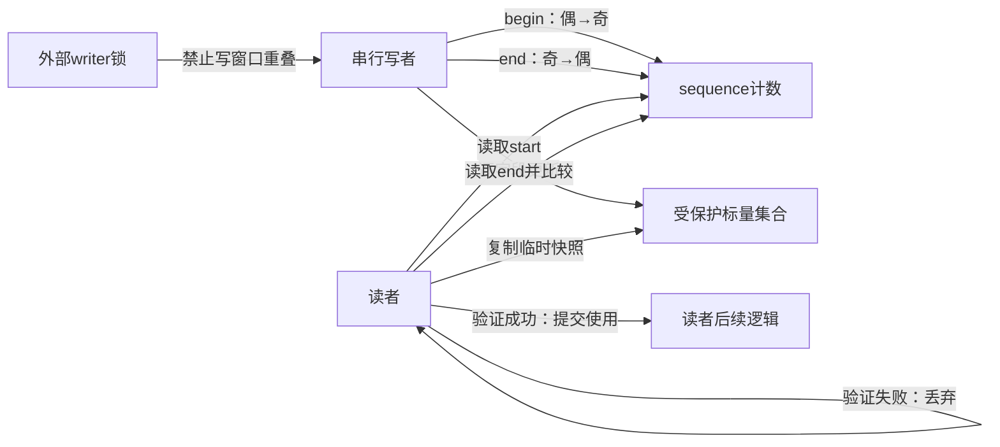
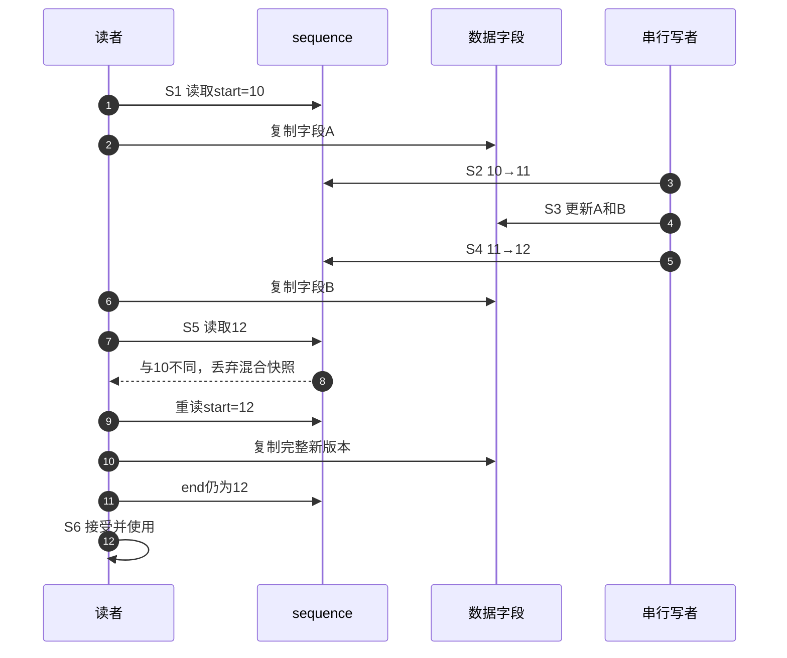

# 第2章\_一致快照的证明模型

## 2.1\_旧方案的价值与缺口

读写锁能保证读者复制多个字段期间写者不进入，证明直接但每个读者都要修改共享锁状态。对于高频读、低频写的短标量快照，这些读侧写操作会让锁缓存行在 CPU 间迁移。若读操作本身可以重做，可以把成本改成：读者不阻止写者，但必须证明自己复制的字段来自同一个稳定窗口。

## 2.2\_朴素版本号为什么还不够

只在写完后 `version++` 不能拒绝正在写入时读出的混合值：读者可能先读新字段 A、再读旧字段 B，前后版本恰好相同。必须让“写入进行中”也进入共享状态，因此采用奇偶两阶段：偶数表示稳定，写者开始先变奇，全部字段完成后再变为下一个偶数。

## 2.3\_角色与状态地址

sequence 只记录代际，不保存读者名单；读者的 `start` 和临时副本归各自栈/寄存器所有。写者之间的互斥由外部锁或单一 writer 协议提供。

## 2.4\_S0到S6的完整读写周期

| 阶段 | 触发 | sequence | 数据状态 | 结论 |
| --- | --- | --- | --- | --- |
| S0 稳定 | 无 writer 在窗口内 | 偶数 `2n` | 完整旧版本 | 读者可开始 |
| S1 读者取证 | 读 begin | 记录 `start=2n` | 尚未承诺快照正确 | 只保存局部证据 |
| S2 写者开窗 | writer 取得外部串行权 | `2n→2n+1` | 即将不稳定 | 新读者不能接受该代际 |
| S3 非原子更新 | writer 修改多字段 | 奇数 | 允许出现临时组合 | 读者只能暂存 |
| S4 写者关窗 | 字段全部完成 | `2n+1→2n+2` | 完整新版本 | 发布新稳定代际 |
| S5 读者验证 | 读 retry | 与 start 比较 | 相同偶数才一致 | 失败回 S1 |
| S6 使用 | 验证成功 | 无需写共享状态 | 使用本地副本 | 本轮结束 |

## 2.5\_正常与交错时序

算法不要求读者从未接触临时值，只要求 **在临时值产生副作用以前验证**。所以读侧可以复制整数和内嵌结构，却不能先解引用可能失效的指针、发起 I/O 或释放资源再尝试“回滚”。

## 2.6\_证明成立的前提

1. 所有 writer 严格串行，否则两个 writer 的奇偶变化可能相互抵消，让读者接受重叠更新。
2. 普通 seqcount 的 writer 奇数窗口不能被能持续读取它的高优先级上下文无限抢占。
3. begin、数据读取、retry 与 writer 的顺序由官方接口提供，不能手写普通 load/store。
4. sequence 在一次读区间内不能完整回绕到同一值；读区必须短到满足版本宽度的工程假设。
5. 读者验证前的所有动作都可安全丢弃。

## 2.7\_被移除的读侧成本去了哪里

读者不再获取共享读锁，也不登记自己；代价转移为：

- writer 额外写两次 sequence 并承担外部串行化；
- reader 读取两次 sequence，失败时重复复制；
- 高频 writer 或长读区会导致重试放大，最坏进展不再由锁队列保证；
- 指针生命周期和不可回滚操作必须交给其他机制。

## 2.8\_本章结论与下一问

一致快照是由“写侧奇偶窗口 + 读侧局部证据 + 最后验证”共同证明的，不是 sequence 值本身自动保护数据。下一章进入 Linux 6.12.20 的 begin/retry 和 write begin/end，解释这些接口怎样放置内存顺序并接入 KCSAN/Lockdep。

上一篇：[seqcount/seqlock 读重试快照](P01_seqcount_seqlock_读重试快照机制.md)。

下一篇：[seqcount 读写路径与内存顺序](P03_seqcount读写路径与内存顺序.md)。
