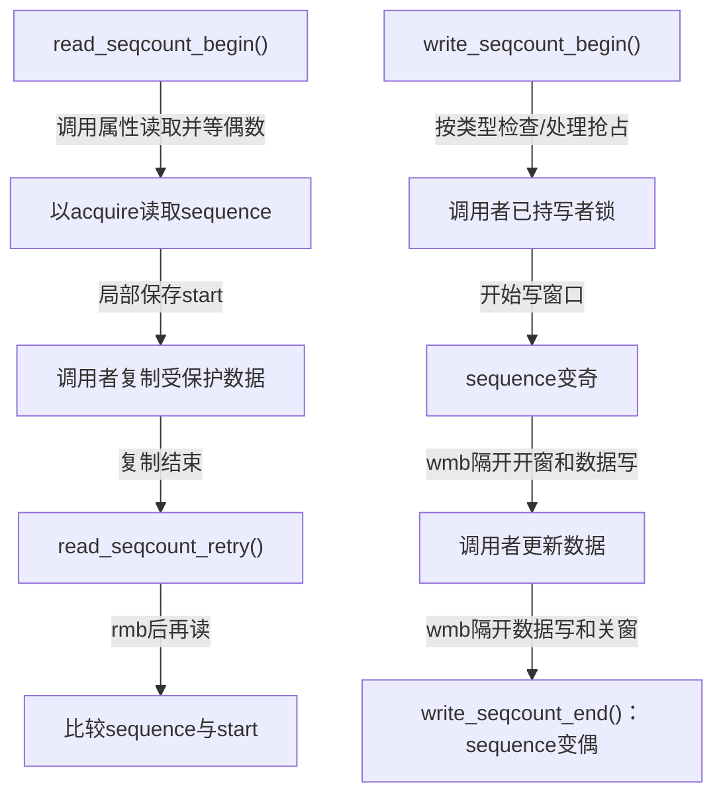
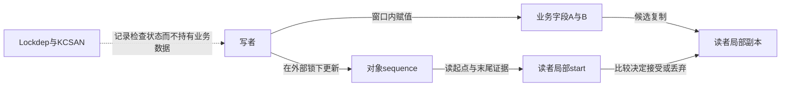
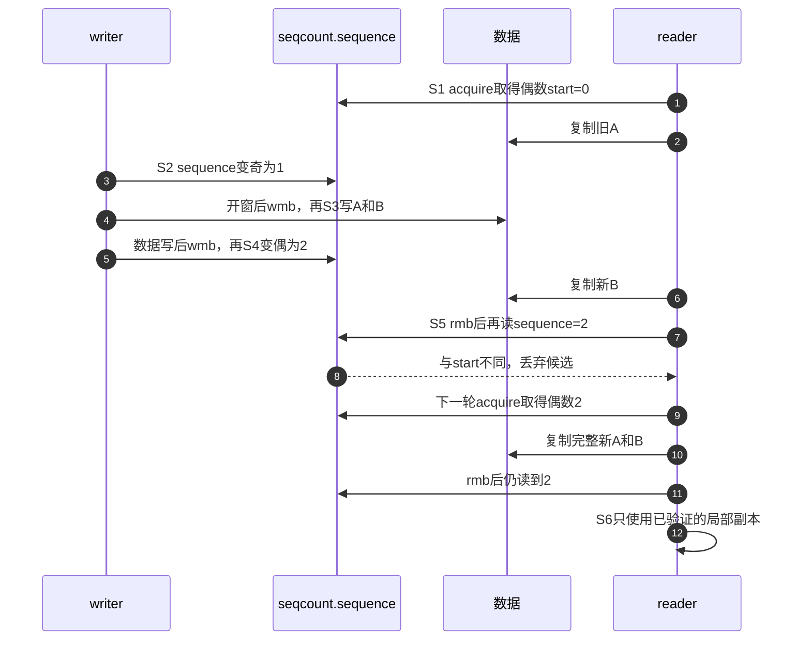

# 第3章\_seqcount读写路径与内存顺序

## 3.1\_为什么不能背成四个屏障

上一章的证明要求 sequence 与数据访问保持特定顺序，但 Linux 接口会随架构、工具插桩和变体调整。把实现简化成固定数量的 `smp_rmb()`/`smp_wmb()`，容易在使用 raw 变体、latch 或未来版本时套错。稳定规则是使用配对 API，并根据它的契约安排数据访问。

具体问题仍是同一对标量A、B：C枚举程序只允许写者按“开窗、写A、写B、关窗”推进，读者按“取起点、复制、验证”推进。真实机器要让编译器和硬件共同维持这些关系。若只保留计数而删掉顺序，程序源码看起来遵守阶段，另一CPU的观察却可能不符合证明前提。本章限定NXP linux-imx固定提交dfaf2136deb2af2e60b994421281ba42f1c087e0的Linux 6.12.20公共接口；不会从函数名推测其他版本或所有架构的指令序列。

## 3.2\_Linux\_6.12.20调用层次

`include/linux/seqlock.h` 中 `read_seqcount_begin()` 还会触发 lockdep reader access 和 KCSAN 原子区标记；`write_seqcount_begin()` 对关联锁变体执行持锁断言。检查状态和功能状态必须分开理解。

在本版本，plain seqcount的seqprop_sequence属性读取最终使用smp_load_acquire；稳定读取循环遇奇数就cpu_relax后重读，返回偶数后才开始复制。末尾read_seqcount_retry先smp_rmb，再通过READ_ONCE取sequence与start比较。写侧核心在奇数增量之后、数据写之前放smp_wmb，在数据写之后、偶数增量之前再放smp_wmb。这里列出的是本版本源码落点，不能改写成“所有版本都由四个独立屏障调用组成”。

共享功能状态是对象内的sequence及业务字段；start和候选快照只归读者自己。外部写者锁串行化更新，seqcount不会替调用者取得它。Lockdep记录检查关系，KCSAN标记被检查访问范围，它们不是业务锁，也不是使快照成立的硬件机制。尤其KCSAN读侧标记是有限访问预算，不等同于任何长度的任意读区自动免于竞争；关闭检查不意味着可以删掉顺序或串行化前提。

## 3.3\_内存顺序要排除哪两种坏结果

1. 开窗必须约束随后的字段写。若读者已经取得旧偶数0，又看到A=1、B=0，而末尾仍能把0当作有效版本证据，它就会错误接受混合值。仅仅在源码中先写sequence，不足以替代接口提供的顺序。
2. 关窗必须排在全部字段更新之后。若读者取得新偶数2，却仍能组合A=1、B=0，前后都见2也救不了这个快照。因此“发布稳定代际”必须连同此前数据写的顺序一起考虑。

读侧也必须防止数据复制跑到 begin 之前或 retry 之后。官方接口把这些约束封装在 sequence load、barrier 和原子标记中；调用者仍需用适合共享访问的读写方式，避免编译器把字段访问合并或凭空重读。

把四个方向连起来看：开始取证约束后面的复制，复制约束末尾取证；写者开窗约束后面的字段更新，字段更新约束关窗。这里的“原子标记”属于检查器建模，不能替代真实顺序原语。上一章单线程枚举没有模拟破坏这些方向的执行，零坏结果不能单独验证本章。

## 3.4\_完整通信时序

这里的箭头表示观察顺序，不表示 sequence 携带数据内容。硬件缓存一致性负责传播每个内存位置，内存序原语约束不同位置被观察的先后。

## 3.5\_raw变体为什么危险

raw不是一个统一的“去掉全部保护”开关。按固定头文件区分下列接口，才知道调用者接过了哪份责任。

| 接口 | 本版本保留的动作 | 省略或改变的动作 |
| --- | --- | --- |
| raw_read_seqcount_begin | acquire读取、等偶数、KCSAN读范围标记 | 不执行普通入口的Lockdep读访问检查 |
| raw_read_seqcount | 属性读取含acquire，保留KCSAN标记 | 不等待偶数，也不修改最低位；调用者须自己处理奇偶资格 |
| raw_seqcount_begin | 取得序号后清最低位，再交给末尾retry | 不在开头等偶数；若实际读到奇数，清位值与后续版本不等，拒绝本轮 |
| __read_seqcount_retry | 结束KCSAN读范围，读取并比较计数 | 不提供普通retry的smp_rmb，必须证明等价顺序来自哪里 |
| raw_write_seqcount_begin/end | 核心奇偶变化、写屏障及按属性处理抢占 | 省略普通入口的Lockdep检查/记账，不自动省去数据顺序 |

例如raw_seqcount_begin读到11却记录10，在没有完整回绕的前提下，末尾读11或后续12都不相等。它允许无效候选走到末尾，但绝不允许用这个办法解决单副本被NMI读者中断的问题：读者仍可能反复失败，写者仍被压在下面。头文件把它定位于读区很小且外部条件使成功概率高的特殊热路径，不是“不能等就换raw”的通用方案。

选择低层接口时应写明等价顺序、奇偶资格和检查责任分别在哪里落实。若不能指出具体约束，继续使用普通配对接口。

## 3.6\_write\_seqcount\_invalidate的不同语义

`write_seqcount_invalidate()` 让后续成功读区不再接受更早数据，Linux 6.12.20 中以屏障后 sequence 增加 2 实现。它不是一个普通多字段写窗口，也不替代 writer 串行化；使用前应先明确要建立的“旧快照失效”边界。

设读者已记录10，失效操作把sequence推进到12；还在进行的旧读区到末尾会比较失败。增加2保留奇偶性质，却没有把任意多字段修改包在奇数窗口内，所以不能用它给一串无保护更新“事后补票”。它也不追回已经验证并交付的旧副本，不取消读者已执行的动作。

复核练习：删去普通retry的读屏障后，哪一个方向失去保证？把raw_read_seqcount直接当作稳定起点，而不检查奇数，是否可能在写窗口中前后相等？如果只要求旧读区重试，为什么仍不能随意并发执行多个writer的失效与更新？回答时指出具体状态和顺序，不以“raw很危险”代替推导。

## 3.7\_源码入口

先进入[序列计数器源码总索引](../../../../../research/source_reading/sequence_counters/navigation/P01_Linux_6.12_序列计数器源码总阅读索引.md#1.1_版本边界与阅读任务)，再按[模块调用链](../../../../../research/source_reading/sequence_counters/navigation/P02_Linux_6.12_seqcount与seqlock模块源码概念导读.md#2.3_普通seqcount调用链)定位读写接口、关联锁属性和seqlock包装。已展开的具体实现见[`seqlock.h`读侧标题](../../../../../research/source_reading/sequence_counters/source_explanations/P01_Linux_6.12_seqlock_h读写与latch源码实现.md#1.3_普通读侧begin与retry)；本章raw差异直接核对固定头文件，不假称现有裁剪页已展开所有变体。更一般的release/acquire和屏障推导见[内存顺序专题](../memory_ordering/大纲.md)。本次为静态源码核对，未运行弱内存模型工具或目标内核。

## 3.8\_本章结论与下一问

普通 seqcount 通过配对接口建立顺序，但仍要求 writer 奇数窗口不可被读者无限抢占。若 NMI 必须在 writer 更新一半时读取，单副本模型不能保证它等到 writer 恢复；下一章用双副本 latch 改变这段因果链。

上一篇：[一致快照的证明模型](P02_一致快照的证明模型.md)。

下一篇：[seqcount_latch 双副本状态机](P04_seqcount_latch双副本状态机.md)。
