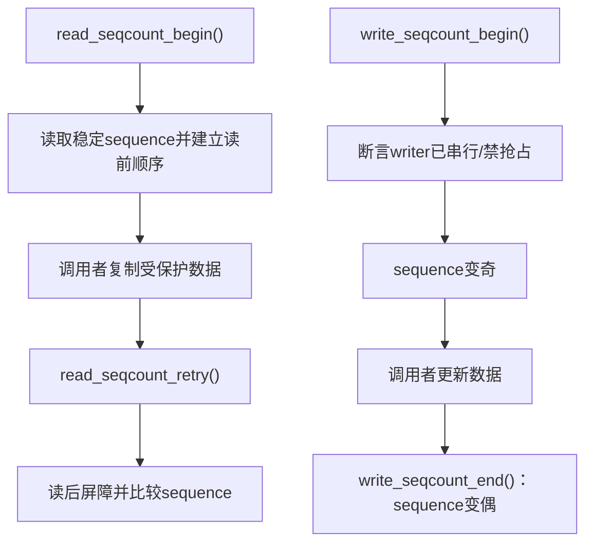
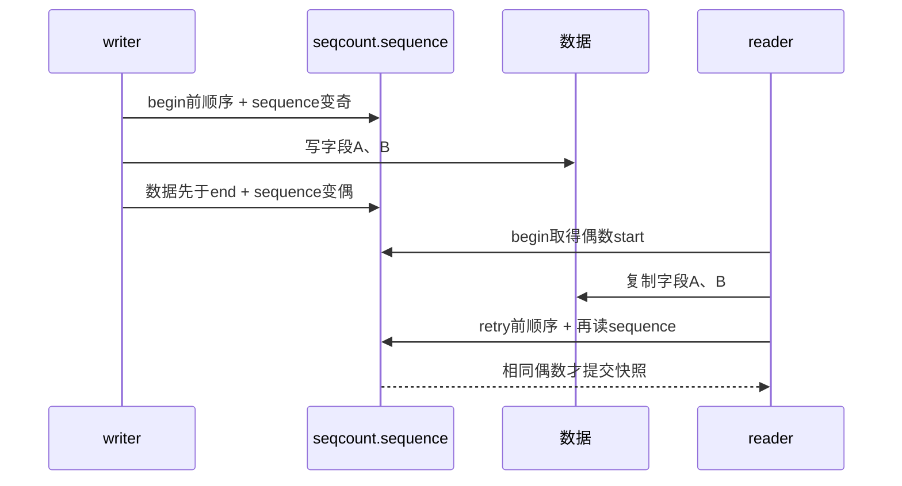

# 第3章\_seqcount读写路径与内存顺序

## 3.1\_为什么不能背成四个屏障

上一章的证明要求 sequence 与数据访问保持特定顺序，但 Linux 接口会随架构、工具插桩和变体调整。把实现简化成固定数量的 `smp_rmb()`/`smp_wmb()`，容易在使用 raw 变体、latch 或未来版本时套错。稳定规则是使用配对 API，并根据它的契约安排数据访问。

## 3.2\_Linux\_6.12.20调用层次

`include/linux/seqlock.h` 中 `read_seqcount_begin()` 还会触发 lockdep reader access 和 KCSAN 原子区标记；`write_seqcount_begin()` 对关联锁变体执行持锁断言。检查状态和功能状态必须分开理解。

## 3.3\_内存顺序要排除哪两种坏结果

1. writer 的数据写不能被观察为越过“奇数开窗”之前，否则读者可能在看见偶数时已经读到部分新数据。
2. “偶数关窗”不能先于全部数据写对其他 CPU 可见，否则读者可能看到新偶数却仍复制到旧/新混合字段。

读侧也必须防止数据复制跑到 begin 之前或 retry 之后。官方接口把这些约束封装在 sequence load、barrier 和原子标记中；调用者仍需用适合共享访问的读写方式，避免编译器把字段访问合并或凭空重读。

## 3.4\_完整通信时序

这里的箭头表示观察顺序，不表示 sequence 携带数据内容。硬件缓存一致性负责传播每个内存位置，内存序原语约束不同位置被观察的先后。

## 3.5\_raw变体为什么危险

raw 读写接口会跳过部分 lockdep、奇数等待或屏障，目的是让已经自行建立等价约束的底层代码避免重复成本。使用者必须逐项证明缺失的检查和顺序由什么替代。普通驱动和新代码应从非 raw 接口开始，而不是把 raw 当快速版本。

`raw_seqcount_begin()` 一类接口在奇数值上可能直接返回，让末尾 retry 必然失败；这适合不能在 begin 处等待的特殊路径，却会增加一次无效复制。选择它必须基于执行上下文，而不是命名偏好。

## 3.6\_write\_seqcount\_invalidate的不同语义

`write_seqcount_invalidate()` 让后续成功读区不再接受更早数据，Linux 6.12.20 中以屏障后 sequence 增加 2 实现。它不是一个普通多字段写窗口，也不替代 writer 串行化；使用前应先明确要建立的“旧快照失效”边界。

## 3.7\_源码入口

读写接口、关联锁属性和 seqlock 包装的阅读顺序见[序列计数器模块源码概念导读](../../../../../research/source_reading/sequence_counters/navigation/P02_Linux_6.12_seqcount与seqlock模块源码概念导读.md#2.3_普通seqcount调用链)。裁剪实现统一见[`seqlock.h` 读写与 latch 源码实现](../../../../../research/source_reading/sequence_counters/source_explanations/P01_Linux_6.12_seqlock_h读写与latch源码实现.md#1.3_普通读侧begin与retry)。更一般的 release/acquire 和屏障推导见[内存顺序专题](../memory_ordering/大纲.md)。

## 3.8\_本章结论与下一问

普通 seqcount 通过配对接口建立顺序，但仍要求 writer 奇数窗口不可被读者无限抢占。若 NMI 必须在 writer 更新一半时读取，单副本模型不能保证它等到 writer 恢复；下一章用双副本 latch 改变这段因果链。

上一篇：[一致快照的证明模型](P02_一致快照的证明模型.md)。

下一篇：[seqcount_latch 双副本状态机](P04_seqcount_latch双副本状态机.md)。
