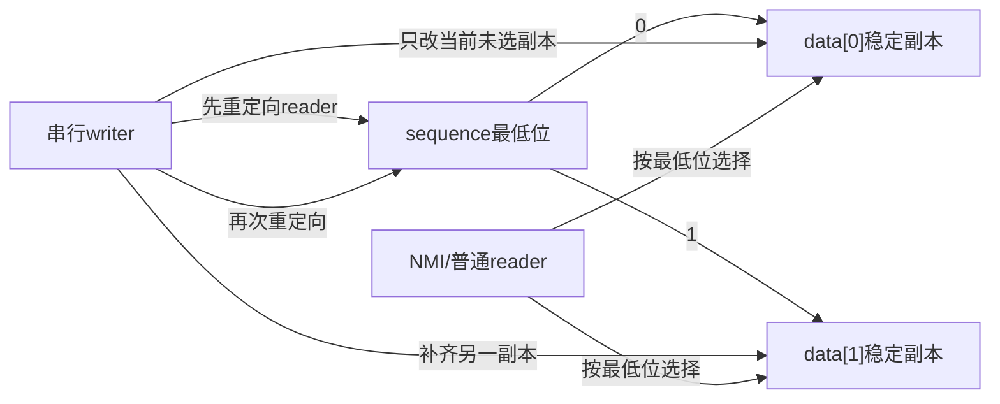
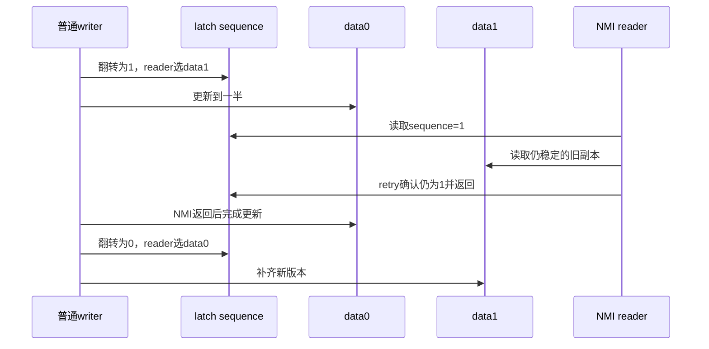

# 第4章\_seqcount\_latch双副本状态机

## 4.1\_普通seqcount在NMI下的缺口

普通 seqcount 遇到奇数 sequence 时要等待 writer 结束或反复重试。若 writer 在当前 CPU 被 NMI 打断，NMI reader 又等待这个 writer 把 sequence 改回偶数，writer 只有等 NMI 返回后才能继续，形成自等待。问题不在内存屏障，而在单副本更新期间没有任何稳定副本可供不可延迟 reader 使用。

## 4.2\_双副本从哪里换来进展

`seqcount_latch_t` 维护两份数据。sequence 最低位不再只表示“写入中”，还选择 reader 当前应该读哪一份稳定副本。writer 先把 reader 导向副本 1，再更新副本 0；然后导向副本 0，再更新副本 1。

被移除的“writer 不可被 reader 打断”约束由双倍存储、两次更新和重定向屏障替代。

## 4.3\_S0到S6状态周期

| 阶段 | sequence选择 | writer动作 | reader可用副本 |
| --- | --- | --- | --- |
| S0 初始稳定 | 0 | 两副本一致 | data[0] |
| S1 第一次翻转 | 1 | 发布重定向 | data[1] |
| S2 更新副本0 | 1 | 非原子修改 data[0] | data[1] 仍稳定 |
| S3 第二次翻转 | 0 | 发布已完成的 data[0] | data[0] |
| S4 更新副本1 | 0 | 非原子修改 data[1] | data[0] 仍稳定 |
| S5 结束 | 0 | 两副本再次一致 | data[0] |
| S6 reader验证 | 前后完整 sequence 相同 | 无 | 接受，否则重试 |

## 4.4\_writer被NMI打断的时序

NMI 允许返回旧快照，但不会读到 writer 正在改的副本。若 sequence 在 NMI 期间变化，末尾 retry 仍会拒绝快照。

## 4.5\_双副本不等于双生命周期

如果副本包含指向动态对象的指针，复制两份指针并不会复制对象生命期。writer 删除对象时，reader 即使选择“稳定”副本也可能解引用已释放对象。Linux 头文件明确要求动态结构仍用 RCU 等模式管理条目生命期。

同样，两个副本的更新函数必须能在两份数据上安全执行，并由外部机制串行化多个 writer。latch 解决 reader 中断 writer，不解决 writer/write 冲突。

## 4.6\_什么时候不该使用latch

- reader 不会中断 writer，普通 seqcount 更简单且只需一份数据；
- 数据体积大或更新成本高，双存储和双更新不可接受；
- writer 很频繁，reader 仍可能因为两次翻转而重试；
- 数据包含复杂可变图和独立对象生命期，RCU/不可变版本更合适；
- reader 需要阻止 writer 或执行不可回滚操作，应使用锁。

## 4.7\_源码入口

Linux 6.12.20 中 `seqcount_latch_t`、`read_seqcount_latch()`、`write_seqcount_latch_begin/write/end()` 位于 `include/linux/seqlock.h`。模块关系见[seqcount 与 seqlock 模块源码概念导读](../../../../../research/source_reading/sequence_counters/navigation/P02_Linux_6.12_seqcount与seqlock模块源码概念导读.md#2.5_latch双副本分支)，唯一裁剪实现见[`seqlock.h` 读写与 latch 源码实现](../../../../../research/source_reading/sequence_counters/source_explanations/P01_Linux_6.12_seqlock_h读写与latch源码实现.md#1.6_latch重定向与双副本更新)。

## 4.8\_本章结论与下一问

latch 用存储和两次更新换取 writer 可被 NMI reader 打断的进展性。下一章回到普通 seqcount，解释带关联锁的类型怎样验证 writer 串行化，以及 PREEMPT_RT 为什么在读到奇数时可能主动触碰关联锁。

上一篇：[seqcount 读写路径与内存顺序](P03_seqcount读写路径与内存顺序.md)。

下一篇：[关联锁变体与实时性边界](P05_关联锁变体与实时性边界.md)。
