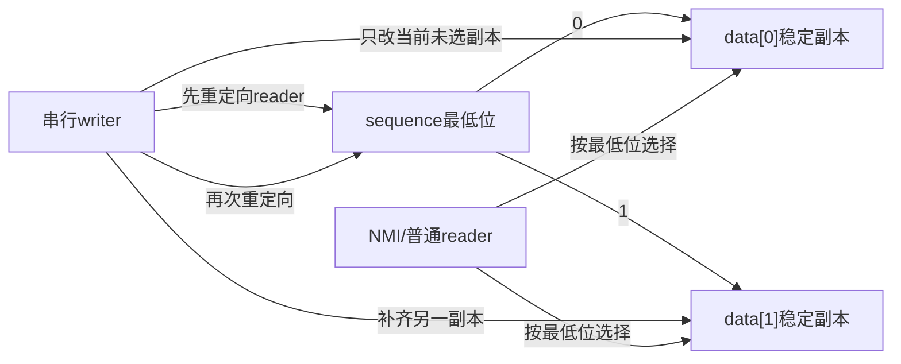
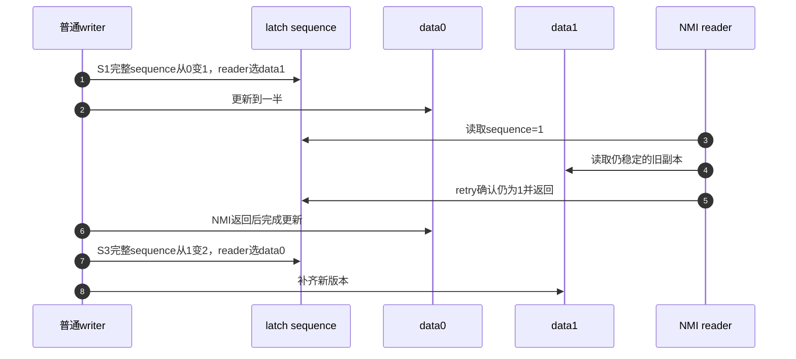

# 第4章\_seqcount\_latch双副本状态机

## 4.1\_普通seqcount在NMI下的缺口

上一章的顺序原语可以排除错误接受，却不能让暂停的写者执行。普通seqcount遇奇数sequence时要等写者结束或反复重试。如果同CPU写者刚改完参数A、还没改B，就被不可屏蔽中断（NMI，Non-Maskable Interrupt）打断，NMI读者可能需要这些参数来采集诊断信息。它若等写者恢复偶数，写者又只能在NMI返回后继续，便形成自等待。

普通自旋等待没有丢通知，也不是再加屏障就能解决：当前可供读取的唯一数据副本正在修改。新的设计目标不是让NMI完成最新更新，而是让它可以立即取得某个稳定旧版本。以下是通用机制和固定头文件契约，不表示当前目标板已经运行该NMI场景。

## 4.2\_双副本从哪里换来进展

调用者在业务对象中保存data[0]、data[1]两份数据，seqcount_latch_t本身只保存序列计数，不分配或复制业务副本。sequence最低位选择新读者应读哪一份；完整sequence仍用于判断复制期间有没有跨过重定向。奇数在这里可以是合法读起点，不能沿用普通seqcount“奇数就等”的规则。

初始两份都是完整旧版本，sequence为0。写者先把新读者导向副本1，才逐字段更新副本0；副本0完成后再导向它，然后更新副本1。写者之间仍由外部锁或单写者协议串行，读者只把选中的字段复制到自己的局部副本，最后验证完整序号。



被移除的“writer 不可被 reader 打断”约束由双倍存储、两次更新和重定向屏障替代。

## 4.3\_S0到S6状态周期

| 阶段 | sequence选择 | writer动作 | reader可用副本 |
| --- | --- | --- | --- |
| S0 初始稳定 | 0 | 两副本一致 | data[0] |
| S1 第一次翻转 | 1 | 完整sequence从2n变2n+1，发布重定向 | data[1] |
| S2 更新副本0 | 1 | 非原子修改 data[0] | data[1] 仍稳定 |
| S3 第二次翻转 | 0 | 完整sequence从2n+1变2n+2，发布已完成的data[0] | data[0] |
| S4 更新副本1 | 0 | 非原子修改 data[1] | data[0] 仍稳定 |
| S5 结束 | 0 | 两副本再次一致 | data[0] |
| S6 reader验证 | 前后完整 sequence 相同 | 无 | 接受，否则重试 |

表中的选择0/1不是把计数重置为0/1，而是完整计数的最低位。固定Linux接口中write_seqcount_latch_begin承担S1，write_seqcount_latch承担S3；两次业务更新由调用者执行。write_seqcount_latch_end在S5结束检查器写区标记，不进行第三次翻转。每次重定向的写屏障分别约束前面的副本完成和后面的另一副本更新，读侧还要保留依赖选择和末尾验证的顺序。

## 4.4\_writer被NMI打断的时序



这个时序限定NMI打断同CPU写者，并且外部串行保证没有第二个写者继续修改；暂停期间sequence不变，NMI能从data1取得完整旧快照。若读者与写者真正跨CPU并行，则不能承诺“它绝不会接触正在改的副本”：读者可能在重定向前已经选好data0，暂停后恢复时写者正在改data0。此时仍靠完整序号验证拒绝候选。

例如读者起点为0、从data0读到旧A；写者依次完成两次翻转，sequence变2并改好data0；读者又读到新B。只比较最低位会看到0和0而误收混合值，比较完整0和2才会拒绝。这也是双副本仍需retry的原因，并非每份数据永远有一个独占读者保护。

### 4.4.1\_用C区分暂停写者与跨CPU交错

下面仍使用单线程有序模型。第一组把写者停在六个动作前后共七个位置，检查此时选中副本始终完整；第二组枚举六个写动作和四个读动作的210种交错，对比完整计数与最低位验证。它模拟访问顺序，不运行真实NMI、线程或Linux屏障。

```c
#include <assert.h>
#include <stdbool.h>
#include <stdio.h>

struct latch_state {
    unsigned sequence;
    unsigned a[2];
    unsigned b[2];
    unsigned start;
    unsigned end;
    unsigned index;
    unsigned copy_a;
    unsigned copy_b;
};

struct totals {
    unsigned schedules;
    unsigned full_mixed;
    unsigned bit_mixed;
};

/* 写者总是先改变选择，再逐字段更新未被新读者选择的副本。 */
static struct latch_state write_step(struct latch_state state, unsigned step)
{
    switch (step) {
    case 0: state.sequence++; break;
    case 1: state.a[0] = 1; break;
    case 2: state.b[0] = 1; break;
    case 3: state.sequence++; break;
    case 4: state.a[1] = 1; break;
    case 5: state.b[1] = 1; break;
    }
    return state;
}

/* 保持双方动作的内部次序，只枚举一轮交错，不创建线程。 */
static void explore(unsigned writer_step, unsigned reader_step,
                    struct latch_state state, struct totals *totals)
{
    if (writer_step == 6u && reader_step == 4u) {
        bool mixed = state.copy_a != state.copy_b;
        totals->schedules++;
        if (mixed && state.start == state.end)
            totals->full_mixed++;
        if (mixed && (state.start & 1u) == (state.end & 1u))
            totals->bit_mixed++;
        return;
    }
    if (writer_step < 6u)
        explore(writer_step + 1u, reader_step,
                write_step(state, writer_step), totals);
    if (reader_step < 4u) {
        struct latch_state next = state;
        switch (reader_step) {
        case 0:
            next.start = next.sequence;
            next.index = next.start & 1u;
            break;
        case 1: next.copy_a = next.a[next.index]; break;
        case 2: next.copy_b = next.b[next.index]; break;
        case 3: next.end = next.sequence; break;
        }
        explore(writer_step, reader_step + 1u, next, totals);
    }
}

int main(void)
{
    struct latch_state state = {0};
    struct totals totals = {0};
    unsigned paused_windows = 0;

    /* 同CPU读者打断写者时，写者暂停，验证当前选中副本完整。 */
    for (unsigned step = 0; step <= 6u; step++) {
        unsigned index = state.sequence & 1u;
        assert(state.a[index] == state.b[index]);
        paused_windows++;
        if (step < 6u)
            state = write_step(state, step);
    }
    state = (struct latch_state){0};
    explore(0, 0, state, &totals);
    assert(totals.schedules == 210u);
    assert(totals.full_mixed == 0u);
    assert(totals.bit_mixed > 0u);
    printf("paused_windows=%u schedules=%u full_mixed=%u bit_mixed=%u\n",
           paused_windows, totals.schedules,
           totals.full_mixed, totals.bit_mixed);
    return 0;
}
```

保存为latch_model.c，用`cc -std=c11 -Wall -Wextra -Werror -O2 latch_model.c -o latch_model`编译并运行。宿主GCC14.2和Clang18.1.8本轮输出一致：

```text
paused_windows=7 schedules=210 full_mixed=0 bit_mixed=21
```

最低位比较错误接受21条混合候选，完整计数比较没有接受它们。练习先预测再改：把第二次sequence增加删除，会不会把错误藏在“总选data1”中？若删去第一次增加，写者开始修改data0时暂停，读者选中的副本是否仍完整？解释为何这两个修改都破坏了阶段协议，即使某个单次最终结果恰好相等。真实系统还要证明内存顺序、写者串行及无完整回绕，本程序没有覆盖它们。

## 4.5\_双副本不等于双生命周期

如果副本包含指向动态对象的指针，复制两份指针并不会复制对象生命期。writer 删除对象时，reader 即使选择“稳定”副本也可能解引用已释放对象。Linux 头文件明确要求动态结构仍用 RCU 等模式管理条目生命期。

同样，两个副本的更新函数必须能在两份数据上安全执行，并由外部机制串行化多个 writer。latch 解决 reader 中断 writer，不解决 writer/write 冲突。

## 4.6\_什么时候不该使用latch

- reader 不会中断 writer，普通 seqcount 更简单且只需一份数据；
- 数据体积大或更新成本高，双存储和双更新不可接受；
- writer 很频繁，reader 仍可能因为两次翻转而重试；
- 数据包含复杂可变图和独立对象生命期，RCU/不可变版本更合适；
- reader 需要阻止 writer 或执行不可回滚操作，应使用锁。

## 4.7\_源码入口

Linux 6.12.20中seqcount_latch_t、read_seqcount_latch和write_seqcount_latch_begin/write/end位于include/linux/seqlock.h。先从[版本总索引](../../../../../research/source_reading/sequence_counters/navigation/P01_Linux_6.12_序列计数器源码总阅读索引.md#1.1_版本边界与阅读任务)确认固定提交，再进入[模块关系](../../../../../research/source_reading/sequence_counters/navigation/P02_Linux_6.12_seqcount与seqlock模块源码概念导读.md#2.5_latch双副本分支)及[唯一裁剪实现](../../../../../research/source_reading/sequence_counters/source_explanations/include/linux/seqlock.h.md#1.6_latch重定向与双副本更新)。本次静态核对头文件并运行有序C模型，没有执行目标NMI、内核并发或弱内存模型工具。

## 4.8\_本章结论与下一问

latch 用存储和两次更新换取 writer 可被 NMI reader 打断的进展性。下一章回到普通 seqcount，解释带关联锁的类型怎样验证 writer 串行化，以及 PREEMPT_RT 为什么在读到奇数时可能主动触碰关联锁。

上一篇：[seqcount 读写路径与内存顺序](P03_seqcount读写路径与内存顺序.md)。

下一篇：[关联锁变体与实时性边界](P05_关联锁变体与实时性边界.md)。
