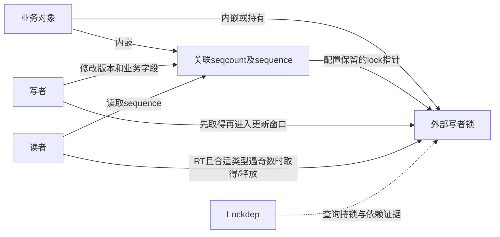
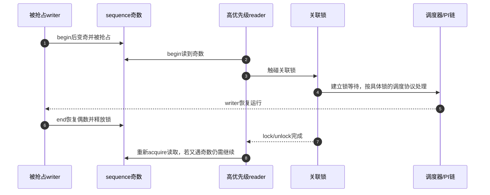

# 第5章\_关联锁变体与实时性边界

## 5.1\_关联锁不是自动加锁

前两章分别用顺序协议保证快照，用双副本处理读者打断写者。现在回到单副本：若工程已经用mutex或spinlock串行写者，seqcount怎样知道这个外部约定？答案是关联锁类型把锁的身份和类型交给接口，使它可以检查持锁条件，并在特定配置下处理进展。

seqcount_spinlock_t、seqcount_mutex_t等类型内嵌实际seqcount；是否保存外部锁指针取决于配置。固定Linux 6.12.20中，CONFIG_LOCKDEP或CONFIG_PREEMPT_RT任一开启便保留指针，两者都关闭时字段可被省略。初始化建立关联，但调用者仍须先取得写者锁，再进入write_seqcount_begin/end。不会因为传入了锁地址，接口便自动执行写侧spin_lock或mutex_lock。

## 5.2\_状态分层

| 层 | 状态 | 功能 |
| --- | --- | --- |
| 业务层 | 被保护字段 | reader 要取得一致快照 |
| seqcount 层 | `sequence` | 标记稳定代际与更新窗口 |
| writer 锁层 | spinlock/rwlock/mutex | 串行多个 writer |
| 关联层 | 指向外部锁的指针，按配置存在 | Lockdep查询持锁状态；RT读侧也可能实际获取/释放这把锁 |
| 检查层 | 条件存在的dep_map及检查器状态 | 验证已执行的写侧契约，不替代真实加锁 |
| 配置层 | PREEMPT_RT分支及锁类型属性 | 决定采用写侧抢占保护还是读侧锁等待补偿 |

不能把关联指针全部归为“只用于调试”：RT读者会沿这个地址真正参与锁协议。检查器可以关闭，RT补偿仍有功能意义；反过来，保留关联指针也不修复调用者漏拿写锁、错选对象或对象已经释放的问题。

## 5.3\_PREEMPT\_RT的奇数reader补偿

普通模型要求 writer 在奇数窗口不可被抢占。但 PREEMPT_RT 下 `spinlock_t`/`rwlock_t` 可能成为可调度锁，mutex 本来就可抢占。Linux 6.12.20 的关联锁属性读取路径在 RT 配置下发现奇数 sequence 且关联锁可抢占时，会执行一次关联锁的 lock/unlock：

读者等待锁时让出CPU执行机会，写者因而有机会跑完持锁窗口并释放；支持优先级继承的具体锁还可以通过持有者关系处理优先级反转，但不能由这段seqcount代码保证所有锁的统一调度时限。reader取得后立即释放锁，再读sequence；复制区不在这把锁内，之后的新writer仍可使它重试。

若第二个writer在读者释放锁后进入，重新读到的仍可能是奇数，所以图中不能写成“一次lock/unlock保证返回稳定值”。这是缓解被读者压住的writer无法推进，不是无条件的读者等待上界。raw_spinlock关联的写者本就不可抢占，不走这一分支；非RT配置则按锁类型在写侧满足不可抢占要求。

| 阶段 | 地址与动作 | 对下一阶段的保证 |
| --- | --- | --- |
| S0关联 | 构造者初始化sequence，并在配置需要时保存lock指针 | 外部锁与关联对象共同存活 |
| S1串行 | writer取得外部锁 | 其他writer不得进入 |
| S2开窗 | writer按类型/配置处理抢占，再把sequence变奇 | 普通读者不能接受当前候选 |
| S3取证 | reader acquire读取同一sequence | 偶数直接复制；RT适用类型奇数转S4 |
| S4补偿 | reader沿关联指针等待并释放外部锁 | 让旧writer有机会完成，而非锁住读区 |
| S5关窗 | writer完成字段，恢复偶数并释放外部锁 | 后续读者可以观察完整版本 |
| S6重读 | reader再次读版本，再复制和retry | 后续writer仍可能使本轮失败 |

这组阶段说明“外部锁—版本—调度”协作，不替换前章的字段一致性周期；S3可发生在S2前后，S4只属于相应配置的慢路径。

## 5.4\_选择关联类型

| writer 串行机制 | 关联类型 | 仍需调用者保证 |
| --- | --- | --- |
| raw spinlock | `seqcount_raw_spinlock_t` | 正确取得 raw 锁和 IRQ 约束 |
| spinlock | `seqcount_spinlock_t` | 持锁，读者上下文不能造成未处理重入 |
| rwlock | `seqcount_rwlock_t` | 使用规定的 writer/关联侧锁法 |
| mutex | `seqcount_mutex_t` | mutex 只串行 writer；写窗口和读者上下文仍需核对 |
| 单一 writer/外部协议 | plain `seqcount_t` | 自行证明串行、禁抢占和调试覆盖 |

若 writer 已经用 spinlock 串行，`seqlock_t` 可以直接封装 seqcount 与锁；需要独立锁对象、特殊锁类型或更清晰的结构所有权时，关联 seqcount 更灵活。

固定版本中，非RT下mutex关联的写侧包装会显式关闭/恢复抢占，而raw_spinlock、spinlock及rwlock的对应属性依赖其非RT锁语义；RT下关联属性不再统一包住写窗口禁抢占，而是对可抢占类型采用前述读侧锁补偿。plain seqcount没有这种外部锁指针，自行串行和不可抢占的责任仍在调用者。类型名应与实际持有的锁一致，不能为了得到某个属性把mutex伪装成raw锁。

练习沿用第1章对象：若把writer_lock改为mutex，却保留plain seqcount和原调用顺序，哪个前提不再由锁本身满足？再换成seqcount_mutex_t并建立关联，分别说明非RT和RT配置由哪条路径补偿。最后让读者进入NMI，指出为什么这不是再改一个类型名就能解决的问题。

## 5.5\_中断上下文仍要单独推导

关联锁不能自动判断 hardirq/softirq/NMI reader 是否会在同一 CPU 打断 writer。若 writer 用普通 mutex，NMI reader 不能靠睡眠锁等待；这种场景应重新设计为 latch、raw 上下文协议或不在 NMI 读取。若 writer 用 spinlock，还要使用与 reader/其他 writer 上下文匹配的 `_irqsave` 或 `_bh` 变体。

## 5.6\_源码入口

先从[版本总索引](../../../../../research/source_reading/sequence_counters/navigation/P01_Linux_6.12_序列计数器源码总阅读索引.md#1.1_版本边界与阅读任务)进入固定NXP提交。include/linux/seqlock_types.h控制关联字段是否保留，include/linux/seqlock.h生成sequence读取、抢占属性、持锁断言和RT补偿。关系见[模块导读](../../../../../research/source_reading/sequence_counters/navigation/P02_Linux_6.12_seqcount与seqlock模块源码概念导读.md#2.4_关联锁与PREEMPT_RT)，真实生成宏见[关联属性实现](../../../../../research/source_reading/sequence_counters/source_explanations/include/linux/seqlock.h.md#1.5_关联锁属性与RT补偿)。本章静态核对两份固定头文件，未运行PREEMPT_RT或测量最坏等待时间。

## 5.7\_本章结论与下一问

关联锁把 writer 串行化契约变成可验证状态，并在 RT 配置下为被抢占 writer 提供进展路径，但不替调用者获取锁，也不保护对象生命期。最后一章用误用和选择核对表明确 seqcount 的工程边界。

上一篇：[seqcount_latch 双副本状态机](P04_seqcount_latch双副本状态机.md)。

下一篇：[生命周期、误用诊断与选型](P06_生命周期误用诊断与选型.md)。
