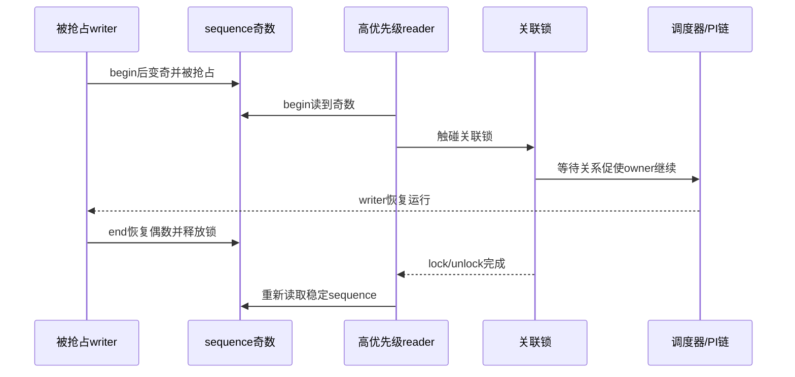

# 第5章\_关联锁变体与实时性边界

## 5.1\_关联锁不是自动加锁

`seqcount_spinlock_t`、`seqcount_mutex_t` 等类型保存一个指向 writer 串行锁的关联。初始化关联关系后，`write_seqcount_begin()` 可以让 Lockdep 断言调用者已经持锁；对于不能隐式关闭抢占的锁类型，包装还可补上写窗口需要的抢占约束。它不会替调用者执行 `spin_lock()` 或 `mutex_lock()`。

## 5.2\_状态分层

| 层 | 状态 | 功能 |
| --- | --- | --- |
| 业务层 | 被保护字段 | reader 要取得一致快照 |
| seqcount 层 | `sequence` | 标记稳定代际与更新窗口 |
| writer 锁层 | spinlock/rwlock/mutex | 串行多个 writer |
| 检查层 | 关联锁指针和 dep_map | 验证写侧契约 |
| 配置层 | PREEMPT_RT 分支 | 处理可抢占 writer 与 reader 进展 |

只有前三层形成正常功能正确性；Lockdep 关闭或路径未执行时，关联指针不会自动修复错误协议。

## 5.3\_PREEMPT\_RT的奇数reader补偿

普通模型要求 writer 在奇数窗口不可被抢占。但 PREEMPT_RT 下 `spinlock_t`/`rwlock_t` 可能成为可调度锁，mutex 本来就可抢占。Linux 6.12.20 的关联锁属性读取路径在 RT 配置下发现奇数 sequence 且关联锁可抢占时，会执行一次关联锁的 lock/unlock：

这不是 reader 取得业务锁来保护整个复制区，而是在 begin 处帮助被抢占 writer 推进到稳定点。非 RT 配置和 raw spinlock 关联不需要同样补偿。

## 5.4\_选择关联类型

| writer 串行机制 | 关联类型 | 仍需调用者保证 |
| --- | --- | --- |
| raw spinlock | `seqcount_raw_spinlock_t` | 正确取得 raw 锁和 IRQ 约束 |
| spinlock | `seqcount_spinlock_t` | 持锁，读者上下文不能造成未处理重入 |
| rwlock | `seqcount_rwlock_t` | 使用规定的 writer/关联侧锁法 |
| mutex | `seqcount_mutex_t` | mutex 只串行 writer；写窗口和读者上下文仍需核对 |
| 单一 writer/外部协议 | plain `seqcount_t` | 自行证明串行、禁抢占和调试覆盖 |

若 writer 已经用 spinlock 串行，`seqlock_t` 可以直接封装 seqcount 与锁；需要独立锁对象、特殊锁类型或更清晰的结构所有权时，关联 seqcount 更灵活。

## 5.5\_中断上下文仍要单独推导

关联锁不能自动判断 hardirq/softirq/NMI reader 是否会在同一 CPU 打断 writer。若 writer 用普通 mutex，NMI reader 不能靠睡眠锁等待；这种场景应重新设计为 latch、raw 上下文协议或不在 NMI 读取。若 writer 用 spinlock，还要使用与 reader/其他 writer 上下文匹配的 `_irqsave` 或 `_bh` 变体。

## 5.6\_源码入口

Linux 6.12.20 在 `include/linux/seqlock.h` 通过 `SEQCOUNT_LOCKNAME()` 生成关联类型属性：sequence load、是否可抢占、持锁断言和 RT 下 lock/unlock 补偿。完整关系见[seqcount 与 seqlock 模块源码概念导读](../../../../../research/source_reading/sequence_counters/navigation/P02_Linux_6.12_seqcount与seqlock模块源码概念导读.md#2.4_关联锁与PREEMPT_RT)，唯一实现见[`seqlock.h` 读写与 latch 源码实现](../../../../../research/source_reading/sequence_counters/source_explanations/P01_Linux_6.12_seqlock_h读写与latch源码实现.md#1.5_关联锁属性与RT补偿)。

## 5.7\_本章结论与下一问

关联锁把 writer 串行化契约变成可验证状态，并在 RT 配置下为被抢占 writer 提供进展路径，但不替调用者获取锁，也不保护对象生命期。最后一章用误用和选择核对表明确 seqcount 的工程边界。

上一篇：[seqcount_latch 双副本状态机](P04_seqcount_latch双副本状态机.md)。

下一篇：[生命周期、误用诊断与选型](P06_生命周期误用诊断与选型.md)。
