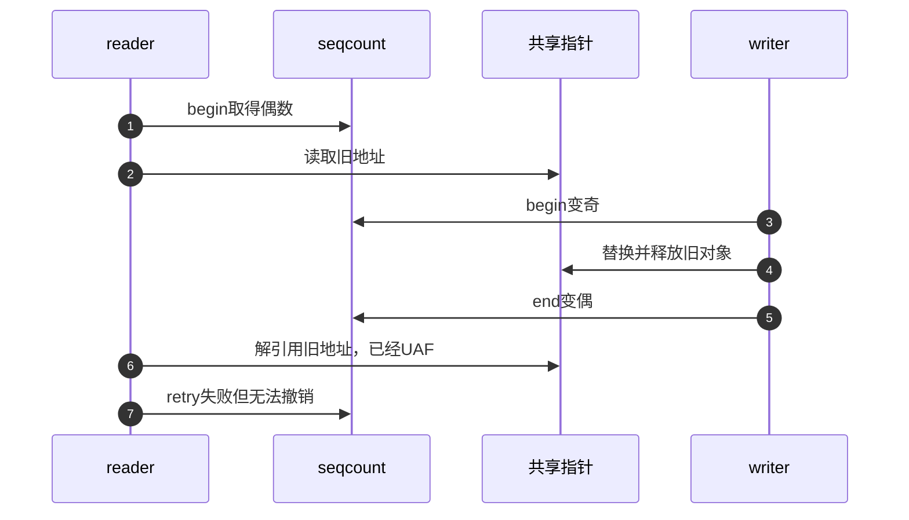
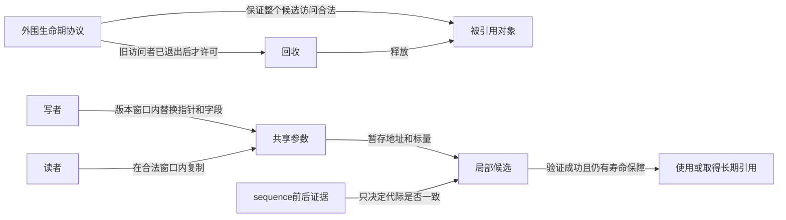

# 第6章\_生命周期误用诊断与选型

## 6.1\_最危险的误解是\_验证失败就什么都没发生

retry 只能拒绝读者尚未提交的本地结果，不能撤销已经发生的解引用、I/O、引用计数修改或资源释放。设计读区时应先列出每一步是否可丢弃，再决定哪些动作必须移到验证成功以后。

前五章已经分别证明版本取证、访问顺序、双副本和特定配置的进展，本章把它们用于最后的工程选择。仍以读取参数为例：复制两个内嵌整数可以丢弃，打印一次设备命令、递交一项请求或给任意旧指针加引用却不是同一类动作。先划出“安全观察—验证—提交使用”的边界，才有资格用重试代替读锁。

## 6.2\_指针生命周期反例



解决方式不是“更早 retry”，而是让旧对象在整个读区内仍存活，例如 RCU、引用计数或覆盖解引用的锁。seqcount 可验证指针与旁边标量属于同一发布代际，但生命期必须由组合机制证明。

尤其不能在取得裸指针之后直接kref_get，就声称已解决寿命：如果对象在加引用前已经释放，增加计数本身也是失效访问。正确组合需要先有合法访问窗口，例如在匹配的RCU读侧及回收协议中查找，再按对象协议取得可长期持有的引用；或在覆盖查找、取得及回收的同一锁下建立引用。具体取得协议进入[kref专题](../../../object_lifetime/kref/大纲.md)，不要把引用计数接口当作任意地址验证器。



## 6.3\_回绕和长读区

sequence是有限宽度无符号整数。普通写周期增加两次，所以宽度为w时，完成2^(w-1)次更新便会回到同一偶数。若读者从begin到retry之间停顿这么久，前后相等不再能排除完整回绕。条件式估算应使用读区最坏停顿时间T和最坏更新速率F，证明F×T显著小于2^(w-1)，而不是只看日常平均读时延。

例如32位计数每秒一百万次完整更新，回到同一偶数约需2147秒，即35.8分钟。这个数字通常远长于正常短读区，却不是无限；冻结单个读者而其他CPU写者继续运行，才可能消耗这段预算。若整台虚拟机的所有参与者一起暂停，暂停时计数也没有前进，不能把墙上时钟停顿直接等价成序号回绕。缩窄模型计数可以很快观察同一个问题。

### 6.3.1\_用8位模型重现回绕误收

下面不是建议把内核计数改为8位，而是把同一证明缺口压缩到128次更新。读者先复制旧A，暂停期间写者完成128轮，再复制新B；程序没有并发数据竞争，却能产生前后计数相等的混合候选。

```c
#include <assert.h>
#include <stdint.h>
#include <stdio.h>

int main(void)
{
    uint8_t sequence = 0;
    unsigned a = 0, b = 0;
    unsigned start = sequence;
    unsigned copy_a = a;

    /* 模拟读者暂停，但写者仍继续更新；转换明确按8位回绕。 */
    for (unsigned update = 1; update <= 128u; update++) {
        sequence = (uint8_t)(sequence + 1u);
        a = update;
        b = update;
        sequence = (uint8_t)(sequence + 1u);
    }
    unsigned copy_b = b;
    unsigned end = sequence;
    assert(a == b); /* 当前共享版本本身是完整的。 */
    assert(start == end && (start & 1u) == 0u);
    assert(copy_a != copy_b); /* 但停顿读者的候选属于两个版本。 */
    printf("start=%u end=%u candidate=(%u,%u)\n",
           start, end, copy_a, copy_b);
    return 0;
}
```

保存为wrap_model.c，用`cc -std=c11 -Wall -Wextra -Werror -O2 wrap_model.c -o wrap_model`编译运行。预期输出`start=0 end=0 candidate=(0,128)`。把更新次数先改成127并相应调整断言，再预测start与end是否相同；这说明安全性依赖可证明的跨度约束，不是偶数比较本身永远正确。模型没有模拟真实调度或内存顺序。

## 6.4\_进展与饥饿诊断

| 现象 | 先检查的因果链 | 可能改进 |
| --- | --- | --- |
| reader 重试激增 | writer 频率、写窗口长度、reader 复制量 | 缩短窗口、分拆状态、改用锁/RCU |
| 高优先级 reader 卡在奇数 | writer 是否被抢占、关联锁与 RT 分支 | 禁抢占、使用关联类型或 latch |
| 偶发坏快照 | writer 是否全部串行、是否绕过 API | 收敛 writer 锁并加入断言 |
| KCSAN/Lockdep 告警 | 访问是否在 seqcount 区域、writer 锁是否持有 | 修正协议，不能只抑制告警 |
| UAF | 指针对象如何回收 | 增加 RCU/kref/锁生命期协议 |

## 6.5\_工具证据边界

Linux 6.12.20的seqcount接口会向KCSAN标记有限访问范围，关联类型可让Lockdep验证writer锁。只有相关配置启用、检查器仍有效、目标路径已执行且实际使用的变体接入所需检查时，“未告警”才是有限证据。不能把所有raw接口一律判成“没有检查”：第3章已说明有些保留KCSAN标记，但省去Lockdep入口；必须按实际路径核对。

诊断时先记录所用类型、配置、每条写路径取得的锁地址及读者上下文，再把读者卡住位置与写者阶段对上。若高优先级读者停在奇数循环，同时同CPU写者尚未关窗，先检查进展协议；若发生失效指针访问，先查对象回收，而不是只增加retry次数。KCSAN不证明副作用可回滚，Lockdep不证明引用取得前地址有效，模型无坏结果也不证明未执行的真实路径。

## 6.6\_选择矩阵

| 需求 | 适合机制 | 原因 |
| --- | --- | --- |
| 若干标量的一致快照，读者可重试 | seqcount | 读侧不写共享锁状态 |
| writer 用 spinlock，想封装在同一对象 | seqlock | 自带写侧串行锁 |
| NMI 可打断 writer 且允许双副本 | seqcount_latch | 始终保留一份稳定副本 |
| reader 需要阻止 writer | rwlock/rwsem | seqcount reader 不阻塞 writer |
| 替换指针并延迟释放旧对象 | RCU | 提供旧对象生命期窗口 |
| 读操作不可重试或有外部副作用 | 在允许睡眠的上下文考虑mutex/rwsem等锁 | 锁可稳定业务条件，但外部I/O失败或协议重试仍需独立处理 |

选择可以按三步进行。先问失败候选的每一步是否安全且可丢弃；否就不要让seqcount承担事务回滚。再问读者是否可能阻止单副本写者继续；是就处理上下文、RT关联协议或latch，而不是仅优化循环。最后问最坏写入密度、复制长度和存储预算：少量标量且失败罕见时重试成本可能合算，长读区频繁失败时应测量并考虑锁；latch的双份存储和双次更新也必须计入预算。RCU主要改变版本与回收方式，并不自动提供多个原地字段的一致快照。

## 6.7\_最终核对表

- 被保护的是可安全复制的内嵌数据，还是会释放的指针图？
- 所有 writer 由哪一个地址上的状态串行化？
- writer 奇数窗口能否被 reader 所在上下文打断或抢占？
- reader 在 retry 前是否只做可丢弃动作？
- 最坏 writer 频率和 reader 停顿下，重试与回绕是否可接受？
- 需要普通 seqcount、关联类型、seqlock 还是 latch，依据是什么？
- 检查器关闭、raw 接口或路径未覆盖时，还剩哪些人工证明？

## 6.8\_专题出口

Linux 6.12.20 的版本化实现从[序列计数器源码总阅读索引](../../../../../research/source_reading/sequence_counters/navigation/P01_Linux_6.12_序列计数器源码总阅读索引.md#1.5_建议阅读顺序)进入。对象生命期继续读 [RCU](../rcu/大纲.md)与 [kref](../../../object_lifetime/kref/大纲.md)；一般屏障证明转入[内存顺序专题](../memory_ordering/大纲.md)。

上一篇：[关联锁变体与实时性边界](P05_关联锁变体与实时性边界.md)。
