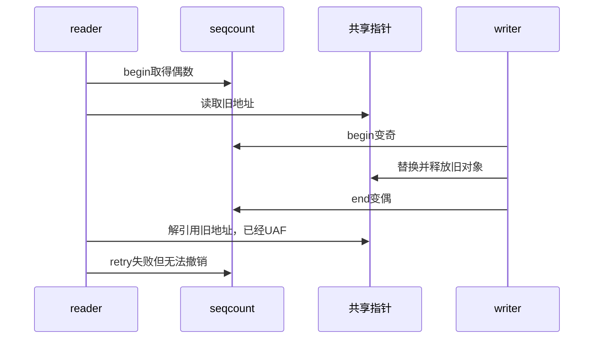

# 第6章\_生命周期误用诊断与选型

## 6.1\_最危险的误解是\_验证失败就什么都没发生

retry 只能拒绝读者尚未提交的本地结果，不能撤销已经发生的解引用、I/O、引用计数修改或资源释放。设计读区时应先列出每一步是否可丢弃，再决定哪些动作必须移到验证成功以后。

## 6.2\_指针生命周期反例

解决方式不是“更早 retry”，而是让旧对象在整个读区内仍存活，例如 RCU、引用计数或覆盖解引用的锁。seqcount 可验证指针与旁边标量属于同一发布代际，但生命期必须由组合机制证明。

## 6.3\_回绕和长读区

sequence 是有限宽度整数。若 reader 从 begin 到 retry 之间 writer 完成足够多轮，使计数完整回绕到 start，读者可能误判相同。正常短读区和现实写入速率下通常有很大余量，但 NMI 长时间停顿、虚拟机暂停、极高频 writer 或缩窄计数类型时必须重新估算，而不是把“理论上会回绕”或“现实中绝不会”写成绝对结论。

## 6.4\_进展与饥饿诊断

| 现象 | 先检查的因果链 | 可能改进 |
| --- | --- | --- |
| reader 重试激增 | writer 频率、写窗口长度、reader 复制量 | 缩短窗口、分拆状态、改用锁/RCU |
| 高优先级 reader 卡在奇数 | writer 是否被抢占、关联锁与 RT 分支 | 禁抢占、使用关联类型或 latch |
| 偶发坏快照 | writer 是否全部串行、是否绕过 API | 收敛 writer 锁并加入断言 |
| KCSAN/Lockdep 告警 | 访问是否在 seqcount 区域、writer 锁是否持有 | 修正协议，不能只抑制告警 |
| UAF | 指针对象如何回收 | 增加 RCU/kref/锁生命期协议 |

## 6.5\_工具证据边界

Linux 6.12.20 的 seqcount 接口会向 KCSAN 标记有限的原子区域，关联类型可让 Lockdep 验证 writer 锁。只有相关配置启用、检查器未失效、目标路径已执行且接口没有被 raw 变体绕过时，“未告警”才是有限证据。工具不能证明 reader 的副作用可回滚，也不能替代对象回收协议。

## 6.6\_选择矩阵

| 需求 | 适合机制 | 原因 |
| --- | --- | --- |
| 若干标量的一致快照，读者可重试 | seqcount | 读侧不写共享锁状态 |
| writer 用 spinlock，想封装在同一对象 | seqlock | 自带写侧串行锁 |
| NMI 可打断 writer 且允许双副本 | seqcount_latch | 始终保留一份稳定副本 |
| reader 需要阻止 writer | rwlock/rwsem | seqcount reader 不阻塞 writer |
| 替换指针并延迟释放旧对象 | RCU | 提供旧对象生命期窗口 |
| 读操作不可重试或有外部副作用 | mutex/rwsem 等锁 | 锁内操作只执行一次 |

## 6.7\_最终核对表

- 被保护的是可安全复制的内嵌数据，还是会释放的指针图？
- 所有 writer 由哪一个地址上的状态串行化？
- writer 奇数窗口能否被 reader 所在上下文打断或抢占？
- reader 在 retry 前是否只做可丢弃动作？
- 最坏 writer 频率和 reader 停顿下，重试与回绕是否可接受？
- 需要普通 seqcount、关联类型、seqlock 还是 latch，依据是什么？
- 检查器关闭、raw 接口或路径未覆盖时，还剩哪些人工证明？

## 6.8\_专题出口

Linux 6.12.20 的版本化实现从[序列计数器源码总阅读索引](../../../../../research/source_reading/sequence_counters/navigation/P01_Linux_6.12_序列计数器源码总阅读索引.md#1.5_建议阅读顺序)进入。对象生命期继续读 [RCU](../rcu/大纲.md)与 [kref](../../../object_lifetime/kref/大纲.md)；一般屏障证明转入[内存顺序专题](../memory_ordering/大纲.md)。

上一篇：[关联锁变体与实时性边界](P05_关联锁变体与实时性边界.md)。
