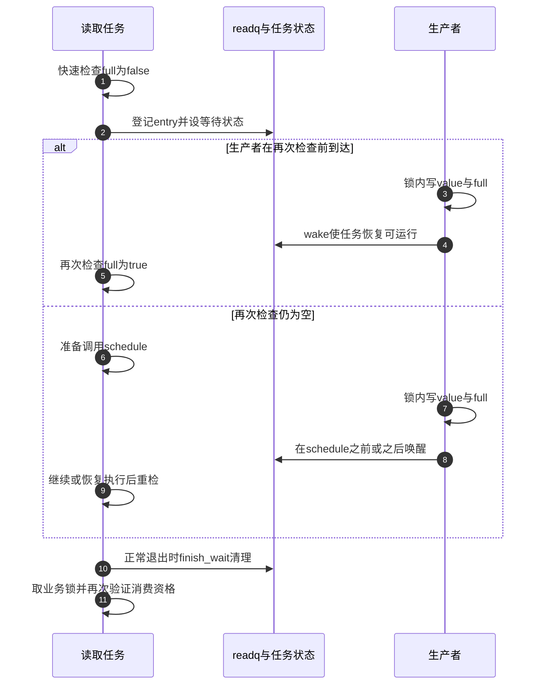

# 第1章\_等待队列

## 1.1\_等待队列解决什么问题

设驱动暂存一条采样记录，进程希望读取下一条记录。若记录尚未产生，read可以返回暂不可读，让应用以后重试；也可以暂时把CPU让给其他任务，在记录出现时继续。后一种选择需要回答：生产者怎么找到这个等待者，检查为空与真正睡下之间发生记录又怎么办？

不断读一个ready标志也能发现变化，但长时间没有记录时会反复执行检查。等待队列（waitqueue）提供通知关系，让没有工作可做的任务有机会睡眠。它保存“谁在等待、怎样通知”，**业务对象仍须保存记录和就绪条件**。通知发生在无人等待时，不会自动被队列记成一张未来可兑换的票；后来者必须通过业务状态发现已有记录。

本章先建立最小的单槽缓冲协议，再解释入队与睡眠窗口。读者已了解普通C对象与锁；可睡眠与中断上下文的先修见[同步与异步总纲](../../大纲.md)。多输入的应用接口另见[poll与epoll](../../../io_model/blocking_io/大纲.md)，它们复用这里的“通知后重查”，不替代缓冲状态。


队列头、业务锁、记录和任务状态是不同地址。唤醒不会把记录复制给任务，也不保证被唤醒者立刻占有CPU；在它真正运行前，别的消费者可能已经取走记录。

## 1.2\_数据结构各自保存什么

等待队列头可以嵌在设备对象内；每次等待使用的等待项常在等待任务的栈上。一个对象服务多个读者时，共享一个队列头通常是有意设计，各读者有自己的等待项。

| 对象与字段 | 承担的状态 | 不承担什么 |
| --- | --- | --- |
| wait_queue_head的lock与head | 队列内部锁和等待项链 | 不自动保护设备缓冲中的所有字段 |
| wait_queue_entry的private | 默认等待时关联任务，也可由特定回调用作其他对象 | 不能把所有等待项都强行解释成普通任务 |
| entry中的func与flags | 唤醒回调及独占等标志 | 不定义业务条件是否成立 |
| entry中的entry链表节点 | 该等待项是否链接到队列 | 不等于任务此刻已经停止执行 |
| 调用者自己的full、value、stopping | 记录是否存在、内容和停止状态 | 不替代调度器的任务状态 |

Linux 6.12.20的结构及路径从[源码总阅读索引](../../../../../research/source_reading/waiting_notification/navigation/P01_Linux_6.12_等待与完成量源码总阅读索引.md#1.1_版本边界与阅读任务)进入。普通驱动优先使用wait_event宏族，让公共代码处理登记和清理；以下是驱动自己的应用协议，不复制上游函数实现。

## 1.3\_标准条件等待

先约定一个足够小的设备状态：full为真时有一条value记录；stopping一旦变真便不再接受新记录。停止后允许读完已有记录，然后返回-ENODEV表示设备已停止服务。生产者不覆盖未读记录，槽满时返回-EBUSY表示忙，由上层决定丢样、排队还是降低采样速率。这个容量策略属于业务协议，等待队列不会替它扩容。

下面列出这一内核内部对象所需的初始化、条件观察、消费、生产和停止函数。它不是可加载模块，调用者还要提供对象分配、引用和设备接口。box_read_one只能由可睡眠的进程上下文调用；生产和停止函数的临界区不睡眠，示例使用irqsave形式以容许普通中断生产者，不支持NMI（Non-Maskable Interrupt，不可屏蔽中断）上下文。这里按常规非PREEMPT_RT内核解释，实时内核的锁上下文约束需另行核对。

```c
#include <linux/errno.h>
#include <linux/spinlock.h>
#include <linux/wait.h>

struct sample_box {
    spinlock_t lock;              /* 保护下面三个业务字段。 */
    wait_queue_head_t readq;      /* 连接等待者与状态变化。 */
    int value;
    bool full;
    bool stopping;
};

void box_init(struct sample_box *box)
{
    spin_lock_init(&box->lock);
    init_waitqueue_head(&box->readq);
    box->value = 0;
    box->full = false;
    box->stopping = false;
    /* 在对象发布给其他路径以前只初始化一次。 */
}

static bool box_readable(struct sample_box *box)
{
    unsigned long flags;
    bool result;
    spin_lock_irqsave(&box->lock, flags);
    result = box->full || box->stopping;
    spin_unlock_irqrestore(&box->lock, flags);
    return result;                /* 只观察，不消费。 */
}

int box_read_one(struct sample_box *box, int *value)
{
    unsigned long flags;
    for (;;) {
        int ret = wait_event_interruptible(box->readq, box_readable(box));
        if (ret)
            return ret;          /* 保留可中断等待的错误。 */
        spin_lock_irqsave(&box->lock, flags);
        if (box->full) {
            *value = box->value;
            box->full = false;   /* 在同一临界区取得并消费记录。 */
            spin_unlock_irqrestore(&box->lock, flags);
            return 0;
        }
        if (box->stopping) {
            spin_unlock_irqrestore(&box->lock, flags);
            return -ENODEV;
        }
        spin_unlock_irqrestore(&box->lock, flags);
        /* 别的读者先取走了记录，阻塞读取继续等待。 */
    }
}

int box_put(struct sample_box *box, int value)
{
    unsigned long flags;
    int ret = 0;
    spin_lock_irqsave(&box->lock, flags);
    if (box->stopping)
        ret = -ENODEV;
    else if (box->full)
        ret = -EBUSY;
    else {
        box->value = value;
        box->full = true;
    }
    spin_unlock_irqrestore(&box->lock, flags);
    if (!ret)
        wake_up_interruptible(&box->readq);
    return ret;
}

void box_stop(struct sample_box *box)
{
    unsigned long flags;
    spin_lock_irqsave(&box->lock, flags);
    box->stopping = true;
    spin_unlock_irqrestore(&box->lock, flags);
    wake_up_interruptible_all(&box->readq);
    /* 此处不能free：等待者和其他在途路径仍可能访问box。 */
}
```

先跟踪正常路径：box_put在锁内写value与full，解锁以后才通知readq。等待条件通过box_readable取得同一把业务锁，只检查full或stopping。等待宏成功返回后，box_read_one再次取锁，把“仍有数据”和“取走数据”放在同一临界区。锁保护记录的内容与归属，readq只连接可能被阻塞的任务。

为什么需要内外两个循环？wait_event_interruptible内部循环解决“等待时条件尚未成立”；外层循环解决“等待成功以后、获得消费锁以前，别的消费者取走了记录”。本例承诺阻塞式读取，因此遇到后者继续等待，而不是意外向调用者返回EAGAIN。非阻塞read应有独立的立即尝试分支，不能仅靠等待宏的名字改变语义。

条件表达式可能被多次求值，也可能在初始快速检查时就成立。因此它应是可以反复执行的状态观察，不能把“取走记录”藏进一个普通条件函数。box_readable只在短临界区取自旋锁，在进入实际睡眠之前已经解锁。不要把生产者需要的锁持有到wait_event外面，否则生产者无法建立条件，等待也永远不能结束。

本例的value是内核内部输出地址；若接到read系统调用，不能在这段自旋锁临界区直接copy_to_user。应先把记录取到受控临时存储，再处理可能睡眠的用户复制及失败策略。代码尚未在目标内核编译或加载，不能当成已验收驱动。

## 1.4\_生产者必须先修改状态再唤醒

把box_put的顺序故意反过来：先wake，等待读者被调度后仍看到full为假，于是重新等待；生产者随后才置full为真，却不再通知。如果之后没有新的记录，数据留在槽里而读者睡着。这是协议遗漏，不是调度器运行太慢。

即使通知时没有任何等待者，正确协议也仍有结果：full保存在box中，后来的读者从条件快速检查发现它。这里“保留下来”的是业务状态，不是wake调用次数。如果需求是累计每次完成的次数，应选择计数或后文的完成量，而不是假设队列记住每一声唤醒。

锁或明确的发布/获取协议负责数据访问，wake负责让符合状态的任务重新可运行。等待宏可以在不发生实际睡眠的路径返回，所以不能把唤醒函数内部的屏障当成所有路径上自动发布业务数据的万能保证。

## 1.5\_为什么不会丢失检查\_睡眠窗口

可以先做一次快速条件检查；真正进入等待循环后，关键顺序是登记等待项、设置任务状态、再次检查条件，最后才决定是否schedule。重新检查覆盖生产者在第一次检查之后、登记之前完成的情况；登记和任务状态则使更晚的通知能影响这次睡眠决定。



通知发生在设态后、schedule前时，任务可先被恢复为可运行；随后调用schedule也不是按旧条件永久睡下。通知发生在已经睡眠之后，则把任务重新送入可运行过程。两种情形都不保证立刻取得CPU，更不保证其他消费者没有先取走记录。

正常离开等待循环时需要恢复任务状态、清理等待项。标准宏还会处理信号分支，具体源码不一定每条退出路径都再调用一次finish_wait：prepare阶段的信号分支已执行相应摘链，宏可以直接返回。手写循环则必须明确每个出口的清理责任，不能套用“某分支没写finish_wait所以都能省略”。精确分支见[prepare实现](../../../../../research/source_reading/waiting_notification/source_explanations/kernel/sched/wait.c.md#1.3_prepare_to_wait_event登记与信号分支)，阶段证明继续在[统一状态机](P03_条件等待的统一状态机.md)。


## 1.6\_接口族与返回值

| 接口 | 信号行为 | 返回值重点 |
| --- | --- | --- |
| `wait_event()` | 不响应信号 | 条件成立后返回 |
| `wait_event_interruptible()` | 响应可处理信号 | 0 成功，通常以 `-ERESTARTSYS` 表示被信号打断 |
| `wait_event_killable()` | 响应致命信号 | 0 成功，负错误码失败 |
| `wait_event_timeout()` | 不响应信号 | 条件仍假且超时返回0；条件真时返回至少1，通常表示剩余jiffies |
| `wait_event_interruptible_timeout()` | 信号或超时 | 负值信号、条件仍假且超时为0、正值条件成立 |
| `wait_event_freezable()` | 可参与 freezer | 用于明确需要冻结语义的内核任务 |

timeout参数以jiffies（内核节拍计数）为单位，不是毫秒；按毫秒配置等待时使用msecs_to_jiffies转换。固定实现会在超时边界观察到条件为真时返回1，因此不能把“只剩0个节拍”直接等同于失败。可中断超时接口应先判断负值，再判断0，最后处理成功；把返回值统一写成布尔值会把负错误码也当成成功。

-ERESTARTSYS是内核可重启系统调用路径使用的错误码，进入用户态时还受信号与重启规则影响，不应当成用户程序必然直接看到的errno值。freezer是系统冻结任务的协调机制，freezable等待用于需要参与该协议的内核任务；它不是比普通等待“更省电”的通用替换。

## 1.7\_任务状态怎么选

| 状态 | 可被什么唤醒 | 使用考虑 |
| --- | --- | --- |
| `TASK_INTERRUPTIBLE` | 条件唤醒或普通信号 | 面向用户请求的阻塞 I/O 常用，必须返回信号错误 |
| `TASK_KILLABLE` | 条件唤醒或致命信号 | 允许系统终止长期内核等待 |
| `TASK_UNINTERRUPTIBLE` | 主要由显式条件唤醒 | 只在协议确实不能中断时使用，错误会形成 D 状态挂死 |

不要为了省略错误处理默认选择 uninterruptible。与可能失联的硬件交互时通常还应设计超时、复位和停止路径。

## 1.8\_独占等待与惊群

非独占等待者在匹配唤醒时通常都会被唤醒；独占等待项允许唤醒路径在处理一定数量的独占等待者后停止，从而减少多个消费者争夺单个资源的惊群。

```c
/* 只展示等待接口替换，消费锁与停止广播仍须保留。 */
ret = wait_event_interruptible_exclusive(box->readq, box_readable(box));
```

`wake_up()` 不能简单描述成“只唤醒一个”或“唤醒所有”：扫描遇到成功的非独占回调不扣独占额度，成功的独占回调才扣额度；额度用完可能停止扫描，所以不能保证任意排列中后面的所有非独占项都被访问。独占在这里指唤醒额度，不是消费者已经取得记录。选择exclusive前还要设计资源分配与后续唤醒；停止这样的广播状态应让所有相关等待者重新检查。更多边界见[独占等待与公平性](P05_独占等待批量唤醒与公平性.md)。

## 1.9\_锁与内存序

本章sample_box让条件观察、生产和消费都取得同一把box.lock，不能只给写端加锁，却在wait表达式里无保护地读取复合字段。条件检查离开临界区后仍可能过期，所以消费时还要在锁内重检；这两次加锁分别负责安全观察与取得所有权。

锁建立数据访问顺序，等待队列建立调度关系。box.lock与readq内部锁是不同对象；不应因为二者都叫“锁”，就假定持有任意一把都能读写value。共享设备对象的初始化也只能在发布前完成，不能每次open都重新初始化readq，把旧等待项从通知关系中抹掉。

若使用无锁标志，必须设计成对的 release/acquire 或内核文档规定的屏障模式。`READ_ONCE()/WRITE_ONCE()` 主要约束单次访问，不自动形成完整 happens-before。

`waitqueue_active()` 是无锁观察提示，调用者使用它跳过 `wake_up()` 时必须严格遵守内核注释要求的屏障配对。多数驱动不需要这种微优化，直接调用 wake_up 更容易审计。

## 1.10\_等待队列与\_poll

`.poll()` 中的 `poll_wait(file, &dev->wq, wait)` 只是登记等待队列，不会在 poll 回调里阻塞。正确顺序是先登记，再检查 readiness，避免事件发生在检查和登记之间。

生产者修改状态后可用 `wake_up_interruptible_poll()` 携带 poll mask 唤醒。poll 和阻塞 read 应围绕同一业务条件设计，否则可能一个报告可读、另一个醒来却无数据。

## 1.11\_停止与生命周期

remove或关闭路径必须让等待者有机会退出。本例box_stop在业务锁内置stopping，随后唤醒所有相关可中断等待者。读取路径允许先消费最后一条记录，再让后来的读取返回-ENODEV；若业务要求停止立即失败，应一致修改消费优先级与数据丢弃策略，不能只换一个wake函数。

停止方还须阻止新的对象使用者进入，并等待现有引用或在途调用退出。box_stop本身只发布停止并通知，不完成这部分回收协议。等待队列头和业务对象必须活到所有等待者及其他访问者退出；仅唤醒一次后立即释放对象，尚未运行的任务再访问条件便会造成UAF（Use After Free，释放后使用）。


## 1.12\_常见错误

| 错误 | 后果 |
| --- | --- |
| 把等待队列当事件存储 | 事件发生在无人等待时被丢失 |
| 先 wake 再修改条件 | 等待者检查旧条件后再次睡眠 |
| 用 `if` 代替循环重检 | 假唤醒或其他消费者抢先消费后使用无效状态 |
| 持有生产者需要的 mutex 睡眠 | 永久死锁 |
| 忽略 interruptible/timeout 返回值 | 把信号或超时当成功 |
| 手写循环忘记 `finish_wait()` | 任务状态和队列项残留 |
| 只靠 READ_ONCE/WRITE_ONCE 和 wake_up 保护复合状态 | 缺少可证明的内存序和互斥 |
| remove 唤醒后立即 free | 等待者尚未退出导致 UAF |
| 广播事件使用 exclusive wait | 部分等待者永远收不到状态变化 |

## 1.13\_核对表

先用sample_box推演三个小修改，再使用下面的核对表检查自己的驱动。

1. 两个读者都从等待宏成功返回，槽中只有一条记录。谁能拿走它？先取得box.lock且看到full的读者。另一个在外层循环继续等待，不能按旧观察读取已经失去归属的value。
2. 生产者先写记录，之后读者才到达，期间没有任何等待者。记录会丢吗？本例不会，因为full仍为真；读者快速条件检查成功。若改成只wake、不保存状态，则不能保证这一点。
3. box_stop时还有一条未读记录。第一次读取与第二次读取分别怎样返回？按本例优先级，第一次成功取走记录，第二次返回-ENODEV。停止后新生产返回-ENODEV，也不会覆盖旧记录。

这些推演检查的是业务协议，不是内核调度实测。需要观察登记空窗时，可运行[完整C交错模型](../memory_ordering/P07_锁_调度_中断与隐式顺序.md#7.7.2_用完整C模型找到登记空窗)；该模型只验证立即可见的动作排列，不替代真实驱动、信号、超时与弱内存验证。

- 业务条件保存在哪里，事件早于等待者到达时是否仍可观察？
- 生产者是否先修改条件再唤醒？
- 等待者是否始终循环重检，并正确处理信号和超时？
- 条件由锁还是明确的无锁内存序保护？
- 当前上下文是否允许睡眠？
- 独占等待是否真的符合单消费者语义？
- remove 如何阻止新等待、唤醒旧等待并等待它们退出？

需要保存“工作已经完成”的令牌或广播完成状态时，继续阅读 completion 完成量。

下一篇：[completion 完成量](P02_completion_完成量.md)。
