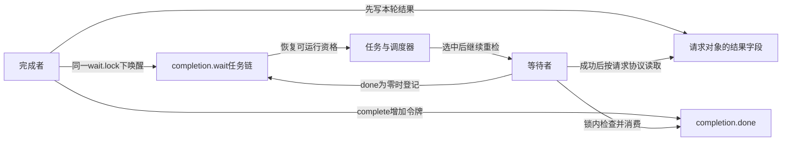
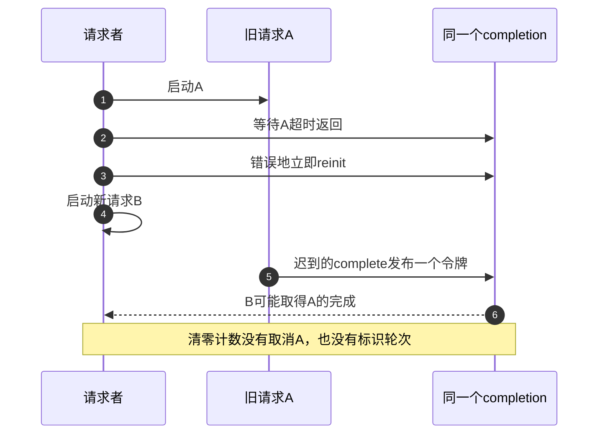
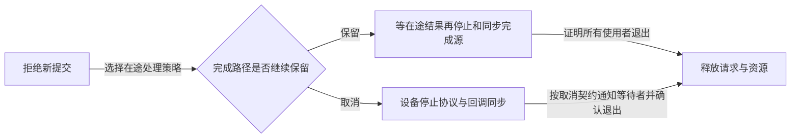

# 第2章\_completion\_完成量

## 2.1\_completion\_解决什么问题

上一章的读者等待“槽里有记录或设备已停止”，业务条件由sample_box保存。现在换成一次异步初始化：请求者启动工作，另一路执行流写好初始化结果，请求者在完成之后继续。这里不需要观察任意缓冲条件，只需要保存“这一轮已经到达完成点”。

可以自行维护一个布尔变量、锁和等待队列，但还要处理工作比等待者更早完成、多个等待者、错误退出和复用。completion（完成量）把常用的完成状态与睡眠登记组合起来：完成者用complete发布一个可消费的完成令牌，等待者用wait_for_completion族取得令牌后继续。令牌表示完成事实，不是资源锁，也不直接携带计算结果。

完成可以早于等待。如果只wake而不保存状态，尚未到达的等待者看不到过去的通知；completion把令牌保存在done中，因此后来者也能通过。这正是初始化、硬件请求完成、线程阶段握手和退出确认中需要的性质。具体驱动仍须定义“完成点”究竟是结果可读、硬件已停，还是执行流真正退出，三者不能随意互换。

## 2.2\_计数与等待者是两套状态

Linux 6.12.20的完成对象把done计数与名为wait的simple waitqueue放在一起。simple waitqueue是只面向受控任务等待的简化队列，省去普通waitqueue的自定义回调等能力；此处done已保存完成状态，队列只需连接睡眠任务。源码从[等待与完成量总阅读索引](../../../../../research/source_reading/waiting_notification/navigation/P01_Linux_6.12_等待与完成量源码总阅读索引.md#1.1_版本边界与阅读任务)进入，后面的[令牌与调用链](P06_completion令牌状态与调用链.md)再展开字段读写路径。

先分别观察两套状态。即使队列为空，done也可以为1；即使刚把某任务唤醒，任务仍可能尚未执行并消费令牌。固定实现用wait.lock协调done检查、等待登记、完成发布和消费，使“决定没有令牌”与“成为可通知等待者”之间有统一的同步协议。



| 操作 | 普通计数状态 | 等待者关系 |
| --- | --- | --- |
| complete | 未饱和时加1 | 尝试唤醒一个排队任务；无人等待也保留令牌 |
| 成功wait或try_wait | 普通正数减1 | 成功取得令牌；后到者不一定需要睡眠 |
| complete_all | 设为UINT_MAX，即unsigned int最大值 | 唤醒全部当前等待者，后来者也能继续通过 |
| 广播状态下成功wait | 不递减UINT_MAX | 不是一次性消耗掉广播 |
| reinit_completion | 直接置0 | 不检查、取消或等待旧等待者 |

因此done不只是0/1。多次complete能够累计，但不能无限精确计数：达到饱和值后便采用不递减状态。工程中通常用一项工作对应一次完成，或用广播表示一个持续成立的阶段；不能以计数存在为由把完成量当作无限事件日志。

## 2.3\_先建立对象寿命\_再启动工作

动态对象在发布给完成者之前调用init_completion，静态对象可使用DECLARE_COMPLETION；栈上声明使用DECLARE_COMPLETION_ONSTACK，以配合相应的调试初始化。两种声明只是存储位置不同，都不证明异步回调已结束。

以下是本章的内核内部请求协议片段，不是独立模块。请求由外层持有，只有一个完成者写result和调用一次complete；等待成功以后，不再有写入者改result。request_init在异步提交之前执行，request_finish由真实工作路径在确定结果后调用。

```c
#include <linux/completion.h>

struct init_request {
    struct completion finished;
    int result;
};

void request_init(struct init_request *req)
{
    init_completion(&req->finished);
    req->result = 0;
}

void request_finish(struct init_request *req, int result)
{
    req->result = result;         /* 先发布本轮结果。 */
    complete(&req->finished);     /* 只表示定义好的完成点。 */
    /* 本协议此后不再访问req，但外层还须同步工作执行源。 */
}

int request_result(struct init_request *req)
{
    wait_for_completion(&req->finished);
    return req->result;           /* 仅在成功完成边界以后读取。 */
}
```

本例不需要再用一把锁保护“一次写入、完成后只读”的result交付；成功等待与完成建立同步边界。但若工作路径在complete后继续改result，或者还有别的写入者，原前提已经失效，要另加业务同步。不能一方面说完成建立边界，另一方面又把所有字段无条件写成并发不安全；应先说明参与者和访问阶段。

对象不能在超时或信号返回时直接释放，因为另一条路径可能尚未调用request_finish。栈上对象尤其危险：函数一返回，栈槽就可能复用，迟来的complete仍会访问旧地址。引用、取消、工作源同步由外层协议负责；本片段没有实现异步提交和取消，未在目标内核编译加载。

## 2.4\_等待接口的返回不是一种布尔值

| 接口 | 等待方式 | 返回值 |
| --- | --- | --- |
| wait_for_completion | 不可中断、无超时 | 无返回值，取得完成后继续 |
| wait_for_completion_interruptible | 可被信号打断 | 0成功，负错误码表示中断 |
| wait_for_completion_killable | 可响应致命信号 | 0成功，负错误码失败 |
| wait_for_completion_timeout | 无信号中断，有超时 | 0未取得完成；正数至少为1 |
| wait_for_completion_interruptible_timeout | 信号或超时 | 负数中断，0超时，正数成功 |
| try_wait_for_completion | 不睡眠，立即尝试 | true时已取得并消费普通令牌，false时未取得 |
| completion_done | 不睡眠，只观察 | 当前是否处于有令牌/广播状态，不替调用者取得令牌 |

timeout按jiffies指定，可用msecs_to_jiffies转换毫秒。成功返回通常是剩余节拍；固定实现到达超时边界但已取得完成时仍返回1。因此只看“时钟到了”不足以替代接口返回值。可中断超时接口用long保存返回值，避免把负错误码存进无符号变量后误判为巨大的成功剩余值。

```c
long ret = wait_for_completion_interruptible_timeout(
        &req->finished, msecs_to_jiffies(500));
if (ret < 0) {
    /* 信号退出：保留错误，并交给外层执行取消/引用协议。 */
} else if (ret == 0) {
    /* 超时：只结束本次等待，不能据此释放req。 */
} else {
    /* 成功：本轮结果可按既定协议读取。 */
}
```

空分支是需要由具体驱动实现的处置点，不能复制后就当成完成了错误处理。普通wait接口可能睡眠，应在允许调度的上下文调用，不能持有完成者需要的锁等待；try_wait和completion_done则是明确的不睡眠接口。completion_done观察到true之后，另一个消费者仍可能先取得令牌，所以不要写“先观察真，再无条件阻塞wait”来模拟try_wait。

## 2.5\_完成接口与硬件完成点

complete增加一个令牌，complete_all发布广播完成状态。二者不执行睡眠等待，但上下文限制仍需按版本和配置核对：固定实现complete_all包含实时内核上下文断言，不能把“非睡眠”扩张成所有配置、所有中断和NMI上下文都无条件安全。

硬件中断处理中，设备驱动应先确认中断属于本次请求，按设备手册获取结果和应答中断，再到达软件约定的完成点。先清状态还是先读取结果、完成位是否意味着DMA已经停止，都由具体设备协议决定。不能随手发明STATUS和TRANSFER_DONE寄存器后，把一次writel加complete当成适用所有硬件的完成模板。

complete不是取消硬件的指令，也不保证调用它的函数已经返回。工作者如果在complete之后还有资源释放、日志或其他访问，等待方只能依据已定义的完成点继续，不能提前卸载模块代码或释放工作者还要使用的对象。

## 2.6\_复用必须排除旧轮次

完成量本身没有请求编号。假设A超时后立刻reinit并启动B，A的迟到中断才调用complete：B可能消费这个令牌，把A的结果误当成自己的完成。锁住一次done清零不能凭空给通知补上轮次身份。



正确复用先证明旧完成者不再发布、旧等待者已经离开，再按协议清理旧状态并启动下一轮。若恰好一发一收，唯一普通令牌已经消费，done自然回到0，不必为形式整齐每轮都reinit。complete_all后的饱和状态则必须显式清零才能建立新的未完成阶段；清零前仍要满足同样的旧轮次结束条件。

init_completion会初始化队列，不能用它代替reinit来“更彻底地重置”活跃对象。reinit只写done，不检查队列或硬件；安全性来自外部轮次和寿命协议，而不是函数名中的init。

## 2.7\_用完整C模型观察令牌与广播

下面只模拟令牌状态，不含任务、锁、真实睡眠或内存屏障。它让提前完成、观察不占有、两次完成和广播持续生效成为可运行的反例。UINT_MAX来自limits.h；它在模型中对应固定实现的饱和值。

```c
#include <assert.h>
#include <stdbool.h>
#include <limits.h>
#include <stdio.h>

struct completion_model { unsigned int done; };

static void publish(struct completion_model *m)
{
    if (m->done != UINT_MAX)
        ++m->done;
}

static bool take(struct completion_model *m)
{
    if (m->done == 0)
        return false;
    if (m->done != UINT_MAX)
        --m->done;
    return true;
}

int main(void)
{
    struct completion_model m = {0};
    publish(&m);                 /* 尚无等待者也保存令牌。 */
    bool a_saw = m.done != 0;
    bool b_saw = m.done != 0;
    assert(a_saw && b_saw);
    assert(take(&m));
    assert(!take(&m));            /* 两个观察不是两个令牌。 */
    publish(&m);
    publish(&m);
    assert(take(&m) && take(&m) && !take(&m));
    m.done = UINT_MAX;            /* 模拟广播完成。 */
    assert(take(&m) && take(&m) && m.done == UINT_MAX);
    m.done = 0;                   /* 这里只因没有异步使用者才可重置。 */
    assert(!take(&m));
    puts("early=stored; observations=2 tokens=1; counted=2; broadcast=sticky");
    return 0;
}
```

保存为completion_model.c，用`cc -std=c11 -Wall -Wextra -Werror -O2 completion_model.c -o completion_model`编译后运行。预期输出为`early=stored; observations=2 tokens=1; counted=2; broadcast=sticky`。先预测把广播改成一次publish会在哪条断言失败，再实际修改；广播不是向每个未来等待者预先分配一个有限令牌。

这也解释与信号量的边界：信号量通常管理可归还的资源额度，完成量表达工作完成；它们都可能有计数，却承诺不同的应用协议。任意“队列非空或已停止”条件仍适合waitqueue，排他临界区仍需mutex等互斥协议。不能因为模型只有一个整数就把所有同步原语当成同一种东西。

## 2.8\_停机不能切断唯一完成源再等待它

先阻止新提交，再按依赖处理在途工作。若工作只能通过某个中断报告完成，就不能先永久关闭该中断，然后无限wait等待它发出complete。必须选择一种有闭环的策略：保留完成路径直到在途工作结束，或者真正取消/停止设备，并通过取消协议确认旧工作与回调已经不能再访问对象。



取消时若用完成量唤醒等待者，必须先记录失败/取消结果，等待者不能把令牌自动解释为业务成功。complete_all只表示这个完成对象处于广播状态，不会主动写好所有请求的错误，也不会回收等待者引用。若回调位于可卸载模块，还应保证回调真正离开后才能卸载代码。

## 2.9\_常见错误

| 错误 | 具体后果 | 修正 |
| --- | --- | --- |
| 把done当布尔值 | 忽略累计令牌或广播状态 | 分开普通计数与饱和值 |
| 每轮无条件reinit | 丢掉提前完成，或让迟到旧完成进入新轮 | 先关闭旧轮次，再按需要重置 |
| complete_all后直接复用 | 后来wait持续通过 | 确认旧参与者退出，再reinit |
| completion_done真后直接假定拥有令牌 | 另一等待者先消费，自己仍可能阻塞 | 需要尝试取得时用try_wait |
| 超时/信号后直接释放请求 | 迟到回调访问失效对象 | 执行取消、同步或引用转移 |
| complete后继续无同步地改结果 | 等待方已开始读，形成竞态 | 明确完成边界及后续字段访问协议 |
| 先关闭唯一完成源再无限等待 | 再无任何路径能完成 | 依据依赖关系选择完成或取消流程 |

## 2.10\_回顾与练习

completion解决的是完成事实保存与等待登记的衔接，done负责令牌或广播状态，简化队列负责暂时没有令牌的任务。它不携带请求编号，不取消工作，也不保证完成者已经执行到函数末尾。

1. complete发生时无人等待，下一次wait为什么仍能成功？done保留令牌，快路径取得它，不需要补发过去的唤醒。
2. complete_all以后completion_done为真，能否立刻reinit？不能由这一观察推出旧等待者已离开；它只反映广播状态。
3. 超时后要开始下一轮，除清零还缺什么？必须证明旧工作不再发布，并处理旧等待者、结果及对象引用，防止串轮。
4. 完成量正确同步了一次结果，为什么还可能发生释放后使用？结果可读与所有异步执行源退出是不同结论，后者需要额外寿命协议。

上一篇：[等待队列](P01_等待队列.md)。

下一篇：[条件等待的统一状态机](P03_条件等待的统一状态机.md)。
