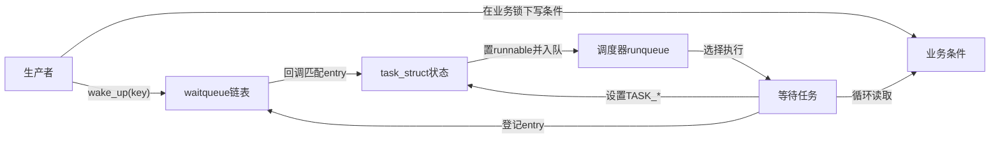
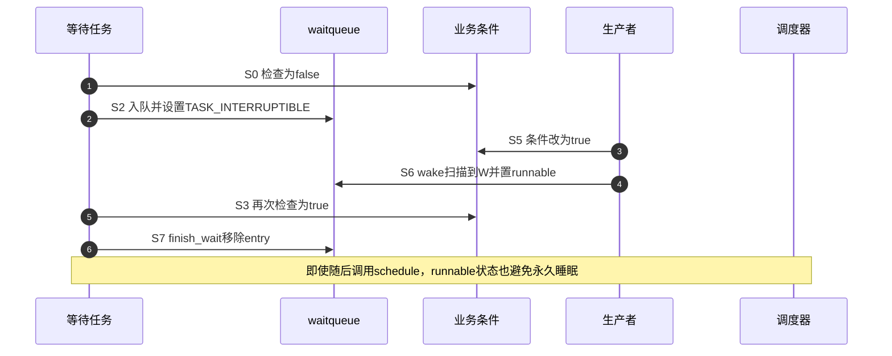

# 第3章\_条件等待的统一状态机

## 3.1\_朴素检查后睡眠为何会丢事件

消费者检查队列为空后、真正睡眠前，生产者可能加入数据并执行 wake。此时消费者还不是可唤醒等待者，wake 找不到它；随后消费者按旧判断睡下，而生产者也认为自己已经通知完毕。如果再无事件到来，任务永久睡眠。缺口来自“业务条件检查”和“调度等待登记”没有形成闭环。

## 3.2\_等待是四组正交状态

| 状态组 | 保存位置 | 写入者 | 读取者 |
| --- | --- | --- | --- |
| 业务条件 | 设备队列、标志、计数等业务对象 | 生产者/消费者 | wait 条件表达式 |
| 等待者登记 | `wait_queue_head` 链表 | 等待任务与 finish 路径 | wake 扫描 |
| 任务睡眠状态 | 当前 `task_struct` | prepare/调度路径 | 调度器与唤醒函数 |
| 同步顺序 | 业务锁或明确屏障协议 | 所有参与者 | 所有条件读写路径 |

等待队列不拥有业务条件；调度器也不知道“数据可读”的含义。它们只负责让符合任务状态和唤醒键的等待者重新变为 runnable。

## 3.3\_角色与通信关系

通信至少跨越业务对象、等待队列、任务状态和 runqueue 四个地址。把整个过程压缩成“生产者唤醒消费者”会掩盖丢唤醒、假唤醒和生命周期错误的真正位置。

## 3.4\_S0到S7完整周期

| 阶段 | 等待者动作 | 共享状态变化 | 退出条件 |
| --- | --- | --- | --- |
| S0 运行检查 | 读取业务条件 | 无 | 成立则直接使用，否则 S1 |
| S1 准备等待 | 创建 entry、取得队列锁 | 即将登记 | 队列状态可修改 |
| S2 登记与设态 | entry 入队，任务设为 `TASK_*` | wake 已能找到任务 | 释放队列锁 |
| S3 再次检查 | 重读业务条件/信号 | 条件可能已被生产者修改 | 成立则 S7，否则 S4 |
| S4 主动让出 | 调用 `schedule*()` | 任务离开 CPU | 被唤醒、超时或信号 |
| S5 生产发布 | 先修改业务条件 | 新状态可观察 | 执行 wake |
| S6 唤醒传播 | 扫描 entry、调用回调 | 匹配任务变 runnable | 调度器稍后选择任务 |
| S7 醒后清理 | `finish_wait()` 并循环重检 | entry 移除、任务恢复 running | 条件真正成立或返回错误 |

## 3.5\_关闭检查睡眠窗口的时序

另一种交错是生产者发生在 S3 之后、S4 睡眠期间；这时 entry 已登记，wake 正常把任务置回 runnable。两条交错共同关闭窗口。

## 3.6\_为什么醒后必须循环重检

wake 只说明条件可能变化：

- 多个消费者被唤醒后，先运行者可能已经取走唯一数据；
- 信号、超时或其他 key 也会结束等待；
- 非独占等待可被广播唤醒；
- 业务条件可能在等待者获得 CPU 前再次变回 false。

所以条件是真实授权，wake 只是调度提示。`wait_event*()` 宏把循环重检封装起来，普通代码不应以一次 `if` 代替。

## 3.7\_内存顺序与锁分工

首选方案是生产者和消费者用同一把业务锁保护复合条件：生产者锁内改状态，解锁后 wake；等待者醒来后取锁并重检。队列内部锁只保护 entry 链表，不自动保护业务字段。无锁条件需要按内核文档建立成对屏障，`waitqueue_active()` 优化尤其不能脱离其注释使用。

## 3.8\_本章结论与下一问

条件等待通过“先登记并设态—再重检—必要时 schedule—wake 置 runnable—醒后清理重检”闭合丢唤醒窗口。下一章把这些阶段逐一映射到 Linux 6.12.20 的 wait 宏和 `kernel/sched/wait.c`。

上一篇：[completion 完成量](P02_completion_完成量.md)。

下一篇：[wait_event 入队与唤醒调用链](P04_wait_event入队与唤醒调用链.md)。
