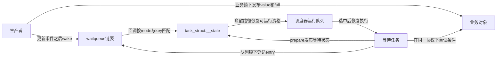
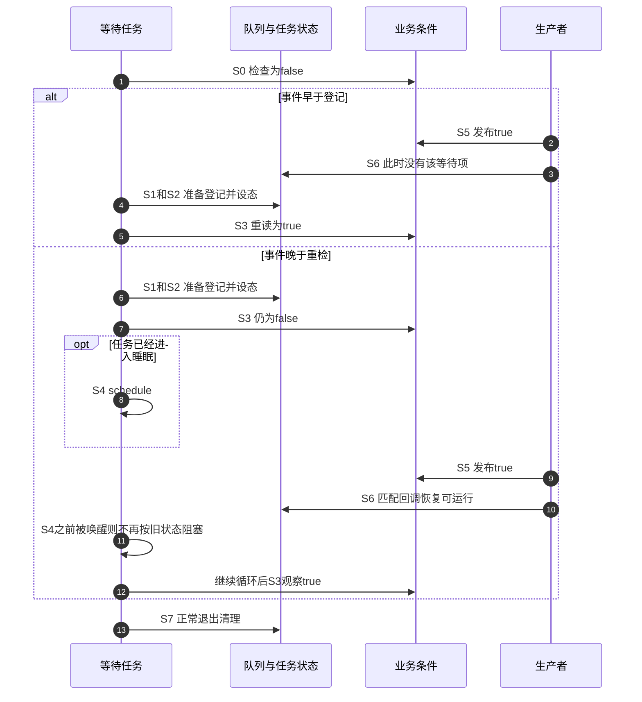

# 第3章\_条件等待的统一状态机

## 3.1\_朴素检查后睡眠为何会丢事件

第一章的单槽记录已经区分“观察full”和“拿走value”，第二章介绍用完成量保存完成状态。本章退回到最基本的问题：即使生产者先改条件、后唤醒，等待者会不会仍然永远睡着？答案取决于检查和登记怎样衔接，不能只看wake是否调用过。

先写一个错误时间线。读者检查full为假；生产者写入value并置full，再唤醒队列；此时读者还没有登记，通知没有找到它；读者随后登记并按第一次的判断睡眠。槽里一直有数据，但以后不再发生通知。生产者没有违反“先改条件”，失败来自读者用旧观察跨过了登记边界。

多加一次随意的检查仍不足以构成证明：若第二次检查也在登记之前，生产者只需发生在第二次检查之后，空窗仍在。新增检查必须放在登记并设态之后，让“未来通知能找到我”和“过去状态能被我看到”接起来。

## 3.2\_等待是四组正交状态

| 状态组 | 保存位置 | 写入者与读取者 | 独立变化的例子 |
| --- | --- | --- | --- |
| 业务条件 | sample_box.full、stopping和记录等业务对象 | 生产/停止/消费路径写；条件观察与消费路径读 | full为真不意味着某个读者独占记录 |
| 等待者登记 | wait_queue_head.head连接各wait_queue_entry.entry | 等待登记、回调自动摘链或退出清理写；wake扫描读 | entry已经入队，任务仍可能正在CPU上继续检查 |
| 任务等待状态 | task_struct.__state | prepare与唤醒/清理路径更新；调度和唤醒逻辑检查 | 已设等待状态不等于已经完成上下文切换 |
| 调度执行状态 | 运行队列及任务的运行/在CPU状态 | 调度器与唤醒路径协作维护 | 可运行不等于此刻正在执行，也不等于立即获得CPU |

业务锁和内存屏障是这些状态之间的同步约束，不是第五份可以读取的“同步顺序变量”。waitqueue不拥有业务条件；调度器也不知道采样记录的含义。等待协议把调用者提供的条件与内核调度状态连接起来，不能将它们压成一个ready位。

## 3.3\_角色与通信关系

默认等待项的private指向等待任务，func将队列通知接到任务唤醒路径；poll等用途可以安装自己的回调，因此“等待项一定就是一个睡眠进程”的说法过窄。业务状态由调用者保存，登记把原本局部的等待意图放进共享队列，使生产者有了可寻找的目标；这一步没有把value的所有权转给等待者。

## 3.4\_S0到S7完整周期

下面的阶段编号标识职责，不表示所有参与者按数字顺序串行运行。尤其S5和S6是生产者侧动作，可能穿插在S0之前、S2附近或S4之后。证明必须比较这些交错，不能画成只有“先睡眠，再生产”的唯一顺序。

| 阶段 | 执行者与动作 | 修改或读取的状态 | 后续去向 |
| --- | --- | --- | --- |
| S0 快速观察 | 等待者求值条件 | 在业务同步协议下读full/stopping | 真则无需登记；假则进入S1 |
| S1 准备等待项 | 等待者准备entry与回调 | 栈上局部项关联当前任务 | 进入队列协议 |
| S2 登记与设态 | prepare在队列锁下登记，设置任务状态 | entry进入共享链；task.__state变为对应等待态 | 解锁后进入S3 |
| S3 再次检查 | 等待者重新求值条件并处理可中断结果 | 读业务状态与信号结果 | 条件成立则清理退出；否则决定返回错误或S4 |
| S4 尝试调度 | 等待者执行schedule相关动作 | 调度器依据当前任务状态处理运行资格 | 恢复/继续后重新prepare并回S3，不直接视为成功 |
| S5 发布条件 | 生产者在业务同步协议下写记录和条件 | value、full或stopping改变 | 条件可能改变之后通知 |
| S6 传播通知 | wake扫描队列，执行匹配回调 | 可能恢复任务可运行资格，默认回调还可摘除等待项 | 等待者以后重新检查，生产者不交付记录 |
| S7 退出与清理 | 正常finish或相应错误清理路径 | 恢复任务状态并使栈上entry不再被共享队列使用 | 调用者再次取得业务锁以消费或处理错误 |

“醒后重检”和“退出时清理”是两件事。条件仍假时，等待循环还会prepare并继续；它不会每醒一次就无条件离开宏。正常条件出口调用finish_wait；固定实现的信号错误路径可由prepare先摘链，再从宏的错误出口返回，不能把每条路径画成相同的finish调用。

## 3.5\_逐个关闭检查睡眠窗口

以下证明先限定：生产者将持久条件从假改真，直到本等待者观察到之前没有其他消费者清除它；条件读写遵守同一同步协议；通知mode与等待状态匹配；对象始终存活。有竞争消费者时，“别人合法取走记录”会使条件再次为假，那是业务分配问题，不是丢唤醒。

| S5/S6发生的位置 | 错误的先检查后登记方案 | 正确的登记后重检方案 |
| --- | --- | --- |
| S0之前 | 若条件确实保留，初查可以看到 | 同样由快速检查看到，不需要过去的wake被保存 |
| S0之后、S2之前 | wake找不到等待项，后来按旧判断睡下 | S3看到已经发布的持久条件，避免进入等待 |
| S3读假之后、S4之前 | 若没有可用登记和任务状态，仍可能漏掉 | entry已登记且任务已设态，wake恢复可运行，schedule不按旧等待态永久阻塞 |
| S4已经阻塞以后 | 只有此前登记正确才可能被找到 | 匹配通知使任务重新可运行，调度后回到重检 |

队列锁协调登记与扫描，任务设态的顺序约束协调后续条件检查与唤醒。业务锁让记录状态本身可见；不能删去其中一层，再仅凭这张顺序图声称弱内存处理器上也正确。普通应用应使用标准等待宏，而不是根据示意图手工拼几个赋值。

## 3.6\_为什么醒后必须循环重检

让两个读者等待同一条记录。S6可以让两者都具备运行资格，但只有先取得业务锁的读者能把full从真变假。第二个读者回来时发现空，并不证明通知无效：通知的事实是“条件可能改变”，没有承诺给它保留一条记录。

同一层还要区分信号和超时。它们可以结束一次等待尝试，却不制造记录；可中断接口的负值和超时接口的0必须分别处理。普通唤醒、广播通知、信号与超时最终都要回到各自接口的返回契约，不能统一写成“任务醒了所以执行成功”。

还有一种失败与窗口无关：生产者瞬间置ready为真又清回假，没有计数、队列或完成令牌保存结果。任务即使被正确唤醒，运行时也可能什么都看不到。如果每个事件都必须处理，就需要把事件保存在适合的业务数据结构中；增加wake次数并不能补回丢失的业务历史。

## 3.7\_用现有C实验检验自己的证明

先运行[登记空窗C解释器](../memory_ordering/P07_锁_调度_中断与隐式顺序.md#7.7.2_用完整C模型找到登记空窗)，它枚举保持各参与者内部顺序的动作排列。在那个单次持久事件、状态立即可见的模型中，先检查后登记出现1条丢失排列，先登记后重检为0条；这是模型断言的范围，不是Linux调度实测或弱内存证明。

按本章S0～S7对照模型中的每一个动作，先找出生产者发生在旧检查和登记之间的那条排列，再回答：模型为什么不需要模拟红黑树、CPU调度优先级或设备寄存器？因为要检验的漏洞只涉及状态观察与通知资格的空窗。这些省略也正是它不能证明生产环境正确的原因。

再尝试推理两个变化。若生产者在通知后清掉条件，原本的“零丢失”应怎样解释？持久事件前提已经改变，需要事件存储。若增加第二个消费者，某任务最终没得到记录是否就是丢唤醒？不是，先区分是否有合法消费者已经取走它；验证目标应包含总消费量与所有权，而不只检查每个任务都成功。

## 3.8\_本章结论与下一问

等待协议把三个缺口接起来：S2把局部等待意图登记为共享通知目标；S3用业务对象中的持久条件补偿较早发生的通知；S6让较晚通知改变任务的调度资格，之后仍要重检。这里没有把多个局部证据汇聚成“一定给每个任务一条记录”的全局结论，只有业务同步协议能决定资源归属。

这些结论仍以条件同步、通知匹配和对象寿命为前提。下一章进入固定Linux 6.12.20，把prepare、宏循环、wake和finish各自承担的阶段对齐，特别检查正常退出与信号退出是否真的走同一条清理路径。

上一篇：[completion 完成量](P02_completion_完成量.md)。

下一篇：[wait_event 入队与唤醒调用链](P04_wait_event入队与唤醒调用链.md)。
