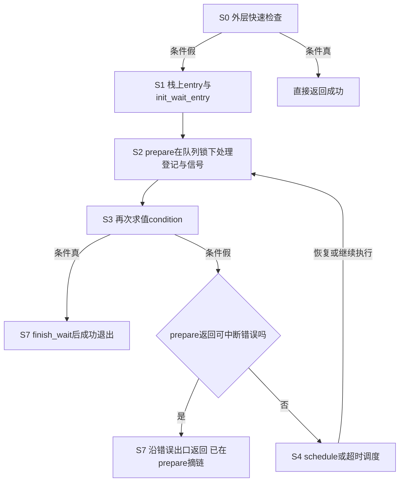
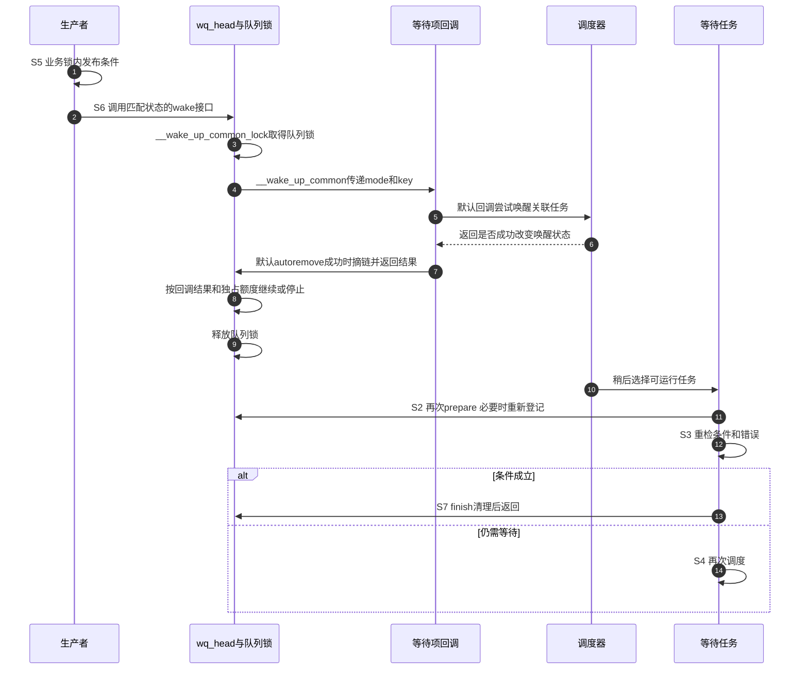

# 第4章\_wait\_event入队与唤醒调用链

## 4.1\_把上一章的阶段接到真实入口

上一章用S0～S7解释四个到达窗口，现在固定到NXP Linux 6.12.20，检查标准宏究竟怎样实现它们。首先分开两个入口：wait_event_interruptible可以先做S0快速条件检查；只有条件为假，才进入内部___wait_event循环。不能说每次调用都必然登记或睡眠，也不能因为外层有快查就认为它存在第三章的空窗。

条件表达式在快查、prepare以后和再次循环时都可能执行。它应按业务同步协议观察状态；如果写成一次性取走资源的动作，就必须另外证明所有求值路径的消费语义。第一章的box_readable只观察full/stopping，消费发生在另外的锁内，所以读者可以分别证明两件事。

版本化阅读从[源码总索引](../../../../../research/source_reading/waiting_notification/navigation/P01_Linux_6.12_等待与完成量源码总阅读索引.md#1.1_版本边界与阅读任务)进入，本章只把机制阶段映射到接口协作，不复制上游宏体。具体宏体和函数体在唯一实现讲解处阅读。

## 4.2\_等待侧状态落点

固定宏声明栈上wait_queue_entry，并用init_wait_entry初始化；不是凭空出现一个永久的每设备任务节点。默认private指向current，func为autoremove_wake_function，flags记录独占与否。此时entry仍是局部对象，S2将它连接到共享队列后，远端生产者才有路径找到它。

登记与设态在prepare里受队列锁协调，但队列锁不保护box.full等业务字段。S3仍须遵守调用者的业务同步协议。栈上entry在退出前必须脱离共享链表，否则函数返回以后生产者还可能经队列访问这块已经复用的栈内存。

## 4.3\_prepare与信号不是相互独立的判断

prepare_to_wait_event持有wq_head.lock时检查当前任务的信号状态。若需要返回可中断错误，它先把entry摘除，避免后续唤醒仍把额度花在已选择离开的等待者上；否则在需要时入队，并设置任务等待状态。

prepare返回之后，宏先检查condition，再处理prepare返回的信号错误。这一先后很重要：通知、业务条件与信号可以相邻发生，不能画成“见到信号一律跳过条件并失败”。如果条件已成立，走正常成功与finish路径；条件仍假且错误有效，走错误出口。成功等待仍只是让调用者继续业务协议，不替它取得第一章那把消费锁。

这里也解释了为什么不是所有退出都调用finish_wait：信号分支已经承担摘链责任，标准宏按其契约返回。手写等待不能只复制goto而省掉配套的prepare行为。精确分支见[prepare登记与信号实现](../../../../../research/source_reading/waiting_notification/source_explanations/kernel/sched/wait.c.md#1.3_prepare_to_wait_event登记与信号分支)。

## 4.4\_唤醒侧怎样到达等待任务

以wake_up_interruptible为例，它传递可中断任务的状态模式和独占额度，普通调用不带poll键；wake_up_interruptible_poll等接口才会携带事件掩码作为键。键是传给回调的信息，不是__wake_up_common替所有对象统一解释的业务条件。

__wake_up_common本身遍历entry并调用func，回调负责判断是否匹配并执行自己的动作；回调返回值和flags再决定额度与扫描是否继续。它不会直接调用读者的消费函数，也不保证读者马上运行。poll回调可能只是记录候选或触发标志，所以不能把所有成功回调都解释成直接把某个普通等待线程唤醒。

## 4.5\_finish为何还需要队列同步

默认autoremove_wake_function在成功唤醒时可以摘除节点，并非只有某种罕见特殊回调才会移除entry。因此任务继续执行时既可能已不在队列，也可能仍在；再次prepare会按实际链表状态决定是否重加。

正常退出的finish_wait先恢复TASK_RUNNING，再通过安全的空链判断决定是否加队列锁摘链。这个判断配合并发摘链协议使用，不是任意无锁遍历链表的许可证。退出同步确保生产者不能再通过共享队列回调访问已失效的栈节点。具体实现见[finish清理](../../../../../research/source_reading/waiting_notification/source_explanations/kernel/sched/wait.c.md#1.5_finish_wait恢复任务并移除栈上entry)。

## 4.6\_超时与条件同时到达

可中断超时宏区分负值信号、0表示超时且条件仍假、正值表示条件成立。普通非可中断超时宏没有负信号结果，不能把同一张三分表不加条件地套到全部宏上。参数使用jiffies，成功结果至少为1，即使剩余等待时间已经到0但条件检查为真，也按成功返回。

设生产者在最后一个节拍附近置full，等待者恢复后先求值条件。如果结果为真，宏保留成功语义；若返回0，生产者以后仍可能再来。因此超时不是撤销通知源或回收对象的证明。第一章的消费阶段还会再次加业务锁，应继续处理另一个消费者已经先取走记录的情况。

## 4.7\_沿同一阶段核对源码

wait宏、waiter结构与函数合作见[普通等待队列模块导读](../../../../../research/source_reading/waiting_notification/navigation/P02_Linux_6.12_普通等待队列模块源码概念导读.md#2.3_等待侧调用链)。阅读时给每一处动作标上S0～S7：快查属于S0，初始化属于S1，prepare登记/设态属于S2，condition和信号决策属于S3，调度属于S4，生产者更新属于S5，wake传播属于S6，最终正常或错误清理属于S7。

宏体逐支对照见[wait_event宏循环与出口](../../../../../research/source_reading/waiting_notification/source_explanations/include/linux/wait.h.md#1.3_wait_event宏循环与出口)，不要把prepare的函数体误当成整个等待宏。

再用[四窗口推演](P03_条件等待的统一状态机.md#3.5_逐个关闭检查睡眠窗口)逐条走一遍：哪个窗口由S3看到持久状态补偿，哪个窗口由已登记的通知关系补偿？如果画出的调用链每次schedule回来都直接finish，就会跳过条件仍假的循环分支，应回到宏体修正。

## 4.8\_回顾与下一问

现在可以区分三个容易混淆的事实：entry已登记、任务可被匹配唤醒、业务资源已经取得。标准宏协调前两者与条件重检，第三个事实仍属于调用者协议。

试着解释：prepare已返回信号错误，为什么宏还要先判断condition？默认回调已经摘链，为什么finish仍要处理可能留下的节点？不带key的wake和带poll键的wake，究竟由谁解释差异？答案应落在具体分支和状态地址，而不是“内核会处理好”。

下一章改变负载：同一个资源面对许多等待者，广播会使多少任务白跑一趟？沿同一条wake扫描学习独占额度和公平性，再把概念上的分段扫描与固定版本的实际实现分开。

上一篇：[条件等待的统一状态机](P03_条件等待的统一状态机.md)。

下一篇：[独占等待、批量唤醒与公平性](P05_独占等待批量唤醒与公平性.md)。
