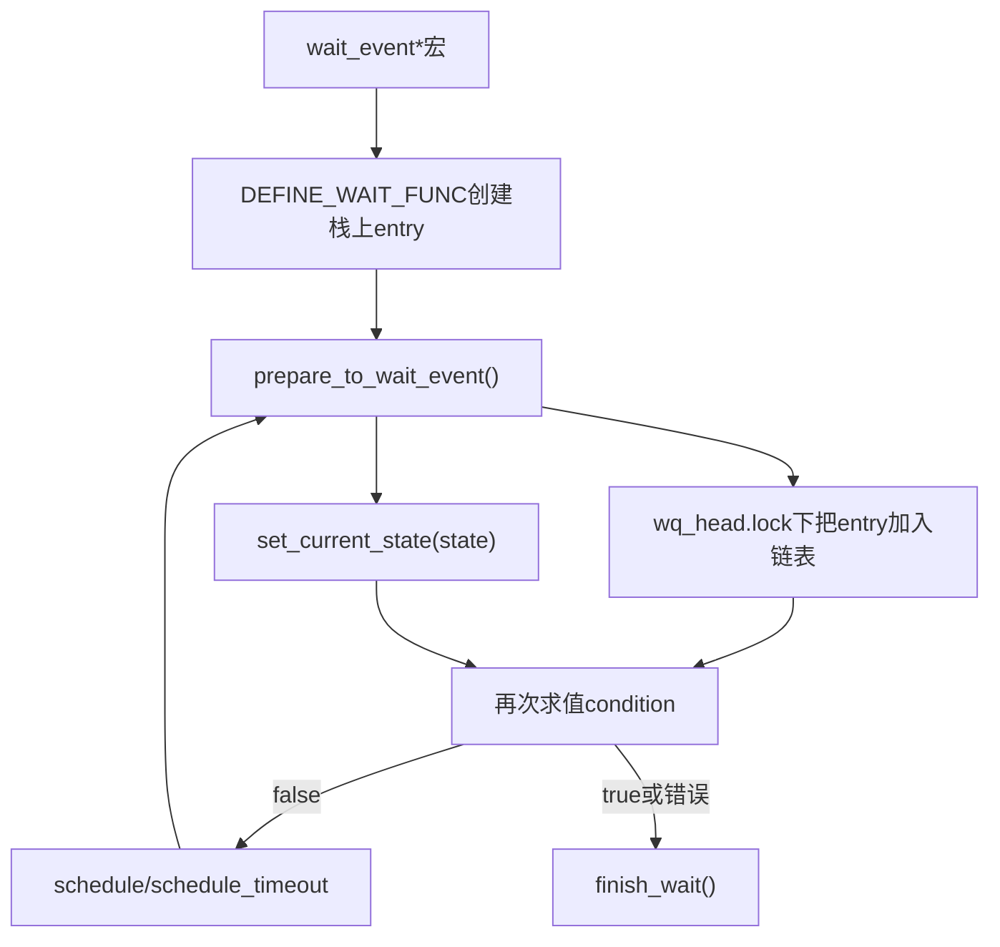
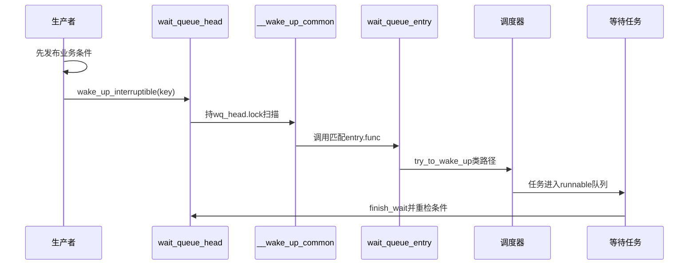

# 第4章\_wait\_event入队与唤醒调用链

## 4.1\_宏不是一次函数调用

`wait_event_interruptible(wq, condition)` 会展开为一个循环：初始化等待项、调用 `prepare_to_wait_event()`、检查 condition/信号、执行调度动作，最后 `finish_wait()`。条件表达式可能执行多次，必须无不可回滚副作用，并且每次读取都遵守业务状态的同步协议。

## 4.2\_等待侧状态落点

entry 通常位于等待任务栈上，`private` 指向该任务，默认唤醒回调最终进入调度器 try-to-wake 路径。`finish_wait()` 必须在栈上 entry 失效前恢复任务状态并把它从共享链表移除。

## 4.3\_prepare\_to\_wait\_event处理信号竞态

Linux 6.12.20 的 `prepare_to_wait_event()` 在队列锁下处理 entry 登记和可中断等待的信号竞态。如果已有信号，它要确保 waiter 不残留在队列中再返回错误；否则先登记再设置任务状态。调用者随后重检条件，决定调度还是退出。

这说明 interruptible 失败不是宏外围的附加判断，而是等待状态机的一条正式退出分支；返回负值时业务条件未必成立，调用者不能继续当作成功消费数据。

## 4.4\_唤醒侧调用链

`__wake_up_common()` 按 mode、key 与 entry flags 扫描；回调返回值参与独占 waiter 计数。它不直接运行等待任务，只改变其可调度状态。

## 4.5\_finish\_wait为何还要再次加队列锁

等待任务醒来时，entry 可能仍在链表，也可能已由特殊回调移除。`finish_wait()` 先把 current 恢复为 `TASK_RUNNING`，再安全检查和删除 entry。删除要与并发 wake 扫描同步；不能因为“任务已经醒了”就省略队列清理。

## 4.6\_超时与条件同时到达

超时宏要区分三类结果：负值信号、0 超时、正值表示条件成立并携带剩余时间语义。边界 jiffy 上条件与 timeout 同时发生时，具体宏的注释决定返回规则。正确调用者应先解释返回值，再在业务锁下重检条件，不能把非零统一理解为错误或成功。

## 4.7\_源码入口

wait 宏、waiter 结构、`prepare_to_wait_event()`、`__wake_up_common()` 和 `finish_wait()` 的模块协作见[普通等待队列模块源码概念导读](../../../../../research/source_reading/waiting_notification/navigation/P02_Linux_6.12_普通等待队列模块源码概念导读.md#2.3_等待侧调用链)。唯一裁剪实现见[`wait.c` 入队与唤醒源码实现](../../../../../research/source_reading/waiting_notification/source_explanations/P01_Linux_6.12_wait_c入队与唤醒源码实现.md#1.2_源码符号覆盖账本)。

## 4.8\_本章结论与下一问

等待侧通过栈上 entry 与 `task_struct` 建立共享登记，唤醒侧在队列锁下调用回调并把任务送回 runqueue。高并发下扫描整个长队列和广播所有消费者会形成成本；下一章研究 exclusive waiter、唤醒批次与 bookmark。

上一篇：[条件等待的统一状态机](P03_条件等待的统一状态机.md)。

下一篇：[独占等待、批量唤醒与公平性](P05_独占等待批量唤醒与公平性.md)。
