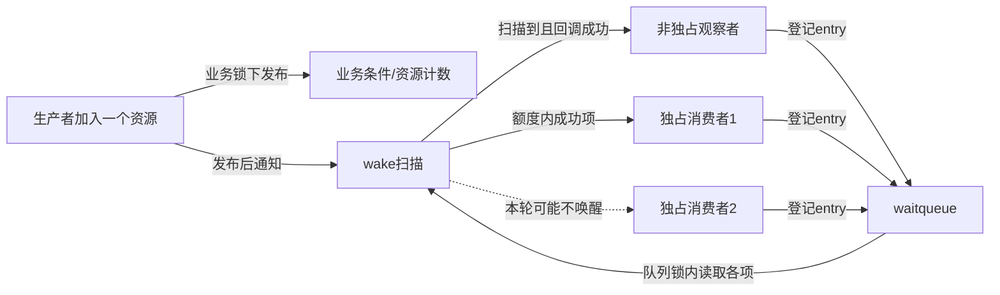
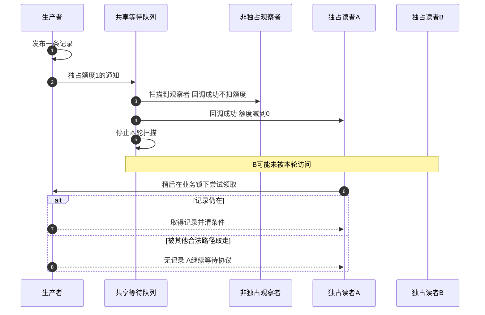
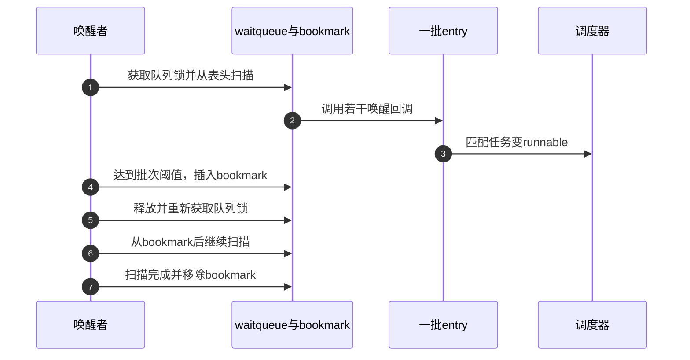

# 第5章\_独占等待批量唤醒与公平性

## 5.1\_广播为何会形成惊群

若一个新资源只能被一个消费者取走，却把几十个等待任务全部置为 runnable，它们会同时争夺业务锁和 CPU；最终只有一个成功，其余再次睡眠。广播没有破坏正确性，却把一次资源到达放大成多次调度、锁竞争和缓存迁移。

沿用单槽采样对象：生产者只增加一条记录，却使多个读者进入可运行状态。它们依次或在不同CPU上尝试获取同一业务锁；第一名取走记录并清full，后续读者即使得到锁也只读到空，再次登记等待。在多CPU场景，锁字和full所在缓存行可能在不同执行CPU之间转移写入权限；在单CPU上仍有调度和无效检查成本。实际代价取决于唤醒者数量、调度、锁和缓存布局，不能把每次唤醒都等同于一次固定缓存迁移。

这里的浪费是“只有一份可消费工作，却安排很多消费者竞争”。若条件是设备停止、配置阶段完成等所有观察者都必须知道的事实，广播本来就有价值，不能为减少唤醒数量而让部分任务永远留在旧阶段。

## 5.2\_非独占与独占waiter并存

| waiter 类型 | 典型含义 | wake 扫描行为 |
| --- | --- | --- |
| 非独占 | 广播状态变化、观察者 | 扫描到该项时执行回调，成功也不扣独占额度 |
| 独占 | 单个可消费资源的候选者 | 成功回调扣额度，用完可停止扫描 |

`wake_up()`不能简单说成“唤醒一个”：固定Linux 6.12.20的nr_exclusive限制成功独占回调数，不限制前面成功的非独占回调数。回调返回0不扣额度，返回负值可提前终止扫描。mode与key传给各entry的func，由回调解释，扫描核心不直接检查采样缓冲是否有数据。

独占额度为0用作不按独占成功次数停止的接口约定，例如wake_up_all；它不是“一个也不允许唤醒”。但all也不能绕过回调自己的匹配和退出规则。额度用完后，排在更后面的非独占项未必被访问，所以“所有非独占项无条件全部通知”同样过于绝对。

## 5.3\_通信关系



独占只约束唤醒数量，不把业务资源直接交给任务。醒来的消费者仍必须在业务锁下重检和领取；另一路径可能先消费资源。



### 5.3.1\_用C观察额度怎样截断扫描

下面固定六项：观察者、未成功的独占项、成功独占项、另一个观察者、第二个成功独占项、最后一个观察者。回调结果由输入预先给定，只模拟扫描决策，不调用内核、不访问任务，也不分配业务记录。扫描函数把0额度解释为不限次数，和固定实现的停止语义对齐，不逐行复制其返回剩余额度的实现。

```c
#include <assert.h>
#include <stdbool.h>
#include <stddef.h>
#include <stdio.h>

struct entry_model { bool exclusive; int callback_result; };
struct scan_result { unsigned int visited, successful, exclusive; };

static struct scan_result scan(const struct entry_model *entries,
                               size_t count, unsigned int limit)
{
    struct scan_result result = {0};
    for (size_t i = 0; i < count; ++i) {
        ++result.visited;
        if (entries[i].callback_result < 0)
            break;                         /* 回调可要求提前终止。 */
        if (entries[i].callback_result == 0)
            continue;                      /* 失败不消耗额度。 */
        ++result.successful;
        if (entries[i].exclusive) {
            ++result.exclusive;
            if (limit != 0 && result.exclusive == limit)
                break;
        }
    }
    return result;
}

int main(void)
{
    const struct entry_model entries[] = {
        {false, 1}, {true, 0}, {true, 1},
        {false, 1}, {true, 1}, {false, 1}
    };
    const size_t count = sizeof(entries) / sizeof(entries[0]);
    struct scan_result one = scan(entries, count, 1);
    struct scan_result two = scan(entries, count, 2);
    struct scan_result unlimited = scan(entries, count, 0);
    assert(one.visited == 3 && one.successful == 2 && one.exclusive == 1);
    assert(two.visited == 5 && two.successful == 4 && two.exclusive == 2);
    assert(unlimited.visited == 6 && unlimited.successful == 5);
    puts("visited: limit1=3 limit2=5 unlimited=6");
    return 0;
}
```

保存为wake_scan_model.c，用`cc -std=c11 -Wall -Wextra -Werror -O2 wake_scan_model.c -o wake_scan_model`编译运行，预期输出为`visited: limit1=3 limit2=5 unlimited=6`。注意额度1时成功回调有2个，而最后的观察者没有被访问；两个事实同时成立。

先把第一个独占项的返回值从0改成1，预测三个visited会怎样改变，再调整断言验证。再把第一个观察者返回值改成-1，即使额度为0也只访问第一项。最后把观察者移动到前面，比较扫描范围：列表次序会影响通知对象，但仍不证明谁先运行或先取得业务锁。

## 5.4\_bookmark为何存在

长等待队列上若始终持有 `wq_head.lock` 扫描并调用大量回调，会扩大IRQ关闭/自旋锁持有时间。先明确版本边界：本仓库固定Linux 6.12.20的 `__wake_up_common_lock()` 与 `__wake_up_common()` 没有bookmark分段扫描路径，详见[固定版本模块导读](../../../../../research/source_reading/waiting_notification/navigation/P02_Linux_6.12_普通等待队列模块源码概念导读.md#2.5_bookmark与长队列)。

下面保留一种分段设计的概念推演，不作为当前内核行为：如果选择在达到批次阈值后释放队列锁，就需要保存“下次从哪里继续”。把当前位置记成特殊entry，可以在再次加锁后从这个标记继续；这个标记称为bookmark。还必须另行证明并发增删、回调移除和标记生命期，不是加一条阈值判断就完成实现。

这个方案把一次完整扫描拆成多个锁区间，代价是多轮加锁和bookmark状态；具体时间还受单次回调耗时影响，不能仅用处理项数声称有严格时间上界。它不减少必须检查的waiter总量，也不把队列变成严格公平调度器。

## 5.5\_批量扫描时序

下图只展开5.4的概念方案，不是固定提交调用链；当前实现仍在队列锁内按回调结果与exclusive额度完成一次扫描。



## 5.6\_公平性边界

固定实现中的等待链表顺序和exclusive计数影响谁先被考虑，但最终运行顺序仍由调度器优先级、CPU亲和和系统负载决定；醒来后领取资源还受业务锁竞争影响。即使采用上节分段方案，这些运行与消费边界也不会自动改变。内核接口没有承诺时，驱动不能依赖“第一个入队一定第一个消费”实现协议。

如果必须为每个请求提供明确归属，应在业务层建立请求对象、序号或队列，由 wake 只通知对应状态变化，而不是从 waitqueue 的内部遍历顺序推导所有权。

加入请求序号的代价是额外的业务状态与取消规则，不能仅改唤醒额度便获得严格公平性。反过来，如果业务只要求最终有消费者处理数据、没有先来先服务契约，保留较简单的竞争领取协议也可以成立，应测量无效唤醒和长尾等待，而不是为了“公平”三个字引入不需要的排队层。

## 5.7\_选择核对

- 条件变化是广播事实，还是一个只能被单消费者领取的资源？
- 非独占观察者与独占消费者是否混在同一队列，唤醒语义是否仍清晰？
- 长队列的 wake 延迟来自回调数量、队列锁还是业务锁竞争？
- 业务是否错误依赖 waitqueue 的内部顺序？
- poll key、任务 state 与 entry callback 是否会过滤一部分 waiter？

## 5.8\_本章结论与下一问

exclusive waiter限制成功唤醒额度；分段扫描是另外一种需要独立论证的设计，不属于本章固定源码当前路径。这些策略都不替业务保存事件。completion则明确在对象中保存 `done` 令牌，下一章追踪提前complete、等待消费和广播完成的源码状态机。

上一篇：[wait_event 入队与唤醒调用链](P04_wait_event入队与唤醒调用链.md)。

下一篇：[completion 令牌状态与调用链](P06_completion令牌状态与调用链.md)。
