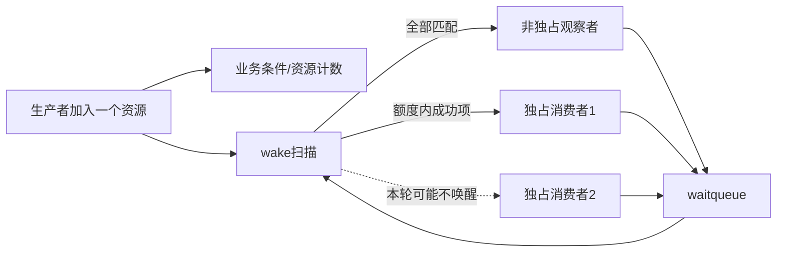
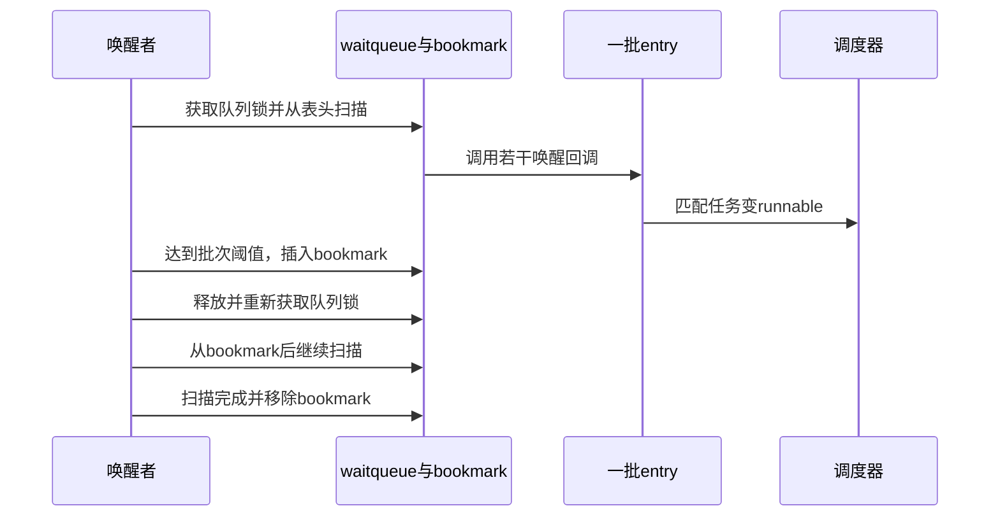

# 第5章\_独占等待批量唤醒与公平性

## 5.1\_广播为何会形成惊群

若一个新资源只能被一个消费者取走，却把几十个等待任务全部置为 runnable，它们会同时争夺业务锁和 CPU；最终只有一个成功，其余再次睡眠。广播没有破坏正确性，却把一次资源到达放大成多次调度、锁竞争和缓存迁移。

## 5.2\_非独占与独占waiter并存

| waiter 类型 | 典型含义 | wake 扫描行为 |
| --- | --- | --- |
| 非独占 | 广播状态变化、观察者 | 所有匹配项都可能被回调 |
| 独占 | 单个可消费资源的候选者 | 成功唤醒达到额度后停止计数 |

`wake_up()` 不能简单说成“唤醒一个”：Linux 6.12.20 会处理匹配的非独占 waiter，同时按 `nr_exclusive` 限制成功唤醒的独占 waiter。接口名中的 one/all 只有结合 entry flags 才能得到真实范围。

## 5.3\_通信关系

独占只约束唤醒数量，不把业务资源直接交给任务。醒来的消费者仍必须在业务锁下重检和领取；另一路径可能先消费资源。

## 5.4\_bookmark为何存在

长等待队列上若始终持有 `wq_head.lock` 扫描并调用大量回调，会扩大 IRQ 关闭/自旋锁持有时间。bookmark 允许扫描在达到批次阈值后把当前位置作为特殊 entry 留在链表，暂时释放锁，再从标记处继续。

被缩短的单次持锁成本由多轮加锁和 bookmark 状态替代。它改善最坏锁持有时间，不减少必须检查的 waiter 总量，也不把队列变成严格公平调度器。

## 5.5\_批量扫描时序

## 5.6\_公平性边界

等待链表顺序、exclusive 计数和 bookmark 影响谁先被考虑，但最终运行顺序仍由调度器优先级、CPU 亲和和系统负载决定；醒来后领取资源还受业务锁竞争影响。内核接口没有承诺时，驱动不能依赖“第一个入队一定第一个消费”实现协议。

如果必须为每个请求提供明确归属，应在业务层建立请求对象、序号或队列，由 wake 只通知对应状态变化，而不是从 waitqueue 的内部遍历顺序推导所有权。

## 5.7\_选择核对

- 条件变化是广播事实，还是一个只能被单消费者领取的资源？
- 非独占观察者与独占消费者是否混在同一队列，唤醒语义是否仍清晰？
- 长队列的 wake 延迟来自回调数量、队列锁还是业务锁竞争？
- 业务是否错误依赖 waitqueue 的内部顺序？
- poll key、任务 state 与 entry callback 是否会过滤一部分 waiter？

## 5.8\_本章结论与下一问

exclusive waiter 减少单资源惊群，bookmark 限制一次扫描的锁持有时间；它们优化调度传播，不保存业务事件。completion 则明确在对象中保存 `done` 令牌，下一章追踪提前 complete、等待消费和广播完成的源码状态机。

上一篇：[wait_event 入队与唤醒调用链](P04_wait_event入队与唤醒调用链.md)。

下一篇：[completion 令牌状态与调用链](P06_completion令牌状态与调用链.md)。
