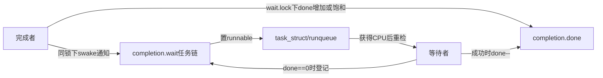
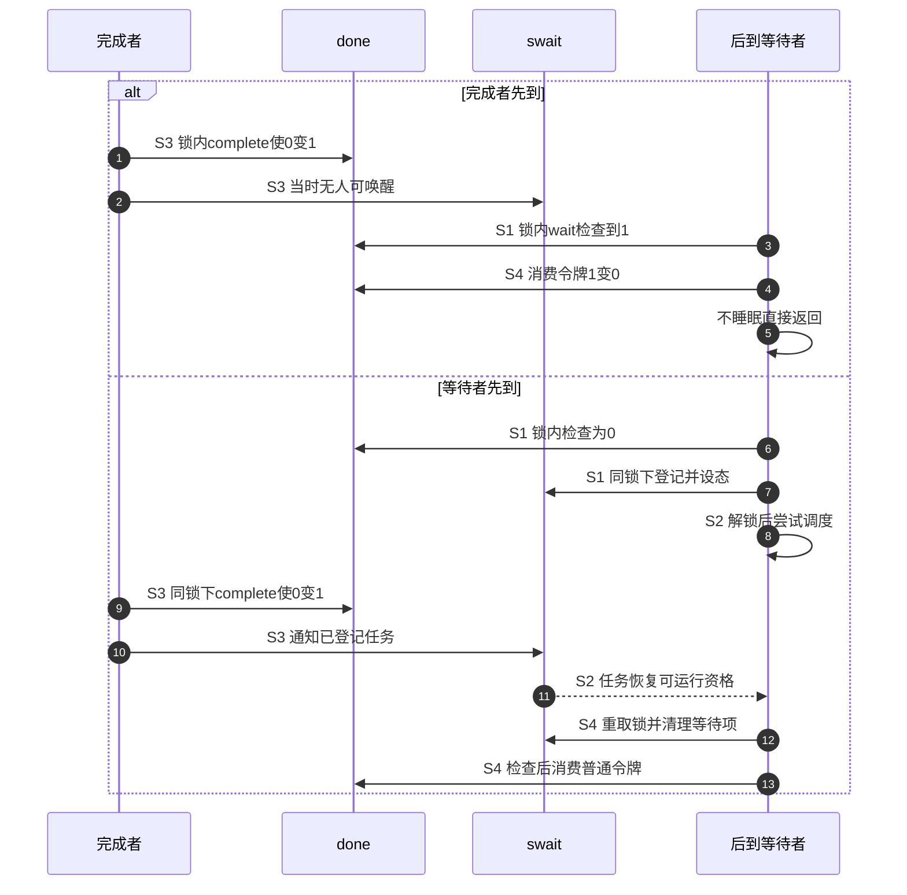

# 第6章\_completion令牌状态与调用链

## 6.1\_completion比裸wake多了什么

裸 waitqueue 只有等待者链表；事件先发生而没有业务条件保存时，后来的等待者无法知道曾经 wake。completion 把 `done` 放进同步对象：`complete()` 先增加令牌再唤醒，即使当时无人等待，未来 waiter 也能消费。它把“完成事实”从瞬时调度动作变成可观察状态。

## 6.2\_完成对象与任务状态怎样协作

沿用第二章的异步请求。结果字段在请求对象里，done在其completion成员里，等待者节点在completion.wait的链上，任务可运行状态由调度器管理。done与等待链是同步对象内的两组状态；任务是否已经被调度执行是另一件事，结果的轮次与所有权则属于外层业务协议。

`done` 保存令牌/广播完成状态，swait只保存当前等待任务。正常发布、入队、检查和消费由同一把x->wait.lock串行协调，从而避免令牌检查与入队之间丢失完成。初始化与reinit不属于这一并发协议：尤其reinit直接写done而不取得此锁，必须由外层保证没有旧参与者冲突。

## 6.3\_S0到S6周期

下表是可组合的阶段，不是每次操作必经的直线。S3可发生在S1之前，S5可以从尚未完成的阶段直接发布广播；广播不需要先做一次单次完成。只有S6允许开启新一轮，而这一许可来自外层轮次协议。

| 阶段 | done | waiter 状态 | 动作 |
| --- | --- | --- | --- |
| S0 初始 | 0 | 无或未登记 | `init_completion()` |
| S1 等待检查 | 0才需登记 | 同一锁下进入swait链并设任务状态 | 若已有令牌，直接走S4 |
| S2 等待调度 | 检查时为0 | 已登记，解锁后调用调度动作 | 通知可能早于真正阻塞；醒后重取锁检查 |
| S3 单次完成 | 未饱和时加一 | 有等待者则尝试通知一个 | complete经helper调用swake_up_locked |
| S4 清理与消费 | 正数且非饱和时减一 | 睡眠路径先finish swait；快路径无需登记 | 在同一锁下取得完成事实，再向调用者返回 |
| S5 广播完成 | `UINT_MAX` | 唤醒全部 | 后续 wait 均直接通过 |
| S6 新一轮 | 需要重置时归0 | 必须确认旧等待者和完成者已离开 | 外层安全协议下reinit，不自动取消旧工作 |

## 6.4\_提前完成与等待消费

若 waiter 先到，`do_wait_for_common()` 在 swait 锁下循环检查 `done`，为零时准备 exclusive swait 并调度；complete 在同一锁下增加 done、唤醒一个任务。醒来后 waiter 再检查并消费。

这里的“同一锁”关闭了具体空窗：等待方持锁看到done为0，并在解锁前登记等待项和任务状态；完成者若要增加done，必须等锁释放，于是既能保存令牌，又能找到已登记任务。如果完成者更早拿到锁，后来等待者则直接看到正数，不必进入睡眠路径。双方不是靠猜对执行时间达成一致。

S2返回后先在锁内重新检查done，才决定返回超时还是走S4。若调度动作已经用完超时，但锁内发现done为正，固定实现仍消费并返回至少1；若最终返回0，只说明这次未取得令牌，之后complete仍可能增加done。超时与完成竞态必须按实际返回值分流，不能用墙上时钟替代这次锁内决定。

## 6.5\_complete\_all的永久完成状态

`complete_all()` 把 `done` 设为 `UINT_MAX` 并唤醒全部 waiter。成功 wait 遇到饱和值时不递减，因此未来等待也直接返回。它适合“这个生命周期阶段从此成立”，不适合每轮只发一个令牌的循环协议。

要复用必须由更高层状态证明所有旧 waiter 和完成者都已离开，再调用 `reinit_completion()`。`completion_done()` 只能观察 done，不告诉调用者 complete_all 后是否仍有旧 waiter 正在返回途中。

“永久”只表示在显式安全重置之前不会被普通wait消耗掉，不表示对象可以永久存活或不再需要引用。complete_all也不是把一个令牌复制成恰好等于当前等待者数目的有限计数：后来才到的任务同样直接通过。可运行的对照见[第二章C令牌实验](P02_completion_完成量.md#2.7_用完整C模型观察令牌与广播)。

## 6.6\_内存顺序与生命周期

完成者应先写结果字段，再complete；成功等待方可依据这一完成边界读结果，前提是没有其他无同步写入继续改变结果。内部锁负责完成协议，不替代结果以后所有访问的互斥。失败或超时路径没有取得同样的成功交付结论。

对象仍必须存活。超时返回不代表完成者已停止，释放前要按硬件、IRQ、work或线程的实际依赖同步退出。不能先关闭唯一完成源，再等待它发出通知；[停机的两条路径](P02_completion_完成量.md#2.8_停机不能切断唯一完成源再等待它)分别说明保留完成路径与真正取消的条件。

## 6.7\_源码入口

`struct completion`、swait、complete/wait 调用链见[completion 模块源码概念导读](../../../../../research/source_reading/waiting_notification/navigation/P03_Linux_6.12_completion模块源码概念导读.md#3.2_状态所有权)。唯一裁剪实现见[`completion.c` 令牌与等待源码实现](../../../../../research/source_reading/waiting_notification/source_explanations/P02_Linux_6.12_completion_c令牌与等待源码实现.md#2.2_源码符号覆盖账本)。

## 6.8\_本章结论与下一问

completion 由 `done` 令牌状态机和 swait 调度状态机共同组成；complete 早到不会丢，但轮次复用和对象释放仍需外部协议。最后一章比较 swait 与普通 waitqueue，并把 teardown、调试和选择边界合并检查。

复核时先遮住函数名，只问地址与动作：谁在锁内把done从0改成1，谁把自己的节点登记到同一对象，谁在返回前消费令牌？再把complete替换为complete_all，预测S4为什么不再减计数。最后把正常完成改成超时，指出哪条路径负责让旧生产者停止；completion等待函数本身没有承担这个动作。

上一篇：[独占等待、批量唤醒与公平性](P05_独占等待批量唤醒与公平性.md)。

下一篇：[swait、生命周期、调试与选型](P07_swait生命周期调试与选型.md)。
