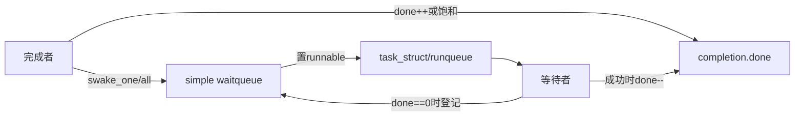
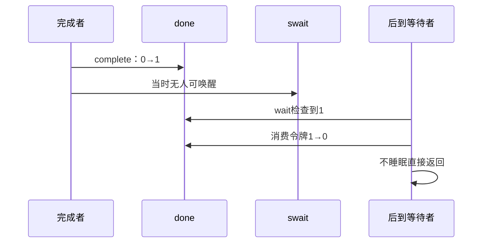

# 第6章\_completion令牌状态与调用链

## 6.1\_completion比裸wake多了什么

裸 waitqueue 只有等待者链表；事件先发生而没有业务条件保存时，后来的等待者无法知道曾经 wake。completion 把 `done` 放进同步对象：`complete()` 先增加令牌再唤醒，即使当时无人等待，未来 waiter 也能消费。它把“完成事实”从瞬时调度动作变成可观察状态。

## 6.2\_双状态机组成

`done` 证明令牌/广播完成状态，swait 只保存当前 waiter。两者都由 `x->wait.lock` 串行修改，从而避免令牌检查与入队之间丢失完成。

## 6.3\_S0到S6周期

| 阶段 | done | waiter 状态 | 动作 |
| --- | --- | --- | --- |
| S0 初始 | 0 | 无或未登记 | `init_completion()` |
| S1 等待检查 | 0 | 即将登记 | waiter 进入 swait |
| S2 睡眠 | 0 | `TASK_*` | 调度等待 complete |
| S3 单次完成 | 正常计数加一 | 选择一个 waiter | `complete()` + `swake_up_one()` |
| S4 消费 | 正数且非饱和 | waiter 已运行 | 成功 wait 将 done 减一 |
| S5 广播完成 | `UINT_MAX` | 唤醒全部 | 后续 wait 均直接通过 |
| S6 新一轮 | 0 | 必须确认旧 waiter 离开 | 安全协议下 `reinit_completion()` |

## 6.4\_提前完成与等待消费

若 waiter 先到，`do_wait_for_common()` 在 swait 锁下循环检查 `done`，为零时准备 exclusive swait 并调度；complete 在同一锁下增加 done、唤醒一个任务。醒来后 waiter 再检查并消费。

## 6.5\_complete\_all的永久完成状态

`complete_all()` 把 `done` 设为 `UINT_MAX` 并唤醒全部 waiter。成功 wait 遇到饱和值时不递减，因此未来等待也直接返回。它适合“这个生命周期阶段从此成立”，不适合每轮只发一个令牌的循环协议。

要复用必须由更高层状态证明所有旧 waiter 和完成者都已离开，再调用 `reinit_completion()`。`completion_done()` 只能观察 done，不告诉调用者 complete_all 后是否仍有旧 waiter 正在返回途中。

## 6.6\_内存顺序与生命周期

完成者应先写结果字段，再 `complete()`；等待者成功返回后再读取结果。completion 的内部锁和接口契约建立完成边界，但对象仍必须存活。超时返回不代表完成者已停止，调用者必须先取消硬件、IRQ、work 或线程并同步退出，才能释放 completion 所在对象。

## 6.7\_源码入口

`struct completion`、swait、complete/wait 调用链见[completion 模块源码概念导读](../../../../../research/source_reading/waiting_notification/navigation/P03_Linux_6.12_completion模块源码概念导读.md#3.2_状态所有权)。唯一裁剪实现见[`completion.c` 令牌与等待源码实现](../../../../../research/source_reading/waiting_notification/source_explanations/P02_Linux_6.12_completion_c令牌与等待源码实现.md#2.2_源码符号覆盖账本)。

## 6.8\_本章结论与下一问

completion 由 `done` 令牌状态机和 swait 调度状态机共同组成；complete 早到不会丢，但轮次复用和对象释放仍需外部协议。最后一章比较 swait 与普通 waitqueue，并把 teardown、调试和选择边界合并检查。

上一篇：[独占等待、批量唤醒与公平性](P05_独占等待批量唤醒与公平性.md)。

下一篇：[swait、生命周期、调试与选型](P07_swait生命周期调试与选型.md)。
