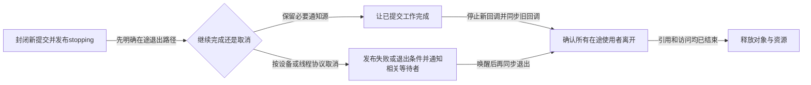

# 第7章\_swait生命周期调试与选型

## 7.1\_为什么还需要simple\_waitqueue

普通 waitqueue 支持自定义唤醒回调、key、poll 和非独占/独占混合，能力也带来更复杂的 entry 语义。simple waitqueue 面向受控的内核内部场景，等待项固定关联任务并使用更窄的唤醒模型。completion 选择 swait，是因为它自己的 `done` 已经表达业务状态，不需要普通 waitqueue 的全部扩展能力。

把普通队列的成本具体展开：唤醒路径在队列锁下遍历节点，每个节点可能执行不同回调，回调本身又可能做额外工作。队列长、回调复杂时，锁持有和关中断时间不只取决于“唤醒一个任务”这一句话。swait通过限制回调与等待模式收窄这条路径；它的取舍首先是受控的执行行为，结构更小只是附带结果。

固定Linux 6.12.20的swait_queue_head保存raw_spinlock_t类型的lock和task_list；每个swait_queue只关联task与链表节点。单个唤醒直接选队首任务，以TASK_NORMAL状态掩码尝试唤醒并摘链，不提供普通waitqueue的任意回调、poll事件键与非独占混合扫描。这些限制意味着它不能作为更快的同名接口随意替换现有驱动。

## 7.2\_不能机械替换

| 需求 | 普通 waitqueue | swait | completion |
| --- | --- | --- | --- |
| 任意业务条件循环 | 适合 | 仅限明确受控内部场景 | 不适合 |
| poll key/自定义回调 | 支持 | 不提供同等能力 | 不提供 |
| 完成事件提前保存 | 调用者另存条件 | 调用者另存条件 | `done` 内建 |
| 单次或累计令牌完成 | 调用者实现 | 调用者实现 | complete累计，成功wait消费 |
| 持续成立的完成阶段 | 调用者另存状态 | 调用者另存状态 | complete_all发布饱和状态 |
| 广播复杂观察者 | 适合 | 能力受限 | 仅完成语义 |

不能因为 swait 结构小就把驱动 waitqueue 全部换掉；选择首先由协议需要决定。

还要分清两个广播入口。通用swake_up_all会在唤醒间释放并重新取得锁，同时恢复中断，以缩短连续持锁区间，因此不能从原本关中断的上下文随意调用。completion使用专门的swake_up_all_locked，在其已持有的锁下处理全部等待者；固定源码明确这是完成量专用路径，不是通用swait接口。不能把前者的分段行为套到complete_all上，再声称任意长队列都只有固定的关中断时间；实时配置还要遵守complete_all的上下文检查。

## 7.3\_teardown的统一顺序

teardown指把服务从可接受新工作推进到可回收状态。统一的是要证明的依赖，不是所有驱动照抄同一行函数顺序。先封闭新工作入口、发布停止状态，再为已有工作选择完成或取消策略；如果停止生产者需要等待某个任务退出，而该任务还在等停止通知，就必须先让它有机会退出，不能先join再通知。

只 wake 后立即 free 不安全，因为任务变 runnable 到实际执行存在时间窗；只等待 completion 而不停止生产者也不安全，因为刚完成一轮又可能产生新工作。生命周期结论必须覆盖所有入口和异步源。

以第二章请求为例，正常完成可以发布result再complete；取消则应先确定不会再有成功完成与取消处理争用同一请求，再发布取消结果并按约定通知。不能只调用complete_all就声称设备已停止、请求都失败且旧线程已离开。这三个事实分别由设备停止协议、结果状态与使用者同步证明。

## 7.4\_超时不是取消

`wait_event*_timeout()` 或 `wait_for_completion_timeout()` 返回 0，只说明等待方不再继续等。硬件、中断、worker 或远端任务可能稍后仍修改状态和调用 wake/complete。超时路径必须显式执行停止、撤销或引用转移协议；否则最常见结果是栈上 completion 被晚到回调访问，或设备对象已经释放后仍被生产者使用。

超时以后必须给请求一个明确归宿：要么当前路径同步取消并等待所有访问结束，要么将持有的责任交给仍会收尾的异步路径。后一种设计可以避免超时调用长期卡在取消阶段，但要明确谁持引用、谁处理迟到结果、谁最终释放；不能把“以后再处理”当成没有所有者的第三种选择。

## 7.5\_诊断证据

| 症状 | 观察位置 | 优先问题 |
| --- | --- | --- |
| 永久 D 状态 | 任务栈、等待条件、生产者路径 | 条件是否还能变化，wake 是否在改状态后发生 |
| 醒来却无数据 | 业务锁与多个消费者 | 是否误把 wake 当资源交付，是否缺少循环重检 |
| CPU 被唤醒过多 | waiter 类型、广播范围 | 是否应使用 exclusive 或业务批处理 |
| 超时后 UAF | 完成者/生产者生命周期 | 超时是否只返回而没有真正取消 |
| remove 卡死 | 停止顺序和锁依赖 | 是否持有生产者退出所需锁等待它完成 |

tracepoint、调度栈和锁依赖只能帮助观察已发生路径；未复现不证明没有丢唤醒。最小验证应主动覆盖“事件早于等待”“事件落在登记与 schedule 之间”“超时与完成并发”“remove 与 waiter 并发”四种交错。

诊断也要沿地址分层。先查业务full/done/stopping，再查等待项是否仍在正确队列，最后看任务状态与执行栈。如果业务条件一直为假，可能是生产路径已停；若条件为真却永久没有进展，再检查登记、唤醒模式与可见性。D状态只是不可中断等待的观察结果，正常I/O等待也可能出现，不能看到一个D字符就判定死锁。

## 7.6\_选择矩阵

| 要表达的事实 | 原语 | 必须另行维护 |
| --- | --- | --- |
| 队列非空、设备断开等任意条件 | waitqueue | 业务条件、锁与循环重检 |
| 一项工作完成、可保存令牌 | completion | 轮次、取消和对象生命周期 |
| 内核内部受控的简化等待者列表 | swait | 业务状态与严格适用边界 |
| 资源数量 | semaphore/业务计数 + wait | 所有权与资源回收 |
| 排他临界区 | mutex | 它不是事件通知 |

## 7.7\_最终核对表

- 等待对象是条件、完成令牌、资源额度还是互斥所有权？
- 条件和 waiter 分别保存在哪个结构，谁在什么顺序下写？
- 事件早于 waiter、落在检查/睡眠窗口、与超时并发时分别怎样处理？
- wake 的 mode、key、exclusive 数量是否匹配业务语义？
- 超时/信号后生产者是否仍可能访问等待对象？
- teardown 是否封闭新入口，并按完成或取消的依赖通知、同步旧使用者，最后才释放？

用三个场景检查选择依据：设备需要给poll提供事件键，保持普通waitqueue；一次初始化需要保存提前完成，用completion并定义结果交付边界；一个受控实时内部路径希望约束单次唤醒工作量，才评估swait及其上下文限制。若把第一个场景改用swait，丢掉的不是几个字段，而是poll赖以接入的通知协议。

本章没有新增真实停机试验。可以沿前文的[四窗口推演](P03_条件等待的统一状态机.md#3.5_逐个关闭检查睡眠窗口)和[完成令牌C模型](P02_completion_完成量.md#2.7_用完整C模型观察令牌与广播)检验自己的预测；它们不能证明实际设备、回调取消和引用回收已经运行通过。

## 7.8\_专题出口

版本化调用链从[等待与完成量源码总阅读索引](../../../../../research/source_reading/waiting_notification/navigation/P01_Linux_6.12_等待与完成量源码总阅读索引.md#1.5_建议阅读顺序)进入。需要把事件移到线程上下文执行时继续读[工作队列专题](../../asynchrony/workqueue/大纲.md)；需要保护对象生命期时进入 [kref](../../../object_lifetime/kref/大纲.md)或 [RCU](../rcu/大纲.md)。

上一篇：[completion 令牌状态与调用链](P06_completion令牌状态与调用链.md)。
