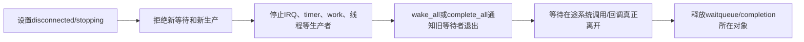

# 第7章\_swait生命周期调试与选型

## 7.1\_为什么还需要simple\_waitqueue

普通 waitqueue 支持自定义唤醒回调、key、poll 和非独占/独占混合，能力也带来更复杂的 entry 语义。simple waitqueue 面向受控的内核内部场景，等待项固定关联任务并使用更窄的唤醒模型。completion 选择 swait，是因为它自己的 `done` 已经表达业务状态，不需要普通 waitqueue 的全部扩展能力。

## 7.2\_不能机械替换

| 需求 | 普通 waitqueue | swait | completion |
| --- | --- | --- | --- |
| 任意业务条件循环 | 适合 | 仅限明确受控内部场景 | 不适合 |
| poll key/自定义回调 | 支持 | 不提供同等能力 | 不提供 |
| 完成事件提前保存 | 调用者另存条件 | 调用者另存条件 | `done` 内建 |
| 单/多令牌完成 | 调用者实现 | 调用者实现 | `complete/complete_all` |
| 广播复杂观察者 | 适合 | 能力受限 | 仅完成语义 |

不能因为 swait 结构小就把驱动 waitqueue 全部换掉；选择首先由协议需要决定。

## 7.3\_teardown的统一顺序

只 wake 后立即 free 不安全，因为任务变 runnable 到实际执行存在时间窗；只等待 completion 而不停止生产者也不安全，因为刚完成一轮又可能产生新工作。生命周期结论必须覆盖所有入口和异步源。

## 7.4\_超时不是取消

`wait_event*_timeout()` 或 `wait_for_completion_timeout()` 返回 0，只说明等待方不再继续等。硬件、中断、worker 或远端任务可能稍后仍修改状态和调用 wake/complete。超时路径必须显式执行停止、撤销或引用转移协议；否则最常见结果是栈上 completion 被晚到回调访问，或设备对象已经释放后仍被生产者使用。

## 7.5\_诊断证据

| 症状 | 观察位置 | 优先问题 |
| --- | --- | --- |
| 永久 D 状态 | 任务栈、等待条件、生产者路径 | 条件是否还能变化，wake 是否在改状态后发生 |
| 醒来却无数据 | 业务锁与多个消费者 | 是否误把 wake 当资源交付，是否缺少循环重检 |
| CPU 被唤醒过多 | waiter 类型、广播范围 | 是否应使用 exclusive 或业务批处理 |
| 超时后 UAF | 完成者/生产者生命周期 | 超时是否只返回而没有真正取消 |
| remove 卡死 | 停止顺序和锁依赖 | 是否持有生产者退出所需锁等待它完成 |

tracepoint、调度栈和锁依赖只能帮助观察已发生路径；未复现不证明没有丢唤醒。最小验证应主动覆盖“事件早于等待”“事件落在登记与 schedule 之间”“超时与完成并发”“remove 与 waiter 并发”四种交错。

## 7.6\_选择矩阵

| 要表达的事实 | 原语 | 必须另行维护 |
| --- | --- | --- |
| 队列非空、设备断开等任意条件 | waitqueue | 业务条件、锁与循环重检 |
| 一项工作完成、可保存令牌 | completion | 轮次、取消和对象生命周期 |
| 内核内部受控的简化等待者列表 | swait | 业务状态与严格适用边界 |
| 资源数量 | semaphore/业务计数 + wait | 所有权与资源回收 |
| 排他临界区 | mutex | 它不是事件通知 |

## 7.7\_最终核对表

- 等待对象是条件、完成令牌、资源额度还是互斥所有权？
- 条件和 waiter 分别保存在哪个结构，谁在什么顺序下写？
- 事件早于 waiter、落在检查/睡眠窗口、与超时并发时分别怎样处理？
- wake 的 mode、key、exclusive 数量是否匹配业务语义？
- 超时/信号后生产者是否仍可能访问等待对象？
- teardown 是否先封入口和生产者，再通知并等待旧使用者退出？

## 7.8\_专题出口

版本化调用链从[等待与完成量源码总阅读索引](../../../../../research/source_reading/waiting_notification/navigation/P01_Linux_6.12_等待与完成量源码总阅读索引.md#1.5_建议阅读顺序)进入。需要把事件移到线程上下文执行时继续读[工作队列专题](../../asynchrony/workqueue/大纲.md)；需要保护对象生命期时进入 [kref](../../../object_lifetime/kref/大纲.md)或 [RCU](../rcu/大纲.md)。

上一篇：[completion 令牌状态与调用链](P06_completion令牌状态与调用链.md)。
