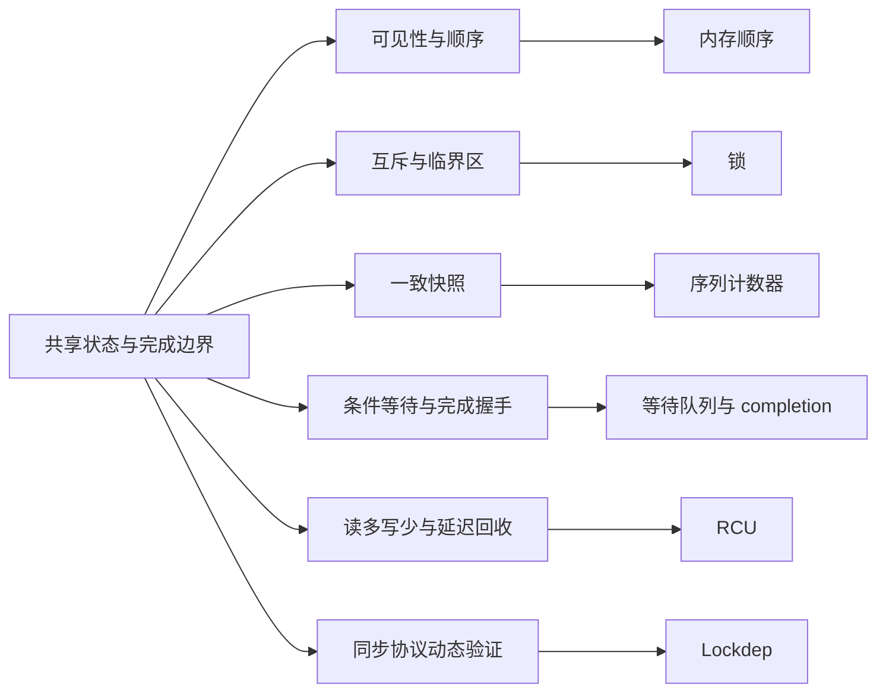

# 第1章\_Linux\_同步机制大纲

## 1.1\_按需要建立的保证进入

## 1.2\_专题入口

1. [Linux 内存顺序](memory_ordering/大纲.md)：建立编译器、CPU 与 Linux Kernel Memory Model 下的访问和顺序保证。
2. [锁](locks/大纲.md)：在可睡与不可睡上下文中建立互斥和读写协议。
3. [序列计数器](sequence_counters/大纲.md)：通过写侧串行化与读侧重试取得一致快照。
4. [等待队列与完成量](waiting_notification/大纲.md)：建立条件等待、唤醒重检和一次工作完成的握手。
5. [RCU](rcu/大纲.md)：协调读多写少访问、宽限期与延迟回收。
6. [Lockdep](lockdep/大纲.md#1.1_专题定位)：验证锁类顺序、IRQ 使用状态和持锁契约；不提供锁的功能语义。Linux 6.12.20 的状态落点和调用链见[源码总阅读索引](../../../../research/source_reading/lockdep/navigation/P01_Linux_6.12_Lockdep源码导读.md#1.6_建议阅读顺序)。

## 1.3\_与异步机制衔接

同步原语约束并发状态，异步机制决定事件在哪个上下文、何时继续执行。进入中断、工作队列、定时器或 fasync 前，先根据共享状态和完成条件选择本节原语；需要选择异步执行载体时转到[异步机制大纲](../asynchrony/大纲.md)。
