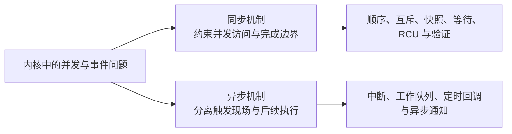

# 第1章\_Linux\_同步和异步机制大纲

## 1.1\_先区分同步约束与异步推进

同步机制回答“多个参与者怎样对共享状态、执行顺序和完成条件形成共同约束”；异步机制回答“事件发生后，工作怎样跨执行上下文、跨时间或跨内核与用户边界继续推进”。两者经常组合，但不应因为共同出现在一条调用链中而混成同一种机制。

## 1.2\_两条专题主线

1. [同步机制](synchronization/大纲.md)：Linux 内存顺序、锁、序列计数器、等待队列与 completion、RCU，以及 Lockdep 验证。
2. [异步机制](asynchrony/大纲.md)：中断、工作队列、定时与延迟执行，以及 fasync 异步通知。

## 1.3\_归属边界

- 本目录保存可跨内核子系统和驱动类型复用的同步、异步机制正文。
- VFS 异步完成、字符设备并发、设备模型异步探测等领域组合仍留在各自权威专题，只链接这里的通用机制。
- MMIO、DMA、对象生命周期和硬件内存模型继续保留独立权威位置；它们与同步或异步机制有关，但主要问题分别是 I/O 顺序、一致性、所有权和硬件观察规则。
