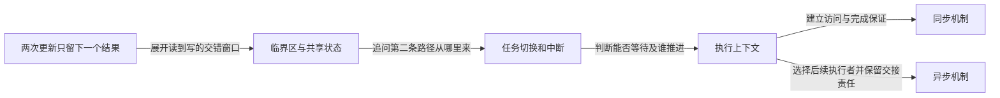

# 第1章\_Linux\_同步和异步机制大纲

## 1.1\_先区分同步约束与异步推进

同一计数被两条路径各加一，为什么最终可能只增加一次？对象没有被释放，不代表每次访问都正确。本专题先让读者运行[交错模型](P01_同一对象的多条执行路径.md#1.2_运行所有允许的交错)，再依据发现的缺口选择机制。

同步机制回答“参与者怎样对共享状态、顺序和完成条件形成共同约束”；异步机制回答“工作怎样跨执行现场或时间继续推进”。两者经常组合：把任务交出去以后，仍要规定接收者何时可读、谁持对象、停止时怎样排空。

## 1.2\_两条专题主线

先读[同一对象的多条执行路径](P01_同一对象的多条执行路径.md#1.1_先把一次加一拆开)，建立单CPU也会交错、互斥代价和上下文约束。然后沿下面两条路线进入现有专题，不要求先背全套接口。

1. [同步机制](synchronization/大纲.md)：Linux 内存顺序、锁、序列计数器、等待队列与 completion、RCU，以及 Lockdep 验证。
2. [异步机制](asynchrony/大纲.md)：中断、工作队列、定时与延迟执行，以及 fasync 异步通知。

## 1.3\_归属边界

- 本目录保存可跨内核子系统和驱动类型复用的同步、异步机制正文。
- 中断的软件管理属于[异步机制](asynchrony/大纲.md#1.2_专题入口)；GIC（Generic Interrupt Controller，通用中断控制器）的硬件规则与编程另按 [GICv3 独立专题](../../../platforms/arm/architecture/gic/大纲.md#1.2_因果阅读地图)学习，不把完整硬件教材并入 Linux 同步和异步机制。
- VFS 异步完成、字符设备并发、设备模型异步探测等领域组合仍留在各自权威专题，只链接这里的通用机制。
- MMIO、DMA、对象生命周期和硬件内存模型继续保留独立权威位置；它们与同步或异步机制有关，但主要问题分别是 I/O 顺序、一致性、所有权和硬件观察规则。

## 1.4\_按问题推进的阅读地图

| 已经得到的认识 | 下一步缺口 | 现有阅读入口 |
| --- | --- | --- |
| 简化模型中临界区排除了丢失更新 | 真实编译器和CPU是否按假设观察每一步 | [内存顺序](synchronization/memory_ordering/大纲.md) |
| 知道共享状态需要共同约束 | 怎样取得、等待、释放；本地重入如何处理 | [锁机制](synchronization/locks/大纲.md) |
| 能保护一次访问 | 怎样等条件成立，怎样读一致快照或延后回收 | [等待](synchronization/waiting_notification/大纲.md)、[序列计数器](synchronization/sequence_counters/大纲.md)、[RCU](synchronization/rcu/大纲.md) |
| 知道原现场不适合做全部工作 | 谁接收后续执行，怎样定时和安全退出 | [中断](asynchrony/interrupts/大纲.md)、[工作队列](asynchrony/workqueue/大纲.md)、[定时](asynchrony/timers/大纲.md) |

带着具体协议进入[Lockdep](synchronization/lockdep/大纲.md)核对动态证据的能力与边界。工作交给用户空间以后，继续[异步通知](asynchrony/async_notification/大纲.md)。每条旁路都要带上其前置同步与生命周期条件，不将入口链接等同于实现证明。
