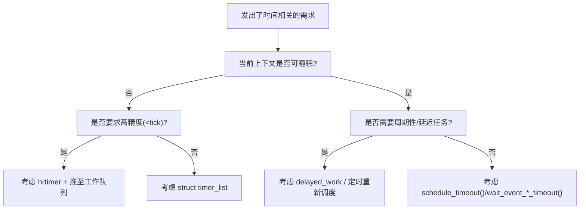

# 第1章_驱动中的_时间问题_概述

## 1.1_本章目标与适用范围

本章要解决的问题是：**在 Linux 驱动开发中，时间不是一个简单的“毫秒”变量，而是一整套有上下文约束的机制，你必须先分清类别，再选接口。**如果不做这一步，后面使用所有时间相关接口都会出现下面几类典型失误：

- 在中断里调用会睡眠的延时函数，直接触发 `BUG: sleeping function called from invalid context`；
- 用 busy-wait（`udelay()`）去等一个几十毫秒的硬件超时，CPU 被白白占住；
- 用 `timer_list` 做高精度采样，结果精度完全不达标；
- 驱动 `remove()` 了，但定时器还在回调，触发 use-after-free；
- 把用户态“500ms”直接写成 `500`，忘了 HZ 是 100 还是 1000，移植失败。

因此本章的目标是：

1. 给出一个**驱动视角**的时间问题分类法；
2. 说明**内核时间与用户态时间的差异来源**，为什么必须做转换；
3. 说明**上下文（进程、中断、软中断）与时间接口的强绑定关系**；
4. 为后续章节（定时器、hrtimer、delayed_work、超时睡眠）建立一条清晰的引线。

本章适用对象：

- 已经在写 platform/i2c/spi/input 等常规驱动，希望“加一个周期性任务/加一个去抖/加一个超时等待”；
- 正在读 5.x/6.x 内核代码，发现同一类驱动里有人用 `delayed_work`，有人用 `timer_list`，有人用 `hrtimer`，想搞清楚区别；
- 需要把设备树的时间类属性（如 `nxp,debounce-ms`）接进驱动的时间机制（这在你后面的 GPIO/按键驱动里是必须的）。

## 1.2_驱动里典型的时间相关场景

从驱动开发的日常需求来看，可以把“跟时间有关的事”先分成以下 6 大类，这个分类会一直贯穿全书，后面每一章你都能找到它的落点。

1. **延后执行（deferred work）**
   - 表现：现在这个上下文不能做（多半是中断里），想挪到稍后、可睡眠的地方做。
   - 典型接口：`timer_list`、`delayed_work`、`hrtimer` + work。
   - 常见场景：中断里只记一次事件，真正的 I/O 放到后面。
2. **周期性任务（periodic task / polling）**
   - 表现：每隔一段时间要轮询硬件、刷新状态、做超时清理。
   - 典型接口：`mod_timer()` 周期化、`schedule_delayed_work()` 周期化、hrtimer 周期模式。
   - 常见场景：传感器轮询、看门狗喂狗逻辑、按键长按检测。
3. **超时等待（timeout wait）**
   - 表现：我要等一个条件成立，但不能一直等下去，等超时就返回。
   - 典型接口：`wait_event_timeout()`、`wait_for_completion_timeout()`、`schedule_timeout()`。
   - 常见场景：等中断、等硬件 ready、等对端 ACK。
4. **短延时/对时序敏感（short delay / timing sensitive）**
   - 表现：对方硬件要求“写寄存器后延时 10us 再写下一次”。
   - 典型接口：`udelay()`、`ndelay()`、`usleep_range()`。
   - 常见场景：低速外设初始化、复位后等待时序。
5. **高精度触发（high resolution trigger）**
   - 表现：要求小于 tick 周期的精度，或者要求 jitter 很小。
   - 典型接口：`hrtimer`、`ktime_*`。
   - 常见场景：工业控制精确采样、某些音频/多媒体时间戳对齐。
6. **随设备生命周期创建/销毁的时间资源（lifecycle-bound timers）**
   - 表现：定时器是跟设备走的，`probe()` 建立，`remove()` 必须停；suspend/resume 也要处理。
   - 典型接口：没有现成的 `devm_timer_*()`，需要自己包；或用 `devm_add_action_or_reset()`。
   - 常见场景：平台设备、MFD 子设备、热插拔类驱动。

你后面会看到，我们之所以要分成这 6 类，是因为**它们的上下文要求、精度要求、生命周期要求完全不一样**，所以不可能只靠一个接口，比如“我只学 `msleep()`”就吃遍所有场景。

## 1.3_用户态时间_vs_内核时间的差异

很多驱动里出现的时间错误，其实都来自这句话：**“用户说500毫秒，内核不能直接写500。”**原因有三点：

1. **内核以 tick/HZ 为基础**
   - 内核的很多定时机制是按“节拍”走的，每来一个 tick，`jiffies` 加一。
   - HZ 可以是 100、250、1000，取决于配置和平台。
   - 所以内核里的“1”不是 1ms / 1us，而是“1个节拍”。
2. **内核还有高精度路径**
   - 为了弥补 tick 的粒度限制，内核提供了 `hrtimer` 和 `ktime_t`，可以做到纳秒级表示。
   - 但是注意：**能表示到 ns，不代表你的硬件/平台/调度真的能做到 ns 级精度**。驱动写法还是要保守。
3. **内核时间要考虑上下文是否可睡眠**
   - 用户态 sleep 一下就是调度，没什么好说的；
   - 内核里你可能在中断、在 spinlock 内部，这时候你就不能用 `msleep()`，只能用 busy-wait 或者把活推迟出去。

所以，**内核时间接口必须带一层“转换”**，也就是你常见的：

```c
unsigned long tout = msecs_to_jiffies(500);
mod_timer(&dev->timer, jiffies + tout);
```

如果你省了这一步，直接写成：

```c
mod_timer(&dev->timer, jiffies + 500);
```

那在 HZ=1000 的内核上它是 500ms，在 HZ=100 的内核上它就是 5 秒，**功能就跑偏了**。这就是我们在第3章要专门讲“时间表示与转换接口”的原因。

## 1.4_上下文_精度_可睡眠性三要素

理解内核时间机制的关键是：**任何一次“要等一会儿”的需求，都要先过这三个问题**，顺序不能乱：

1. **我现在在哪个上下文？**
   - 中断上下文（hardirq）
   - 软中断/tasklet
   - 普通进程上下文（可睡眠）
      不同上下文能不能睡、能不能调度、能不能拿 mutex，决定了你能用哪一类时间接口。
2. **我要的精度是多少？**
   - 如果是“100~200ms 之间都行”，用 `timer_list` / `delayed_work` 最省心；
   - 如果是“10us 后要执行”，普通定时器不够，要么 busy-wait，要么 `hrtimer`；
   - 如果是“我只是不想阻塞太久，超时返回就行”，用“带超时的等待”就够了。
3. **我需不需要一个可睡眠的执行环境？**
   - 如果你后面要调用 I2C/SPI/Regmap 这类能睡的接口，中断上下文肯定不行，必须把任务推迟到工作队列；
   - 如果你只是做个标记、更新个统计、唤醒个 waitqueue，定时器回调里做就够了。

这三个条件一旦明确，通常就能唯一地选出你该用哪条路径了。下面这张流程图就是后面所有章节都会用到的判断思路：



说明几点：

- 我把“高精度”分支放在了“不可睡眠”这边，是因为很多高精度场景本身就发生在中断/软中断附近，真实写法往往是“hrtimer 回调里再 schedule 工作队列”；
- 可睡眠分支里，我优先放了 delayed_work，因为它既能延迟，又能做可睡眠的事，是很多驱动代码里最稳的写法；
- 所有分支最后都要回到一个问题：**这个定时/延迟要不要跟设备生命周期绑定**，这个会在第10章专讲。

## 1.5_后续章节结构说明(引导)

为了让你在实际写驱动的时候能直接翻到对应章节，本书后面按下面的节奏展开：

- **第2章**：把内核时间的地基（tick、jiffies、timekeeping）说明白，告诉你“内核时间为什么看上去比用户态麻烦”；
- **第3章**：只讲“怎么把毫秒/微秒/纳秒变成内核能理解的时间”这一件事，所有 `msecs_to_jiffies()`、`ns_to_ktime()`、DT 中的 `*-ms` 都在这里；
- **第4~6章**：依次讲三条最常用的“延后/周期执行”路径：`struct timer_list` → `hrtimer` → `delayed_work`，并对比它们的上下文、精度和退出方式；
- **第7~8章**：讲“我自己要睡一下/等一下”的接口，也就是所有“带超时的调度”和“忙等待”；
- **第9~11章**：把这些时间机制真正放进驱动的场景里：设备树、devres、电源管理、挂起恢复；
- **第12~14章**：整理成模板、对照表和排错手册。

这样做的好处是：你以后如果在一个 GPIO 中断驱动里看到 `delayed_work`，你就能直接定位到“第6章 + 第9章 的组合”；如果你在一个高精度采样里看到 `hrtimer` + work，你就能定位到“第5章 + 第6章”。


------

## 1.6_常见错误与不写的后果

本节目的：列出驱动里真正高频的时间相关错误，让后面各章都能回看这一节定位问题。

### 1.6.1_在中断上下文里调用可睡眠延时

**错误做法：**

```c
irqreturn_t demo_irq(int irq, void *dev_id)
{
    /* 硬件要求等待 10ms */
    msleep(10);    /* ❌ 中断上下文不可睡眠 */
    ...
    return IRQ_HANDLED;
}
```

**后果：**

- 直接触发 `might_sleep()` / `sleeping function called from invalid context`；
- 在开启 PREEMPT / RT 配置时更容易暴露；
- 正确做法是：中断里只做最小标记 → 用定时器/工作队列延后。

**驱动逻辑正确写法：**

```c
irqreturn_t demo_irq(int irq, void *dev_id)
{
    struct demo_dev *d = dev_id;
    schedule_delayed_work(&d->irq_work, msecs_to_jiffies(10));
    return IRQ_HANDLED;
}
```

### 1.6.2_直接写_常量毫秒_而不做_HZ_转换

**错误做法：**

```c
mod_timer(&dev->timer, jiffies + 500);   /* ❌ 假定HZ=1000 */
```

**后果：**

- 在 HZ=100 时变成 5s；
- 在不同架构/不同发行版间移植失败；
- 阅读成本高，别人看不到单位。

**正确做法：**

```c
mod_timer(&dev->timer, jiffies + msecs_to_jiffies(500));
```

### 1.6.3_删除驱动时没有先删定时器/延迟工作

**错误做法：**

```c
static int demo_remove(struct platform_device *pdev)
{
    struct demo_dev *d = platform_get_drvdata(pdev);
    /* ❌ 忘了 del_timer_sync()/cancel_delayed_work_sync() */
    kfree(d);
    return 0;
}
```

**后果：**

- 定时器/工作队列回调里访问已经释放的 `d`，出现 use-after-free；
- 偶现、难复现，通常在系统负载高或回调刚好要触发时暴露；
- 这种错误必须在 remove/shutdown/suspend 前收敛异步任务。

### 1.6.4_用忙等待做长时间延时

**错误做法：**

```c
/* 等待硬件稳定，大概 30ms */
udelay(30000);   /* ❌ 忙等30ms，CPU被锁死 */
```

**后果：**

- 抢占和实时性显著下降；
- 在 SMP/RT 系统上影响别的 CPU/任务；
- 正确做法：如果真的要几十毫秒，优先 `msleep()` / `usleep_range()`，不能睡就拆成轮询 + 超时。

### 1.6.5_忽略设备树里的时间属性

你前面提到的节点：

```dts
demo_led_key_int@0 {
    compatible = "nxp,imx6ull-led_key_int";
    nxp,debounce-ms = <20>;
    ...
};
```

如果驱动里写死：

```c
debounce = 5;    /* ❌ 忽略了DT配置 */
```

**后果：**

- 不同板级/项目的按键抖动表现不一致；
- 无法通过 DTS 做产品级调参。

正确做法是在 probe 里读属性并做转换：

```c
of_property_read_u32(np, "nxp,debounce-ms", &debounce_ms);
d->debounce_jiffies = msecs_to_jiffies(debounce_ms);
```

------

## 1.7_调试与验证建议

本节的作用是告诉你：**时间相关的问题要怎么证明它“真的触发了 / 没有触发 / 触发太晚”**。因为定时器和工作队列都是异步的，你不打点、不开 trace，很难知道它们实际的执行顺序。

### 1.7.1_基础_printk_打点

在定时器/工作队列回调里加时间戳：

```c
pr_debug("demo: timer fired at jiffies=%lu\n", jiffies);
```

和启动时的 jiffies 比较即可。

### 1.7.2_ftrace_/_trace_events

内核有现成的事件可以看 timer/irq/softirq 的执行顺序，适合排查“为什么回调晚了”这类问题。典型做法：

1. 开启 `trace_clock=global`，保证时间线一致；
2. 打开 timer/irq 相关的 event；
3. 触发你的定时器，看实际回调时间。

### 1.7.3_检查是否仍在_pending

定时器有时候“没触发”其实是你一直在 `mod_timer()`，它就会一直往后推。可以在调试分支里打印下一次到期时间：

```c
pr_debug("next expire: %lu\n", timer->expires);
```

### 1.7.4_验证_remove/shutdown_路径

对驱动的退出路径，建议专门压一轮测试：

1. 启动定时器/调度 delayed_work；
2. 立即 `rmmod` 或 `echo 1 > unbind`；
3. 看 log 里有没有回调在退出后还执行；
4. 必要时在回调里加 `if (!device_present) return;` 这种防御性判断。

### 1.7.5_定位_时间突然跳了/回拨了

如果系统时钟源异常、或 NTP 调整导致时间回拨，有些“绝对时间比较”会出问题。调试手段：

- 优先使用相对时间（基于 jiffies）；
- 用 printk 打出当前的 jiffies、ktime，两边对比；
- 在高精度定时器场景下，怀疑 clocksource 时要看 dmesg 里 clocksource 切换记录。

------

## 1.8_小结

本章的核心结论可以压成下面几条，后面章节都要回看它们：

1. **时间需求必须先分类**：延后、周期、超时等待、短延时、高精度、跟生命周期走，这是 6 个不同的问题，不要混用接口。
2. **上下文优先于接口选择**：先看能不能睡，再看要不要高精度，最后才选用 timer / hrtimer / delayed_work / sleep。
3. **所有“写死的毫秒数”都要过转换宏**：`msecs_to_jiffies()`、`usecs_to_jiffies()`、`ns_to_ktime()`，否则就有移植隐患。
4. **定时器和延迟工作都是异步的，要在 remove/shutdown/suspend 里收尾**，否则就会有经典的 use-after-free。
5. **调试要打时间戳、要看 trace**，否则你看到的只是“它没执行”，但不知道是“没调度上”还是“被一直往后推了”。

------

## 1.9_本章产出_时间需求_to_后续章节映射表

下面这张表是给“写驱动的人”看的：你只要判断出你的需求是哪一类，就能知道要去看哪一章。

| 时间需求/场景                      | 应看章节                                   | 备注                    |
| ---------------------------------- | ------------------------------------------ | ----------------------- |
| 中断里想延后到可睡眠上下文         | 第6章 基于工作队列的延迟执行               | 中断→delayed_work       |
| 周期性轮询硬件/心跳                | 第4章（timer_list）或第6章（delayed_work） | 可睡就用 delayed_work   |
| 要高精度触发（< tick，低 jitter）  | 第5章 高精度定时器 hrtimer                 | 回调里别睡              |
| 等一个事件但要超时返回             | 第7章 睡眠与超时调度接口                   | `wait_event*_timeout()` |
| 硬件要求短延时（几 us ~ 几十 us）  | 第8章 忙等待与短延时                       | 不能写长延时            |
| DTS 里给了 `*-ms`、`debounce-ms`   | 第3章 时间表示与转换接口 + 第9章           | 读 DT 后做转换          |
| 驱动 remove/suspend 时要停掉定时器 | 第10章 devres 与生命周期                   | 手动收尾                |
| 挂起后要保持/恢复时间行为          | 第11章 电源管理与时间                      | 看系统挂起策略          |
| 想直接用模板、快速抄代码           | 第12章 常用模式与代码模板                  | 轮询、去抖、事务超时    |
| 出现“定时器还在跑但设备没了”类问题 | 第13章 调试、验证与常见陷阱                | 看收尾顺序              |

