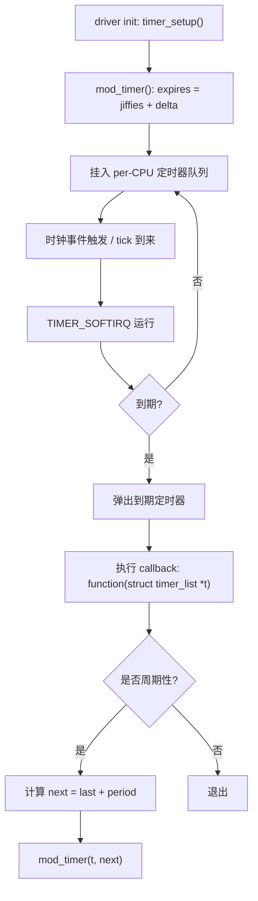

# 第4章_基础定时器机制_struct_timer_list

**章节内容说明**
 本章聚焦内核基础定时器 `struct timer_list`：先阐明其本质（软中断驱动的异步回调），再给出数据结构与初始化方式（旧/新接口对照），并系统解释 `add_timer()` / `mod_timer()` / `del_timer_sync()` 的语义与竞态。随后说明周期性定时器的正确写法与不可取模式，给出可视化流程图与完整示例，最后做小结与排错要点。读者完成本章后，应能编写**可回收、可证伪、无竞态**的基础内核定时器代码。

------

## 4.1_定时器在内核中的本质(软中断驱动的异步回调)

**是什么**
 `timer_list` 是内核的低精度（由 HZ/tick 驱动，或高精度配置下仍走通用队列）软件定时器。到期时由 **TIMER_SOFTIRQ** 在软中断上下文中执行回调函数 `timer_list->function()`。

**要解决的问题**
 在**不能睡眠**的上下文中（软中断），以接近 `jiffies` 粒度的方式异步触发一次函数执行，常用于去抖超时、轮询延迟、退避等。

**如何实现（简述）**

- 定时器以**到期时间 = `jiffies` + delta** 形式插入 per-CPU 定时器轮（不同内核版本具体实现略有差异）。
- 时钟事件触发 tick 或高精度调度后，内核扫描到期定时器，在 TIMER_SOFTIRQ 中分发执行回调。
- 回调不得睡眠；需要睡眠的工作应转交工作队列（第6章详述）。

**边界与影响**

- 回调在软中断上下文：不可 `msleep()` / `mutex_lock()` 等可睡操作。
- 如果需要高精度或严格相对/绝对到期语义，应考虑 `hrtimer`（见第5章）。

------

## 4.2_数据结构与初始化方式(旧接口_vs_新接口)

**结构体要点（Linux ≥ 4.15 同样适用到 6.1+）**

```c
struct timer_list {
    /* 内核私有成员若干 */
    void (*function)(struct timer_list *t);
    unsigned long expires; /* 以 jiffies 表示的到期时间 */
    /* ... */
};
```

**新接口（推荐）**

- `timer_setup(struct timer_list *timer, void (*callback)(struct timer_list *), unsigned int flags);`
- 典型 flags：0 或 `TIMER_PINNED`（将定时器绑定到当前 CPU）。

**旧接口（已废弃/不推荐）**

- `init_timer()` / `setup_timer()` / 使用 `data` 回传私参的方式均已过时。
- 迁移策略：将 `container_of()` 与 `from_timer()` 结合，从 `struct timer_list *` 反取驱动私有结构。

**从 timer 回到设备上下文（推荐写法）**

```c
struct demo_dev {
    struct device *dev;
    struct timer_list tmr;
    spinlock_t lock;
    /* 设备状态与队列等... */
};

static void demo_timer_cb(struct timer_list *t)
{
    struct demo_dev *dd = from_timer(dd, t, tmr);
    /* 使用 dd 访问设备上下文 */
}
```

------

## 4.3_add_timer()_mod_timer()_del_timer_sync()_的语义

- `add_timer(struct timer_list *timer)`
   将**未入队**的定时器按 `expires` 插入。若已在队列中，**不得**再 `add_timer()`。
- `mod_timer(struct timer_list *timer, unsigned long expires)`
   若定时器未入队，相当于 `add_timer()`；若已入队，修改到期时间（**统一用 mod_timer** 最安全，避免重复 add）。
   返回值：`int`，表明定时器是否还在运行队列上（非 0 表示已在队列）。
- `del_timer_sync(struct timer_list *timer)`
   **同步删除**：确保回调不在并发执行、且删除后不再执行。**驱动释放路径必须使用它**（如 `remove()`、错误回滚），否则可能出现“设备已释放而回调仍在执行”的 use-after-free。
- 时序建议
  - 创建/初始化 → 首次启动用 `mod_timer(&tmr, jiffies + delay)`
  - 再启动/延期 → 一律 `mod_timer()`
  - 停止并回收 → `del_timer_sync()`（进程上下文调用）

------

## 4.4_回调与设备生命周期的竞态问题

**问题根因**
 回调运行在软中断上下文，与驱动的 `remove()`/错误路径并发：

- 若未 `del_timer_sync()` 就释放设备内存/IO 区域，回调可能解引用已失效指针 → 崩溃。
- 若回调中再次 `mod_timer()` 而生命周期已结束，产生“幽灵定时器”。

**规避策略**

1. **确定的关闭顺序**（强制要求）：
   - 先 `del_timer_sync()`，再释放资源（GPIO/clk/内存/对象）。
2. **回调内的设备状态判定**：
   - 用 `atomic_t stopped` 或者 `refcount_t`/`kref` 判断是否允许继续工作。
3. **将可睡逻辑转交工作队列**：
   - 回调仅完成最少量的快速处理与调度 `queue_work()`；设备退出阶段 `cancel_work_sync()` 的次序须与 `del_timer_sync()` 协同（详见第10章收尾顺序）。
4. **devres 提醒**
   - 内核没有通用 `devm_timer_create()`；可用 `devm_add_action_or_reset(dev, cleanup, ...)` 将 `del_timer_sync()` 资源化（第10章详述）。

------

## 4.5_周期性定时器的正确写法

**不要**在回调里直接自旋忙等或长事务。
 **正确做法**：在回调尾部以相对时间重新 `mod_timer()`，保证**无漂移或可控漂移**。

- **相对周期（推荐）**：`mod_timer(&tmr, jiffies + period_jiffies);`
   受调度/软中断延迟影响，会产生**不严格等间隔**（轻微漂移）。
- **基于上一周期计划时间的校正（减少累积漂移）**：记录“下次计划到期点”`next`，每次 `next += period`，并用 `mod_timer(&tmr, next)`。若错过，到期点会落在 `<= jiffies`，内核会尽快触发，但整体节拍更稳定。

示意：

```c
dd->next = jiffies + period;
mod_timer(&dd->tmr, dd->next);

// 回调内
dd->next += period;
mod_timer(&dd->tmr, dd->next);
```

------

## 4.6_可视化_timer_触发流程图(Mermaid)

> 说明：严格按你的 Mermaid 转义规则输出（`"`→`"`，`<`→`<`，`>`→`>`）



------

## 4.7_示例代码与常见错误

### 4.7.1_一次性超时(去抖/延迟执行)最小可用例

```c
// SPDX-License-Identifier: GPL-2.0
#include <linux/module.h>
#include <linux/timer.h>
#include <linux/jiffies.h>
#include <linux/spinlock.h>

struct demo_dev {
    struct timer_list 	tmr;
    unsigned long 		next;       /* 若做周期性可复用 */
    spinlock_t 		    lock;          /* 示例：保护状态 */
    int 			   counter;
};

static void demo_timer_cb(struct timer_list *t)
{
    struct demo_dev *dd = from_timer(dd, t, tmr);

    /* 软中断上下文，不可睡眠 */
    spin_lock(&dd->lock);
    dd->counter++;
    spin_unlock(&dd->lock);

    /* 一次性：不再重启 */
}

static struct demo_dev gdev;

static int __init demo_init(void)
{
    spin_lock_init(&gdev.lock);
    timer_setup(&gdev.tmr, demo_timer_cb, 0);

    /* 相对 50ms 超时 */
    mod_timer(&gdev.tmr, jiffies + msecs_to_jiffies(50));
    pr_info("demo: armed once for 50ms\n");
    return 0;
}

static void __exit demo_exit(void)
{
    del_timer_sync(&gdev.tmr);
    pr_info("demo: counter=%d\n", gdev.counter);
}

module_init(demo_init);
module_exit(demo_exit);
MODULE_LICENSE("GPL");
```

**常见错误**

- ❌ `add_timer()` 与 `mod_timer()` 混用、重复 `add_timer()`：可能触发警告或逻辑混乱。
- ❌ 退出时用 `del_timer()` 而不是 `del_timer_sync()`：回调仍可能并发执行。
- ❌ 回调里做可睡操作（如 `msleep()`、`mutex_lock()`）：会触发 `might_sleep()` 警告或死锁风险。

### 4.7.2_周期性定时器(校正漂移版)

```c
// SPDX-License-Identifier: GPL-2.0
#include <linux/module.h>
#include <linux/timer.h>
#include <linux/jiffies.h>

struct periodic_dev {
    struct timer_list 	tmr;
    unsigned long 		next;
    unsigned long 		period; /* jiffies */
    atomic_t 			running;
};

static void periodic_timer_cb(struct timer_list *t)
{
    struct periodic_dev *pd = from_timer(pd, t, tmr);

    if (!atomic_read(&pd->running))
        return;

    /* 处理周期工作（不可睡） */
    /* ... */

    /* 校正式重启，减少累积漂移 */
    pd->next += pd->period;
    mod_timer(&pd->tmr, pd->next);
}

/* 全局示例，生产上应放到私有设备结构 */
static struct periodic_dev pdev = {
    .period = HZ / 10, /* 100ms */
};

static int __init periodic_init(void)
{
    atomic_set(&pdev.running, 1);
    timer_setup(&pdev.tmr, periodic_timer_cb, 0);

    pdev.next = jiffies + pdev.period;
    mod_timer(&pdev.tmr, pdev.next);
    pr_info("periodic: start 100ms periodic timer\n");
    return 0;
}

static void __exit periodic_exit(void)
{
    atomic_set(&pdev.running, 0);
    del_timer_sync(&pdev.tmr);
    pr_info("periodic: stopped\n");
}

module_init(periodic_init);
module_exit(periodic_exit);
MODULE_LICENSE("GPL");
```

### 4.7.3_回调需要睡_的分层范式(定时器_+_工作队列)

```c
// SPDX-License-Identifier: GPL-2.0
#include <linux/module.h>
#include <linux/timer.h>
#include <linux/workqueue.h>

struct layered_dev {
    struct timer_list tmr;
    struct work_struct wk;
    unsigned long delay; /* jiffies */
    atomic_t running;
};

static void layered_work(struct work_struct *w)
{
    struct layered_dev *ld = container_of(w, struct layered_dev, wk);
    if (!atomic_read(&ld->running)) return;

    /* 进程上下文，可睡：与硬件交互、I2C/SPI 等 */
    /* ... */
}

static void layered_timer_cb(struct timer_list *t)
{
    struct layered_dev *ld = from_timer(ld, t, tmr);
    if (!atomic_read(&ld->running)) return;

    /* 仅调度工作，保持回调轻量 */
    schedule_work(&ld->wk);

    /* 若周期性 */
    mod_timer(&ld->tmr, jiffies + ld->delay);
}

static struct layered_dev L;

static int __init layered_init(void)
{
    INIT_WORK(&L.wk, layered_work);
    timer_setup(&L.tmr, layered_timer_cb, 0);
    atomic_set(&L.running, 1);
    L.delay = msecs_to_jiffies(200);
    mod_timer(&L.tmr, jiffies + L.delay);
    return 0;
}

static void __exit layered_exit(void)
{
    atomic_set(&L.running, 0);
    del_timer_sync(&L.tmr);
    cancel_work_sync(&L.wk);
}

module_init(layered_init);
module_exit(layered_exit);
MODULE_LICENSE("GPL");
```

------

## 4.8_小结

- `timer_list` 的回调在 **TIMER_SOFTIRQ** 中运行，**不可睡**，非常适合轻量、延后触发的内核态任务。
- 统一使用 `timer_setup()` 初始化；**首/再启动**一律用 `mod_timer()`；资源回收**必须** `del_timer_sync()`。
- 周期性定时器推荐采用“**记录 next、基于 last 校正**”的重启方式，降低节拍漂移。
- 回调里若需要睡眠或较重逻辑，应采用“**定时器触发 + 工作队列处理**”的分层模式。
- 与驱动生命周期的并发必须严谨处理：退出路径先 `del_timer_sync()`，再做其余释放；必要时配合 `cancel_work_sync()`。
- 内核无 `devm_timer_create()`：若想资源化、原子式回收，可在 `probe()` 中 `devm_add_action_or_reset(dev, cleanup, ...)` 绑定 `del_timer_sync()`（第10章详述）。
- 需要更高精度或严格到期语义时，迁移到 `hrtimer`（见第5章）。

------

**下一步建议**

- 进入**第5章**：`hrtimer` 的回调语义、相对/绝对模式与周期重启、与工作队列的分层组合，以及与 `timer_list` 的取舍边界。
- 如你希望，我可以把**第12章·模板**里与 `timer_list` 相关的“低精度周期轮询模板”“有超时的事务模板”先行落地，或将上述示例改写为**基于你的 `demo_led_key_int@0`** 的按键去抖/重试实例。