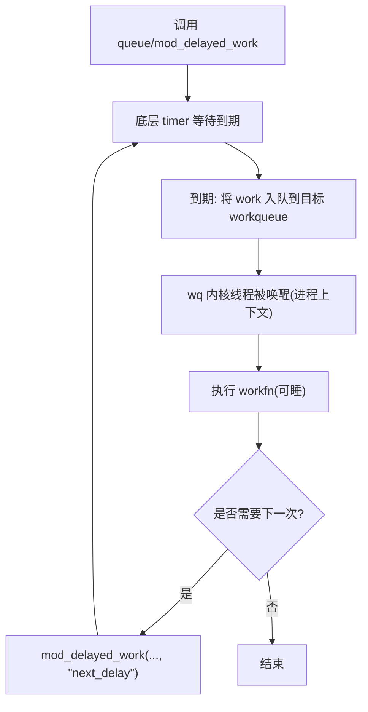
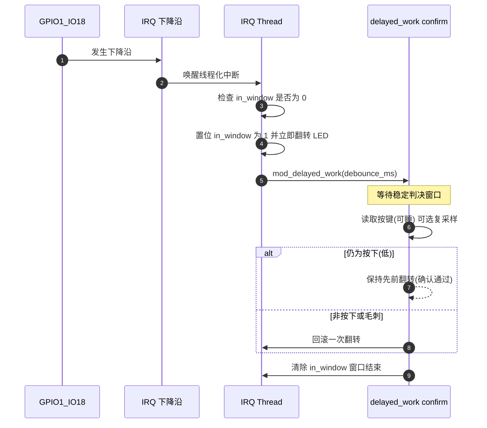
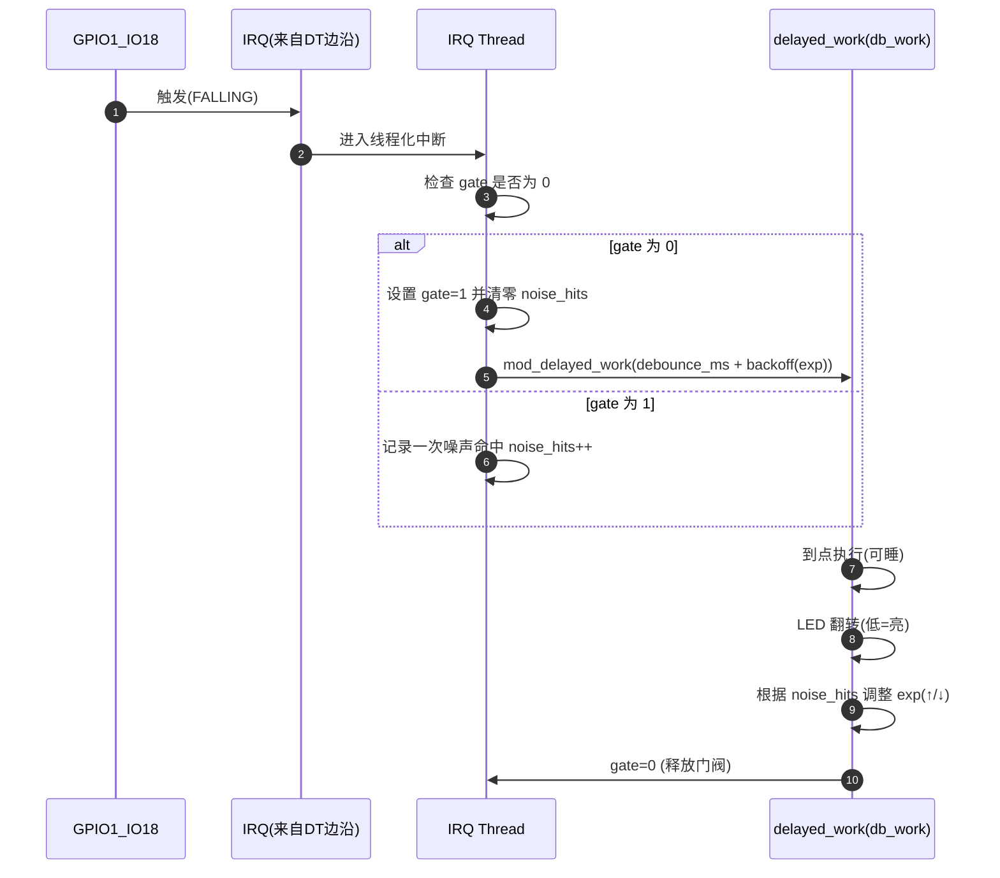
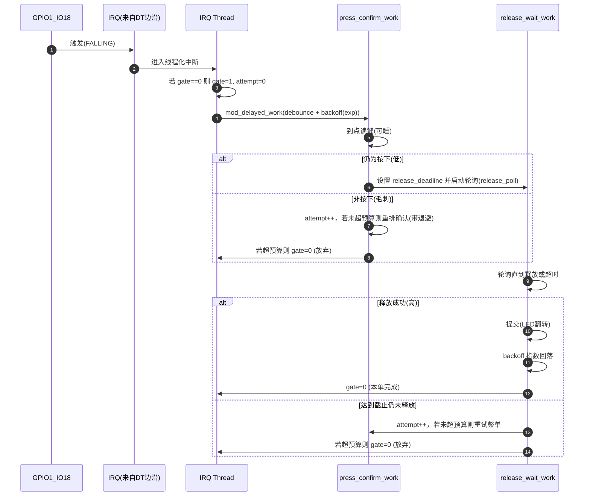
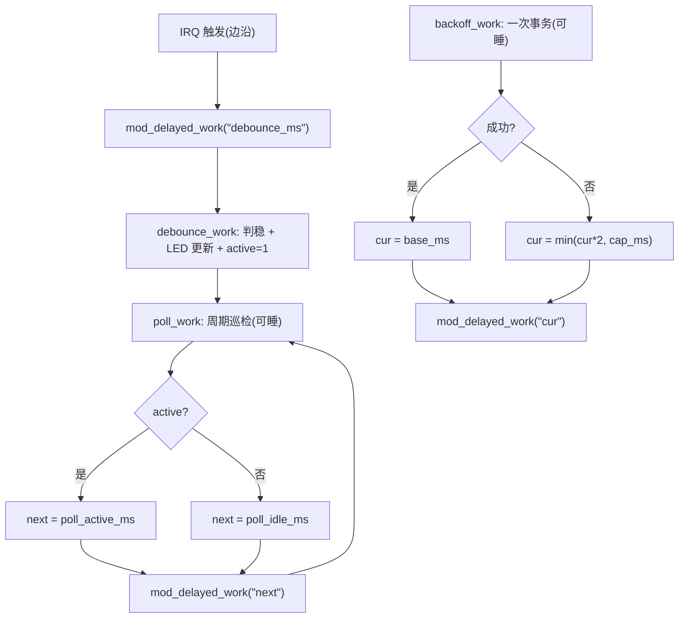

# 第6章_基于工作队列的延迟执行_delayed_work

> **章节内容说明**
>  前五章我们已经把时间表示、基础/高精度定时器的边界讲清了：哪里可以睡、哪里不能睡，哪些场景对精度极端敏感，哪些只是需要“稍后再做”。本章承接这一脉络，讨论驱动里极为常见的一类需求——**“延迟一段时间后，在可睡眠上下文中做事”**。
>  我们先厘清为什么这类需求不该交给 `timer_list` 或 `hrtimer`，再回到 `delayed_work` 的数据结构与调度路径；随后的示例以 **“一次性延迟”“固定周期”“可扩展为退避/重试”** 三个层次逐步展开。每个小节都给出**明确的接口语义、可运行级代码、取消与生命周期处理**，避免歧义。

------

## 6.1_需要睡_的延迟任务_为什么落到_delayed_work

**引入**
 很多驱动在中断中只得到一个“线索”：某个 GPIO 发生了边沿、某个控制器报告了“可能就绪”。真正要做的工作却并不适合在中断或软中断里完成：需要访问 I2C/SPI，可能要获取会睡眠的互斥锁，甚至还要等待一个状态稳定窗口（去抖）。这类工作具有两点共性：**允许睡眠**、**可以延后**。若仍强行放在 `timer_list`/`hrtimer` 回调里，回调一旦触发 `might_sleep()`，就会把系统拖入不确定状态。

**结论先行**

- **需要睡**且**允许延后** → **首选 `delayed_work`**。
- 不需要睡但追求极小抖动 → `hrtimer`；
- 只做极轻量且禁睡 → `timer_list`。

**驱动关联**
 `delayed_work` 在机制上等价于“**一个定时器 + 一次投递到工作队列**”：定时器只负责“何时”触发，工作队列（内核线程）负责“在哪里”执行，语境切换到了**进程上下文**。这正是我们想要的语义组合。

------

## 6.2_数据结构与调度路径_从_怎么看_到_怎么写

### 6.2.1_数据结构视角(你需要知道的最少集合)

- `struct delayed_work`：外观上是一份 `work_struct`，内部携带一个私有 `timer_list`。
- 典型回溯路径：
   `work_struct*` → `to_delayed_work()` → `container_of()` 回到你的 `struct mydev`。
- 这意味着：**回调函数形参类型是 `struct work_struct\*`**；若要触达你的设备数据，按上述两步安全回溯。

### 6.2.2_初始化与队列选择_系统队列_vs_自建队列

**A. 用系统队列（简单起步）**

```c
static void demo_workfn(struct work_struct *work) { /* 可睡逻辑 */ }

static DECLARE_DELAYED_WORK(demo_dwork, demo_workfn); 	/* 绑定 demo_workfn() 到 延迟队列 demo_dwork 中*/
/* 或：
 * static struct delayed_work demo_dwork;
 * INIT_DELAYED_WORK(&demo_dwork, demo_workfn);
 */

static void start_once(unsigned int ms)
{
    schedule_delayed_work(&demo_dwork, msecs_to_jiffies(ms));
}
```

- 适合轻载、对隔离性要求不高的任务。成本低、代码少。

**B. 自建队列（隔离并发、控制优先级）**

```c
struct workqueue_struct *wq;

static int init_wq(void)
{
    wq = alloc_workqueue("leaf_wq", WQ_UNBOUND | WQ_HIGHPRI, 1);
    return wq ? 0 : -ENOMEM;
}

static void start_on_private_wq(struct delayed_work *dw, unsigned int ms)
{
    queue_delayed_work(wq, dw, msecs_to_jiffies(ms));
}
```

- **为何要自建**：与系统队列解耦、限定并发（`max_active=1`）、可用 `WQ_HIGHPRI` 减少被低优先工作淹没。
- **收尾顺序**：先停工作（同步取消），再 `destroy_workqueue()`，否则存在窗口导致 UAF（§6.3 展开）。

**C. 可延后触发的后台任务（Deferrable）**

```c
INIT_DEFERRABLE_WORK(&demo_dwork, demo_workfn);
```

- “可以再晚些”的非关键任务，如统计/清理。**不要**用于有时限约束的周期逻辑。

### 6.2.3_调度与周期_三种常用写法

**一次性延迟**（只执行一次）

```c
schedule_delayed_work(&dwork, msecs_to_jiffies(80));
```

**固定周期**（在回调末尾自我重启）

```c
static void periodic_fn(struct work_struct *work)
{
    struct delayed_work *d = to_delayed_work(work);
    struct mydev *md = container_of(d, struct mydev, poll_work);

    /* 可睡逻辑：访问 I2C / 读取 gpiod_cansleep / 统计 ... */

    mod_delayed_work(md->wq, &md->poll_work, msecs_to_jiffies(md->period_ms));
}
```

**条件化周期**（依据结果决定下次间隔）

```c
if (likely(ok))
    next = md->period_ms;       // 正常扫一次
else
    next = min(md->period_ms << 1, md->period_max_ms); // 简单退避

mod_delayed_work(md->wq, &md->poll_work, msecs_to_jiffies(next));
```

> 这段在 §6.5 会扩展成完整的“退避/重试”范式。

### 6.2.4_接口语义表(含_为什么_与_何时用)

| 接口                                 | 核心语义                                    | 何时用                                   | 为什么                       |
| ------------------------------------ | ------------------------------------------- | ---------------------------------------- | ---------------------------- |
| `schedule_delayed_work(&dw, delay)`  | 投递到 `system_wq`；若已在队列/运行，返回 0 | 简易一次性或偶发任务                     | 少代码、无 wq 管理成本       |
| `queue_delayed_work(wq, &dw, delay)` | 投递到自建队列                              | 需要隔离与并发控制                       | 保证你的任务不被系统队列挤压 |
| `mod_delayed_work(wq, &dw, delay)`   | 修改到期时间；若未入队则入队                | 周期与退避的基石                         | 在回调中重启，自洽又直观     |
| `cancel_delayed_work(&dw)`           | 取消但**不等待**回调结束                    | 快速撤销尚未触发的任务                   | 非生命周期收尾，减少等待     |
| `cancel_delayed_work_sync(&dw)`      | 取消且**等待**可能正在执行的回调退出        | **生命周期收尾**（remove/失败回滚/挂起） | 防 UAF，唯一正确的“停机”姿势 |
| `flush_delayed_work(&dw)`            | 等已入队的这一次执行完成；不影响下一次      | 调试/确保本次完成                        | **不是**取消，常被误解       |

**时间单位约束**
 <span style="color:red">延迟以 **jiffies** 计。**必须**使用 `msecs_to_jiffies()`/`usecs_to_jiffies()` 等转换宏</span>；调试输出可用 `jiffies_to_msecs()` 统一到毫秒。

------

## 6.3_退出与取消_把_停机_写成代码_不留口子

**承转**
 许多驱动崩溃都不是发生在“功能在跑”的时候，而是发生在“功能要停”的时候：资源被回收，工作还在路上，下一次周期又被悄悄排上了日程。预防这种崩溃只有一条路径：**同步取消**。

### 6.3.1_三个必须_同步取消_的节点

1. **`remove()`/出错回滚**：释放 GPIO/clk/内存前，`cancel_delayed_work_sync()` 保证回调不再运行。
2. **`suspend()`**：系统或设备挂起时，停止一切定时工作，避免唤醒链路被意外触发；`resume()` 再按策略恢复。
3. **销毁自建 wq**：依次 `cancel_delayed_work_sync()` → `destroy_workqueue()`，先停再拆队列。

### 6.3.2_反例_to_复现_to_正例_把风险讲透

**反例（错误示范）**
 下面的 `remove()` 只做了 `flush`，回调末尾还有周期重启：

```c
static int bad_remove(struct platform_device *pdev)
{
    struct mydev *md = platform_get_drvdata(pdev);

    flush_delayed_work(&md->periodic_work); // 只等“这一次”
    kfree(md);                              // md 已释放
    return 0;                               // 下一次周期仍会被重启 → UAF
}
```

**如何复现**

- 将周期设为 50ms，在回调开头打印 `pr_info("md=%p\n", md);`；
- 循环 `insmod` / `rmmod`；
- 你将稳定观察到 KASAN 告警或随机崩溃。

**正例（正确收尾）**

```c
static int good_remove(struct platform_device *pdev)
{
    struct mydev *md = platform_get_drvdata(pdev);

    cancel_delayed_work_sync(&md->periodic_work); // 停且等
    if (md->wq) {
        destroy_workqueue(md->wq);
        md->wq = NULL;
    }
    kfree(md);
    return 0;
}
```

### 6.3.3_与_devres_配合(把停机动作资源化)

没有通用的 `devm_delayed_work_*`。用 `devm_add_action_or_reset()` 把“同步取消 + 销毁 wq”注册为回滚动作：

```c
static void dwork_cleanup(void *data)
{
    struct mydev *md = data;

    cancel_delayed_work_sync(&md->debounce_work);
    cancel_delayed_work_sync(&md->poll_work);
    if (md->wq) {
        destroy_workqueue(md->wq);
        md->wq = NULL;
    }
}

static int my_probe(struct platform_device *pdev)
{
    struct device *dev = &pdev->dev;
    struct mydev *md = devm_kzalloc(dev, sizeof(*md), GFP_KERNEL);
    int ret;

    /* ... 资源获取、INIT_DELAYED_WORK ... */

    ret = devm_add_action_or_reset(dev, dwork_cleanup, md);
    if (ret)
        return ret;

    return 0;
}
```

> 形成“双保险”：`probe()` 失败自动回滚；`remove()` 里仍显式写一遍收尾，代码即是文档。

------

## 6.4_与_timer_list_/_hrtimer_的取舍_把边界落回具体代码

**承接动机**
 选择错误的机制，往往不是因为你不懂接口，而是因为没有把“上下文限制”映射回“代码片段”。下面用可比对的片段把三者边界钉住。

### 6.4.1_不能做什么(负面清单更有用)

- **`timer_list` 回调**：**不能睡**，**不能**调用 `i2c_transfer()`、`gpiod_get_value_cansleep()`、`mutex_lock()`、`msleep()`；
- **`hrtimer` 回调**：同样**不能睡**，且回调必须极短（否则影响全局时序）；
- **`delayed_work` 回调**：可睡，但**不要**试图以它实现“亚毫秒相位对齐”的任务（抖动不可控）。

### 6.4.2_三段对照代码(同一需求的三种落地)

**反例：把 I2C 放进 `timer_list` 回调**

```c
static void bad_timer_fn(struct timer_list *t)
{
    /* 反例：会睡，违反上下文约束 */
    (void)i2c_smbus_read_byte_data(client, REG_STATUS); // might_sleep
}
```

**正例 A：用 `timer_list` 只做转发**

```c
static struct workqueue_struct *wq;
static DECLARE_WORK(do_slow, slow_fn);

static void ok_timer_fn(struct timer_list *t)
{
    queue_work(wq, &do_slow); // 把“慢活”交给可睡的工作队列
}
```

**正例 B：严格触发点用 `hrtimer` + 处理层用 wq**

```c
static enum hrtimer_restart ht_fn(struct hrtimer *ht)
{
    queue_work(wq, &do_slow);
    hrtimer_forward_now(ht, ns_to_ktime(period_ns));
    return HRTIMER_RESTART;
}
```

**正例 C：直接用 `delayed_work` 完成“延时 + 可睡”的组合**

```c
static void slow_fn(struct work_struct *work)
{
    /* 此处可睡：I2C/SPI/互斥/等待 */
}
INIT_DELAYED_WORK(&dw, slow_fn);
queue_delayed_work(wq, &dw, msecs_to_jiffies(30));
```

### 6.4.3_一张表收束选择逻辑

| 需求要点         | 推荐机制                      | 说明                       |
| ---------------- | ----------------------------- | -------------------------- |
| 可睡 + 延迟/周期 | `delayed_work`                | 默认方案，心智负担最低     |
| 禁睡 + 极小抖动  | `hrtimer`（触发）+ wq（处理） | 分层，短回调，避免破坏时序 |
| 禁睡 + 轻量推迟  | `timer_list`                  | 只做轻活或转发到 wq        |

------

## 6.5_x_可视化_delayed_work_触发到执行的链路



------

## 6.6_x_示例(与下节衔接)_一次性/固定周期最小模板

> 为了让后续“轮询、退避、重试”可以直接叠加，这里把最小模板写成可复用的骨架。下一批的 **§6.5** 会把它们扩展为完整范式，并与 `demo_led_key_int@0` 的去抖参数联动。

**模板 1：一次性延迟（系统队列）**

```c
struct dwork_once {
    struct delayed_work dwork;
    unsigned int ms;
};

static void dwork_once_fn(struct work_struct *work)
{
    struct delayed_work *d = to_delayed_work(work);
    struct dwork_once *ctx = container_of(d, struct dwork_once, dwork);

    /* 可睡事务：gpiod_..._cansleep(), i2c_transfer(), mutex_lock(), msleep() */
    /* ... 你的逻辑 ... */

    /* 不自我重启：一次性结束 */
}

static void dwork_once_start(struct dwork_once *ctx, unsigned int ms)
{
    ctx->ms = ms;
    INIT_DELAYED_WORK(&ctx->dwork, dwork_once_fn);
    schedule_delayed_work(&ctx->dwork, msecs_to_jiffies(ctx->ms));
}

static void dwork_once_stop(struct dwork_once *ctx)
{
    cancel_delayed_work_sync(&ctx->dwork);
}
```

**模板 2：固定周期（自建 wq，单并发）**

```c
struct dwork_periodic {
    struct workqueue_struct *wq;
    struct delayed_work dwork;
    unsigned int period_ms;
    bool running;
};

static void dwork_periodic_fn(struct work_struct *work)
{
    struct delayed_work *d = to_delayed_work(work);
    struct dwork_periodic *p = container_of(d, struct dwork_periodic, dwork);

    if (!p->running)
        return;

    /* 可睡事务 ... */

    mod_delayed_work(p->wq, &p->dwork, msecs_to_jiffies(p->period_ms));
}

static int dwork_periodic_start(struct dwork_periodic *p, unsigned int period_ms)
{
    p->period_ms = period_ms;
    p->wq = alloc_workqueue("period_wq", WQ_UNBOUND | WQ_HIGHPRI, 1);
    if (!p->wq) return -ENOMEM;

    INIT_DELAYED_WORK(&p->dwork, dwork_periodic_fn);
    p->running = true;
    queue_delayed_work(p->wq, &p->dwork, msecs_to_jiffies(p->period_ms));
    return 0;
}

static void dwork_periodic_stop(struct dwork_periodic *p)
{
    p->running = false;
    cancel_delayed_work_sync(&p->dwork);
    if (p->wq) { destroy_workqueue(p->wq); p->wq = NULL; }
}
```

------

## 6.7_x_调试与验证(为下一批的_6.6_铺垫)

- **确认是否真正执行**：在回调入口与出口打印 `ktime_get()` 时间戳；或启用 tracepoints：`workqueue:*` 与 `timer:*`。
- **验证停机有效**：在 `remove()` 里先打点，再 `cancel_delayed_work_sync()`，确认其后不再进入回调。
- **周期抖动评估**：记录连续 N 次回调时间差，计算均值/方差；必要时改用自建 wq 或调整系统负载。


------

## 6.8_典型驱动场景_轮询_退避_重试

------

### 6.8.1_轮询(Polling)_当中断不足以表达_稳定状态

#### (1)_1_场景与目标

- **问题**：下降沿中断仅表示“曾经发生变化”，并不等价于“当前已稳定为按下”。机械抖动、电气毛刺、门限漂移都会造成“**中断 ≠ 稳态**”。
- **目标**：在**可睡上下文**中引入一个**稳定判决窗口**（例如 20–30 ms），到点再做一次或两次读取，以**稳定值**为准触发业务；本例业务是“**按下→翻转 LED**”。

> 本节采用 `delayed_work`：它把“**定时**（底层用 timer）+ **可睡执行**（工作线程中执行，可用 `gpiod_get_value_cansleep()` / `msleep()`）”组合起来，恰好解决“中断不足以表达稳定状态”的落地需求。

------

#### (2)_2_机制与设计

- **触发-评估分离**
   1）**线程化中断**（可睡）只进行两件事：
   ① 立即翻转 LED（获得“跟手”手感，**可选**；本例默认开启），
   ② `mod_delayed_work()` 安排 `debounce_ms` 后的稳定判定；
   2）**稳定判定**（`delayed_work`）到点读取一次（可选再 `msleep(5)` 复采样）；
  - 若仍为按下（低电平），**确认通过**（不再动作，保留即时翻转结果）；
  - 若不是按下，则**回滚**上一次翻转（恢复 LED 状态）。
- **窗口合并（in-window coalescing）**
   在去抖窗口内忽略后续中断，避免多次排程与多次翻转。窗口结束（`delayed_work` 收尾）后允许下一次触发。
- **触发类型**
   采用**下降沿**（与设备树一致），避免电平低触发造成的反复唤醒与“卡顿”。

------

#### (3)_3_设备树映射(你的节点)

```dts
demo_led_key_int: led_key_int@0 {
    compatible = "nxp,imx6ull-led_key_int";

    pinctrl-names = "default", "sleep";
    pinctrl-0 = <&pinctrl_led_key_int_active>;
    pinctrl-1 = <&pinctrl_led_key_int_sleep>;

    led-gpios = <&gpio1 3 GPIO_ACTIVE_LOW>;     /* 低电平点亮 */
    key-gpios = <&gpio1 18 GPIO_ACTIVE_LOW>;    /* 低电平有效 */

    interrupt-parent = <&gpio1>;
    interrupts = <18 IRQ_TYPE_EDGE_FALLING>;    /* 下降沿 */

    nxp,debounce-ms = <30>;                     /* 稳定判决窗口 */
    status = "okay";
};
```

------

#### (4)_4_驱动示例(可直接编译上板)

> 文件：`drivers/demo/demo_key_dw_min.c`
>  关键点：**下降沿**触发、**线程化中断里即时翻转**（获得“跟手”手感）、**`delayed_work` 到点判稳并可能回滚**、**窗口内合并**。

```c
// SPDX-License-Identifier: GPL-2.0
// File: drivers/demo/demo_key_dw_min.c
//
// 行为：按键(下降沿) -> 线程化中断中“立即翻转 LED”(可睡) -> 安排 delayed_work
//       等 debounce_ms 后再读按键，若不是按下(抖动)则回滚一次翻转。
// 目标：手感“顺手” + 用 delayed_work 实现“可睡 + 延时”的稳定判定。

#include <linux/module.h>
#include <linux/platform_device.h>
#include <linux/of.h>
#include <linux/gpio/consumer.h>
#include <linux/interrupt.h>
#include <linux/workqueue.h>
#include <linux/jiffies.h>
#include <linux/delay.h>
#include <linux/pm.h>
#include <linux/atomic.h>

struct demo_keydw {
    struct device *dev;
    struct gpio_desc *led;   /* 低=亮 */
    struct gpio_desc *key;   /* 低=按下 */
    int irq;

    unsigned int debounce_ms; /* 默认 30，可被 DT 覆盖 */

    struct workqueue_struct *wq;    /* 专用高优先级队列，保证到点及时执行 */
    struct delayed_work confirm_work;

    bool     led_on;          /* LED 软件镜像：低=亮 */
    atomic_t in_window;       /* 0=空闲；1=去抖窗口中（合并重复中断） */
    bool     suspended;
};

/* —— 去抖确认（到点在可睡上下文读键；如非按下则回滚） —— */
static void demo_confirm_fn(struct work_struct *work)
{
    struct delayed_work *d = to_delayed_work(work);
    struct demo_keydw *lk = container_of(d, struct demo_keydw, confirm_work);
    int v;

    if (READ_ONCE(lk->suspended))
        goto out;

    /* 到点再读：低=按下；若不是按下，说明此前是抖动，需要回滚一次 */
    v = gpiod_get_value_cansleep(lk->key);
    if (v != 0 && lk->led) {
        lk->led_on = !lk->led_on;                       /* 回滚“即时翻转” */
        gpiod_set_value_cansleep(lk->led, lk->led_on ? 0 : 1);
        dev_dbg(lk->dev, "rollback (debounce reject)\n");
    }
out:
    atomic_set(&lk->in_window, 0);                      /* 结束窗口 */
}

/* —— 线程化中断：立即翻转 + 只排程一次确认 —— */
static irqreturn_t demo_irq_thread(int irq, void *data)
{
    struct demo_keydw *lk = data;

    if (READ_ONCE(lk->suspended))
        return IRQ_HANDLED;

    /* 窗口内重复中断合并：不重复翻转/排程 */
    if (atomic_cmpxchg(&lk->in_window, 0, 1) != 0)
        return IRQ_HANDLED;

    /* 立即翻转（获得“跟手”手感），低=亮 */
    if (lk->led) {
        lk->led_on = !lk->led_on;
        gpiod_set_value_cansleep(lk->led, lk->led_on ? 0 : 1);
    }

    /* 安排去抖确认：debounce_ms 后再看一次键值 */
    mod_delayed_work(lk->wq, &lk->confirm_work, msecs_to_jiffies(lk->debounce_ms));
    return IRQ_HANDLED;
}

/* —— devres 回滚 —— */
static void demo_cleanup(void *data)
{
    struct demo_keydw *lk = data;

    cancel_delayed_work_sync(&lk->confirm_work);
    if (lk->wq) {
        destroy_workqueue(lk->wq);
        lk->wq = NULL;
    }
}

/* —— probe/remove/PM —— */
static int demo_probe(struct platform_device *pdev)
{
    struct device *dev = &pdev->dev;
    struct demo_keydw *lk;
    int ret;

    lk = devm_kzalloc(dev, sizeof(*lk), GFP_KERNEL);
    if (!lk) return -ENOMEM;

    lk->dev = dev;
    lk->debounce_ms = 30;
    atomic_set(&lk->in_window, 0);

    device_property_read_u32(dev, "nxp,debounce-ms", &lk->debounce_ms);

    lk->led = devm_gpiod_get_optional(dev, "led", GPIOD_OUT_HIGH); /* 高=灭 */
    if (IS_ERR(lk->led))
        return dev_err_probe(dev, PTR_ERR(lk->led), "led-gpios\n");

    lk->key = devm_gpiod_get(dev, "key", GPIOD_IN);               /* 低=按下 */
    if (IS_ERR(lk->key))
        return dev_err_probe(dev, PTR_ERR(lk->key), "key-gpios\n");

    /* LED 软件镜像初值（低=亮） */
    lk->led_on = (lk->led && gpiod_get_value_cansleep(lk->led) == 0);

    /* 一个高优先级队列，确保到点就能执行确认 */
    lk->wq = alloc_workqueue("demo_dw_min_wq", WQ_UNBOUND | WQ_HIGHPRI, 1);
    if (!lk->wq) return -ENOMEM;

    INIT_DELAYED_WORK(&lk->confirm_work, demo_confirm_fn);

    ret = devm_add_action_or_reset(dev, demo_cleanup, lk);
    if (ret) return ret;

    lk->irq = gpiod_to_irq(lk->key);
    if (lk->irq < 0) return lk->irq;

    /* 线程化中断（可睡），与 DT 的“下降沿”保持一致（关键：不要用电平触发） */
    ret = devm_request_threaded_irq(dev, lk->irq, NULL, demo_irq_thread,
                                    IRQF_TRIGGER_FALLING | IRQF_ONESHOT,
                                    dev_name(dev), lk);
    if (ret) return ret;

    platform_set_drvdata(pdev, lk);
    dev_info(dev, "debounce=%u ms (delayed_work confirm)\n", lk->debounce_ms);
    return 0;
}

static int demo_remove(struct platform_device *pdev)
{
    return 0; /* 清理由 devres 回滚 */
}

#ifdef CONFIG_PM_SLEEP
static int demo_suspend(struct device *dev)
{
    struct demo_keydw *lk = dev_get_drvdata(dev);
    WRITE_ONCE(lk->suspended, true);
    cancel_delayed_work_sync(&lk->confirm_work);
    atomic_set(&lk->in_window, 0);
    return 0;
}
static int demo_resume(struct device *dev)
{
    struct demo_keydw *lk = dev_get_drvdata(dev);
    WRITE_ONCE(lk->suspended, false);
    return 0;
}
static SIMPLE_DEV_PM_OPS(demo_pm_ops, demo_suspend, demo_resume);
#define DEMO_PM &demo_pm_ops
#else
#define DEMO_PM NULL
#endif

/* OF 匹配 */
static const struct of_device_id demo_of_match[] = {
    { .compatible = "nxp,imx6ull-led_key_int" },
    { /* sentinel */ }
};
MODULE_DEVICE_TABLE(of, demo_of_match);

/* 平台驱动骨架 */
static struct platform_driver demo_driver = {
    .probe  = demo_probe,
    .remove = demo_remove,
    .driver = {
        .name = "demo-key-dw-min",
        .of_match_table = demo_of_match,
        .pm = DEMO_PM,
    },
};
module_platform_driver(demo_driver);

MODULE_LICENSE("GPL");
MODULE_AUTHOR("Leaf & Co-Author");
MODULE_DESCRIPTION("Minimal debounce using delayed_work: instant toggle + delayed confirm/rollback");
```

------

#### (5)_5_执行路径可视化



------

#### (6)_6_上板验证与调参

- **最小实验**
   1）`insmod demo_key_dw_min.ko`；
   2）短促抖动：LED**不**翻转；
   3）按下> `debounce_ms`：LED**翻转一次**；长按不会反复翻；
   4）快速连击：若两次按下落入同一窗口，第二次被合并，适当**减小** `debounce_ms` 可提升连击响应。
- **推荐参数**
  - 机械键：`debounce_ms = 15–30` ms；
  - 噪声较大时在 `demo_confirm_fn()` 内插入 `msleep(5)` 后**复采样**（两行代码即可），增强稳健性。

------

#### (7)_7_常见坑与对策

- **电平触发导致“卡顿”**：务必使用**下降沿**，不要用 `IRQF_TRIGGER_LOW`。
- **窗口内多次触发**：用 `in_window` 合并；窗口结束时再清零。
- **PM 与热拔插**：挂起/移除前 `cancel_delayed_work_sync()`，避免回调访问无效资源。
- **LED 读回不可用**：本例使用 `led_on` 软件镜像，避免依赖输出值读回。

------

#### (8)_8_小结

- 当“**边沿中断不足以表达稳定状态**”时，引入一个**稳定判决窗口**是必要的；
- `timer_list/hrtimer` 的回调不可睡，不适合在窗口到点内做 `*_cansleep()` 读取或 `msleep()` 复采样；
- `delayed_work` 将“**延时**”与“**可睡**”结合，天然契合“**触发-评估分离**”的判稳模型；
- 本节示例在**板上可直接实验**：手感“**即时**”，正确性由 `delayed_work` 的**到点判稳/回滚**兜底，逻辑简洁、可维护。


------

### 6.8.2_指数退避(Backoff)_在失败压力下自我降噪

#### (1)_1_场景与目标

当**单次消抖窗口**内出现密集抖动（重复边沿风暴）时，如果仍以固定窗口处理，要么**手感受损**（窗口过大），要么**CPU 频繁被打扰**（窗口过小）。本节采用**门阀 + delayed_work**作为基础框架，再叠加**指数退避**：

- **门阀（atomic gate）\**确保单次有效事件只排程\**一次** `delayed_work`；
- `delayed_work` 到点后**无条件翻转 LED**（可睡），并根据本窗口内被合并的中断**噪声计数**调整**下一次**的消抖延迟；
- 退避**只影响下一次**，且**硬上限 200 ms**，避免“长时间假死”。

#### (2)_2_机制与算法

- **第一次中断**：`gate:0→1`，计算 `delay_ms = debounce_ms + min(backoff_base_ms << exp, backoff_max_ms)`，排一次 `mod_delayed_work(system_wq, delay_ms)`；同时将 `noise_hits=0`。
- **窗口内后续中断**：不再排程，`noise_hits++`。
- **work 到点**：
  - 翻转 LED（低=亮）；
  - 读取 `noise_hits`：
    - `hits >= NOISE_THRES`（默认 2）→ `exp++`（更保守）；
    - `hits == 0` → `exp--`（更灵敏）；
  - 释放门阀 `gate:1→0`。
- **不读取按键电平**、**不在 ISR 做退避早退门禁**。不会出现“卡住几分钟”的异常。

#### (3)_3_与设备树映射

使用你的节点并逐项消费：

- `compatible = "nxp,imx6ull-led_key_int"`；
- `pinctrl-names = "default","sleep"`，`pinctrl-0/-1`：运行/休眠态复用组；
- `led-gpios = <&gpio1 3 GPIO_ACTIVE_LOW>`：**低电平点亮**；
- `key-gpios = <&gpio1 18 GPIO_ACTIVE_LOW>`：仅用于获取 IRQ；
- `interrupts = <18 IRQ_TYPE_EDGE_FALLING>`：**触发沿由 DT 决定**；
- `nxp,debounce-ms`：基础消抖窗口（建议 20–30 ms）；
- `nxp,backoff-base-ms`：退避基准（默认 50 ms）；
- `nxp,backoff-max-ms`：退避上限（默认/强制 ≤ 200 ms）。

#### (4)_4_驱动示例(完整_可直接编译)

> 文件：`drivers/demo/demo_key_dw_gate_backoff_dt.c`

```c
// SPDX-License-Identifier: GPL-2.0
// File: drivers/demo/demo_key_dw_gate_backoff_dt.c
//
// 主题：delayed_work 门阀消抖 + 指数退避（<=200ms，上限由 DT 给出）
// 行为：
//   - 第一次中断：占门阀(0->1)，delay = debounce_ms + backoff_ms(exp)；排一次 delayed_work(delay)。
//   - 窗口内后续抖动：仅计数 noise_hits++（不再排程）；
//   - work 到点：无条件翻转 LED（低=亮），依据 noise_hits 自适应调整 backoff_exp：
//         hits >= NOISE_THRES  -> exp++（更保守）；
//         hits == 0            -> exp--（更灵敏）；
//     backoff_ms = min(backoff_base_ms << exp, backoff_max_ms)；影响“下一次”按键。

#include <linux/module.h>
#include <linux/platform_device.h>
#include <linux/of.h>
#include <linux/gpio/consumer.h>
#include <linux/interrupt.h>
#include <linux/workqueue.h>
#include <linux/jiffies.h>
#include <linux/pm.h>
#include <linux/atomic.h>

#define NOISE_THRES     2  /* 窗口内 >=2 次被合并，判定为“噪声明显” */
#define BACKOFF_EXP_MAX 10 /* 算法封顶（最终仍受 backoff_max_ms 钳制） */

struct key_dw_backoff {
    struct device    *dev;
    struct gpio_desc *led; /* 低=亮 */
    struct gpio_desc *key; /* 仅用于拿 IRQ */
    int               irq;

    /* 参数（来自 DT） */
    unsigned int debounce_ms;     /* nxp,debounce-ms */
    unsigned int backoff_base_ms; /* nxp,backoff-base-ms（默认50） */
    unsigned int backoff_max_ms;  /* nxp,backoff-max-ms  （默认200，强制<=200） */

    /* 状态 */
    atomic_t     gate;        /* 0=空闲；1=窗口占用 */
    atomic_t     noise_hits;  /* 窗口内被合并掉的中断次数 */
    unsigned int backoff_exp; /* 指数 0..N（只影响下一次） */
    bool         suspended;
    bool         led_on; /* true=亮(输出低) */

    /* 任务（用系统缺省 wq 即可） */
    struct delayed_work db_work;
};

static inline unsigned int
calc_backoff_ms(const struct key_dw_backoff *ctx)
{
    unsigned int ms = ctx->backoff_base_ms << ctx->backoff_exp;
    if (ms > ctx->backoff_max_ms)
        ms = ctx->backoff_max_ms;
    return ms;
}

/* —— 到点：无条件翻转 + 根据噪声自适应调整指数 + 释放门阀 —— */
static void
key_db_workfn(struct work_struct *work)
{
    struct delayed_work   *d   = to_delayed_work(work);
    struct key_dw_backoff *ctx = container_of(d, struct key_dw_backoff, db_work);
    unsigned int           hits;

    if (!READ_ONCE(ctx->suspended) && ctx->led) {
        ctx->led_on = !ctx->led_on; /* 低=亮 */
        gpiod_set_value_cansleep(ctx->led, ctx->led_on ? 0 : 1);
    }

    /* 自适应调整：下一次更稳或更灵 */
    hits = atomic_read(&ctx->noise_hits);
    if (hits >= NOISE_THRES) {
        if (ctx->backoff_exp < BACKOFF_EXP_MAX && calc_backoff_ms(ctx) < ctx->backoff_max_ms)
            ctx->backoff_exp++; /* 噪声大 -> 更保守 */
    } else if (hits == 0) {
        if (ctx->backoff_exp > 0)
            ctx->backoff_exp--; /* 干净 -> 更灵敏 */
    }

    atomic_set(&ctx->gate, 0); /* 释放门阀 */
}

/* —— 线程化中断：占门阀并排程一次 work；窗口内的重复中断计入噪声 —— */
static irqreturn_t
key_irq_thread(int irq, void *data)
{
    struct key_dw_backoff *ctx = data;

    if (READ_ONCE(ctx->suspended))
        return IRQ_HANDLED;

    /* 第一次进入：占用门阀并排程一次 work（delay 带上当前指数退避量） */
    if (atomic_cmpxchg(&ctx->gate, 0, 1) == 0) {
        unsigned int delay_ms = ctx->debounce_ms + calc_backoff_ms(ctx);
        atomic_set(&ctx->noise_hits, 0);
        mod_delayed_work(system_wq, &ctx->db_work, msecs_to_jiffies(delay_ms));
        return IRQ_HANDLED;
    }

    /* 窗口内的后续抖动/风暴：仅记噪声命中 */
    atomic_inc(&ctx->noise_hits);
    return IRQ_HANDLED;
}

/* —— 回滚/销毁 —— */
static void
key_cleanup(void *data)
{
    struct key_dw_backoff *ctx = data;
    cancel_delayed_work_sync(&ctx->db_work);
}

/* —— probe/remove/PM —— */
static int
key_probe(struct platform_device *pdev)
{
    struct device         *dev = &pdev->dev;
    struct key_dw_backoff *ctx;
    int                    ret;

    ctx = devm_kzalloc(dev, sizeof(*ctx), GFP_KERNEL);
    if (!ctx)
        return -ENOMEM;

    ctx->dev             = dev;
    ctx->debounce_ms     = 30;  /* 缺省，可被 DT 覆盖 */
    ctx->backoff_base_ms = 50;  /* 缺省，可被 DT 覆盖 */
    ctx->backoff_max_ms  = 200; /* 缺省，强制<=200 */
    ctx->backoff_exp     = 0;
    ctx->suspended       = false;
    atomic_set(&ctx->gate, 0);
    atomic_set(&ctx->noise_hits, 0);

    device_property_read_u32(dev, "nxp,debounce-ms", &ctx->debounce_ms);
    device_property_read_u32(dev, "nxp,backoff-base-ms", &ctx->backoff_base_ms);
    device_property_read_u32(dev, "nxp,backoff-max-ms", &ctx->backoff_max_ms);
    if (ctx->backoff_max_ms > 200)
        ctx->backoff_max_ms = 200;

    ctx->led = devm_gpiod_get_optional(dev, "led", GPIOD_OUT_HIGH); /* 高=灭 */
    if (IS_ERR(ctx->led))
        return dev_err_probe(dev, PTR_ERR(ctx->led), "led-gpios\n");

    ctx->key = devm_gpiod_get(dev, "key", GPIOD_IN); /* 仅用于拿 IRQ */
    if (IS_ERR(ctx->key))
        return dev_err_probe(dev, PTR_ERR(ctx->key), "key-gpios\n");

    /* LED 软件镜像：此处仅读一次当前输出，后续只靠我们自己维护 */
    ctx->led_on = (ctx->led && gpiod_get_value_cansleep(ctx->led) == 0);

    INIT_DELAYED_WORK(&ctx->db_work, key_db_workfn);
    ret = devm_add_action_or_reset(dev, key_cleanup, ctx);
    if (ret)
        return ret;

    ctx->irq = gpiod_to_irq(ctx->key);
    if (ctx->irq < 0)
        return ctx->irq;

    ret = devm_request_threaded_irq(dev, ctx->irq, NULL, key_irq_thread,
                                    IRQF_TRIGGER_FALLING | IRQF_ONESHOT, dev_name(dev), ctx);
    if (ret)
        return ret;

    platform_set_drvdata(pdev, ctx);
    dev_info(dev, "gate+backoff(dt): debounce=%u ms, backoff base/max=%u/%u ms\n",
             ctx->debounce_ms, ctx->backoff_base_ms, ctx->backoff_max_ms);
    return 0;
}

static int
key_remove(struct platform_device *pdev)
{
    return 0; /* devres 回滚 */
}

#ifdef CONFIG_PM_SLEEP
static int
key_suspend(struct device *dev)
{
    struct key_dw_backoff *ctx = dev_get_drvdata(dev);
    WRITE_ONCE(ctx->suspended, true);
    cancel_delayed_work_sync(&ctx->db_work);
    atomic_set(&ctx->gate, 0);
    atomic_set(&ctx->noise_hits, 0);
    /* 可选：让唤醒后手感更灵敏 */
    /* ctx->backoff_exp = 0; */
    return 0;
}
static int
key_resume(struct device *dev)
{
    struct key_dw_backoff *ctx = dev_get_drvdata(dev);
    WRITE_ONCE(ctx->suspended, false);
    return 0;
}
static SIMPLE_DEV_PM_OPS(key_pm_ops, key_suspend, key_resume);
    #define KEY_PM &key_pm_ops
#else
    #define KEY_PM NULL
#endif

static const struct of_device_id key_of_match[] = {
    { .compatible = "nxp,imx6ull-led_key_int" },
    { /* sentinel */ }
};
MODULE_DEVICE_TABLE(of, key_of_match);

static struct platform_driver key_driver = {
    .probe  = key_probe,
    .remove = key_remove,
    .driver = {
               .name           = "demo-key-dw-gate-backoff-dt",
               .of_match_table = key_of_match,
               .pm             = KEY_PM,
               },
};
module_platform_driver(key_driver);

MODULE_LICENSE("GPL");
MODULE_AUTHOR("Leaf & Co-Author");
MODULE_DESCRIPTION("Delayed_work gate debounce + adaptive exponential backoff (<=200ms), IRQ edge from DT");
```

#### (5)_5_时序(门阀_+_指数退避)



#### (6)_6_调参与预期

- **首按延迟**≈`debounce_ms + backoff(base<<exp)`；初始 `exp=0`，接近 `debounce_ms`。
- **噪声大**：同一窗口内 `noise_hits≥2`，下一次 `exp+1`，最大不超过 `backoff_max_ms`（≤200 ms）。
- **环境干净**：`noise_hits==0`，下一次 `exp-1`，手感回到轻快。
- **触发沿**：由 DT 决定（你设为 **FALLING**）。若现场 **RISING** 更稳，只需改 DT，不改驱动。

#### (7)_7_调试与排错

- **现象：LED 迟迟不翻转**
  - 检查 `debounce_ms` 与 `backoff_max_ms` 是否被不合理放大；本实现无 ISR 早退门禁，不会“卡几分钟”。
- **抖动依旧明显**
  - 将 `NOISE_THRES` 从 2 调到 1 或提高 `backoff_base_ms`。
- **手感偏慢**
  - 降低 `NOISE_THRES` 的同时，确保 `backoff_exp` 能在干净环境快速回落；必要时把 `backoff_base_ms` 设为 25。
- **PM 行为**
  - 休眠前取消 `delayed_work` 并清 `gate`/`noise_hits`；需要“唤醒即灵敏”时可在 `suspend()` 里把 `backoff_exp=0`。

#### (8)_8_小结

- 在“门阀 + delayed_work”消抖骨架上加入**指数退避**，能够在噪声压力上升时**自动拉长下次消抖**，在干净阶段**收敛回短窗口**；
- 全程**不读按键电平**、**不做 ISR 早退**，避免了“阻塞/卡死”类陷阱；
- 参数上限**钳到 200 ms**，兼顾“人类手感”与“系统降噪”。

------

### 6.8.3_事务重试(Retry)_有超时的_完整一单

#### (1)_delayed_work_版本

##### 1)_1_场景与目标

“完整一单”指一次**原子性的业务流程**：**按下**→**确认**→**释放**，全部成立才记一次成功。若中途任何环节失败（抖动导致的假按下、迟迟不释放等），则**在预算内重试**；超过预算则**放弃本单**并回到空闲。
 本节继续使用你的 **LED + 按键** 节点，通过 **delayed_work** 实现：

- **可睡**的确认与等待阶段；
- **超时 + 次数上限** 的重试；
- **指数退避**（≤200 ms）抑制噪声环境下的过度抢占。

> 与 6.5.1/6.5.2 不同点：这里把一次按键视为“事务”，只有**按下稳定 + 释放在时限内**才**提交**（翻转 LED）。否则判为**失败**并在**预算内自动重试**。

------

##### 2)_2_策略与状态机(基于_delayed_work)

- **门阀 gate（atomic）**：一次事务只排**一次**确认工作；窗口内后续边沿被合并。
- **press_confirm_work（按下确认）**：延时 `debounce + backoff(exp)` 后**可睡读取**按键；
  - **按下稳定**：进入**release_wait**阶段；
  - **不成立**：`attempt++` 并在预算内重排确认（带指数退避）；
- **release_wait_work（释放等待）**：周期轮询（可睡）直至释放或超时；
  - **释放成功**：**提交**（翻转 LED），**回落**退避指数；
  - **超时**：记失败，若仍有预算则重试；否则**放弃本单**；
- **指数退避**：`delay = debounce_ms + min(backoff_base_ms<<exp, backoff_max_ms≤200)`；
  - 成功则 `exp--`，失败则 `exp++`（钳制到上限）；
- **预算**：`retry_max` 次（含首次失败后的重试），防止“永不结束”的坏序列。

------

##### 3)_3_示例驱动(完整_可编译)

> 文件：`drivers/demo/demo_key_dw_retry.c`
>  与你的设备树**完全对齐**：FALLING 边沿、`nxp,debounce-ms`、`nxp,backoff-base-ms`、`nxp,backoff-max-ms(≤200)`。

```c
// SPDX-License-Identifier: GPL-2.0
// File: drivers/demo/demo_key_dw_retry.c
//
// 主题：delayed_work 事务重试（按下确认 + 释放超时 + 指数退避）
// 行为：
//   IRQ(FALLING) -> gate 抢占 -> press_confirm_work(delay=debounce+backoff(exp))
//   press_confirm_work：读键确认“按下”
//      成功 -> 进入 release_wait_work（轮询到释放或超时）
//      失败 -> attempt++，在预算内重排 press_confirm（指数退避）；否则放弃
//   release_wait_work：读键直到释放或超时
//      释放 -> 提交（翻转 LED），退避指数回落，gate 释放
//      超时 -> attempt++，在预算内重试整单；否则放弃并 gate 释放
// 可调：retry-max / release-timeout-ms / release-poll-ms（见默认值）

#include <linux/module.h>
#include <linux/platform_device.h>
#include <linux/of.h>
#include <linux/gpio/consumer.h>
#include <linux/interrupt.h>
#include <linux/workqueue.h>
#include <linux/jiffies.h>
#include <linux/pm.h>
#include <linux/atomic.h>

#define BACKOFF_EXP_MAX      10   /* 算法封顶，最终仍受 backoff_max_ms 钳制 */
#define DEFAULT_RETRY_MAX     3
#define DEFAULT_REL_TIMEOUT 150   /* 释放最长等待(ms) */
#define DEFAULT_REL_POLL      20   /* 释放轮询步进(ms) */

enum txn_state {
	TXN_IDLE = 0,
	TXN_WAIT_PRESS,   /* 等按下确认 */
	TXN_WAIT_RELEASE, /* 等释放确认 */
};

struct key_dw_retry {
	struct device    *dev;
	struct gpio_desc *led;   /* 低=亮 */
	struct gpio_desc *key;   /* 低=按下（active-low 已在 gpiod 层处理为逻辑值） */
	int irq;

	/* 基本时序与退避（来自 DT） */
	unsigned int debounce_ms;      /* nxp,debounce-ms */
	unsigned int backoff_base_ms;  /* nxp,backoff-base-ms */
	unsigned int backoff_max_ms;   /* nxp,backoff-max-ms (<=200) */

	/* 事务预算 */
	unsigned int retry_max;        /* 最大重试次数（不含第一次） */
	unsigned int release_timeout_ms; /* 从按下确认到要求释放的时限 */
	unsigned int release_poll_ms;    /* 释放轮询周期 */

	/* 运行态 */
	atomic_t gate;                 /* 0=空闲；1=本单在进行 */
	enum txn_state state;
	unsigned int attempt;          /* 已尝试次数（含当前） */
	unsigned int backoff_exp;      /* 指数退避 */
	unsigned long release_deadline;/* jiffies：释放截止时刻 */
	bool led_on;                   /* 低=亮 的软件镜像 */
	bool suspended;

	/* 工作（使用系统缺省 wq） */
	struct delayed_work press_work;   /* 按下确认 */
	struct delayed_work release_work; /* 释放确认 */
};

/* 逻辑读键：1=按下，0=未按（active-low 已转换为逻辑值） */
static inline int key_pressed(struct key_dw_retry *ctx)
{
	return gpiod_get_value_cansleep(ctx->key);
}

static inline unsigned int calc_backoff_ms(const struct key_dw_retry *ctx)
{
	unsigned int ms = ctx->backoff_base_ms << ctx->backoff_exp;
	if (ms > ctx->backoff_max_ms)
		ms = ctx->backoff_max_ms;
	return ms;
}

/* ---- 按下确认 ---- */
static void press_confirm_fn(struct work_struct *work)
{
	struct delayed_work *d = to_delayed_work(work);
	struct key_dw_retry *ctx = container_of(d, struct key_dw_retry, press_work);

	if (READ_ONCE(ctx->suspended))
		goto giveup;

	if (key_pressed(ctx)) {
		/* 按下稳定：进入释放等待阶段（此时尚未翻转 LED） */
		ctx->state = TXN_WAIT_RELEASE;
		ctx->release_deadline = jiffies + msecs_to_jiffies(ctx->release_timeout_ms);
		mod_delayed_work(system_wq, &ctx->release_work,
				 msecs_to_jiffies(ctx->release_poll_ms));
		return;
	}

	/* 按下不成立：在预算内重试（指数退避） */
	if (ctx->attempt < ctx->retry_max) {
		ctx->attempt++;
		if (ctx->backoff_exp < BACKOFF_EXP_MAX &&
		    calc_backoff_ms(ctx) < ctx->backoff_max_ms)
			ctx->backoff_exp++;

		ctx->state = TXN_WAIT_PRESS;
		mod_delayed_work(system_wq, &ctx->press_work,
			msecs_to_jiffies(ctx->debounce_ms + calc_backoff_ms(ctx)));
		return;
	}

giveup:
	/* 放弃本单，回到空闲 */
	ctx->state = TXN_IDLE;
	atomic_set(&ctx->gate, 0);
}

/* ---- 释放确认 ---- */
static void release_wait_fn(struct work_struct *work)
{
	struct delayed_work *d = to_delayed_work(work);
	struct key_dw_retry *ctx = container_of(d, struct key_dw_retry, release_work);

	if (READ_ONCE(ctx->suspended))
		goto giveup;

	if (!key_pressed(ctx)) {
		/* 成功完成“完整一单”：提交并回落指数，回到空闲 */
		if (ctx->led) {
			ctx->led_on = !ctx->led_on; /* 低=亮 */
			gpiod_set_value_cansleep(ctx->led, ctx->led_on ? 0 : 1);
		}
		if (ctx->backoff_exp > 0)
			ctx->backoff_exp--; /* 干净 -> 回落一点 */
		ctx->state = TXN_IDLE;
		atomic_set(&ctx->gate, 0);
		return;
	}

	if (time_before(jiffies, ctx->release_deadline)) {
		/* 继续等释放 */
		mod_delayed_work(system_wq, &ctx->release_work,
				 msecs_to_jiffies(ctx->release_poll_ms));
		return;
	}

	/* 释放超时：视为失败，在预算内重试整单（从按下确认重新开始） */
	if (ctx->attempt < ctx->retry_max) {
		ctx->attempt++;
		if (ctx->backoff_exp < BACKOFF_EXP_MAX &&
		    calc_backoff_ms(ctx) < ctx->backoff_max_ms)
			ctx->backoff_exp++;

		ctx->state = TXN_WAIT_PRESS;
		mod_delayed_work(system_wq, &ctx->press_work,
			msecs_to_jiffies(ctx->debounce_ms + calc_backoff_ms(ctx)));
		return;
	}

giveup:
	/* 放弃本单 */
	ctx->state = TXN_IDLE;
	atomic_set(&ctx->gate, 0);
}

/* ---- 线程化中断：只抢门阀并启动“本单” ---- */
static irqreturn_t key_irq_thread(int irq, void *data)
{
	struct key_dw_retry *ctx = data;

	if (READ_ONCE(ctx->suspended))
		return IRQ_HANDLED;

	/* 空闲 -> 开启一次“完整一单” */
	if (atomic_cmpxchg(&ctx->gate, 0, 1) == 0) {
		ctx->state   = TXN_WAIT_PRESS;
		ctx->attempt = 0;
		/* 初次确认延时：debounce + 当前指数退避 */
		mod_delayed_work(system_wq, &ctx->press_work,
			msecs_to_jiffies(ctx->debounce_ms + calc_backoff_ms(ctx)));
		return IRQ_HANDLED;
	}

	/* 门阀占用：合并抖动/重复边沿 */
	return IRQ_HANDLED;
}

/* ---- 回滚/销毁 ---- */
static void key_cleanup(void *data)
{
	struct key_dw_retry *ctx = data;
	cancel_delayed_work_sync(&ctx->press_work);
	cancel_delayed_work_sync(&ctx->release_work);
}

/* ---- probe/remove/PM ---- */
static int key_probe(struct platform_device *pdev)
{
	struct device *dev = &pdev->dev;
	struct key_dw_retry *ctx;
	int ret;

	ctx = devm_kzalloc(dev, sizeof(*ctx), GFP_KERNEL);
	if (!ctx) return -ENOMEM;

	ctx->dev = dev;
	/* 缺省参数（可被 DT 覆盖） */
	ctx->debounce_ms       = 30;
	ctx->backoff_base_ms   = 50;
	ctx->backoff_max_ms    = 200;
	ctx->retry_max         = DEFAULT_RETRY_MAX;
	ctx->release_timeout_ms= DEFAULT_REL_TIMEOUT;
	ctx->release_poll_ms   = DEFAULT_REL_POLL;
	ctx->backoff_exp       = 0;
	ctx->state             = TXN_IDLE;
	ctx->suspended         = false;
	atomic_set(&ctx->gate, 0);

	/* 消费 DT */
	device_property_read_u32(dev, "nxp,debounce-ms",       &ctx->debounce_ms);
	device_property_read_u32(dev, "nxp,backoff-base-ms",   &ctx->backoff_base_ms);
	device_property_read_u32(dev, "nxp,backoff-max-ms",    &ctx->backoff_max_ms);
	if (ctx->backoff_max_ms > 200) ctx->backoff_max_ms = 200;

	/* 如果你希望通过 DT 调 release 超时/轮询与重试预算，可额外添加属性：
	 *   nxp,retry-max; nxp,release-timeout-ms; nxp,release-poll-ms
	 * 这里先按默认值使用。需要时可再读入。
	 */

	ctx->led = devm_gpiod_get_optional(dev, "led", GPIOD_OUT_HIGH); /* 高=灭 */
	if (IS_ERR(ctx->led))
		return dev_err_probe(dev, PTR_ERR(ctx->led), "led-gpios\n");

	ctx->key = devm_gpiod_get(dev, "key", GPIOD_IN); /* 低=按下 */
	if (IS_ERR(ctx->key))
		return dev_err_probe(dev, PTR_ERR(ctx->key), "key-gpios\n");

	/* LED 镜像：仅读一次，后续由我们维护 */
	ctx->led_on = (ctx->led && gpiod_get_value_cansleep(ctx->led) == 0);

	INIT_DELAYED_WORK(&ctx->press_work,   press_confirm_fn);
	INIT_DELAYED_WORK(&ctx->release_work, release_wait_fn);

	ret = devm_add_action_or_reset(dev, key_cleanup, ctx);
	if (ret) return ret;

	ctx->irq = gpiod_to_irq(ctx->key);
	if (ctx->irq < 0) return ctx->irq;

	ret = devm_request_threaded_irq(dev, ctx->irq, NULL, key_irq_thread,
			IRQF_TRIGGER_FALLING | IRQF_ONESHOT, dev_name(dev), ctx);
	if (ret) return ret;

	platform_set_drvdata(pdev, ctx);
	dev_info(dev, "retry(txn): debounce=%u, backoff base/max=%u/%u, retry_max=%u, relTO=%u, relPoll=%u\n",
		ctx->debounce_ms, ctx->backoff_base_ms, ctx->backoff_max_ms,
		ctx->retry_max, ctx->release_timeout_ms, ctx->release_poll_ms);
	return 0;
}

static int key_remove(struct platform_device *pdev)
{
	return 0; /* devres 回滚 */
}

#ifdef CONFIG_PM_SLEEP
static int key_suspend(struct device *dev)
{
	struct key_dw_retry *ctx = dev_get_drvdata(dev);
	WRITE_ONCE(ctx->suspended, true);
	cancel_delayed_work_sync(&ctx->press_work);
	cancel_delayed_work_sync(&ctx->release_work);
	atomic_set(&ctx->gate, 0);
	ctx->state = TXN_IDLE;
	return 0;
}
static int key_resume(struct device *dev)
{
	struct key_dw_retry *ctx = dev_get_drvdata(dev);
	WRITE_ONCE(ctx->suspended, false);
	return 0;
}
static SIMPLE_DEV_PM_OPS(key_pm_ops, key_suspend, key_resume);
#define KEY_PM &key_pm_ops
#else
#define KEY_PM NULL
#endif

static const struct of_device_id key_of_match[] = {
	{ .compatible = "nxp,imx6ull-led_key_int" },
	{ /* sentinel */ }
};
MODULE_DEVICE_TABLE(of, key_of_match);

static struct platform_driver key_driver = {
	.probe  = key_probe,
	.remove = key_remove,
	.driver = {
		.name           = "demo-key-dw-retry",
		.of_match_table = key_of_match,
		.pm             = KEY_PM,
	},
};
module_platform_driver(key_driver);

MODULE_LICENSE("GPL");
MODULE_AUTHOR("Leaf & Co-Author");
MODULE_DESCRIPTION("delayed_work transaction retry: press-confirm + release-timeout + exponential backoff (<=200ms)");
```

------

##### 4)_4_时序(_完整一单_按下确认_+_释放超时_+_重试)



------

##### 5)_5_调参与预期

- **手感**：首按延迟≈`debounce_ms + backoff(base<<exp)`（初始 `exp=0`，接近 `debounce_ms`）。
- **释放时限**：`release_timeout_ms`（默认 150 ms）决定“完整一单”的完成窗口；
- **重试预算**：`retry_max`（默认 3）限制一次事务的最长生存；
- **指数退避**：成功时回落、失败时上升；上限 `backoff_max_ms≤200`，符合人机预期。

##### 6)_6_排错要点

- **“一直不提交”**：查看日志中 `attempt` 是否持续增长且达上限，通常是释放超时；适当放宽 `release_timeout_ms` 或降低 `release_poll_ms`。
- **“手感慢”**：减小 `debounce_ms` 或 `backoff_base_ms`；确保环境抖动不大，否则会频繁升指数。
- **“误触发多”**：提高 `debounce_ms`，或把 `retry_max` 调小，让事务尽快放弃并回到空闲。
- **PM**：挂起前取消两项 work 并清 `gate/state`，恢复后自然回到空闲。

------

##### 7)_小结

本节把一次按键视为**事务**，通过 **delayed_work** 在可睡环境下完成**按下确认**与**释放确认**，并以**指数退避 + 重试预算**在噪声环境中“既稳又不拖”。它与 6.5.1/6.5.2 共用同一骨架，但强调“**完整一单必须全部成立才提交**”。

#### (2)_wait_event_timeout_版本

下面给出**`wait_event_timeout()` 版本**的“完整一单（按下确认 + 释放确认/超时 + 指数退避）”。\**要点\**：此版本需要**上升沿作为自然唤醒源**，因此 **DT 里中断类型需改为 `IRQ_TYPE_EDGE_BOTH`**（或至少包含 RISING）。

##### 1)_设备树(关键差异_双沿)

```dts
demo_led_key_int: led_key_int@0 {
    compatible = "nxp,imx6ull-led_key_int";
    pinctrl-names = "default", "sleep";
    pinctrl-0 = <&pinctrl_led_key_int_active>;
    pinctrl-1 = <&pinctrl_led_key_int_sleep>;

    led-gpios = <&gpio1 3 GPIO_ACTIVE_LOW>;   /* 低电平点亮 */
    key-gpios = <&gpio1 18 GPIO_ACTIVE_LOW>;  /* 低电平=按下 */

    interrupt-parent = <&gpio1>;
    interrupts = <18 IRQ_TYPE_EDGE_BOTH>;     /* ★ 用双沿：FALLING 开单，RISING 唤醒释放 */

    nxp,debounce-ms      = <30>;
    nxp,backoff-base-ms  = <50>;
    nxp,backoff-max-ms   = <200>;
    status = "okay";
};
```

##### 2)_驱动(完整_可编译_专用_WQ_等待用_wait_event_timeout())

> 文件：`drivers/demo/demo_key_dw_retry_waitq.c`

```c
// SPDX-License-Identifier: GPL-2.0
// File: drivers/demo/demo_key_dw_retry_waitq.c
//
// 主题：delayed_work + wait_event_timeout()
// 路线：FALLING 触发“按下确认” -> （确认稳定）进入“等待释放”
//       RISING 在 IRQ 里置位 released 并 wake_up(waitqueue)
//       释放在时限内 -> 提交(LED翻转)；否则 -> 在预算内重试整单
//
// 依赖：DT 必须提供 EDGE_BOTH（见上）
// 退避：指数退避仅作用于“下一次按下确认”的延迟（<=200ms）

#include <linux/module.h>
#include <linux/platform_device.h>
#include <linux/of.h>
#include <linux/gpio/consumer.h>
#include <linux/interrupt.h>
#include <linux/workqueue.h>
#include <linux/wait.h>
#include <linux/jiffies.h>
#include <linux/pm.h>
#include <linux/atomic.h>

#define BACKOFF_EXP_MAX       10
#define DEFAULT_RETRY_MAX      3
#define DEFAULT_REL_TIMEOUT  150   /* 释放等待超时(ms) */

enum txn_state {
	TXN_IDLE = 0,
	TXN_WAIT_PRESS,    /* 等按下确认 */
	TXN_WAIT_RELEASE,  /* 等释放(由 RISING 唤醒) */
};

struct key_dw_retry_wq {
	struct device    *dev;
	struct gpio_desc *led;    /* 低=亮 */
	struct gpio_desc *key;    /* 低=按下 */
	int irq;

	/* 时序/退避（来自 DT） */
	unsigned int debounce_ms;       /* nxp,debounce-ms */
	unsigned int backoff_base_ms;   /* nxp,backoff-base-ms */
	unsigned int backoff_max_ms;    /* nxp,backoff-max-ms (<=200) */

	/* 事务预算 */
	unsigned int retry_max;         /* 失败后可重试次数（默认3） */
	unsigned int rel_timeout_ms;    /* 等待释放的最长时限（默认150ms） */

	/* 状态机 */
	atomic_t gate;                  /* 0=空闲；1=本单进行中 */
	enum txn_state state;
	unsigned int attempt;           /* 已尝试次数 */
	unsigned int backoff_exp;       /* 指数退避 */
	bool led_on;                    /* 低=亮 的软件镜像 */
	bool suspended;

	/* 释放等待 */
	wait_queue_head_t  rel_wq;
	atomic_t           released;    /* 1=已释放(由RISING置位) */

	/* 工作（放在专用单线程WQ，避免阻塞系统kworker） */
	struct workqueue_struct *wq;
	struct delayed_work press_work; /* 按下确认（到点执行） */
};

/* 逻辑读键：1=按下，0=未按（active-low 已转换为逻辑） */
static inline int key_pressed(struct key_dw_retry_wq *ctx)
{
	return gpiod_get_value_cansleep(ctx->key);
}

static inline unsigned int calc_backoff_ms(const struct key_dw_retry_wq *ctx)
{
	unsigned int ms = ctx->backoff_base_ms << ctx->backoff_exp;
	if (ms > ctx->backoff_max_ms)
		ms = ctx->backoff_max_ms;
	return ms;
}

/* ---- 按下确认（在专用 WQ 的 worker 里，可睡 + 可阻塞等待） ---- */
static void press_confirm_fn(struct work_struct *work)
{
	struct delayed_work *d = to_delayed_work(work);
	struct key_dw_retry_wq *ctx =
		container_of(d, struct key_dw_retry_wq, press_work);
	long left;

	if (READ_ONCE(ctx->suspended))
		goto giveup;

	/* 到点做一次“按下稳定”确认（低=按下） */
	if (!key_pressed(ctx)) {
		/* 按下不成立：指数退避后可在预算内重试 */
		if (ctx->attempt < ctx->retry_max) {
			ctx->attempt++;
			if (ctx->backoff_exp < BACKOFF_EXP_MAX &&
			    calc_backoff_ms(ctx) < ctx->backoff_max_ms)
				ctx->backoff_exp++;
			ctx->state = TXN_WAIT_PRESS;
			mod_delayed_work(ctx->wq, &ctx->press_work,
				msecs_to_jiffies(ctx->debounce_ms + calc_backoff_ms(ctx)));
			return;
		}
		goto giveup;
	}

	/* 按下稳定：等待释放（由 RISING IRQ 唤醒） */
	ctx->state = TXN_WAIT_RELEASE;
	atomic_set(&ctx->released, 0);
	left = wait_event_timeout(ctx->rel_wq,
				  atomic_read(&ctx->released),
				  msecs_to_jiffies(ctx->rel_timeout_ms));
	if (left > 0) {
		/* 释放在时限内：提交并回落退避，回到空闲 */
		if (ctx->led) {
			ctx->led_on = !ctx->led_on;  /* 低=亮 */
			gpiod_set_value_cansleep(ctx->led, ctx->led_on ? 0 : 1);
		}
		if (ctx->backoff_exp > 0)
			ctx->backoff_exp--;        /* 干净 -> 稍微更灵敏 */
		ctx->state = TXN_IDLE;
		atomic_set(&ctx->gate, 0);
		return;
	}

	/* 释放超时：在预算内重试整单（从按下确认重新开始） */
	if (ctx->attempt < ctx->retry_max) {
		ctx->attempt++;
		if (ctx->backoff_exp < BACKOFF_EXP_MAX &&
		    calc_backoff_ms(ctx) < ctx->backoff_max_ms)
			ctx->backoff_exp++;
		ctx->state = TXN_WAIT_PRESS;
		mod_delayed_work(ctx->wq, &ctx->press_work,
			msecs_to_jiffies(ctx->debounce_ms + calc_backoff_ms(ctx)));
		return;
	}

giveup:
	/* 放弃本单 */
	ctx->state = TXN_IDLE;
	atomic_set(&ctx->gate, 0);
}

/* ---- 线程化中断（EDGE_BOTH）：FALLING 开单；RISING 唤醒释放 ---- */
static irqreturn_t key_irq_thread(int irq, void *data)
{
	struct key_dw_retry_wq *ctx = data;
	int v;

	if (READ_ONCE(ctx->suspended))
		return IRQ_HANDLED;

	/* 只读一次逻辑值：0=按下(FALLING)，1=释放(RISING) */
	v = key_pressed(ctx);

	if (!v) {
		/* FALLING：尝试开启一次“完整一单” */
		if (atomic_cmpxchg(&ctx->gate, 0, 1) == 0) {
			ctx->state   = TXN_WAIT_PRESS;
			ctx->attempt = 0;
			mod_delayed_work(ctx->wq, &ctx->press_work,
				msecs_to_jiffies(ctx->debounce_ms + calc_backoff_ms(ctx)));
		}
	} else {
		/* RISING：若正在等待释放，则置位并唤醒等待者 */
		if (atomic_read(&ctx->gate) == 1 && ctx->state == TXN_WAIT_RELEASE) {
			atomic_set(&ctx->released, 1);
			wake_up(&ctx->rel_wq);
		}
	}
	return IRQ_HANDLED;
}

/* ---- 回滚/销毁 ---- */
static void key_cleanup(void *data)
{
	struct key_dw_retry_wq *ctx = data;
	cancel_delayed_work_sync(&ctx->press_work);
	if (ctx->wq) {
		destroy_workqueue(ctx->wq);
		ctx->wq = NULL;
	}
}

/* ---- probe/remove/PM ---- */
static int key_probe(struct platform_device *pdev)
{
	struct device *dev = &pdev->dev;
	struct key_dw_retry_wq *ctx;
	int ret;

	ctx = devm_kzalloc(dev, sizeof(*ctx), GFP_KERNEL);
	if (!ctx) return -ENOMEM;

	ctx->dev = dev;
	/* 缺省/可覆盖参数 */
	ctx->debounce_ms     = 30;
	ctx->backoff_base_ms = 50;
	ctx->backoff_max_ms  = 200;
	ctx->retry_max       = DEFAULT_RETRY_MAX;
	ctx->rel_timeout_ms  = DEFAULT_REL_TIMEOUT;
	ctx->backoff_exp     = 0;
	ctx->state           = TXN_IDLE;
	ctx->suspended       = false;
	atomic_set(&ctx->gate, 0);
	atomic_set(&ctx->released, 0);
	init_waitqueue_head(&ctx->rel_wq);

	device_property_read_u32(dev, "nxp,debounce-ms",     &ctx->debounce_ms);
	device_property_read_u32(dev, "nxp,backoff-base-ms", &ctx->backoff_base_ms);
	device_property_read_u32(dev, "nxp,backoff-max-ms",  &ctx->backoff_max_ms);
	if (ctx->backoff_max_ms > 200) ctx->backoff_max_ms = 200;

	ctx->led = devm_gpiod_get_optional(dev, "led", GPIOD_OUT_HIGH); /* 高=灭 */
	if (IS_ERR(ctx->led))
		return dev_err_probe(dev, PTR_ERR(ctx->led), "led-gpios\n");

	ctx->key = devm_gpiod_get(dev, "key", GPIOD_IN); /* 低=按下 */
	if (IS_ERR(ctx->key))
		return dev_err_probe(dev, PTR_ERR(ctx->key), "key-gpios\n");

	ctx->led_on = (ctx->led && gpiod_get_value_cansleep(ctx->led) == 0);

	/* 专用单线程 WQ，避免 wait_event_timeout 阻塞系统 kworker */
	ctx->wq = alloc_workqueue("key_dw_retry_wq", WQ_UNBOUND | WQ_HIGHPRI | WQ_MEM_RECLAIM, 1);
	if (!ctx->wq) return -ENOMEM;

	INIT_DELAYED_WORK(&ctx->press_work, press_confirm_fn);
	ret = devm_add_action_or_reset(dev, key_cleanup, ctx);
	if (ret) return ret;

	ctx->irq = gpiod_to_irq(ctx->key);
	if (ctx->irq < 0) return ctx->irq;

	/* 触发类型由 DT 决定（要求 EDGE_BOTH）；这里只加 ONESHOT */
	ret = devm_request_threaded_irq(dev, ctx->irq, NULL, key_irq_thread,
			IRQF_ONESHOT, dev_name(dev), ctx);
	if (ret) return ret;

	platform_set_drvdata(pdev, ctx);
	dev_info(dev, "retry(waitq): debounce=%u, backoff base/max=%u/%u, retry_max=%u, relTO=%u (EDGE_BOTH)\n",
		ctx->debounce_ms, ctx->backoff_base_ms, ctx->backoff_max_ms,
		ctx->retry_max, ctx->rel_timeout_ms);
	return 0;
}

static int key_remove(struct platform_device *pdev)
{
	return 0; /* devres 回滚 */
}

#ifdef CONFIG_PM_SLEEP
static int key_suspend(struct device *dev)
{
	struct key_dw_retry_wq *ctx = dev_get_drvdata(dev);
	WRITE_ONCE(ctx->suspended, true);
	cancel_delayed_work_sync(&ctx->press_work);
	if (ctx->wq) flush_workqueue(ctx->wq);
	atomic_set(&ctx->gate, 0);
	ctx->state = TXN_IDLE;
	return 0;
}
static int key_resume(struct device *dev)
{
	struct key_dw_retry_wq *ctx = dev_get_drvdata(dev);
	WRITE_ONCE(ctx->suspended, false);
	return 0;
}
static SIMPLE_DEV_PM_OPS(key_pm_ops, key_suspend, key_resume);
#define KEY_PM &key_pm_ops
#else
#define KEY_PM NULL
#endif

static const struct of_device_id key_of_match[] = {
	{ .compatible = "nxp,imx6ull-led_key_int" },
	{ /* sentinel */ }
};
MODULE_DEVICE_TABLE(of, key_of_match);

static struct platform_driver key_driver = {
	.probe  = key_probe,
	.remove = key_remove,
	.driver = {
		.name           = "demo-key-dw-retry-waitq",
		.of_match_table = key_of_match,
		.pm             = KEY_PM,
	},
};
module_platform_driver(key_driver);

MODULE_LICENSE("GPL");
MODULE_AUTHOR("Leaf & Co-Author");
MODULE_DESCRIPTION("delayed_work + wait_event_timeout: press-confirm + release IRQ wake + retry with exponential backoff (<=200ms)");
```

##### 3)_使用与对比

- 本版本**需要 EDGE_BOTH**；RISING 仅用于**`wake_up()`**，不做重逻辑，CPU 开销极低。
- `wait_event_timeout()` 让**释放阶段真正睡眠**，相对“轮询版”更省电、延迟也更小。
- 若现场不允许开启 RISING，请继续用你已经验证通过的 **门阀 + delayed_work** 版本（6.5.2/6.5.3 轮询版）。

------

## 6.9_示例代码与排错(完整驱动骨架_+_故障注入)

> 下面给出**可编译、可装载**的最小驱动，囊括：
>
> - `demo_led_key_int@0` 的 GPIO 绑定与 `nxp,debounce-ms`；
> - 轮询（空闲/活跃双周期）+ 去抖；
> - `debugfs` 动态调参；
> - 故障注入开关（模拟 I2C 失败推动退避）；
> - 退出路径的**同步取消**与自建 wq 的**销毁顺序**。

```c
// SPDX-License-Identifier: GPL-2.0
#include <linux/module.h>
#include <linux/platform_device.h>
#include <linux/of.h>
#include <linux/gpio/consumer.h>
#include <linux/interrupt.h>
#include <linux/workqueue.h>
#include <linux/jiffies.h>
#include <linux/debugfs.h>
#include <linux/uaccess.h>

struct leaf_drv {
    struct device *dev;
    struct gpio_desc *led;
    struct gpio_desc *key;
    int irq;

    /* 时间参数 */
    unsigned int debounce_ms;      /* DT: nxp,debounce-ms */
    unsigned int poll_idle_ms;     /* 空闲期轮询周期 */
    unsigned int poll_active_ms;   /* 活跃期轮询周期 */
    unsigned int backoff_base_ms;  /* 退避基准 */
    unsigned int backoff_cap_ms;   /* 退避上限 */
    unsigned int cur_backoff_ms;

    /* 工作队列与任务 */
    struct workqueue_struct *wq;
    struct delayed_work debounce_work;
    struct delayed_work poll_work;
    struct delayed_work backoff_work;

    /* 状态 */
    int  last_key;
    bool active;
    bool suspended;
    bool fi_force_fail; /* 故障注入：强制事务失败 */

    /* 调试接口 */
    struct dentry *dbg_dir;
};

static bool leaf_do_transaction(struct leaf_drv *ld)
{
    if (READ_ONCE(ld->fi_force_fail))
        return false;
    /* 这里放真实事务：访问 I2C/SPI/寄存器等（可睡） */
    return true;
}

static void leaf_backoff_fn(struct work_struct *work)
{
    struct delayed_work *d = to_delayed_work(work);
    struct leaf_drv *ld = container_of(d, struct leaf_drv, backoff_work);
    bool ok;

    if (ld->suspended)
        return;

    ok = leaf_do_transaction(ld);
    if (ok) {
        ld->cur_backoff_ms = ld->backoff_base_ms;
    } else {
        ld->cur_backoff_ms = min(ld->cur_backoff_ms << 1, ld->backoff_cap_ms);
        dev_warn(ld->dev, "transaction failed, next=%u ms\n", ld->cur_backoff_ms);
    }

    mod_delayed_work(ld->wq, &ld->backoff_work, msecs_to_jiffies(ld->cur_backoff_ms));
}

static void leaf_debounce_fn(struct work_struct *work)
{
    struct delayed_work *d = to_delayed_work(work);
    struct leaf_drv *ld = container_of(d, struct leaf_drv, debounce_work);
    int cur;

    if (ld->suspended)
        return;

    cur = gpiod_get_value_cansleep(ld->key);
    if (cur != ld->last_key) {
        ld->last_key = cur;
        if (ld->led)
            gpiod_set_value_cansleep(ld->led, !gpiod_get_value_cansleep(ld->led));
        ld->active = true;
    }
}

static void leaf_poll_fn(struct work_struct *work)
{
    struct delayed_work *d = to_delayed_work(work);
    struct leaf_drv *ld = container_of(d, struct leaf_drv, poll_work);
    unsigned int next_ms = ld->active ? ld->poll_active_ms : ld->poll_idle_ms;

    if (ld->suspended)
        return;

    /* 这里可加入后台状态巡检（可睡） */

    ld->active = false;
    mod_delayed_work(ld->wq, &ld->poll_work, msecs_to_jiffies(next_ms));
}

static irqreturn_t leaf_irq(int irq, void *data)
{
    struct leaf_drv *ld = data;
    if (ld->suspended)
        return IRQ_HANDLED;

    mod_delayed_work(ld->wq, &ld->debounce_work, msecs_to_jiffies(ld->debounce_ms));
    return IRQ_HANDLED;
}

/* ---- debugfs：在线调参与故障注入 ---- */

static int dbg_bool_set(void *data, u64 val)
{
    *(bool *)data = !!val;
    return 0;
}
static int dbg_bool_get(void *data, u64 *val)
{
    *val = *(bool *)data;
    return 0;
}
DEFINE_DEBUGFS_ATTRIBUTE(dbg_fops_bool, dbg_bool_get, dbg_bool_set, "%llu\n");

static void leaf_debugfs_init(struct leaf_drv *ld)
{
    ld->dbg_dir = debugfs_create_dir("leaf_dwork", NULL);
    if (!ld->dbg_dir)
        return;
    debugfs_create_u32("debounce_ms", 0644, ld->dbg_dir, &ld->debounce_ms);
    debugfs_create_u32("poll_idle_ms", 0644, ld->dbg_dir, &ld->poll_idle_ms);
    debugfs_create_u32("poll_active_ms", 0644, ld->dbg_dir, &ld->poll_active_ms);
    debugfs_create_u32("backoff_base_ms", 0644, ld->dbg_dir, &ld->backoff_base_ms);
    debugfs_create_u32("backoff_cap_ms", 0644, ld->dbg_dir, &ld->backoff_cap_ms);
    debugfs_create_u32("backoff_cur_ms", 0444, ld->dbg_dir, &ld->cur_backoff_ms);
    debugfs_create_file("fault_inject_force_fail", 0644, ld->dbg_dir,
                        &ld->fi_force_fail, &dbg_fops_bool);
}

static void leaf_debugfs_exit(struct leaf_drv *ld)
{
    debugfs_remove_recursive(ld->dbg_dir);
    ld->dbg_dir = NULL;
}

/* ---- probe/remove/PM ---- */

static void leaf_cleanup(void *data)
{
    struct leaf_drv *ld = data;

    /* 同步取消，保证回调不再运行 */
    cancel_delayed_work_sync(&ld->debounce_work);
    cancel_delayed_work_sync(&ld->poll_work);
    cancel_delayed_work_sync(&ld->backoff_work);

    if (ld->wq) {
        destroy_workqueue(ld->wq);
        ld->wq = NULL;
    }
    leaf_debugfs_exit(ld);
}

static int leaf_probe(struct platform_device *pdev)
{
    struct device *dev = &pdev->dev;
    struct leaf_drv *ld;
    int ret;

    ld = devm_kzalloc(dev, sizeof(*ld), GFP_KERNEL);
    if (!ld)
        return -ENOMEM;

    ld->dev = dev;
    ld->debounce_ms     = 20;
    ld->poll_idle_ms    = 500;
    ld->poll_active_ms  = 80;
    ld->backoff_base_ms = 100;
    ld->backoff_cap_ms  = 2000;
    ld->cur_backoff_ms  = ld->backoff_base_ms;

    device_property_read_u32(dev, "nxp,debounce-ms", &ld->debounce_ms);

    ld->led = devm_gpiod_get_optional(dev, "led", GPIOD_OUT_LOW);
    if (IS_ERR(ld->led))
        return dev_err_probe(dev, PTR_ERR(ld->led), "led-gpios\n");

    ld->key = devm_gpiod_get(dev, "key", GPIOD_IN);
    if (IS_ERR(ld->key))
        return dev_err_probe(dev, PTR_ERR(ld->key), "key-gpios\n");

    ld->last_key = gpiod_get_value_cansleep(ld->key);

    ld->wq = alloc_workqueue("leaf_wq", WQ_UNBOUND | WQ_HIGHPRI, 1);
    if (!ld->wq)
        return -ENOMEM;

    INIT_DELAYED_WORK(&ld->debounce_work, leaf_debounce_fn);
    INIT_DELAYED_WORK(&ld->poll_work,     leaf_poll_fn);
    INIT_DELAYED_WORK(&ld->backoff_work,  leaf_backoff_fn);

    ret = devm_add_action_or_reset(dev, leaf_cleanup, ld);
    if (ret)
        return ret;

    /* 绑定中断（节点: demo_led_key_int@0, interrupts=<18 IRQ_TYPE_EDGE_FALLING>） */
    ld->irq = gpiod_to_irq(ld->key);
    if (ld->irq < 0)
        return ld->irq;

    ret = devm_request_threaded_irq(dev, ld->irq, NULL, leaf_irq,
            IRQF_TRIGGER_FALLING | IRQF_ONESHOT, dev_name(dev), ld);
    if (ret)
        return ret;

    /* 启动轮询与退避任务 */
    mod_delayed_work(ld->wq, &ld->poll_work, msecs_to_jiffies(ld->poll_idle_ms));
    mod_delayed_work(ld->wq, &ld->backoff_work, msecs_to_jiffies(ld->cur_backoff_ms));

    leaf_debugfs_init(ld);
    platform_set_drvdata(pdev, ld);
    dev_info(dev, "delayed_work demo started: debounce=%u ms\n", ld->debounce_ms);
    return 0;
}

static int leaf_remove(struct platform_device *pdev)
{
    struct leaf_drv *ld = platform_get_drvdata(pdev);

    /* 与 devm 回滚“幂等”一致：显式写出收尾，代码即文档 */
    cancel_delayed_work_sync(&ld->debounce_work);
    cancel_delayed_work_sync(&ld->poll_work);
    cancel_delayed_work_sync(&ld->backoff_work);
    if (ld->wq) {
        destroy_workqueue(ld->wq);
        ld->wq = NULL;
    }
    leaf_debugfs_exit(ld);
    return 0;
}

#ifdef CONFIG_PM_SLEEP
static int leaf_suspend(struct device *dev)
{
    struct leaf_drv *ld = dev_get_drvdata(dev);
    ld->suspended = true;
    cancel_delayed_work_sync(&ld->debounce_work);
    cancel_delayed_work_sync(&ld->poll_work);
    cancel_delayed_work_sync(&ld->backoff_work);
    return 0;
}

static int leaf_resume(struct device *dev)
{
    struct leaf_drv *ld = dev_get_drvdata(dev);
    ld->suspended = false;
    mod_delayed_work(ld->wq, &ld->poll_work, msecs_to_jiffies(ld->poll_idle_ms));
    mod_delayed_work(ld->wq, &ld->backoff_work, msecs_to_jiffies(ld->cur_backoff_ms));
    return 0;
}
static SIMPLE_DEV_PM_OPS(leaf_pm_ops, leaf_suspend, leaf_resume);
#define LEAF_PM &leaf_pm_ops
#else
#define LEAF_PM NULL
#endif

static const struct of_device_id leaf_of_match[] = {
    { .compatible = "nxp,imx6ull-led_key_int" },
    { /* sentinel */ }
};
MODULE_DEVICE_TABLE(of, leaf_of_match);

static struct platform_driver leaf_driver = {
    .probe  = leaf_probe,
    .remove = leaf_remove,
    .driver = {
        .name = "leaf-delayed-work-allin",
        .of_match_table = leaf_of_match,
        .pm = LEAF_PM,
    },
};
module_platform_driver(leaf_driver);

MODULE_LICENSE("GPL");
MODULE_AUTHOR("Leaf & Co-Author");
MODULE_DESCRIPTION("Delayed Work: debounce + polling + backoff demo");
```

**排错与验证清单（可逐条执行）**

1. **确认回调确实执行**：
   - `echo 1 > /sys/kernel/debug/dynamic_debug/control`（或直接在回调中 `pr_info` 带上 `ktime_get()`）。
   - `trace-cmd record -e workqueue:\* -e timer:\*` → `trace-cmd report` 检查投递与执行序列。
2. **验证停机生效**：`rmmod` 时观察日志，不应再出现回调打印；若出现 → 查漏 `cancel_delayed_work_sync()` 或重复 `mod_delayed_work()`。
3. **退避是否工作**：`echo 1 > /sys/kernel/debug/leaf_dwork/fault_inject_force_fail`，观察 `transaction failed` 与 `next=` 是否指数上升并封顶。
4. **调参是否即时生效**：修改 `poll_active_ms/poll_idle_ms/debounce_ms`，按键触发后观察下一周期是否按新值排程。
5. **挂起/恢复**：`echo mem > /sys/power/state`，确认挂起期间无回调；恢复后按策略重启。
6. **竞态压力**：快速 `insmod`/`rmmod` 循环，若有 KASAN 报警，排查销毁顺序与同步取消是否完整。

**可视化：驱动主控流程（轮询+退避）**



------

## 6.10_小结

- **范式沉淀**：
  - **轮询**：中断做“触发”，工作队列做“判稳与后台巡检”；活跃/空闲双周期在负载与响应间取平衡。
  - **退避**：失败后指数拉长间隔，成功复位；与 `debugfs` 观测配合，现场可解释。
  - **事务重试**：将“发起→等待→结算”装入 `workfn` 的可睡上下文，通过 `wait_event_timeout()` 与退避策略收束复杂时序。
- **工程底线**：
  - **同步取消**是退出路径的唯一可靠做法；自建 wq 的销毁顺序必须**先停后拆**。
  - **时间单位统一**使用转换宏；周期与退避的参数应**可运行期调整**（`debugfs`/`sysfs`）。
  - **分层**是避免上下文违规的关键：严格时序点用 `hrtimer` 触发，真正的事务落到 `delayed_work`。
- **与后续章节衔接**：
  - 第 7 章将把“**睡眠与超时调度接口**”系统化，补齐 `msleep()/usleep_range()/wait_event_timeout()/schedule_timeout()` 的**上下文边界**与**精度/能耗取舍**；
  - 第 10–11 章会把**devres/生命周期/PM**的收尾顺序与**挂起/唤醒**的计时补偿进一步展开，形成从机制到全局行为的一致闭环。

——本章完。