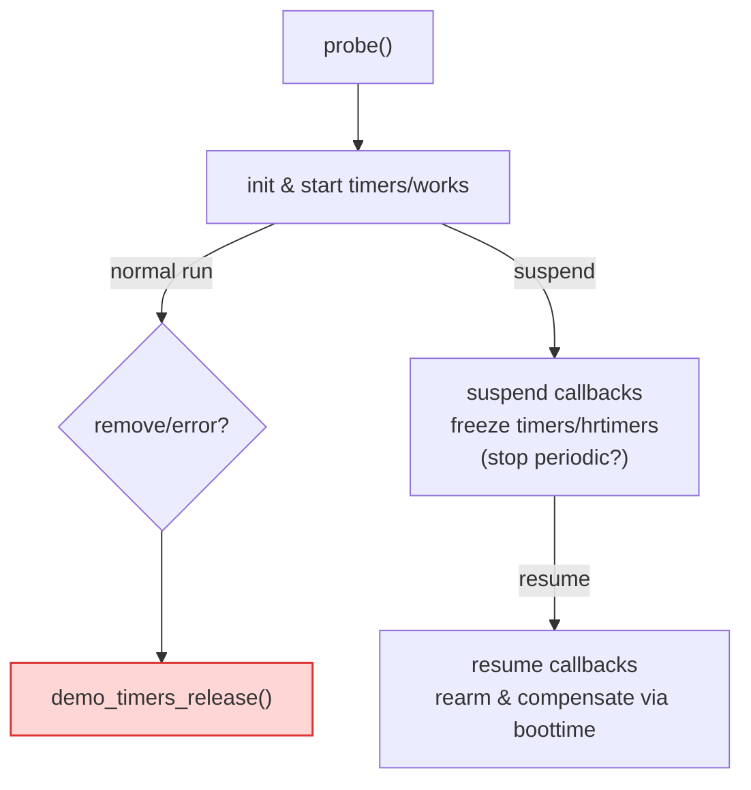

# 第10章_与_devres_驱动生命周期和_PM_的关系

> 章节内容说明：本章聚焦“时间/定时机制”与**资源管理（devres）**、**驱动生命周期（probe/remove/error path）**、**电源管理（suspend/resume/runtime PM）\**之间的耦合与收尾顺序。我们先阐明为什么内核没有通用的 `devm_timer_create()`；随后给出以 `devm_add_action_or_reset()` 为核心的资源化收尾模板；再讲定时器 + `delayed_work` 的\**正确停表顺序**与**并发边界**；最后讨论系统挂起/恢复对定时器的影响、补偿策略与唤醒配合（`wakeup_source`/RTC alarm/PM QoS）。

------

## 10.1_主题引入_为什么需要在_时间_上谈资源管理与_PM

- 定时器（`timer_list`/`hrtimer`）、延迟工作（`delayed_work`）本质上是**异步执行的控制流**。它们不直接占用硬件资源，但会在**回调**里访问设备资源（GPIO、clk、regmap、I/O 内存等）。
- 设备的**销毁、挂起**如果与**在途回调**交叠，会产生**悬空访问**、**顺序不一致**与**死锁**。
- 因此，“时间机制”必须嵌入驱动生命周期：**创建—运行—停表—对称回收**，并与 PM 的冻结/解冻配合。

------

## 10.2_数据结构视角_devres_时间基与_PM_框架的交界

- **devres（设备资源管理）**：以 `devm_*` 系列封装为代表，按设备生命周期自动回收资源。其范式适合**一次性分配、可线性回收**的对象（GPIO/clk/regmap/内存等）。
- **定时机制对象**
  - `struct timer_list`：挂接在**软中断 timer base**；靠 `mod_timer()/del_timer_sync()` 管理。
  - `struct hrtimer`：挂接在 **hrtimer wheel**；靠 `hrtimer_start()/hrtimer_cancel()` 管理。
  - `struct delayed_work`：封装 `work_struct` + `timer_list`；靠 `cancel_delayed_work_sync()` 与工作队列语义管理。
- **PM 框架**
  - **系统挂起（suspend to RAM）**：`CLOCK_MONOTONIC` 时间停走，普通 `timer_list`/`hrtimer`被**冻结**；不能用以**唤醒系统**。
  - **RTC/Alarm**：独立硬件，可用于定时唤醒；与 `wakeup_source`、`device_init_wakeup()` 配合以保证“准时/可唤醒”。
  - **CLOCK_BOOTTIME**：包含挂起区间，可用于**恢复后补偿**“错过的周期”。

------

## 10.3_开发者视角一_为什么内核没有通用的_devm_timer_create()

**核心原因（机制本质与约束）**

1. **回调并发不可由 devres 自动解消**
    `devm_*` 的自动回收无法保证“没有在途回调”。定时器/工作项可能正在 CPU 上运行或即将被触发。需要**明确的同步语义**：

- `del_timer_sync()`/`hrtimer_cancel()`/`cancel_delayed_work_sync()` 才能阻塞等待回调退出。
- 这类“等待回调退出”的**控制语义**不是标准的资源释放（不像 `clk_put()` 那样无并发）。

1. **生命周期交错复杂**

- 一个设备实例可能在 probe 成功很久后才按条件启动定时逻辑；也可能在 error path 中仅创建了部分类。
- 通用 `devm_timer_create()` 很难覆盖“只在部分状态下需要同步停表”的**状态机差异**。

1. **上下文要求不同**

- `timer_list`/`hrtimer`/`delayed_work` 的**上下文能力**不同（能否睡眠、回调在哪个上下文），通用包装易误导或掩盖关键差异。

**结论**

- 内核鼓励**显式**创建/启动/停止/同步的写法；缺省不提供 `devm_timer_create()`。
- 但提供了**通用的** `devm_add_action_or_reset()` 以便把“停表与同步”注入 devres 回收阶段，形成“**资源化的收尾动作**”。

------

## 10.4_开发者视角二_用_devm_add_action_or_reset()_资源化收尾

### 10.4.1_通用范式(推荐)

```c
static void demo_timers_release(void *data)
{
	struct demo_priv *dp = data;

	/* 顺序很重要：先阻断产生者，再同步取消消费者 */
	del_timer_sync(&dp->poll_timer);           /* 若使用 timer_list */
	hrtimer_cancel(&dp->tx_hrtimer);           /* 若使用 hrtimer */
	cancel_delayed_work_sync(&dp->debounce_work); /* 若使用 delayed_work */
	/* 若回调会再次排程彼此，需保证上面顺序能“关源头、后关派生” */
}

ret = devm_add_action_or_reset(dev, demo_timers_release, dp);
if (ret)
	return ret; /* 自动在错误路径调用 release 动作 */
```

**使用要点**

- 将**所有时间机制的“停表 + 同步取消”\**集中到一个 release 函数中；确保\**顺序正确**（见下一小节）。
- 若 probe 中途失败，`or_reset` 语义会**立即执行 release**，避免半拉子定时器遗留。
- 这并不替代你在 `remove()` 中的停表；`remove()` 内仍应该调用**相同的 release** 或等价逻辑，以实现**对称**。

### 10.4.2_停表的正确顺序(timer_+_delayed_work_+_hrtimer)

**通例**（以第9章示例的三件套为例）：

1. **阻断上游触发**：比如先屏蔽/释放 IRQ、清除状态位，避免在停表期间又排程新的 work/timer。
2. **停周期源→停高精度超时→停延迟工作**：
   - `del_timer_sync(&poll_timer);`（周期源，可能二次排程 work）
   - `hrtimer_cancel(&tx_hrtimer);`（短窗精度，通常不再派生）
   - `cancel_delayed_work_sync(&debounce_work);`（消费者，可能在执行 critical section）
3. **flush_workqueue()**（如使用自建 wq 并需要完全 quiesce）。

> 原因：先停“产生者/上游”，再停“消费者/下游”，避免**停了下游但上游又投递**导致的悬空或再次唤醒。

------

## 10.5_开发者视角三_与_PM_的协作与补偿

### 10.5.1_系统挂起(suspend)下的行为特征

- **普通 `timer_list`/`hrtimer`（CLOCK_MONOTONIC）在系统挂起时被冻结，不会走时钟，更不会唤醒系统**。
- 如需“准时唤醒”，应使用**RTC alarm**或 SoC 提供的 **alarmtimer** 机制，配合：
  - `device_init_wakeup(dev, true)`、`pm_wakeup_event(dev, msec)`
  - 平衡功耗与时效性时，可加 `pm_qos_request`（避免进入过深 C-state 影响唤醒延迟）。

### 10.5.2_恢复(resume)后的补偿策略

- 若你的任务为**周期性维护**，在 `resume` 后应：
  - 读取**挂起前时间点**与恢复后的 `ktime_get_boottime_ns()`；
  - 计算“错过的周期次数”，决定**立即补做一次**还是**重新对齐下一个 tick**；
  - 重新 `mod_timer()` / `hrtimer_start()`。
- 对**超时类**（事务 watchdog），通常在 `suspend` 前就**停表/取消**；`resume` 后按状态机决定是否**重启或上报超时**（视业务语义）。

### 10.5.3_runtime_PM_与工作队列

- 若 `delayed_work` 会**访问可能在 runtime suspend 中关闭的资源**（如 regmap/clk），需在回调中显式 `pm_runtime_get_sync()`/`pm_runtime_put()`，或在调度前确保设备已处于**活跃**态。
- 结合 `autosuspend` 时，定时周期太短会**打断省电效果**，建议：
  - 周期任务改为**事件驱动**；
  - 或在 `runtime_suspend` 前**关周期定时**，`runtime_resume` 后再重启。

------

## 10.6_可视化_生命周期与停表顺序(含_PM)



------

## 10.7_示例代码_devres_收尾_+_PM_钩子_+_正确停表顺序

> 说明：基于第9章 `demo_priv` 扩展，加入 devres 释放动作与 PM 衔接；展示“remove/错误路径/PM”三处的一致性。内核版本面向 6.1+。

```c
// SPDX-License-Identifier: GPL-2.0
#include <linux/module.h>
#include <linux/platform_device.h>
#include <linux/pm.h>
#include <linux/hrtimer.h>
#include <linux/timer.h>
#include <linux/workqueue.h>
#include <linux/interrupt.h>
#include <linux/ktime.h>
#include <linux/pm_wakeup.h>
#include <linux/pm_qos.h>

struct demo_priv {
	struct device *dev;
	/* ... 第9章字段略 ... */
	struct timer_list    poll_timer;
	struct hrtimer       tx_hrtimer;
	struct delayed_work  debounce_work;
	int irq;
	/* PM/补偿 */
	ktime_t last_active_boottime;
	bool periodic_enabled;
};

/* 停表与同步的汇聚点：用于 devm_add_action_or_reset & remove */
static void demo_timers_release(void *data)
{
	struct demo_priv *dp = data;

	/* 1) 先阻断上游触发（示意：禁中断或屏蔽派生） */
	if (dp->irq >= 0)
		disable_irq(dp->irq);

	/* 2) 停周期源 → 停高精度 → 停延迟工作 */
	del_timer_sync(&dp->poll_timer);
	hrtimer_cancel(&dp->tx_hrtimer);
	cancel_delayed_work_sync(&dp->debounce_work);

	if (dp->irq >= 0)
		enable_irq(dp->irq); /* 若设备仍在，可恢复；release末尾通常无需再开 */
}

static int demo_suspend(struct device *dev)
{
	struct demo_priv *dp = dev_get_drvdata(dev);

	/* 记录 boottime 以便 resume 后补偿 */
	dp->last_active_boottime = ktime_get_boottime();

	/* 对周期任务：挂起前停表，避免在冻结阶段反复排程 */
	if (dp->periodic_enabled) {
		del_timer_sync(&dp->poll_timer);
		dp->periodic_enabled = false;
	}

	/* 事务类超时通常也应取消 */
	hrtimer_cancel(&dp->tx_hrtimer);

	/* 去抖等可睡任务：根据语义选择取消或保留状态 */
	cancel_delayed_work_sync(&dp->debounce_work);

	/* 若需要唤醒能力：可在业务关键路径配合 pm_wakeup_event(dev, msec) */
	return 0;
}

static int demo_resume(struct device *dev)
{
	struct demo_priv *dp = dev_get_drvdata(dev);
	ktime_t now = ktime_get_boottime();
	s64 delta_ms = ktime_to_ms(ktime_sub(now, dp->last_active_boottime));

	/* 根据 delta_ms 补偿：错过太久则立即跑一次或推迟对齐下个周期 */
	if (!dp->periodic_enabled) {
		unsigned long next = jiffies + msecs_to_jiffies(100); /* 示例：100ms 后对齐 */
		mod_timer(&dp->poll_timer, next);
		dp->periodic_enabled = true;
	}

	/* 事务 watchdog 是否需要在恢复后重启，依状态机决定 */
	/* hrtimer_start(&dp->tx_hrtimer, ms_to_ktime(dp->cfg.tx_timeout_ms), HRTIMER_MODE_REL_PINNED); */

	dev_dbg(dev, "resume: slept %lld ms, periodic rearmed\n", delta_ms);
	return 0;
}

static const struct dev_pm_ops demo_pm_ops = {
	.suspend = demo_suspend,
	.resume  = demo_resume,
	/* runtime PM 时，也可实现 .runtime_suspend/.runtime_resume 做相同逻辑 */
};

static int demo_probe(struct platform_device *pdev)
{
	struct device *dev = &pdev->dev;
	struct demo_priv *dp;
	int ret;

	dp = devm_kzalloc(dev, sizeof(*dp), GFP_KERNEL);
	if (!dp)
		return -ENOMEM;
	dp->dev = dev;
	platform_set_drvdata(pdev, dp);

	/* 初始化定时机制（略去解析/GPIO/IRQ 细节，参阅第9章） */
	timer_setup(&dp->poll_timer, /*fn*/ NULL, 0); /* 请替换为真实回调 */
	hrtimer_init(&dp->tx_hrtimer, CLOCK_MONOTONIC, HRTIMER_MODE_REL_PINNED);
	dp->tx_hrtimer.function = /* 回调 */ NULL;
	INIT_DELAYED_WORK(&dp->debounce_work, /* workfn */ NULL);

	/* 把停表动作注册到 devres：确保 error/remove 自动收尾 */
	ret = devm_add_action_or_reset(dev, demo_timers_release, dp);
	if (ret)
		return ret;

	/* 按需启动周期任务 */
	dp->periodic_enabled = true;
	mod_timer(&dp->poll_timer, jiffies + msecs_to_jiffies(200));

	return 0;
}

static int demo_remove(struct platform_device *pdev)
{
	struct demo_priv *dp = platform_get_drvdata(pdev);

	/* remove 路径可选择显式调用或“交给 devres”。
	 * 为对称与可读性，推荐显式：
	 */
	demo_timers_release(dp);
	return 0;
}

static const struct of_device_id demo_of_match[] = {
	{ .compatible = "nxp,imx6ull-led_key_int" },
	{ }
};
MODULE_DEVICE_TABLE(of, demo_of_match);

static struct platform_driver demo_driver = {
	.probe  = demo_probe,
	.remove = demo_remove,
	.driver = {
		.name = "demo-time-devres-pm",
		.pm   = &demo_pm_ops,
		.of_match_table = demo_of_match,
	},
};
module_platform_driver(demo_driver);

MODULE_LICENSE("GPL");
MODULE_DESCRIPTION("Demo: devres + timers/works + PM coordination");
```

**要点复核**

- `devm_add_action_or_reset()` 将“**停表与同步**”注册为**设备资源的释放动作**。
- `suspend/resume` 内对周期/超时/工作做**对称停启**，恢复时借助 `CLOCK_BOOTTIME` 做**补偿/对齐**。
- `remove` 路径**显式**调用与 devres 动作保持一致语义，便于代码审计与后续维护。

------

## 10.8_用户视角_可配置与文档化

- 在 `sysfs`/`debugfs` 中声明与 PM 相关的**策略开关**（例如：挂起前是否停周期、恢复后的补偿模式、是否允许唤醒）。
- 面向现场运维提供**两套预置**：**省电优先**（挂起停表、恢复对齐）与**时效优先**（RTC 唤醒 + `wakeup_source` 保护关键窗口）。

------

## 10.9_调试与验证

| 目标                             | 方法                                                         |
| -------------------------------- | ------------------------------------------------------------ |
| 校验 remove/error 是否无悬空回调 | 在 `demo_timers_release()` 处打 `trace_printk()`；配合 `ftrace:function_graph` 观察是否仍有回调进入 |
| 校验停表顺序是否正确             | 人为制造高频 IRQ/排程风暴，观察是否出现“停下游、上游仍在投递”的警告或竞态 |
| 验证 suspend/resume 行为         | `echo mem > /sys/power/state`；恢复后检查补偿日志与周期对齐是否符合预期 |
| 唤醒通路                         | 启用 RTC alarm，观察唤醒路径与 `pm_wakeup_event()` 是否形成闭环 |
| 运行时能耗/时效                  | 结合 `powertop`/PM QoS，对比“停表/不停表、补偿/不补偿”的差异 |

------

## 10.10_小结

1. **没有 `devm_timer_create()` 是合理的**：定时/工作属于**控制流**，需要**显式的同步停表**保证无在途回调。
2. **`devm_add_action_or_reset()` 是资源化收尾的抓手**：将“停表与同步”统一纳入设备回收序列，覆盖 error/remove。
3. **正确顺序**：先**阻断上游**（如 IRQ/周期源），再**同步取消下游**（`hrtimer`/`delayed_work`），必要时 `flush_workqueue()`。
4. **与 PM 协作**：挂起冻结普通定时器，唤醒需靠 RTC/alarm；恢复用 `CLOCK_BOOTTIME` 做补偿与对齐；runtime PM 注意在回调中获取/释放电源引用。
5. **工程建议**：将“时间策略”文档化与参数化（sysfs/debugfs），提供“省电/时效”两套预置，便于在不同产品场景切换。

> 下一章（第11章）将深入系统挂起与定时唤醒：围绕 RTC/alarmtimer、PM QoS 与 tickless/idle 的协作细节，给出“既省电又能准时”的驱动策略与模板。