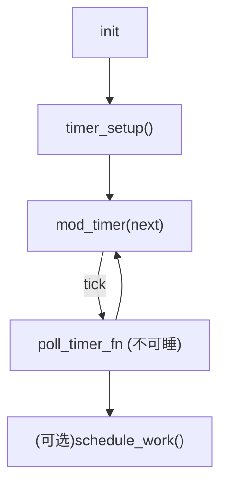
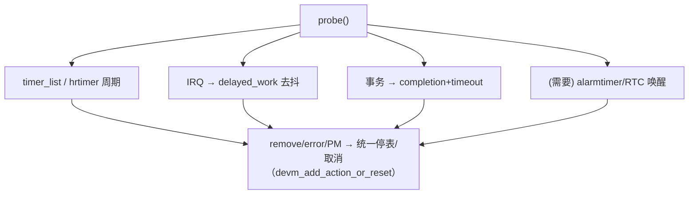

# 第12章_常用模式与代码模板

> 阅读指引：
>  这一章不空谈概念，我们直接把**五类高频时序/定时需求**写成可以“复制到工程就能跑”的模板，并配上“什么时候用、为什么这样写、别踩哪里”。模板全部面向 Linux 6.1+，遵循你前面几章的约定：**回调极简、可睡任务后移、相位对齐、不补跑风暴、remove/错误路径对称收尾、必要时 devres/PM 介入**。
>  覆盖模式：
>
> 1. **低精度周期轮询（timer_list）**
> 2. **高精度周期轮询（hrtimer）**
> 3. **中断后推迟到进程上下文（delayed_work）**
> 4. **带超时的事务执行（completion/timeout + 可选 hrtimer）**
> 5. **NFC/按键类去抖（IRQ → delayed_work）**
>     每个模式都含：使用场景 → 设计要点 → 最小可用代码 → 组合注意点。

------

## 12.1_周期性轮询(低精度版_timer_list)

**什么时候用**

- 负载轻、精度不敏感（≥10ms），希望 CPU 空闲时少打扰；
- 不需要在系统挂起期间“准时”。恢复后对齐即可。

**设计要点**

- 用 `timer_setup()` + `mod_timer()`；
- 回调不可睡，仅做轻量查询；
- 若需要睡，请把重活丢给 `schedule_work()` 或改用 `delayed_work`；
- `remove()` 对称 `del_timer_sync()`；
- 恢复后**对齐下一拍**（参见第 11 章策略）。

```c
// SPDX-License-Identifier: GPL-2.0
#include <linux/timer.h>
#include <linux/jiffies.h>
#include <linux/workqueue.h>

struct poll_demo {
	struct device     *dev;
	struct timer_list  tmr;
	unsigned int       period_ms;   /* ≥10ms 建议 */
	struct work_struct work;        /* 可选：把重活移交 */
	bool               periodic_enabled;
};

/* 轻量轮询：不可睡 */
static void poll_timer_fn(struct timer_list *t)
{
	struct poll_demo *pd = from_timer(pd, t, tmr);

	/* ……轻量读寄存器/状态（不可睡）…… */

	/* 若有重活：schedule_work(&pd->work); */

	/* 周期重排程 */
	mod_timer(&pd->tmr, jiffies + msecs_to_jiffies(pd->period_ms));
}

static void poll_work(struct work_struct *w)
{
	struct poll_demo *pd = container_of(w, struct poll_demo, work);
	/* ……可睡任务，如 I2C/MDIO 访问、状态上报…… */
}

static int poll_init(struct poll_demo *pd, unsigned int period_ms)
{
	pd->period_ms = clamp_t(unsigned int, period_ms, 10, 60*60*1000);
	timer_setup(&pd->tmr, poll_timer_fn, 0);
	INIT_WORK(&pd->work, poll_work);
	pd->periodic_enabled = true;
	return mod_timer(&pd->tmr, jiffies + msecs_to_jiffies(pd->period_ms));
}

static void poll_stop(struct poll_demo *pd)
{
	pd->periodic_enabled = false;
	del_timer_sync(&pd->tmr);
	cancel_work_sync(&pd->work);
}
```

**组合注意点**

- 与 runtime PM：如果回调里访问外设，请移交到 `work` 再 `pm_runtime_get/put()`；
- 与挂起：系统醒来后，按“相位对齐”重启（参考 11.7 模板）。



------

## 12.2_周期性轮询(高精度版_hrtimer)

**什么时候用**

- 需要 <1ms 级别的周期与抖动控制；
- 回调上下文不可睡，重活仍应后移。

**设计要点**

- `hrtimer_init()` + `hrtimer_start()`；
- 周期重启用 `HRTIMER_RESTART` 或外部 `hrtimer_forward_now()`；
- `remove()` 对称 `hrtimer_cancel()`；
- 对齐策略与 11 章相同：避免“补跑风暴”。

```c
#include <linux/hrtimer.h>
#include <linux/ktime.h>

struct hrt_poll {
	struct device   *dev;
	struct hrtimer   hrt;
	u32              period_us;   /* 高精度周期 */
	struct work_struct work;      /* 重活后移 */
};

static enum hrtimer_restart hrt_cb(struct hrtimer *hr)
{
	struct hrt_poll *hp = container_of(hr, struct hrt_poll, hrt);

	/* 轻量、不可睡逻辑…… */

	/* 重活移交 */
	schedule_work(&hp->work);

	/* 周期重启（稳定节拍） */
	hrtimer_forward_now(hr, ktime_set(0, hp->period_us * 1000ULL));
	return HRTIMER_RESTART;
}

static void hrt_work(struct work_struct *w)
{
	struct hrt_poll *hp = container_of(w, struct hrt_poll, work);
	/* ……可睡任务…… */
}

static int hrt_init(struct hrt_poll *hp, u32 period_us)
{
	hp->period_us = clamp_t(u32, period_us, 50, 5*60*1000*1000);
	INIT_WORK(&hp->work, hrt_work);
	hrtimer_init(&hp->hrt, CLOCK_MONOTONIC, HRTIMER_MODE_REL_PINNED);
	hp->hrt.function = hrt_cb;
	return hrtimer_start(&hp->hrt, ktime_set(0, hp->period_us * 1000ULL),
			     HRTIMER_MODE_REL_PINNED);
}

static void hrt_stop(struct hrt_poll *hp)
{
	hrtimer_cancel(&hp->hrt);
	cancel_work_sync(&hp->work);
}
flowchart TD
  A["init"] --> B["hrtimer_init()"]
  B --> C["hrtimer_start(period)"]
  C -->|expire| D["hrtimer cb (不可睡)"]
  D --> E["schedule_work()"]
  D --> F["hrtimer_forward_now() → RESTART"]
```

------

## 12.3_中断中推迟到进程上下文(delayed_work)

**什么时候用**

- 中断里抓到“发生了事件”，需要**等一小段**时间再在可睡环境里做处理（读稳定态、访问 I2C、上报 input 等）；
- 典型：按键去抖第一步、PHY 链路抖动缓冲、传感器数据稳定窗。

**设计要点**

- 线程化中断或硬中断里只做**记账**与**排程**；
- `INIT_DELAYED_WORK()` + `mod_delayed_work(system_wq, …)`；
- 退出/移除时 `cancel_delayed_work_sync()`；
- 与 9 章 `nxp,debounce-ms` 一致。

```c
#include <linux/workqueue.h>
#include <linux/interrupt.h>
#include <linux/gpio/consumer.h>

struct int_defer {
	struct device       *dev;
	struct delayed_work  dwork;
	unsigned int         delay_ms;   /* 延迟窗口 */
	struct gpio_desc    *gpiod;      /* 示例：读稳定电平 */
	bool                 pending;
};

static void defer_workfn(struct work_struct *w)
{
	struct int_defer *id = container_of(to_delayed_work(w), struct int_defer, dwork);
	/* 可睡：读取稳定态、访问总线、上报事件…… */
	bool stable = gpiod_get_value_cansleep(id->gpiod);
	dev_dbg(id->dev, "stable=%d\n", stable);
	id->pending = false;
}

static irqreturn_t irq_thread(int irq, void *data)
{
	struct int_defer *id = data;
	if (!id->pending) {
		id->pending = true;
		mod_delayed_work(system_wq, &id->dwork, msecs_to_jiffies(id->delay_ms));
	}
	return IRQ_HANDLED;
}

static void defer_init(struct int_defer *id, unsigned int delay_ms)
{
	INIT_DELAYED_WORK(&id->dwork, defer_workfn);
	id->delay_ms = clamp_t(unsigned int, delay_ms, 1, 2000);
}

static void defer_stop(struct int_defer *id)
{
	cancel_delayed_work_sync(&id->dwork);
}
flowchart TD
  I["IRQ/Threaded IRQ"] --> A["set pending"]
  A --> B["mod_delayed_work(delay_ms)"]
  B --> C["workfn (可睡) → 读稳定态/上报"]
  C --> D["clear pending"]
```

------

## 12.4_带超时的事务执行(completion/timeout_+_可选_hrtimer_看门狗)

**什么时候用**

- 需要在**相对时间**内等待硬件完成（DMA 结束、寄存器 ready、外设响应）；
- 不能无限等，必须**超时退出**并报告错误；
- 可选：用 `hrtimer` 当“更精确的 watchdog”。

**设计要点**

- `reinit_completion()` → 触发事务 → `wait_for_completion_timeout()`；
- 完成路径 `complete_all()`（中断或线程）；
- 超时路径：标志错误、收尾硬件、上报；
- 若事务本身可被校时影响，仍优先相对时间（jiffies/ktime）。

```c
#include <linux/completion.h>

struct xact_demo {
	struct device     *dev;
	struct completion  done;
	u32                timeout_ms;
	atomic_t           inflight;
	/* 可选：hrtimer watchdog */
	struct hrtimer     wd;
};

static enum hrtimer_restart wd_cb(struct hrtimer *hr)
{
	struct xact_demo *xd = container_of(hr, struct xact_demo, wd);
	if (atomic_xchg(&xd->inflight, 0)) {
		/* 超时处理：打断事务/记录错误/唤醒等待方 */
		complete_all(&xd->done);
	}
	return HRTIMER_NORESTART;
}

static int xact_start(struct xact_demo *xd)
{
	reinit_completion(&xd->done);
	atomic_set(&xd->inflight, 1);

	/* 启动硬件事务…… */

	/* 可选 watchdog（更好抖动控制） */
	hrtimer_start(&xd->wd, ms_to_ktime(xd->timeout_ms), HRTIMER_MODE_REL_PINNED);

	/* 等待完成或超时 */
	if (!wait_for_completion_timeout(&xd->done, msecs_to_jiffies(xd->timeout_ms))) {
		dev_err(xd->dev, "xact timeout\n");
		/* 统一收尾：撤回/复位硬件…… */
		return -ETIMEDOUT;
	}
	return 0;
}

/* 完成路径（中断/线程） */
static void xact_complete(struct xact_demo *xd)
{
	if (atomic_xchg(&xd->inflight, 0)) {
		hrtimer_cancel(&xd->wd);
		complete_all(&xd->done);
	}
}

static void xact_init(struct xact_demo *xd, u32 timeout_ms)
{
	init_completion(&xd->done);
	xd->timeout_ms = clamp_t(u32, timeout_ms, 1, 600000);
	hrtimer_init(&xd->wd, CLOCK_MONOTONIC, HRTIMER_MODE_REL_PINNED);
	xd->wd.function = wd_cb;
}

static void xact_stop(struct xact_demo *xd)
{
	hrtimer_cancel(&xd->wd);
}
flowchart TD
  A["xact_start()"] --> B["reinit_completion()"]
  B --> C["kick HW / inflight=1"]
  C --> D["hrtimer_start(timeout)"]
  D --> E{"done?"}
  E -->|yes| F["cancel watchdog + complete"]
  E -->|no (timeout)| G["watchdog fires → complete_all → 报错收尾"]
```

------

## 12.5_NFC/按键类去抖(IRQ_to_delayed_work_DTS_接入)

**什么时候用**

- 人机输入/近场触发天然抖动，需要**窗口化**采样确认稳定；
- 参数来自设备树：如 `nxp,debounce-ms`。

**设计要点**

- IRQ 里只标记 `pending` 并按 `debounce-ms` 排程；
- `workfn` 里读取稳定电平，必要时**再次短延迟**确认；
- 动态调参：`sysfs` 写入后**立即生效并重排程**；
- 结合 9–11 章：与 `device_init_wakeup()`、`pm_wakeup_event()`、相位对齐策略配合。

```c
#include <linux/of.h>
#include <linux/workqueue.h>
#include <linux/gpio/consumer.h>
#include <linux/sysfs.h>

struct debounce_demo {
	struct device       *dev;
	struct gpio_desc    *key_gpiod;
	struct delayed_work  dwork;
	u32                  debounce_ms;  /* 来自 DTS：nxp,debounce-ms */
	bool                 pending;
	struct mutex         lock;
};

/* work：可睡，读稳定态并上报 */
static void db_workfn(struct work_struct *w)
{
	struct debounce_demo *dd = container_of(to_delayed_work(w), struct debounce_demo, dwork);
	bool stable = gpiod_get_value_cansleep(dd->key_gpiod);
	/* ……根据 stable 上报 input 或触发后续逻辑…… */
	dd->pending = false;
}

static irqreturn_t db_irq_thread(int irq, void *data)
{
	struct debounce_demo *dd = data;
	unsigned long dly = msecs_to_jiffies(READ_ONCE(dd->debounce_ms));

	if (!dd->pending) {
		dd->pending = true;
		mod_delayed_work(system_wq, &dd->dwork, dly);
	}
	return IRQ_HANDLED;
}

/* DTS 解析与初始化 */
static void db_parse_dt(struct debounce_demo *dd)
{
	u32 v = 20;
	of_property_read_u32(dd->dev->of_node, "nxp,debounce-ms", &v);
	dd->debounce_ms = clamp_t(u32, v, 1, 2000);
}

static ssize_t debounce_ms_show(struct device *dev,
		struct device_attribute *attr, char *buf)
{
	struct debounce_demo *dd = dev_get_drvdata(dev);
	return sysfs_emit(buf, "%u\n", READ_ONCE(dd->debounce_ms));
}

static ssize_t debounce_ms_store(struct device *dev,
		struct device_attribute *attr, const char *buf, size_t count)
{
	struct debounce_demo *dd = dev_get_drvdata(dev);
	unsigned long v;
	if (kstrtoul(buf, 10, &v))
		return -EINVAL;

	mutex_lock(&dd->lock);
	dd->debounce_ms = clamp_t(unsigned long, v, 1, 2000);
	mutex_unlock(&dd->lock);

	/* 立即生效：若 pending，重排程 */
	if (dd->pending)
		mod_delayed_work(system_wq, &dd->dwork,
			msecs_to_jiffies(READ_ONCE(dd->debounce_ms)));
	return count;
}
static DEVICE_ATTR_RW(debounce_ms);

static struct attribute *db_attrs[] = {
	&dev_attr_debounce_ms.attr,
	NULL,
};
ATTRIBUTE_GROUPS(db);

static void db_init(struct debounce_demo *dd)
{
	mutex_init(&dd->lock);
	INIT_DELAYED_WORK(&dd->dwork, db_workfn);
	db_parse_dt(dd);
	sysfs_create_groups(&dd->dev->kobj, db_groups);
}

static void db_stop(struct debounce_demo *dd)
{
	sysfs_remove_groups(&dd->dev->kobj, db_groups);
	cancel_delayed_work_sync(&dd->dwork);
}
flowchart TD
  N["IRQ"] --> A["set pending"]
  A --> B["mod_delayed_work(debounce)"]
  B --> C["work: read stable"]
  C --> D["report / clear pending"]
```

------

## 12.6_组合范式与收尾顺序(把模板拼成_骨架)

- **常见骨架**（例：你的 `demo_led_key_int@0`）
  - 周期维护：`timer_list`（低负载）或 `hrtimer`（高精度）；
  - 中断事件：`delayed_work` 去抖/确认；
  - 事务类：`completion + timeout`；
  - 唤醒需求：按 11 章选 `alarmtimer/RTC` 其一；
  - **停表顺序**：先停**周期源** → 停 **watchdog/hrtimer** → 停 **delayed_work**；
  - remove/error/PM：使用 `devm_add_action_or_reset()` 汇聚“停表 + 同步取消”。



------

## 12.7_快速对照表

| 模式               | 精度              | 上下文   | 可睡   | 典型用法               | 退出/收尾                    |
| ------------------ | ----------------- | -------- | ------ | ---------------------- | ---------------------------- |
| timer_list         | 低（tick 级）     | softirq  | 否     | 轻量周期维护           | `del_timer_sync()`           |
| hrtimer            | 高（us 级）       | hardirq  | 否     | 高精度周期/短 watchdog | `hrtimer_cancel()`           |
| delayed_work       | 由 timer 驱动     | 进程     | 是     | 去抖/需要睡的延后处理  | `cancel_delayed_work_sync()` |
| completion+timeout | 取决于超时基      | 进程     | 是     | 有超时的事务等待       | 无专用，超时路径自收尾       |
| alarmtimer         | BOOTTIME/REALTIME | hardirq  | 否     | 到点唤醒               | `alarm_cancel()`             |
| RTC alarm          | 绝对墙钟          | IRQ/驱动 | 视实现 | 深省电可靠唤醒         | `rtc_alarm_irq_enable(0)` 等 |

------

## 12.8_小结

- 选机制前先回答三件事：**是否到点唤醒？是否可睡？精度到什么级别？**
- 模板不是孤立的：**周期 + 去抖 + 事务 + 唤醒**常常要一起用，关键是**回调极简/后移、相位对齐、不补跑风暴**。
- 退出路径必须**可证明地干净**：`*_cancel/_sync` 全部对上；把“停表顺序”做成一个 `release()`，用 `devm_add_action_or_reset()` 绑定到设备生命周期。
- 与 PM 的结合点（runtime/挂起/RTC）请参考第 11 章的唤醒与补偿策略，按项目电源目标选型。

> 如果你愿意，我们可以把这一章的模板**打包成一个可复用的内核 helper 头文件**（如 `drivers/misc/leaf_time_helpers.h`），并配套一个 Kconfig 选项，方便在你的 i.MX6ULL 与后续平台上复用。