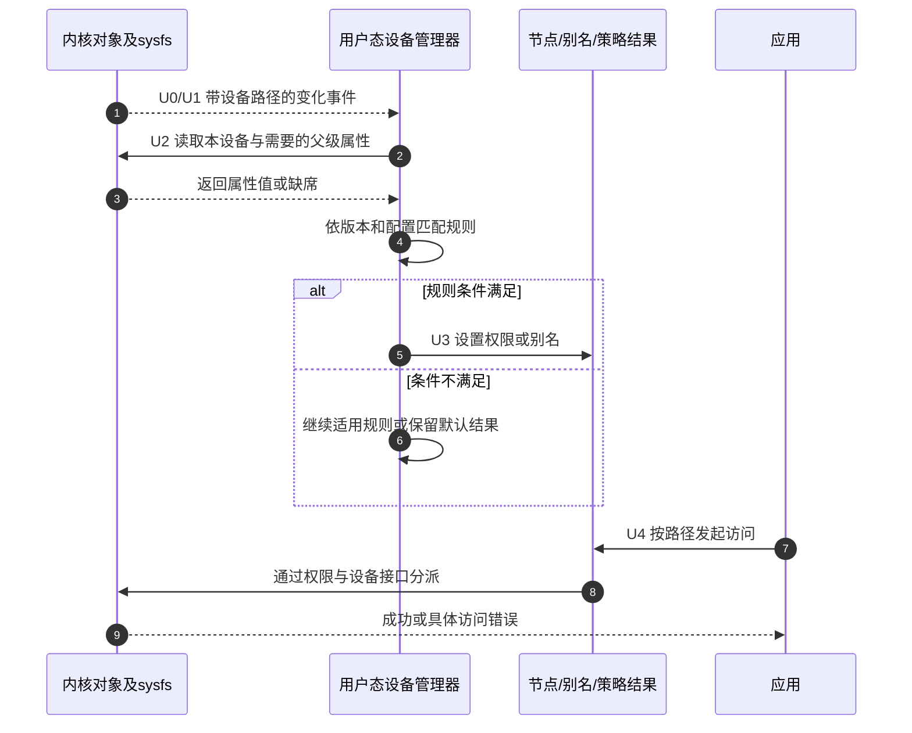

# 第1章\_设备事件与用户态策略

[内核资源退出](../linux/object_lifetime/devres/P02_托管资源与使用者退出.md#2.3_时序与控制流)已经解决资源责任怎样结束，现在追问应用怎样找到正确的设备入口。贯穿实例是一只USB转串口适配器：它的内核名字可能是ttyUSB0，应用希望普通用户获得受控访问，并使用明确的路径。先把“设备身份”“路径名称”“访问权限”分开，再决定规则应该读取什么、写入什么。

本章udev语义以systemd v257的[udev规则手册](https://github.com/systemd/systemd/blob/v257/man/udev.xml)和[udevadm工具手册](https://github.com/systemd/systemd/blob/v257/man/udevadm.xml)为核对边界；mdev以BusyBox [1.37.0官方源码包](https://busybox.net/downloads/busybox-1.37.0.tar.bz2)中的`docs/mdev.txt`和`util-linux/mdev.c`为依据。它们不是目标机已安装版本的声明。开始实验先看本机版本、帮助与构建配置，不把NXP内核的6.12.20版本号套到用户态程序上。

## 1.1\_定义与分层位置

内核事件uevent是设备对象发生变化时发布的消息；netlink是内核与用户空间交换这类消息的一种套接字通道。消息可以带有ACTION、DEVPATH和SUBSYSTEM等字段，管理器还可以查询sysfs、读取规则并维护自己的数据库。规则中的`ATTR{}`是“读取属性后匹配”的语法，不是内核把一个叫ATTR的大字典随事件完整发来。

[层次概览](../linux/object_lifetime/devres/P03_驱动资源与用户态访问的协作.md#3.2_一张图看全链路%28从硬件到_/dev%29)已经区分devtmpfs和devres。启用了devtmpfs并挂载到正确位置时，内核可以提供基础节点；udev进一步维护权限、属性数据库、别名等策略。mdev也可以依据sysfs设备号创建节点，具体结果取决于`/dev`所在文件系统和系统集成。不能把“管理器没有运行”直接等同于“任何节点都不可能存在”。

udev和mdev均不把一个设备节点自动变成可用的业务服务：访问还要通过权限检查，并由对应内核接口接受。设备原始节点已经出现、规则处理完成、应用成功打开，是三个不同的观察结论。

## 1.2\_全通路流程(内核\_to\_用户态\_to\_/dev)

本章把用户态这一轮策略处理记为U0～U4，与前章资源退出S0～S4分开。两套状态通过同一设备身份关联，却没有一个共同的“全部完成”标志。

| 阶段 | 状态放在哪里，谁写谁读 | 这一步能说明什么 |
| --- | --- | --- |
| U0发布 | 内核device及sysfs表达对象关系和属性；事件带路径与动作 | 这个对象发生了变化，不普遍证明probe完成 |
| U1接收 | 管理器从事件通道接收，或启动扫描发现现有对象 | 程序得到了输入；还没有证明目标规则命中 |
| U2匹配 | 用户态读取规则、当前对象和适用父对象的属性 | 找到满足条件的规则，得到待执行的赋值和动作 |
| U3应用 | 管理器更新节点权限、别名或自身数据库；可有受限附加动作 | 策略结果发生变化，不代表应用设备协议正确 |
| U4使用 | 应用查询路径并发起open等系统调用 | 需要另行检查错误码、访问身份及驱动状态 |



冷插拔处理解决“监听器启动以前已经存在的对象”；热插拔处理解决“运行期间继续发生的事件”。先扫描一遍再启动监听，中间可能有事件窗口；如何接住这个窗口取决于实际管理器。本版本mdev守护模式先打开事件套接字，再做初始扫描，不能把它简化成无限重复`mdev -s`。

## 1.3\_udev\_规则与工具

先观察同一个tty对象，然后写最小权限规则，最后再加身份选择。这样规则失败时，能判断缺的是匹配输入还是输出动作。

### 1.3.1\_规则文件与优先级

v257会合并系统目录、运行时目录和本地管理目录中的`.rules`文件，按文件名字典顺序处理；常见位置有`/usr/lib/udev/rules.d`、`/usr/local/lib/udev/rules.d`、`/run/udev/rules.d`和`/etc/udev/rules.d`。同名文件会被高优先级目录中的文件替换，`/etc`高于`/run`，后者高于`/usr`层。因此“放在/etc”不等于“所有本地规则永远最后执行”，文件名和同名覆盖是两条规则。

一行可以包含多个匹配键与赋值键；匹配条件共同满足才应用赋值。`==`用于比较，`=`用于设置，`+=`向列表增加项目；普通`=`仍可能被后续规则改写。`:=`表示最终赋值，但有引入版本边界，不能给旧系统无条件复制。以下实例使用较基础的操作符，仍须核对本机规则栈。

### 1.3.2\_常用匹配键

假如规则需要问“这次发生什么、是哪一个对象、它属于哪类设备”，对应的键就是ACTION（事件动作）、KERNEL（内核设备名）和SUBSYSTEM（子系统）。DRIVER再查询绑定驱动，ATTR读取属性，ENV查询设备属性集合。部分键加S表示向父链寻找候选，下面按查询对象对照，而不是按字母相似程度猜含义。

| 写法 | 实际查什么 | 容易混淆的边界 |
| --- | --- | --- |
| `ACTION==` | 本次事件动作 | add、change、remove不是同一次事件 |
| `KERNEL==`、`SUBSYSTEM==` | 本设备名和子系统 | ttyUSB0是名字；字符设备不是通用char子系统名 |
| `DRIVER==` | 本事件设备已绑定的驱动 | 驱动可能绑定在某个父设备上，需要查真实树 |
| `ATTR{file}==` | 本设备的sysfs属性 | 不自动向父级寻找 |
| `ATTRS{file}==`、`KERNELS==`、`SUBSYSTEMS==`、`DRIVERS==` | 沿父链寻找匹配对象 | 同一条规则的父级匹配条件须落在同一个父对象上 |
| `ENV{key}==` | 本事件处理中的设备属性 | 不等同于任意shell环境或任意sysfs文件 |

USB串口的tty对象和USB设备父对象通常处于不同层。先看属性遍历输出，再确认idVendor、idProduct、serial是否出现在同一个父对象的块里，不能从几个不同层随便各取一个值拼成规则。

### 1.3.3\_常用动作键

`MODE`、`OWNER`、`GROUP`设置节点权限和属主；目标组必须在系统中有实际定义。`SYMLINK+=`增加指向节点的别名。v257中的`NAME`赋值用于网络接口命名，不能拿它重命名普通字符设备节点；串口的友好路径应通过符号链接表达。

`RUN+=`不是一个常驻服务启动器。它适合事件处理中的短任务，不能把长期运行的进程简单放到后台就认为完成集成；udevd的执行与沙箱限制也会影响网络或挂载等操作。需要长期服务时，应通过系统的服务管理机制组织启动关系，而不是延长设备规则处理。

### 1.3.4\_变量占位

`%k`展开为内核设备名，`%p`表示设备路径，`%E{属性名}`展开指定设备属性。例如`serial/%k`在当前设备叫ttyUSB0时形成serial/ttyUSB0。这里的替换由udev完成，不是shell变量替换；规则也不是C程序。

换个插入顺序，ttyUSB0可能代表另一只适配器。因此“把变化的内核名放进一个子目录”提供的是组织结构，不是稳定物理身份。要固定到某只适配器，还要引入可靠且足够区分设备的属性。

### 1.3.5\_规则示例

先以已确认SUBSYSTEM为tty、名字匹配ttyUSB的对象练习权限和别名：

```text
# /etc/udev/rules.d/99-note-serial.rules
# 只处理ttyUSB设备；dialout须为目标系统实际存在的组。
SUBSYSTEM=="tty", KERNEL=="ttyUSB*", MODE="0660", GROUP="dialout", SYMLINK+="serial/%k"
```

0660允许拥有者和所属组读写，未赋予其他用户直接读写权限；这仍不是驱动协议层面的授权模型。应用进程的实际组集合需要包含对应组，修改账户配置以后，旧进程未必自动获得新的组身份。

如果目标是识别某只适配器，可在确认同父属性后改用下面的身份规则。数值仅为书面示例，必须替换为实际观测值；VID（Vendor ID，厂商标识）和PID（Product ID，产品标识）通常区分厂商及产品，未必区分同型号的两只设备，serial也需要检查是否存在且不重复。

```text
# 三个ATTRS须匹配同一个父设备，不能把示例序列号当作检测结果。
SUBSYSTEM=="tty", KERNEL=="ttyUSB*", ATTRS{idVendor}=="0403", ATTRS{idProduct}=="6001", ATTRS{serial}=="A1B2C3D4", SYMLINK+="serial/lab_adapter"
```

两行若共同安装，第一行负责权限和按内核名组织，第二行额外添加物理身份别名。不要让多只设备竞争同一个lab_adapter名字。类似地，GPIO字符接口可按实测`SUBSYSTEM=="gpio"`与`KERNEL=="gpiochip*"`设置权限，但gpiochip编号也不天然等于永久的板级身份。

### 1.3.6\_调试命令

先在目标系统只读收集输入。下面的ttyUSB0是已选择的实验设备；它不存在时先定位真实sysfs对象，不能继续把空路径传给后续命令。

```bash
udevadm --version
udevadm info --query=all --name=/dev/ttyUSB0
udevadm info --attribute-walk --name=/dev/ttyUSB0
stat -L -c '%F %a %U %G %t:%T' /dev/ttyUSB0
id
```

`info`解释管理器看到的身份，属性遍历用于定位本设备与父设备；`stat -L`跟随符号链接，显示真正目标的类型、权限、属主和设备号；`id`查看当前进程身份。它们没有重新触发设备事件，也不证明串口读写协议已经通过。

另开一个终端观察事件，需要时按目标系统权限运行：

```bash
udevadm monitor --kernel --udev --property --subsystem-match=tty
```

kernel侧观察说明看到了内核事件，udev侧观察说明看到了用户态处理后发布的事件。监听器启动前发生的事件不会因此重新出现，选错子系统、时间窗口或命名空间也会导致“没看见”。

规则修改是另一步。先保存原配置，在隔离实验系统安装规则，并确认本机支持相应命令：v257可用`udevadm verify`检查规则文件；`udevadm test`是模拟规则处理的诊断工具，不能一概当作绝无副作用的纯解析器。本章不把它们的成功替代实际节点检查。重载规则只影响后续事件，之后若需要重放，先限定目标并预览：

```bash
# 以下会影响实验系统的设备策略；先确认只匹配已选ttyUSB0。
udevadm control --reload-rules
udevadm trigger --dry-run --verbose --action=add --subsystem-match=tty --sysname-match=ttyUSB0
# 人工核对预览对象后，再执行这一条有副作用的重放。
udevadm trigger --action=add --subsystem-match=tty --sysname-match=ttyUSB0
udevadm settle --timeout=10
stat -L -c '%F %a %U %G %t:%T' /dev/serial/ttyUSB0
```

重放add也可能触发其他匹配规则，不能只根据自己的规则无脚本就断言无额外动作。settle等待当前udev队列，不保证未来没有新设备事件，也不证明业务服务全部就绪。实验后恢复原规则文件；若原先没有该文件，只删除本次新增文件，重载并对所选设备恢复策略或在可恢复环境重新插拔，再检查实际权限和别名。

## 1.4\_mdev\_配置与运行方式

先确认目标BusyBox确实编入mdev及所需功能。源码1.37.0里的规则解析、执行外部命令、重命名和守护模式分别受功能开关控制；安装了BusyBox这个二进制不代表所有开关都启用。

### 1.4.1\_启动与触发

`mdev -s`扫描已有对象；启用FEATURE_MDEV_DAEMON时，`mdev -d`通过netlink持续处理事件，`-f`可使其留在前台，由启动系统监督。该实现先打开套接字再扫描，之后进入事件循环。

另一种集成通过内核hotplug helper调用mdev，这需要目标内核配置提供相关支持，并确认`/proc/sys/kernel/hotplug`存在且系统由这套机制负责。不能在已有udev或mdev守护模式工作的机器上再照抄写hotplug路径的命令。两种接入方式必须由启动设计选择，扫描命令本身不会替你做这个选择。

### 1.4.2\_配置文件\_/etc/mdev.conf\_语法

最小规则包含设备名正则、用户:组和八进制权限。例如：

```text
# /etc/mdev.conf中的实验条目；确认两个组确实存在。
^ttyUSB[0-9]+$    root:dialout  0660
^gpiochip[0-9]+$  root:gpio     0660
```

这里使用正则表达式，不是udev的匹配键列表。1.37.0通常在首条匹配规则后停止，行首`-`可以要求继续匹配；不能把udev“后续规则继续赋值”的认识原样搬来。高级形式还可以限定环境变量或设备号，须依真实输入和构建功能使用。

启用重命名功能后，`=path`移动/改名节点，`>path`还在原位置建立指向新位置的链接，`!`可以抑制节点创建；正则捕获替换另受FEATURE_MDEV_RENAME_REGEXP控制。启用命令执行功能后，`@`对应创建后执行，`$`对应删除前执行，`*`覆盖这两个时机，不能概括为“所有事件都执行”。命令由shell处理，参数引用和脚本权限仍需自行保证。

### 1.4.3\_初始化脚本片段(BusyBox\_系)

启动集成至少要安排好sysfs、应用可见的`/dev`、组数据库与选定事件接收者。下例只用于已经选择mdev守护模式的1.37.0实验系统；它不会挂载文件系统或停用现有服务，这些必须由外层启动系统事先完成。

```sh
#!/bin/sh
# 前置：FEATURE_MDEV_DAEMON已启用，sysfs与/dev已准备，未运行重复管理器。
# -d内部先建立事件接收再初始扫描；-f让服务监督者管理这个前台进程。
exec /sbin/mdev -d -f
```

若选的是helper方案，则在确认内核支持和唯一责任后，由启动脚本登记实际helper绝对路径并执行初始扫描；不要同时启动上面的守护模式。没有通用的“写一个路径、所有rootfs即配置完成”的两行脚本。

### 1.4.4\_环境变量

命令执行时MDEV提供mdev选定的节点名；本版本若经过别名改写，它可成为改写后的路径，不能始终当作原始内核basename。其他变量取决于事件来源、扫描方式和处理路径。脚本应逐项检查所需变量，而不是假定扫描与热插拔具有完全相同的环境。helper的标准输出可能连接到`/dev/null`，因此“脚本echo没出现在dmesg”不能证明脚本没执行；要为实际集成选择可读取的日志目标。

## 1.5\_udev\_与\_mdev\_对比

| 同一需求 | systemd v257 udev | BusyBox 1.37.0 mdev |
| --- | --- | --- |
| 持续接收事件 | 由udevd接收和处理 | 选定已启用的守护模式或helper集成 |
| 为现有对象应用策略 | 有针对性地重放事件，再检查结果 | 扫描；守护模式启动也包含初始扫描 |
| 匹配输入 | 设备属性、sysfs及父链等 | 名称正则及配置支持的环境/设备号匹配 |
| 规则推进 | 多条适用规则可继续赋值 | 默认首条匹配结束，续配需显式表达 |
| 别名语义 | 普通节点用SYMLINK添加链接 | 重命名/链接方向按=与>区别 |
| 证据边界 | 工具帮助、规则栈和目标实际结果 | BusyBox编译开关、启动方式和目标实际结果 |

不要把程序体积和启动速度写成未经测量的固定胜负。系统已经使用哪套服务管理、需要哪些身份属性、如何审计规则失败，往往比一句“轻量”更能决定维护成本。

## 1.6\_端到端示例(同一硬件\_两种方案)

仍用同一只USB串口，先统一需求：目标节点可由dialout组读写；若还要额外路径，必须比较它究竟是节点还是链接，而不只比较字符串有没有出现。

### 1.6.1\_udev\_方案

使用1.3.5第一条完整规则。核对身份、保存规则、重载、限定重放或真实插拔，再以`stat -L`确认实际目标为字符设备且模式和组正确。`ls -l /dev/serial/ttyUSB0`看到的是链接本身，不能把链接的权限位当作目标访问权限。

再分别记录原节点和别名的设备号，确认它们指向同一对象。若需要固定物理身份，则增加已验证的父级属性规则；按%k命名仍随枚举名字变化。

### 1.6.2\_mdev\_方案

1.4.2中的最小规则只设置原节点权限，没有承诺创建serial别名。若实验系统确实启用重命名与正则捕获，可以单独选择下面这条规则替代串口行：

```text
# 新路径是节点，原/dev/ttyUSB0成为链接；方向与udev示例不同。
^ttyUSB([0-9]+)$  root:dialout  0660  >serial/ttyUSB%1
```

它说明“两个路径都能找到”并不代表两种方案的文件布局相同。不要把此规则与旧规则并列后期待两者都会执行，因为先匹配的行可能已经结束搜索。使用前确认你的`/dev`布局允许该重命名行为。1.37.0的make_device会尝试在原名处建立链接；若devtmpfs已经创建同名节点，链接创建失败，可能留下原节点和新路径两个节点。源码也明确记录了这一情况。因此上面的链接方向描述有“原位置允许建链接”这个前提，必须在隔离目标核对，不能只靠配置文本保证移动成功。

创建、删除和再次创建都要检查链接目标及设备号；单次扫描成功不足以证明remove后没有残留。若应用必须要求与udev示例完全相同的别名方向，或必须靠硬件序列号固定身份，就需要另一套经过验证的规则/脚本设计，本条最小配置不能冒充完成该要求。

## 1.7\_故障定位流程

从失败现象选择入口。路径不存在时先看设备是否已发布、节点是否应存在、挂载是否正确，再看策略结果；权限不符时同时检查节点实际权限、用户组集合和后续覆盖规则；已经打开却读写失败时记录系统调用错误并追踪内核接口。不要强制所有问题都从“probe是否成功”走一遍直线。

对事件问题区分U0到U3：是否确有这个对象的事件、观察器是否在正确时间和通道监听、规则输入是否满足、输出是否又被其他规则修改。对mdev再区分扫描和持续接收；对udev再区分规则重载和设备重放。dmesg主要是内核日志入口，不是所有用户态规则动作的统一日志。

## 1.8\_常见问题与修正

| 现象 | 至少要排除的不同原因 | 下一步证据 |
| --- | --- | --- |
| 无节点 | 未发布设备号、错误挂载、管理策略或创建失败 | 对应sysfs对象、dev属性、挂载及日志 |
| 有节点但组不对 | 规则未命中、组不存在、后续规则覆盖 | 属性遍历、组数据库、实际目标stat |
| 新规则似乎没生效 | 仅修改文件未重载，或重载后未发生事件 | 选定设备的事件与最终结果 |
| serial别名指错设备 | 只用内核编号，或多设备竞争同名 | 唯一身份、链接目标和设备号 |
| mdev扫描后不响应插拔 | 只有初始扫描，没有有效持续接收 | 守护模式/内核helper配置和运行状态 |
| 日志看不到动作 | 观察窗口不对，或输出被重定向 | 管理器自身日志与脚本明确日志目标 |

## 1.9\_与第2章的接口关系说明(边界复核)

U3策略结果不改变S2“停止使用后再释放”的责任；S4清理完成也不等于所有用户态名字都已经消失。两层有因果联系：驱动注册/撤销接口会改变用户态输入，应用访问又会进入驱动；但没有哪一层可以代替另一层的证据。

所以不再使用“节点是否出现与devm完全无关联”这样的绝对说法。正确边界是：devres本身不负责用户态命名策略，而具体托管的注册/注销动作可能影响对外接口的存在。

## 1.10\_评审与交付清单

把一次实验留下的证据写成一条可复查的链：程序版本及功能配置、所选对象的真实身份、规则原文、应用前后的目标类型/权限/设备号、事件观察时间窗，以及恢复原配置后的结果。这里只实际核对了指定版本的手册/源码与命令语法，没有在目标机运行udev/mdev、重放设备或修改其权限。

最后做三道预测题，再进入跨层实例：

1. 只运行`udevadm control --reload-rules`后，旧节点一定立即改组吗？为什么？
2. 把两条不同父对象上的ATTRS条件写在一行，是否等于沿整条链分别找到就算匹配？
3. mdev一次扫描让节点出现，以后拔出再插入却不更新，哪项启动责任尚未被证明？

第一题缺少后续事件处理；第二题违反同一父对象条件；第三题需要验证持续接收路径。它们分别检查时机、身份和参与者，不是三个需要死记的工具选项。继续[跨层观察](../linux/object_lifetime/devres/P03_驱动资源与用户态访问的协作.md#3.9_角色与接口边界)，把这些判断与内核退出依赖连起来。
