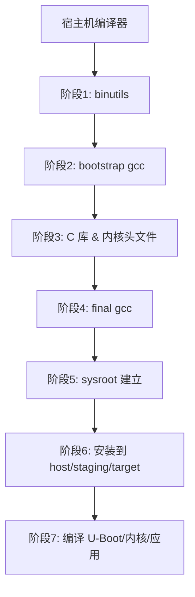
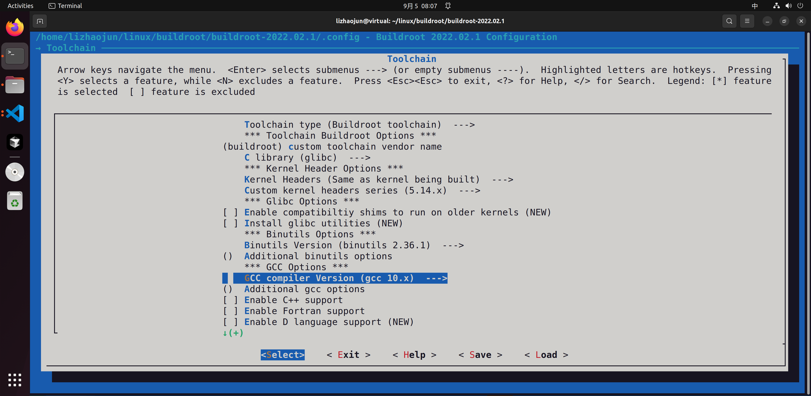
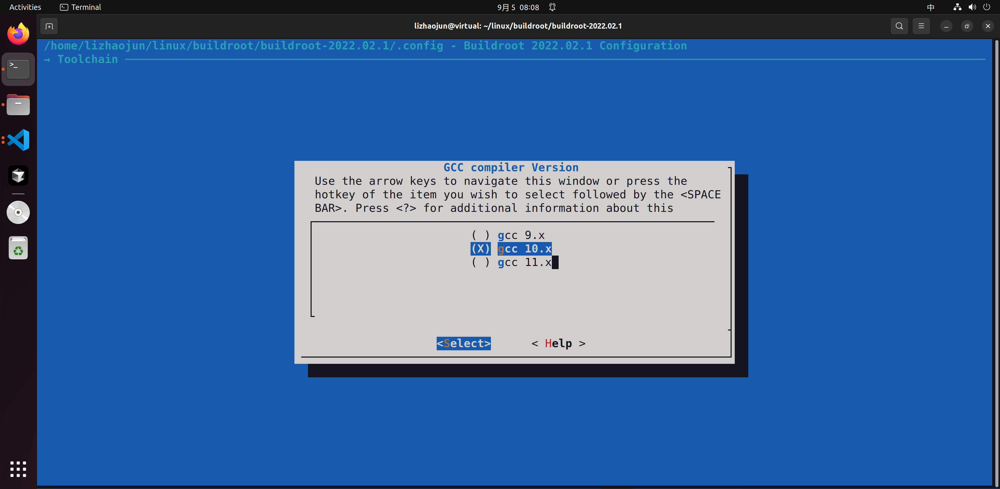
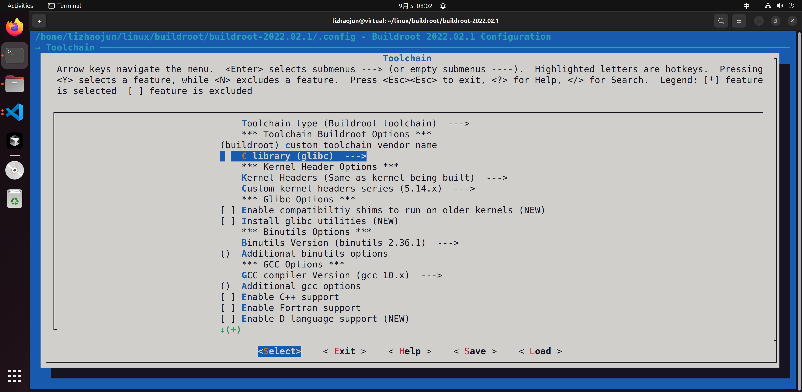
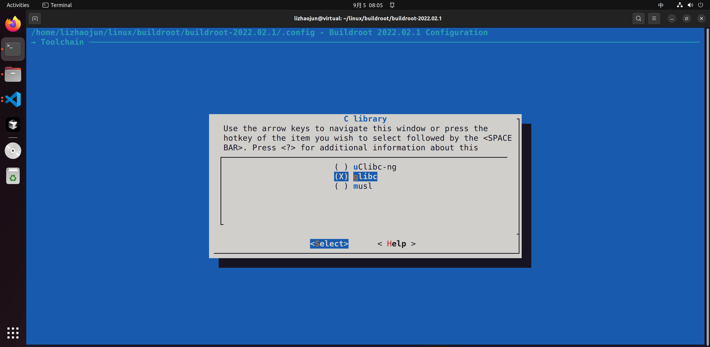
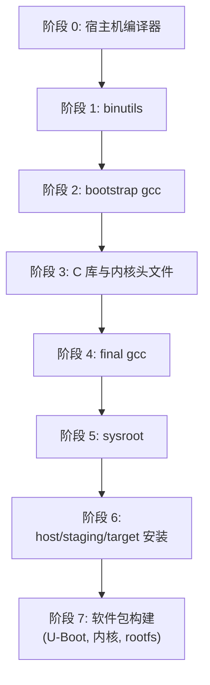

# 第2章_工具链的构建流程概览

## 2.1_构建流程的整体概念

在嵌入式 Linux 的开发中，**交叉编译工具链**是一切构建工作的起点。用户态应用、内核、Bootloader、根文件系统中的库，全部依赖它来完成编译。工具链的正确性和一致性，直接决定了最终系统能否稳定运行。

Buildroot 提供了两种方式来获取工具链：

- **外部工具链**：使用第三方已经编译好的交叉编译器，例如 Linaro、Sourcery CodeBench 或芯片厂商 SDK。
- **内部工具链**：由 Buildroot 自行在宿主机上，按照预设流程一步步编译生成完整的交叉工具链。

本章的重点是内部工具链。它的构建不是一次性完成的，而是通过一系列**循序渐进的阶段**来实现的。每个阶段都有明确的输入、输出和依赖关系，最终形成一套可以用于整个 Buildroot 构建过程的交叉编译环境。

------

### 2.1.1_背景_为什么要分阶段构建

编译器与 C 库之间存在**循环依赖**。

- C 库需要一个编译器来编译自身。
- 但完整的编译器也需要依赖 C 库来实现标准库函数的支持。

为了打破这一“先有鸡还是先有蛋”的困境，工具链的构建必须被拆分成多个阶段。先用一个“简化的编译器”把 C 库编出来，再利用这套库来构建功能完整的编译器。这也是内部工具链后端采用分阶段流程的根本原因。

------

### 2.1.2_内部工具链的全景图

下面的流程图展示了内部工具链后端的各个阶段：



------

### 2.1.3_阶段划分的基本逻辑

| 阶段   | 主要任务                   | 输入                  | 输出                        |
| ------ | -------------------------- | --------------------- | --------------------------- |
| 阶段 0 | 使用宿主机 gcc 启动流程    | 宿主机 gcc            | 能够编译 binutils 的环境    |
| 阶段 1 | 构建 binutils              | 宿主机 gcc            | 汇编器、链接器等            |
| 阶段 2 | 构建 bootstrap gcc         | 宿主机 gcc + binutils | 简化版 gcc                  |
| 阶段 3 | 构建 C 库，安装内核头文件  | bootstrap gcc         | 完整 C 库                   |
| 阶段 4 | 构建 final gcc             | C 库 + 内核 headers   | 完整的交叉 gcc              |
| 阶段 5 | 建立 sysroot               | final gcc + C 库      | 可用于交叉编译的 sysroot    |
| 阶段 6 | 安装到 host/staging/target | final gcc + sysroot   | 三棵目录树                  |
| 阶段 7 | 用工具链编译全部软件       | 交叉工具链            | U-Boot、内核、BusyBox、应用 |

------

### 2.1.4_内部工具链后端_–_阶段_说明与用户参与度

| 阶段                                | 涉及工具/组件                              | 作用                                                         | 特点与说明                                                  | 用户是否需要参与 / 可配置项                                  |
| ----------------------------------- | ------------------------------------------ | ------------------------------------------------------------ | ----------------------------------------------------------- | ------------------------------------------------------------ |
| **阶段 0：起始**                    | 宿主机 gcc / make / 依赖工具               | Buildroot 使用宿主机编译器启动流程                           | 仅用于编译 binutils、bootstrap gcc，之后退出                | ❌ 无需参与，只需确保宿主机环境满足 Buildroot 手册要求（glibc 版本、gcc ≥ 最低要求等） |
| **阶段 1：binutils 构建**           | binutils (ld, as 等)                       | 提供汇编、链接能力                                           | 任何目标架构都需要                                          | ❌ 无需手动干预，Buildroot 自动完成                           |
| **阶段 2：bootstrap gcc**           | gcc (无完整 libc 支持)                     | 构建“最小 gcc”                                               | 功能有限，仅能编 libc                                       | ❌ 无需参与，流程全自动                                       |
| **阶段 3：C 库 & Linux 内核头文件** | glibc / uClibc-ng / musl + 内核 headers    | 提供目标系统基础运行时支持                                   | 内核 headers 版本 ≤ 目标机实际内核版本                      | ✅ 需要用户配置：• 选择 C 库类型（glibc / uClibc-ng / musl）• 配置 C 库功能（locale、RPC、线程支持等）• 选择内核头文件版本 |
| **阶段 4：final gcc**               | 完整 gcc (交叉编译器)                      | 用 libc 重建完整 gcc                                         | 完整支持 C、C++、优化选项                                   | ✅ 需要用户配置：• 选择 gcc 版本（Buildroot 提供若干 tested 版本） |
| **阶段 5：工具链 sysroot**          | sysroot 目录结构                           | 存放目标头文件和库                                           | 类似“开发用 rootfs”                                         | ❌ 无需参与，Buildroot 自动填充                               |
| **阶段 6：产物安装**                | output/host, output/staging, output/target | - host: 交叉工具链本体- staging: 开发 sysroot- target: 运行时 rootfs | staging 和 target 是关键区别：一个带 headers，一个 stripped | ❌ 无需参与，除非你要额外 overlay 或定制 rootfs               |
| **阶段 7：后续包构建**              | U-Boot / Kernel / 应用库 / BusyBox 等      | 用 final gcc + sysroot 编译所有目标软件                      | 此时宿主机 gcc 完全退出                                     | ✅ 需要用户配置：• 是否启用 U-Boot / Kernel（以及各自 defconfig）• rootfs 类型（ext4/cpio/squashfs 等）• 应用和库的选择 |

### 2.1.5_小结

内部工具链的构建是一条分阶段的流水线：

- 从宿主机 gcc 出发，
- 经过 binutils 和 bootstrap gcc，
- 借助内核头文件完成 C 库的构建，
- 最终形成功能完整的交叉 gcc，
- 并生成 sysroot 和三棵目录树，
- 供所有后续的软件包编译使用。

这种阶段化的设计解决了编译器与 C 库之间的循环依赖问题，同时保证了构建过程的可控性与可重复性。


------

## 2.2_阶段_0_宿主机编译器准备

在内部工具链的构建流程中，**宿主机自带的编译环境是唯一的外部依赖**。
 在此阶段，Buildroot 并不会立刻构建交叉编译器，而是利用宿主机现有的编译工具来完成最初的编译工作，例如构建 `binutils` 与 `bootstrap gcc`。如果宿主机环境不满足最低要求，整个过程就无法开始。

------

### 2.2.1_宿主机编译器的角色

宿主机编译器在此阶段扮演着“引导器”的角色：

- 它不是最终工具链的一部分；
- 它只用来**启动内部工具链的构建流程**；
- 一旦完整的交叉 gcc 构建完成，宿主机编译器就完全退出，不再参与后续工作。

因此，宿主机编译器的任务是“让第一块多米诺骨牌倒下”。但如果它的版本过低，或者缺少必要的特性，就会导致这一骨牌根本推不动。

------

### 2.2.2_最低要求与兼容性

Buildroot 官方手册和开发者经验指出，宿主机编译器必须满足以下条件：

| 要素                  | 要求                                                         | 原因                                        |
| --------------------- | ------------------------------------------------------------ | ------------------------------------------- |
| **gcc 版本**          | 通常要求 **≥ 4.8**，而对于新版本 Buildroot，建议使用 **≥ 7.x** 或更新 | 较老的 gcc 无法编译现代 gcc/musl/glibc 源码 |
| **binutils**          | 不低于 Buildroot 支持的最低版本                              | 避免链接失败或不识别新指令集                |
| **glibc**（宿主机库） | 符合 Buildroot 文档最低要求                                  | 防止构建目标 glibc 时缺少符号               |
| **make**              | 支持 GNU make 的现代特性                                     | Buildroot makefile 大量依赖                 |
| **其他工具**          | bison、flex、perl、python 等                                 | 在工具链编译过程中用于生成代码或脚本        |

------

### 2.2.3_常见问题与陷阱

1. **宿主机 gcc 太旧**
   - 现象：在编译 bootstrap gcc 时编译失败。
   - 解决：升级宿主机编译器，或换用新版 Linux 发行版。
2. **宿主机缺少依赖工具**
   - 现象：make 报错提示找不到 bison、flex。
   - 解决：通过宿主机的包管理器安装缺失工具。
3. **宿主机库与工具链不兼容**
   - 现象：构建 glibc 时符号缺失。
   - 解决：确保宿主机 glibc 符合 Buildroot 的最低要求。

------

### 2.2.4_工程实践建议

- **使用受支持的发行版**：如 Ubuntu LTS（20.04 或更高）、Debian Bullseye/Bookworm，避免使用过老或小众发行版。
- **定期验证宿主机环境**：Buildroot 提供 `support/scripts/check-host-tar.sh` 和 `support/scripts/check-host-gcc.sh` 等工具，能快速验证宿主机依赖是否满足。
- **隔离环境**：对于长期项目，建议在 Docker 或虚拟机中固定宿主机版本，避免系统升级带来不可控变化。

------

### 2.2.5_Buildroot_的版本管理

**提问：**

没有较为明确的方法来辨别版本匹配吗？比如uboot的doc/build/gcc.rst里面会规定gcc的版本，那么buildroot有相关的说明吗？

**GPT说：**

问得好 👍，你提到的 **U-Boot 的 `doc/build/gcc.rst`** 就是一个很好的例子：它会明确说明“推荐使用 GCC 的某某版本区间”，开发者一看就能知道哪些编译器是经过验证的。那 Buildroot 有没有类似的东西呢？我给你分层说明：

------

#### (1)_Buildroot_的设计理念

- **U-Boot / Linux 内核文档**：通常会写明“tested / recommended gcc 版本”，因为它们直接依赖编译器来产出可运行的二进制。
- **Buildroot**：不自己规定“工具链必须是 gcc X.Y”，而是规定“**宿主机和工具链的最低要求**”，并在配置系统里给出**一系列经过测试的版本选项**。

换句话说，Buildroot 不像 U-Boot 那样提供一份固定的“白名单”，而是通过 **配置菜单 + 发行版支持矩阵** 来间接告诉你“哪些版本能用”。

------

#### (2)_Buildroot_的官方说明方式

##### 1)_官方手册(manual.html)

- 在 *System requirements* 一章，列出了宿主机工具的最低版本要求（gcc、make、binutils、glibc 等）。
- 这些要求会随着 Buildroot 发布版本而更新，例如：
  - Buildroot 2021.x 要求宿主机 gcc ≥ 4.8
  - Buildroot 2024.x 已经建议 gcc ≥ 7.5 或更高
- 如果宿主机版本过低，编译过程中会明确报错。

##### 2)_menuconfig_配置菜单

- `Toolchain → Toolchain type → Buildroot toolchain`
- 进入后你会看到：
  - **GCC compiler Version** → 一列可选版本（例如 9.x、10.x、11.x、12.x）
  - **C library** → glibc / musl / uClibc-ng
  - **Kernel Headers** → 若干可选系列（例如 5.4、5.10、6.1）
- 这些版本就是 Buildroot 社区**测试过的组合**，可以直接使用。
- 如果你强行改成未测试过的版本，可能需要自己补丁。

##### 3)_测试矩阵(test_results)

- Buildroot 社区在 [autobuild](https://autobuild.buildroot.org/) 上有一个自动化测试平台。
- 它会每天对不同 gcc/glibc/binutils 组合进行构建验证。
- 如果你想确认“gcc 11 + musl + kernel headers 5.10 是否可行”，可以去查 autobuild 的结果。

------

#### (3)_与_U-Boot_文档的区别

- **U-Boot**：文档里写死“推荐 GCC 6.4 ~ 12.2”，属于显式白名单。
- **Buildroot**：
  - 不直接写死一个区间；
  - 而是提供了“可选版本列表”和“宿主机最低要求”；
  - 并通过 autobuild 来保证这些组合大部分是可用的。

所以 Buildroot 的“版本匹配”不是静态文档，而是一个 **配置选项 + 自动测试体系**。

------

#### (4)_工程实践怎么做

1. **先看 menuconfig 提供的 gcc / headers / libc 选项**：只选里面的版本，就几乎不会出问题。
2. **如果要尝试新版本 gcc**：去 autobuild 查一下该版本的编译结果，有多少报错。
3. **生产环境**：建议锁定一个 Buildroot LTS 版本（例如 2022.02 LTS），使用它默认推荐的工具链版本，减少维护成本。

------

✅ 总结一句：
 Buildroot 没有像 U-Boot 那样给出“一份固定的 gcc 版本表”，但它通过 **配置菜单列出可用版本**，并依靠 **autobuild 测试矩阵**来确保这些版本可行。所以，辨别版本匹配的最明确方法，就是看 **Buildroot menuconfig 提供的选项 + autobuild 验证结果**。

------

要不要我帮你整理一张表，把 **Buildroot LTS 版本 → 默认支持的 gcc / glibc / kernel headers 版本** 列出来，作为“快速参考”？


### 2.2.6_小结

阶段 0 是内部工具链后端的基石。

- 宿主机编译器不是最终产物，而是一个“启动引导”。
- 如果宿主机环境不过关，后续的 binutils 和 bootstrap gcc 就无法生成。
- 工程实践上，**保证宿主机环境符合 Buildroot 文档最低要求，是进入后续阶段的必要前提**。

------


------

## 2.3_阶段_1_binutils_构建

在宿主机编译器完成“引导”任务之后，内部工具链构建的第一步就是 **binutils**。这一阶段看似低调，却是整个交叉编译环境的基础。如果 binutils 出问题，后续的 gcc 与 C 库都无法顺利编译，更别提编译内核与用户空间应用了。

------

### 2.3.1_binutils_在工具链中的作用

**binutils** 是 GNU 提供的一组底层二进制工具集合，主要包括：

- **汇编器 (as)**：把汇编代码转为目标文件；
- **链接器 (ld)**：把目标文件和库组合为可执行文件；
- **objdump / nm / readelf / strip 等辅助工具**：用于分析和处理二进制文件。

在交叉编译工具链中，binutils 必须针对 **目标架构**构建。例如，针对 ARM Cortex-A7，你需要的是 `arm-buildroot-linux-uclibcgnueabihf-ld`，而不是宿主机的 `/usr/bin/ld`。

换句话说，binutils 是交叉工具链的“二进制操作层”，没有它，后续 gcc 就算能编译 C 代码，也无法正确生成目标平台的可执行文件。

------

### 2.3.2_构建过程与依赖

在阶段 1，Buildroot 做的工作包括：

1. 下载指定版本的 **binutils 源码**（来自 GNU 上游）。
2. 使用宿主机 gcc 编译出 **面向目标架构的交叉 binutils**。
3. 安装到 Buildroot 的 `output/host/bin/`，生成带前缀的工具，例如：
   - `arm-buildroot-linux-uclibcgnueabihf-ld`
   - `arm-buildroot-linux-uclibcgnueabihf-as`

此时，binutils 已经是“交叉版本”，但仍依赖宿主机 gcc 来完成编译工作。

------

### 2.3.3_用户是否需要参与

通常情况下，用户不需要对 binutils 阶段做任何干预。

- **Buildroot 已经预设了多个经过测试的版本**（例如 2.36、2.37、2.38）。
- 在 `Toolchain → Binutils Version` 菜单里，你可以选择合适的版本。
- 如果没有特别需求，直接使用 Buildroot 默认推荐的版本即可。

------

### 2.3.4_常见问题

1. **版本不兼容**
   - 某些旧的 gcc 可能无法编译较新的 binutils。
   - 解决方法：升级宿主机 gcc 或选择较旧的 binutils。
2. **目标架构支持缺失**
   - 例如新出的架构（RISC-V 变种）需要较新的 binutils 才能识别指令。
   - 解决方法：在 Buildroot 里选择新版本 binutils，或自己维护补丁。
3. **路径污染**
   - 如果宿主机 `/usr/bin/ld` 被优先调用，可能导致混淆。
   - Buildroot 通过 `CROSS_COMPILE` 前缀机制避免了这个问题。

------

### 2.3.5_表_1_binutils_阶段关键点

| 项目         | 内容                                              |
| ------------ | ------------------------------------------------- |
| 输入         | 宿主机 gcc、binutils 源码                         |
| 输出         | 交叉 binutils（ld, as, objdump 等）               |
| 安装位置     | `output/host/bin/arm-buildroot-linux-xxx-*`       |
| 用户可配置项 | Binutils 版本选择                                 |
| 常见风险     | gcc 过旧导致编译失败；目标架构需要新版本 binutils |

------

### 2.3.6_小结

阶段 1 的 binutils 构建，为交叉工具链打下了最基础的“二进制操作层”。

- 它由宿主机 gcc 编译，产出交叉版本的 ld、as 等工具。
- 用户只需在配置中选择合适的版本，一般不需要额外修改。
- 这一阶段的成功，保证了接下来 bootstrap gcc 能够顺利使用正确的汇编器和链接器，从而进入下一个关键环节。


------

## 2.4_阶段_2_bootstrap_gcc

------

### 2.4.1_引言

在 binutils 构建完成后，Buildroot 接下来会编译出一个 **简化版的 gcc**，这就是所谓的 **bootstrap gcc**。
 它是整个交叉工具链的“第一代编译器”，虽然功能有限，但其使命非常明确：**用来编译 C 库**。

这一步是构建完整工具链的转折点，没有 bootstrap gcc，C 库就无法被编译，而没有 C 库，又不可能产出最终功能齐全的 gcc。

------

### 2.4.2_为什么要有_bootstrap_gcc

编译器与 C 库之间存在循环依赖关系：

- **C 库的编译需要编译器**：glibc、musl、uClibc-ng 都需要 gcc 来编译。
- **完整 gcc 的功能依赖 C 库**：想要让 gcc 支持标准 C/C++、线程、异常处理等，必须链接到已经存在的 C 库。

这种关系就像一个死结：

- 没有编译器 → 没法编 libc。
- 没有 libc → 编译器也不完整。

解决办法就是“拆成两步”：

1. 先用宿主机 gcc + binutils 构建一个 **简化的交叉 gcc**（bootstrap gcc）。
2. 用 bootstrap gcc 去编 libc。
3. 再重新编译一次 **完整的 gcc**（final gcc），这时就能和 libc 结合。

------

### 2.4.3_bootstrap_gcc_的特点

- **功能裁剪**：只支持最基本的 C 语言功能，不支持 C++、不支持复杂优化。
- **依赖最小化**：不依赖目标 libc，仅依赖内核头文件。
- **寿命短暂**：它只存在于工具链构建过程中，一旦 final gcc 完成，它就退场了。

------

### 2.4.4_构建流程

1. Buildroot 下载指定版本的 gcc 源码。
2. 配置 gcc，仅启用 C 编译前端（禁用 C++、Fortran 等）。
3. 指定目标架构和交叉前缀（例如 `arm-buildroot-linux-musleabihf-`）。
4. 编译并安装 bootstrap gcc 到 `output/host/bin/`。

此时你会得到一个能够针对目标架构编译简单 C 程序的交叉编译器，但它无法胜任复杂软件的编译。

------

### 2.4.5_用户是否需要参与

通常情况下，用户在 bootstrap gcc 阶段只需做一件事：**选择 gcc 版本**。

- 在 Buildroot 的菜单中：

  ```
  Toolchain  --->
    GCC compiler Version (x.y)
  ```

- 这里列出的版本（如 gcc 9.x、10.x、11.x、12.x）都是 Buildroot 测试过的。

- 用户只需选定其中一个合适的版本，无需修改构建脚本。





------

### 2.4.6_常见问题

1. **宿主机 gcc 太旧**
   - 现象：bootstrap gcc 编译失败。
   - 解决：升级宿主机 gcc，或在 Buildroot 配置里选旧一点的 gcc 版本。
2. **目标架构支持缺失**
   - 现象：bootstrap gcc 报错不认识某些指令。
   - 解决：选择更新的 gcc 版本，或等待 Buildroot 更新支持。
3. **库路径冲突**
   - 现象：bootstrap gcc 错误地引用了宿主机的 libc。
   - 解决：确认 `--with-sysroot` 设置正确，确保它只依赖内核头文件。

------

### 2.4.7_表_1_bootstrap_gcc_概要

| 项目         | 内容                                            |
| ------------ | ----------------------------------------------- |
| 输入         | 宿主机 gcc、binutils、gcc 源码、内核头文件      |
| 输出         | 简化版交叉 gcc（仅支持基本 C）                  |
| 安装位置     | `output/host/bin/arm-buildroot-linux-xxx-gcc`   |
| 用户可配置项 | gcc 版本                                        |
| 常见风险     | 宿主机 gcc 过旧；路径引用错误；目标架构不被支持 |

------

### 2.4.8_小结

阶段 2 的 bootstrap gcc，是内部工具链后端的关键环节。

- 它不是最终产品，而是为 C 库的编译“铺路”。
- 它的功能被刻意削减，以降低依赖。
- 一旦 libc 被编译完成，bootstrap gcc 就完成使命，最终会被功能完整的 gcc 所取代。

这就是内部工具链分阶段构建的核心逻辑：通过一个简化的过渡编译器，打破循环依赖，逐步走向完整的交叉编译环境。


------

## 2.5_阶段_3_C_库与内核头文件

------

### 2.5.1_引言

在 bootstrap gcc 构建完成之后，工具链终于具备了最基础的编译能力。此时，Buildroot 的下一步任务就是为目标系统准备 **C 库**（C library）和 **Linux 内核头文件**（kernel headers）。

这一步是工具链走向完整功能的关键：

- **C 库**：为用户态程序提供标准 C 接口（如 `printf`、`malloc`、`pthread_create` 等），并实现系统调用的封装。
- **内核头文件**：定义了用户空间和内核之间的接口，包括系统调用号、结构体、常量。

可以说，**阶段 3 决定了目标系统能用哪些系统调用、能支持哪些功能特性**。

------

### 2.5.2_C_库的作用与选择

C 库是用户态程序赖以运行的基础环境。不同的 C 库有着不同的特性与取舍，Buildroot 提供了三种主要选择：

| C 库          | 特点                       | 优点                                           | 缺点                                  | 适用场景                             |
| ------------- | -------------------------- | ---------------------------------------------- | ------------------------------------- | ------------------------------------ |
| **glibc**     | GNU C Library，功能最完整  | 完全兼容 GNU/Linux，支持多语言、线程、国际化等 | 库体积较大，编译时间长                | 桌面级系统、存储资源充足的嵌入式设备 |
| **musl**      | 轻量级，现代化设计         | 体积小，静态链接优秀，兼容性好                 | 某些高级特性（如完整 locale）支持有限 | 路由器、IoT 设备、容器环境           |
| **uClibc-ng** | 专为嵌入式设计，功能可裁剪 | 可裁剪、体积小，老牌嵌入式库                   | 社区活跃度较低，部分特性缺失          | 资源受限的传统嵌入式系统             |

在 Buildroot 的配置菜单中，用户必须在 **Toolchain → C library** 里选择其一。这是用户最重要的决策之一。





------

### 2.5.3_内核头文件的作用与版本选择

#### (1)_作用

- 定义 **系统调用号**：如 `__NR_openat`、`__NR_clone`。
- 定义 **内核数据结构**：如 `struct stat`、`struct epoll_event`。
- 提供 **常量和宏**：如 `O_CREAT`、`EPOLLIN`。

C 库在构建时会读取这些头文件，从而知道“目标系统能提供哪些接口”。

#### (2)_版本选择规则

Linux 内核头文件具有 **向后兼容性**：

- 可以选择与目标内核版本相同的头文件；
- 也可以选择比目标内核更旧的版本；
- **不能选择比目标内核更新的版本**，否则 C 库可能会使用目标内核尚未实现的接口，导致运行时错误。

#### (3)_工程风险对比

| 目标机内核版本 | 选择的头文件版本 | 结果     | 风险                               |
| -------------- | ---------------- | -------- | ---------------------------------- |
| 5.10.x         | 5.10.x           | 完全匹配 | 最佳选择，风险最低                 |
| 5.10.x         | 5.4.x            | 可运行   | 新特性不可用，但兼容性好           |
| 5.10.x         | 6.1.x            | 高风险   | 运行时可能调用目标内核不支持的接口 |

------

### 2.5.4_用户的参与点

在阶段 3，用户必须进行如下配置：

1. **选择 C 库类型**：glibc、musl 或 uClibc-ng。
2. **配置 C 库特性**（在 menuconfig 中）：是否启用线程、RPC、locale、C++ 支持等。
3. **选择内核头文件版本**：应与目标机内核版本相同或更低。

这些决策直接影响到：

- 工具链的功能范围；
- 最终 rootfs 的大小和性能；
- 用户态应用与目标内核的兼容性。

------

### 2.5.5_构建流程

1. Buildroot 使用 bootstrap gcc 来编译所选 C 库。
2. 安装用户配置的内核头文件（来自指定的 Linux 内核版本）。
3. 将生成的 C 库与头文件放入 sysroot，供后续 final gcc 使用。

此时，工具链的基础运行环境已经齐备：

- bootstrap gcc + C 库 + 内核头文件
- 形成了一个可以支持更完整构建的开发环境

------

### 2.5.6_表_1_阶段_3_概要

| 项目         | 内容                                                   |
| ------------ | ------------------------------------------------------ |
| 输入         | bootstrap gcc、C 库源码、Linux 内核头文件              |
| 输出         | 编译好的 C 库、安装好的 headers                        |
| 安装位置     | sysroot (`output/host/xxx/sysroot/`)                   |
| 用户可配置项 | C 库类型、C 库特性、内核头文件版本                     |
| 常见风险     | 头文件版本过新；C 库特性选择不当；uClibc-ng 兼容性问题 |

------

### 2.5.7_小结

阶段 3 是整个内部工具链构建中最关键的一环。

- 它让工具链具备了与目标内核对话的能力；
- 它决定了用户态应用的运行环境和功能范围；
- 它是用户必须深度参与配置的阶段。

一旦 C 库和内核头文件构建完成，工具链就具备了完整的运行接口，可以进入下一个阶段 —— final gcc 的编译。


------

## 2.6_阶段_4_final_gcc

------

### 2.6.1_引言

在前一阶段（阶段 3），我们已经利用 bootstrap gcc 成功构建了 **C 库**，并且安装了与目标系统匹配的 **内核头文件**。到这里，工具链终于具备了运行时接口。接下来，Buildroot 要做的，就是利用这些成果重新编译一次 **完整版本的 gcc** —— 也就是 **final gcc**。

final gcc 是内部工具链后端的核心成果，它是后续所有软件（U-Boot、内核、BusyBox、应用库）的编译入口。

------

### 2.6.2_final_gcc_的特点

与 bootstrap gcc 相比，final gcc 有着显著不同：

| 特点           | bootstrap gcc                  | final gcc                                  |
| -------------- | ------------------------------ | ------------------------------------------ |
| **编译目标**   | 仅能编译 C 库                  | 能编译所有用户态程序                       |
| **依赖性**     | 只依赖内核头文件               | 依赖完整的 C 库和头文件                    |
| **支持语言**   | 仅 C                           | C、C++，有时包括 Fortran、Go（取决于配置） |
| **功能完整度** | 削减功能，简化实现             | 完整实现，包括优化、调试符号、线程支持     |
| **寿命**       | 中间产物，编译完 libc 即可退出 | 最终交叉编译器，供整个项目使用             |

final gcc 的出现，意味着交叉工具链已经“自举”成功：它不再依赖宿主机 gcc，而是完全独立于宿主机，成为针对目标架构的独立工具。

------

### 2.6.3_构建流程

1. **配置 gcc**：
   - 启用完整的 C 语言前端。
   - 根据配置，启用 C++、Fortran、Ada 等前端（默认通常启用 C/C++）。
   - 链接到阶段 3 构建完成的 C 库和内核头文件。
2. **编译并安装 final gcc**：
   - 产出完整的交叉 gcc，例如：
     - `arm-buildroot-linux-musleabihf-gcc`
     - `arm-buildroot-linux-musleabihf-g++`
3. **安装 sysroot 更新**：
   - 将 C 库和 gcc 的运行时部分（libgcc、libstdc++ 等）整合到 sysroot 中。

------

### 2.6.4_用户参与的部分

在阶段 4，用户通常需要做如下配置：

1. **选择 gcc 版本**：在 `Toolchain → GCC compiler Version` 菜单中选择，例如 9.x、10.x、11.x。
2. **选择语言支持**：是否启用 C++ 前端（大多数情况下需要），是否需要 Fortran/Go。
3. **启用/禁用优化与调试功能**：例如 `-Os`（尺寸优化）或 `-O2`（性能优化）。

------

### 2.6.5_常见问题

1. **libstdc++ 缺失**
   - 现象：编译 C++ 程序时报错找不到 `libstdc++`。
   - 原因：final gcc 未正确构建 C++ 支持，或者 sysroot 安装不完整。
   - 解决：确认在 Buildroot 配置中启用了 C++ 支持。
2. **宿主机污染**
   - 现象：final gcc 错误引用了宿主机库而非 sysroot。
   - 解决：检查 `--with-sysroot` 和交叉前缀，必要时执行 `make clean` 后重建。
3. **架构不兼容**
   - 现象：目标架构的指令集不被支持。
   - 解决：选择更新的 gcc 版本，或修改 Buildroot 架构配置。

------

### 2.6.6_表_1_final_gcc_概要

| 项目         | 内容                                               |
| ------------ | -------------------------------------------------- |
| 输入         | bootstrap gcc、C 库、内核头文件                    |
| 输出         | 完整交叉 gcc（含 C/C++ 支持）                      |
| 安装位置     | `output/host/bin/arm-buildroot-linux-xxx-*`        |
| 用户可配置项 | gcc 版本、支持的语言前端、优化选项                 |
| 常见风险     | 缺少 libstdc++、sysroot 路径错误、目标架构不受支持 |

------

### 2.6.7_小结

final gcc 是内部工具链的“成熟阶段”，它标志着：

- 工具链完成了从宿主机依赖 → 自我独立的过渡；
- 用户态程序、内核模块、U-Boot 都可以通过它来编译；
- 从这一刻起，宿主机 gcc 再也不会参与目标软件的构建。

有了 final gcc，Buildroot 的内部工具链才算真正完成，后续的 sysroot 构建与软件包编译才能顺利展开。


------

## 2.7_阶段_5_sysroot_建立

------

### 2.7.1_引言

在 final gcc 构建完成之后，我们已经拥有了一套完整的交叉编译器。但仅有编译器本身还不够。编译任何实际的程序（无论是 U-Boot、Linux 内核，还是用户态应用），都需要正确的 **系统头文件**与**运行时库**。

这些文件的组织形式，就是 **sysroot**。它是交叉工具链的“虚拟根文件系统”，专门用于存放编译目标所需的头文件和库，供 gcc 和 binutils 查找使用。

------

### 2.7.2_sysroot_的定义

- **sysroot** 是“system root”的缩写。

- 它是交叉编译器内部的一个根目录，通常形如：

  ```
  output/host/arm-buildroot-linux-musleabihf/sysroot/
  ```

- 目录内容包括：

  - `/usr/include` → 来自内核头文件和 C 库头文件
  - `/usr/lib`、`/lib` → 来自 C 库和编译器运行时库（如 `libc.so`、`libm.so`、`libgcc_s.so`、`libstdc++.so`）

当交叉 gcc 执行编译时，它会自动在 sysroot 中寻找头文件和库，而不会误用宿主机的 `/usr/include` 或 `/usr/lib`。

------

### 2.7.3_sysroot_与_target_的区别

很多初学者容易混淆 **sysroot** 与 **target** 目录。两者虽然看起来都像“目标文件系统”，但作用不同：

| 目录        | 用途                     | 包含内容                      | 作用阶段 |
| ----------- | ------------------------ | ----------------------------- | -------- |
| **sysroot** | 交叉编译器的“编译环境”   | 头文件、C 库、编译器运行时库  | 编译时   |
| **target**  | 最终生成的目标根文件系统 | BusyBox、应用程序、配置文件等 | 运行时   |

换句话说：

- sysroot 是“开发时环境”；
- target 是“运行时环境”。

------

### 2.7.4_建立_sysroot_的流程

1. 将阶段 3 构建好的 **C 库头文件** 安装到 sysroot 的 `/usr/include`。
2. 将阶段 3 的 **C 库二进制文件**（如 `libc.so`、`ld.so`）复制到 sysroot 的 `/lib`、`/usr/lib`。
3. 将阶段 4 的 **final gcc 运行时库**（如 `libgcc_s.so`、`libstdc++.so`）安装到 sysroot。
4. 确保交叉 gcc 的配置项 `--with-sysroot` 指向这个目录。

这样一来，交叉 gcc 在编译目标程序时，就会自动到 sysroot 下寻找头文件和库，避免引用宿主机文件。

------

### 2.7.5_用户是否需要参与

通常情况下，Buildroot 会自动完成 sysroot 的建立，用户无需手动干预。但有些情况需要用户关注：

- **自定义库需求**：如果你要在 sysroot 中引入额外的库（例如硬件厂商提供的 GPU 驱动库），可能需要编写 Buildroot 包，把库装入 sysroot。
- **调试问题**：如果编译程序时报错，发现引用了宿主机的 `/usr/include`，就要检查 sysroot 是否正确配置。

------

### 2.7.6_常见问题

1. **头文件或库缺失**
   - 现象：编译某个程序时报 `xxx.h not found`。
   - 原因：对应的包未正确安装到 sysroot。
   - 解决：检查相关 Buildroot 包是否启用。
2. **交叉编译器引用了宿主机库**
   - 现象：生成的二进制依赖宿主机的 glibc，而不是目标 libc。
   - 解决：确认 gcc 配置的 `--with-sysroot` 是否正确。
3. **库版本不一致**
   - 现象：编译通过但运行时报错符号找不到。
   - 原因：sysroot 内的库与目标 rootfs 内不一致。
   - 解决：保持 sysroot 与 target 中的库来源一致。

------

### 2.7.7_表_1_sysroot_阶段概要

| 项目         | 内容                                           |
| ------------ | ---------------------------------------------- |
| 输入         | C 库（头文件+库文件）、final gcc 运行时库      |
| 输出         | sysroot 目录（包含完整的开发所需接口）         |
| 安装位置     | `output/host/arm-buildroot-linux-xxx/sysroot/` |
| 用户可配置项 | 一般无需手动干预，仅在需要额外库时修改         |
| 常见风险     | 缺失头文件/库；路径错误；宿主机库污染          |

------

### 2.7.8_小结

阶段 5 的 sysroot 建立，使交叉工具链第一次拥有了“完整的开发环境”。

- 它保证编译器查找头文件和库时，不会误用宿主机资源。
- 它为后续编译用户态应用提供了稳定、统一的依赖基础。
- 它与 target 的区别在于：sysroot 面向开发时，target 面向运行时。

这一阶段完成后，交叉工具链已经“准备就绪”，可以进入下一步 —— 将产物安装到 **host/staging/target 三棵目录树**。


------

## 2.8_阶段_6_产物安装

------

### 2.8.1_引言

当 sysroot 构建完成后，交叉工具链和运行时库已经具备基本功能。但要让 Buildroot 能够继续编译 **内核、U-Boot、BusyBox 以及用户态应用**，必须把这些成果安装到明确的目录层次中，以便后续阶段可以直接复用。

Buildroot 在这一阶段会将产物划分为三棵不同的目录树：

- **host/**
- **staging/**
- **target/**

它们的作用各不相同，却又相互关联，构成了整个编译环境的骨架。

------

### 2.8.2_三棵目录树的作用

| 目录         | 用途                         | 内容                                                         | 面向对象                          |
| ------------ | ---------------------------- | ------------------------------------------------------------ | --------------------------------- |
| **host/**    | 存放所有运行在宿主机上的工具 | - 交叉编译器（gcc、g++、ld、as）- 工具链辅助工具（pkg-config、binutils）- 构建工具（fakeroot、genimage 等） | Buildroot 自身、开发者            |
| **staging/** | 交叉编译时使用的 sysroot     | - 目标系统的头文件- C 库及开发库- `.so` 链接文件             | 编译目标应用和库时的 **开发环境** |
| **target/**  | 最终目标根文件系统（rootfs） | - 最小运行时所需的库和二进制- BusyBox、系统配置文件- 设备节点（通过 device table） | 嵌入式设备运行时环境              |

------

### 2.8.3_工作机制

1. **安装到 host/**
   - 将交叉 gcc/binutils 等工具放入 `output/host/bin/`，带上交叉前缀（如 `arm-buildroot-linux-musleabihf-gcc`）。
   - 确保 pkg-config、autotools 等工具也使用交叉前缀。
2. **安装到 staging/**
   - 将 sysroot 内容完整放置于 `output/staging/`。
   - 用于编译目标程序时查找头文件和库。
   - 不会被打包进最终 rootfs。
3. **安装到 target/**
   - 将运行时真正需要的库、二进制、配置文件安装到 `output/target/`。
   - 会在后续 `make` 阶段打包成 `rootfs.ext4`、`rootfs.cpio` 等镜像。
   - target 不包含开发用文件（如头文件、静态库）。

------

### 2.8.4_用户是否需要参与

- **host/**：用户通常无需修改。
- **staging/**：在需要额外开发库时，可能会通过 Buildroot 包的 `install-staging` 机制把库装进去。
- **target/**：用户可能会通过 overlay 或 post-build 脚本在这里添加配置文件（如 `/etc/inittab`）。

换句话说，用户主要在 **target** 层面做定制，而 host/staging 大多由 Buildroot 自动管理。

------

### 2.8.5_常见问题

1. **target 过大**
   - 现象：rootfs 镜像超过存储限制。
   - 解决：裁剪 BusyBox 配置，或关闭不必要的库。
2. **staging 泄漏进 target**
   - 现象：rootfs 中意外包含开发文件（如 `.h` 头文件）。
   - 原因：安装规则错误。
   - 解决：检查 Buildroot 包的 `install-target` 与 `install-staging` 是否分离正确。
3. **交叉前缀冲突**
   - 现象：编译时混用了宿主机 gcc。
   - 解决：确保 PATH 优先使用 `output/host/bin`。

------

### 2.8.6_表_1_产物安装阶段概要

| 项目         | 内容                                                     |
| ------------ | -------------------------------------------------------- |
| 输入         | final gcc、sysroot、C 库、工具链运行时                   |
| 输出         | host、staging、target 三棵目录树                         |
| 安装位置     | `output/host/`、`output/staging/`、`output/target/`      |
| 用户可配置项 | target overlay、post-build 脚本                          |
| 常见风险     | target 镜像过大；staging 文件误入 target；宿主机工具污染 |

------

### 2.8.7_小结

阶段 6 的产物安装，使内部工具链和目标系统环境有了清晰的分工：

- **host/** → 提供交叉编译工具；
- **staging/** → 提供开发时的头文件与库；
- **target/** → 提供最终运行时环境。

这种目录树分层机制，让 Buildroot 可以在开发与运行之间保持严格隔离，同时也为用户定制提供了灵活性。


------

## 2.9_阶段_7_后续软件包的构建

------

### 2.9.1_引言

前六个阶段的目标，都是为了产出一套稳定、完整、独立于宿主机的交叉编译工具链。从这一刻起，宿主机 gcc 彻底退出舞台，所有后续的软件包编译都依赖于 **final gcc + sysroot**。

换句话说，阶段 7 才是 Buildroot 的“真正工作”：**批量构建 U-Boot、Linux 内核、根文件系统及其用户态应用**。前面六个阶段，可以理解为“磨刀”，这一阶段才是“砍柴”。

------

### 2.9.2_编译对象范围

在阶段 7，Buildroot 会使用交叉工具链编译以下内容：

1. **Bootloader（如 U-Boot）**
   - 通过 Buildroot 的 `boot/` 包管理。
   - 使用 final gcc 编译出 `u-boot-spl.bin`、`u-boot-dtb.imx` 等镜像。
2. **Linux 内核**
   - 来自 Buildroot 的 `linux/` 包配置。
   - 使用交叉 gcc 编译 `zImage`、`Image`、`.dtb` 文件。
   - 内核模块会被编译并安装到 target 的 `/lib/modules/`。
3. **根文件系统（RootFS）**
   - BusyBox 或者完整的 GNU 工具集。
   - C 库的动态库（在阶段 3 已安装，但此时被打包进 target）。
   - 系统配置文件（来自 overlay 或 post-build 脚本）。
4. **用户态应用与库**
   - 通过 Buildroot 的 `package/` 目录选择的第三方库（如 zlib、openssl）。
   - 应用程序（如 dropbear、nginx）。
   - 这些都会安装到 target 并最终打包进 rootfs 镜像。

------

### 2.9.3_构建流程

1. Buildroot 遍历 `package/`、`boot/`、`linux/` 等目录，确定需要构建的组件。
2. 对每个软件包，执行以下三步：
   - **下载源码**（如 tarball、git clone）；
   - **解压并打补丁**（来自 `package/foo/foo.mk` 中的配置）；
   - **使用交叉 gcc 编译并安装**到 staging/ 或 target。
3. 当所有组件构建完成后，Buildroot 会调用 `genimage` 等工具生成最终镜像：
   - `rootfs.ext4`、`rootfs.cpio`、`sdcard.img` 等。
   - 镜像格式由配置项决定（ext4、squashfs、initramfs 等）。

------

### 2.9.4_用户的参与点

在阶段 7，用户的参与度最高，主要集中在以下方面：

- **选择要编译的软件包**
  - 在 `make menuconfig` 中启用或禁用包。
  - 例如 `Package Selection for the target` 菜单下勾选 `dropbear`、`alsa-utils`。
- **定制 rootfs 内容**
  - 使用 `board/<vendor>/<board>/rootfs_overlay/` 覆盖配置文件。
  - 使用 `board/<vendor>/<board>/post-build.sh` 添加额外文件。
- **配置 Bootloader 和内核**
  - 指定 U-Boot defconfig、内核 defconfig。
  - 必要时提供 DTS 或补丁。
- **控制镜像格式**
  - 在 `Filesystem images` 菜单中选择 ext4、cpio、squashfs 等。
  - 配置分区大小、对齐方式。

------

### 2.9.5_常见问题

1. **宿主机污染**
   - 现象：某些包编译时误用宿主机的头文件。
   - 解决：检查包的 `configure` 是否传入正确的 `--sysroot`。
2. **包编译失败**
   - 现象：某个第三方库找不到依赖。
   - 解决：在 Buildroot 配置中启用依赖库，或修改包的 `*.mk` 文件。
3. **镜像过大**
   - 现象：最终的 rootfs 超出目标板存储容量。
   - 解决：裁剪 BusyBox，禁用不必要的库。

------

### 2.9.6_表_1_阶段_7_概要

| 项目         | 内容                                                         |
| ------------ | ------------------------------------------------------------ |
| 输入         | final gcc、sysroot、host/staging/target 目录树               |
| 输出         | U-Boot、Linux 内核、rootfs 镜像、用户态应用                  |
| 安装位置     | `output/images/`                                             |
| 用户可配置项 | Bootloader defconfig、内核 defconfig、包选择、rootfs overlay、镜像格式 |
| 常见风险     | 宿主机污染、依赖缺失、镜像过大                               |

------

### 2.9.7_小结

阶段 7 是内部工具链后端的最终目的：

- 它用前面六个阶段产出的交叉工具链，去编译整个目标系统的软件栈。
- 用户在这一阶段的参与度最高，几乎所有定制都集中于此。
- 最终的成果就是 **可直接烧录到目标板的镜像文件**。

至此，内部工具链后端的完整流程闭环完成：
 从宿主机 gcc 引导，到 binutils、bootstrap gcc、C 库、final gcc、sysroot，再到 host/staging/target，最后产出镜像。


------

## 2.10_小结

------

### 2.10.1_引言

内部工具链后端的构建过程，看似复杂，实际上遵循着清晰的阶段划分逻辑。

- 阶段 0–2：解决“先有编译器还是先有 C 库”的问题，逐步建立编译能力。
- 阶段 3：构建 C 库和安装内核头文件，为工具链注入运行时接口。
- 阶段 4–5：补全 final gcc 并建立 sysroot，让工具链走向完整、独立。
- 阶段 6–7：产物安装与软件包编译，完成从开发环境到运行系统的闭环。

这一分阶段设计，既保证了技术上的可行性，也保证了用户定制的灵活性。

------

### 2.10.2_各阶段对照表

| 阶段  | 名称             | 输入                                       | 输出                            | 主要任务                              | 用户是否需要参与                         |
| ----- | ---------------- | ------------------------------------------ | ------------------------------- | ------------------------------------- | ---------------------------------------- |
| **0** | 宿主机编译器准备 | 宿主机 gcc/binutils                        | 可用于构建 binutils 的环境      | 验证宿主机环境是否满足最低要求        | 是（需要确保宿主机环境符合文档要求）     |
| **1** | binutils 构建    | 宿主机 gcc、binutils 源码                  | 交叉 as/ld 等工具               | 构建交叉版汇编器与链接器              | 否（仅需选择版本）                       |
| **2** | bootstrap gcc    | 宿主机 gcc、binutils、gcc 源码、内核头文件 | 简化交叉 gcc                    | 提供最小编译器，用于编译 C 库         | 否（选择 gcc 版本即可）                  |
| **3** | C 库与内核头文件 | bootstrap gcc、C 库源码、Linux 内核头文件  | 完整的 libc、头文件             | 构建 C 库，安装 headers，提供系统接口 | 是（选择 C 库类型/特性与内核头文件版本） |
| **4** | final gcc        | bootstrap gcc、C 库、头文件                | 完整交叉 gcc                    | 产出完整的 C/C++ 编译器               | 否（可选是否启用 C++/Fortran）           |
| **5** | sysroot 建立     | C 库、final gcc 运行时                     | sysroot 目录                    | 提供编译目标应用所需的完整接口        | 否（仅在需要额外库时定制）               |
| **6** | 产物安装         | final gcc、sysroot                         | host/staging/target 目录树      | 区分开发环境与运行环境                | 是（常在 target 层面做 overlay 定制）    |
| **7** | 软件包构建       | host/staging/target + final gcc            | U-Boot、Linux 内核、rootfs 镜像 | 使用交叉工具链编译所有软件包          | 是（选择包、定制 rootfs、配置镜像格式）  |

------

### 2.10.3_流程图总结



------

### 2.10.4_用户参与程度的分布

- **必需参与的阶段**
  - 阶段 0：保证宿主机环境符合要求。
  - 阶段 3：选择 C 库与内核头文件版本。
  - 阶段 6：定制 target 文件系统（overlay/post-build）。
  - 阶段 7：选择软件包、配置内核与 Bootloader、确定镜像格式。
- **一般无需参与的阶段**
  - 阶段 1–2：binutils 与 bootstrap gcc 的构建。
  - 阶段 4–5：final gcc 与 sysroot 的建立。

------

### 2.10.5_最终收获

通过阶段 0–7 的流水线，Buildroot 用户从一个普通的宿主机环境，最终得到：

- 一套完整、稳定的交叉工具链；
- 一个经过裁剪、定制的目标根文件系统；
- 一份可直接烧录到目标硬件的镜像文件。

这就是内部工具链后端的全部价值所在。

------

