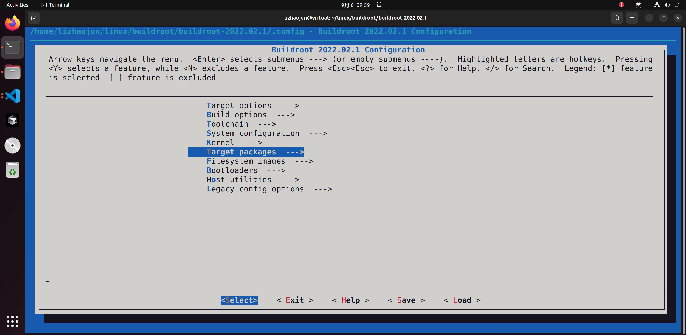
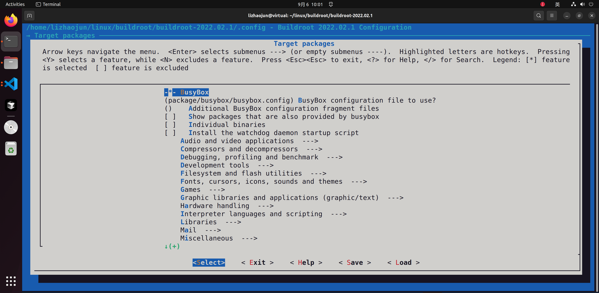

# 第5章_文件系统构建与定制

好的👌，那我来写 **5.1 引言**，作为第五部分《文件系统构建与定制》的开篇。

------

## 5.1_引言

------

### 5.1.1_为什么需要文件系统

在嵌入式 Linux 系统中，**文件系统（root filesystem, rootfs）** 是操作系统真正进入用户空间后所依赖的核心组成部分。它不仅是应用程序存放的地方，还承担了如下作用：

- **承载用户态环境**：提供 `/bin`, `/sbin`, `/usr`, `/etc` 等目录，存放可执行程序、配置文件和脚本。
- **提供库与接口**：C 库、动态链接器以及系统工具都依赖 rootfs 才能正常工作。
- **支撑启动流程**：Linux 内核完成初始化后，会挂载 rootfs，并调用 `/sbin/init` 或替代进程来进入用户空间。
- **提供运行时功能**：日志记录、shell、网络配置、设备管理等全部依赖 rootfs 提供的工具与脚本。

如果说 **内核决定了系统能否运行**，那么 **rootfs 决定了系统能做什么**。

------

### 5.1.2_根文件系统在嵌入式_Linux_中的角色

在 PC 上，我们习惯通过发行版（Ubuntu、Debian、Arch 等）获得一个完整的文件系统，里面有成千上万个软件包，足以满足桌面应用需求。

但在嵌入式设备中：

- 存储空间有限（几 MB ~ 几百 MB），无法承载冗余文件。
- 功能高度定制（如路由器、网关、工业控制器），只需要最小化的工具链和少量特定应用。
- 启动速度要求高，rootfs 需要紧凑高效。

因此，嵌入式 Linux 的 rootfs **必须精简裁剪，并且针对具体产品场景定制**。

------

### 5.1.3_Buildroot_文件系统构建的意义

Buildroot 提供了从源码到 rootfs 的一整套自动化机制，避免了开发者手动去拼装和维护 rootfs 的繁琐工作。它的设计思路是：

1. **目标目录构建**
   - 所有软件包（BusyBox、库、工具）先被安装到一个 staging 区域，然后同步到目标目录 `output/target/`。
2. **fakeroot 权限模拟**
   - 在宿主机无法直接以 root 身份操作时，通过 fakeroot 模拟 root 权限，确保最终镜像中 `/etc`, `/dev`, `/bin` 等目录权限正确。
3. **镜像生成**
   - 根据配置，生成 ext4、tarball、cpio、squashfs 等不同类型的文件系统镜像，适配 NAND/NOR、SD 卡、initramfs 等不同存储介质。
4. **定制与扩展**
   - 用户可以通过 overlay、post-build、post-image 脚本向 rootfs 添加自己的应用、配置文件和脚本，形成一个真正的产品环境。

------

### 5.1.4_与内核和_U-Boot_的关系

- **U-Boot**：负责加载内核和文件系统镜像（通过 SD 卡、eMMC、NAND Flash、TFTP 等方式）。
- **Linux 内核**：完成硬件初始化后，挂载 rootfs。
- **rootfs**：提供 `/sbin/init`，进入用户空间，加载守护进程和应用程序。

三者之间的关系，可以用一个启动流程来表示：

```
U-Boot → Linux Kernel → rootfs (/sbin/init → 用户空间)
```

如果 rootfs 缺失 `/sbin/init`，即使内核正常启动，也会卡在启动阶段，显示：

```
Kernel panic - not syncing: No init found
```

------

### 5.1.5_小结

- 文件系统是嵌入式 Linux 中承载用户空间的核心。
- 与通用 PC 发行版不同，嵌入式 rootfs 必须裁剪和定制。
- Buildroot 自动化了 rootfs 的构建过程，包括目标目录、fakeroot 权限模拟、镜像生成和定制扩展。
- 在启动链路中，rootfs 是内核进入用户空间后的第一站，缺一不可。

------

要不要我接下来继续写 **5.2 文件系统类型**？

好的👌，那我来写 **5.2 文件系统类型**。这一节会对常见的嵌入式 Linux 文件系统做全面介绍，结合它们在 Buildroot 中的使用场景。

------

## 5.2_文件系统类型

------

### 5.2.1_引言

嵌入式 Linux 的根文件系统（rootfs）并不是固定格式的，它可以根据存储介质和应用场景的不同，采用不同的文件系统类型。Buildroot 的优势之一，就是能自动帮用户生成多种 rootfs 镜像。

不同的文件系统在 **可写性、可靠性、压缩率、启动速度** 上各有特点，因此需要根据产品的需求来选择。

------

### 5.2.2_Ext2/Ext3/Ext4

- **特点**
  - 最常见的通用文件系统，和 PC Linux 使用的相同。
  - ext2 无日志；ext3/ext4 带日志功能，防止掉电损坏。
  - ext4 支持大文件和更强的校验功能。
- **优点**
  - 功能齐全，兼容性强。
  - 工具链丰富（如 `e2fsprogs`）。
  - 适合 eMMC、SD 卡等块设备。
- **缺点**
  - 占用空间较大。
  - 日志机制会增加写放大，不适合频繁写入的 Flash。
- **适用场景**
  - 开发板（SD 卡启动）。
  - eMMC 存储的智能设备。

------

### 5.2.3_SquashFS

- **特点**
  - 只读压缩文件系统。
  - 常与 UBIFS/JFFS2 或 OverlayFS 结合，用来提供可写分区。
- **优点**
  - 压缩率高，节省 Flash 空间。
  - 只读，防止掉电写损坏。
- **缺点**
  - 不能直接写入。
  - 更新必须整体替换镜像。
- **适用场景**
  - 路由器固件（如 OpenWrt）。
  - 工控设备需要“固化”的系统。

------

### 5.2.4_Initramfs_(cpio)

- **特点**
  - 内核直接加载到内存的临时文件系统。
  - 通过 `initramfs.cpio.gz` 打包，启动时解压到内存。
- **优点**
  - 启动速度快。
  - 无需块设备支持。
  - 适合小体积系统。
- **缺点**
  - 占用 RAM。
  - 更新需整体替换。
- **适用场景**
  - 开发阶段的快速实验。
  - 无持久存储的设备。

------

### 5.2.5_UBIFS_与_JFFS2

- **特点**
  - 专为原始 NAND Flash 设计。
  - JFFS2 较老，UBIFS 是更现代的替代。
  - 具备写均衡、掉电保护机制。
- **优点**
  - 针对 Flash 的可靠性优化。
  - 支持断电恢复。
- **缺点**
  - 构建工具复杂（需 `mkfs.jffs2`, `mkfs.ubifs`）。
  - 不适合块设备（如 SD 卡、eMMC）。
- **适用场景**
  - 工业控制器、网关，直接使用 NAND Flash 启动。

------

### 5.2.6_OverlayFS

- **特点**
  - Linux 内核特性，不是独立文件系统。
  - 通过“下层只读 + 上层可写”组合，形成一个统一视图。
- **优点**
  - 在只读文件系统上添加可写层。
  - 常用于 SquashFS + OverlayFS，既节省空间，又支持写操作。
- **缺点**
  - 需要内核支持。
  - 可写层丢失会影响系统。
- **适用场景**
  - 路由器、车机系统。
  - 固件更新机制。

------

### 5.2.7_文件系统类型对比表

| 类型      | 可写性 | 压缩     | 可靠性 | 存储介质 | 常见用途               |
| --------- | ------ | -------- | ------ | -------- | ---------------------- |
| Ext2      | ✔️      | ❌        | 中等   | 块设备   | SD 卡 / eMMC           |
| Ext3/Ext4 | ✔️      | ❌        | 高     | 块设备   | 工控设备、网关         |
| SquashFS  | ❌      | ✔️        | 高     | Flash    | 路由器固件             |
| Initramfs | ❌      | 可选     | 高     | RAM      | 开发实验、无存储设备   |
| JFFS2     | ✔️      | 部分     | 高     | NAND     | 工控设备               |
| UBIFS     | ✔️      | ✔️        | 高     | NAND     | 工业级产品             |
| OverlayFS | ✔️      | 依赖下层 | 中等   | 内核支持 | 只读 rootfs 叠加可写层 |

------

### 5.2.8_小结

- 不同的文件系统适合不同场景：
  - **块设备 → ext4**
  - **NAND → UBIFS**
  - **只读固件 → SquashFS + OverlayFS**
  - **小系统 → Initramfs**
- Buildroot 的强大之处在于：你只需在 `menuconfig` 中选择目标文件系统，Buildroot 就会自动完成对应镜像的生成。

------

要不要我接下来继续写 **5.3 Buildroot 文件系统构建流程**？

好的👌，那我来写 **5.3 Buildroot 文件系统构建流程**。这一节会从 Buildroot 的工作原理出发，详细解释 rootfs 是如何一步步被拼装出来的。

------

## 5.3_Buildroot_文件系统构建流程

------

### 5.3.1_引言

在前一节，我们介绍了不同类型的文件系统（ext4、squashfs、ubifs 等）。
 那么 Buildroot 是如何把一个个软件包、库文件和配置文件组织起来，最终生成一个完整的 rootfs 镜像呢？

这一节我们从 **目标目录 (output/target)**、**fakeroot 机制**、**镜像生成** 和 **脚本扩展** 四个环节进行拆解。

------

### 5.3.2_目标目录(output/target)

在编译过程中，Buildroot 会把所有软件包（如 BusyBox、库文件、应用程序）安装到一个临时目录：

```
buildroot/output/target/
```

这里的目录结构就是 rootfs 的雏形，例如：

```
target/
├── bin/
├── etc/
├── lib/
├── sbin/
├── usr/
│   ├── bin/
│   ├── lib/
│   └── sbin/
└── var/
```

- **软件包安装**：每个包的 `Makefile` 都会定义安装规则，把可执行文件、库和头文件放到 `target/`。
- **C 库安装**：glibc、musl 或 uClibc-ng 的库文件也会被放在这里，保证基本运行环境。
- **配置文件生成**：Buildroot 会在 `etc/` 下生成 `inittab`, `hostname`, `issue` 等系统配置。

------

### 5.3.3_fakeroot_机制与权限模拟

宿主机上编译时，开发者往往没有 root 权限。但 rootfs 镜像中必须包含 root 用户的权限设置、设备节点（/dev/tty 等）。

为了解决这个矛盾，Buildroot 使用 **fakeroot** 来模拟 root 权限：

- fakeroot 会拦截文件操作，伪装出“root 用户在操作”的效果；
- 这样即便在普通用户下构建，也能生成 root 拥有的文件、设备节点。

举例：

```bash
crw------- 1 root root 4, 64 /dev/ttyS0
```

即便宿主机用户不是 root，也能在 rootfs 镜像中生成这个设备节点。

------

### 5.3.4_生成映像

在目标目录准备完成后，Buildroot 会根据配置生成最终镜像。

常见步骤：

1. **复制目标目录**

   - `rsync` 将 `output/target` 内容复制到临时目录。

2. **执行 fakeroot 脚本**

   - 在临时目录里创建设备节点、修正权限。

3. **调用 mkfs 工具**

   - 生成指定格式的文件系统镜像：
     - `mkfs.ext4` → rootfs.ext4
     - `mkfs.jffs2` → rootfs.jffs2
     - `mkfs.ubifs` → rootfs.ubifs
     - `cpio` → initramfs.cpio.gz

4. **保存到 output/images/**

   - 所有最终产物都会放在：

     ```
     buildroot/output/images/
     ```

例如：

```
images/
├── rootfs.ext4
├── rootfs.tar
├── rootfs.cpio.gz
└── sdcard.img
```

------

### 5.3.5_post-build_与_post-image_脚本

为了方便用户定制，Buildroot 提供了两个关键扩展点：

- **post-build.sh**（不是每款芯片都有）
  - 在目标目录 `output/target` 完成后执行。
  - 可用于复制额外文件、修改配置。
  - 例如：添加自定义 `/etc/banner`。
- **post-image.sh**（基本每款芯片都有，shell脚本：主要是合成镜像）
  - 在镜像生成后执行。
  - 可用于额外处理镜像，比如生成完整的 SD 卡镜像，或者签名。

这种机制让开发者无需改动 Buildroot 核心代码，就能灵活定制 rootfs。

------

### 5.3.6_rootfs_构建流程总结图

```
软件包编译 → 安装到 target/
        → fakeroot 模拟 root 权限
        → mkfs 工具生成文件系统镜像
        → images/ 输出最终 rootfs
```

------

### 5.3.7_自检方法

在 rootfs 生成后，可以手动检查：

- 挂载 rootfs：

  ```bash
  sudo mount -o loop output/images/rootfs.ext4 /mnt
  ls /mnt
  ```

- 确认关键文件是否存在：

  - `/sbin/init`
  - `/etc/inittab`
  - `/bin/busybox`

------

### 5.3.8_小结

- Buildroot 的 rootfs 构建过程分为 **目标目录 → fakeroot → mkfs → 镜像输出**。
- 用户可以在 **post-build** 和 **post-image** 阶段进行定制。
- 最终的 rootfs 镜像存放在 `output/images/`，可以直接烧写到目标设备。

------

要不要我接下来继续写 **5.4 文件系统裁剪**？

好的👌，那我来写 **5.4 文件系统裁剪**。这一节主要解决的问题是：在嵌入式环境里，如何让 rootfs 足够小，同时又保留必要的功能。

------

## 5.4_文件系统裁剪

------

### 5.4.1_引言

嵌入式系统和桌面 Linux 的最大差异之一在于 **资源限制**：

- 存储容量有限（Flash 可能只有几 MB ~ 几十 MB）；
- 启动速度要求高（越小越快）；
- 有些设备甚至没有持久化存储，只能运行在 RAM 上。

因此，文件系统必须 **裁剪精简**，避免把 PC 上常见的大量冗余文件带入嵌入式产品。

------

### 5.4.2_BusyBox_精简配置

在 Buildroot 默认配置中，BusyBox 通常作为核心用户空间工具集。

- BusyBox 把 `ls`, `cp`, `sh`, `ps`, `ifconfig` 等常用命令整合成一个二进制。

- 可以通过 Buildroot 的 `menuconfig` → **Target packages → BusyBox** 来配置。

  

  


常见优化：

- 去掉不必要的工具（例如 `telnetd`, `httpd` 如果不需要，就关闭）。
- 保留基本调试工具（`vi`, `dmesg`, `ping`）。
- 关闭大部分 shell 特性，只保留最基本的 `ash`。

这种裁剪方式可以把 BusyBox 控制在 **几百 KB** 大小。

------

### 5.4.3_删除文档与开发文件

Buildroot 默认会在 rootfs 中去掉不必要的开发相关文件：

- `/usr/include/`
- `/usr/lib/pkgconfig/`
- `/usr/share/aclocal/`
- `/usr/share/doc/`
- `/usr/share/man/`

这些文件对于运行环境毫无必要，只在开发和编译阶段用到。删除后可以节省数 MB 的空间。

------

### 5.4.4_剥离调试符号

可执行文件和库在编译时通常会带有调试符号（.debug 段）。在产品环境中，调试符号是不需要的。

Buildroot 提供了配置选项：

- `BR2_STRIP_level`
  - **none**：不剥离符号
  - **debug**：只保留最少的符号
  - **all**：去掉所有符号

通常选择 `all`，可以显著减少 rootfs 体积。

例如：

- 带符号的 `libc.so.6` 可能有 **2 MB**；
- 剥离后可以缩小到 **几百 KB**。

------

### 5.4.5_Locale_与国际化精简

glibc 默认会生成大量语言环境（locale），例如：

- `en_US.UTF-8`
- `zh_CN.UTF-8`
- `fr_FR.UTF-8`

这些文件可能占据 **几十 MB**。

Buildroot 提供了：

- `BR2_ENABLE_LOCALE_PURGE`：启用 locale 清理。
- `BR2_GENERATE_LOCALE`：只生成所需的 locale（如 `en_US.UTF-8`）。

通过合理配置，可以把 locale 从几十 MB 压缩到几百 KB。

------

### 5.4.6_静态_vs_动态链接

在某些场景（如极小型 rootfs），可以考虑 **静态链接**：

- 所有库直接打包到可执行文件中。
- 不需要单独的 `lib/`。
- 适合小于 8 MB 的固件。

缺点：

- 更新某个库时，所有可执行文件都要重新编译。
- 灵活性较差。

因此，除非对空间极端敏感，一般仍推荐动态链接。

------

### 5.4.7_只读根文件系统

如果 rootfs 完全是只读的（如 squashfs），可以避免掉电写损坏，同时减少冗余写入操作。
 这种方式下，rootfs 更加精简，所有写操作都交由 OverlayFS 或 tmpfs 处理。

------

### 5.4.8_文件系统裁剪技巧表

| 技术手段        | 节省空间效果           | 适用场景      |
| --------------- | ---------------------- | ------------- |
| BusyBox 精简    | 数 MB                  | 基础工具集    |
| 删除文档/头文件 | 数 MB ~ 数十 MB        | 开发文件无用  |
| 剥离符号        | 30% ~ 50%              | 产品固件      |
| Locale 精简     | 数十 MB                | 国际化裁剪    |
| 静态链接        | 依应用而定             | 极小系统      |
| 只读 rootfs     | 不直接减小，但避免损坏 | 工业/路由固件 |

------

### 5.4.9_小结

- 文件系统裁剪的核心思想是：**只保留运行所需的最小集合**。
- 主要优化点包括 BusyBox、符号剥离、locale、开发文件删除。
- 对于工业和消费类产品，**ext4（精简版）+ BusyBox + 剥离符号 + 精简 locale** 是最常见组合。

------

要不要我接下来继续写 **5.5 文件系统定制**？

好的👌，那我来写 **5.5 文件系统定制**。这一节会详细说明如何在 Buildroot 中加入自定义文件、脚本和配置，从而把 rootfs 变成真正的产品环境。

------

## 5.5_文件系统定制

------

### 5.5.1_引言

Buildroot 默认生成的 rootfs 只是一个最小化系统（BusyBox + 基本库 + 简单配置）。
 在真实的产品中，我们往往需要：

- 添加自定义应用（守护进程、服务程序）。
- 加入配置文件（网络、启动参数、banner）。
- 定制系统启动流程（修改 `inittab`，增加 init 脚本）。

Buildroot 提供了多种机制来实现这些需求，而无需修改它的核心源码。

------

### 5.5.2_Overlay_机制(BR2_ROOTFS_OVERLAY)

Overlay 是最常用的定制方法。

- **原理**：

  - 在宿主机上准备一个目录，例如 `board/myboard/rootfs-overlay/`；

  - 里面的结构和 rootfs 一样，比如：

    ```
    rootfs-overlay/
    ├── etc/
    │   ├── inittab
    │   └── network/interfaces
    ├── usr/
    │   └── bin/myscript.sh
    └── lib/
        └── firmware/
    ```

  - 在 Buildroot 配置中设置：

    ```
    BR2_ROOTFS_OVERLAY="board/myboard/rootfs-overlay"
    ```

  - Buildroot 在生成 rootfs 时会自动把这个目录的内容复制进去。

- **应用场景**：

  - 添加自定义启动脚本。
  - 修改默认配置文件。
  - 增加固件文件。

------

### 5.5.3_Rootfs_Skeleton

Rootfs skeleton 是 rootfs 的最小框架，提供 `/bin`, `/etc`, `/lib`, `/usr` 等基础目录。

- Buildroot 默认提供了一个 skeleton。
- 用户可以通过 `BR2_ROOTFS_SKELETON_CUSTOM` 指定自己的 skeleton，用于完全替代默认布局。
- **适用场景**：
  - 对 rootfs 的结构有严格控制的项目（如车机系统、工业系统）。

------

### 5.5.4_Post-build_脚本

Post-build 脚本在 **目标目录 (output/target)** 完成后执行，允许对 rootfs 做额外修改。

- 示例：`board/myboard/post-build.sh`

  ```bash
  #!/bin/sh
  echo "Customizing rootfs..."
  # 添加自定义 banner
  echo "Welcome to MyDevice" > $TARGET_DIR/etc/issue
  # 增加内核模块配置
  echo "mydriver" >> $TARGET_DIR/etc/modules
  ```

- 配置方法：

  ```
  BR2_ROOTFS_POST_BUILD_SCRIPT="board/myboard/post-build.sh"
  ```

- **适用场景**：

  - 动态修改配置文件。
  - 自动添加版本号、编译日期。
  - 打包额外二进制。

------

### 5.5.5_Post-image_脚本

Post-image 脚本在 **镜像生成后** 执行，适合对最终产物进行处理。

- 示例：`board/myboard/post-image.sh`

  ```bash
  #!/bin/sh
  echo "Creating SD card image..."
  dd if=/dev/zero of=$BINARIES_DIR/sdcard.img bs=1M count=256
  parted $BINARIES_DIR/sdcard.img mklabel msdos
  parted $BINARIES_DIR/sdcard.img mkpart primary fat32 1MiB 64MiB
  parted $BINARIES_DIR/sdcard.img mkpart primary ext4 64MiB 100%
  ```

- 配置方法：

  ```
  BR2_ROOTFS_POST_IMAGE_SCRIPT="board/myboard/post-image.sh"
  ```

- **适用场景**：

  - 自动生成完整的 SD 卡映像。
  - 对文件系统进行签名。
  - 生成差分包。

------

### 5.5.6_系统初始化定制

嵌入式设备启动进入 rootfs 后，通常需要运行 `/sbin/init`。
 Buildroot 提供了多种初始化方式：

- **BusyBox init**（默认）
  - 使用 `/etc/inittab` 定义启动流程。
  - 用户可以修改 overlay 中的 `inittab` 来控制启动项。
- **SystemV init / systemd**
  - 可以选择更复杂的 init 系统（需在 Buildroot 配置启用）。
- **自定义 init**
  - 在 rootfs overlay 中放置一个 `/init` 脚本，覆盖默认行为。

------

### 5.5.7_文件系统定制方法对比表

| 方法       | 阶段          | 优点                 | 缺点                      | 典型用途               |
| ---------- | ------------- | -------------------- | ------------------------- | ---------------------- |
| Overlay    | rootfs 构建   | 简单直观，直接复制   | 不适合大规模逻辑          | 添加脚本、配置文件     |
| Skeleton   | rootfs 初始化 | 完全控制 rootfs 结构 | 改动大                    | 高度定制项目           |
| Post-build | rootfs 完成后 | 可写逻辑脚本         | 操作 target/ 目录，需小心 | 自动添加文件、修改配置 |
| Post-image | 镜像生成后    | 控制最终镜像格式     | 无法修改 rootfs 本身      | 生成 SD 卡映像、签名   |

------

### 5.5.8_小结

- Buildroot 提供了 **overlay → skeleton → post-build → post-image** 四个层次的定制机制。
- 一般项目推荐 **overlay + post-build**，足以覆盖 80% 的定制需求。
- 对于产品级项目，可结合 **post-image** 做固件打包，保证量产时的交付格式。

------

要不要我接下来继续写 **5.6 文件系统与包管理**？

好的👌，那我来写 **5.6 文件系统与包管理**。这一节会聚焦于：为什么 Buildroot 不像 Ubuntu/Debian 那样提供包管理器，而是采用“全量重建”的策略，以及在需要时有哪些替代方案。

------

## 5.6_文件系统与包管理

------

### 5.6.1_引言

在桌面或服务器 Linux 系统中，我们习惯通过 **包管理器** 来安装软件：

- Debian/Ubuntu → `apt`
- Fedora/RedHat → `dnf`/`yum`
- ArchLinux → `pacman`

这些系统的文件系统往往庞大，依赖丰富，动态更新频繁。

但在嵌入式 Linux 中，Buildroot 的设计哲学完全不同：它 **不提供运行时的包管理机制**，而是依赖 **构建时的全量生成**。

------

### 5.6.2_为什么_Buildroot_不提供包管理

#### (1)_简化设计

- Buildroot 的目标是 **一键生成完整 rootfs**，而不是维护一个长期可更新的发行版。
- 这样可以减少复杂度，避免依赖地狱。

#### (2)_面向产品交付

- 在嵌入式环境中，产品往往以固件形式整体升级。
- 这意味着运行时更新单个软件包的需求较少。

#### (3)_空间限制

- 包管理器自身（dpkg、rpm 等）体积不小，还需要维护元数据数据库。
- 在 Flash 空间有限的设备上，这是一种浪费。

#### (4)_一致性需求

- 全量构建保证了 rootfs 在所有机器上完全一致，避免“某台机器更新了不同版本的库”的问题。

------

### 5.6.3_Buildroot_的替代方案

虽然 Buildroot 不支持运行时包管理，但它提供了灵活的构建机制，足以应对大多数需求：

#### (1)_重新构建_rootfs

- 修改 `defconfig` 或 `menuconfig`，重新运行 `make`。
- Buildroot 会自动重新打包生成完整 rootfs。
- 适合产品固件升级。

#### (2)_使用_Overlay/自定义包

- 可以在 overlay 中直接加入新应用和库。
- 通过 post-build 脚本实现简单的“增量更新”。

#### (3)_使用外部分发工具

- 有些项目在 Buildroot 之上引入轻量级包管理，例如：
  - `opkg`（OpenWrt 使用）
  - `dpkg`（Debian 核心）
  - `rpm`（RedHat 系列）

这些方式在 Buildroot 中不是默认支持的，但可以通过包系统移植实现。

------

### 5.6.4_与_Yocto_的对比

- **Yocto**
  - 提供了完整的包管理生态（opkg/dpkg/rpm）。
  - 支持运行时安装/卸载/升级软件包。
  - 适合大型、长期维护的发行版级项目。
- **Buildroot**
  - 不提供包管理器。
  - 强调“全量构建、固件升级”。
  - 更适合中小型产品或资源受限的系统。

------

### 5.6.5_应用场景分析

| 场景                      | 推荐方案                                                     |
| ------------------------- | ------------------------------------------------------------ |
| 小型设备，Flash < 32MB    | 直接使用 Buildroot 全量构建，更新时替换整个固件              |
| 工业控制器，需要 OTA 升级 | 使用 Buildroot + Overlay，更新时替换部分配置或二进制         |
| 大型系统，需要长期维护    | 考虑使用 Yocto，支持包管理和滚动升级                         |
| 路由器、网关              | 使用 SquashFS + OverlayFS 组合，升级时替换只读固件，保留用户配置 |

------

### 5.6.6_总结表

| 特性     | Buildroot     | Yocto                |
| -------- | ------------- | -------------------- |
| 构建模式 | 全量构建      | 包管理 + 构建        |
| 包管理器 | ❌ 无          | ✔️ dpkg/rpm/opkg      |
| 学习曲线 | 低            | 高                   |
| 适用系统 | 小型/中型产品 | 大型发行版、长期支持 |
| 更新方式 | 固件整体替换  | 支持单包升级         |

------

### 5.6.7_小结

- Buildroot **不提供运行时包管理**，这是设计哲学的体现。
- 它强调 **一次构建 → 固件打包 → 整体部署**，保证一致性与简洁性。
- 在需要运行时包管理的场景，应考虑 **Yocto** 或在 Buildroot 上额外移植 `opkg/dpkg`。

------

要不要我接下来继续写 **5.7 文件系统调试与验证**？

好的👌，那我来写 **5.7 文件系统调试与验证**。这一节会讲解如何在 rootfs 生成之后进行检查和调试，确保最终系统能够在目标板上正常运行。

------

## 5.7_文件系统调试与验证

------

### 5.7.1_引言

在 Buildroot 构建完成后，我们得到的 rootfs 镜像通常有多种格式（`ext4`、`tar`、`cpio` 等）。
 然而，生成成功并不代表它一定能在目标板或仿真环境下运行。
 因此，**对 rootfs 的调试与验证** 是必不可少的一步。

------

### 5.7.2_挂载_rootfs_映像

在宿主机上，可以直接挂载 rootfs 来检查其内容。

- 挂载 ext4 rootfs：

  ```bash
  mkdir /mnt/rootfs
  sudo mount -o loop output/images/rootfs.ext4 /mnt/rootfs
  ls /mnt/rootfs
  ```

- 检查是否包含核心目录：

  ```
  /bin
  /sbin
  /etc
  /lib
  /usr
  ```

- 确认是否有 `/sbin/init`，否则系统启动会直接 panic。

------

### 5.7.3_使用_QEMU_测试

在没有目标板的情况下，可以用 QEMU 启动内核 + rootfs：

```bash
qemu-system-arm -M vexpress-a9 \
  -kernel output/images/zImage \
  -dtb output/images/vexpress-v2p-ca9.dtb \
  -drive file=output/images/rootfs.ext4,if=sd,format=raw \
  -append "root=/dev/mmcblk0 rw console=ttyAMA0"
```

- 如果系统能进入 BusyBox shell，说明 rootfs 工作正常。
- 如果提示 `Kernel panic - not syncing: No init found`，说明 rootfs 内缺少 `/sbin/init` 或 init 链接配置错误。

------

### 5.7.4_使用_ldd_检查动态库依赖

在宿主机交叉工具链环境下，可以检查目标程序是否正确链接库：

```bash
arm-linux-gnueabihf-ldd output/target/bin/busybox
```

- 输出应指向 `output/target/lib/` 或 `output/target/usr/lib/` 中的库。
- 如果指向 `/usr/lib/x86_64-linux-gnu/`，说明出现了 **宿主机污染**。

------

### 5.7.5_使用_strace_调试运行时行为

在目标板上，可以用 `strace` 跟踪进程：

```bash
strace /bin/ls
```

- 确认系统调用是否正常工作。
- 如果报 `ENOSYS`，说明使用了目标内核不支持的系统调用。

------

### 5.7.6_验证启动脚本与配置

重点检查以下文件：

- `/etc/inittab`
  - 定义系统启动流程，是否正确启动 shell。
- `/etc/issue`
  - 启动欢迎信息。
- `/etc/network/interfaces`
  - 网络配置是否合理。

若启动后串口无输出，常见原因是 `inittab` 未正确配置串口终端。

------

### 5.7.7_文件系统完整性检查

对镜像运行 `fsck`：

```bash
fsck.ext4 output/images/rootfs.ext4
```

- 如果提示错误，说明在生成或烧录过程中有问题。
- 对于 NAND/UBI 文件系统，可以使用 `ubinize`、`ubinfo` 等工具进行检查。

------

### 5.7.8_常见问题与排查

| 问题                  | 可能原因                           | 解决办法                                                |
| --------------------- | ---------------------------------- | ------------------------------------------------------- |
| `No init found`       | 缺少 `/sbin/init` 或 init 链接错误 | 确认 BusyBox 提供 `init` 并建立符号链接                 |
| `Illegal instruction` | 工具链与目标 CPU 不匹配            | 检查编译器 `-march` / `-mcpu` 选项                      |
| `GLIBC_xxx not found` | C 库版本与 rootfs 不一致           | 确认 Buildroot 工具链与 rootfs 一致                     |
| 网络不工作            | `/etc/network/interfaces` 配置错误 | 修改 overlay 或 post-build 添加正确配置                 |
| 启动卡住              | `inittab` 缺少终端配置             | 添加 `ttyS0::respawn:/sbin/getty -L ttyS0 115200 vt100` |

------

### 5.7.9_小结

- rootfs 验证需要从 **镜像内容 → 仿真启动 → 目标运行** 多层次进行。
- `mount`、`ldd`、`strace`、`fsck` 是常用的验证工具。
- 重点检查 `/sbin/init`、`/etc/inittab`、库依赖和串口配置。
- 在 Buildroot 项目中，建议把这些检查步骤纳入 CI/CD，以避免反复手动排查。

------

要不要我接下来继续写 **5.8 小结**，总结整个第五部分（文件系统构建与定制）？

好的👌，那我来写 **5.8 小结**，作为第五部分《文件系统构建与定制》的收尾。

------

## 5.8_小结

------

### 5.8.1_文件系统的核心地位

在嵌入式 Linux 中，**内核决定系统能否运行，而文件系统决定系统能做什么**。
 根文件系统（rootfs）承载了用户空间的全部功能：可执行程序、库文件、配置脚本、初始化流程。
 因此，一个产品级嵌入式系统的成败，很大程度上取决于文件系统是否 **合理裁剪、定制和验证**。

------

### 5.8.2_本章内容回顾

1. **引言 (5.1)**
   - 文件系统在嵌入式系统中的角色。
   - Buildroot 提供了从源码到 rootfs 的自动化机制。
2. **文件系统类型 (5.2)**
   - ext4：适合块设备（SD 卡、eMMC）。
   - squashfs/overlayfs：只读固件与可写层组合，常见于路由器。
   - jffs2/ubifs：原始 NAND Flash 的最佳选择。
   - initramfs：适合小系统和快速启动场景。
3. **构建流程 (5.3)**
   - 软件包安装到 `output/target/`。
   - fakeroot 模拟 root 权限，生成设备节点。
   - `mkfs` 工具生成文件系统镜像，存放于 `output/images/`。
   - post-build / post-image 脚本支持扩展。
4. **文件系统裁剪 (5.4)**
   - BusyBox 精简。
   - 删除开发文件（include、man、doc）。
   - 剥离调试符号，精简 locale。
   - 只读 rootfs 与静态链接策略。
5. **文件系统定制 (5.5)**
   - overlay：最常用的自定义机制。
   - skeleton：完全控制 rootfs 结构。
   - post-build / post-image 脚本：灵活定制和镜像处理。
   - init 系统定制（inittab、systemd、自定义 init）。
6. **文件系统与包管理 (5.6)**
   - Buildroot 不提供运行时包管理器。
   - 采用“全量重建 → 固件整体更新”的模式。
   - 对比 Yocto：前者轻量快速，后者支持长期维护和包管理。
7. **文件系统调试与验证 (5.7)**
   - 挂载 rootfs，检查内容与目录结构。
   - 使用 QEMU 测试启动。
   - `ldd` 检查库依赖，`strace` 跟踪系统调用。
   - 检查 `/sbin/init`、`inittab`、网络配置等关键点。

------

### 5.8.3_设计哲学总结

- **Buildroot 的定位**：
  - 不是一个发行版，而是一个 **固件构建工具**。
  - 目标是快速、可重现地生成一个完整 rootfs。
- **定制原则**：
  - “最小化 + 针对性” → 只保留需要的功能。
  - “整体替换” → 不追求运行时包管理，而是通过固件升级交付。
- **适用场景**：
  - 小型和中型嵌入式产品。
  - 存储受限的设备。
  - 启动速度要求较高的系统。

------

### 5.8.4_过渡到下一部分

文件系统完成后，我们已经拥有了一个能运行用户空间应用的环境。
 但这还不够，嵌入式产品通常需要进一步的 **包集成与系统服务管理**，包括：

- 如何在 Buildroot 中集成第三方库和应用；
- 如何写自定义软件包；
- 如何管理服务和启动顺序。

这些内容将在 **第六部分：包集成与系统服务** 中展开。

------

要不要我接下来继续写 **第六部分：包集成与系统服务 → 6.1 引言**？
