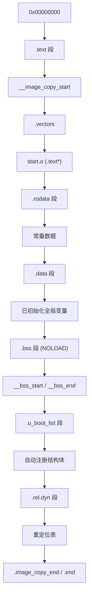

信息摘抄自ChatGPT.

# 第1章_链接脚本基础结构与核心语法

## 1.1_链接脚本的作用

**链接脚本（Linker Script）**用于控制链接器 `ld` 如何将各个目标文件中的**段（section）**映射到最终可执行文件的地址空间中。

## 1.2_一个典型的.lds_文件结构如下

```lds
ENTRY(_start)               /* 指定程序入口点 */

SECTIONS {
  . = 0x80000000;           /* 起始地址设置 */

  .text : {
    *(.text)                /* 所有目标文件的 .text 段 */
    *(.text.*)              /* 所有以 .text. 开头的段 */
  }

  .rodata : {
    *(.rodata*)
  }

  .data : {
    *(.data)
    *(.data.*)
  }

  .bss : {
    __bss_start = .;
    *(.bss)
    *(.bss.*)
    __bss_end = .;
  }

  /DISCARD/ : {
    *(.note*)
    *(.comment)
  }
}
```


## 1.3_基础语法说明

| 语法元素        | 功能说明                                                     |
| --------------- | ------------------------------------------------------------ |
| `ENTRY(_start)` | 指定程序入口（也就是 ELF 头的 e_entry 字段）                 |
| `SECTIONS {}`   | 必须的主结构，所有段映射配置都写在里面                       |
| `.`             | 当前地址指针，初始为起始地址，随输出段内容自动增加           |
| `*(.text)`      | 表示匹配所有目标文件中的 `.text` 段并写入当前段              |
| `*(.text.*)`    | 匹配所有以 `.text.` 开头的段，比如 `.text.startup`、`.text.reset` |
| `__符号名 = .;` | 创建一个全局符号，记录当前地址位置（常用于 BSS 起止）        |
| `/DISCARD/`     | 抛弃匹配到的段，不链接进最终镜像                             |


## 1.4_地址与段的基本规则

```C
. = 0x80000000;
.text : {
    *(.text)
}
```

等效于说：

- `.text` 段从地址 `0x80000000` 开始
- 所有输入目标文件的 `.text` 段内容顺序拼接到这里

地址指针 `.` 会自动递增，随着段内容增长。


## 1.5_典型变量用法

```lds
__bss_start = .;
*(.bss)
__bss_end = .;
```

这段代码：

- 在 `.bss` 段起始位置设置全局符号 `__bss_start`
- 放入所有 `.bss` 段数据
- 在结束后设置 `__bss_end`


用于启动时在 C 代码中清零 BSS 区域：

```lds
memset(__bss_start, 0, __bss_end - __bss_start);
```


## 1.6_常见段名及其含义

| 段名        | 功能                         |
| ----------- | ---------------------------- |
| `.text`     | 程序代码段（只读）           |
| `.rodata`   | 只读数据（字符串常量等）     |
| `.data`     | 已初始化的全局/静态变量      |
| `.bss`      | 未初始化的全局/静态变量      |
| `.stack`    | 栈区（不一定有）             |
| `.vectors`  | 异常向量表（在嵌入式系统中） |
| `/DISCARD/` | 丢弃段（注释、调试信息）     |

我们将在下一部分介绍：

- **段的合并和排列控制**
- **目标文件过滤：`KEEP()`、`SORT()`、`\*(filename.o)`**
- **内存块分布：`MEMORY {}` 块和段与内存的绑定**
- **如何分离 `.init`, `.ctors`, `.dtb`, `.stack`, `.heap` 等段**


# 第2章_段的排序_过滤_内存分配_KEEP_保留机制

## 2.1_段的排序与过滤_*(.text*)_KEEP()_SORT()

### 2.1.1_*(.text)_vs_*(.text*)

```lds
*(.text)      // 精确匹配 .text 段（不包括 .text.startup）
*(.text*)     // 通配符，匹配所有以 .text 开头的段（如 .text.startup）
```


### 2.1.2_KEEP()_的作用

链接器在默认优化模式下会 **丢弃未被引用的段**（尤其是 `.init`, `.ctors`, `.dtb` 等），而 `KEEP()` 可以防止其被优化掉：

```lds
KEEP(*(.init))
KEEP(*(.ctors))
KEEP(*(.dtb*))
```

**结论**：只要放在 `KEEP()` 中的段，哪怕没被 C/C++ 引用，也会强制保留在最终镜像中。


## 2.2_精确控制输入文件和段_*(filename.o)_和_(EXCLUDE_FILE)

你可以指定只从某个源文件抽取段：

```lds
*(main.o(.text))     // 只链接 main.o 中的 .text 段
```


也可以排除某些目标文件：

```lds
*(EXCLUDE_FILE(foo.o) .text)   // 排除 foo.o 的 .text 段
```

这在做裸机系统和启动代码精简时非常有用。


## 2.3_段内排序_SORT()

用于对段内容按文件名或地址排序，常见形式：

```lds
SORT(*)(.text*)           		// 对所有 .text* 段内容进行排序（默认按文件名）
SORT_BY_NAME(*)(.text*)   		// 同上
SORT_BY_ALIGNMENT(*)(.bss*)  	// 对齐方式排序（较少用）
```


## 2.4_MEMORY_{}_定义目标芯片的物理内存布局

`MEMORY` 块告诉链接器：目标系统有哪些内存区域，以及它们的起始地址和大小。


**示例：**

```lds
MEMORY {
  ROM (rx)  : ORIGIN = 0x00000000, LENGTH = 512K
  RAM (rwx) : ORIGIN = 0x80000000, LENGTH = 256K
}
```

| 字段         | 含义                        |
| ------------ | --------------------------- |
| `ROM`、`RAM` | 是标签（自定义名称）        |
| `(rx)`       | 表示可读+可执行（读写权限） |
| `ORIGIN`     | 起始地址                    |
| `LENGTH`     | 区域大小                    |


## 2.5_分段绑定内存区_使用_AT_和_>

### 2.5.1_将.text_放入_ROM

```lds
.text : {
    *(.text)
} >ROM
```

意味着：

- 段逻辑地址按 ROM 起始地址分配（例如 `. = ORIGIN(ROM)`）
- `.text` 的内容链接时会被放入 ROM 段区域


### 2.5.2_使用_AT_分离加载地址和运行地址

```lds
.text : {
    *(.text)
} > RAM AT > ROM
```


**含义：**

| 地址类型        | 地址来源                             |
| --------------- | ------------------------------------ |
| 运行地址（VMA） | 放在 RAM 区运行（`. = ORIGIN(RAM)`） |
| 加载地址（LMA） | 内容存放在 ROM 区，需要启动时 copy   |


这是嵌入式系统中非常常用的加载方式，例如：

- Bootloader 镜像位于 Flash（ROM），启动时拷贝至 RAM 后运行。
- VMA 是实际运行地址，LMA 是初始镜像位置。


## 2.6_创建堆栈段.stack

```lds
.stack : {
  __stack_start = .;
  . = . + 0x1000;
  __stack_end = .;
} >RAM
```

作用：

- 创建一个 4KB 的栈区段
- 并生成 `__stack_start`, `__stack_end` 符号供 C 程序使用

## 2.7_本节小结

| 技术点                    | 说明                           |
| ------------------------- | ------------------------------ |
| `KEEP()`                  | 强制保留段，防止被链接器优化掉 |
| `*(filename.o(.section))` | 精确控制输入段                 |
| `MEMORY {}`               | 定义物理内存空间               |
| `>MEM` / `AT>MEM`         | 指定运行地址与加载地址         |
| `SORT()`                  | 对段内容排序                   |
| `. = . + size`            | 控制段大小并生成地址符号       |


下一部分将讲：

- **如何定义并使用全局符号和地址变量（Symbol）**
- **链接器计算表达式（SIZEOF、ALIGN、BLOCK等）**
- **链接脚本中的条件判断（`IF`, `ASSERT`）**
- **目标文件与输入节之间的控制（`SECTIONS`, `INCLUDE`, `GROUP`, `FILL`）**


# 第3章_符号定义_地址计算_表达式与条件控制

## 3.1_自定义符号与地址计算

在链接脚本中你可以定义符号，就像在 C 语言中定义变量一样，用于：

- 记录地址位置
- 提供给 C/C++ 程序使用（用 `extern` 声明）


**示例：**

```lds
__text_start = .;
.text : {
    *(.text)
}
__text_end = .;
```

这表示：

- `__text_start`：记录 `.text` 段开始地址
- `__text_end`：记录 `.text` 段结束地址


在 C 代码中可以：

```lds
extern char __text_start[], __text_end[];
```

然后操作这些段，比如进行校验或复制。


## 3.2_计算段大小

通过表达式可以计算段大小：

```lds
__text_size = __text_end - __text_start;
```

C代码中也可以用这个值。


## 3.3_常用表达式运算符

| 表达式             | 说明                             |
| ------------------ | -------------------------------- |
| `.`                | 当前地址位置（location counter） |
| `=`                | 定义符号                         |
| `+`, `-`, `*`, `/` | 四则运算                         |
| `ALIGN(n)`         | 当前地址对齐到 `n` 字节边界      |
| `SIZEOF(.name)`    | 返回某个段的大小（单位：字节）   |
| `ADDR(.name)`      | 段在镜像中实际运行地址（VMA）    |
| `LOADADDR(.name)`  | 段在镜像中的加载地址（LMA）      |
| `BLOCK(n)`         | 取当前地址所在的 n 字节对齐块    |


**示例：手动对齐段地址**

```lds
. = ALIGN(4096);    /* 当前地址对齐到 4KB 边界 */
.rodata : {
    *(.rodata*)
}
```


**示例：获取某段大小**

```lds
__bss_size = SIZEOF(.bss);
```


## 3.4_条件判断_ASSERT_IF

链接脚本中可以执行判断条件，并在条件不满足时报错：

### 3.4.1_ASSERT_使用

```lds
ASSERT(__stack_end < 0x80010000, "Stack overflow limit exceeded!")
```

当表达式为 false（即失败）时，链接器会终止并提示错误信息。


### 3.4.2_IF_条件判断(不常用)

```lds
__heap_size = (__heap_end > __heap_start) ? (__heap_end - __heap_start) : 0;
```

注意：链接器只支持最基本的 C 风格三目运算或 `==`, `<`, `>` 比较，**不支持完整 if/else 块**。


## 3.5_片段填充_FILL(pattern)

用于给段中填充特定数据（初始化用）：

```lds
.text : {
    FILL(0xFF)
    *(.text)
}
```

这会使 `.text` 段中空隙部分填充 `0xFF` 而非默认的 `0x00`。


## 3.6_GROUP_与嵌套段控制

```lds
.my_section : {
    GROUP {
        *(.text*)
        *(.rodata*)
    }
}
```

可以把多个段合并打包为一个输出段（顺序连续），但这种语法在大项目中较少用，适用于 linker 脚本模块化设计。


## 3.7_本节小结

| 技术点   | 示例                    | 用途                   |
| -------- | ----------------------- | ---------------------- |
| 符号定义 | `__start = .;`          | 记录段的起始地址       |
| 表达式   | `SIZEOF(.bss)`          | 计算段大小             |
| 对齐     | `. = ALIGN(4096)`       | 控制段地址对齐         |
| 条件判断 | `ASSERT(x < y, "msg")`  | 编译时验证             |
| 加载地址 | `LOADADDR(.text)`       | 获取段的 LMA           |
| 填充     | `FILL(0xFF)`            | 控制段内容初始化       |
| 分组控制 | `GROUP { *(.x) *(.y) }` | 将多个段输出为一个区域 |


将在第 4 部分讲解：

- 链接器脚本与多个 `.lds` 片段的合并（如 `INCLUDE`）
- 输出节属性标志（`rx`, `rwx`, `noload`）
- 特殊段处理：`.ctors`, `.init_array`, `.fini_array`
- 链接脚本调试与符号表查看方法


# 第4章_语法示例

高级链接语法：段属性、KEEP、DISCARD、特殊构造段等。


**所用文件**

在 U-Boot 2022 中，核心链接脚本路径通常为：

```bas
arch/arm/cpu/u-boot.lds
```

但最终链接时会由顶层 `u-boot.lds` 通过 `INCLUDE` 引入。

以下示例内容参考了 U-Boot 2022.01 中 `arch/arm/cpu/u-boot.lds`，适用于大多数 ARM 平台。


## 4.1_INCLUDE_模块化使用

主链接脚本位于：

```ld
#include <asm-generic/u-boot.lds>
```

例如在 `arch/arm/cpu/u-boot.lds` 中：

```lds
SECTIONS
{
  . = 0x00000000;

  . = ALIGN(4);
  .text :
  {
    *(.__image_copy_start)
    KEEP(*(.__u_boot_list*))
    *(.text*)
  }

  # 其他段略
}
```

此处使用 `INCLUDE` 插入平台独立的 `u-boot.lds.h` 宏定义。


## 4.2_KEEP_示例_防止段被优化掉

来自 u-boot.lds：

```lds
KEEP(*(.__u_boot_list*))
```

这是保留 U-Boot 的 `.u_boot_list` 段（如设备树、命令表、驱动模型等信息），避免链接器优化掉未显式引用的符号。


## 4.3_DISCARD_示例_明确丢弃调试信息段

```lds
/DISCARD/ : {
    *(.note*)
    *(.comment)
    *(.gnu*)
}
```

这表示 `.note`、`.comment`、`.gnu.debug*` 等段都被丢弃，不会写入最终镜像，常用于减小体积。


## 4.4_构造器与数组段.ctors,.init_array,.fini_array

在 `arch/arm/cpu/u-boot.lds` 中：

```lds
.ctors : {
    KEEP(*(SORT(.ctors.*)))
    KEEP(*(.ctors))
}

.init_array : {
    KEEP(*(SORT(.init_array.*)))
    KEEP(*(.init_array))
}
.fini_array : {
    KEEP(*(SORT(.fini_array.*)))
    KEEP(*(.fini_array))
}
```

* 保证这些段被保留
* 用于支持 C++ 构造函数和析构函数调用（虽然 U-Boot 很少使用 C++，但某些扩展模块可能依赖）


## 4.5_MEMORY_和段属性控制

U-Boot 不是直接使用 `MEMORY {}`，而是通过 `.text`, `.data` 显式指定段位置：

```lds
.text : {
  *(.text*)
} > TEXT_BASE
```


其中 `TEXT_BASE` 通过 `CPPFLAGS` 定义，例如：

```lds
#define CONFIG_TEXT_BASE 0x4A000000
```

⚠️ U-Boot 使用 `TEXT_BASE` 作为链接基础地址，而不使用 `MEMORY {}` 机制。这是 U-Boot 的传统设计，使得 `.lds` 更紧凑。


## 4.6_BSS_段和_NOLOAD_的使用

```lds
.bss (NOLOAD) : {
    __bss_start = .;
    *(.bss*)
    __bss_end = .;
}
```

说明：

- `.bss` 段不写入镜像文件（因为启动代码负责清零）
- 保留 `__bss_start` / `__bss_end` 符号供启动代码使用


## 4.7_示例_C_代码中这样使用这些符号

```lds
extern char __bss_start[], __bss_end[];

memset(__bss_start, 0, __bss_end - __bss_start);
```


## 4.8_总结

| 关键词              | U-Boot 用法示例                                 |
| ------------------- | ----------------------------------------------- |
| `INCLUDE`           | 引入平台定义，如 `asm-generic/u-boot.lds.h`     |
| `KEEP`              | 保留 `.__u_boot_list*`、`.init_array`、`.ctors` |
| `DISCARD`           | 丢弃调试与注释段（`.note*`, `.gnu*`）           |
| `.bss (NOLOAD)`     | 不写入镜像，由启动代码初始化                    |
| `.text > TEXT_BASE` | 显式使用 `TEXT_BASE` 替代 `MEMORY {}` 映射      |


## 4.9_U-Boot_2022.10_u-boot.lds_详解(结合上文的链接语法)

u-boot 2022.10 `arch/arm/cpu/u-boot.lds`源码：

```lds
// 这是2022-10的uboot arch/arm/cpu/u-boot.lds源码
/* SPDX-License-Identifier: GPL-2.0+ */
/*
 * Copyright (c) 2004-2008 Texas Instruments
 *
 * (C) Copyright 2002
 * Gary Jennejohn, DENX Software Engineering, <garyj@denx.de>
 */

#include <config.h>
#include <asm/psci.h>

/************** ① *****************/
OUTPUT_FORMAT("elf32-littlearm", "elf32-littlearm", "elf32-littlearm")
OUTPUT_ARCH(arm)
ENTRY(_start)
SECTIONS
{
    /************** ② *****************/
#ifndef CONFIG_CMDLINE
	/DISCARD/ : { *(__u_boot_list_2_cmd_*) }
#endif
#if defined(CONFIG_ARMV7_SECURE_BASE) && defined(CONFIG_ARMV7_NONSEC)
	/*
	 * If CONFIG_ARMV7_SECURE_BASE is true, secure code will not
	 * bundle with u-boot, and code offsets are fixed. Secure zone
	 * only needs to be copied from the loading address to
	 * CONFIG_ARMV7_SECURE_BASE, which is the linking and running
	 * address for secure code.
	 *
	 * If CONFIG_ARMV7_SECURE_BASE is undefined, the secure zone will
	 * be included in u-boot address space, and some absolute address
	 * were used in secure code. The absolute addresses of the secure
	 * code also needs to be relocated along with the accompanying u-boot
	 * code.
	 *
	 * So DISCARD is only for CONFIG_ARMV7_SECURE_BASE.
	 */
	/DISCARD/ : { *(.rel._secure*) }
#endif
    /************** ③ *****************/
	. = 0x00000000;

	. = ALIGN(4);
	.text :
	{
		*(.__image_copy_start)
		*(.vectors)
		CPUDIR/start.o (.text*)
	}

	/* This needs to come before *(.text*) */
	.__efi_runtime_start : {
		*(.__efi_runtime_start)
	}

	.efi_runtime : {
		*(.text.efi_runtime*)
		*(.rodata.efi_runtime*)
		*(.data.efi_runtime*)
	}

	.__efi_runtime_stop : {
		*(.__efi_runtime_stop)
	}

	.text_rest :
	{
		*(.text*)
	}

#ifdef CONFIG_ARMV7_NONSEC

	/* Align the secure section only if we're going to use it in situ */
	.__secure_start
#ifndef CONFIG_ARMV7_SECURE_BASE
		ALIGN(CONSTANT(COMMONPAGESIZE))
#endif
	: {
		KEEP(*(.__secure_start))
	}

#ifndef CONFIG_ARMV7_SECURE_BASE
#define CONFIG_ARMV7_SECURE_BASE
#define __ARMV7_PSCI_STACK_IN_RAM
#endif

	.secure_text CONFIG_ARMV7_SECURE_BASE :
		AT(ADDR(.__secure_start) + SIZEOF(.__secure_start))
	{
		*(._secure.text)
	}

	.secure_data : AT(LOADADDR(.secure_text) + SIZEOF(.secure_text))
	{
		*(._secure.data)
	}

#ifdef CONFIG_ARMV7_PSCI
	.secure_stack ALIGN(ADDR(.secure_data) + SIZEOF(.secure_data),
			    CONSTANT(COMMONPAGESIZE)) (NOLOAD) :
#ifdef __ARMV7_PSCI_STACK_IN_RAM
		AT(ADDR(.secure_stack))
#else
		AT(LOADADDR(.secure_data) + SIZEOF(.secure_data))
#endif
	{
		KEEP(*(.__secure_stack_start))

		/* Skip addreses for stack */
		. = . + CONFIG_ARMV7_PSCI_NR_CPUS * ARM_PSCI_STACK_SIZE;

		/* Align end of stack section to page boundary */
		. = ALIGN(CONSTANT(COMMONPAGESIZE));

		KEEP(*(.__secure_stack_end))

#ifdef CONFIG_ARMV7_SECURE_MAX_SIZE
		/*
		 * We are not checking (__secure_end - __secure_start) here,
		 * as these are the load addresses, and do not include the
		 * stack section. Instead, use the end of the stack section
		 * and the start of the text section.
		 */
		ASSERT((. - ADDR(.secure_text)) <= CONFIG_ARMV7_SECURE_MAX_SIZE,
		       "Error: secure section exceeds secure memory size");
#endif
	}

#ifndef __ARMV7_PSCI_STACK_IN_RAM
	/* Reset VMA but don't allocate space if we have secure SRAM */
	. = LOADADDR(.secure_stack);
#endif

#endif

	.__secure_end : AT(ADDR(.__secure_end)) {
		*(.__secure_end)
		LONG(0x1d1071c);	/* Must output something to reset LMA */
	}
#endif

	. = ALIGN(4);
	.rodata : { *(SORT_BY_ALIGNMENT(SORT_BY_NAME(.rodata*))) }

	. = ALIGN(4);
	.data : {
		*(.data*)
	}

	. = ALIGN(4);

	. = .;

	. = ALIGN(4);
	__u_boot_list : {
		KEEP(*(SORT(__u_boot_list*)));
	}

	. = ALIGN(4);

	.efi_runtime_rel_start :
	{
		*(.__efi_runtime_rel_start)
	}

	.efi_runtime_rel : {
		*(.rel*.efi_runtime)
		*(.rel*.efi_runtime.*)
	}

	.efi_runtime_rel_stop :
	{
		*(.__efi_runtime_rel_stop)
	}

	. = ALIGN(4);

	.image_copy_end :
	{
		*(.__image_copy_end)
	}

	.rel_dyn_start :
	{
		*(.__rel_dyn_start)
	}

	.rel.dyn : {
		*(.rel*)
	}

	.rel_dyn_end :
	{
		*(.__rel_dyn_end)
	}

	.end :
	{
		*(.__end)
	}

	_image_binary_end = .;

	/*
	 * Deprecated: this MMU section is used by pxa at present but
	 * should not be used by new boards/CPUs.
	 */
	. = ALIGN(4096);
	.mmutable : {
		*(.mmutable)
	}

/*
 * Compiler-generated __bss_start and __bss_end, see arch/arm/lib/bss.c
 * __bss_base and __bss_limit are for linker only (overlay ordering)
 */

	.bss_start __rel_dyn_start (OVERLAY) : {
		KEEP(*(.__bss_start));
		__bss_base = .;
	}

	.bss __bss_base (OVERLAY) : {
		*(.bss*)
		 . = ALIGN(4);
		 __bss_limit = .;
	}

	.bss_end __bss_limit (OVERLAY) : {
		KEEP(*(.__bss_end));
	}

	.dynsym _image_binary_end : { *(.dynsym) }
	.dynbss : { *(.dynbss) }
	.dynstr : { *(.dynstr*) }
	.dynamic : { *(.dynamic*) }
	.plt : { *(.plt*) }
	.interp : { *(.interp*) }
	.gnu.hash : { *(.gnu.hash) }
	.gnu : { *(.gnu*) }
	.ARM.exidx : { *(.ARM.exidx*) }
	.gnu.linkonce.armexidx : { *(.gnu.linkonce.armexidx.*) }
}

```


### 4.9.1_头部定义部分

```lds
/************** ① *****************/
OUTPUT_FORMAT("elf32-littlearm", "elf32-littlearm", "elf32-littlearm")
OUTPUT_ARCH(arm)
ENTRY(_start)
```

* `OUTPUT_FORMAT`：定义输出为 32 位 ARM ELF 文件。
* `OUTPUT_ARCH`：设置目标架构为 `arm`。
* `ENTRY(_start)`：定义程序入口点（也就是 CPU 复位后执行的 `_start` 标签）。


### 4.9.2_DISCARD_区段_丢弃无用符号(释放空间)

```lds
/************** ② *****************/
#ifndef CONFIG_CMDLINE
    /DISCARD/ : { *(__u_boot_list_2_cmd_*) }
#endif

#if defined(CONFIG_ARMV7_SECURE_BASE) && defined(CONFIG_ARMV7_NONSEC)
    /DISCARD/ : { *(.rel._secure*) }
#endif
```

* 这些 `DISCARD` 是用于精简镜像体积的。
* 第一条：如果没有启用命令行支持，不要保留 U-Boot 命令表。
* 第二条：丢弃某些 `relocation` 信息，只在使用 Secure Boot 时启用。


### 4.9.3_.text_主代码段组织

```lds
. = 0x00000000;
. = ALIGN(4);
.text :
{
    *(.__image_copy_start)
    *(.vectors)
    CPUDIR/start.o (.text*)
}
```

- 地址从 `0x0` 开始，4 字节对齐。
- 包含三个部分：
  - `__image_copy_start`：定义镜像拷贝起始点
  - `.vectors`：ARM 异常向量表（中断）
  - `start.o (.text*)`：引导代码


### 4.9.4_EFI_Runtime_段专用区域

```lds
.__efi_runtime_start : { *(__efi_runtime_start) }
.efi_runtime : { *(.text.efi_runtime*) *(.rodata.efi_runtime*) *(.data.efi_runtime*) }
.__efi_runtime_stop : { *(__efi_runtime_stop) }
```

* EFI（UEFI）运行时服务段。
* 保留 `.text`, `.data`, `.rodata` 中用于 EFI 的内容。
* 这些段是为支持 UEFI Runtime 模式而设计的。

### 4.9.5_安全启动区域(ARMv7_TrustZone_专用)

```lds
.secure_text CONFIG_ARMV7_SECURE_BASE : AT(...)
.secure_data : AT(...)
.secure_stack (NOLOAD) : AT(...)
```

用于定义 TrustZone 安全世界的代码、数据、堆栈区：

- 指定运行地址为 `CONFIG_ARMV7_SECURE_BASE`
- 使用 `AT(LOADADDR(...))` 指定加载地址
- `secure_stack` 使用 `NOLOAD`：不会写入文件，仅运行时分配
- 使用 `ASSERT` 限制最大大小


由于ARMv8的架构已经变为4层异常权限机制。所以不再适用ARMv7的 TrustZone。


### 4.9.6_常规段.rodata,.data,.bss

```lds
.rodata : { *(SORT_BY_ALIGNMENT(SORT_BY_NAME(.rodata*))) }

.data : { *(.data*) }

.bss_start : { __bss_base = .; KEEP(*(__bss_start)); }
.bss : { *(.bss*) __bss_limit = .; }
.bss_end : { KEEP(*(__bss_end)); }
```

* `.rodata`：只读常量数据（已排序）
* `.data`：初始化的全局变量
* `.bss`：未初始化的变量（使用 `NOLOAD` 隐式）


### 4.9.7_特殊表和注册段(重点)

```lds
__u_boot_list : { KEEP(*(SORT(__u_boot_list*))) }
```

U-Boot 核心机制，用于保存自动注册结构（如设备树、命令、驱动）：

- 所有宏 `U_BOOT_DRIVER`, `U_BOOT_CMD` 等最终生成这些段
- 使用 `KEEP` 防止链接器优化掉未显式引用的符号


### 4.9.8_动态链接和符号段(用于_relocation)

```lds
.rel.dyn : { *(.rel*) }
.dynsym : { *(.dynsym) }
.dynstr : { *(.dynstr*) }
.dynamic : { *(.dynamic*) }
```

* 用于 U-Boot 自身的重定位机制
* 比如将 ELF 文件 relocate 到 RAM 并修复指针
* `rel.dyn` 是重定位表，`.dynstr` / `.dynsym` 是符号表


### 4.9.9_丢弃段和调试信息

```lds
.gnu : { *(.gnu*) }
.gnu.hash : { *(.gnu.hash) }
.ARM.exidx : { *(.ARM.exidx*) }
.gnu.linkonce.armexidx : { *(.gnu.linkonce.armexidx.*) }
```

* 这些段保留以保证兼容性（如 ARM 异常表）
* 部分段在最终烧录中可能未使用，但不能丢弃（如 `.ARM.exidx`）


### 4.9.10_小结表格_段功能对照

| 段名                    | 功能                       |
| ----------------------- | -------------------------- |
| `.text`                 | 启动代码入口、异常向量等   |
| `.rodata`, `.data`      | 常量与初始化变量           |
| `.bss`                  | 未初始化全局变量（清零）   |
| `.vectors`              | ARM 异常向量表             |
| `.secure_*`             | ARM TrustZone 安全代码区域 |
| `.u_boot_list*`         | 自动注册项（驱动/命令）    |
| `.rel.dyn`, `.dynsym`   | 用于重定位的符号表         |
| `/DISCARD/`             | 删除未使用或冗余段         |
| `.ctors`, `.init_array` | 支持构造函数机制（仅保留） |


### 4.9.11_实践建议(验证链接结构)

#### (1)_查看段地址分布

```bash
arm-linux-gnueabi-objdump -h u-boot
```

#### (2)_查看定义符号

```bash
nm -n u-boot | grep __bss
```

#### (3)_检查_KEEP_保留段是否存在

```bash
nm -n u-boot | grep __u_boot_list
```


#### (4)_小结

U-Boot 的 `u-boot.lds` 虽然结构复杂，但高度符合嵌入式开发实际需求：

- **模块化设计**（TrustZone / EFI / Secure Boot 可选）
- **段精细控制**（加载地址 VS 运行地址）
- **优化与空间控制**（通过 `DISCARD`, `KEEP`）
- **动态注册机制**（`__u_boot_list*`）


我们将在下一部分讲解：

- U-Boot 镜像布局图（如何从 `.lds` 推导映像结构）
- 多段镜像（如 TPL → SPL → U-Boot）如何链接
- Linux 和 U-Boot 对 `.dtb`, `.init`, `.rel.dyn` 等段的处理
- 如何用 `objdump`, `nm`, `readelf` 来验证 `.lds` 生效与段结构


# 第5章_段映射图解_多段镜像与分析技巧

## 5.1_.lds_如何影响镜像布局

**示例片段（取自你提供的 U-Boot 2022.10）**

```lds
. = 0x00000000;

.text :
{
    *(.__image_copy_start)
    *(.vectors)
    CPUDIR/start.o (.text*)
}

.rodata : { *(SORT_BY_ALIGNMENT(SORT_BY_NAME(.rodata*))) }
.data   : { *(.data*) }

.bss (OVERLAY) :
{
    *(.bss*)
    . = ALIGN(4);
}
```

这将生成如下段映射：

```text
0x00000000 → .text
              ├── __image_copy_start
              ├── .vectors
              └── start.o 的代码

[text 末尾对齐]

              → .rodata
              → .data
              → .bss
```


## 5.2_U-Boot_最终段图结构(简化版)



## 5.3_多段镜像加载机制(多阶段_U-Boot)

U-Boot 现代结构常包含：

| 阶段        | 描述                                                        |
| ----------- | ----------------------------------------------------------- |
| TPL         | Tiny Primary Loader，初始化 DRAM 控制器                     |
| SPL         | Secondary Program Loader，初始化时钟、DRAM、准备加载 U-Boot |
| U-Boot 正文 | 完整功能                                                    |
| DTB         | 设备树                                                      |
| FIT         | Flattened Image Tree，打包 U-Boot + Kernel + DTB            |
| ENV         | 环境变量                                                    |

**每段会有各自的 `.lds`，例如：**

- `arch/arm/cpu/u-boot-spl.lds` → SPL
- `arch/arm/cpu/u-boot.lds` → U-Boot main
- `tools/fit_image.lds` → FIT image 处理


在这里，就产生了如下几个问题：

1. 为什么有多个 `.lds` 文件，它里面都有对代码段和数据段的排版，为什么不会发生冲突和重复定义？
2. 为什么会生成这么多个bin镜像文件，它们的区别是什么？
3. 这些镜像文件的在程序里面的位置，在镜像文件中的运行逻辑是什么，是以下三种模式中的哪一个：
   * 并行运行，都运行？
   * 单独运行，分模块运行，只能运行某一种模式？
   * 单独运行，依次运行，u-boot运行阶段？


### 5.3.1_Q1_为什么会有多个.lds_不会产生段冲突和重复定义

因为 **每个 `.lds` 文件仅用于生成一个**独立的 ELF / bin 镜像，它们在不同的编译阶段**分开编译、分开链接、分开运行**，**不会同时参与一次链接**，所以：

✅ 即使它们都定义了 `.text` / `.bss` / `.data`，也不会冲突！

**示例说明：**

```lds
u-boot-spl.lds → 只用于链接 u-boot-spl.bin
u-boot.lds     → 只用于链接 u-boot.bin
fit_image.lds  → 只用于生成 fitImage 或 .itb 镜像
```

它们之间：

- **不共享符号表**
- **不链接到同一个镜像**
- **段名重复不会影响**（不同 ELF 里不冲突）


**类比说明：**

就像有多个独立 C 程序（main1.c、main2.c），每个程序有自己的 main 函数、自己的全局变量，互不影响，因为它们是 **分别编译和运行的**。


### 5.3.2_Q2_为什么生成多个_bin_镜像文件_它们的区别是什么

**答案：**

> 每个 bin 文件代表一个**启动阶段**，每个阶段负责一部分任务，称为 **多阶段 Bootloader 体系**。


#### (1)_不同镜像的角色对比如下

| 镜像名称            | 来源              | 功能                             | 使用内存位置 | 使用的 `.lds`           |
| ------------------- | ----------------- | -------------------------------- | ------------ | ----------------------- |
| `u-boot-tpl.bin`    | 可选（有 TPL 时） | 初始化 DDR PHY                   | SRAM 低地址  | `u-boot-tpl.lds`        |
| `u-boot-spl.bin`    | 必需              | 初始化 DRAM/时钟/电源            | SRAM 高地址  | `u-boot-spl.lds`        |
| `u-boot.bin`        | 必需              | 提供控制台、加载 kernel          | DRAM         | `u-boot.lds`            |
| `fitImage` / `.itb` | 可选/常用         | 启动 Linux 的内核 + DTB + initrd | DRAM         | `fit_image.lds`（间接） |


#### (2)_为什么分阶段

* SRAM 很小，不能放完整 U-Boot → 拆分为 SPL
* 有些平台（如 Rockchip）要求 1KB 对齐、多段加载
* U-Boot 设计为可移植、可裁剪 → 每阶段职责单一，构建独立镜像


### 5.3.3_Q3_这些镜像文件如何运行_是并行_单选_依次运行

**答案：第三种！👉** 单独运行，依次运行，按阶段接力跳转

> 每个阶段单独运行，完成初始化后，**将下一个阶段镜像加载到目标地址，跳转入口地址执行**，上一阶段**退出或内存被覆盖**。


**三种模式判断对照：**

| 模式类型                    | 是否属于 U-Boot 镜像运行模式？ | 原因说明                                 |
| --------------------------- | ------------------------------ | ---------------------------------------- |
| ✅ 并行运行                  | ❌ 否                           | SRAM/DRAM 地址无法并存，资源冲突         |
| ✅ 模式选择执行（类似多 OS） | ❌ 否                           | SPL 不做 OS 选择逻辑，只做初始化与加载   |
| ✅ 依次运行（实际使用）      | ✅ 是                           | 每阶段加载下一阶段，运行后释放资源或跳转 |


**图解：U-Boot 多阶段运行模型**

```text
[ BootROM ]
   ↓ 加载 SPL 镜像 → 运行 SRAM（0x2FFC0000）
[SPL]
   ↓ 初始化时钟、DDR
   ↓ 从 flash 加载 U-Boot 到 DRAM（0x4A000000）
   ↓ 跳转至 U-Boot 的 _start
[U-Boot]
   ↓ 启动命令行 / 加载 FIT 镜像
   ↓ 跳转至 kernel 启动入口
[Linux Kernel]

```


### 5.3.4_汇总对照表_回答你的三问

| 问题编号 | 问题内容                   | 精简回答                                               |
| -------- | -------------------------- | ------------------------------------------------------ |
| Q1       | 多个 `.lds` 为什么不冲突？ | 每个 `.lds` 只服务于各自的镜像，分阶段编译、链接、运行 |
| Q2       | 为什么生成多个 bin 文件？  | 每个 bin 文件是一个 Boot 阶段的程序镜像，功能独立      |
| Q3       | 它们是如何运行的？         | 依次运行，前一阶段加载后一阶段 → 跳转执行；互不并行    |


这也解释了为什么有那么多的_start的汇编段，和 `start.S` 文件但是却不会出现冲突定义和定位问题。


## 5.4_实际段分析工具与用法

### 5.4.1_查看段表

```bash
arm-none-eabi-objdump -h u-boot
```

输出形如：

```pgsql
Idx Name         Size      VMA       LMA       File off
 0 .text         0000a3c4  00000000  00000000  00010000
 1 .rodata       00001f30  0000a3c4  0000a3c4  0001a000
 2 .data         00000360  0000c2f4  0000c2f4  0001c000
 3 .bss          00000400  0000c654  0000c654  00000000
```

* `.text` 和 `.rodata` 是连贯的
* `.bss` 是 `NOLOAD`，没有文件偏移


### 5.4.2_查看符号表

```bash
nm -n u-boot | less
```

示例：

```r
00000000 T _start
00000030 T reset
00000050 T board_init_f
0000a3c4 D __bss_start
0000c654 D __bss_end
```


### 5.4.3_查看镜像大小与边界

```bash
readelf -S u-boot
```

可查看：

- ELF 文件中的段名、大小
- 内存地址（VMA）与加载地址（LMA）区别


## 5.5_加载地址(LMA)_vs_运行地址(VMA)

```lds
.text : AT(0x80000000) {
    *(.text*)
} > RAM
```

| 项目 | 地址                             |
| ---- | -------------------------------- |
| LMA  | 0x80000000 → 镜像放置于 flash 中 |
| VMA  | RAM → 启动时运行在 RAM           |

使用 `objdump -h` 可区分 VMA / LMA。


## 5.6_小结与总结推荐

| 内容                    | 工具                                  | 命令                              |
| ----------------------- | ------------------------------------- | --------------------------------- |
| 段地址查看              | objdump                               | `arm-none-eabi-objdump -h u-boot` |
| 符号地址                | nm                                    | `nm -n u-boot                     |
| 镜像结构                | readelf                               | `readelf -S u-boot`               |
| `.bss` 清零验证         | 查看 `__bss_start` / `__bss_end` 符号 |                                   |
| `.u_boot_list` 注册验证 | `nm -n | grep __u_boot_list`               ||


## 5.7_最后建议

如果你打算：

- 移植或裁剪 U-Boot，必须理解 `.lds` 段的含义、顺序、大小
- 维护启动代码，应熟悉 `.vectors`、`.rel.dyn`、`.bss` 的处理机制
- 增加新模块（如自定义驱动或 DTB 扩展），需正确插入 `.u_boot_list`


# 第6章_.rel.dyn.bss.u_boot_list段与_board_init_f()_和_SPL_阶段.lds_的协同机制

## 6.1_board_init_f()_怎样协同对.bss.rel.dyn.u_boot_list_段配合使用

### 6.1.1_.bss_段清零

* **定义**：`.bss` 段由 `.lds` 中的以下内容定义和生成：

```lds
.bss_start : { KEEP(*(__bss_start)); __bss_base = .; }
.bss : { *(.bss*); . = ALIGN(4); __bss_limit = .; }
.bss_end : { KEEP(*(__bss_end)); }
```


* **清零流程**：在 `board_init_f()` 或对应的启动逻辑中，会执行：

```lds
memset(__bss_start, 0, __bss_end - __bss_start);
```

这保证静态、全局未初始化数据被置零，启动时可安全使用 。


### 6.1.2_.rel.dyn_段_重定位_ELF_动态符号

* **目的**：U‑Boot 加载到 RAM 后，若链接地址与运行地址不同，需修正所有相对偏移。

* **`.lds` 定义**：

```lds
.rel_dyn_start  : { *(__rel_dyn_start); }
.rel.dyn        : { *(.rel*); }
.rel_dyn_end    : { *(__rel_dyn_end); }
```

* **重定位逻辑**（在 `relocate_code()` / `apply_relocations()`）中：

  - 遍历 `[__rel_dyn_start, __rel_dyn_end)` 区间的 ELF REL/RELA 表条目；

  - 对每项的 `r_offset` 应用加载地址偏移 `r_addend+link_offset`；

  - 从而修正代码或数据中对其他符号的引用。


### 6.1.3_.u_boot_list_段_命令/驱动自动注册机制

* 在 U-Boot 源代码中，宏比如 `U_BOOT_CMD(...)`、`U_BOOT_DRIVER(...)` 自动将数据放入 `__u_boot_list_*` 段。

* **`.lds` 定义**：

```lds
__u_boot_list : {
    KEEP(*(SORT(__u_boot_list*)));
}
```

* 在 C 端使用链表访问 API（由 `ll_entry_start` / `ll_entry_count` 实现）遍历注册表进行初始化注册。

* 此机制允许无需显式引用，也能装载表结构并在运行时自动调用。

### 6.1.4_board_init_f()_执行顺序总结

```text
初始环境搭建 (stack + GD available)
    ↓
调用 board_init_f()
    - 清 .bss 段
    - 初始化 DRAM，设置 GD、stack
    - 调用 relocate_code() → 修正 .rel.dyn 重定位
    - 扫描 __u_boot_list 表 → 注册驱动/命令等
后续跳转 board_init_r()
```

该流程是 U‑Boot 启动流程中核心初始化阶段。


## 6.2_SPL_阶段.lds_构造与特性说明

### 6.2.1_SPL.lds_结构更精简

典型简化如下：

```lds
ENTRY(_start)
SECTIONS {
  . = CONFIG_SPL_TEXT_BASE;
  .text : { *(.text*) }
  .rodata : { *(.rodata*) }
  .data : { *(.data*) }
  .bss (NOLOAD) : {
    __bss_start = .;
    *(.bss*);
    __bss_end = .;
  }
}
```

* 不包括 `.u_boot_list`、`.rel.dyn` 等段；
* 不进行重定位（SPL 固定执行地址）；
* 清 `.bss` 通常在 SPL 的启动函数如 `spl_board_init_f()` 中完成。


### 6.2.2_SPL_不调用_relocate_code()_而主_U‑Boot_在_board_init_f()_中会

- 调用 relocate_code；
- 将主 U‑Boot 镜像从加载地址拷贝到 DRAM 运行地址；
- 修复 `.rel.dyn` 中所有偏移；
- 进入 `board_init_r()` 执行完整初始化和交互逻辑，

完成后展示命令环境，加载 FIT 镜像等流程。


## 6.3_一览表_段与生命周期对照

| 阶段              | `.lds` 支持段                               | 清 `.bss`            | 重定位 `.rel.dyn`  | 注册表 `__u_boot_list` |
| ----------------- | ------------------------------------------- | -------------------- | ------------------ | ---------------------- |
| **SPL**           | `.text`, `.data`, `.bss`                    | 是（spl_board_init） | 否                 | 否                     |
| **U‑Boot proper** | `.text`, `.bss`, `.rel.dyn`, `.u_boot_list` | 是 (board_init_f)    | 是 (relocate_code) | 是                     |


## 6.4_总结

**`.bss`**：由 `.lds` 提供边界符号，运行时 `board_init_f()` 清零

**`.rel.dyn`**：提供重定位表边界符号，`relocate_code()` 遍历应用修正偏移

**`.u_boot_list`**：宏生成注册数据段，在运行时自动扫描初始化

**SPL `.lds`**：简洁，仅用于基本初始化，不支持复杂机制


# 第7章_uboot的每个阶段的程序的运行逻辑

## 7.1_U-Boot_多阶段启动总览(重点聚焦职责与角色)

```text
       ┌─────────────┐
       │   BootROM   │ ← SoC厂商固化（ROM中）
       └────┬────────┘
            ↓ 加载下一阶段
     可选 → TPL（Tiny Loader）← 驱动工程师（少用）
            ↓ 加载 SPL
       ┌──────────────┐
       │    SPL       │ ← Bootloader工程师（U-Boot early stage）
       └────┬─────────┘
            ↓ 加载 U-Boot
       ┌──────────────┐
       │   U-Boot     │ ← 系统软件工程师/平台BSP开发者
       └────┬─────────┘
            ↓ 加载内核/启动系统
       ┌──────────────┐
       │  Linux / RTOS│ ← 内核/应用开发者
       └──────────────┘
```


## 7.2_每个阶段的运行逻辑详细拆解

### 7.2.1_阶段_0_BootROM(由芯片厂商提供)

| 项               | 内容                                                     |
| ---------------- | -------------------------------------------------------- |
| **职责**         | SoC 上电后执行的第一段 ROM 固件                          |
| **运行位置**     | 固化在芯片内部 ROM 区                                    |
| **任务**         | 从 Flash / eMMC / USB 中读取下一阶段镜像（TPL / SPL）    |
| **代码归属**     | ✅ **SoC 厂商（如 Rockchip、Allwinner、ST）提供，不开源** |
| **你能做什么？** | 了解启动模式（BOOT_SEL 引脚、烧录工具），无法修改        |


### 7.2.2_阶段_1_TPL(Tiny_Primary_Loader)(可选)

| 项               | 内容                                          |
| ---------------- | --------------------------------------------- |
| **职责**         | 提前初始化 DRAM PHY、PMIC 或 DDR Training     |
| **运行位置**     | SRAM 内部（容量约 16~32KB）                   |
| **加载任务**     | 加载 SPL 到 SRAM                              |
| **是否必需**     | ❌ 很多平台如 STM32MP1、Allwinner 不用 TPL     |
| **代码归属**     | ✅ U-Boot 提供，开发者编写（Bootloader工程师） |
| **你能做什么？** | 写低级硬件初始化代码、配置 DRAM               |


### 7.2.3_阶段_2_SPL(Secondary_Program_Loader)

| 项               | 内容                                            |
| ---------------- | ----------------------------------------------- |
| **职责**         | 初始化时钟、电源、DRAM，加载主 U-Boot           |
| **运行位置**     | SRAM 或 DRAM（由硬件能力决定）                  |
| **加载任务**     | 加载 `u-boot.bin` 到 DRAM 中的 `TEXT_BASE` 地址 |
| **功能特点**     | 不含命令行、网络、环境变量，精简版 U-Boot       |
| **代码归属**     | ✅ Bootloader 工程师 / SoC 适配工程师 负责       |
| **你能做什么？** |                                                 |

* 配置 `CONFIG_SPL_XXX`
* 修改 `u-boot-spl.lds`
* 实现 `spl_board_init_f()`


### 7.2.4_阶段_3_U-Boot_Main(完整功能)

| 项               | 内容                                             |
| ---------------- | ------------------------------------------------ |
| **职责**         | 提供 Shell、环境变量、命令行、设备模型、启动内核 |
| **运行位置**     | DRAM（一般为 `0x4A000000` 等）                   |
| **功能特点**     | 命令行交互、USB、eMMC、FAT加载器等               |
| **加载任务**     | 解析并加载 FIT 镜像（Kernel/DTB/initrd）         |
| **代码归属**     | ✅ 平台 BSP 工程师 / 系统软件工程师               |
| **你能做什么？** |                                                  |

* 添加 `board.c`、`cmd_xxx.c`
* 使用 `U_BOOT_DRIVER()` 注册设备
* 配置启动项：如 `bootcmd`, `bootargs`


### 7.2.5_阶段_4_FIT_镜像_/_Linux_Kernel

| 项           | 内容                                            |
| ------------ | ----------------------------------------------- |
| **职责**     | U-Boot 加载并跳转到 kernel（或其他操作系统）    |
| **格式**     | `.itb`：Flattened Image Tree，封装 kernel + DTB |
| **加载方式** | `bootm` 或 `booti` 命令加载 kernel 到 RAM       |
| **角色**     | ✅ 内核开发者 / Linux 系统集成工程师             |


## 7.3_对照总结_运行逻辑与责任角色

| 阶段      | 谁写的代码？            | 谁运行它？          | 运行内容                         | 你是否能修改 |
| --------- | ----------------------- | ------------------- | -------------------------------- | ------------ |
| BootROM   | SoC 厂商                | 芯片上电后自动      | 固定逻辑，从外部存储加载 SPL/TPL | ❌ 不可修改   |
| TPL       | Bootloader 工程师       | BootROM 加载后运行  | 初始化 DDR 控制器、PMIC          | ✅ 可选修改   |
| SPL       | Bootloader 工程师       | BootROM 或 TPL 加载 | 初始化内存、加载 U-Boot          | ✅ 可修改     |
| U-Boot    | 系统工程师 / 平台工程师 | SPL 加载后运行      | 命令行、网络加载、启动 Kernel    | ✅ 完全控制   |
| Linux/FIT | 内核工程师              | U-Boot 加载后运行   | Linux 系统，init/initrd 启动     | ✅ 独立工程   |


## 7.4_关键启动跳转流程图

```text
[ BootROM ]
    ↓  加载 TPL or SPL
[ TPL ]（可选）
    ↓  初始化 DDR 控制器
    ↓  加载 SPL
[ SPL ]
    ↓ 初始化 DRAM + 时钟
    ↓ 加载 u-boot.bin 到 DRAM
    ↓ 跳转 _start（DRAM 中）
[ U-Boot ]
    ↓ 初始化驱动/注册表
    ↓ bootm/booti 加载 kernel
    ↓ 跳转进入 kernel
[ Linux ]
```


# 第8章_u-boot启动阶段_soc所用到的对应的硬件

## 8.1_启动流程外设交互总览(SoC_与外设映射)

| 启动阶段    | SoC 调用的硬件模块                                 | 外设类型                 | 是否必须         | 说明                              |
| ----------- | -------------------------------------------------- | ------------------------ | ---------------- | --------------------------------- |
| BootROM     | NAND/SPI/MMC 控制器、UART/USB                      | 存储控制器、串口/USB     | ✅ 是             | 加载 TPL/SPL 镜像，从引导设备读取 |
| TPL         | DDR PHY、PMIC I2C、GPIO                            | 内存控制器、I2C、GPIO    | ✅ 是             | 初始化 DDR 需要这些硬件可用       |
| SPL         | DRAM 控制器、串口（调试）、存储控制器（SPI/eMMC）  | DDR、UART、SPI、eMMC     | ✅ 是             | 加载 u-boot.bin + 输出调试串口    |
| U-Boot Main | 串口、网络控制器、USB、eMMC/SD、显示控制器（可选） | UART、Eth、USB、MMC、LCD | ⛔ 选配           | 根据配置启用设备、加载 FIT 镜像   |
| Kernel      | UART、网络、USB、GPU、音频等                       | 设备驱动层面配置         | ⛔ 取决于系统需求 | 由设备树 + 驱动模型统一管理       |


## 8.2_分阶段详细解析(含硬件交互与设备寄存器作用)

### 8.2.1_BootROM_阶段(芯片内置_ROM_代码)

| 外设类型       | 用途                                            | 通常使用的设备寄存器     |
| -------------- | ----------------------------------------------- | ------------------------ |
| SPI 控制器     | 从 SPI NOR/NAND 读取 SPL 镜像                   | SPIx_BASE, SPI_FLASH_CMD |
| eMMC/SD 控制器 | 从 eMMC/TF 卡加载 SPL 镜像                      | MMC_BASE, CMD_ARG, DATA  |
| USB OTG        | USB 下载 SPL 镜像（例如 Rockchip Maskrom 模式） | USBCTRL_BASE             |
| UART           | 输出 BootROM log（调试用）                      | UART0_BASE               |
| I2C            | 读取 PMIC 配置（如启动电压）                    | I2Cx_BASE                |

**设计者角色**：SoC 厂商编写，用户不能改；需查芯片手册，识别支持哪些设备作为引导源。


## 8.3_TPL_阶段(可选)

>  一般只用在 DRAM 初始化逻辑过于复杂的 SoC 上（如 RK3399、RK3566）

| 外设类型            | 用途                        | 常见寄存器    |
| ------------------- | --------------------------- | ------------- |
| DDR PHY & DRAM Ctrl | 初始化 DDR 时序、寄存器     | DMC、GRF、PHY |
| I2C 控制器          | 配置外部 PMIC 电压          | I2C0_BASE     |
| GPIO                | 拉高/拉低配置引脚、控制复位 | GPIOx_BASE    |
| SRAM                | 本身运行于 SRAM 中          | SRAM_BASE     |

**设计者角色**：Bootloader 工程师。需深入芯片 DDR PHY 手册，配置初始化序列（often binary blobs）。


## 8.4_SPL_阶段(初始化内存_+_加载_u-boot.bin)

| 外设类型 | 用途                           | 典型寄存器         |
| -------- | ------------------------------ | ------------------ |
| UART     | 串口调试输出                   | UART0_BASE         |
| SPI/eMMC | 读取 u-boot.bin 镜像           | MMC_BASE、SPI_BASE |
| DRAM     | DRAM 初始化、搬运镜像          | DDR_BASE、DMA      |
| TWI/I2C  | 与 PMIC 通信（重新设电压）     | I2C_BASE           |
| Timer    | 延时函数、初始化序列 wait-loop | TIMER0_BASE        |

**设计者角色**：Bootloader 工程师 / BSP 平台支持团队

- 配置外设初始化表，如 `spl_board_init_f()` 中调用 `i2c_init()`, `mmc_initialize()`。


## 8.5_U-Boot_Main_阶段(功能最全_用户交互)

| 外设类型 | 用途                                 | 所需驱动          |
| -------- | ------------------------------------ | ----------------- |
| UART     | 用户交互控制台                       | CONFIG_CONS_INDEX |
| MMC/eMMC | 加载 FIT 镜像（kernel, dtb, initrd） | CONFIG_MMC        |
| USB      | 下载镜像 / U盘启动 / OTG 烧录        | CONFIG_USB        |
| Ethernet | 网络引导、TFTP、NFS                  | CONFIG_NET        |
| LCD      | 显示启动 Logo、调试信息              | CONFIG_VIDEO      |
| RTC      | 设置系统时间                         | CONFIG_RTC        |

**设计者角色**：系统软件工程师 / 驱动移植人员

开发重点是驱动模型（DM）适配、命令注册（如 `U_BOOT_CMD(...)`）、环境变量配置等。


## 8.6_Kernel_阶段(通过_bootm/booti_启动)

| 外设类型 | 用途               | 对应 DTB 节点 + 驱动模块 |
| -------- | ------------------ | ------------------------ |
| 所有硬件 | 操作系统启动后使用 | 设备树中声明 + 驱动模型  |

**设计者角色**：Linux 内核工程师 / 驱动开发者


## 8.7_设计与实现职责归属对照表

| 阶段    | 实现代码 | 谁负责维护 / 实现   | 是否可修改 |
| ------- | -------- | ------------------- | ---------- |
| BootROM | SoC ROM  | ✅ SoC 厂商          | ❌ 不可改   |
| TPL     | U-Boot   | ✅ Bootloader 工程师 | ✅ 可选实现 |
| SPL     | U-Boot   | ✅ Bootloader 工程师 | ✅ 主力开发 |
| U-Boot  | U-Boot   | ✅ 系统工程师        | ✅ 完全控制 |
| Kernel  | Linux    | ✅ 内核驱动工程师    | ✅ 大量开发 |