> [!NOTE]
>
>
>
> 本文档参考网址：
>
> * **https://www.cnblogs.com/jliuxin/p/14129260.html#5368806**
>
>
>
> 文档说明：
>
> * 本文档作为上面链接的博主的内容的转录，并且会加入一些个人的一些提问，以及会将代码环境换为NXP imx-u-boot.2016 和RK3566 u-boot.2017 版本进行对比，它两的区别是一个不采用SPL而另一个采用SPL，形成对比分析采用SPL的区别。但是绝大数时候目录结构会参考博主原文。若后续有所更改，会再起文档进行新的文档。


[TOC]

# 第1章_阅读说明

本文档是以一位博主的文章为主体，加入了我个人搜索到和验证的内容。是一个究极缝合体，我主要是作为面试应试来做的，来展示和重新梳理u-boot的模块。希望大家能够理解我。

用我自己的看法来讲：我目前处于一种不上不下的状态，用什么模块，我总是能够极快的方式去理解并应用，但是记忆力有限，我也经常会忘记这些细节的东西。而面试的时候常常陷入尴尬的困境“一问三不知，问就是忘了，聊到就是只记得一些些概念”。为了突破这种现象，我才做了该文档以作说明，起码证明我曾经确实很深入去了解和研究过相关项目。

如果第一次接触uboot，那么对于uboot的启动阶段不太了解，可以参考[lds_基础语法--第 7 部分：uboot的每个阶段的程序的运行逻辑](../linker/lds_基础语法.md)。

如无特殊说明，接下来的目录均为u-boot根文件目录下，表现为在代码的位置注释中以 `/`开头。如代码中：
```makefile
# /Makefile   这里表示以uboot根目录下的Makefile文件的内容
```

在目录中以"\*"开头的标题均表示来自GPT的总结式提示内容。属于后期补充，可能上下文看起来不连贯，可以暂时跳过，后面再重新阅读。

# 第2章_专有名词解释说明

* **SOC** ：System-on-chip, 片上系统，简单来说就是手机芯片，一般指的是能够聚集cpu sram 常用外设，算力丰富的微型计算机芯片。
* **DDRAM** ：DDR，也就是内存。

* 本文档中出现的 `u-boot` 和 `uboot` 是一个东西，我只是看到有的文档要加横线，有的又不加，我也搞混了文档中到底用的什么命名，再次特别说明下，以防读者弄混。

* U-Boot proper 阶段（也叫 U-Boot main）。


# 第3章_文档结构介绍

* 首先简介 uboot，给出 uboot 的官网。
* 然后介绍 uboot 的编译系统，让你能了解到 SPL 和 u-boot.bin 是如何编译出来的，哪些 C代码会被编译进 SPL 和 u-boot.bin.
* 接着会介绍 uboot 的启动流程，从第一行汇编代码开始，梳理一遍代码的运行流程。
* 最后一章会介绍 uboot里面命令的执行流程，如何定义一个命令，以及 uboot 当前已经支持的命令。


# 第4章_u-boot_简介

U-boot 全称 UniversalBootLoader，即通用 bootloader.它是德国 DENX 小组的开发用于多种嵌入式 CPU的 bootloader 程序，UBoot 不仅仅支持嵌入式 Linux 系统的引导，它还支持NetBSD,VxWorks,QNX,RTEMS,ARTOS,LynxOS 嵌入式操作系统。UBoot 除了支持 PowerPC 系列的处理器外，还能支持 MIPS、x86、ARM、NIOS、XScale 等诸多常用系列的处理器。

**官网:**

* Code: http://git.denx.de/?p=u-boot.git;a=summary
* Wiki: http://www.denx.de/wiki/U-Boot

接下来是贴出一款SOC的资源图，以及内部的SRAM资源的信息，帮助理解U-boot的各个模块的互动。

**RK3566 SOC内部资源图：**

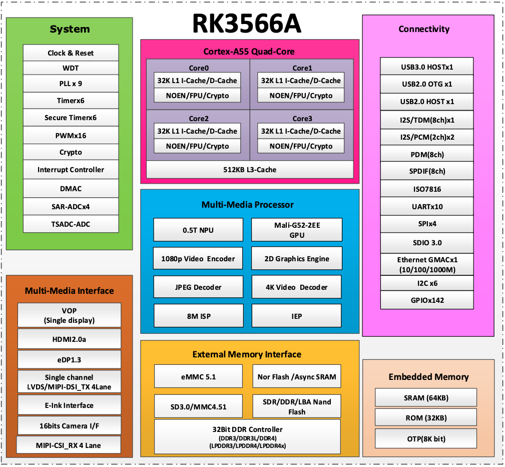

图中模块映射说明（用于理解 U-Boot 各阶段使用哪些硬件）：

| 硬件模块                 | U-Boot 阶段用途                     | 阶段                 |
| ------------------------ | ----------------------------------- | -------------------- |
| eMMC / SD 控制器         | 加载 SPL / U‑Boot 镜像              | BootROM、SPL、U-Boot |
| SPI NOR / NAND 控制器    | BootROM 或 SPL 从 Flash 加载镜像    | BootROM、SPL         |
| DDR 控制器 / DRAM PHY    | 初始化 DRAM，以支撑 U‑Boot 正常运行 | TPL 或 SPL           |
| UART 控制器（调试）      | 打印调试信息，用户控制台            | SPL 和 U-Boot        |
| I²C 接口（与 PMIC 通信） | 读取/设置电源管理芯片电压工作电压   | TPL / SPL            |
| USB OTG / USB_HOST       | 支持 USB 镜像下载、OTG 启动         | U-Boot               |
| Ethernet (GMAC)          | 支持网络引导、TFTP 下载             | U-Boot               |
| GPIO / PWM / RTC / ADC   | 外围控制、按键、RTC 时间设置等      | U-Boot 和 Boot阶段   |


假设你有一块 ARM CPU 的板子，当给板子插上电源后，最先运行的程序是什么?

* 最先运行的程序 CPU 内部的 ROMcode。
* 这段 ROMcode 的运行逻辑决定了该 CPU 支持从哪些外设启动(`sdcard`，`Emmc`，`nandflash` …)。
* 一般 CPU 的芯片手册会解释 ROMcode的运行逻辑。


假设 ROMcode 决定从 `sdcard`  启动，那么接下来 ROMcode 会做什么呢?

* 它会从 sdcard 拷贝一段程序到 CPU 内部的 `SRAM`。
* 具体如何拷贝，取决于 ROMcode 的实现，可以是读扇区或者读 FAT 文件系统。
* 拷贝到哪里呢? 上面已经说了，是 CPU 内部的 SRAM，为什么是内部的 SRAM 而不是外部的 DDRAM 呢?  **因为 ROMcode 不可能知道 CPU 外部挂的到底是什么型号的 `DDRAM`**，因此无法初始化外挂的 DDRAM，只能拷贝到内部的 SRAM。

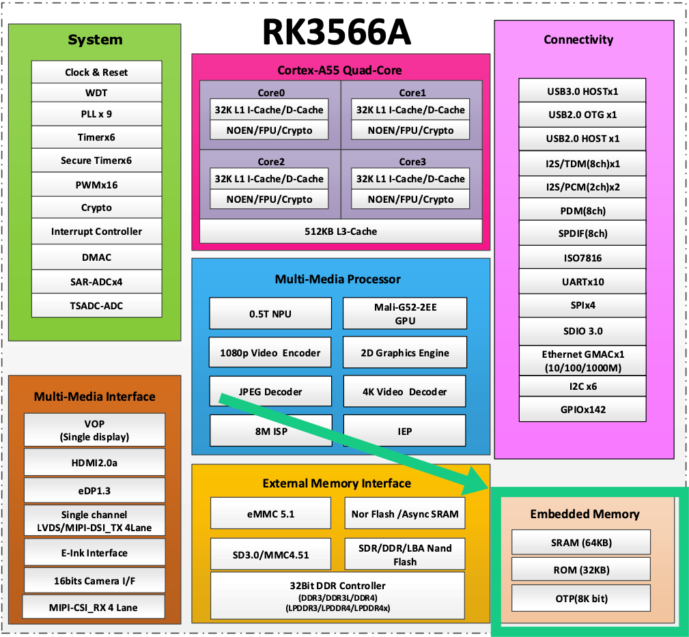

CPU 内部的 SRAM 都不大，一般也就 96KB 左右（上图为64KB大小），因此 SRAM的大小限制决定了 ROMcode 只能搬移一段很小的程序(image-stage1)到 SRAM，然后 SRAM 中运行的这段小程序会初始化DDRAM，并将一段更大的程序(image-stage2)搬移到 DDRAM 运行。

对 于 u-boot 而 言 ，它 完 全 满 足 上 述 场 景 . u-boot 可以编译出 image-stage1 和 image-stage2 这 2 段代码。

* image-stage1 一般叫做 SPL，或者 MLO，大小约为 60KB 左右. (后文统称 SPL)。
* image-stage2 一般叫做 u-boot.bin，大小约 360KB 左右。


接下来我将从uboot的源码来演示如何定位代码到 `sram` 中，该代码来源于泰山派（SOC：RK3566）。以下为该SDK包中`u-boot/arch/arm/cpu/armv8/u-boot-spl.lds`的全部源码，语法解析参照本仓库的文件“[lds_基础语法.md](../linker/lds_基础语法.md)”：

```lds
/*
 * (C) Copyright 2013
 * David Feng <fenghua@phytium.com.cn>
 *
 * (C) Copyright 2002
 * Gary Jennejohn, DENX Software Engineering, <garyj@denx.de>
 *
 * (C) Copyright 2010
 * Texas Instruments, <www.ti.com>
 *	Aneesh V <aneesh@ti.com>
 *
 * SPDX-License-Identifier:	GPL-2.0+
 */

MEMORY { .sram : ORIGIN = CONFIG_SPL_TEXT_BASE,
		LENGTH = CONFIG_SPL_MAX_SIZE }
MEMORY { .sdram : ORIGIN = CONFIG_SPL_BSS_START_ADDR,
		LENGTH = CONFIG_SPL_BSS_MAX_SIZE }

OUTPUT_FORMAT("elf64-littleaarch64", "elf64-littleaarch64", "elf64-littleaarch64")
OUTPUT_ARCH(aarch64)
ENTRY(_start)
SECTIONS
{
	.text : {
		. = ALIGN(8);
		*(.__image_copy_start)
		CPUDIR/start.o (.text*)
		*(.text*)
	} >.sram														/* 将代码定位到sram部分 */

	.rodata : {
		. = ALIGN(8);
		*(SORT_BY_ALIGNMENT(SORT_BY_NAME(.rodata*)))
	} >.sram														/* 将只读数据定位到sram部分 */

	.data : {
		. = ALIGN(8);
		*(.data*)
	} >.sram														/* 将数据定位到sram部分 */

	.u_boot_list : {
		. = ALIGN(8);
		KEEP(*(SORT(.u_boot_list*)));
	} >.sram

	.image_copy_end : {
		. = ALIGN(8);
		*(.__image_copy_end)
	} >.sram

	.end : {
		. = ALIGN(8);
		*(.__end)
	} >.sram

#ifndef CONFIG_SPL_SKIP_RELOCATE
	. = ALIGN(8);

	.rel_dyn_start :
	{
		*(.__rel_dyn_start)
	} >.sram

	.rela.dyn : {
		*(.rela*)
	} >.sram

	.rel_dyn_end :
	{
		*(.__rel_dyn_end)
	} >.sram
#endif
	_image_binary_end = .;

	.bss_start (NOLOAD) : {
		. = ALIGN(8);
		KEEP(*(.__bss_start));
	} >.sdram

	.bss (NOLOAD) : {
		*(.bss*)
		 . = ALIGN(8);
	} >.sdram

	.bss_end (NOLOAD) : {
		KEEP(*(.__bss_end));
	} >.sdram

	/DISCARD/ : { *(.dynsym) }
	/DISCARD/ : { *(.dynstr*) }
	/DISCARD/ : { *(.dynamic*) }
	/DISCARD/ : { *(.plt*) }
	/DISCARD/ : { *(.interp*) }
	/DISCARD/ : { *(.gnu*) }
}
```

# 第5章_u-boot编译系统

## 5.1_u-boot_编译步骤


要编 u-boot, 总共分几步? 3 步：

1. 获取u-boot源代码，配置好CROSS_COMPILE [^ 1 ] 和 ARCH [^ 2 ]
2. make xxx_defconfig[^ 3 ]
3. make

## 5.2_u-boot源码下载与编译说明

* 第一点，如果是作为芯片的使用者而不是芯片厂商的开发者：你仅仅需要用芯片厂商提供的u-boot源码即可，而不是从[u-boot官网](https://ftp.denx.de/pub/u-boot/)下载源码，因为官网的源码是绝大数可能不适配你所用的cpu的。如下所示NXP的官网下载对应的u-boot源码。
* 第二点，如果是芯片厂商的开发者，那必须是要做到非常了解的状态，毕竟你需要根据芯片特性来修改和适配u-boot的。

### 5.2.1_uboot源码获取

以imx6ull为例，[nxp的u-boot官方链接](https://github.com/nxp-imx/uboot-imx/tree/nxp/imx_v2016.03_4.1.15_2.0.0_ga)有独立的仓库。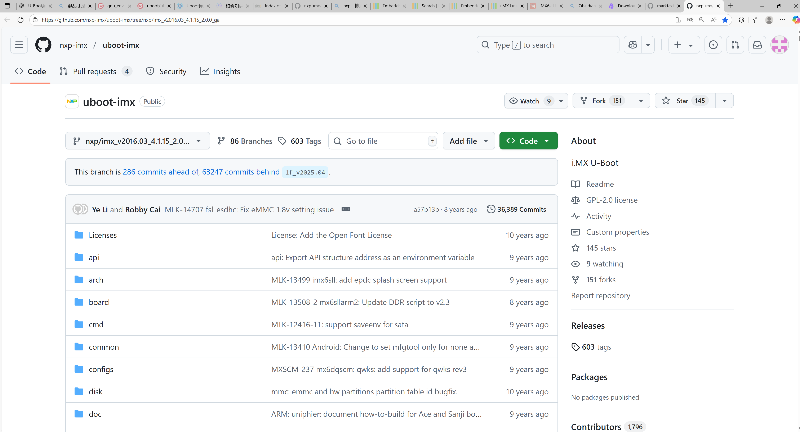


那么作为初次接触这种环境搭建的时候，我们如何知道在哪里下载芯片公司的官方u-boot，以及如何选择它的配置文件进行编译呢？

* **直接向浏览器或者ai提问，如：“NXP imx6ull的官方uboot获取”**，这是最简单能够获取的且非常实用。我不觉得这样直接问浏览器或者ai会让人掉价，甚至它的效率相当高，比你直接在官网翻找各种资料要好很多。
  * 这里我不得不吐槽一下各家芯片公司那迷糊人找不着北的官网内容排版好设计，他们真的有人会去测试自己的官网吗？他们真的会以用户的角度来排版或整理自己的官网吗？

* **到对应的芯片公司的官网查找资料说明：**
  1. 搜索linux或者uboot 的 `文档选项`（documents）。官网直接搜索linux，可能有概率找到它的文档说明，这只是概率性的问题。
     * 名字为 `xxx Programming Manual` 或者 `linux user's manual` 等等各种格式的命名。
     * 打开对应的文档后，直接搜索 `make` 关键字，查看它的相关内容有没有讲解 `make xxx_defconfig` 的指令说明。
  2. 到官网下找到它们的wiki论坛或者链接，到wiki里面提问或者直接搜索linux。也有概率获取到它的环境说明。
  3. 加入到各种芯片公司的售后群，在群里问，或者购买渠道的平台提问，找他们客服。

我需要再次强调：每颗芯片都只能够去芯片官网查找对应的uboot已经为该芯片适配的库下载编译，不能够直接从uboot官网直接下载编译，这两个官网的概念是有区别的。那么linux也是如此。


### 5.2.2_编译前的配置

我需要在执行 `make xxx_defconfig` 前补充一些的环境配置的说明。

1. 交叉编译器：`CROSS_COMPILE` 环境变量的配置
2. 芯片架构的选择：`ARCH` 环境变量


**CROSS_COMPILE：**

1. 什么是交叉编译器？

   * 如果你的电脑是X86架构，如intel或者AMD的cpu（起码不是ARM架构的cpu），而你的开发板是ARM的芯片。那么就意味着，你的编译环境和运行环境是两种不同的架构。所以需要编译的时候使用交叉编译器将x86架构（非ARM架构）的指令编译为ARM架构的指令。这就是交叉编译器的由来。
   * 如果你的电脑是苹果新生代的电脑，采用的是ARM的cpu，则无须考虑交叉编译器。不过，你需要考虑安装一个与u-boot对应版本的编译器。这时候需要下载的是arm版本的编译器。


2. 交叉编译器是否要分版本？

   * 交叉编译器必然要分版本，所以我们需要根据uboot的docs文档下的提示文件来查找对应符合标准的交叉编译器版本。、

   * 最方便匹配uboot的编译器版本是有规律的，基本是uboot当前版本发布的前一年的交叉编译器。


3. 在哪里查找交叉编译器的版本以及环境配置？

   * 环境说明文档路径：`doc/build/gcc.rst`

   * 这个文件会详细告诉读者下载哪个版本的编译器，以及对应的环境需要哪些。

   * 以下为 `doc/build/gcc.rst` 的内容

     ```rst
     Building with GCC
     =================

     Dependencies
     ------------

     For building U-Boot you need a GCC compiler for your host platform. If you
     are not building on the target platform you further need  a GCC cross compiler.

     Debian based
     ~~~~~~~~~~~~

     On Debian based systems the cross compiler packages are named
     gcc-<architecture>-linux-gnu.

     You could install GCC and the GCC cross compiler for the ARMv8 architecture with

     .. code-block:: bash

         sudo apt-get install gcc gcc-aarch64-linux-gnu

     Depending on the build targets further packages maybe needed

     .. code-block:: bash

     /***********************************************************************
      *                     这里详细说明了gcc编译器的环境                       *
      **********************************************************************/
         sudo apt-get install bc bison build-essential coccinelle \
           device-tree-compiler dfu-util efitools flex gdisk graphviz imagemagick \
           liblz4-tool libgnutls28-dev libguestfs-tools libncurses-dev \
           libpython3-dev libsdl2-dev libssl-dev lz4 lzma lzma-alone openssl \
           pkg-config python3 python3-coverage python3-pkg-resources \
           python3-pycryptodome python3-pyelftools python3-pytest \
           python3-sphinxcontrib.apidoc python3-sphinx-rtd-theme python3-virtualenv \
           swig

     SUSE based
     ~~~~~~~~~~

     On suse based systems the cross compiler packages are named
     cross-<architecture>-gcc<version>.

     /***********************************************************************
      *                     这里详细说明了gcc编译器的版本                       *
      **********************************************************************/
     You could install GCC and the GCC 10 cross compiler for the ARMv8 architecture
     with

     ...
     ```


4. 交叉编译器不区分版本会发生什么？

   * 如果版本过低，针对某些特殊指令的翻译工作无法完成，新的汇编语言或者高级语言的语法无法实现编译，导致编译失败。
   * 如果版本过高，嘿嘿，或因为一些库的改动，导致链接失败。
   * 提示一些宏定义找不到，版本过低，某些宏取消了；版本过高，又新增了一些宏同时取消了当前uboot版本的某些宏。

5. 交叉编译器的环境没有下载会发生什么？

   * 在执行make编译uboot的时候，会提示某些头文件的语法报错。这个问题不是真的语法错误，可能是临时生成的中间过程文件。针对不同的编译器版本和链接的外部环境而定，只要环境能够对得上的都会编译通过。


6. 去哪里下载交叉编译器？

   ​	通过arm公司提供的[交叉编译器官网](https://developer.arm.com/downloads/-/arm-gnu-toolchain-downloads)就好。记得把网页往下拉，才能够看到低版本的交叉编译器的下载选项。篇幅有限，不在这里介绍如何选择交叉编译器。有兴趣参考[正点原子的linux驱动开发第二期--交叉编译器下载](https://www.bilibili.com/video/BV1yE411h7uQ?spm_id_from=333.788.videopod.episodes&vd_source=2228e2c8d3ae4871dad3e2bac72fcf44&p=2)。

<iframe
  src="https://player.bilibili.com/player.html?bvid=BV1yE411h7uQ&p=2&autoplay=0"
  frameborder="0"
  allowfullscreen
  style="width: 100%; height: 60vh;">
</iframe>


**ARCH：**

1. **ARCH**  环境变量名是英文“architecture：架构”的缩写，所以如果你的开发板是ARM架构的就需要配置 `ARCH=arm` 。

   * 如果你的uboot是19年之前的，需要考虑arm和aarch64的区别（或者arm和arm64）。

   * 如果你的uboot是19年之后的，uboot已经将这两个架构合并在arm文件夹里面了。


2. **ARCH** 选项的来源和依据是什么？

   * 在uboot根目录下，有arch目录文件夹，该目录文件夹下全是关于架构的文件夹，这些文件夹就是ARCH的值的设定来源：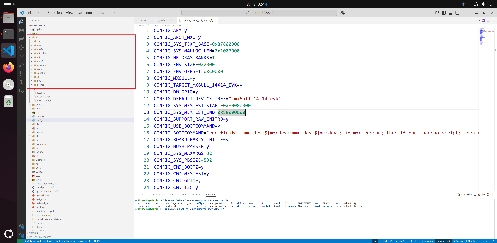


**配置 `CROSS_COMPILE` 和 `ARCH` 值**

配置它两值的方式有两种：

1. 在执行shell命令的make前直接插入它们的值。亦或者shell中采用EXPORT 来临时设置它两的值。
2. 在uboot的根目录下的 `Makefile` 中永久设置。

它两的区别，方法1是只能够在当前shell以及在当前命令终端中临时配置，而方法2是属于永久设置。


针对方法1，**命令执行：**

```shell
ARCH=arm CROSS_COMPILE=arm-none-linux-gnueabihf- make menuconfig
```


### 5.2.3_编译uboot

[编译uboot](https://www.bilibili.com/video/BV12E411h71h?p=4&vd_source=b387713a15d6517575ab4761525174e7):

<iframe
  src="https://player.bilibili.com/player.html?bvid=BV12E411h71h&p=4&autoplay=0"
  frameborder="0"
  allowfullscreen
  style="width: 100%; height: 60vh;">
</iframe>


一般情况下，编译对应SOC的命令都会在SOC的官网文档有所说明，不然你找不到对应开发板的配置文件。如，在nxp官网搜索 “linux user's guide”等关键字。出现如下所示：


选择打开《 I.MX Linux User's Guide.pdf 》就能够看到以下关于如何编译u-boot的说明：

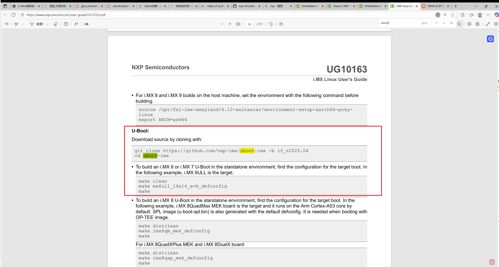

在这里将会看到各种环境下uboot的编译流程的说明，主体上还是以`make xxx_defconfig`的选择以及执行 `make` 命令这两步为主。对任何SOC的uboot编译来说，基本都是这两个步骤。找SOC官网文档说明的目的是找到它的配置文件（`xxx_defconfig` 文件），而不是说uboot的编译命令多样化；相反，它非常规律。


**在这里，我们不禁想问，xxx_defconfig是什么？ `make xxx_defconfig` 在做什么工作？最后的 `make` 又做了什么工作？**

1. xxx_defconfig ：是芯片原厂将自己的芯片针对uboot运行环境的条件的配置文件。
      * xxx_defconfig 是一个配置文件，里面装的是一些宏定义，用于编译时对uboot进行裁剪和条件选择。

      * xxx_defconfig 的位置基本位于：uboot根目录下的configs/目录下，如configs/mx6ull_14x14_evk_defconfig，如上图的命令解释中所选择的配置文件所示。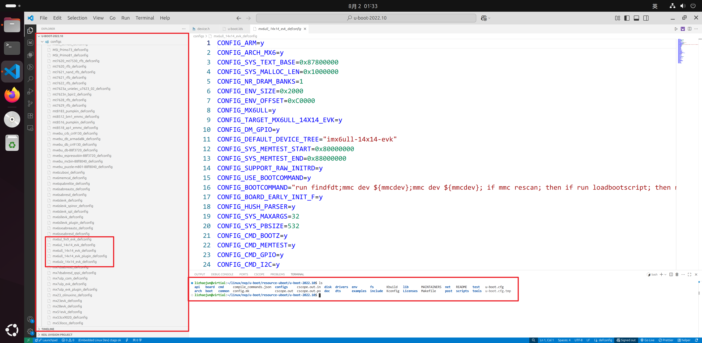


2. `make xxx_defconfig` 在将对应的配置文件导入，并在uboot的根目录下形成 `.config` 文件.

   `.config` 文件是uboot编译命令中配置环境的依赖文件，看名字即可知道它在uboot编译下的定位。

   * 打开两个文件对比，发现 `xxx_defconfig` 文件和 `.config` 文件之间的差异是很小的，且绝大数内容都是重复。

      * 当然，生成 `.config`文件并不代表对uboot的裁剪工作已经完成。这只是一份备份镜像裁剪的配置，如果不符合实际的需求，还需要在这上面修改，至于更改的方式则需要 shell 采用 `make menuconfig` 命令 来进行进一步的裁剪已适配新的工作需求。也就是说，如果你确定当前的 `.config` 文件里面的配置是最终配置，那么就可以直接进行执行make命令来进行uboot编译了。

3. shell中执行 `make` 命令，在会根据最终的`.config` 文件的环境配置，进行uboot镜像编译。

   * 执行到make命令就意味着uboot的镜像文件在开始编译了，环境配置，镜像裁剪工作也已经完成了。


**我们重新来梳理下.config文件的产生过程、.config文件的作用，以及到执行make命令的流程：**

1. 最开始的芯片产商shell会执行 `make menuconfig` 指令来裁剪和适配属于自己制造的SOC的配置，它自然会在根目录下生成.config文件。
2. 将.config文件备份，宁外取名字为 `xxx_defconfig`。这里自然是绑定到对应的开发板的配置文件，如imx6ull的EVK开发板，它在上图中的配置就为： `mx6ull_14x14_evk_defconfig`，位于uboot根目录下的configs目录下，`configs/mx6ull_14x14_evk_defconfig`。
3. 我需要强调的是：mx6ull_14x14_evk_defconfig 的来源可以是从零开始裁剪（shell采用make menuconfig 命令），也可以来自上一颗SOC的 `xxx_defconfig` 配置的继承上做的某些修改生成的。不过不重要，它只要最后能够在uboot的根文件下生成正常配置的.config配置文件即可。
4. 也就是说对uboot进行自定义裁剪的shell命令是 `make menuconfig` ，而 `make xxx_defconfig` 某种配置的备份文件。最后执行make编译uboot镜像文件。


## 5.3_Kconfig模块讲解

在此之前，我需要声明，我这里不会讲解如何新增一块开发板的配置，它太具体到芯片了。这个文档是只一种概念性的整理，如果想要阅读相关的信息，可以参考[正点原子linux系列视频第三期](https://www.bilibili.com/video/BV12E411h71h?p=23&vd_source=b387713a15d6517575ab4761525174e7) ：第七讲整讲。


参考[Kconfig/基础语法](../kconfig/基础语法.md)。

[Kconfig视频讲解推荐](https://www.bilibili.com/video/BV1Cc411x7PC?vd_source=b387713a15d6517575ab4761525174e7):

<iframe
  src="https://player.bilibili.com/player.html?bvid=BV1Cc411x7PC&p=1&autoplay=0"
  frameborder="0"
  allowfullscreen
  style="width: 100%; height: 60vh;">
</iframe>

在这里我们又会产生新的问题：`make menuconfig` 的选项依赖是什么？是什么模块支持我们再shell执行该命令之后，就可以看到如此之多的选项以及依赖项？

1. shell 命令执行 `make menuconfig` 命令所看到的配置选项卡的依赖是来源于 `kconfig` 脚本语言。
2. `Kconfig` 是 Linux 和 U-Boot 等大型项目中用于 **内核或系统组件配置管理** 的一种 **配置语言与机制**，它定义了配置选项（如 `CONFIG_XXX`）及其之间的依赖、默认值和可视化界面。


### 5.3.1_Kconfig_的作用

| 作用                                 | 举例                                                 |
| ------------------------------------ | ---------------------------------------------------- |
| 定义编译功能选项（`CONFIG_XXX`）     | `CONFIG_USB`, `CONFIG_ARM64`, `CONFIG_CMD_NET`       |
| 建立配置项之间的依赖关系             | 比如 `CONFIG_CMD_USB` 依赖 `CONFIG_USB`              |
| 提供 `menuconfig` 界面用于交互式配置 | 用户使用 `make menuconfig` 调整配置项                |
| 控制源码的编译条件                   | 如：`#ifdef CONFIG_CMD_NET` 决定是否编译网络命令模块 |


### 5.3.2_Kconfig_文件结构示例

```kconfig
menu "Networking support"

config NET
    bool "Enable networking support"
    default y

config CMD_NET
    bool "Enable basic network commands"
    depends on NET
    help
      Enable commands like `ping`, `tftp`, etc.

endmenu
```


**对应含义：**

| 关键词           | 含义解释                                            |
| ---------------- | --------------------------------------------------- |
| `menu`/`endmenu` | 创建一个逻辑菜单分组                                |
| `config XXX`     | 定义一个配置项                                      |
| `bool`           | 布尔选项（也有 `int`, `hex`, `string`, `tristate`） |
| `default y`      | 默认值为 `yes`                                      |
| `depends on`     | 指定依赖项                                          |
| `help`           | 提供配置项说明信息                                  |


**Kconfig 使用流程**

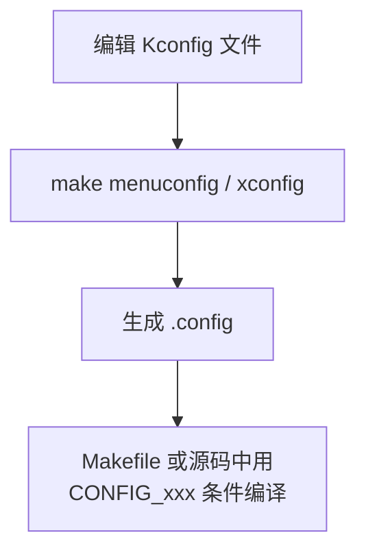

**在 U-Boot 中的位置举例**

| 目录                                 | 说明                                         |
| ------------------------------------ | -------------------------------------------- |
| `arch/arm/Kconfig`                   | ARM 平台的配置入口                           |
| `board/freescale/imx6ullevk/Kconfig` | 特定板子的配置                               |
| `drivers/net/Kconfig`                | 网络驱动配置项                               |
| `common/Kconfig`                     | 常规命令和功能配置                           |
| `Kconfig`（根目录）                  | 顶层配置入口，包含所有子模块的 `source` 指令 |


**与 Makefile 配合**

```c
#ifdef CONFIG_USB
init_usb();
#endif
```


**常见命令**

| 命令                     | 说明                           |
| ------------------------ | ------------------------------ |
| `make menuconfig`        | 图形界面配置（终端）           |
| `make xconfig`           | Qt GUI 界面配置                |
| `make savedefconfig`     | 保存简洁配置为 `defconfig`     |
| `make <board>_defconfig` | 使用某开发板默认配置           |
| `make`                   | 读取 `.config`，自动构建源代码 |

根据上表的说明，可以得知，生成 `.config` 配置文件的命令不只是 `make menuconfig` 命令，起码不是唯一的选项，它只是常用的命令。


## 5.4_make_&Makefile

如果读者想要了解更全的makefile的知识，可以参考[GNU_make-中文参考手册version3.8.pdf](../../../reference/external_resources/makefile/GNU_make-中文参考手册version3.8.pdf)。这个版本的makefile是由本人根据网上资料进行整理的，并且加入了一定的makefile的函数的示例，方便大家更好的理解并使用makefile这个脚本。至于为何不是最近的make的版本，没必要并且内容太多了。

> 以up本人的观点来看，我没法以简单的形式来给大家展示 `makefile` 的语法示例，所以给大家贴上了上述的pdf。原因如下：
>
> 1. makefile不是一种复杂语法，它是及其简单并且通用性极高的。但是，它涉及的知识内容非常广泛：从shell脚本语法和命令操作（编译器宏传递和代码裁剪，lds链接脚本，kconfig配置获取）到makefile本身的基本语法，这就是一锅大杂烩。
> 2. 我们对于脚本语言的理解也需要分清楚，理解makefile所做的工作。
>    * makefile是脚本语言中的脚本语言。它是shell命令的组织者，因此它做的任何事情都不会与编译相关。它一直在试图用一套新的规则将参数合理化传递给shell命令行和shell工具。
>    * makefile仅做传递给shell命令参数部分的字符串替换。它所谓的展开模式这些概念，都在阐述一件事儿：用户希望给shell命令行传递什么样的字符串参数？因此，你会见到在makefile里面有关于展开变量的几种方式，以及各种自动化变量等等。makefile的项目组织不仅仅关乎它自身的语法，还关乎大家对shell脚本语法以及shell工具的理解能力。
>    * makefile的数据获取方式是有限的。要么用户自己输入，要么直接定义后逐级传递环境变量，要么自动化搜索目录获取信息。所以它获取数据的方式是非常固定且有限的。
> 3. 只有shell吗？no！shell能够使用的指令和工具也是一大理解障碍，如gcc编译器使用、ld的使用、as的使用等等各种各样的shell工具。它们的组成形式：makefile--> shell --> shell工具。若仅仅是从shell或者shell的工具的视角看，还不算太复杂，只能说是针对性有点高，需要以专用专学的方式；但是如果加上makefile的各种转义和自动化变量之后，它就像是天书一样，让刚刚开始接触的人望而却步。
>
> 那么up说makefile本身的语法及其简单有什么依据吗？毕竟前面都在说它的项目阅读性很差。up的观点：但凡是想要组建大规模的工程的，它语法必须清晰透明，必须不能够有太多的特例和特殊处理手段（通用性高，思维透明，不存在特殊示例），通过其通用性来适配大规模的模块集成。如果不看shell命令行，也不管其中的makefile的变量展开的方式，它的工程组建方式并不存在过多的理解障碍。而真正让人眼前一黑的原因，往往是shell和shell工具的基本功不过关。
>
> 由此，up的结论是：**想要看懂makefile，shell脚本和shell的工具必须要会用。**否则，一切都是虚的。
>
> 读者应该以如下学习路径来加深自己对makefile的理解：
>
> 1. shell脚本，shell工具：
>    * 下面视频有配套的书籍《Linux Shell 核心编程指南》 电子工业出版社，我推荐跟书学习，推荐理由：包含了绝大数makefile用到的工具，丰富的示例讲解，已经清晰透明的语法讲解。
>    * [视频链接](https://www.bilibili.com/video/BV1DD4y1u7kt?vd_source=b387713a15d6517575ab4761525174e7)。
> 2. gcc编译器命令和编译规则：[视频链接](https://www.bilibili.com/video/BV1Y8411M7fp?vd_source=b387713a15d6517575ab4761525174e7)。
> 3. makefile官方说明文档：[GNU_make-中文参考手册version3.8.pdf](../../../reference/external_resources/makefile/GNU_make-中文参考手册version3.8.pdf)。


一般我们在编译某个代码时, 会进入到代码所在目录, 然后敲一个 make 命令。之后，make命令就会在当前目录下寻找 Makefile 或者 makefile 文件，解析并执行该文件。

当然，make 命令后面可以跟一些参数，例如：

```makefile
make -C DIRECTORY -f FILE
```

进入到 DIRECTORY 目录, 找到 FILE 文件, 解析并执行该文件。

如果没有-f 参数, FILE 默认就是 Makefile 或 makefile

```shell
make target
```

在 Makefile 中找到 target 目标, 并执行该目标. 关于 target 的概念, 我们随后就会介绍。

如果make命令后面没有显示指明target, 那么make会将Makefile中的第一个target做为默认目标。

对于非默认目标, 则只能通过 make target 这种显示指定目标的方式使其执行。


### 5.4.1_Makefile

如果想要了解u-boot的makefile的结构，或者讲解的makefile命令执行的过程，可以观看[韦东山的u-boot讲解视频](https://www.bilibili.com/video/BV1L24y187cK?vd_source=b387713a15d6517575ab4761525174e7)。这个视频不会包含u-boot启动的源码分析，需要观看另外一份视频来理解u-boot源码。

<iframe
  src="https://player.bilibili.com/player.html?bvid=BV1L24y187cK&autoplay=0"
  frameborder="0"
  allowfullscreen
  style="width: 100%; height: 60vh;">
</iframe>


#### (1)_target

target 的基本语法格式如下:

``` text
targets : [ prerequisites ] [; command]
	[command1]
	[command2]
	[……]
```

* [ ]里面的内容是可选的。
* **targets** 代表目标名, 也就是当前目录下某个文件的名称。
* **prerequisites** 代表该 targets 的依赖关系。
* **command** 代表命令。如果命令与targets在同一行, 则需以” ; ”分隔, 如果另起一行,则前面必须是”TAB” . Makefile 中用”TAB”标示一个 command。


这个语法代表个什么意思呢? 概况起来就一句话, 记牢这句话:

> 如果 targets 不存在; 或者 targets 存在但 prerequisites有更新: 则执行command命令。

举个例子, 假设我们在当前目录下有个 main.c文件, 要将其编译成 main.o, 则Makefile 可以这样写:

```makefile
main.o : main.c
	gcc -c main.c
```

当敲了 make 命令之后, make 会把 main.o 做为默认目标:

* 然后发现 main.o 在当前目录下不存在, 则会执行 `gcc -c main.c` 命令. 该命令就会生成 main.o, 也就是会生成目标文件 main.o。
* 如果再次敲 make 命令, 则什么都不会发生。
* 如果修改了 main.c, 再次敲 make 命令, 则会重新运行 `gcc -c main.c` 命令, 再次生成main.o。


#### (2)_PHONY_target

我们来看看这样一个 Makefile

```makefile
all :
	@echo this is all
```

Note: 在command 前加上@, 代表不显示该命令本身, 只显示命令的结果。

* 如果你敲一个 make 命令, 会发生什么?
* 如果你再次敲一个 make 命令, 会发生什么?
* `touch all`, 然后在敲 make 命令, 会发生什么?


结合前一节, 思考一下这里的答案。

发现这个 target 跟前一节那个例子的不同之处了吗?

前一节的 target 会创建目标文件 main.o，但是这里的 target 永远不会创建目标文件 all. 假设这个 target 是 Makefile 中的第一个目标, 那么**每次敲 make 命令, 都会导致该 target 下面的 command 被执行, 因为目标文件永远不存在**.

这种不会创建目标文件的 target 就叫伪目标. 伪目标的主要用途就是用于那些需要无条件执行的 target. 例如 clean, 用于清除编译生成的临时文件.

但是, 如果当前目录下恰好有一个同名的目标文件, 例如我们手动touch 了一个all文件, 那这个 target 就永远都不会执行了. 因为目标文件已经存在, 而且依赖关系没有更新(没有依赖关系也就是没有更新).

为了防止这种意外, 我们可以用.PHONY: target 显示指明某个目标为伪目标, 例如:

```makefile
.PHONY: all

all :
	@echo this is all
```

这样, 不管当前目录下是否有 all 这个目标文件，all 这个 target 都会执行。

伪目标除了不会生成目标文件，其它规则与正常的target一模一样，伪目标后面也可以定义依赖关系。**如果伪目标是 Makefile 的第一个目标, 也会被做为默认目标**。


#### (3)_VPATH

默认情况下，make 命令会在当前路径下搜寻目标文件和依赖文件, 例如上例中的main.c 和main.o。但是, 如果目标文件或者依赖文件不在当前目录下，而是被组织到了某个子目录下, 该怎么办呢?

Makefile 文件中的特殊变量 **VPATH** 就是用于解决这个问题的，如果没有指明这个变量，make 只会在当前的目录中去找寻依赖文件和目标文件。如果定义了这个变量，那么，make就会在当前目录找不到的情况下, 到所指定的目录中去找寻文件了。

```makefile
VPATH = src:../headers
```

上面的的定义指定两个目录：“ src”和“../headers” ，make 会按照这个顺序进行搜索。目录由“冒号”分隔。（当然, 当前目录永远是最高优先搜索的地方）

### 5.4.2_更多关于_Makefile

Makefile 中也可以定义变量, 引用其他 Makefile，使用条件判断，使用通配符等等。它还有一些内建的关键字。如果你在阅读某个 Makefile 文件时遇到了障碍，你可以去查询《跟我一起写 Makefile-陈皓.pdf》一文, 或者直接在网上搜索。


## 5.5_make_xxx_defconfig

make xxx_defconfig, 基于前一节的知识可以得知, 去 Makefile 里面找 xxx_defconfig 这个 target。

那我们来看看u-boot根目录下的Makefile:

```makefile
%config: scripts_basic outputmakefile FORCE
	$(Q)$(MAKE) $(build)=scripts/kconfig $@
```

%是通配符，%config 就是匹配任何 config 结尾的目标, 所以 xxx_defconfig 就是匹配的这个 target。它依赖后面的几个其他目标, 就不细看了。然后执行命令

* `$(Q)` 用于控制打印信息的, 先不管;

* `$(MAKE)` 代表 make 命令

* `build`  在 scripts/Kbuild.include 文 件 中 被 定 义 为

  ```makefile
  build := -f $(srctree)/scripts/Makefile.build obj
  ```

* 顶 层 Makefile 中 include 了`scripts/Kbuild.include`。

* `$@` 代表目标, 也就是 `xxx_defconfig`。

整条语句相当于：

```shell
make -f scripts/Makefile.build obj=scripts/kconfig xxx_defconfig
```

> 这里的 `-f` 是make表示指定执行makefile文件的指令，表示让make以 `scripts/Makefile.build`为执行的makefile文件，执行里面的xxx_defconfig 目标。并且将 `scripts/Makefile.build`里面的变量 `obj` 变量的值设置为 `scripts/kconfig` 。


`scripts/Makefile.build` 中 并 没 有 定 义 xxx_defconfig 这 个 目 标 , 不 过 它 include 了`scripts/kconfig/Makefile`。代码如下，逻辑就不细说了

```makefile
# The filename Kbuild has precedence over Makefile
kbuild-dir := $(if $(filter /%,$(src)),$(src),$(srctree)/$(src))
kbuild-file := $(if $(wildcard $(kbuild-dir)/Kbuild),$(kbuild-dir)/Kbuild,$(kbuild-dir)/Makefile)
include $(kbuild-file)
```

> include是makefile的引入关键字，它的作用是C语言中#include一样，进行全文引入。此处的作用为：将 `$(kbuild-file)` 所代表的文件就在此处展开。


`scripts/kconfig/Makefile` 中定义了 `xxx_defconfig` 这个目标, 如下：

```makefile
%_defconfig: $(obj)/conf
	$(Q)$< $(silent) --defconfig=arch/$(SRCARCH)/configs/$@ $(Kconfig)
```

* obj 在之前被设置过了, 为 scripts/kconfig
* %_defconfig 这个目标依赖$(obj)/conf，也就是依赖 scripts/kconfig/conf。
* 但是你在 `scripts/kconfig/Makefile` 中<span style="color: red; font-weight: bold;">找不到目标$(obj)/conf 的定义</span>。不过没关系，Makefile 可以自动推导(参见 跟我一起写 Makefile-陈皓.pdf)。自动推导的结果就是：

```makefile
$(obj)/conf : conf.c
	gcc -o conf -c conf.c
```


]接下来, 就会运行命令了

* `$<` 代表依赖目标

* `$(SRCARCH)` 在 Makefile 中被赋值为../

* `$(Kconfig)` 在 Makefile 中被赋值为 Kconfig

所以整个命令翻译过来就是:

```shell
$(obj)/conf --defconfig=arch/../configs/xxx_defconfig Kconfig
```

在接下来发生了什么，你就得去看看 scripts/kconfig/conf.c 这个 C 文件了。它会接受并解析参数--defconfig。

由于 conf.c 太过复杂，这里就不多说了，只需要了解这个原理即可，在有需要的时候, 再来深入分析 conf.c 文件。

## 5.6_.config

搞了这么久，make xxx_defconfig 到底干了些什么呢, 简单总结一下：

* 它 会 把 u-boot 根 目 录 下 的 configs/xxx_defconfig 做 为 参 数 ，传 递 给scripts/kconfig/conf.c。
* conf.c 会根据这个配置文件，最终在 u-boot 根目录了下生成.config。
* .config 文件里面是各种配置，决定着编译哪些 c 代码等等。


我们以 mx6ul_14x14_evk_defconfig 这个配置文件为例：

* 当输入命令 make mx6ul_14x14_evk_defconfig，我们可以在 u-boot 根目录下看到生成的。
* config 文件。.config 中有几个重要的信息：

```makefile
#
# Automatically generated file; DO NOT EDIT.
# U-Boot 2022.04 Configuration
#

#
# Compiler: aarch64-linux-gnu-gcc (Linaro GCC 7.5-2019.12) 7.5.0
#
CONFIG_CREATE_ARCH_SYMLINK=y
CONFIG_SYS_CACHE_SHIFT_6=y
CONFIG_SYS_CACHELINE_SIZE=64
CONFIG_LINKER_LIST_ALIGN=4
# CONFIG_ARC is not set
CONFIG_ARM=y
# CONFIG_M68K is not set
# CONFIG_MICROBLAZE is not set
# CONFIG_MIPS is not set
# CONFIG_NDS32 is not set
# CONFIG_NIOS2 is not set
# CONFIG_PPC is not set
# CONFIG_RISCV is not set
# CONFIG_SANDBOX is not set
# CONFIG_SH is not set
# CONFIG_X86 is not set
# CONFIG_XTENSA is not set
CONFIG_SYS_ARCH="arm"
CONFIG_SYS_CPU="armv7"
CONFIG_SYS_SOC="mx6"
CONFIG_SYS_VENDOR="freescale"
CONFIG_SYS_BOARD="mx6ul_14x14_evk"
CONFIG_SYS_CONFIG_NAME="mx6ul_14x14_evk"
```

这些信息决定了当前的配置是针对哪个板子的。这些信息是如何得到的呢？会是在mx6ul_14x14_evk_defconfig中定义的吗？

那我们看看 mx6ul_14x14_evk_defconfig 这个文件的内容：

```makefile
CONFIG_ARM=y
CONFIG_ARCH_MX6=y
CONFIG_SYS_MALLOC_LEN=0x1000000
CONFIG_NR_DRAM_BANKS=1
CONFIG_SYS_MEMTEST_START=0x80000000
CONFIG_SYS_MEMTEST_END=0x88000000
CONFIG_ENV_SIZE=0x2000
CONFIG_ENV_OFFSET=0xE0000
CONFIG_MX6UL=y
CONFIG_TARGET_MX6UL_14X14_EVK=y
CONFIG_SYS_I2C_MXC_I2C1=y
CONFIG_SYS_I2C_MXC_I2C2=y
CONFIG_DM_GPIO=y
CONFIG_DEFAULT_DEVICE_TREE="imx6ul-14x14-evk"
CONFIG_SUPPORT_RAW_INITRD=y
CONFIG_USE_BOOTCOMMAND=y
CONFIG_BOOTCOMMAND="run findfdt;mmc dev ${mmcdev};mmc dev ${mmcdev}; if mmc rescan; then if run loadbootscript; then run bootscript; else if run loadimage; then run mmcboot; else run netboot; fi; fi; else run netboot; fi"
CONFIG_IMX_CONFIG="board/freescale/mx6ul_14x14_evk/imximage.cfg"
CONFIG_BOOTDELAY=3
# CONFIG_CONSOLE_MUX is not set
CONFIG_SYS_CONSOLE_IS_IN_ENV=y
CONFIG_BOARD_EARLY_INIT_F=y
CONFIG_HUSH_PARSER=y
CONFIG_CMD_BOOTZ=y
# CONFIG_CMD_IMLS is not set
CONFIG_CMD_MEMTEST=y
CONFIG_CMD_GPIO=y
CONFIG_CMD_I2C=y
CONFIG_CMD_MMC=y
CONFIG_CMD_SF=y
CONFIG_CMD_USB=y
CONFIG_CMD_USB_SDP=y
CONFIG_CMD_USB_MASS_STORAGE=y
CONFIG_CMD_DHCP=y
CONFIG_CMD_PING=y
CONFIG_CMD_BMP=y
CONFIG_CMD_CACHE=y
CONFIG_CMD_NET=y
CONFIG_CMD_EXT2=y
CONFIG_CMD_EXT4=y
CONFIG_CMD_EXT4_WRITE=y
CONFIG_CMD_FAT=y
CONFIG_CMD_FS_GENERIC=y
CONFIG_OF_CONTROL=y
CONFIG_ENV_OVERWRITE=y
CONFIG_ENV_IS_IN_MMC=y
CONFIG_SYS_RELOC_GD_ENV_ADDR=y
CONFIG_SYS_MMC_ENV_DEV=1
CONFIG_ENV_VARS_UBOOT_RUNTIME_CONFIG=y
CONFIG_BOUNCE_BUFFER=y
CONFIG_DM_74X164=y
CONFIG_DM_I2C=y
CONFIG_SYS_I2C_MXC=y
CONFIG_FSL_USDHC=y
CONFIG_MTD=y
CONFIG_DM_SPI_FLASH=y
CONFIG_SF_DEFAULT_SPEED=40000000
CONFIG_SPI_FLASH_STMICRO=y
CONFIG_PHYLIB=y
CONFIG_PHY_MICREL=y
CONFIG_PHY_MICREL_KSZ8XXX=y
CONFIG_DM_ETH=y
CONFIG_DM_ETH_PHY=y
CONFIG_FEC_MXC=y
CONFIG_MII=y
CONFIG_PINCTRL=y
CONFIG_PINCTRL_IMX6=y
CONFIG_DM_REGULATOR=y
CONFIG_DM_REGULATOR_FIXED=y
CONFIG_DM_REGULATOR_GPIO=y
CONFIG_MXC_UART=y
CONFIG_SPI=y
CONFIG_DM_SPI=y
CONFIG_FSL_QSPI=y
CONFIG_SOFT_SPI=y
CONFIG_IMX_THERMAL=y
CONFIG_USB=y
CONFIG_USB_STORAGE=y
CONFIG_USB_HOST_ETHER=y
CONFIG_USB_ETHER_ASIX=y
CONFIG_DM_VIDEO=y
CONFIG_VIDEO_LOGO=y
CONFIG_SYS_WHITE_ON_BLACK=y
CONFIG_VIDEO_MXS=y
CONFIG_SPLASH_SCREEN=y
CONFIG_SPLASH_SCREEN_ALIGN=y
CONFIG_BMP_16BPP=y

CONFIG_USB_GADGET=y
CONFIG_USB_GADGET_DOWNLOAD=y
CONFIG_USB_GADGET_MANUFACTURER="FSL"
CONFIG_USB_GADGET_VENDOR_NUM=0x1fc9
CONFIG_USB_GADGET_PRODUCT_NUM=0x0152
CONFIG_CI_UDC=y

CONFIG_CMD_FASTBOOT=y
CONFIG_USB_FUNCTION_FASTBOOT=y
CONFIG_FASTBOOT_UUU_SUPPORT=y
CONFIG_FASTBOOT=y
CONFIG_FASTBOOT_BUF_ADDR=0x83800000
CONFIG_FASTBOOT_BUF_SIZE=0x40000000
CONFIG_FASTBOOT_FLASH=y
CONFIG_EFI_PARTITION=y
CONFIG_CMD_CRC32=y
CONFIG_CRC32_VERIFY=y

```

并没有定义 CPU, SOC 等. 只定义了一个 CONFIG_TARGET_MX6UL_14X14_EVK=y。其实真正的定义在：

* arch/arm/mach-imx/mx6/Kconfig：

```kconfig
config TARGET_MX6UL_14X14_EVK
	bool "mx6ul_14x14_evk"
	depends on MX6UL
	select BOARD_LATE_INIT
	select DM
	select DM_THERMAL
	select SUPPORT_SPL
	select IMX_MODULE_FUSE
	select OF_SYSTEM_SETUP
	imply CMD_DM
	select FSL_CAAM
	select FSL_BLOB
	select ARCH_MISC_INIT

...

config MX6UL
	bool "i.MX 6UltraLite SoC support"
	select HAS_CAAM
	select ROM_UNIFIED_SECTIONS
	select SYSCOUNTER_TIMER
	select SYS_L2CACHE_OFF
```

其实真正的定义在board/freescale/mx6ul_14x14_evk/Kconfig：

```kconfig
if TARGET_MX6UL_14X14_EVK || TARGET_MX6UL_9X9_EVK

config SYS_BOARD
	default "mx6ul_14x14_evk"

config SYS_VENDOR
	default "freescale"

config SYS_CONFIG_NAME
	default "mx6ul_14x14_evk"

config SYS_TEXT_BASE
	default 0x87800000
endif
```


## 5.7_新增一块板的支持

根据.config 一节的解释，如果想在 u-boot 下新增一块板的支持, 只需要如下步骤：

1. 在 configs/下创建一个配置文件 xxx_defconfig。在配置文件里面选中某个 TARGET，即：

   ``` makefile
   CONFIG_TARGET_MYOWNTARGET=y
   ```

2. 在 board/MYVENDOR/MYBOARD 目录下创建一个 Kconfig 文件，在 Kconfig 里面定义如下内容：

   ```kconfig
   if TARGET_MYOWNTARGET

   config SYS_BOARD
   	default "MYBOARD"

   config SYS_VENDOR
   	default "MYVENDOR"

   config SYS_SOC
   	default "MYSOC"

   config SYS_CONFIG_NAME
   	default "MYCONFIGNAME"

   endif
   ```

3. 在 include/configs/目录下创建一个名为 <span style="color:red;font-weight: bold;">MYCONFIGNAME.h </span> 的文件。在这个文件中存放特定的一些配置。

4. 在 board/MYVENDOR/MYBOARD/目录下创建板级文件 myboardfile.c 和 Makefile。

   如果你在板级文件中 include <common.h>，那么你的板级文件将自动 include “include/configs/MYCONFIGNAME.h”。引 用 的 顺 序 是 这 样 的 :

   ```text
   include/common.h --> include/config.h -->include/configs/$(CONFIG_SYS_CONFIG_NAME).h
   ```

   其中, include/config.h 是自动生成的，当你敲下 make 命令之后，根据重重依赖关系，最终由 scripts/Makefile.autoconf 自动生成。


## 5.8_make

当敲下 make 命令之后, 会发生什么呢？根据 Makefile 一章的知识，它会去寻找第一个target 做为默认目标。

那我们来看看 u-boot 顶层目录下的 Makefile 的第一个 target 是什么：

```makefile
# /Makefile

# That's our default target when none is given on the command line
PHONY := _all
_all:
```

这个 _all 目标的依赖关系怎么是空呢？原因是在 Makefile 的后面重新定义了该 target 的依赖关系：

```makefile
# /Makefile

# If building an external module we do not care about the all: rule
# but instead _all depend on modules
PHONY += all
ifeq ($(KBUILD_EXTMOD),)
_all: all
else
_all: modules
endif
```

由于 KBUILD_EXTMOD[^ 4] 一般是空，因此 \_all ：all 成立。\_all 依赖 all 这个 target。

[^ 4]: KBUILD_EXTMOD是指驱动编译时，指定编译的驱动模块，但是u-boot是一个裸机程序，因此没有用，一般为空。

### 5.8.1_NXP-imx6ull_VS_RK3566

#### (1)_make_all流程说明

接下来讲解的版本均为2016或2017的u-boot。这两个版本的变动不大。

为了避免讲解混乱，附上一副图来理清楚，shell命令执行 `make all`  的执行路径。

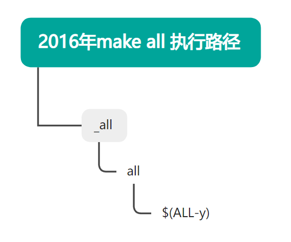

那 all 这个 target 又是如何定义的呢？继续看看 Makefile 中对于 all 的定义：

##### 1)_all:

```makefile
# /Makefile

all:		$(ALL-y)
ifneq ($(CONFIG_SYS_GENERIC_BOARD),y)
	@echo "===================== WARNING ======================"
	@echo "Please convert this board to generic board."
	@echo "Otherwise it will be removed by the end of 2014."
	@echo "See doc/README.generic-board for further information"
	@echo "===================================================="
endif
ifeq ($(CONFIG_DM_I2C_COMPAT),y)
	@echo "===================== WARNING ======================"
	@echo "This board uses CONFIG_DM_I2C_COMPAT. Please remove"
	@echo "(possibly in a subsequent patch in your series)"
	@echo "before sending patches to the mailing list."
	@echo "===================================================="
endif
```
##### 2)_ALL-y:

```makefile
# /Makefile

# Always append ALL so that arch config.mk's can add custom ones
ALL-y += u-boot.srec u-boot.bin u-boot.sym System.map u-boot.cfg binary_size_check

# enable combined SPL/u-boot/dtb rules for tegra
ifeq ($(CONFIG_TEGRA)$(CONFIG_SPL),yy)
ALL-y += u-boot-tegra.bin u-boot-nodtb-tegra.bin
ALL-$(CONFIG_OF_SEPARATE) += u-boot-dtb-tegra.bin
endif

# Add optional build target if defined in board/cpu/soc headers
ifneq ($(CONFIG_BUILD_TARGET),)
ALL-y += $(CONFIG_BUILD_TARGET:"%"=%)
endif
```

还有一些裁剪型的 ALL-$(x) ，只要里面的变量$(x)值为y，都会加入对应的目标：

```makefile
# /Makefile

# Always append ALL so that arch config.mk's can add custom ones
ALL-y += u-boot.srec u-boot.bin u-boot.sym System.map u-boot.cfg binary_size_check

ALL-$(CONFIG_ONENAND_U_BOOT) += u-boot-onenand.bin
ifeq ($(CONFIG_SPL_FSL_PBL),y)
ALL-$(CONFIG_RAMBOOT_PBL) += u-boot-with-spl-pbl.bin
else
ifneq ($(CONFIG_SECURE_BOOT), y)
# For Secure Boot The Image needs to be signed and Header must also
# be included. So The image has to be built explicitly
ALL-$(CONFIG_RAMBOOT_PBL) += u-boot.pbl
endif
endif
ALL-$(CONFIG_SPL) += spl/u-boot-spl.bin
ALL-$(CONFIG_SPL_FRAMEWORK) += u-boot.img
ALL-$(CONFIG_TPL) += tpl/u-boot-tpl.bin
ALL-$(CONFIG_OF_SEPARATE) += u-boot.dtb
ifeq ($(CONFIG_SPL_FRAMEWORK),y)
ALL-$(CONFIG_OF_SEPARATE) += u-boot-dtb.img
endif
ALL-$(CONFIG_OF_HOSTFILE) += u-boot.dtb
ifneq ($(CONFIG_SPL_TARGET),)
ALL-$(CONFIG_SPL) += $(CONFIG_SPL_TARGET:"%"=%)
endif
ALL-$(CONFIG_REMAKE_ELF) += u-boot.elf
ALL-$(CONFIG_EFI_APP) += u-boot-app.efi
ALL-$(CONFIG_EFI_STUB) += u-boot-payload.efi

ifneq ($(BUILD_ROM),)
ALL-$(CONFIG_X86_RESET_VECTOR) += u-boot.rom
endif

# enable combined SPL/u-boot/dtb rules for tegra
ifeq ($(CONFIG_TEGRA)$(CONFIG_SPL),yy)
ALL-y += u-boot-tegra.bin u-boot-nodtb-tegra.bin
ALL-$(CONFIG_OF_SEPARATE) += u-boot-dtb-tegra.bin
endif

# Add optional build target if defined in board/cpu/soc headers
ifneq ($(CONFIG_BUILD_TARGET),)
ALL-y += $(CONFIG_BUILD_TARGET:"%"=%)
endif
```

这里只截取了关于 ALL-y 的部分代码，不过我们需要的重要信息都在这里了。从这段代码里面, 我们可以得出两个重要信息：

* ALL-y 默认被赋值为 u-boot.srec u-boot.bin System.map binary_size_check
* all: $(ALL-y)，也 就 是 说 all 目 标 依 赖 于 u-boot.srec u-boot.bin System.map
* binary_size_check 这几个目标。而这几个目标就是用于生成 image-stage2 阶段的镜像，也就是用于生成 u-boot.bin
* ALL-$(CONFIG_SPL) += spl/u-boot-spl.bin
* 如果定义了 CONFIG_SPL，那么 all 目标还会依赖于 spl/u-boot-spl.bin 这个目标。这个目标就是用于生成 image-stage1 阶段的镜像，也就是用于生成 SPL。

了解了上述逻辑之后，接下来我们分别分析 SPL 和 u-boot.bin 是如何生成的。


#### (2)_SPL流程说明

为了避免讲解混乱，附上一副图来理清楚 SPL 的生成路径。

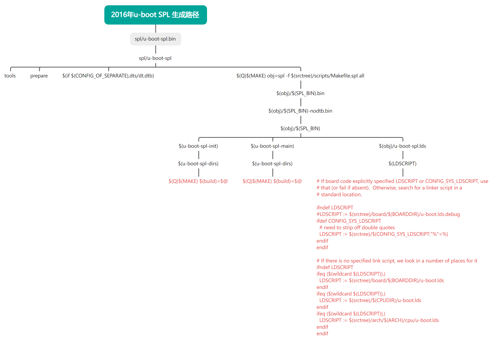

先分析一下 SPL 是如何生成的。本小节我们主要要弄清楚 2 个问题

1. 到底哪些代码会被编译进 SPL
2. SPL 的入口代码在哪里

接下来开始我们的探索吧。


从前面的分析可知，spl/u-boot-spl.bin 这个目标会负责生成 SPL，我们先在顶层 Makefile中找到这个目标：

```makefile
# /Makefile

spl/u-boot-spl.bin: spl/u-boot-spl
	@:
```

spl/u-boot-spl.bin 依赖 spl/u-boot-spl。spl/u-boot-spl 的定义如下：

```makefile
# /Makefile

spl/u-boot-spl: tools prepare $(if $(CONFIG_OF_SEPARATE),dts/dt.dtb)
	$(Q)$(MAKE) obj=spl -f $(srctree)/scripts/Makefile.spl all
```

它依赖 tools 和 prepare 这两个目标，这两个目标是做一些准备工作, 就不细看了。重点在于下面的 命令：

```makefile
$(Q)$(MAKE) obj=spl -f $(srctree)/scripts/Makefile.spl all
```

它代表将参数 obj 设置为 spl，然后执行 scripts/Makefile.spl 中的 all 目标。


接下来我们去 scripts/Makefile.spl 这个文件里面看看它的 all 目标是什么样子的：

```makefile
# /scripts/Makefile.spl

ALL-y	+= $(obj)/$(SPL_BIN).bin $(obj)/$(SPL_BIN).cfg

ifdef CONFIG_SAMSUNG
ALL-y	+= $(obj)/$(BOARD)-spl.bin
endif

ifdef CONFIG_ARCH_SOCFPGA
ALL-y	+= $(obj)/$(SPL_BIN).sfp
endif

ifdef CONFIG_SUNXI
ALL-y	+= $(obj)/sunxi-spl.bin
endif

ifeq ($(CONFIG_SYS_SOC),"at91")
ALL-y	+= boot.bin
endif

ifdef CONFIG_ARCH_ZYNQ
ALL-y	+= $(obj)/boot.bin
endif

all:	$(ALL-y)
```

很清楚了, 最重要的一个目标是$(obj)/$(SPL_BIN).bin，定义如下：

```makefile
# /scripts/Makefile.spl

ifeq ($(CONFIG_SPL_OF_CONTROL),y)
$(obj)/$(SPL_BIN)-dtb.bin: $(obj)/$(SPL_BIN)-nodtb.bin $(obj)/$(SPL_BIN)-pad.bin \
		$(obj)/$(SPL_BIN).dtb FORCE
	$(call if_changed,cat)

$(obj)/$(SPL_BIN).bin: $(obj)/$(SPL_BIN)-dtb.bin FORCE
	$(call if_changed,copy)
else
$(obj)/$(SPL_BIN).bin: $(obj)/$(SPL_BIN)-nodtb.bin FORCE
	$(call if_changed,copy)
endif
```

#### (3)_\*_CONFIG_SPL_OF_CONTROL_与镜像分支

##### 1)_背景

U-Boot 的 SPL 可以有两种构建方式：

- **dtb**：将设备树 (FDT) 编译进 SPL 镜像，启动时 SPL 可以解析设备树，驱动模型功能更强。
- **nodtb**：不包含设备树，SPL 靠静态配置和板级代码运行，功能有限但镜像更小。

------

##### 2)_判断依据

在 `scripts/Makefile.spl` 中，可以看到：

- 如果 `CONFIG_SPL_OF_CONTROL=y` → 生成 `u-boot-spl-dtb.bin`。
- 否则 → 生成 `u-boot-spl-nodtb.bin`。

------

##### 3)_示例对比

| SoC 平台 (示例配置) | `.config` 值                   | 最终 SPL 镜像          |
| ------------------- | ------------------------------ | ---------------------- |
| **i.MX6ULL (示例)** | `CONFIG_SPL_OF_CONTROL` 未启用 | `u-boot-spl-nodtb.bin` |
| **RK3566 (示例)**   | `CONFIG_SPL_OF_CONTROL=y`      | `u-boot-spl-dtb.bin`   |

------

##### 4)_️_准确表述提示

- 不要写成“i.MX6ULL 平台不走 dtb 分支”。
- 正确写法是：
   *“在本文示例的 i.MX6ULL 配置中，未启用 `CONFIG_SPL_OF_CONTROL`，因此 SPL 构建生成 `u-boot-spl-nodtb.bin`。而在本文示例的 RK3566 配置中启用了该选项，因此 SPL 构建生成 `u-boot-spl-dtb.bin`。是否启用该功能由具体 defconfig 决定，并非 SoC 固有差异。”*

------

##### 5)_提示

- 想验证 SPL 使用哪种方式，可以直接查看 `.config` 文件：

  ```
  grep CONFIG_SPL_OF_CONTROL .config
  ```

- 也可以查看 `spl/` 输出目录里生成的 bin 名字。

#### (4)_无SPL_NXP_IMX6ULL芯片

整个imx6ull的defconfig生成的.config文件的内容参考[.config-imx6ull-2016](.config/NXP_IMX6ULL/.config-2016.txt)。

现在的问题是我们要怎么判断 `ifeq ($(CONFIG_SPL_OF_CONTROL),y)` 这个条件判断是否成立。很简单，在执行 `make xxx_defconfig` 后会生成对应的 `.config` 文件，在该文件搜索对应的 `CONFIG_SPL_OF_CONTROL=y` 是否成立。为什么针对这个选项可以这么做？因为它是以 `CONFIG_` 开头，这说明它是由`Kconfig` 生成的对应的选项，因此它会在 `.config` 文件下有记录。

很显然，在 `mx6ull_14x14_evk_defconfig` 生成的 `.config` 文件中是没有这个记录的，说明条件不成立。顺便说一下NXP的imx6ull是采用无SPL的方式，在这里的配置中它的值就不存在。因此 `$(obj)/$(SPL_BIN).bin` 的生成规则为：

```makefile
# /scripts/Makefile.spl

$(obj)/$(SPL_BIN).bin: $(obj)/$(SPL_BIN)-nodtb.bin FORCE
	$(call if_changed,copy)
```
可以看到 `$(obj)/$(SPL_BIN)-nodtb.bin` 作为唯一依赖存在，而 `$(obj)/$(SPL_BIN)-nodtb.bin` 的生成规则如下所示：

```makefile
# /scripts/Makefile.spl

$(obj)/$(SPL_BIN)-nodtb.bin: $(obj)/$(SPL_BIN) FORCE
	$(call if_changed,objcopy)
```
`$(obj)/$(SPL_BIN)` 生成规则如下：

```makefile
# /scripts/Makefile.spl

$(obj)/$(SPL_BIN): $(u-boot-spl-init) $(u-boot-spl-main) $(obj)/u-boot-spl.lds FORCE
	$(call if_changed,u-boot-spl)
```
`$(u-boot-spl-init) $(u-boot-spl-main)` 的生成规则如下：

```makefile
# /scripts/Makefile.spl

$(sort $(u-boot-spl-init) $(u-boot-spl-main)): $(u-boot-spl-dirs) ;
```
`$(obj)/u-boot-spl.lds` 的生成规则如下：

```makefile
# /scripts/Makefile.spl

PHONY += $(u-boot-spl-dirs)
$(u-boot-spl-dirs):
	$(Q)$(MAKE) $(build)=$@
```
`$(u-boot-spl-dirs)` 生成规则如下：

```makefile
# /scripts/Makefile.spl

$(obj)/u-boot-spl.lds: $(LDSCRIPT) FORCE
	$(call if_changed_dep,cpp_lds)
```

* 在NXP-imx6ull中的最终.config文件是没有定义 `$(LDSCRIPT)`变量的。
* 在RK3566中的最终.config文件定义 了`$(LDSCRIPT)`变量。

如果没有接触过Makefile的读者，估计到这里已经非常难理解makefile做的事情了，因为它出现了 `$(call if_changed_dep,cpp_lds)` 这种不友好的表达方式，它就是函数调用；只是makefile不同的是，它的函数调用有个关键字 `call`说明。至于函数的定义在哪里，up不便在此处展开。只要知道makefile的流程是如何查找并且它的执行机制即可。本文档的主线是理清楚uboot的makefile的执行路径并非是makefile语法讨论。

* 关于makefile自定义函数的内容可以参考：[GNU_make_3.8-中文参考手册：4.7 定义命令包](../../../reference/external_resources/makefile/GNU_make-中文参考手册version3.8.pdf)。
* 关于call函数的说明可以参考：[GNU_make_3.8-中文参考手册：7.6 call ](../../../reference/external_resources/makefile/GNU_make-中文参考手册version3.8.pdf)。

#### (5)_SPL_RK_3566芯片_2017

整个RK3566的defconfig生成的.config文件的内容参考[.config-RK3566](.config/RK_3566/.config.txt)。

在泰山派的uboot的配置下是采用SPL的，接下来将会分析基于RK3566的SPL的生成流程。

```makefile
# /scripts/Makefile.spl
ifeq ($(CONFIG_$(SPL_TPL_)OF_CONTROL)$(CONFIG_OF_SEPARATE)$(CONFIG_$(SPL_TPL_)OF_PLATDATA),yy)
$(obj)/$(SPL_BIN)-dtb.bin: $(obj)/$(SPL_BIN)-nodtb.bin \
		$(if $(CONFIG_SPL_SEPARATE_BSS),,$(obj)/$(SPL_BIN)-pad.bin) \
		$(FINAL_DTB_CONTAINER)  FORCE
	$(call if_changed,cat)

$(obj)/$(SPL_BIN).bin: $(obj)/$(SPL_BIN)-dtb.bin FORCE
	$(call if_changed,copy)
else
$(obj)/$(SPL_BIN).bin: $(obj)/$(SPL_BIN)-nodtb.bin FORCE
	$(call if_changed,copy)
endif
```

可以看到，这里的条件变多了，同时整个代码逻辑却变化不大。

在RK3566的uboot根目录的最终 `.config` 文件下找到如下与SPL开关相关的变量定义：

```makefile
# /.config
CONFIG_SPL_LDSCRIPT="arch/arm/cpu/armv8/u-boot-spl.lds"
...

CONFIG_OF_SEPARATE=y
# CONFIG_SPL_OF_PLATDATA is not set
CONFIG_SUPPORT_OF_CONTROL=y
```

显然，之前的 `$(obj)/$(SPL_BIN)-dtb.bin` 的 makefile 分支应该为：
```makefile
# /scripts/Makefile.spl

$(obj)/$(SPL_BIN)-dtb.bin: $(obj)/$(SPL_BIN)-nodtb.bin \
		$(if $(CONFIG_SPL_SEPARATE_BSS),,$(obj)/$(SPL_BIN)-pad.bin) \
		$(FINAL_DTB_CONTAINER)  FORCE
	$(call if_changed,cat)

$(obj)/$(SPL_BIN).bin: $(obj)/$(SPL_BIN)-dtb.bin FORCE
	$(call if_changed,copy)
```

 `$(obj)/$(SPL_BIN)-dtb.bin` 的定义如下：

```makefile
# /scripts/Makefile.spl

$(obj)/$(SPL_BIN)-dtb.bin: $(obj)/$(SPL_BIN)-nodtb.bin \
		$(if $(CONFIG_SPL_SEPARATE_BSS),,$(obj)/$(SPL_BIN)-pad.bin) \
		$(FINAL_DTB_CONTAINER)  FORCE
	$(call if_changed,cat)
```

 `$(obj)/$(SPL_BIN)-nodtb.bin` 的定义如下：
```makefile
# /scripts/Makefile.spl

$(obj)/$(SPL_BIN)-nodtb.bin: $(obj)/$(SPL_BIN) FORCE
	$(call if_changed,objcopy)
```

至此，我们已经将整 `$(Q)$(MAKE) obj=spl -f $(srctree)/scripts/Makefile.spl all`这条命令分析差不多了。有前文的分析可知，`scripts/Makefile.spl` 中的 `$(u-boot-spl-init)` 和 `$(u-boot-spl-main)` 这两个目标决定了那些代码会被编译进SPL。

我们看看这两个目标的定义：

```makefile
# /scripts/Makefile.spl

u-boot-spl-init := $(head-y)
u-boot-spl-main := $(libs-y)
```

##### 1)_head-y

在 `scripts/Makefile.spl` 中，`head-y` 和 `libs-y` 的定义如下：

```makefile
# /scripts/Makefile.spl

head-y		:= $(addprefix $(obj)/,$(head-y))
libs-y		:= $(addprefix $(obj)/,$(libs-y))
```

关于makefile函数 `addprefix`，参考：[GNU_make_3.8-中文参考手册：7.3.6 addprefix](../../../reference/external_resources/makefile/GNU_make-中文参考手册version3.8.pdf)。

这句话的意思是给 `head-y` 加上前缀 $(obj)/，那它们两真正的定义在哪里定义的呢？

我们在 `scripts/Makefile.spl` 的其他地方找不到任何head-y的定义，这不科学！别急， `scripts/Makefile.spl` 中还有这样一句话：

 ```makefile
 # /scripts/Makefile.spl

 include $(srctree)/config.mk
 include $(srctree)/arch/$(ARCH)/Makefile
 ```

> 上述是原书作者的内容，我想在这里再添加一种做法，能够避开这种无头脑的寻找。毕竟在makefile中没有那么明显的关联性以便于查找和跳转。
>
> 1. 使用vscode打开整个uboot目录。
> 2. 全局搜索你想要查找的内容。查看文件夹的规律。
> 3. 回归到makefile文档，查找 `include` 关键字，印证是否有引入该文件。
>
> 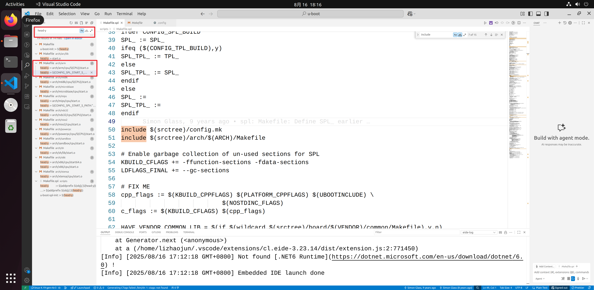

ARCH 的定义是在顶层目录的 config.mk 中，config.mk 解析顶层目录下的.config 以获取相关信息。

下面一行 include 了另外一个 Makefile，就像 c 语言中引用.h 文件一样, 这个 Makefile 中的内容会被插入到 scripts/Makefile.spl 中。

如果 ARCH=arm，那么这个 Makefile 就是 arch/arm/Makefile，查看这个文件，我们可以从该文件中找到 head-y 的定义：

```makefile
head-y := arch/arm/cpu/$(CPU)/start.o

ifeq ($(CONFIG_SPL_BUILD),y)
ifneq ($(CONFIG_SPL_START_S_PATH),)
head-y := $(CONFIG_SPL_START_S_PATH:"%"=%)/start.o
endif
endif
```

意思也很清楚了：

* 默认情况下 head-y 被赋值为 `arch/arm/cpu/$(CPU)/start.o`，也就是会把 `arch/arm/cpu/$(CPU)/` 目录下的 start.S 编译成 start.o 。

* 不过如果定义了 `CONFIG_SPL_BUILD` 与 `CONFIG_SPL_START_S_PATH`，则会编译 `CONFIG_SPL_START_S_PATH` 目录下的 start.S。

* 的定义：

  ```makefile
  # /scripts/Makefile.autoconf

  spl/u-boot.cfg: include/config.h FORCE
  	$(Q)mkdir -p $(dir $@)
  	$(call cmd,u_boot_cfg,-DCONFIG_SPL_BUILD)

  tpl/u-boot.cfg: include/config.h FORCE
  	$(Q)mkdir -p $(dir $@)
  	$(call cmd,u_boot_cfg,-DCONFIG_SPL_BUILD -DCONFIG_TPL_BUILD)
  ```

  这里的 `-DCONFIG_SPL_BUILD` 是通过编译器传递宏定义的方式把宏传递进去。上述代码的执行属于make的自动化处理过程中加入的定义。具体的话可以追溯到：

  ```makefile
  # /scripts/kconfig/Makefile

  %_defconfig: $(obj)/conf
  	$(Q)$< $(silent) --defconfig=arch/$(SRCARCH)/configs/$@ $(Kconfig)
  ```

  ```makefile
  # /Makefile

  # If .config is newer than include/config/auto.conf, someone tinkered
  # with it and forgot to run make oldconfig.
  # if auto.conf.cmd is missing then we are probably in a cleaned tree so
  # we execute the config step to be sure to catch updated Kconfig files
  include/config/%.conf: $(KCONFIG_CONFIG) include/config/auto.conf.cmd
  	$(Q)$(MAKE) -f $(srctree)/Makefile silentoldconfig
  	@# If the following part fails, include/config/auto.conf should be
  	@# deleted so "make silentoldconfig" will be re-run on the next build.
  	$(Q)$(MAKE) -f $(srctree)/scripts/Makefile.autoconf || \
  		{ rm -f include/config/auto.conf; false; }
  	@# include/config.h has been updated after "make silentoldconfig".
  	@# We need to touch include/config/auto.conf so it gets newer
  	@# than include/config.h.
  	@# Otherwise, 'make silentoldconfig' would be invoked twice.
  	$(Q)touch include/config/auto.conf
  ```

  上述的代码中：

  ```makefile
  $(Q)$(MAKE) -f $(srctree)/scripts/Makefile.autoconf || \
  		{ rm -f include/config/auto.conf; false; }
  ```

  指定了自动化处理的makefile文件 `/scripts/Makefile.autoconf` 文件。


* `CONFIG_SPL_BUILD`  的值在`arch/arm/mach-rockchip/Makefile` 里面有所涉及：

```makefile
# /arch/arm/mach-rockchip/Makefile

# Now add SPL/TPL objects back into the main build
obj-$(CONFIG_SPL_BUILD) += $(obj-spl-y)
obj-$(CONFIG_TPL_BUILD) += $(obj-tpl-y)
```

还有部分是在driver部分会有所涉及：

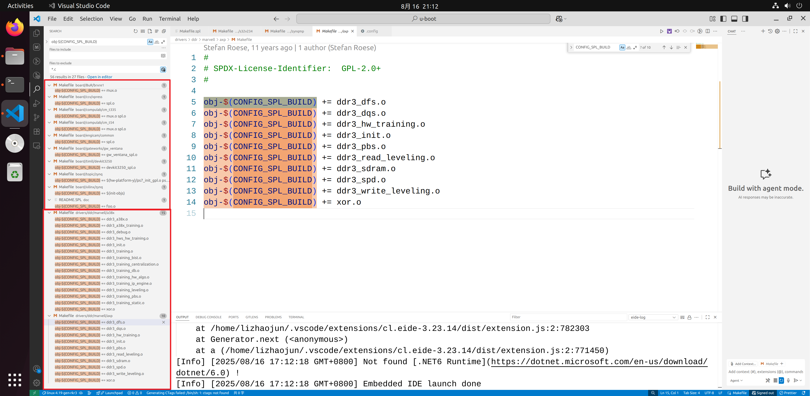

回到主题。需要提醒的是，arch/arm/Makefile中不仅定义了head-y，也定义了很多libs-y，libs-y将在下面介绍。

##### 2)_libs-y

在 scripts/Makefile.spl 中，libs-y 的定义如下(注意，arch/$ARCH/Makefile 中也定义了很多libs-y)：

```makefile
HAVE_VENDOR_COMMON_LIB = $(if $(wildcard $(srctree)/board/$(VENDOR)/common/Makefile),y,n)

libs-y += $(if $(BOARDDIR),board/$(BOARDDIR)/)
libs-$(HAVE_VENDOR_COMMON_LIB) += board/$(VENDOR)/common/

ifeq ($(CONFIG_TPL_BUILD),y)
ifndef CONFIG_TPL_TINY_FRAMEWORK
libs-$(CONFIG_SPL_FRAMEWORK) += common/spl/
endif
else
libs-$(CONFIG_SPL_FRAMEWORK) += common/spl/
endif

libs-y += common/init/

# Special handling for a few options which support SPL/TPL
ifeq ($(CONFIG_TPL_BUILD),y)
libs-$(CONFIG_TPL_LIBCOMMON_SUPPORT) += common/ cmd/ env/
libs-$(CONFIG_TPL_LIBGENERIC_SUPPORT) += lib/
else
libs-$(CONFIG_SPL_LIBCOMMON_SUPPORT) += common/ cmd/ env/
libs-$(CONFIG_SPL_LIBGENERIC_SUPPORT) += lib/
endif

libs-$(CONFIG_SPL_LIBDISK_SUPPORT) += disk/
ifneq ($(CONFIG_SPL_DECOMP_HEADER),y)
libs-y += drivers/
endif
libs-$(CONFIG_SPL_USB_GADGET) += drivers/usb/dwc3/
libs-$(CONFIG_SPL_USB_GADGET) += drivers/usb/cdns3/
libs-y += dts/
libs-y += fs/
libs-$(CONFIG_SPL_POST_MEM_SUPPORT) += post/drivers/
libs-$(CONFIG_SPL_NET_SUPPORT) += net/

libs-y		:= $(addprefix $(obj)/,$(libs-y))
libs-y := $(patsubst %/, %/built-in.o, $(libs-y))
```

我们看看最后一行：

```makefile
libs-y := $(patsubst %/, %/built-in.o, $(libs-y))
```

它的意思是从 libs-y 定义的路径中，截取 `/` 之前的部分，然后加上 `/built-in.o` 的后缀. 然后重新赋值给 `libs-y`。

假设 libs-y := fs/ ，则经过上述转换后，libs-y 变为 libs-y := fs/built-in.o。而 fs 下的 builtin.o 由于 fs 目录下的 Makefile 生成的(这块的细节就不推导了，记住这个结论即可)。所以，上述代码综合来看，就是libs-y 依赖蓝色字体定义的那些目录下的Makefile 文件，依赖这些 Makefile 文件决定哪些代码会被编译进 SPL。

**至此, 我们就知道所有被编译进 SPL 的代码了。**

### 5.8.2_\*_SPL_链路与入口文件解析

#### (1)_SPL_构建链路

1. **顶层 Makefile**
   - 定义 `spl/u-boot-spl` 目标。
   - 当 `CONFIG_SPL_BUILD`=y 时，触发 `scripts/Makefile.spl`。
2. **scripts/Makefile.spl**
   - 负责决定 SPL 最终镜像：
     - `u-boot-spl-nodtb.bin` 或 `u-boot-spl-dtb.bin`；
     - 使用何种链接脚本（通过 `CONFIG_SPL_LDSCRIPT` 或默认）。
   - 定义 `ALL-y`，将 `$(SPL_BIN)` 作为依赖，驱动整个 SPL 构建过程。
3. **arch/$(ARCH)/Makefile**
   - 提供 `head-y`，指向不同阶段的启动汇编文件：
     - ARM32：`arch/arm/cpu/armv7/start.o`
     - ARM64：`arch/arm/cpu/armv8/start.o`
   - SPL pass 下可能改用 `CONFIG_SPL_START_S_PATH` 指向精简版启动汇编。
4. **启动汇编 (head-y)**
   - 负责建立最早的执行环境（堆栈、清 BSS、保存 LR）。
   - 随后跳转到该阶段的 `board_init_f()`。
5. **board_init_f() → board_init_r()**
   - 在 SPL pass 下调用的是 `common/spl/spl.c` 里的逻辑；
   - 在 proper pass 下调用的是 `common/board_f.c`、`common/board_r.c` 的逻辑。

------

#### (2)_️_准确表述提示

- 你原文里追溯 `head-y / libs-y` 的方法是正确的：要去 `arch/$(ARCH)/Makefile` 找入口。
- 但需要避免说成“i.MX6ULL 的 head-y 固定是什么 / RK3566 的 head-y 固定是什么”。
- 正确的说法是：
   *“以本文示例的 ARM32 i.MX6ULL 配置为例，`head-y` 指向 `arch/arm/cpu/armv7/start.o`；以 ARM64 RK3566 配置为例，`head-y` 指向 `arch/arm/cpu/armv8/start.o`。不同 SoC 的 defconfig 决定了使用哪条路径。”*

------

#### (3)_小技巧_快速定位入口

- 查看 `.config`：

  ```
  grep "CONFIG_SPL_START_S_PATH" .config
  ```

  可以确认 SPL 是否替换了默认的 start.o。

- 查看编译命令：

  ```
  make V=1
  ```

  能看到 `ld` 使用的 `.lds` 和输入的 `start.o`。

------

这样一来，入口流程（`start.o → board_init_f() → spl/mainline`）对读者就清晰了，同时避免了“平台固定差异”的误导。


### 5.8.3_SPL_的入口代码在哪里

一个程序的入口函数是由链接脚本决定的。SPL 也不例外。那么 SPL 的链接脚本是哪个呢？

我们前文介绍过，scripts/Makefile.spl 中，`$(obj)/$(SPL_BIN)` 的定义如下：

```makefile
# /scripts/Makefile.spl

$(obj)/$(SPL_BIN): $(u-boot-spl-platdata) $(u-boot-spl-init) \
		$(u-boot-spl-main) $(obj)/u-boot-spl.lds FORCE
	$(call if_changed,u-boot-spl)
```

它依赖于 3 个重要的目标：$(u-boot-spl-init)、$(u-boot-spl-main) 、$(obj)/u-boot-spl.lds。其中前两者决定了哪些代码将被编译进 SPL，最后一个 lds 是链接文件, 决定了入口代码。

那我们在看看$(obj)/u-boot-spl.lds 的定义：

```makefile
# /scripts/Makefile.spl

$(obj)/u-boot-spl.lds: $(LDSCRIPT) FORCE
	$(call if_changed_dep,cpp_lds)
```

依赖于$(LDSCRIPT)，再来看看$(LDSCRIPT)的定义：

```makefile
# /Makefile

# If board code explicitly specified LDSCRIPT or CONFIG_SYS_LDSCRIPT, use
# that (or fail if absent).  Otherwise, search for a linker script in a
# standard location.

ifndef LDSCRIPT
	#LDSCRIPT := $(srctree)/board/$(BOARDDIR)/u-boot.lds.debug
	ifdef CONFIG_SYS_LDSCRIPT
		# need to strip off double quotes
		LDSCRIPT := $(srctree)/$(CONFIG_SYS_LDSCRIPT:"%"=%)
	endif
endif

# If there is no specified link script, we look in a number of places for it
ifndef LDSCRIPT
	ifeq ($(wildcard $(LDSCRIPT)),)
		LDSCRIPT := $(srctree)/board/$(BOARDDIR)/u-boot.lds
	endif
	ifeq ($(wildcard $(LDSCRIPT)),)
		LDSCRIPT := $(srctree)/$(CPUDIR)/u-boot.lds
	endif
	ifeq ($(wildcard $(LDSCRIPT)),)
		LDSCRIPT := $(srctree)/arch/$(ARCH)/cpu/u-boot.lds
	endif
endif
```

> 在RK3566的.config中有定义
>
> ```makefile
> CONFIG_SPL_LDSCRIPT="arch/arm/cpu/armv8/u-boot-spl.lds"
> ```

首 先看 CONFIG_SPL_LDSCRIPT 有没有定义链接脚本的路径，如果没有，依次去 `$(BOARDDIR)/`、`$(CPUDIR)/`、`$(ARCH)/cpu` 下面找。找到任何一个就不继续往后找了。

一般情况下，都会最终找到 `arch/$(ARCH)/cpu/u-boot-spl.lds`。对于 arm 架构，就是arch/arm/cpu/u-boot-spl.lds。来看看这个文件。这个文件很长, 只看与我们相关的一段：

```makefile
OUTPUT_FORMAT("elf32-littlearm", "elf32-littlearm", "elf32-littlearm")
OUTPUT_ARCH(arm)
ENTRY(_start)
SECTIONS
{
	. = 0x00000000;

	. = ALIGN(4);
	.text :
	{
		__image_copy_start = .;
		*(.vectors)
		CPUDIR/start.o (.text*)
		*(.text*)
	}
	...
}
```

ENTRY 表示入口函数是前面编译的那一堆代码中的\_start 函数。\_start 函数一般定义在 arch/arm/lib/vectors.S 中。至此，我们也可知， SPL 最先运行的代码就是 vectors.S 中的_start 函数。至于为什么是vectors.S里的 \_start， 根据就是下述链接脚本的代码指定了链接文件：

```lds
		__image_copy_start = .;
		*(.vectors)
```

在书中的原文中有MLO部分的讲解，与up常用芯片无关，所以不展开在此处讲解。你可以认为针对TI的芯片而言，SPL=MLO。

### 5.8.4_\*_LDSCRIPT_配置与_Kbuild_分流

#### (1)_LDSCRIPT_在_SPL/TPL_构建中的作用

在 U-Boot 的构建系统中，链接脚本 (`.lds`) 文件决定了 **镜像的内存布局**。
 不同阶段（TPL/SPL/proper）往往有不同的链接脚本，因为每个阶段的运行环境不同：

- **TPL**：通常放在片上 SRAM，镜像要极小，链接脚本只保留最小段。
- **SPL**：可能运行在 SRAM 或 DRAM，要在 `.lds` 里描述堆栈、堆、BSS 的位置。
- **U-Boot proper**：运行在 DRAM，内存布局完整。

U-Boot 的 Makefile 通过 `CONFIG_SPL_LDSCRIPT` / `CONFIG_TPL_LDSCRIPT` 这样的配置项来决定编译哪个 `.lds` 文件。

------

#### (2)_示例对比_i.MX6ULL_vs_RK3566

| SoC 平台                 | `.config` 中 `CONFIG_SPL_LDSCRIPT`                        | 实际效果                                                     |
| ------------------------ | --------------------------------------------------------- | ------------------------------------------------------------ |
| **i.MX6ULL（示例配置）** | 未定义                                                    | SPL 构建不使用独立链接脚本，而是走默认路径（某些 NXP 平台依赖 BootROM DCD，因此 SPL 可以缺省）。 |
| **RK3566（示例配置）**   | `CONFIG_SPL_LDSCRIPT="arch/arm/cpu/armv8/u-boot-spl.lds"` | SPL 使用 Rockchip 平台提供的专用 `.lds` 脚本，保证在 SRAM 初始化时镜像正确布局。 |

------

#### (3)_️_准确表述提示

- 不要写成“i.MX6ULL 没有 LDSCRIPT”。
  - 改成：“**在本文示例的 i.MX6ULL 配置中**，未定义 `CONFIG_SPL_LDSCRIPT`。而在本文示例的 RK3566 配置里，定义了 `CONFIG_SPL_LDSCRIPT` 并指向 `arch/arm/cpu/armv8/u-boot-spl.lds`。”
- 这样写可以强调**这是配置差异**，而不是 SoC 固有特征。

------

#### (4)_Kbuild_分流机制(通用说明)

- 顶层 `Makefile` 里，`obj-y` 表示始终参与编译；`obj-$(CONFIG_SPL_BUILD)` 表示只在 SPL pass 编译。
- `scripts/Makefile.spl` 控制 SPL 的最终镜像：
  - 根据 `CONFIG_SPL_OF_CONTROL` 选择 `u-boot-spl-nodtb.bin` 或 `u-boot-spl-dtb.bin`；
  - 根据 `CONFIG_SPL_LDSCRIPT` 决定链接脚本。
- `arch/$(ARCH)/Makefile` 提供 `head-y`，指定不同阶段的启动汇编（`start.o`）。

------

这样，你文档里“i.MX6ULL vs RK3566 的 `LDSCRIPT` 差异”就会变成一个对照表，不会再引导读者理解成“平台硬性差异”。

### 5.8.5_u-boot.bin

接下来部分的uboot的代码是基于RK3566-u-boot-2017的讲解，主要是NXP的imx系列芯片并没有SPL的方面需求。

分析完 SPL 是如何生成的之后，我们再来分析一下 u-boot.bin 是如何生成的。

u-boot.bin 的生成过程与 SPL 非常类似，主要的不同之处在于编译 SPL 的过程中，会在scripts/Makefile.spl 中设置 KBUILD_CPPFLAGS += -DCONFIG_SPL_BUILD；而编译 u-boot.bin 的时候没有设置此标志。这样在同一个 C 代码中，用条件编译，就可以保证某些代码被编译进 SPL，而另一些代码被编译进 u-boot.bin。

本小节我们也要弄清楚 2 个问题：

1. 到底哪些代码会被编译进 u-boot.bin
2. u-boot.bin 的入口代码在哪里

接下来开始我们的探索吧。

从前面的分析可知，uboot 顶层目录下的 Makefile 中，有如下这段代码：

```makefile
# /Makefile

# Always append ALL so that arch config.mk's can add custom ones
ALL-y += u-boot.srec u-boot.bin u-boot.sym System.map binary_size_check
```

u-boot.bin 这个目标就是用来生成文件 u-boot.bin 的。

在顶层 Makefile 中，u-boot.bin 这个目标定义如下：

```makefile
# /Makefile

ifeq ($(CONFIG_MULTI_DTB_FIT),y)						/* 在.config文件中未定义该选项 */
    fit-dtb.blob: dts/dt.dtb FORCE
        $(call if_changed,mkimage)
    MKIMAGEFLAGS_fit-dtb.blob = -f auto -A $(ARCH) -T firmware -C none -O u-boot \
        -a 0 -e 0 -E \
        $(patsubst %,-b arch/$(ARCH)/dts/%.dtb,$(subst ",,$(CONFIG_OF_LIST))) -d /dev/null
    u-boot-fit-dtb.bin: u-boot-nodtb.bin fit-dtb.blob
        $(call if_changed,cat)
    u-boot.bin: u-boot-fit-dtb.bin FORCE
        $(call if_changed,copy)

else ifeq ($(CONFIG_OF_SEPARATE),y)						/* 该选项在.config中成立 */
    u-boot-dtb.bin: u-boot-nodtb.bin dts/dt.dtb FORCE
        $(call if_changed,cat)
	EMBED_KERN_DTB := $(CONFIG_EMBED_KERNEL_DTB_PATH:"%"=%)

    ifneq ($(wildcard $(EMBED_KERN_DTB)),)			/*该变量在.config没有设置，但是它在Makefile中进行了赋值*/
        u-boot-dtb-kern.bin: u-boot-dtb.bin FORCE
            $(call if_changed,copy)
            $(call if_changed,truncate)
        u-boot.bin: u-boot-dtb-kern.bin $(EMBED_KERN_DTB) FORCE		/* 这才是真实的生成路径 */
            $(call if_changed,cat)
    else
        u-boot.bin: u-boot-dtb.bin FORCE
            $(call if_changed,copy)
            $(call if_changed,truncate)
    endif
else
    u-boot.bin: u-boot-nodtb.bin FORCE
        $(call if_changed,copy)
endif
```

最终的生成路径：
```makefile
u-boot.bin: u-boot-dtb-kern.bin $(EMBED_KERN_DTB) FORCE		/* 这才是真实的生成路径 */
	$(call if_changed,cat)
```

> 接下来开始继续其他生成成员的查找，就在上述的上一个生成目标 `u-boot-dtb-kern.bin` > ：
>
> ```makefile
> u-boot-dtb-kern.bin: u-boot-dtb.bin FORCE
> 	$(call if_changed,copy)
> 	$(call if_changed,truncate)
> ```
>
> 接下来生成目标 `u-boot-dtb.bin`：
>
> ```makefile
> u-boot-dtb.bin: u-boot-nodtb.bin dts/dt.dtb FORCE
> 	$(call if_changed,cat)
> ```
>
> 接下生成目标 `u-boot-nodtb.bin` ：
>
> ```makefile
> u-boot-nodtb.bin: u-boot FORCE
> 	$(call if_changed,objcopy)
> 	$(call DO_STATIC_RELA,$<,$@,$(CONFIG_SYS_TEXT_BASE))
> 	$(BOARD_SIZE_CHECK)
> ```
>
> 接下来生成目标 `u-boot` ：
>
> ```makefile
> u-boot:	$(u-boot-init) $(u-boot-main) u-boot.lds FORCE
> 	+$(call if_changed,u-boot__)
> ifeq ($(CONFIG_KALLSYMS),y)								/* 没有找到 CONFIG_KALLSYMS 的定义 */
> 	$(call cmd,smap)
> 	$(call cmd,u-boot__) common/system_map.o
> endif
> ```

重点挑下目标 `u-boot-nodtb.bin` 展开讲解（原书的环境和up这里的环境有所改动，总体是对应得上的） ：

```makefile
u-boot-nodtb.bin: u-boot FORCE
	$(call if_changed,objcopy)
	$(call DO_STATIC_RELA,$<,$@,$(CONFIG_SYS_TEXT_BASE))
	$(BOARD_SIZE_CHECK)
```

首先，它依赖目标u-boot，我们稍后看 u-boot 这个目标的定义。其次，$(call DO_STATIC_RELA,$< ,$@,$(CONFIG_SYS_TEXT_BASE)) 这句话的意思是将 u-boot-nodtb.bin 会被链接到 CONFIG_SYS_TEXT_BASE 这个地址，链接到该地址的意思是u-boot.bin 只有被搬移到 CONFIG_SYS_TEXT_BASE 这个地址才能正常运行。CONFIG_SYS_TEXT_BASE 的值可以在.config 中找到。

在顶层 Makefile 中，u-boot 这个目标定义如下：

```makefile
u-boot:	$(u-boot-init) $(u-boot-main) u-boot.lds FORCE
	+$(call if_changed,u-boot__)
ifeq ($(CONFIG_KALLSYMS),y)								/* 没有找到 CONFIG_KALLSYMS 的定义 */
	$(call cmd,smap)
	$(call cmd,u-boot__) common/system_map.o
endif
```

它依赖于 3 个重要的目标: $(u-boot-init)、$(u-boot-main) u-boot.lds。其中前两者决定了哪些代码将被编译进 u-boot.bin，最后一个 lds 是链接文件, 决定了入口代码。

$(u-boot-init)、$(u-boot-main)、u-boot.lds 这 3 个目标的定义都在顶层 Makefile 中。余下的分析过程与 SPL 一模一样，这里就不在赘述了。我们直接说结论吧。

#### (1)_哪些代码会被编译进_u-boot.bin

在顶层 Makefile 中，有如下定义，据此可知哪些代码会被编译进 u-boot.bin：

```makefile
#########################################################################
# U-Boot objects....order is important (i.e. start must be first)

HAVE_VENDOR_COMMON_LIB = $(if $(wildcard $(srctree)/board/$(VENDOR)/common/Makefile),y,n)

libs-y += lib/
libs-$(HAVE_VENDOR_COMMON_LIB) += board/$(VENDOR)/common/
libs-$(CONFIG_OF_EMBED) += dts/
ifneq ($(CONFIG_SPL_BUILD)$(CONFIG_SPL_DECOMP_HEADER),yy)
libs-y += fs/
libs-y += net/
libs-y += disk/
libs-y += drivers/
libs-y += drivers/cpu/
libs-y += drivers/dma/
libs-y += drivers/gpio/
libs-y += drivers/i2c/
libs-y += drivers/mtd/
libs-$(CONFIG_CMD_NAND) += drivers/mtd/nand/raw/
libs-y += drivers/mtd/onenand/
libs-$(CONFIG_CMD_UBI) += drivers/mtd/ubi/
libs-y += drivers/mtd/spi/
libs-y += drivers/net/
libs-y += drivers/net/phy/
libs-y += drivers/pci/
libs-y += drivers/power/ \
	drivers/power/domain/ \
	drivers/power/fuel_gauge/ \
	drivers/power/mfd/ \
	drivers/power/pmic/ \
	drivers/power/battery/ \
	drivers/power/regulator/ \
	drivers/power/dvfs/ \
	drivers/power/io-domain/ \
	drivers/power/charge/
libs-y += drivers/spi/
libs-$(CONFIG_FMAN_ENET) += drivers/net/fm/
libs-$(CONFIG_SYS_FSL_DDR) += drivers/ddr/fsl/
libs-$(CONFIG_SYS_FSL_MMDC) += drivers/ddr/fsl/
libs-$(CONFIG_ALTERA_SDRAM) += drivers/ddr/altera/
libs-y += drivers/serial/
libs-y += drivers/usb/cdns3/
libs-y += drivers/usb/dwc3/
libs-y += drivers/usb/common/
libs-y += drivers/usb/emul/
libs-y += drivers/usb/eth/
libs-y += drivers/usb/gadget/
libs-y += drivers/usb/gadget/udc/
libs-y += drivers/usb/host/
libs-y += drivers/usb/musb/
libs-y += drivers/usb/musb-new/
libs-y += drivers/usb/phy/
libs-y += drivers/usb/ulpi/
libs-y += cmd/
libs-y += common/
libs-y += env/
libs-$(CONFIG_API) += api/
libs-$(CONFIG_HAS_POST) += post/
endif
libs-y += test/
libs-y += test/dm/
libs-$(CONFIG_UT_ENV) += test/env/
libs-$(CONFIG_UT_OVERLAY) += test/overlay/

libs-y += $(if $(BOARDDIR),board/$(BOARDDIR)/)

libs-y := $(sort $(libs-y))

u-boot-dirs	:= $(patsubst %/,%,$(filter %/, $(libs-y))) tools examples

u-boot-alldirs	:= $(sort $(u-boot-dirs) $(patsubst %/,%,$(filter %/, $(libs-))))

libs-y		:= $(patsubst %/, %/built-in.o, $(libs-y))

u-boot-init := $(head-y)
u-boot-main := $(libs-y)
```

#### (2)_u-boot.bin_的入口代码在哪里

我们也可知。u-boot.bin 最先运行的代码就是 arch/arm/lib/vectors.S 中的_start 函数，在SPL流程说明的结尾已经讲述过为何一定是vectors.S而不是start.S的 \_start 标签。

# 第6章_u-boot启动流程

嵌入式系统启动的基本流程是这样的：

```text
RomBoot --> SPL --> u-boot --> Linux kernel --> file system --> start application
```

**RomBoot** ： 是 固 化 在 CPU 内 部 的 代 码，负 责 从 各 种 外 设 (SDcard，eMMC，NANDFLASH，等等)中加载 SPL 到 CPU 内部 SRAM。

**SPL**：SPL的主要目的是初始化板载的 DDRAM，然后将 u-boot 搬移到 DDRAM。

**u-boot**:  就可以做很多事情了，最主要的目的就是加载 Linux Kernel 到 DDRAM。


## 6.1_阶段概览与_SoC_对比

### 6.1.1_U-Boot_阶段概览

U-Boot 在现代 SoC 上，通常分为若干阶段：

1. **BootROM**（SoC 内置固化代码）
   - 运行在 MaskROM，不可修改。
   - 负责从启动介质（SPI/eMMC/SD/USB）加载下一阶段到片上 SRAM。
   - 不涉及 DDR 初始化。
2. **TPL (Tertiary Program Loader, 可选)**
   - 在片上 SRAM 运行。
   - 存在的意义：如果 SRAM 容量太小，无法同时容纳 SPL + DDR 初始化算法，就先放一个极小的 TPL。
   - TPL 任务：
     - 配置时钟/电源、最小化外设；
     - 把 DDR 初始化算法（校准、training）搬到 SRAM 并执行；
     - 训练成功 → DRAM 可用 → 把 SPL 加载到 DRAM。
3. **SPL (Secondary Program Loader)**
   - 在片上 SRAM 或 DRAM 运行（取决于 DDR 是否已经 ready）。
   - 主要任务：
     - 确认 DDR 已可用；
     - 从启动介质加载 U-Boot proper 或 ATF/OP-TEE/Kernel；
     - 做基本 fixup（传参、FDT 修补等）。
4. **U-Boot proper**
   - 运行在 DRAM。
   - 完整功能：命令行、网络栈、USB、文件系统、镜像加载。
   - 最终负责启动 Linux 内核。

------

### 6.1.2_SoC_对比_i.MX6ULL_vs_RK3566

| SoC 平台     | SRAM 容量 | DDR 初始化算法            | 是否需要 TPL                               | SPL 运行位置         | 特点                                                  |
| ------------ | --------- | ------------------------- | ------------------------------------------ | -------------------- | ----------------------------------------------------- |
| **i.MX6ULL** | ~128 KB   | 算法体积较大，带 training | 常需要（SRAM 容量不足以容纳 SPL+DDR init） | DDR（由 TPL 初始化） | 可用 BootROM 的 DCD 直启模式，也可用 TPL+SPL          |
| **RK3566**   | ≥256 KB   | 算法可与 SPL 一起放入     | 不需要（SRAM 足够大）                      | 先 SRAM，后 DRAM     | SPL 内含 DDR init，直接完成初始化并跳转 U-Boot proper |

------

### 6.1.3_️_准确表述提示

- **不要写成“i.MX6ULL 无 SPL”**。
  - 正确说法：*“在本文示例的 i.MX6ULL EVK 配置中，未启用 SPL，而是依赖 BootROM + DCD 初始化后直接进入 U-Boot proper。实际上该系列也可以通过配置启用 SPL，甚至 TPL+SPL。”*
- **RK3566 的“有 SPL”** 是示例配置特征，不是所有 Rockchip 平台的固定规律。


## 6.2_SPL_vs_u-boot

* SPL 一般是地址无关的，设计成地址无关的主要目的是为了保证 SPL 被搬移到任何地方都能运行。这样设计的目的是我们不清楚 RomBoot 会把 SPL 搬移到哪个地址，也许是 SRAM的 0 地址，也许是 SRAM 的某一个偏移地址。
* u-boot 一般是地址相关的，在编译 u-boot.bin 的时候，就决定了 u-boot 被链接到哪个地址，u-boot 只能被搬移到这个地址才能正常运行。

为什么不把u-boot也设计成地址无关的呢？让我们先了解一下地址无关与地址相关的概念，在那里解答这个疑问。

## 6.3_地址无关和相关代码

位置无关代码, 即该段代码无论放在内存的哪个地址，都能正确运行。究其原因, 是因为代码里没有使用绝对地址，都是相对地址。而位置相关码，即它的地址与代码处于的位置相关，是绝对地址，如下示例：

```assembly
mov pc, #0xff;			/* 汇编指令和特殊寄存器的名字只接受同时大写或者同时小写，不能够接受大小写混搭 */
ldr pc, =0xffff;
```

简单来讲，是因为汇编指令位宽为32位，而我们的内存地址却有32位或者64位宽。在汇编指令中只会采用相对偏移，往上找偏移多少字节的位置或者往下找多少字节偏移的位置。这种通过上下文的依赖关系就是位置无关。好处就是只要它逻辑完整，把它放哪里都能够运行。

而u-boot并不是都存在位置无关的。尤其是是当它分阶段加载指令和数据的时候，需要完成代码和数据的迁移时，这种上下文的偏移关系就会被改变，处理它们的相对位置偏移的计算就成为不得不考虑的问题。

## 6.4_SPL_启动流程分析

从 u-boot 编译系统一节可知，SPL 的入口代码是在 arch/arm/lib/vectors.S 中的_start 函数。下面我们就从它开始分析吧。

由于NXP imx-u-boot.2016和RK3566的\_start: 标签的定义不一样。这一节也采用分开对比分析的方式讲解。**NXP imx u-boot.2016** VS **RK3566-u-boot.2017**。之所以选择这两个作为对比，是因为它两一个属于armv7架构，而另一个属于armv8架构，且imx6ull是无SPL的，正好形成三组对照组。

### 6.4.1_imx_u-boot.2016

我需要说明的是：imx6ull是无SPL的，这点在前面已经说明过一次，这次我们要解析有SPL的，请读者切忌搞混。这一次up将armv7与armv8进行比较，探索两者有何不可。

提问：在有SPL和无SPL的区分中，u-boot是如何做到识别到不同的接口定义的，以避免重定义或者定义分流的？

这个问题参考 [uboot提问.md](uboot提问.md)：SPL和main构建的时候，是如何区分对应的函数不会冲突的？简单来讲，就是makefile的宏分支会直接隔离对应需要加入的文件。

#### (1)_start

代码路径：arch/arm/lib/vectors.S

```assembly
# /arch/arm/lib/vectors.S

_start:

#ifdef CONFIG_SYS_DV_NOR_BOOT_CFG
	.word	CONFIG_SYS_DV_NOR_BOOT_CFG
#endif

	b	reset
	ldr	pc, _undefined_instruction
	ldr	pc, _software_interrupt
	ldr	pc, _prefetch_abort
	ldr	pc, _data_abort
	ldr	pc, _not_used
	ldr	pc, _irq
	ldr	pc, _fiq
```

直接跳转到 reset 处。ldr pc, _xxx 定义的是中断的处理方式，类似于中断向量表。

对于中断的处理，SPL 阶段和 u-boot 阶段是不一样的：SPL 阶段不允许发生中断，u-boot阶段可以处理中断。具体的细节也在 vectors.S 中，代码如下：

```assembly
/*
 *************************************************************************
 *
 * Interrupt handling
 *
 *************************************************************************
 */

/* SPL interrupt handling: just hang */

#ifdef CONFIG_SPL_BUILD 			/* SPL构建开分支 */

	.align	5
undefined_instruction:
software_interrupt:
prefetch_abort:
data_abort:
not_used:
irq:
fiq:

1:
	bl	1b			/* hang and never return */

#else	/* !CONFIG_SPL_BUILD */	 	/* SPL构建关分支 */

/* IRQ stack memory (calculated at run-time) + 8 bytes */
.globl IRQ_STACK_START_IN
IRQ_STACK_START_IN:
	.word	0x0badc0de
...
```

#### (2)_reset

代码路径: arch/arm/cpu/$(CPU)/start.S。针对NXP imx6ull芯片为arch/arm/cpu/armv7/start.S；针对原文中的armv8的芯片为arch/arm/cpu/armv8/start.S

```assembly
# /arch/arm/cpu/armv7/start.S

/*************************************************************************
 *
 * Startup Code (reset vector)
 *
 * Do important init only if we don't start from memory!
 * Setup memory and board specific bits prior to relocation.
 * Relocate armboot to ram. Setup stack.
 *
 *************************************************************************/

	.globl	reset
	.globl	save_boot_params_ret

reset:
	/* Allow the board to save important registers */
	b	save_boot_params
save_boot_params_ret:
	/*
	 * disable interrupts (FIQ and IRQ), also set the cpu to SVC32 mode,
	 * except if in HYP mode already
	 */
	mrs	r0, cpsr
	and	r1, r0, #0x1f			@ mask mode bits
	teq	r1, #0x1a				@ test for HYP mode
	bicne	r0, r0, #0x1f		@ clear all mode bits
	orrne	r0, r0, #0x13		@ set SVC mode
	orr	r0, r0, #0xc0			@ disable FIQ and IRQ
	msr	cpsr,r0

/*
 * Setup vector:
 * (OMAP4 spl TEXT_BASE is not 32 byte aligned.
 * Continue to use ROM code vector only in OMAP4 spl)
 */
#if !(defined(CONFIG_OMAP44XX) && defined(CONFIG_SPL_BUILD))
	/* Set V=0 in CP15 SCTLR register - for VBAR to point to vector */
	mrc	p15, 0, r0, c1, c0, 0	@ Read CP15 SCTLR Register
	bic	r0, #CR_V		@ V = 0
	mcr	p15, 0, r0, c1, c0, 0	@ Write CP15 SCTLR Register

	/* Set vector address in CP15 VBAR register */
	ldr	r0, =_start
	mcr	p15, 0, r0, c12, c0, 0	@Set VBAR
#endif

	/* the mask ROM code should have PLL and others stable */
#ifndef CONFIG_SKIP_LOWLEVEL_INIT
	bl	cpu_init_cp15
	bl	cpu_init_crit
#endif

	bl	_main
```

如果读者只是想看armv7的uboot的启动代码的实现逻辑，我不推荐看我目前展示的屎山，您可以选择看[u-boot源码解析的视频](https://www.bilibili.com/video/BV1s4411t7eT?vd_source=b387713a15d6517575ab4761525174e7)。接下来这里的代码都是为了照顾转录文档的完整性而写的。但实际上我对于armv7的汇编不感任何兴趣，尤其是cp15协处理器那蹩脚的语法和表格查找方式。

<iframe
  src="https://player.bilibili.com/player.html?bvid=BV1s4411t7eT&autoplay=0"
  frameborder="0"
  allowfullscreen
  style="width: 100%; height: 60vh;">
</iframe>

接下来继续原文的内容。

1. `b save_boot_params` ：如果没有重新定义 `save_boot_params` ，则使用 `arch/arm/cpu/armv7/start.S` 中的 `save_boot_params` 。其不做任何事情，直接返回。有的厂商会重新定义  `save_boot_params` ，主要的目的就是把RomCode启动完毕之后的一些状态保存下来，比如RomCode知道是从哪个外设(sdcard/eMMC/...)启动的系统。
2. 禁止FIQ，IRQ；设置CPU工作在SVC32模式。
3. 如果没有定义CONFIG_SKIP_LOWLEVEL_INIT，则执行如下两个操作：
   * `bl cpu_init_cp15`：Setup CP15 registers(cache, MMU, TLBs)，具体件 head.S 中此函数的代码中注释。
   * `bl cpu_init_crit` ：该函数会直接调用lowlevel_init，主要目的是设置CPU的PLL，GPIO管家复用，memory等，具体件下面。
   *  `bl _main` ：跳转到 `arch/arm/lib/crt0.S` [^ crt0.S和crt0_64.S]中的_main。具体见下面。

#### (3)_lowlevel_init

代码路径：arch/arm/cpu/$(CPU)/ lowlevel_init.S。

```assembly
# /arch/arm/cpu/armv7/lowlevel_init.S

ENTRY(lowlevel_init)
	/*
	 * Setup a temporary stack. Global data is not available yet.
	 */
	ldr	sp, =CONFIG_SYS_INIT_SP_ADDR
	bic	sp, sp, #7 /* 8-byte alignment for ABI compliance */
#ifdef CONFIG_SPL_DM
	mov	r9, #0
#else
	/*
	 * Set up global data for boards that still need it. This will be
	 * removed soon.
	 */
#ifdef CONFIG_SPL_BUILD
	ldr	r9, =gdata
#else
	sub	sp, sp, #GD_SIZE
	bic	sp, sp, #7
	mov	r9, sp
#endif
#endif
	/*
	 * Save the old lr(passed in ip) and the current lr to stack
	 */
	push	{ip, lr}

	/*
	 * Call the very early init function. This should do only the
	 * absolute bare minimum to get started. It should not:
	 *
	 * - set up DRAM
	 * - use global_data
	 * - clear BSS
	 * - try to start a console
	 *
	 * For boards with SPL this should be empty since SPL can do all of
	 * this init in the SPL board_init_f() function which is called
	 * immediately after this.
	 */
	bl	s_init
	pop	{ip, pc}
ENDPROC(lowlevel_init)
```

以前老版本的 uboot，lowlevel_init 一般都是在 board/xxx 下面的板级文件夹下面实现的。现在直接放到 CPUDIR 下面了，那它做了什么事情呢？

1. 将stack pointer 赋值成 CONFIG_SYS_INIT_SP_ADDR。
2. 确保 sp 是8字节对齐。
3. 将gdata的地址存入到r9寄存器中。
4. 做上面这几件事情的主要目的就是为下面这个跳转做准备，做完这些准备，下面的跳转就可以调用C代码了。
5. 跳转到 s_init() ：这个 s_init() 就需要芯片厂商或者我们自己在板级文件里面用C实现了。它主要做的事情从代码注释中可以看出来。
6. 另外，从代码的注释中还可以看到，s_init()里面做不做事情无所谓，因为随后救护调用board_init_f()，在board_init_f()中在做这些初始化的事情也可以。

**提问：为什么新版本的 uboot，lowlevel_init 会放在 `$(CPUDIR)` 下？**

因为新架构armv8和armv9在代码上和armv7的高度重合，所以在新架构添加后，很多文件都发生了合并和对称统一。除开armv7的架构特殊性，如异常处理表，会有些非对称处理。

#### (4)_main

代码路径：arch/arm/lib/crt0.S

```assembly
# /arch/arm/lib/crt0.S

/*
 * This file handles the target-independent stages of the U-Boot
 * start-up where a C runtime environment is needed. Its entry point
 * is _main and is branched into from the target's start.S file.
 *
 * _main execution sequence is:
 *
 * 1. Set up initial environment for calling board_init_f().
 *    This environment only provides a stack and a place to store
 *    the GD ('global data') structure, both located in some readily
 *    available RAM (SRAM, locked cache...). In this context, VARIABLE
 *    global data, initialized or not (BSS), are UNAVAILABLE; only
 *    CONSTANT initialized data are available. GD should be zeroed
 *    before board_init_f() is called.
 *
 * 2. Call board_init_f(). This function prepares the hardware for
 *    execution from system RAM (DRAM, DDR...) As system RAM may not
 *    be available yet, , board_init_f() must use the current GD to
 *    store any data which must be passed on to later stages. These
 *    data include the relocation destination, the future stack, and
 *    the future GD location.
 *
 * 3. Set up intermediate environment where the stack and GD are the
 *    ones allocated by board_init_f() in system RAM, but BSS and
 *    initialized non-const data are still not available.
 *
 * 4a.For U-Boot proper (not SPL), call relocate_code(). This function
 *    relocates U-Boot from its current location into the relocation
 *    destination computed by board_init_f().
 *
 * 4b.For SPL, board_init_f() just returns (to crt0). There is no
 *    code relocation in SPL.
 *
 * 5. Set up final environment for calling board_init_r(). This
 *    environment has BSS (initialized to 0), initialized non-const
 *    data (initialized to their intended value), and stack in system
 *    RAM (for SPL moving the stack and GD into RAM is optional - see
 *    CONFIG_SPL_STACK_R). GD has retained values set by board_init_f().
 *
 * 6. For U-Boot proper (not SPL), some CPUs have some work left to do
 *    at this point regarding memory, so call c_runtime_cpu_setup.
 *
 * 7. Branch to board_init_r().
 *
 * For more information see 'Board Initialisation Flow in README.
 */

/*
 * entry point of crt0 sequence
 */

ENTRY(_main)

/*
 * Set up initial C runtime environment and call board_init_f(0).
 */

#if defined(CONFIG_SPL_BUILD) && defined(CONFIG_SPL_STACK)
	ldr	sp, =(CONFIG_SPL_STACK)
#else
	ldr	sp, =(CONFIG_SYS_INIT_SP_ADDR)
#endif
#if defined(CONFIG_CPU_V7M)	/* v7M forbids using SP as BIC destination */
	mov	r3, sp
	bic	r3, r3, #7
	mov	sp, r3
#else
	bic	sp, sp, #7	/* 8-byte alignment for ABI compliance */
#endif
	mov	r0, sp
	bl	board_init_f_alloc_reserve
	mov	sp, r0
	/* set up gd here, outside any C code */
	mov	r9, r0
	bl	board_init_f_init_reserve

	mov	r0, #0
	bl	board_init_f

#if ! defined(CONFIG_SPL_BUILD)

/*
 * Set up intermediate environment (new sp and gd) and call
 * relocate_code(addr_moni). Trick here is that we'll return
 * 'here' but relocated.
 */

	ldr	sp, [r9, #GD_START_ADDR_SP]	/* sp = gd->start_addr_sp */
#if defined(CONFIG_CPU_V7M)	/* v7M forbids using SP as BIC destination */
	mov	r3, sp
	bic	r3, r3, #7
	mov	sp, r3
#else
	bic	sp, sp, #7	/* 8-byte alignment for ABI compliance */
#endif
	ldr	r9, [r9, #GD_BD]		/* r9 = gd->bd */
	sub	r9, r9, #GD_SIZE		/* new GD is below bd */

	adr	lr, here
	ldr	r0, [r9, #GD_RELOC_OFF]		/* r0 = gd->reloc_off */
	add	lr, lr, r0
#if defined(CONFIG_CPU_V7M)
	orr	lr, #1				/* As required by Thumb-only */
#endif
	ldr	r0, [r9, #GD_RELOCADDR]		/* r0 = gd->relocaddr */
	b	relocate_code
here:
/*
 * now relocate vectors
 */

	bl	relocate_vectors

/* Set up final (full) environment */

	bl	c_runtime_cpu_setup	/* we still call old routine here */
#endif
#if !defined(CONFIG_SPL_BUILD) || defined(CONFIG_SPL_FRAMEWORK)
# ifdef CONFIG_SPL_BUILD
	/* Use a DRAM stack for the rest of SPL, if requested */
	bl	spl_relocate_stack_gd
	cmp	r0, #0
	movne	sp, r0
	movne	r9, r0
# endif
	ldr	r0, =__bss_start	/* this is auto-relocated! */

#ifdef CONFIG_USE_ARCH_MEMSET
	ldr	r3, =__bss_end		/* this is auto-relocated! */
	mov	r1, #0x00000000		/* prepare zero to clear BSS */

	subs	r2, r3, r0		/* r2 = memset len */
	bl	memset
#else
	ldr	r1, =__bss_end		/* this is auto-relocated! */
	mov	r2, #0x00000000		/* prepare zero to clear BSS */

clbss_l:cmp	r0, r1			/* while not at end of BSS */
#if defined(CONFIG_CPU_V7M)
	itt	lo
#endif
	strlo	r2, [r0]		/* clear 32-bit BSS word */
	addlo	r0, r0, #4		/* move to next */
	blo	clbss_l
#endif

#if ! defined(CONFIG_SPL_BUILD)
	bl coloured_LED_init
	bl red_led_on
#endif
	/* call board_init_r(gd_t *id, ulong dest_addr) */
	mov     r0, r9                  /* gd_t */
	ldr	r1, [r9, #GD_RELOCADDR]	/* dest_addr */
	/* call board_init_r */
#if defined(CONFIG_SYS_THUMB_BUILD)
	ldr	lr, =board_init_r	/* this is auto-relocated! */
	bx	lr
#else
	ldr	pc, =board_init_r	/* this is auto-relocated! */
#endif
	/* we should not return here. */
#endif

ENDPROC(_main)
```

代码比较长，我们只截取出与 SPL 相关的代码：

```assembly
# /arch/arm/lib/crt0.S

/*
 * entry point of crt0 sequence
 */

ENTRY(_main)

/*
 * Set up initial C runtime environment and call board_init_f(0).
 */

#if defined(CONFIG_SPL_BUILD) && defined(CONFIG_SPL_STACK)
	ldr	sp, =(CONFIG_SPL_STACK)
#else
	ldr	sp, =(CONFIG_SYS_INIT_SP_ADDR)
#endif
#if defined(CONFIG_CPU_V7M)	/* v7M forbids using SP as BIC destination */ /* CONFIG_CPU_V7M 没有设置 */
	mov	r3, sp
	bic	r3, r3, #7
	mov	sp, r3
#else
	bic	sp, sp, #7	/* 8-byte alignment for ABI compliance */
#endif
	mov	r0, sp
	bl	board_init_f_alloc_reserve
	mov	sp, r0
	/* set up gd here, outside any C code */
	mov	r9, r0
	bl	board_init_f_init_reserve

	mov	r0, #0
	bl	board_init_f
 ...
ENDPROC(_main)
```

\_main 里面的思路与 lowlevel_init 里面很像，也是为调用 C 函数做前期准备，这个 C 函数就是 board_init_f()。来看看 \_main 里面主要做了哪些事情：

1. 重新对 SP 赋值，确认 sp 是 8 字对齐。

2. 调用 `board_init_f_alloc_reserve()` ：在栈顶保留一个 global_data 的大小，这个 global_data 是 uboot 里面的一个全局数据，很多地方都会用到. 俗称 gd_t。

   ```c
   # /common/init/board_init.c

   ulong board_init_f_alloc_reserve(ulong top)
   {
   	/* Reserve early malloc arena */
   #if defined(CONFIG_SYS_MALLOC_F)
   	top -= CONFIG_SYS_MALLOC_F_LEN;
   #endif
   	/* LAST : reserve GD (rounded up to a multiple of 16 bytes) */
   	top = rounddown(top-sizeof(struct global_data), 16);

   	return top;
   }
   ```

3. 恢复 sp  此前的8 字对齐。

4. r9 指向global_data，后面别的地方想用global_data 时候，可以直接从 r9 这个寄存器里面获取地址clr_gd。

5. 调用 `board_init_f_init_reserve()`：清零 global_data 这段存储区域。

   ```c
   # /common/init/board_init.c

   void board_init_f_init_reserve(ulong base)
   {
   	struct global_data *gd_ptr;
   #ifndef _USE_MEMCPY
   	int *ptr;
   #endif

   	/*
   	 * clear GD entirely and set it up.
   	 * Use gd_ptr, as gd may not be properly set yet.
   	 */

   	gd_ptr = (struct global_data *)base;
   	/* zero the area */
   #ifdef _USE_MEMCPY
   	memset(gd_ptr, '\0', sizeof(*gd));
   #else
   	for (ptr = (int *)gd_ptr; ptr < (int *)(gd_ptr + 1); )
   		*ptr++ = 0;
   #endif
   	/* set GD unless architecture did it already */
   #if !defined(CONFIG_ARM)
   	arch_setup_gd(gd_ptr);
   #endif
   	/* next alloc will be higher by one GD plus 16-byte alignment */
   	base += roundup(sizeof(struct global_data), 16);

   	/*
   	 * record early malloc arena start.
   	 * Use gd as it is now properly set for all architectures.
   	 */

   #if defined(CONFIG_SYS_MALLOC_F)		/* CONFIG_SYS_MALLOC_F=y */
   	/* go down one 'early malloc arena' */
   	gd->malloc_base = base;
   	/* next alloc will be higher by one 'early malloc arena' size */
   	base += CONFIG_SYS_MALLOC_F_LEN;	/* CONFIG_SYS_MALLOC_F_LEN=0x400 */
   #endif
   }
   ```

   * 如果定义了 CONFIG_SYS_MALLOC_F，global_data的分配基地址起始偏移要加上CONFIG_SYS_MALLOC_F_LEN大小。

6. `bl board_init_f` ：跳转到 `board_init_f`。在编译SPL时，分析 `scripts/Makefile.spl` 可以看出，该函数的实现是在`arch/arm/lib/spl.c`。


#### (5)_board_init_f()

##### 1)_弱定义

代码路径: arch/arm/lib/spl.c

```c
# /arch/arm/lib/spl.c

/*
 * In the context of SPL, board_init_f must ensure that any clocks/etc for
 * DDR are enabled, ensure that the stack pointer is valid, clear the BSS
 * and call board_init_f.  We provide this version by default but mark it
 * as __weak to allow for platforms to do this in their own way if needed.
 */
void __weak board_init_f(ulong dummy)
{
	/* Clear the BSS. */
	memset(__bss_start, 0, __bss_end - __bss_start);

#ifndef CONFIG_SPL_DM
	/* TODO: Remove settings of the global data pointer here */
	gd = &gdata;
#endif

	board_init_r(NULL, 0);
}
```

* __weak: 表明该函数可以被重新定义(有的厂商重新定义了该函数)。对 BSS段进行清零操作

##### 2)_强定义

显然，这是针对SPL的函数，以 imx6ull 的 `mx6ull_14x14_evk_defconfig` 的开发板配置选项为例，该函数的定义位于：`board/freescale/mx6ul_14x14_evk/mx6ul_14x14_evk.c` ，不过up在前面已经说过很多次了，imx6ull是没有采用SPL的，所以下列函数不会链接到uboot中，这里只是展示下如果针对有SPL的时候，这个函数的重定义的位置应该在哪里。下面是针对SPL重定义的函数定义说明：

```c
# /board/freescale/mx6ul_14x14_evk/mx6ul_14x14_evk.c

#ifdef CONFIG_SPL_BUILD
#include <libfdt.h>
#include <spl.h>
#include <asm/arch/mx6-ddr.h>

...
void board_init_f(ulong dummy)
{
	/* setup AIPS and disable watchdog */
	arch_cpu_init();

	ccgr_init();

	/* iomux and setup of i2c */
	board_early_init_f();

	/* setup GP timer */
	timer_init();

	/* UART clocks enabled and gd valid - init serial console */
	preloader_console_init();

	/* DDR initialization */
	spl_dram_init();

	/* Clear the BSS. */
	memset(__bss_start, 0, __bss_end - __bss_start);

	/* load/boot image from boot device */
	board_init_r(NULL, 0);
}
#endif
```

> GPT说：
>
> 很好，这是 **U-Boot 2016**、i.MX6UL EVK 的 **SPL** 代码路径。你贴的 `board_init_f()` 是 **SPL 阶段的板级早期初始化**，做完最小硬件点亮（时钟/引脚/串口/DDR）后，清 BSS，然后进入 `board_init_r()` 去**选择启动介质并装载下一阶段镜像**。逐行解析如下。
>
> ```c
> #ifdef CONFIG_SPL_BUILD
> #include <libfdt.h>
> #include <spl.h>
> #include <asm/arch/mx6-ddr.h>
>
> void board_init_f(ulong dummy)
> {
>     /* setup AIPS and disable watchdog */
>     arch_cpu_init();
>
>     ccgr_init();
>
>     /* iomux and setup of i2c */
>     board_early_init_f();
>
>     /* setup GP timer */
>     timer_init();
>
>     /* UART clocks enabled and gd valid - init serial console */
>     preloader_console_init();
>
>     /* DDR initialization */
>     spl_dram_init();
>
>     /* Clear the BSS. */
>     memset(__bss_start, 0, __bss_end - __bss_start);
>
>     /* load/boot image from boot device */
>     board_init_r(NULL, 0);
> }
> #endif
> ```
>
> ------
>
> # 逐行作用与关键点
>
> | 行   | 调用/操作                                         | 主要作用（结合 i.MX6UL）                                     | 典型影响的外设/寄存器                               |
> | ---- | ------------------------------------------------- | ------------------------------------------------------------ | --------------------------------------------------- |
> | 1    | `#ifdef CONFIG_SPL_BUILD`                         | 仅在 **SPL** 构建时编译这段代码；SPL 与 U-Boot proper 的初始化职责不同（SPL 不做重定位、不进命令行）。 | —                                                   |
> | 2    | `#include <libfdt.h>`                             | SPL 后续可能需要从 **FDT**（设备树）读配置信息（如启动介质、DRAM 参数等）。 | —                                                   |
> | 3    | `#include <spl.h>`                                | 引入 SPL 框架 API（如 `board_init_r()`、`spl_load_image()` 等）。 | —                                                   |
> | 4    | `#include <asm/arch/mx6-ddr.h>`                   | i.MX6UL DDR 初始化用到的 SOC 专属接口与参数表。              | MMDC/DDR IOMUX 配置接口                             |
> | 6    | `void board_init_f(ulong dummy)`                  | **SPL 的首个 C 函数**（前面还有极短的汇编 `lowlevel_init` 设置栈）。这里按板子需求做“点灯”。 | —                                                   |
> | 9    | `arch_cpu_init()`                                 | **AIPS 总线窗口配置**（允许非特权访问）+ **关闭看门狗**（WDOG1/2），避免 SPL 运行中途被复位。 | AIPSx_MPPR/OPACR、WDOGx_WCR/WRSR                    |
> | 11   | `ccgr_init()`                                     | 使能 **CCM 的时钟门控**（CCGRx），把后面要用的模块（IOMUXC、GPIO、GPT、UART、I2C…）的 **ipg/ahb/uart** 时钟打开。 | CCM_CCGR0..CCGRn                                    |
> | 14   | `board_early_init_f()`                            | **引脚复用与上拉下拉**（IOMUX），把 UART/I2C 等管脚切到对应功能，必要时初始化 I2C（有些板子需 I2C 驱动 PMIC）。 | IOMUXC_SW_MUX_CTL、PAD_CTL；可能还会触 GPIO         |
> | 17   | `timer_init()`                                    | 初始化 **通用定时器**（i.MX6 通常用 GPT），为 `udelay/get_timer()/get_ticks()` 提供时基。 | GPTx（常为 GPT1）寄存器、时钟源                     |
> | 20   | `preloader_console_init()`                        | 打开 **串口时钟**并初始化串口，基于 `gd` 的缺省波特率，**让早期 log 可用**。注释里“gd valid”说明此前 `gd` 已由汇编/早期代码建立。 | UARTx、CCM 串口分频                                 |
> | 23   | `spl_dram_init()`                                 | **内存控制器初始化**：配置 DDR 引脚 I/O、校准（ZQ、DQ）、时序参数，点亮 DRAM（i.MX6UL 仍是 MMDC）。完成后可在 DDR 上读写/装载镜像。 | DDR IOMUX、MMDC、SRC 等                             |
> | 26   | `memset(__bss_start, 0, __bss_end - __bss_start)` | **手动清 BSS**（SPL 不一定像 proper 那样在汇编阶段清），保证未初始化的全局/静态变量为 0。 | 链接脚本导出的 `__bss_start/__bss_end`              |
> | 29   | `board_init_r(NULL, 0)`                           | 进入 **SPL 的运行期初始化阶段**：确定启动顺序 → 从介质加载镜像（FIT/legacy/ATF）→ 校验/解压 → **跳转到下一阶段**。在 SPL 中这两个参数 **不使用**，传 `NULL,0` 只是占位。 | SPL 框架（`spl_load_image()`、`jump_to_image_*()`） |
>
> > 注意顺序：**时钟 → 引脚 → 定时器 → 串口 → DDR → 清 BSS → 进入 SPL 主流程**。任何一步缺失都会导致后续依赖失败（例如没开 CCGR，UART/I2C/GPT 都不工作；DDR 未点亮就无法装载 U-Boot proper）。
>
> ------
>
> ## 深入补充
>
> ### 1) `arch_cpu_init()`（i.MX6UL）
>
> - **AIPS**：将外设总线门控与访问权限放开，避免访问受限导致的数据异常。
> - **Watchdog**：写 WCR 关闭；若 BootROM 开启了看门狗且上电时钟较低，不关掉可能在 SPL/DDR 初始化耗时阶段复位。
>
> ### 2) `ccgr_init()`
>
> - 把将要用到的模块对应的 **CCGRx** 置为 “ON”（常见值 0x3/0xC），否则即便寄存器映射成功，读写也没有效果。
>
> ### 3) `preloader_console_init()`
>
> - 这一步通常依赖先前的 `board_early_init_f()`（完成引脚复用）和 `ccgr_init()`（打开串口时钟）。成功后你就能在 SPL 里看到 `puts()/printf()` 输出。
>
> ### 4) `spl_dram_init()`
>
> - 使用 `mx6ul_*` 的 DRAM IO 配置与时序表（通常在同目录或 `arch/arm/mach-imx/` 的 ddr 脚本/头文件中给出），对 **MMDC** 做初始化与校准。不同板子（x16/x32、不同颗粒/频率）参数不同。
>
> ### 5) 清 BSS
>
> - 链接脚本里一般有：
>
>   ```
>   extern char __bss_start[], __bss_end[];
>   ```
>
>   在 **使用任何未初始化的全局变量前**清 0，避免随机值导致的异常（例如等待队列/指针垃圾）。
>
> ### 6) `board_init_r(NULL, 0)`（SPL）
>
> - 在 U-Boot proper 里，`board_init_r(new_gd, dest)` 会接管重定位后的 `gd` 并进入 `main_loop()`；**但在 SPL**，它会：
>   1. 确定启动顺序（`board_boot_order()` 可覆盖）
>   2. 按设备（MMC/NAND/SPI/USB/ETH）调用相应的 `spl_load_image()`
>   3. 解析镜像（FIT/legacy/ATF），做验签/解压（视配置）
>   4. 通过 `jump_to_image_*()` 或 `spl_invoke_atf()` 跳走（**不会返回**）
>
> ------
>
> ## 常见踩坑清单（和这段代码强相关）
>
> - **时钟没开**：忘了在 `ccgr_init()` 打开 UART/I2C/GPT 时钟，后续外设“假死”。
> - **IOMUX 顺序**：未先做 `board_early_init_f()` 就初始化串口，串口没输出。
> - **DDR 参数不匹配**：`spl_dram_init()` 的表和板上颗粒/频率不一致，表现为装载镜像时随机崩溃或数据校验错误。
> - **未清 BSS**：全局变量残值引发诡异行为（尤其是标志位/指针）。
> - **SPL 功能没开**：没在 Kconfig 打开 `CONFIG_SPL_MMC_SUPPORT / CONFIG_SPL_FIT` 等，导致 `board_init_r()` 找不到 loader，直接 `hang()`。


board_init_r：在 编译 SPL时，分 析 scripts/Makefile.spl 可 以看出，该函数的实现是在<common/spl/spl.c>。

#### (6)_board_init_r()

代码路径：common/spl/spl.c。

```c
# /common/spl/spl.c

void board_init_r(gd_t *dummy1, ulong dummy2)
{
	int i;

	debug(">>spl:board_init_r()\n");

#if defined(CONFIG_SYS_SPL_MALLOC_START)
	mem_malloc_init(CONFIG_SYS_SPL_MALLOC_START,
			CONFIG_SYS_SPL_MALLOC_SIZE);
	gd->flags |= GD_FLG_FULL_MALLOC_INIT;
#endif
	if (!(gd->flags & GD_FLG_SPL_INIT)) {
		if (spl_init())
			hang();
	}
#ifndef CONFIG_PPC
	/*
	 * timer_init() does not exist on PPC systems. The timer is initialized
	 * and enabled (decrementer) in interrupt_init() here.
	 */
	timer_init();
#endif

#ifdef CONFIG_SPL_BOARD_INIT
	spl_board_init();
#endif

	board_boot_order(spl_boot_list);
	for (i = 0; i < ARRAY_SIZE(spl_boot_list) &&
			spl_boot_list[i] != BOOT_DEVICE_NONE; i++) {
		announce_boot_device(spl_boot_list[i]);
		if (!spl_load_image(spl_boot_list[i]))
			break;
	}

	if (i == ARRAY_SIZE(spl_boot_list) ||
	    spl_boot_list[i] == BOOT_DEVICE_NONE) {
		puts("SPL: failed to boot from all boot devices\n");
		hang();
	}

	switch (spl_image.os) {
	case IH_OS_U_BOOT:
		debug("Jumping to U-Boot\n");
		break;
#ifdef CONFIG_SPL_OS_BOOT
	case IH_OS_LINUX:
		debug("Jumping to Linux\n");
		spl_board_prepare_for_linux();
		jump_to_image_linux((void *)CONFIG_SYS_SPL_ARGS_ADDR);
#endif
	default:
		debug("Unsupported OS image.. Jumping nevertheless..\n");
	}
#if defined(CONFIG_SYS_MALLOC_F_LEN) && !defined(CONFIG_SYS_SPL_MALLOC_SIZE)
	debug("SPL malloc() used %#lx bytes (%ld KB)\n", gd->malloc_ptr,
	      gd->malloc_ptr / 1024);
#endif

	debug("loaded - jumping to U-Boot...");
	jump_to_image_no_args(&spl_image);
}
```

我们注意到 `common/spl/spl.c` 和 `common/board_r.c` 里面都有 `board_init_r()` 函数的定义，它们是如何解决重定义冲突问题的？参考[uboot提问.md](uboot提问.md)：SPL和main构建的时候，是如何区分对应的函数不会冲突的？

根据up的观察，我的u-boot.2016年的代码和原书的代码已经发生了极大的变化，我就以目前最新的部分开始整理，不再以原文的代码结构讲解，接下来开始分段分析：

代码段1：

```c
# /common/spl/spl.c

void board_init_r(gd_t *dummy1, ulong dummy2)
{
	int i;

	debug(">>spl:board_init_r()\n");

#if defined(CONFIG_SYS_SPL_MALLOC_START)
	mem_malloc_init(CONFIG_SYS_SPL_MALLOC_START,
			CONFIG_SYS_SPL_MALLOC_SIZE);
	gd->flags |= GD_FLG_FULL_MALLOC_INIT;
#endif
	if (!(gd->flags & GD_FLG_SPL_INIT)) {
		if (spl_init())
			hang();
	}
    ...
}
```

1. `CONFIG_SYS_SPL_MALLOC_START` 在哪里定义？

   它是通过配置的头文件来定义，也就是芯片的厂商如果要用SPL以及要进行SPL阶段的动态分配功能的时候，需要为它的芯片 的配置文件的头文件来定义这个宏，后续会出现大量这种"用户自定义宏"的情况。示例如下，include/configs/am3517_crane.h：

   ```c
   # /include/configs/am3517_crane.h

   /*
    * 1MB into the SDRAM to allow for SPL's bss at the beginning of SDRAM
    * 64 bytes before this address should be set aside for u-boot.img's
    * header. That is 0x800FFFC0--0x80100000 should not be used for any
    * other needs.
    */
   #define CONFIG_SYS_TEXT_BASE		0x80100000
   #define CONFIG_SYS_SPL_MALLOC_START	0x80208000
   #define CONFIG_SYS_SPL_MALLOC_SIZE	0x100000
   ```

2. 这一整段 `CONFIG_SYS_SPL_MALLOC_START` 宏包含的代码：处理SPL阶段的动态内存。

3. 如果当下的uboot已经初始化过了，执行spl_init()后面居然有一个hang()函数，hang()函数就是进入死循环，这么做的意义是啥？

   * 目的1：保证仅有一个cpu来执行u-boot后续的代码，而别的cpu执行的时候检查全局变量发现已经有cpu初始化过u-boot了，那就把自己卡住，保证了u-boot执行的cpu的唯一性。
   * 目的2：当没有获得执行权限的cpu被自己卡住后，才能够稳定让芯片进入到kernel跳转阶段。否则整个过程还要照顾别的cpu的执行状态。
   * 目的3：这段代码正常应该是不会有第二个CPU执行到这里的，这只是一种补丁行为，就怕万一哪个cpu又活过来了，就用这串代码兜底。

代码段2：

```c
# /common/spl/spl.c

void board_init_r(gd_t *dummy1, ulong dummy2)
{
    ...
    #ifndef CONFIG_PPC
	/*
	 * timer_init() does not exist on PPC systems. The timer is initialized
	 * and enabled (decrementer) in interrupt_init() here.
	 */
	timer_init();
#endif

#ifdef CONFIG_SPL_BOARD_INIT
	spl_board_init();
#endif
    ...
}
```

* 我想这里问题最多的是：这两个宏在哪里定义的？如上述所示，在对应的配置的头文件里面由“芯片厂家配置”，也就是用户自定义的宏。别的我不准备展开讲解，无非是定时器初始化和SPL的初始化。

代码段3：

```c
# /common/spl/spl.c

void board_init_r(gd_t *dummy1, ulong dummy2)
{
    ...
    board_boot_order(spl_boot_list);
	for (i = 0; i < ARRAY_SIZE(spl_boot_list) &&
			spl_boot_list[i] != BOOT_DEVICE_NONE; i++) {
		announce_boot_device(spl_boot_list[i]);
		if (!spl_load_image(spl_boot_list[i]))
			break;
	}

	if (i == ARRAY_SIZE(spl_boot_list) ||
	    spl_boot_list[i] == BOOT_DEVICE_NONE) {
		puts("SPL: failed to boot from all boot devices\n");
		hang();
	}
    ...
}
```

1. `spl_boot_list` 这个全局变量在哪里定义？它的作用是啥？

   `spl_boot_list` 在 `common/spl/spl.c` 文件内部定义，定义如下。它的作用是识别芯片启动设备的方式获取。

   ```c
   # /common/spl/spl.c

   static u32 spl_boot_list[] = {
   	BOOT_DEVICE_NONE,
   	BOOT_DEVICE_NONE,
   	BOOT_DEVICE_NONE,
   	BOOT_DEVICE_NONE,
   	BOOT_DEVICE_NONE,
   };
   ```

2. `board_boot_order()` 的定义是什么？

   ```c
   # /common/spl/spl.c

   __weak void board_boot_order(u32 *spl_boot_list)
   {
   	spl_boot_list[0] = spl_boot_device();
   }
   ```

3. `spl_boot_device()`函数定义在哪里？

   这个函数由芯片厂商来定义，在对应的配置的.c文件中。如 `arch/arm/imx-common/spl.c` :

   ```c
   # /arch/arm/imx-common/spl.c

   #if defined(CONFIG_MX6)
   /* determine boot device from SRC_SBMR1 (BOOT_CFG[4:1]) or SRC_GPR9 register */
   u32 spl_boot_device(void)
   {
   	struct src *psrc = (struct src *)SRC_BASE_ADDR;
   	unsigned int gpr10_boot = readl(&psrc->gpr10) & (1 << 28);
   	unsigned reg = gpr10_boot ? readl(&psrc->gpr9) : readl(&psrc->sbmr1);
   	unsigned int bmode = readl(&psrc->sbmr2);

   	/*
   	 * Check for BMODE if serial downloader is enabled
   	 * BOOT_MODE - see IMX6DQRM Table 8-1
   	 */
   	if ((((bmode >> 24) & 0x03)  == 0x01) || /* Serial Downloader */
   		(gpr10_boot && (reg == 1)))
   		return BOOT_DEVICE_UART;
   	/* BOOT_CFG1[7:4] - see IMX6DQRM Table 8-8 */
   	switch ((reg & 0x000000FF) >> 4) {
   	 /* EIM: See 8.5.1, Table 8-9 */
   	case 0x0:
   		/* BOOT_CFG1[3]: NOR/OneNAND Selection */
   		if ((reg & 0x00000008) >> 3)
   			return BOOT_DEVICE_ONENAND;
   		else
   			return BOOT_DEVICE_NOR;
   		break;
   	/* SATA: See 8.5.4, Table 8-20 */
   	case 0x2:
   		return BOOT_DEVICE_SATA;
   	/* Serial ROM: See 8.5.5.1, Table 8-22 */
   	case 0x3:
   		/* BOOT_CFG4[2:0] */
   		switch ((reg & 0x07000000) >> 24) {
   		case 0x0 ... 0x4:
   			return BOOT_DEVICE_SPI;
   		case 0x5 ... 0x7:
   			return BOOT_DEVICE_I2C;
   		}
   		break;
   	/* SD/eSD: 8.5.3, Table 8-15  */
   	case 0x4:
   	case 0x5:
   		return BOOT_DEVICE_MMC1;
   	/* MMC/eMMC: 8.5.3 */
   	case 0x6:
   	case 0x7:
   		return BOOT_DEVICE_MMC1;
   	/* NAND Flash: 8.5.2 */
   	case 0x8 ... 0xf:
   		return BOOT_DEVICE_NAND;
   	}
   	return BOOT_DEVICE_NONE;
   }
   #endif
   ```

   这整段代码就是获取设备的启动方式。

4. 查找对应的启动方式，启动设备。

代码段4：

```c
# /common/spl/spl.c

void board_init_r(gd_t *dummy1, ulong dummy2)
{
    ...
	switch (spl_image.os) {
	case IH_OS_U_BOOT:
		debug("Jumping to U-Boot\n");
		break;
#ifdef CONFIG_SPL_OS_BOOT
	case IH_OS_LINUX:
		debug("Jumping to Linux\n");
		spl_board_prepare_for_linux();
		jump_to_image_linux((void *)CONFIG_SYS_SPL_ARGS_ADDR);
#endif
	default:
		debug("Unsupported OS image.. Jumping nevertheless..\n");
	}
    ...
}
```

这段代码已经把它的意图展示非常明显：判断当前的执行阶段是SPL的u-boot阶段还是SPL的linux kernel阶段。如果是u-boot阶段则转跳到u-boot；如果是linux kernel阶段，则准备好kernel 运行环境，转跳到linux kernel image。

代码段5：

```c
# /common/spl/spl.c

void board_init_r(gd_t *dummy1, ulong dummy2)
{
    ...
#if defined(CONFIG_SYS_MALLOC_F_LEN) && !defined(CONFIG_SYS_SPL_MALLOC_SIZE)
	debug("SPL malloc() used %#lx bytes (%ld KB)\n", gd->malloc_ptr,
	      gd->malloc_ptr / 1024);	/* gd->malloc_ptr是分配内存空间的大小，而不是地址，因此这里是合理的 */
#endif

	debug("loaded - jumping to U-Boot...");
	jump_to_image_no_args(&spl_image);
}
```

打印可分配的动态内存的空间大小。转跳到没有参数的image阶段。

**`jump_to_image_no_args()` 的定义说明：**

* `jump_to_image_no_args`是弱定义，在 `common/spl/spl.c` ，内容如下：

  ```c
  # /common/spl/spl.c

  __weak void __noreturn jump_to_image_no_args(struct spl_image_info *spl_image)
  {
  	typedef void __noreturn (*image_entry_noargs_t)(void);

  	image_entry_noargs_t image_entry =
  		(image_entry_noargs_t)(unsigned long)spl_image->entry_point;

  	debug("image entry point: 0x%X\n", spl_image->entry_point);
  	image_entry();
  }
  ```

* 就是转跳到对应的镜像执行。但是有些公司的cpu会对这个函数进行修改替换。如 `arch/arm/cpu/armv7/omap-common/boot-common.c` 中进行了新的定义来覆盖：

  ```c
  void __noreturn jump_to_image_no_args(struct spl_image_info *spl_image)
  {
  	typedef void __noreturn (*image_entry_noargs_t)(u32 *);
  	image_entry_noargs_t image_entry =
  			(image_entry_noargs_t) spl_image->entry_point;

  	u32 boot_params = *((u32 *)OMAP_SRAM_SCRATCH_BOOT_PARAMS);

  	debug("image entry point: 0x%X\n", spl_image->entry_point);
  	/* Pass the saved boot_params from rom code */
  	image_entry((u32 *)boot_params);
  }
  ```

* 看情况是加入了一些boot的参数。至此，SPL结束它的生命，控制权交于u-boot 或 linux。

### 6.4.2_RK3566-u-boot.2017

在上一节中，u-boot的 `\_start` 入口在 `arch/arm/lib/vectors.S` 这只是armv7的芯片会这么做，armv8的地址在 `arch/arm/cpu/armv8/start.S` 。

如果认真观察，会发现在armv7里面也有对应的文件 `arch/arm/cpu/armv7/start.S`，但是文件的内容却不是对称的。为什么？因为armv7和armv8的异常向量表的属性有所改动。

#### (1)_ARMv7_异常向量表

- **位置固定**：必须放在 **0x00000000** 或 **0xFFFF0000**（由 CP15 控制位 V 选择）。
- **结构**：一张固定的表，8 个槽，每个槽占 4 字节跳转指令。

才会需要首地址为异常向量表，**位置固定**：必须放在 **0x00000000** 或 **0xFFFF0000**（由 CP15 控制位 V 选择）。

| 向量偏移 | 异常类型       |
| -------- | -------------- |
| 0x00     | Reset          |
| 0x04     | Undefined      |
| 0x08     | SWI (SVC)      |
| 0x0C     | Prefetch abort |
| 0x10     | Data abort     |
| 0x14     | 保留           |
| 0x18     | IRQ            |
| 0x1C     | FIQ            |

**特点**：

- 每个向量只能放一条指令（通常是跳转到真正的处理函数）。
- `_start` = Reset 向量入口，所以 ARMv7 的 `_start` 一定在 **vectors.S**。
- 异常表和 reset 入口“绑死”在一起。

#### (2)_ARMv8_异常向量表

- **位置可编程**：由 `VBAR_ELx`（Vector Base Address Register）寄存器指定，不再强制固定在 0x0/0xFFFF0000。
- **分级机制**：ARMv8 有 **4 个异常级别 (EL0~EL3)**，每个 EL 都有自己的一套向量表，放在 `VBAR_ELx` 指向的地址。
- **结构**：每个表有 4 个入口分类，总共 16 个入口（每个入口是 128 字节对齐区块）：

| 异常类型              | 从当前 EL 进入 | 从低 EL 使用相同栈进入 | 从低 EL 使用 ELx 栈进入 | 从低 EL 使用其他栈进入 |
| --------------------- | -------------- | ---------------------- | ----------------------- | ---------------------- |
| Synchronous exception | ✓              | ✓                      | ✓                       | ✓                      |
| IRQ (中断)            | ✓              | ✓                      | ✓                       | ✓                      |
| FIQ (快速中断)        | ✓              | ✓                      | ✓                       | ✓                      |
| SError (系统错误)     | ✓              | ✓                      | ✓                       | ✓                      |

综上所述，armv7才会有 `vector.S` 文件里面设定 `_satrt:` label。而armv8却不再使用该文件，这有兼顾后面的新架构的意思，armv9也会采用armv8的异常处理方式。

#### (3)_u-boot如何区分armv7和armv8架构的文件

简单来讲，是通过Kconfig中给出的芯片的架构来生成对应的架构的配置。读者可以认为Kconfig里面一定会给出来cpu的架构来描述该芯片是属于armv7还是armv8。这一宏定义会通过 .config 再传递给顶层 makefile，而顶层 makefile 里面就会得到 `CPUDIR`、 `CPU` 这些宏的值。通过这些宏来实现文件分流，环境隔离。示例如下：

##### 1)_armv7

让我们从底层往上层进行分析，研究 Kconfig 究竟是如何从上层一层层选择下来的。arch/arm/mach-imx/mx6/Kconfig：

```Kconfig
# /arch/arm/mach-imx/mx6/Kconfig

# 这里为新添加的芯片的配置，主要是，看select MX6ULL 这条属性，它在本文件的顶层。
# 从找到对应的开发板开始，这里up选择的是 mx6ull_14x14_evk
# 因此段代码展示的顺序和原文展示的顺序是颠倒的。以方便递进展示它们的关联
config TARGET_MX6ULL_14X14_EVK
	bool "Support mx6ull_14x14_evk"
	select MX6ULL
	select DM
	select DM_THERMAL

...
config MX6ULL
	bool
	select MX6UL

config MX6UL
	select SYS_L2CACHE_OFF
	select ROM_UNIFIED_SECTIONS
	bool
```

那么MX6UL是如何决定CPU的属性的呢？在 `arch/arm/mach-imx/mx6/Kconfig` 文件的第一行，它直接把上述的所有定义都已经包含在了CPU的配置里面，也就是说不选择CPU的配置，你就别想看到上述的所有配置：

```Kconfig
# /arch/arm/mach-imx/mx6/Kconfig
if ARCH_MX6		// CPU属性值

config MX6		// 芯片系列型号
	bool
	default y

config MX6D
	bool

config MX6DL
	bool

config MX6Q
	bool

config MX6QDL
	bool

config MX6S
	bool

config MX6SL
	bool

config MX6SX
	select ROM_UNIFIED_SECTIONS
	bool

config MX6SLL
	select ROM_UNIFIED_SECTIONS
	bool

config MX6UL
	select SYS_L2CACHE_OFF
	select ROM_UNIFIED_SECTIONS
	bool

config MX6ULL
	bool
	select MX6UL

choice
	prompt "MX6 board select"
	optional

....
config TARGET_MX6ULL_14X14_EVK			// 芯片与开发板具体的型号
	bool "Support mx6ull_14x14_evk"
	select MX6ULL
	select DM
	select DM_THERMAL
...
endif
# 文件结束
```

在 `arch/arm/Kconfig` 文件中定义了 `ARCH_MX6` ：

```Kconfig
# arch/arm/Kconfig

config ARCH_MX6
	bool "Freescale MX6"
	select CPU_V7
...
config CPU_V7
        bool
        select HAS_VBAR
        select HAS_THUMB2
...
config SYS_CPU
        ...
        default "armv7" if CPU_V7
        ...
		default "armv8" if ARM64
```

而上述的Kconfig都有一个大前提，它是属于依赖于 `ARM` 配置的一个Kconfig菜单的选项：
```Kconfig
# /arch/arm/Kconfig

menu "ARM architecture"
	depends on ARM				/* 依赖ARM配置的属性值 */
...
config CPU_V7
        bool
        select HAS_VBAR
        select HAS_THUMB2
...
config SYS_CPU
        ...
        default "armv7" if CPU_V7
        ...
		default "armv8" if ARM64
...
config ARCH_MX6
	bool "Freescale MX6"
	select CPU_V7
...
endmenu
```

ARM的配置在 `arch/Kconfig` ：

```Kconfig
# /arch/Kconfig

config ARM
	bool "ARM architecture"
	select CREATE_ARCH_SYMLINK
	select HAVE_PRIVATE_LIBGCC if !ARM64
	select HAVE_GENERIC_BOARD
	select SYS_GENERIC_BOARD
	select SUPPORT_OF_CONTROL
```

那么整个的Kconfig逻辑，up已经通过逆推来找到了对应的配置选项的出处以及它们的依赖关系了。现在有一个究极问题：在什么地方配置这些宏？答案就是xxx_defconfig，我现在展开imx6ull_14x14_evk_defconfig的内容：

```Makefile
# /configs/imx6ull_14x14_evk_defconfig

CONFIG_SYS_EXTRA_OPTIONS="IMX_CONFIG=board/freescale/mx6ullevk/imximage.cfg"
CONFIG_ARM=y
CONFIG_ARCH_MX6=y
CONFIG_TARGET_MX6ULL_14X14_EVK=y
CONFIG_CMD_GPIO=y
```

##### 2)_armv8


我想，在这里已经把makefile的分流方式已经基本上讲解清楚了，让我们回到SPL的讲解。

#### (4)_\_start

用到的全局变量定义如下：
```assembly
# /arch/arm/cpu/armv8/start.S

#if !CONFIG_IS_ENABLED(TINY_FRAMEWORK)
	.align 3

.globl	_TEXT_BASE
_TEXT_BASE:
#if defined(CONFIG_SPL_BUILD)
	.quad   CONFIG_SPL_TEXT_BASE
#else
	.quad	CONFIG_SYS_TEXT_BASE
#endif

/*
 * These are defined in the linker script.
 */
.globl	_end_ofs
_end_ofs:
	.quad	_end - _start

.globl	_bss_start_ofs
_bss_start_ofs:
	.quad	__bss_start - _start

.globl	_bss_end_ofs
_bss_end_ofs:
	.quad	__bss_end - _start
```

`arch/arm/cpu/armv8/start.S` 中`_start` 定义如下：

```assembly
# /arch/arm/cpu/armv8/start.S

/*************************************************************************
 *
 * Startup Code (reset vector)
 *
 *************************************************************************/

.globl	_start
_start:
#ifdef CONFIG_ENABLE_ARM_SOC_BOOT0_HOOK
/*
 * Various SoCs need something special and SoC-specific up front in
 * order to boot, allow them to set that in their boot0.h file and then
 * use it here.
 */
#include <asm/arch/boot0.h>
#else
	b	reset
#endif
```

#### (5)_reset

`reset` 的内容：

```assembly
# /arch/arm/cpu/armv8/start.S

reset:
	/* Allow the board to save important registers */
	b	save_boot_params
```

`save_boot_params` 内容展示：

```assembly
# /arch/arm/cpu/armv8/start.S

WEAK(save_boot_params)
	b	save_boot_params_ret	/* back to my caller */
ENDPROC(save_boot_params)
```

`save_boot_params_ret` 内容展示：

```assembly
# /arch/arm/cpu/armv8/start.S

.globl	save_boot_params_ret
save_boot_params_ret:

#if CONFIG_POSITION_INDEPENDENT
	/*
	 * Fix .rela.dyn relocations. This allows U-Boot to be loaded to and
	 * executed at a different address than it was linked at.
	 */
pie_fixup:
	adr	x0, _start		/* x0 <- Runtime value of _start */
	ldr	x1, _TEXT_BASE		/* x1 <- Linked value of _start */
	sub	x9, x0, x1		/* x9 <- Run-vs-link offset */
	adr	x2, __rel_dyn_start	/* x2 <- Runtime &__rel_dyn_start */
	adr	x3, __rel_dyn_end	/* x3 <- Runtime &__rel_dyn_end */
pie_fix_loop:
	ldp	x0, x1, [x2], #16	/* (x0, x1) <- (Link location, fixup) */
	ldr	x4, [x2], #8		/* x4 <- addend */
	cmp	w1, #1027		/* relative fixup? */
	bne	pie_skip_reloc
	/* relative fix: store addend plus offset at dest location */
	add	x0, x0, x9
	add	x4, x4, x9
	str	x4, [x0]
pie_skip_reloc:
	cmp	x2, x3
	b.lo	pie_fix_loop
pie_fixup_done:
#endif

#ifdef CONFIG_SYS_RESET_SCTRL
	bl reset_sctrl
#endif
	/*
	 * Could be EL3/EL2/EL1, Initial State:
	 * Little Endian, MMU Disabled, i/dCache Disabled
	 */
	adr	x0, vectors
	switch_el x1, 3f, 2f, 1f
3:	msr	vbar_el3, x0
	mrs	x0, scr_el3
	orr	x0, x0, #0xf			/* SCR_EL3.NS|IRQ|FIQ|EA */
	msr	scr_el3, x0
	msr	cptr_el3, xzr			/* Enable FP/SIMD */
#ifdef COUNTER_FREQUENCY
	ldr	x0, =COUNTER_FREQUENCY
	msr	cntfrq_el0, x0			/* Initialize CNTFRQ */
#endif
	b	0f
2:	msr	vbar_el2, x0
	mov	x0, #0x33ff
	msr	cptr_el2, x0			/* Enable FP/SIMD */
	b	0f
1:	msr	vbar_el1, x0
	mov	x0, #3 << 20
	msr	cpacr_el1, x0			/* Enable FP/SIMD */
0:

	/*
	 * Enable SMPEN bit for coherency.
	 * This register is not architectural but at the moment
	 * this bit should be set for A53/A57/A72.
	 */
#ifdef CONFIG_ARMV8_SET_SMPEN
	switch_el x1, 3f, 1f, 1f
3:
	mrs     x0, S3_1_c15_c2_1               /* cpuectlr_el1 */
	orr     x0, x0, #0x40
	msr     S3_1_c15_c2_1, x0
1:
#endif

	/* Apply ARM core specific erratas */
	bl	apply_core_errata

	/*
	 * Cache/BPB/TLB Invalidate
	 * i-cache is invalidated before enabled in icache_enable()
	 * tlb is invalidated before mmu is enabled in dcache_enable()
	 * d-cache is invalidated before enabled in dcache_enable()
	 */

	/* Processor specific initialization */
	bl	lowlevel_init

#if defined(CONFIG_ARMV8_SPIN_TABLE) && !defined(CONFIG_SPL_BUILD)
	branch_if_master x0, x1, master_cpu
	b	spin_table_secondary_jump
	/* never return */
#elif defined(CONFIG_ARMV8_MULTIENTRY)
	branch_if_master x0, x1, master_cpu

	/*
	 * Slave CPUs
	 */
slave_cpu:
	wfe
	ldr	x1, =CPU_RELEASE_ADDR
	ldr	x0, [x1]
	cbz	x0, slave_cpu
	br	x0			/* branch to the given address */
#endif /* CONFIG_ARMV8_MULTIENTRY */
master_cpu:
	bl	_main
```

>GPT说：
>很好，这段代码就是 **U-Boot ARMv8 的启动入口 `arch/arm/cpu/armv8/start.S`** 的主要逻辑。我帮你分段解析，方便你理解。
>
>------
>
>## ① PIE 重定位修复 (Position Independent Executable)
>
>```
>#if CONFIG_POSITION_INDEPENDENT
>pie_fixup:
>	adr	x0, _start        /* x0 = 运行时 _start 地址 */
>	ldr	x1, _TEXT_BASE    /* x1 = 链接时 _start 地址 */
>	sub	x9, x0, x1        /* x9 = (运行地址 - 链接地址) 偏移 */
>	adr	x2, __rel_dyn_start /* x2 = 动态重定位表开始 */
>	adr	x3, __rel_dyn_end   /* x3 = 动态重定位表结束 */
>pie_fix_loop:
>	ldp	x0, x1, [x2], #16 /* 取一条重定位表项: (符号位置, 类型) */
>	ldr	x4, [x2], #8      /* 取 addend 值 */
>	cmp	w1, #1027         /* 是否是 R_AARCH64_RELATIVE ? */
>	bne	pie_skip_reloc
>	add	x0, x0, x9        /* 修正地址 */
>	add	x4, x4, x9
>	str	x4, [x0]          /* 回写修正后的值 */
>pie_skip_reloc:
>	cmp	x2, x3
>	b.lo	pie_fix_loop
>pie_fixup_done:
>#endif
>```
>
>👉 **作用**：当 `CONFIG_POSITION_INDEPENDENT=y` 时，U-Boot 可以运行在与链接地址不同的实际地址。在.config中 “# CONFIG_POSITION_INDEPENDENT is not set”。
>
>- `x9` 保存运行地址和链接地址的差值；
>- 遍历 `.rela.dyn` 表，把所有需要修正的绝对地址项（RELATIVE 类型）加上偏移，保证代码能正确运行。
>
>------
>
>## ② 设置异常向量基地址 (VBAR_ELx)
>
>```
>	adr	x0, vectors
>	switch_el x1, 3f, 2f, 1f
>3:	msr	vbar_el3, x0
>	mrs	x0, scr_el3
>	orr	x0, x0, #0xf    /* 设置 SCR_EL3.NS|IRQ|FIQ|EA */
>	msr	scr_el3, x0
>	msr	cptr_el3, xzr   /* 打开 FP/SIMD */
>#ifdef COUNTER_FREQUENCY
>	ldr	x0, =COUNTER_FREQUENCY
>	msr	cntfrq_el0, x0  /* 初始化计数频率寄存器 */
>#endif
>	b	0f
>2:	msr	vbar_el2, x0
>	mov	x0, #0x33ff
>	msr	cptr_el2, x0    /* 打开 FP/SIMD */
>	b	0f
>1:	msr	vbar_el1, x0
>	mov	x0, #3 << 20
>	msr	cpacr_el1, x0   /* 打开 FP/SIMD */
>0:
>```
>
>👉 **作用**：
>
>- 检查 CPU 当前处于 EL3 / EL2 / EL1，并在对应 EL 设置 `VBAR_ELx = vectors`（异常向量表地址）；
>- 初始化一些寄存器：`SCR_EL3`（安全配置）、`cptr_elx`/`cpacr_el1`（允许浮点/SIMD 指令）、计数器频率。
>
>------
>
>## ③ SMP 协作设置 (SMPEN)
>
>```
>#ifdef CONFIG_ARMV8_SET_SMPEN
>	switch_el x1, 3f, 1f, 1f
>3:
>	mrs     x0, S3_1_c15_c2_1  /* cpuectlr_el1 */
>	orr     x0, x0, #0x40      /* 置 SMPEN 位，启用一致性 */
>	msr     S3_1_c15_c2_1, x0
>1:
>#endif
>```
>
>👉 **作用**：
> 设置 ARMv8 内核（A53/A57/A72 等）的 `SMPEN` 位，允许多核之间的缓存一致性。
>
>------
>
>## ④ 应用内核 Errata
>
>```
>	bl	apply_core_errata
>```
>
>👉 **作用**：应用官方 ARM 发布的 CPU bug workaround（例如某些异常返回错误、TLB bug）。
>
>------
>
>## ⑤ 低级初始化
>
>```
>	bl	lowlevel_init
>```
>
>👉 **作用**：平台相关的低级硬件初始化，比如时钟/电源/串口等。
>
>------
>
>## ⑥ 多核启动控制
>
>```
>#if defined(CONFIG_ARMV8_SPIN_TABLE) && !defined(CONFIG_SPL_BUILD)
>	branch_if_master x0, x1, master_cpu
>	b	spin_table_secondary_jump
>#elif defined(CONFIG_ARMV8_MULTIENTRY)
>	branch_if_master x0, x1, master_cpu
>
>slave_cpu:
>	wfe
>	ldr	x1, =CPU_RELEASE_ADDR
>	ldr	x0, [x1]
>	cbz	x0, slave_cpu
>	br	x0
>#endif
>master_cpu:
>	bl	_main
>```
>
>👉 **作用**：
>
>- **多核系统**里，只有 CPU0（主核）进入 `_main`；
>- 其他核（次核）：
>  - `CONFIG_ARMV8_SPIN_TABLE` → 等待 spin table 中写入跳转地址；
>  - `CONFIG_ARMV8_MULTIENTRY` → 等待 `CPU_RELEASE_ADDR` 被写入跳转目标。
>- 通过 `branch_if_master` 判断自己是不是主核。
>
>------
>
># 总结（执行流程）
>
>1. **修正 PIE 重定位**（保证代码在运行地址能用）。
>2. **初始化异常向量表**（VBAR_ELx 指向 `vectors`）。
>3. **启用 SMPEN + FP/SIMD + CNTFRQ** 等。
>4. **应用 CPU errata 修复**。
>5. **执行低级硬件初始化**。
>6. **多核判断**：
>   - 主核进入 `_main`（C 入口，继续 U-Boot 执行）；
>   - 次核等待唤醒。
>
>------
>
>✅ 可以这么理解：这段 `start.S` 是 **U-Boot ARMv8 的真正 CPU Reset 入口**，它完成了最底层的 **运行时地址修复 → 异常表安装 → 多核处理 → 跳转 C 语言环境**。
>
>**执行流程说明：**
>
>```mermaid
>flowchart TD
>    A[复位入口 _start] --> B{CONFIG_POSITION_INDEPENDENT}
>    B -->|是| C[修复重定位: 遍历 rela.dyn 表]
>    B -->|否| D[跳过 PIE 修复]
>    C --> D
>
>    D --> E[设置异常向量表 VBAR_ELx]
>    E --> F[初始化 SCR_EL3 / CPTR / CPACR / 计数频率]
>
>    F --> G{CONFIG_ARMV8_SET_SMPEN}
>    G -->|是| H[设置 SMPEN 位 允许缓存一致性]
>    G -->|否| I[跳过 SMPEN]
>    H --> I
>
>    I --> J[应用 CPU Errata 修复]
>    J --> K[调用 lowlevel_init 初始化硬件]
>
>    K --> L{多核启动}
>    L -->|主核| M[进入 _main C入口]
>    L -->|次核| N[等待唤醒 spin table 或 release addr]
>```


#### (6)_lowlevel_init

##### 1)_原文解析

代码路径：arch/arm/cpu/$(CPU)/ lowlevel_init.S。

```assembly
# /arch/arm/cpu/armv8/lowlevel_init.S

ENTRY(lowlevel_init)
	/*
	 * Setup a temporary stack. Global data is not available yet.
	 */
#if defined(CONFIG_SPL_BUILD) && defined(CONFIG_SPL_STACK)
	ldr	w0, =CONFIG_SPL_STACK
#else
	ldr	w0, =CONFIG_SYS_INIT_SP_ADDR
#endif
	bic	sp, x0, #0xf	/* 16-byte alignment for ABI compliance */

	/*
	 * Save the old LR(passed in x29) and the current LR to stack
	 */
	stp	x29, x30, [sp, #-16]!

	/*
	 * Call the very early init function. This should do only the
	 * absolute bare minimum to get started. It should not:
	 *
	 * - set up DRAM
	 * - use global_data
	 * - clear BSS
	 * - try to start a console
	 *
	 * For boards with SPL this should be empty since SPL can do all of
	 * this init in the SPL board_init_f() function which is called
	 * immediately after this.
	 */
	bl	s_init
	ldp	x29, x30, [sp]
	ret
ENDPROC(lowlevel_init)
```

> GPT说：
>
> 非常好的一段代码 👍，这是 ARMv8 下 **`lowlevel_init()` 的早期初始化流程**。我帮你逐行解析一下：
>
> ------
>
> ### 文件路径
>
> ```
> arch/arm/cpu/armv8/lowlevel_init.S
> ```
>
> 这是 ARMv8 平台通用的“早期硬件初始化”入口之一。
>
> ------
>
> ### 代码解析
>
> ```
> ENTRY(lowlevel_init)
> ```
>
> 声明符号 `lowlevel_init`，导出为可链接函数。
>
> ------
>
> ```
> 	/*
> 	 * Setup a temporary stack. Global data is not available yet.
> 	 */
> #if defined(CONFIG_SPL_BUILD) && defined(CONFIG_SPL_STACK)
> 	ldr	w0, =CONFIG_SPL_STACK
> #else
> 	ldr	w0, =CONFIG_SYS_INIT_SP_ADDR
> #endif
> 	bic	sp, x0, #0xf	/* 16-byte alignment for ABI compliance */
> ```
>
> **建立临时栈**
>
> - 在这个时刻，DRAM 还没初始化，`global_data` 结构也不可用。
> - 只能用编译期配置的 **固定地址** 作为临时栈。
> - 如果是 SPL 阶段，用 `CONFIG_SPL_STACK`；否则用 `CONFIG_SYS_INIT_SP_ADDR`。
> - `bic sp, x0, #0xf` → 清掉低 4 bit，对齐到 **16 字节边界**（ABI 要求，保证栈指针对齐）。
>
> ------
>
> ```
> 	/*
> 	 * Save the old LR(passed in x29) and the current LR to stack
> 	 */
> 	stp	x29, x30, [sp, #-16]!
> ```
>
> **保存返回地址**
>
> - 在进入 `lowlevel_init` 之前，`x29` 被用来保存调用者的 LR（即旧返回地址）。
> - `x30` 是当前的 LR。
> - `stp` 把这两个寄存器压栈，栈指针向下移动 16 字节（`[sp, #-16]!` 表示先减再存）。
>
> 这样一来，就能在函数退出时恢复调用栈，避免丢失返回地址。
>
> ------
>
> ```
> 	/*
> 	 * Call the very early init function. This should do only the
> 	 * absolute bare minimum to get started...
> 	 */
> 	bl	s_init
> ```
>
> **调用 `s_init()`**
>
> - 这是一个极早期的初始化钩子函数。
> - 原则：只能做最小必要的初始化，不允许：
>   - 初始化 DRAM
>   - 使用 `global_data`
>   - 清 BSS
>   - 启动串口/打印
> - 目的：在 **SPL 场景** 下，大多数早期工作（比如 DDR 初始化）会交给 `board_init_f()`，所以 `s_init()` 往往是空函数。
> - 在一些特殊平台，`s_init()` 可以用来做 **PLL/时钟设置、GPIO pinmux、关 watchdog** 等等。
>
> ------
>
> ```
> 	ldp	x29, x30, [sp]
> 	ret
> ENDPROC(lowlevel_init)
> ```
>
> **恢复现场并返回**
>
> - `ldp` 恢复之前保存的 `x29` 和 `x30`（即返回地址）。
> - `ret` 跳回调用者。
>
> ------
>
> ### 🔑 总结
>
> - `lowlevel_init()` 主要完成：
>   1. 设置临时栈指针（在 DRAM 前阶段必须用固定地址）。
>   2. 调用 `s_init()` 执行极简初始化（通常为空，或者只关 watchdog、配置时钟等）。
>   3. 保证返回调用者时栈和 LR 正常。
> - **设计思路**：
>   - 把 ARMv8 启动初始化分层：
>     - `start.S`：最底层 reset、向量表、异常级切换。
>     - `lowlevel_init.S`：设置临时栈 + 调用极早期 init。
>     - `board_init_f()`：更完整的初始化（时钟/DDR/UART 等）。
>     - `board_init_r()`：运行时初始化（环境变量、命令行等）。
>
> 执行流程说明：
> ```mermaid
> flowchart TD
>     A[_start start_S] --> B[reset 入口]
>     B --> C[异常向量表设置 和 EL 切换]
>     C --> D[调用 lowlevel_init lowlevel_init_S]
>     D --> E[设置临时栈指针 SP]
>     E --> F[调用 s_init]
>     F --> G[返回 reset 流程]
>     G --> H[调用 board_init_f C层初始化]
>     H --> I[初始化串口 时钟 DDR 等]
>     I --> J[调用 board_init_r 运行时初始化]
>     J --> K[_main 命令行循环 或 引导内核]
> ```


##### 2)_lowlevel_init()弱定义

lowlevel_init()函数存在弱定义，在 `arch/arm/cpu/armv8/start.S` ，其实没啥好看的，主要是如果读者进行全局搜索这个函数的时候可能会疑惑为何在这个文件里面有一个定义，这两个定义为什么不会起冲突，原因就是 `arch/arm/cpu/armv8/start.S` 文件里面是弱定义：

```assembly
# /arch/arm/cpu/armv8/start.S

WEAK(lowlevel_init)
	mov	x29, lr			/* Save LR */

#if CONFIG_IS_ENABLED(IRQ)
	branch_if_slave x0, 1f
	ldr	x0, =GICD_BASE
	bl	gic_init_secure
1:
#if defined(CONFIG_GICV3)
	ldr	x0, =GICR_BASE
	bl	gic_init_secure_percpu
#elif defined(CONFIG_GICV2)
	ldr	x0, =GICD_BASE
	ldr	x1, =GICC_BASE
	bl	gic_init_secure_percpu
#endif
#endif

#ifdef CONFIG_ARMV8_MULTIENTRY
	branch_if_master x0, x1, 2f

	/*
	 * Slave should wait for master clearing spin table.
	 * This sync prevent salves observing incorrect
	 * value of spin table and jumping to wrong place.
	 */
#if defined(CONFIG_GICV2) || defined(CONFIG_GICV3)
#ifdef CONFIG_GICV2
	ldr	x0, =GICC_BASE
#endif
	bl	gic_wait_for_interrupt
#endif

	/*
	 * All slaves will enter EL2 and optionally EL1.
	 */
	adr	x4, lowlevel_in_el2
	ldr	x5, =ES_TO_AARCH64
	bl	armv8_switch_to_el2

lowlevel_in_el2:
#ifdef CONFIG_ARMV8_SWITCH_TO_EL1
	adr	x4, lowlevel_in_el1
	ldr	x5, =ES_TO_AARCH64
	bl	armv8_switch_to_el1

lowlevel_in_el1:
#endif

#endif /* CONFIG_ARMV8_MULTIENTRY */

2:
	mov	lr, x29			/* Restore LR */
	ret
ENDPROC(lowlevel_init)
```

#### (7)_main

代码路径：arch/arm/lib/crt0_64.S

```assembly
# /arch/arm/lib/crt0_64.S

/*
 * crt0 - C-runtime startup Code for AArch64 U-Boot
 *
 * (C) Copyright 2013
 * David Feng <fenghua@phytium.com.cn>
 *
 * (C) Copyright 2012
 * Albert ARIBAUD <albert.u.boot@aribaud.net>
 *
 * SPDX-License-Identifier:	GPL-2.0+
 */

#include <config.h>
#include <asm-offsets.h>
#include <asm/macro.h>
#include <asm/system.h>
#include <linux/linkage.h>

/*
 * This file handles the target-independent stages of the U-Boot
 * start-up where a C runtime environment is needed. Its entry point
 * is _main and is branched into from the target's start.S file.
 *
 * _main execution sequence is:
 *
 * 1. Set up initial environment for calling board_init_f().
 *    This environment only provides a stack and a place to store
 *    the GD ('global data') structure, both located in some readily
 *    available RAM (SRAM, locked cache...). In this context, VARIABLE
 *    global data, initialized or not (BSS), are UNAVAILABLE; only
 *    CONSTANT initialized data are available. GD should be zeroed
 *    before board_init_f() is called.
 *
 * 2. Call board_init_f(). This function prepares the hardware for
 *    execution from system RAM (DRAM, DDR...) As system RAM may not
 *    be available yet, , board_init_f() must use the current GD to
 *    store any data which must be passed on to later stages. These
 *    data include the relocation destination, the future stack, and
 *    the future GD location.
 *
 * 3. Set up intermediate environment where the stack and GD are the
 *    ones allocated by board_init_f() in system RAM, but BSS and
 *    initialized non-const data are still not available.
 *
 * 4a.For U-Boot proper (not SPL), call relocate_code(). This function
 *    relocates U-Boot from its current location into the relocation
 *    destination computed by board_init_f().
 *
 * 4b.For SPL, board_init_f() just returns (to crt0). There is no
 *    code relocation in SPL.
 *
 * 5. Set up final environment for calling board_init_r(). This
 *    environment has BSS (initialized to 0), initialized non-const
 *    data (initialized to their intended value), and stack in system
 *    RAM (for SPL moving the stack and GD into RAM is optional - see
 *    CONFIG_SPL_STACK_R). GD has retained values set by board_init_f().
 *
 * TODO: For SPL, implement stack relocation on AArch64.
 *
 * 6. For U-Boot proper (not SPL), some CPUs have some work left to do
 *    at this point regarding memory, so call c_runtime_cpu_setup.
 *
 * 7. Branch to board_init_r().
 *
 * For more information see 'Board Initialisation Flow in README.
 */

ENTRY(_main)
	/*
	 * Enable instruction cache (if required), stack pointer,
	 * data access alignment checks and SError.
	 */
#ifdef CONFIG_SPL_BUILD
	mov x1, #CR_I
#else
	mov x1, #0
#endif
	switch_el x2, 3f, 2f, 1f
3:	mrs	x0, sctlr_el3
	orr	x0, x0, x1
	msr	sctlr_el3, x0
#ifndef CONFIG_SUPPORT_USBPLUG
	msr	daifclr, #4			/* Enable SError. SCR_EL3.EA=1 was already set in start.S */
#endif
	b	0f
2:	mrs	x0, sctlr_el2
	orr	x0, x0, x1
	msr	sctlr_el2, x0

	mrs	x0, hcr_el2
	orr	x0, x0, #HCR_EL2_TGE
	orr	x0, x0, #HCR_EL2_AMO
#if CONFIG_IS_ENABLED(IRQ)
	orr	x0, x0, #HCR_EL2_IMO
#endif
	msr	hcr_el2, x0
	msr	daifclr, #4
	b	0f
1:	mrs	x0, sctlr_el1
	orr	x0, x0, x1
	msr	sctlr_el1, x0
	msr	daifclr, #4
0:
	isb

/*
 * Set up initial C runtime environment and call board_init_f(0).
 */
#if defined(CONFIG_TPL_BUILD) && defined(CONFIG_TPL_NEEDS_SEPARATE_STACK)
	ldr	x0, =(CONFIG_TPL_STACK)
#elif defined(CONFIG_SPL_BUILD) && defined(CONFIG_SPL_STACK)
	ldr	x0, =(CONFIG_SPL_STACK)
#else
	ldr	x0, =(CONFIG_SYS_INIT_SP_ADDR)
#endif
	bic	sp, x0, #0xf	/* 16-byte alignment for ABI compliance */
	mov	x0, sp
	bl	board_init_f_alloc_reserve
	mov	sp, x0
	/* set up gd here, outside any C code */
	mov	x18, x0
	bl	board_init_f_init_reserve
	bl	board_init_f_boot_flags

	bl	board_init_f

#if (defined(CONFIG_SPL_BUILD) && !defined(CONFIG_TPL_BUILD) && !defined(CONFIG_SPL_SKIP_RELOCATE)) || \
	!defined(CONFIG_SPL_BUILD)
/*
 * Set up intermediate environment (new sp and gd) and call
 * relocate_code(addr_moni). Trick here is that we'll return
 * 'here' but relocated.
 */
	ldr	x0, [x18, #GD_START_ADDR_SP]	/* x0 <- gd->start_addr_sp */
	bic	sp, x0, #0xf	/* 16-byte alignment for ABI compliance */
	ldr	x18, [x18, #GD_NEW_GD]		/* x18 <- gd->new_gd */

#ifndef CONFIG_SKIP_RELOCATE_UBOOT
	adr	lr, relocation_return
#if CONFIG_POSITION_INDEPENDENT
	/* Add in link-vs-runtime offset */
	adr	x0, _start		/* x0 <- Runtime value of _start */
	ldr	x9, _TEXT_BASE		/* x9 <- Linked value of _start */
	sub	x9, x9, x0		/* x9 <- Run-vs-link offset */
	add	lr, lr, x9
#endif
	/* Add in link-vs-relocation offset */
	ldr	x9, [x18, #GD_RELOC_OFF]	/* x9 <- gd->reloc_off */
	add	lr, lr, x9	/* new return address after relocation */
	ldr	x0, [x18, #GD_RELOCADDR]	/* x0 <- gd->relocaddr */
	b	relocate_code
#endif

relocation_return:

/*
 * Set up final (full) environment
 */
	bl	c_runtime_cpu_setup		/* still call old routine */
#endif /* !CONFIG_SPL_BUILD */
#if defined(CONFIG_SPL_BUILD)
	bl	spl_relocate_stack_gd           /* may return NULL */
	/* set up gd here, outside any C code, if new stack is returned */
	cmp	x0, #0
	csel	x18, x0, x18, ne
	/*
	 * Perform 'sp = (x0 != NULL) ? x0 : sp' while working
	 * around the constraint that conditional moves can not
	 * have 'sp' as an operand
	 */
	mov	x1, sp
	cmp	x0, #0
	csel	x0, x0, x1, ne
	mov	sp, x0
#endif

/*
 * Clear BSS section
 */
	ldr	x0, =__bss_start		/* this is auto-relocated! */
	ldr	x1, =__bss_end			/* this is auto-relocated! */
clear_loop:
	str	xzr, [x0], #8
	cmp	x0, x1
	b.lo	clear_loop

	/* call board_init_r(gd_t *id, ulong dest_addr) */
	mov	x0, x18				/* gd_t */
	ldr	x1, [x18, #GD_RELOCADDR]	/* dest_addr */
	b	board_init_r			/* PC relative jump */

	/* NOTREACHED - board_init_r() does not return */

ENDPROC(_main)

```

> GPT说：
>
> 好的，我们来仔细解析这个 `crt0_64.S` 文件，它是 **AArch64 U-Boot 的 C 运行时启动代码**，负责在 U-Boot 启动初期设置运行环境、堆栈、全局数据（GD），并最终调用 C 代码入口 `board_init_r()`。我会按逻辑顺序逐段解析。
>
> ------
>
> ## **1️⃣ 文件作用与入口**
>
> - 文件路径：`/arch/arm/lib/crt0_64.S`
> - 功能：
>   1. 初始化最基本的运行环境（栈、全局数据 GD）。
>   2. 调用 `board_init_f()` 做底层硬件初始化。
>   3. 如果是 U-Boot 主程序，执行代码重定位（`relocate_code()`）。
>   4. 清空 BSS，设置最终 C 环境。
>   5. 调用 `board_init_r()`，进入 U-Boot 高级初始化。
> - **入口函数**：
>
> ```
> ENTRY(_main)
> ```
>
> `_main` 是从目标板 `start.S` 跳转进来的。
>
> ------
>
> ## **2️⃣ 系统寄存器初始化**
>
> ```
> #ifdef CONFIG_SPL_BUILD
> 	mov x1, #CR_I
> #else
> 	mov x1, #0
> #endif
> ```
>
> - `x1` 用于控制 **SCTLR_ELx** 寄存器的一些位，比如：
>   - `CR_I` → 启用指令缓存
> - 根据当前是否为 SPL（Secondary Program Loader）选择。
>
> ------
>
> ### **根据异常级别（EL）选择初始化寄存器**
>
> ```
> switch_el x2, 3f, 2f, 1f
> ```
>
> - AArch64 支持三种异常级别：EL3 / EL2 / EL1。
>
> - 根据 CPU 当前 EL，跳转到不同标签：
>
>   1. **EL3**
>
>      ```
>      3: mrs x0, sctlr_el3
>         orr x0, x0, x1
>         msr sctlr_el3, x0
>      ```
>
>      - 读/写 `SCTLR_EL3` 寄存器，启用指令缓存。
>
>      - 启用 SError（系统错误中断）：
>
>        ```
>        msr daifclr, #4
>        ```
>
>   2. **EL2**
>
>      ```
>      2: mrs x0, sctlr_el2
>         orr x0, x0, x1
>         msr sctlr_el2, x0
>         ...
>         msr daifclr, #4
>      ```
>
>      - 启用 EL2 特有的控制位，如：
>        - `HCR_EL2_TGE` → Traps General Exceptions
>        - `HCR_EL2_AMO` → Access to Auxiliary Memory Operations
>        - 可选启用中断
>
>   3. **EL1**
>
>      ```
>      1: mrs x0, sctlr_el1
>         orr x0, x0, x1
>         msr sctlr_el1, x0
>         msr daifclr, #4
>      ```
>
> - `isb`：指令同步屏障，确保寄存器写入立即生效。
>
> ------
>
> ## **3️⃣ 栈和全局数据初始化**
>
> ```
> #if defined(CONFIG_TPL_BUILD) && defined(CONFIG_TPL_NEEDS_SEPARATE_STACK)
> 	ldr	x0, =(CONFIG_TPL_STACK)
> #elif defined(CONFIG_SPL_BUILD) && defined(CONFIG_SPL_STACK)
> 	ldr	x0, =(CONFIG_SPL_STACK)
> #else
> 	ldr	x0, =(CONFIG_SYS_INIT_SP_ADDR)
> #endif
> bic	sp, x0, #0xf
> ```
>
> - 根据不同阶段（TPL / SPL / U-Boot 主程序）选择初始栈地址。
> - `bic sp, x0, #0xf` → **16 字节对齐**，符合 AArch64 ABI。
>
> ------
>
> ### **调用 board_init_f 相关函数**
>
> ```
> mov x0, sp
> bl board_init_f_alloc_reserve
> mov sp, x0
> mov x18, x0
> bl board_init_f_init_reserve
> bl board_init_f_boot_flags
> bl board_init_f
> ```
>
> - `board_init_f_alloc_reserve` → 分配堆栈和 GD。
> - `board_init_f_init_reserve` → 初始化 GD。
> - `board_init_f_boot_flags` → 设置启动标志。
> - `board_init_f` → 完成硬件初始化（如 DDR、外设）。
> - **x18 寄存器**：
>   - 存放全局数据结构 `gd` 的指针，后续一直使用。
>
> ------
>
> ## **4️⃣ 代码重定位（U-Boot 主程序）**
>
> ```
> ldr x0, [x18, #GD_START_ADDR_SP]
> bic sp, x0, #0xf
> ldr x18, [x18, #GD_NEW_GD]
> ```
>
> - 获取新的栈和 GD。
> - 对齐栈指针。
> - 如果启用重定位：
>
> ```
> adr lr, relocation_return
> ldr x9, [x18, #GD_RELOC_OFF]
> add lr, lr, x9
> ldr x0, [x18, #GD_RELOCADDR]
> b relocate_code
> ```
>
> - 将 U-Boot 代码从 flash / SRAM 拷贝到 DRAM。
> - `relocation_return` → 重定位完成后继续执行。
>
> ------
>
> ## **5️⃣ SPL 栈迁移**
>
> ```
> bl spl_relocate_stack_gd
> cmp x0, #0
> csel x18, x0, x18, ne
> mov x1, sp
> csel x0, x0, x1, ne
> mov sp, x0
> ```
>
> - 可选：将 SPL 的栈和 GD 迁移到 DRAM。
> - 使用条件选择 (`csel`) 避免直接操作 sp。
>
> ------
>
> ## **6️⃣ 清空 BSS**
>
> ```
> ldr x0, =__bss_start
> ldr x1, =__bss_end
> clear_loop:
>     str xzr, [x0], #8
>     cmp x0, x1
>     b.lo clear_loop
> ```
>
> - 将未初始化的全局变量区域（BSS）全部置零。
> - `xzr` → 写入 0。
>
> ------
>
> ## **7️⃣ 调用 board_init_r()**
>
> ```
> mov x0, x18
> ldr x1, [x18, #GD_RELOCADDR]
> b board_init_r
> ```
>
> - **x0** → 全局数据指针 GD。
> - **x1** → 重定位地址。
> - `board_init_r()` 是 U-Boot 高级初始化入口，执行设备驱动、环境变量等。
>
> ------
>
> ## **总结流程图**
>
> 1. **_main 入口**
> 2. **启用缓存和对齐检查**
> 3. **设置初始栈和 GD**
> 4. **调用 board_init_f() 做硬件初始化**
> 5. **（U-Boot 主程序）重定位代码到 DRAM**
> 6. **（SPL）可选迁移栈和 GD**
> 7. **清空 BSS**
> 8. **调用 board_init_r()**：在下一小节将会讲解该函数。
>
> > 核心思想：分阶段初始化，先用临时栈和 GD 初始化硬件，再迁移到 DRAM，最后提供完整 C 环境。
>
> ---
>
> **提问：**
>
> 画出启动流程图，顺便解释下ABI
>
> ###### ChatGPT 说：
>
> 好的，我来帮你做两件事：
>
> 1. **画一张 U-Boot `crt0_64.S` 启动流程图**（带 SPL / 主程序 / 重定位 / BSS 清零）
> 2. **顺便解释 AArch64 ABI**（因为 crt0 中很多操作是为 ABI 对齐服务的）。
>
> ------
>
> ## **1️⃣ U-Boot crt0_64.S 启动流程图**
>
> ```
> +-----------------------------+
> |         _main 入口          |
> +-----------------------------+
>             |
>             v
> +-----------------------------+
> |  初始化 CPU 寄存器 SCTLR    |
> |  - 启用指令缓存             |
> |  - 数据对齐检查             |
> |  - SError                   |
> +-----------------------------+
>             |
>             v
> +-----------------------------+
> |  设置初始栈 sp 和 GD(x18)   |
> |  - 临时栈 (SRAM / TCM)      |
> |  - GD 用于传递信息           |
> +-----------------------------+
>             |
>             v
> +-----------------------------+
> | 调用 board_init_f()         |
> |  - 初始化硬件（DDR / 外设） |
> |  - 保存重定位地址 / 新栈地址 |
> +-----------------------------+
>             |
>             v
> +-----------------------------+
> |   SPL 特殊流程 (可选)        |
> | - spl_relocate_stack_gd()   |
> | - 栈迁移到 DRAM             |
> +-----------------------------+
>             |
>             v
> +-----------------------------+
> | U-Boot 主程序: relocate_code |
> | - 将 U-Boot 复制到 DRAM      |
> | - 设置最终 GD 和栈          |
> +-----------------------------+
>             |
>             v
> +-----------------------------+
> |      清空 BSS 段            |
> | - 将未初始化全局变量清零     |
> +-----------------------------+
>             |
>             v
> +-----------------------------+
> |  调用 board_init_r(gd, dest)|
> | - 高级初始化（驱动 / 环境） |
> +-----------------------------+
> ```
>
> > 🔹 流程区分 SPL 和 U-Boot 主程序：SPL 可能不重定位代码，直接初始化硬件并跳转到下一阶段。
>
> ------
>
> ## **2️⃣ AArch64 ABI 解释**
>
> ABI = **Application Binary Interface**，即应用二进制接口。
>  它规定了 **函数调用约定、寄存器使用规则、栈对齐、数据布局**，保证编译器生成的代码和库可以互操作。
>
> ### **AArch64 ABI 核心点**
>
> 1. **寄存器约定**
>
>    - **通用寄存器 x0-x7** → 用作 **函数参数 / 返回值**
>    - **x8-x15** → 临时寄存器（caller-saved）
>    - **x19-x28** → 保留寄存器（callee-saved）
>    - **x29 (fp), x30 (lr)** → 帧指针 / 链接寄存器
>    - **x18** → 平台特定用途（在 U-Boot 中用于存放 GD）
>
> 2. **栈对齐**
>
>    - 栈必须 **16 字节对齐**（ABI 要求）
>
>    - crt0 中：
>
>      ```
>      bic sp, x0, #0xf
>      ```
>
>      就是保证 sp 对齐。
>
> 3. **参数传递**
>
>    - 前 8 个整数参数 → x0-x7
>    - 超过 8 个参数 → 使用栈
>
> 4. **返回值**
>
>    - 单个整数/指针 → x0
>    - 浮点数 → v0
>
> 5. **BSS 与全局数据**
>
>    - 未初始化变量必须在启动时清零（BSS）。
>    - 初始化变量存放在 `.data` 段。
>
> 6. **调用约定**
>
>    - callee 保存寄存器 → 必须由被调用函数恢复
>    - caller 保存寄存器 → 调用者负责保存
>
> ------
>
> 💡 **为什么 crt0 要做 ABI 对齐**
>
> - `_main` 会调用 C 函数（board_init_f、relocate_code、board_init_r 等）。
> - 如果栈没有 16 字节对齐，浮点操作或一些 SIMD 指令会出错。
> - GD 放在 x18 寄存器，也遵循 ABI 规定，保证跨函数传递。

##### 1)_board_init_f

###### a)_原文解析

代码路径：arch/arm/mach-rockchip/spl.c

```c
# arch/arm/mach-rockchip/spl.c

void board_init_f(ulong dummy)
{
#ifdef CONFIG_SPL_FRAMEWORK
	int ret;
#if !defined(CONFIG_SUPPORT_TPL)
	struct udevice *dev;
#endif
#endif
	gd->flags = dummy;
	rockchip_stimer_init();
#define EARLY_UART
#if defined(EARLY_UART) && defined(CONFIG_DEBUG_UART)
	/*
	 * Debug UART can be used from here if required:
	 *
	 * debug_uart_init();
	 * printch('a');
	 * printhex8(0x1234);
	 * printascii("string");
	 */
	if (!gd->serial.using_pre_serial &&
	    !(gd->flags & GD_FLG_DISABLE_CONSOLE))
		debug_uart_init();
	printascii("U-Boot SPL board init");
#endif
	gd->sys_start_tick = get_ticks();
#ifdef CONFIG_SPL_FRAMEWORK
	ret = spl_early_init();
	if (ret) {
		printf("spl_early_init() failed: %d\n", ret);
		hang();
	}
#if !defined(CONFIG_SUPPORT_TPL)
	debug("\nspl:init dram\n");
	ret = uclass_get_device(UCLASS_RAM, 0, &dev);
	if (ret) {
		printf("DRAM init failed: %d\n", ret);
		return;
	}
#endif
	preloader_console_init();
#else
	/* Some SoCs like rk3036 does not use any frame work */
	sdram_init();
#endif

	arch_cpu_init();
	rk_board_init_f();
#if CONFIG_IS_ENABLED(ROCKCHIP_BACK_TO_BROM) && !defined(CONFIG_SPL_BOARD_INIT)
	back_to_bootrom(BROM_BOOT_NEXTSTAGE);
#endif

}
```

> 好的，我们来仔细解析这段 `board_init_f()` 的代码，它是 **Rockchip SPL 阶段的板级初始化函数**。我会按逻辑顺序解释每一部分的作用。
>
> ------
>
> ## **1️⃣ 函数概览**
>
> ```
> void board_init_f(ulong dummy)
> ```
>
> - **参数 `dummy`**：
>   - 主要用来在 SPL 初始化阶段传递一些标志位（例如 `_main` 中传的 GD 标志）。
> - **作用**：
>   - 完成 SPL 阶段的硬件初始化。
>   - 初始化计时器、UART、内存、CPU 架构相关寄存器等。
>   - 为 U-Boot 主程序做好准备。
>
> ------
>
> ## **2️⃣ 设置全局数据标志**
>
> ```
> gd->flags = dummy;
> ```
>
> - `gd` 是全局数据结构指针（由 crt0 设置到 x18）。
> - `flags` 用来记录 SPL 的状态或配置。
> - 这里简单把 `_main` 传入的参数记录到 GD 中。
>
> ------
>
> ## **3️⃣ 初始化 Rockchip 系统计时器**
>
> ```
> rockchip_stimer_init();
> ```
>
> - **作用**：
>   - 初始化 SoC 的系统定时器（STIMER）。
>   - 为后续 `get_ticks()` 或延时函数提供基础。
>
> ------
>
> ## **4️⃣ 初始化早期 UART（调试串口）**
>
> ```
> #define EARLY_UART
> #if defined(EARLY_UART) && defined(CONFIG_DEBUG_UART)
>     if (!gd->serial.using_pre_serial &&
>         !(gd->flags & GD_FLG_DISABLE_CONSOLE))
>         debug_uart_init();
>     printascii("U-Boot SPL board init");
> #endif
> ```
>
> - **条件**：
>   - `EARLY_UART` + `CONFIG_DEBUG_UART` 启用早期串口调试。
> - **逻辑**：
>   1. 如果没有使用预初始化的串口，并且没有禁止控制台：
>      - 调用 `debug_uart_init()` 初始化串口。
>   2. 输出调试信息：
>      - `printascii("U-Boot SPL board init");`
>
> 💡 **用途**：
>
> - 方便 SPL 阶段就能通过串口输出调试信息。
> - 避免等待 DRAM 初始化后才能调试。
>
> ------
>
> ## **5️⃣ 记录启动计时**
>
> ```
> gd->sys_start_tick = get_ticks();
> ```
>
> - 获取系统定时器的 tick 值，记录 SPL 启动时间。
> - 后续延时或性能统计可以使用这个值。
>
> ------
>
> ## **6️⃣ SPL 框架初始化**
>
> ```
> #ifdef CONFIG_SPL_FRAMEWORK
> 	ret = spl_early_init();
> 	if (ret) {
> 		printf("spl_early_init() failed: %d\n", ret);
> 		hang();
> 	}
> ```
>
> - **spl_early_init()**：
>   - 执行 SPL 框架下的早期初始化，例如：
>     - CPU / SoC 特性设置
>     - 时钟 / 电源初始化
> - 如果失败，则打印错误并 `hang()`（停止 SPL）。
>
> ------
>
> ### **6a. 内存初始化（DRAM）**
>
> ```
> #if !defined(CONFIG_SUPPORT_TPL)
> 	debug("\nspl:init dram\n");
> 	ret = uclass_get_device(UCLASS_RAM, 0, &dev);
> 	if (ret) {
> 		printf("DRAM init failed: %d\n", ret);
> 		return;
> 	}
> #endif
> ```
>
> - **逻辑**：
>   - 如果 SPL 不支持 TPL（Tiny Preloader）：
>     - 获取 RAM 设备（DRAM 初始化）。
>     - 使用 `uclass_get_device(UCLASS_RAM, 0, &dev)` 初始化内存控制器。
>   - 如果失败，打印错误并返回。
>
> 💡 **目的**：
>
> - SPL 阶段必须初始化 DRAM，为后续 U-Boot 主程序提供系统 RAM。
>
> ------
>
> ### **6b. 初始化 SPL 控制台**
>
> ```
> preloader_console_init();
> ```
>
> - 初始化控制台设备（可能是串口）。
> - 用于输出后续调试信息。
>
> ------
>
> ## **7️⃣ 非 SPL 框架情况**
>
> ```
> #else
> 	/* Some SoCs like rk3036 does not use any frame work */
> 	sdram_init();
> #endif
> ```
>
> - 某些芯片（如 RK3036）不使用 SPL 框架：
>   - 直接调用 `sdram_init()` 初始化 DRAM。
>
> ------
>
> ## **8️⃣ CPU 架构初始化**
>
> ```
> arch_cpu_init();
> ```
>
> - 初始化 CPU 特性：
>   - Cache 配置
>   - MMU 设置
>   - 异常级别初始化
> - 为后续 U-Boot 主程序准备 CPU 环境。
>
> ------
>
> ## **9️⃣ 板级自定义初始化**
>
> ```
> rk_board_init_f();
> ```
>
> - 调用板级自定义初始化函数：
>   - 配置 GPIO / 电源 / 时钟 / 外设
>   - 可能包含板级硬件修正（board-specific setup）。
>
> ------
>
> ## **🔟 回退 BootROM（可选）**
>
> ```
> #if CONFIG_IS_ENABLED(ROCKCHIP_BACK_TO_BROM) && !defined(CONFIG_SPL_BOARD_INIT)
> 	back_to_bootrom(BROM_BOOT_NEXTSTAGE);
> #endif
> ```
>
> - **用途**：
>   - 某些情况下 SPL 可以选择返回 BootROM（例如多阶段 boot 流程）。
> - `BROM_BOOT_NEXTSTAGE` → 告诉 BootROM 继续下一阶段启动。
>
> ------
>
> ## **总结执行顺序**
>
> 1. 设置 GD 标志：`gd->flags = dummy`
> 2. 初始化系统定时器：`rockchip_stimer_init()`
> 3. 初始化早期 UART（调试输出）
> 4. 记录启动 tick
> 5. **SPL 框架下**：
>    - `spl_early_init()`
>    - 初始化 DRAM（`uclass_get_device(UCLASS_RAM)`）
>    - 初始化 SPL 控制台
> 6. **非 SPL 框架**：
>    - 直接初始化 SDRAM
> 7. CPU 架构初始化：`arch_cpu_init()`
> 8. 板级初始化：`rk_board_init_f()`
> 9. 可选：返回 BootROM
>
> ------
>
> 💡 **核心思想**：
>  `board_init_f()` 是 SPL 阶段的 **硬件最底层初始化入口**，保证：
>
> - 系统计时器可用
> - UART 可调试输出
> - DRAM 可用
> - CPU 与板级硬件准备就绪
>    为后续 U-Boot 主程序 (`board_init_r()`) 提供完整环境。
>
> 执行流程说明：
> ```mermaid
> flowchart TD
>     A1["board_init_f(dummy)"] --> B1["Set GD flags:<br> gd->flags = dummy"]
>     B1 --> C1["Initialize system timer:<br> rockchip_stimer_init()"]
>     C1 --> D1{"EARLY_UART && <br>CONFIG_DEBUG_UART?"}
>     D1 -->|Yes| E1["Initialize debug UART:<br> debug_uart_init()"]
>     D1 -->|No| F1["Skip UART init"]
>     E1 --> F1
>     F1 --> G1["Print <br>\"U-Boot SPL board init\""]
>     G1 --> H1["Record startup tick:<br> gd->sys_start_tick<br> = get_ticks()"]
>     H1 --> I1{"CONFIG_SPL_FRAMEWORK?"}
>
>     I1 -->|Yes| J1["spl_early_init()"]
>     J1 --> K1{"Return value != 0?"}
>     K1 -->|Yes| L1["Print error and hang()"]
>     K1 -->|No| M1{"CONFIG_SUPPORT_TPL?"}
>     M1 -->|No| N1["Initialize DRAM:<br> uclass_get_device<br>(UCLASS_RAM)"]
>     N1 --> O1{"Return value != 0?"}
>     O1 -->|Yes| P1["Print DRAM init <br>failed and return"]
>     O1 -->|No| Q1["Initialize SPL console:<br> preloader_console_init()"]
>     M1 -->|Yes| Q1
>
>     I1 -->|No| R1["Direct DRAM init: <br>sdram_init()"]
>
>     Q1 --> S1["CPU architecture init: <br>arch_cpu_init()"]
>     R1 --> S1
>     S1 --> T1["Board specific init: <br>rk_board_init_f()"]
>     T1 --> U1{"CONFIG_ROCKCHIP_<br>BACK_TO_BROM <br>&& !CONFIG_SPL_BOARD<br>_INIT?"}
>     U1 -->|Yes| V1["Return to BootROM: <br>back_to_bootrom<br>(BROM_BOOT_NEXTSTAGE)"]
>     U1 -->|No| W1["Return from <br>board_init_f()"]
> ```
> **rk_board_init_f()：**
>
> rk_board_init_f()函数针对rk3566没有特殊定义，采用的公共处理方案。
>
> ```c
> # /arch/arm/mach-rockchip/spl.c
>
> __weak int rk_board_init_f(void)
> {
> 	return 0;
> }
> ```
>
>


###### b)_弱定义

```c
# /arch/arm/lib/spl.c

/*
 * In the context of SPL, board_init_f() prepares the hardware for execution
 * from system RAM (DRAM, DDR...). As system RAM may not be available yet,
 * board_init_f() must use the current GD to store any data which must be
 * passed on to later stages. These data include the relocation destination,
 * the future stack, and the future GD location. BSS is cleared after this
 * function (and therefore must be accessible).
 *
 * We provide this version by default but mark it as __weak to allow for
 * platforms to do this in their own way if needed. Please see the top
 * level U-Boot README "Board Initialization Flow" section for info on what
 * to put in this function.
 */
void __weak board_init_f(ulong dummy)
{
}
```

##### 2)_board_init_r()

如果经过上述的代码分析的方法，可以发现 `board_init_r()` 函数依然有着多种阶段性的定义，而回归到SPL的定义，它的位置在 `common/spl/spl.c`：

```c
# /common/spl/spl.c

void board_init_r(gd_t *dummy1, ulong dummy2)
{
	u32 spl_boot_list[] = {
		BOOT_DEVICE_NONE,
		BOOT_DEVICE_NONE,
		BOOT_DEVICE_NONE,
		BOOT_DEVICE_NONE,
		BOOT_DEVICE_NONE,
	};
	struct spl_image_info spl_image;

	debug(">>spl:board_init_r()\n");

	spl_initr_dm();

	spl_set_bd();

#ifdef CONFIG_SPL_OS_BOOT
	dram_init_banksize();
#endif

#if defined(CONFIG_SYS_SPL_MALLOC_START)
	mem_malloc_init(CONFIG_SYS_SPL_MALLOC_START,
			CONFIG_SYS_SPL_MALLOC_SIZE);
	gd->flags |= GD_FLG_FULL_MALLOC_INIT;
#endif
	if (!(gd->flags & GD_FLG_SPL_INIT)) {
		if (spl_init())
			hang();
	}
#if !defined(CONFIG_PPC) && !defined(CONFIG_ARCH_MX6)
	/*
	 * timer_init() does not exist on PPC systems. The timer is initialized
	 * and enabled (decrementer) in interrupt_init() here.
	 */
	timer_init();
#endif

#if CONFIG_IS_ENABLED(BOARD_INIT)
	spl_board_init();
#endif

	memset(&spl_image, '\0', sizeof(spl_image));

#if CONFIG_IS_ENABLED(ATF)
	/*
	 * Bl32 ep is optional, initial it as an invalid value.
	 * BL33 ep is mandatory, but initial it as a default value is better.
	 */
	spl_image.entry_point_bl32 = -1;
	spl_image.entry_point_bl33 = CONFIG_SYS_TEXT_BASE;
#endif

#if CONFIG_IS_ENABLED(OPTEE)
	/* default address */
	spl_image.entry_point_os = CONFIG_SYS_TEXT_BASE;
#endif

#ifdef CONFIG_SYS_SPL_ARGS_ADDR
	spl_image.arg = (void *)CONFIG_SYS_SPL_ARGS_ADDR;
#endif
	spl_image.boot_device = BOOT_DEVICE_NONE;
	board_boot_order(spl_boot_list);
	spl_next_stage(&spl_image);
	if (boot_from_devices(&spl_image, spl_boot_list,
			      ARRAY_SIZE(spl_boot_list))) {
		puts("SPL: failed to boot from all boot devices\n");
		hang();
	}

	spl_perform_fixups(&spl_image);

#ifdef CONFIG_CPU_V7M
	spl_image.entry_point |= 0x1;
#endif
	switch (spl_image.os) {
	case IH_OS_U_BOOT:
		debug("Jumping to U-Boot\n");
		spl_cleanup_before_jump(&spl_image);
		break;
#if CONFIG_IS_ENABLED(ATF)
	case IH_OS_ARM_TRUSTED_FIRMWARE:
		printf("Jumping to %s(0x%08lx) via ARM Trusted Firmware(0x%08lx)\n",
		       spl_image.next_stage == SPL_NEXT_STAGE_UBOOT ? "U-Boot" :
		       (spl_image.next_stage == SPL_NEXT_STAGE_KERNEL ? "Kernel" : "Unknown"),
		       (ulong)spl_image.entry_point_bl33,
		       (ulong)spl_image.entry_point);
		spl_invoke_atf(&spl_image);
		break;
#endif
#if CONFIG_IS_ENABLED(OPTEE)
	case IH_OS_OP_TEE:
		printf("Jumping to %s(0x%08lx) via OP-TEE(0x%08lx)\n",
		       spl_image.next_stage == SPL_NEXT_STAGE_UBOOT ? "U-Boot" :
		       (spl_image.next_stage == SPL_NEXT_STAGE_KERNEL ? "Kernel" : "Unknown"),
		       (ulong)spl_image.entry_point_os,
		       (ulong)spl_image.entry_point);
		spl_cleanup_before_jump(&spl_image);
		spl_optee_entry(NULL, (void *)spl_image.entry_point_os,
				(void *)spl_image.fdt_addr,
				(void *)spl_image.entry_point);
		break;
#endif
	case IH_OS_LINUX:
#ifdef CONFIG_SPL_OS_BOOT
		debug("Jumping to Linux\n");
		spl_fixup_fdt();
		spl_board_prepare_for_linux();
		jump_to_image_linux(&spl_image);
#elif defined(CONFIG_SPL_KERNEL_BOOT) && !defined(CONFIG_ARM64)
		boot_jump_linux(&spl_image);
#endif
		break;
	default:
		debug("Unsupported OS image.. Jumping nevertheless..\n");
	}
#if CONFIG_VAL(SYS_MALLOC_F_LEN) && !defined(CONFIG_SYS_SPL_MALLOC_SIZE)
	debug("SPL malloc() used %#lx bytes (%ld KB)\n", gd->malloc_ptr,
	      gd->malloc_ptr / 1024);
#endif

	debug("loaded - jumping to U-Boot...\n");
#ifdef CONFIG_BOOTSTAGE_STASH
	int ret;

	bootstage_mark_name(BOOTSTAGE_ID_END_SPL, "end_spl");
	ret = bootstage_stash((void *)CONFIG_BOOTSTAGE_STASH_ADDR,
			      CONFIG_BOOTSTAGE_STASH_SIZE);
	if (ret)
		debug("Failed to stash bootstage: err=%d\n", ret);
#endif

	printf("Jumping to U-Boot(0x%08lx)\n", spl_image.entry_point);
	spl_board_prepare_for_boot();
	jump_to_image_no_args(&spl_image);
}
```

> 下面按“执行流程→做了哪些初始化→如何决定并加载下一阶段→如何跳转”的顺序，把这段 **U-Boot SPL (rk3566, 2017系)** 的核心逻辑讲清楚；最后给一张流程图便于整体把握。
>
> ------
>
> # 执行流程（逐行要点）
>
> 1. 进入 `board_init_r()`
>
> - **目标**：SPL 的“R 阶段”（relocated/运行阶段）完成最小系统初始化，装载“下一阶段”镜像（U-Boot proper / ATF / OP-TEE / Linux），然后跳转。
>
> 1. `spl_initr_dm();`
>
> - 初始化 **Driver Model（DM）最小子集**，让后续能够按驱动模型去找设备（如 MMC、SPI、UART 等）的 “uclass/driver”。
>
> 1. `spl_set_bd();`
>
> - 准备 `bd_t`（板级描述），为后面传参/打印等提供基础板级信息容器。
>
> 1. `dram_init_banksize();` *(仅在 `CONFIG_SPL_OS_BOOT` 情况)*
>
> - 若 SPL 可能**直接起 Linux**，就要把 DRAM 的 bank/size 信息准备好（Linux 启动参数用）。
>
> 1. `mem_malloc_init(...); gd->flags |= GD_FLG_FULL_MALLOC_INIT;`
>
> - 如果开了 `CONFIG_SYS_SPL_MALLOC_START/SIZE`，把 **SPL 的堆区**建起来（通常在 SRAM/DRAM 的一块固定区域），使 `malloc()` 在 SPL 可用。
>
> 1. `if (!(gd->flags & GD_FLG_SPL_INIT)) spl_init();`
>
> - 只要还没做过，就做一次 **SPL 平台早期初始化**（常见内容：时钟/电源域/管脚复用/串口早期可用等；具体由 SoC/板级实现）。失败就 `hang()`。
>
> 1. `timer_init();`
>
> - 初始化 **系统定时器**（udelay/msleep 等都依赖它）。
>
>   > 注：在 PPC/MX6 例外上是另外的路径，这里 rk3566 会走这个分支。
>
> 1. `spl_board_init();`
>
> - **板级自定义钩子**：给每个板子留的补充初始化点（如额外 GPIO 复位、上电顺序、探测外设）。
>
> 1. 准备 `spl_image`（清零并设置缺省值）
>
> - 若启用 **ATF**：`entry_point_bl32=-1`（可选），`entry_point_bl33=CONFIG_SYS_TEXT_BASE`（U-Boot 缺省入口）。
> - 若启用 **OP-TEE**：`entry_point_os=CONFIG_SYS_TEXT_BASE`。
> - 若配置了 `CONFIG_SYS_SPL_ARGS_ADDR`：把 **传参指针**（如 FDT/ATAGS）缺省地放到这儿。
>
> 1. `board_boot_order(spl_boot_list);`
>
> - 由**板级逻辑**决定一个 **boot device 优先级列表**（例如：eMMC → SD → SPI-NOR → USB → …）。
>   - 在 **RK3566** 上，常见顺序取决于 SoC BootROM 的 strap/efuse 以及板级函数，它会把“实际可用”的介质排进来（如 `BOOT_DEVICE_MMC1/2`、`BOOT_DEVICE_SPI` 等）。
>
> 1. `spl_next_stage(&spl_image);`
>
> - **决策要加载谁**：U-Boot proper / ATF / OP-TEE / Linux。
>   - 受编译配置影响（`CONFIG_SPL_OS_BOOT`、`CONFIG_ATF`、`CONFIG_OPTEE` 等），也可能受镜像头信息或板级策略影响（比如是否直接起内核）。
>
> 1. `boot_from_devices(&spl_image, spl_boot_list, …)`
>
> - **按顺序遍历 boot 介质**，调用各介质的加载器去找镜像（常见为 **FIT/uImage**）。
> - 找到后把 **载入地址、入口地址、OS 类型、FDT 地址** 等字段写回 `spl_image`。
> - 如果全失败：打印 “failed to boot from all boot devices” 并 `hang()`。
>
> 1. `spl_perform_fixups(&spl_image);`
>
> - 对已装载的镜像做最后修补（如 FDT 节点修正、内存保留区修补等）。
>
> 1. `switch (spl_image.os) { ... }` —— **根据 OS 类型决定跳转路径**
>
> - `IH_OS_U_BOOT`：清理现场 `spl_cleanup_before_jump()`，最终走无参跳转（下文第17步）。
> - `IH_OS_ARM_TRUSTED_FIRMWARE`（启 ATF）：打印 BL31 入口与 BL33 入口，`spl_invoke_atf(&spl_image)`（ATF 接管后再放行到 BL33/U-Boot 或 Kernel）。
> - `IH_OS_OP_TEE`（启 OP-TEE）：调用 `spl_optee_entry(...)`，参数包含 OS 入口、FDT、TEE 入口等。
> - `IH_OS_LINUX`：
>   - 如 `CONFIG_SPL_OS_BOOT`：`spl_fixup_fdt()`、`spl_board_prepare_for_linux()`，然后 `jump_to_image_linux(&spl_image)`。
>   - 某些 32 位非 ARM64 构型走 `boot_jump_linux()`。
> - 默认：不支持的 OS 类型，仍“强跳”。
>
> 1. 统计/打印 SPL 堆使用（如果启用 `SYS_MALLOC_F_LEN` 且没专门 SPL 堆大小）。
> 2. （可选）**Bootstage** 缓存：把 SPL 的启动阶段记录 stash 起来，便于后续调试分析。
> 3. 最终打印并**跳到 U-Boot proper**：
>
> - `printf("Jumping to U-Boot(0x%08lx)\n", spl_image.entry_point);`
> - `spl_board_prepare_for_boot();`（最后一次板级钩子）
> - `jump_to_image_no_args(&spl_image);`（实际 `br` 到入口地址）
>
> ------
>
> # 这段代码在“环境/状态”上做了哪些准备？
>
> - **最小运行环境就绪**：
>   - 控制台（串口）一般已可用（早期 init 里做了）
>   - **Timer** 可用（delay/timing）
>   - **Driver Model** 最小化可用，能按 uclass 找到 MMC/SPI/USB 等
>   - **SPL 堆**（若配置）就绪，允许 `malloc()`
>   - `gd`/`bd_t` 准备就绪（全局数据/板级描述）
> - **内存（DDR）**：
>   - 在 **RK3566 典型方案**里，多采用 **TPL 负责 DDR 初始化**（因为 SRAM 容量有限，DDR 训练复杂，放到 TPL 更合适）；TPL 成功后把 SPL 放到 DRAM 运行。
>   - 也有配置让 **SPL 自己做 DDR init**（较少见，取决于你的树/配置）。本函数内部只在“直启内核”场景补 `dram_init_banksize()`。
> - **Cache**：通常在 SPL 阶段 **I-cache 可开**、**D-cache 可能按平台策略选择性开/关**（避免未初始化的 DDR 引起一致性问题；RK 的实现以各自平台代码为准）。
> - **下一阶段接口**：
>   - `spl_image` 结构体填满：入口、加载地址、OS 类型、FDT 地址、（ATF/TEE 入口）等，保证跳转参数可靠。
>   - 若走 **ATF**：SPL 只负责把 **BL31**（以及可选的 BL32 TEE）和 **BL33**（U-Boot/Kernel）准备好，然后通过 `spl_invoke_atf()`把控制权交给 ATF；ATF 接着放行到 BL33。
>   - 若走 **OP-TEE**：通过 `spl_optee_entry()` 进入 TEE，再由 TEE 组织后续世界的引导。
>   - 若 **直启 Linux**：修补 FDT，准备 bootargs/内存图，直接 `jump_to_image_linux()`。
>
> ------
>
> # 与 **RK3566** 相关的实际落地点
>
> - **BootROM → (可选) TPL → SPL → ATF(BL31)/OP-TEE(BL32) → U-Boot( BL33 ) → Linux**
>   - **Boot 介质**：常见 eMMC(HS400)/SD、SPI-NOR（依板子是否焊接）、USB 下载模式（开发/救砖）。
>   - `board_boot_order()` 会结合 **Rockchip boot mode**/strap/efuse 与板级策略，写出你看到的 `spl_boot_list[]` 顺序。
> - **镜像格式**：SPL 一般从介质上读 **FIT**（包含 ATF/OP-TEE/U-Boot/Kernel/FDT 等 blob），按配置挑出要启动的组合。
> - **ATF 路径**：RK356x 属于 ARMv8-A，主流方案启用 **ATF（BL31）**，SPL 负责把 BL31 + BL33 地址传好并调用 `spl_invoke_atf()`；ATF 再跳转到 U-Boot（或直接到内核，取决于你的打包策略）。
>
> ------
>
> # 一图总览（Mermaid）
>
> ```mermaid
> flowchart TD
>   A([Start: board_init_r]) --> B[spl_initr_dm]
>   B --> C[spl_set_bd]
>   C --> D{CONFIG_SPL_OS_BOOT?}
>   D -->|Yes| D1[dram_init_banksize]
>   D -->|No| E
>   D1 --> E
>   E --> F{CONFIG_SYS_SPL_MALLOC_START?}
>   F -->|Yes| F1[mem_malloc_init<br> + set flag]
>   F -->|No| G
>   F1 --> G
>   G --> H{GD_FLG_SPL_INIT?}
>   H -->|No| H1[spl_init or hang]
>   H -->|Yes| I[timer_init]
>   H1 --> I
>   I --> J{CONFIG_BOARD_INIT?}
>   J -->|Yes| J1[spl_board_init]
>   J -->|No| K
>   J1 --> K[init spl_image <br>defaults]
>   K --> L[board_boot_order]
>   L --> M[spl_next_stage]
>   M --> N[boot_from_devices]
>   N --> O{boot success?}
>   O -->|No| O1[print fail and hang]
>   O -->|Yes| P[spl_perform_fixups]
>   P --> Q{spl_image.os}
>   Q -->|U-Boot| Q1[spl_cleanup_before_jump]
>   Q -->|ATF| Q2[spl_invoke_atf]
>   Q -->|OP-TEE| Q3[spl_optee_entry]
>   Q -->|Linux| Q4[fixup FDT <br>and jump_to_linux]
>   Q -->|Other| Q5[unsupported,<br> jump anyway]
>   Q1 --> R[spl_board_prepare_for_boot]
>   Q2 --> R
>   Q3 --> R
>   Q4 --> S([End: Linux jump])
>   Q5 --> R
>   R --> T[printf entry point]
>   T --> U[jump_to_image_no_args]
>   U --> S([End])
>
>
> ```
> 简化版本：
> ```mermaid
> flowchart TD
>   A([Start: board_init_r]) --> B[spl_initr_dm]
>   B --> C[spl_set_bd]
>   C --> D[mem_malloc_init_if_enabled]
>   D --> E[spl_init]
>   E --> F[timer_init]
>   F --> G[spl_board_init]
>   G --> H[init_spl_image_defaults]
>   H --> I[board_boot_order]
>   I --> J[spl_next_stage]
>   J --> K[boot_from_devices]
>   K --> L[spl_perform_fixups]
>   L --> M{spl_image.os}
>   M -->|U-Boot| N[jump_to_U-Boot]
>   M -->|ATF| O[invoke_ATF]
>   M -->|OP-TEE| P[invoke_OP-TEE]
>   M -->|Linux| Q[jump_to_linux]
>   N --> R([End])
>   O --> R
>   P --> R
>   Q --> R
>
> ```
>
>


到这里我不准备继续往下研究了，研究到这里就基本把整个uboot的阶段划分整理出来。往后就是属于针对芯片级别的启动和初始化配置，已经无法再更新或者写出具备普适性的内容。还剩下最后一个问题。TPL和SPL的区别以及为何会有这两个阶段。下一小节将会具体说明这个问题。

## 6.5_TPL和SPL的区别

提问：我想知道TPL → SPL这里两个阶段的区别，以及为何要分出这两个阶段，以及为何imx6ull要采用TPL而rk3566又要用SPL呢？它们牵涉到的外设和资源局限是什么？

**ChatGPT 说：**

你问得非常专业 👍，这个正是 U-Boot 在现代 SoC 上的核心设计点：

------

### 6.5.1_TPL_vs_SPL_的定义与区别

- **SPL (Secondary Program Loader)**
  - 最早只有 SPL：U-Boot 被拆成一个极小的前导程序（SPL），它能在片上 SRAM (OCRAM/TCM) 里运行。
  - SPL 的任务：初始化最小硬件环境（比如 DRAM、时钟、串口），然后把 U-Boot proper (完整功能的 U-Boot) 从存储设备加载到 DRAM。
- **TPL (Tertiary Program Loader)**
  - 后来有些 SoC 的片上 SRAM 太小，**SPL 本身就塞不下 DDR 初始化代码**。
  - 于是再拆一刀：TPL 负责做最最早期的初始化（只用极少代码，能放进很小的 SRAM），它的主要任务就是：
    1. 把 DDR 初始化代码搬到 DRAM。
    2. 让 DRAM 可用以后，再加载比它大得多的 SPL 到 DRAM。
  - 这样，U-Boot 就变成三级启动：**ROM → TPL → SPL → U-Boot proper**。

------

### 6.5.2_为什么有的_SoC_用_TPL_有的直接用_SPL

这完全取决于 **片上资源大小**（尤其是 OCRAM 容量）和 **DDR 初始化复杂度**。

#### (1)_i.MX6ULL

- **片上 OCRAM：128 KB 左右**。
- **DDR 初始化代码体积：几十 KB ~ 上百 KB**（NXP 提供的 DDR init 代码，带训练算法）。
- 如果直接把 DDR init 塞到 SPL 里，**可能超过 OCRAM 容量**。
- 解决办法：
  - ROM 先加载 **TPL** (很小，比如 16 KB)，只做少量工作（如时钟、pinmux、UART、加载 DDR init）。
  - TPL 把 DDR 初始化代码放到 DRAM 里，执行完，DRAM 可用了。
  - 再加载体积更大的 SPL（功能更全）到 DRAM，继续启动流程。

所以 **i.MX6ULL 必须 TPL+SPL**，是被 **OCRAM 容量限制**逼出来的。

------

#### (2)_RK3566

- **片上 SRAM：256 KB (部分文档标 256~512 KB)**。
- Rockchip 的 DDR 初始化代码（ddr bin，训练算法）可以放得下。
- 所以直接 ROM → SPL，就足够了，没必要再拆 TPL。
- SPL 自己就能完成 DDR 初始化，再加载 U-Boot proper / ATF / OP-TEE。

所以 **RK3566 只用 SPL**，因为 **SRAM 足够大**。

------

### 6.5.3_两者牵涉的外设和资源局限

1. **ROM 阶段**
   - BootROM 只能访问片上有限的 SRAM (OCRAM/TCM)。
   - 能访问的外设有限（通常只支持少数 boot 介质：SPI-NOR、NAND、SD/eMMC、USB 下载模式）。
2. **TPL 阶段**
   - 必须在极小的 SRAM 里运行（常见十几 KB ~ 几十 KB）。
   - 功能非常受限，只能做：时钟、pinmux、加载 DDR init。
   - 通常 **不能 malloc**，没有驱动模型 (DM)，代码全是“裸函数”。
3. **SPL 阶段**
   - 如果 DDR 已可用，SPL 就能放在 DRAM，代码量大得多。
   - 这时可以引入 driver model、设备树解析、支持更多存储介质。
   - SPL 可以把 U-Boot proper 或 ATF/OP-TEE/内核加载到 DRAM。
4. **U-Boot proper 阶段**
   - 功能全面（命令行、网络栈、USB、文件系统），但体积大（几百 KB ~ 1 MB+）。
   - 必须运行在 DRAM。

------

### 6.5.4_总结对比

| 特性        | TPL                        | SPL                           | i.MX6ULL               | RK3566              |
| ----------- | -------------------------- | ----------------------------- | ---------------------- | ------------------- |
| 存储位置    | 片上 SRAM (很小)           | 片上 SRAM 或 DRAM             | OCRAM 128 KB → 太小    | SRAM 256 KB → 足够  |
| 功能范围    | 极小，只做 DDR init 前准备 | DDR 初始化 + 设备装载         | 必须 TPL 先搬 DDR init | SPL 直接做 DDR init |
| 是否用 DRAM | 不用                       | 可能用（若 TPL 已初始化 DDR） | TPL 结束后 DRAM 可用   | SPL 自己初始化 DDR  |
| 是否必要    | SRAM 太小则必须            | SRAM 足够则可以直用           | 必要                   | 可省略              |

------

✅ 所以你说的“U-Boot 是内核缩影”非常贴切：

- TPL 就像内核启动时的早期汇编 stub，只能跑极少代码；
- SPL 就像内核的 setup/boot 阶段，负责拉起内存和基本子系统；
- U-Boot proper 就像完整内核，把外设驱动和命令行环境都带上。


你这个说的不够具体，尤其是ddr初始化，这说明ddr的初始化还有多个层次吗？

###### a)_ChatGPT_说

好问题 👍，你已经抓到核心了。
 **DDR 初始化确实不是“一步到位”**，在 bootloader 体系里它往往是 **分层/分阶段** 的。

我给你把这个过程具体拆开（结合 i.MX6ULL vs RK3566 的对比），你就会明白为什么有时要 TPL、有时 SPL 就够。

------

### 6.5.5_DDR_初始化本质做什么

让 CPU 可以安全使用外部 DDR 芯片作为存储。
 涉及以下几个环节：

1. **控制器上电 & 时钟配置**
   - 打开 DDR 控制器电源、配置 PLL/时钟，给 DRAM PHY/控制器供时钟。
2. **寄存器初始化**
   - 写控制器寄存器（时序参数：CAS Latency、tRCD、tRP、tRAS 等）。
   - 这些参数依赖 DDR 芯片型号和频率。
3. **训练（training）/校准（calibration）**
   - 对 DDR PHY 做读写延时调整：DQS 校准、读延时/写延时对齐。
   - 有时要根据板子布线长度差异动态调整。
4. **内存测试**
   - 可选，写读几个模式检测初始化是否成功。

完成这些后，DDR 就可以作为普通内存访问了。

------

### 6.5.6_为什么要分阶段(TPL_vs_SPL)

因为 **这些步骤的复杂度和代码量差异很大**。

- **基本寄存器配置**：几十行汇编/裸 C 就能搞定，很小。
- **完整训练算法**：可能几 KB ~ 数十 KB 的 C 代码，还可能依赖查表、循环测试、延时。

这就带来一个问题：

👉 **如果片上 SRAM 很小**（比如 i.MX6ULL 的 128 KB OCRAM），你塞不下完整 DDR training 代码，只能先把小代码（TPL）放进去，先把 DRAM 拉起来，然后把大代码（SPL/U-Boot proper）搬到 DRAM 里执行。

👉 **如果片上 SRAM 足够大**（比如 RK3566 的 256~512 KB），完整 DDR training bin 可以直接放进 SPL，就没必要额外再拆 TPL。

------

### 6.5.7_i.MX6ULL_的_DDR_初始化分层

以 NXP 的 i.MX6ULL 为例：

- **BootROM**：只负责加载 TPL，自己不会碰 DDR。
- **TPL**：只做少量工作 → 配置 PLL、初始化 UART 方便调试，然后加载 DDR 初始化代码到 SRAM/DRAM。
- **DDR init (常是 .bin 或硬编码)**：较大的一块算法（由 NXP 提供），完成寄存器配置 + training。
- **SPL**：运行在已经可用的 DRAM，加载 U-Boot proper。

所以 **i.MX6ULL 必须要 TPL**，因为光 DDR 初始化代码就可能接近/超过 100 KB，而 OCRAM 只有 128 KB，SPL + DDR init 根本塞不下。

------

### 6.5.8_RK3566_的_DDR_初始化

Rockchip 的情况：

- **BootROM**：能加载 SPL。
- **SPL**：直接包含 DDR 初始化二进制（Rockchip 提供的 `rk3566_ddr_*.bin`）。
- **DDR init bin**：几十 KB ~ 上百 KB，但 RK3566 的 SRAM 足够装下。
- **U-Boot proper**：一旦 DDR ok，直接加载到 DRAM。

所以 **RK3566 不需要 TPL**，SPL 就能搞定。

------

### 6.5.9_所以结论

- DDR 初始化**确实有多个层次**：
  1. 最小寄存器配置（小代码，适合放 TPL）
  2. 完整训练算法（大代码，需要放 DRAM 或较大的 SRAM）
- **是否需要 TPL**，完全取决于：
  - **片上 SRAM 大小**（OCRAM 容不容得下 DDR init 全部代码）。
  - **DDR init 复杂度**（一些低速 DDR3/LPDDR2 只要基础配置即可，有的 LPDDR4/X 必须跑复杂 training）。

------

### 6.5.10_类比理解

- **TPL** = “引导小兵”，只负责打开 DDR 门锁。
- **SPL** = “专业工程队”，负责完整地训练 DDR 并准备好下一阶段。
- **U-Boot proper** = “全能系统”，加载内核、管理外设。

------

✅ 这样一看：

- **i.MX6ULL** 用 TPL，是因为 **OCRAM 小 + DDR init 算法大**；
- **RK3566** 直接用 SPL，是因为 **SRAM 大 + DDR init 算法能塞下**。

------


## 6.6_uboot执行阶段CPU执行位置与DDR状态说明

您说：

你还是没有解释清楚，为啥DDR要分层次初始化。我指的是，一开始采用TPL的时候代码已经在SRAM里面了，然后将ddr的初始化执行拉起DDR，这的DDR是不是DRAM，如果是DRAM，那就说明这是的DDR是可用的，如果不是，就说明DDR的训练算法的代码是在DRAM，而DDR还是处于不能够使用的阶段，要在DRAM的训练算法执行后确认DDR可用之后才会把完整的uboot main阶段的代码拉取DDR里面，然后跳转cpu到DDR开始执行程序。我需要的是这种cpu执行阶段已经DDR得状态的对比说明以做到清楚的知道CPU执行的外设是谁。

**ChatGPT 说：**

👌 我明白了，你要的是 **时间轴上 CPU 执行代码所在的存储介质** 和 **DDR 的状态** 的对应关系。
 也就是说：CPU 是在 SRAM 里跑，还是在 DRAM 里跑？此时 DDR 是否可用？训练算法本身放在哪？

这才是理解 **TPL → SPL → U-Boot proper** 的关键。
 我把它按阶段梳理清楚：

------

### 6.6.1_Boot_阶段与_DDR_状态对照表

| 阶段                | CPU 执行代码位置                                        | DDR 状态                           | DDR 初始化动作                                               | 能用的外设 / 资源                                            |
| ------------------- | ------------------------------------------------------- | ---------------------------------- | ------------------------------------------------------------ | ------------------------------------------------------------ |
| **BootROM**         | 片上 BootROM (MaskROM)                                  | DDR 完全不可用                     | BootROM 根本不管 DDR                                         | 少量外设：NAND/eMMC/SPI/USB 下载；只负责把 TPL/SPL 搬进片上 SRAM |
| **TPL**             | 片上 SRAM (几十 KB)                                     | DDR 完全不可用                     | 只运行最小初始化逻辑：PLL/时钟、pinmux、准备 DDR 控制器和 PHY | 串口（调试），小型存储控制器（SPI/eMMC）                     |
| **DDR Init / 训练** | 片上 SRAM (同 TPL/SPL)                                  | DDR 在**初始化中**                 | 写 DDR 控制器寄存器、PHY 配置，运行训练算法（延时校准、DQS 校准等） | 仍在 SRAM，代码量受限                                        |
| **SPL**             | 片上 SRAM **或** 外部 DRAM（取决于是否已完成 DDR init） | DDR 已初始化成功，可作为主内存使用 | SPL 已可把 U-Boot proper 搬入 DRAM                           | 外设驱动开始可用（MMC、NAND、网络），malloc 堆可放在 DRAM    |
| **U-Boot proper**   | 外部 DDR (DRAM)                                         | DDR 已可用，稳定运行               | 无需再初始化 DDR（只可能做一次检测）                         | 全外设可用，命令行、网络栈、USB、文件系统                    |

------

### 6.6.2_为什么说_DDR_初始化要分层次

因为 **DDR 的可用性不是二元的，而是一个过程**：

1. **在 TPL 阶段**：CPU 代码在 SRAM，DDR 还完全不可用。
   - 只能加载 **DDR 初始化代码** 到 SRAM 里执行。
2. **执行 DDR 初始化（training）代码**：
   - 这段代码本身必须放在 SRAM，因为 DDR 还不能可靠读写。
   - 代码通过配置控制器寄存器、跑训练算法，把 DDR 初始化好。
3. **一旦 DDR 初始化成功**：
   - DDR 变成可用的主内存。
   - SPL 就能把 U-Boot proper 直接加载到 DDR 并在 DDR 里运行。

⚠️ 所以不是说 “训练算法代码放在 DRAM”，而是：
 👉 **训练算法必须在 SRAM 里执行**，因为那时候 DRAM 还没 ready。
 👉 等训练完成后，**DRAM 才能作为存储介质放代码/数据**。

------

### 6.6.3_i.MX6ULL_vs_RK3566_的对比

#### (1)_i.MX6ULL

- **SRAM (OCRAM) 128 KB 左右**。
- DDR training 代码体积大（几十 KB），再加上 SPL 逻辑可能会超出 OCRAM 容量。
- 解决方法：
  - **TPL**：放在 OCRAM，很小，只负责加载 DDR init 代码 + 跑训练。
  - DDR init 成功后 → 把 **SPL** 放到 DRAM 执行。
  - SPL 在 DRAM，功能更全，可以加载 U-Boot proper。

**时间轴**：
 BootROM (ROM) → TPL (SRAM) → DDR init 代码 (SRAM) → SPL (DRAM) → U-Boot proper (DRAM)

------

#### (2)_RK3566

- **SRAM 较大（256 KB+）**。
- DDR init 代码可以和 SPL 一起装进 SRAM。
- 所以：
  - ROM 直接加载 SPL 到 SRAM。
  - SPL 内含 DDR init 代码，先在 SRAM 里跑，把 DDR 初始化。
  - DDR OK 后 → SPL 把 U-Boot proper 放到 DRAM 执行。

**时间轴**：
 BootROM (ROM) → SPL (SRAM) + DDR init (SRAM) → U-Boot proper (DRAM)

------

### 6.6.4_总结(关键点)

- **DDR 初始化代码一定在 SRAM 跑**，因为 DDR 还没 ready。
- DDR init 完成之前，**CPU 的执行环境 = 片上 SRAM**。
- DDR init 完成之后，**CPU 的执行环境才迁移到外部 DRAM**。
- 是否需要 TPL 取决于：**SRAM 容量是否够同时装下 SPL + DDR init**。

------

✅ 换句话说，你想要的对照关系就是：

- **CPU 在 SRAM 跑的时候 → DDR 处于未初始化或初始化中**。
- **CPU 在 DRAM 跑的时候 → DDR 已初始化完成，可以稳定使用**。

------

## 6.7_DRAM和DDR的区分

##### 1)_您说

那么这里的DRAM其实就是指DDR？

**ChatGPT 说：**

对 ✅，你理解得没错。

在这些文档、源码和移植笔记里：

- **DDR**：通常说的是 **Double Data Rate SDRAM**，比如 DDR2/DDR3/LPDDR3/LPDDR4 等，指具体的存储芯片和它的技术规范。
- **DRAM**：指的是 **动态随机存取存储器 (Dynamic RAM)**，是 DDR 这一类芯片的总称。

也就是说：

- DDR ⊂ DRAM （DDR 是 DRAM 的一个实现标准，带“双倍数据率”特性）。
- 在 U-Boot/SoC 启动的语境下，**DRAM 和 DDR 基本上可以等价**，因为今天常见的外部内存几乎都是 DDR 体制。

------

### 6.7.2_为什么有时叫_DDR_有时叫_DRAM

- 当你说 **DDR 初始化**：强调是去配置 DDR 控制器和 PHY 参数（时钟、时序、训练）。
- 当你说 **把 U-Boot proper 搬到 DRAM**：强调的是“外部动态内存”作为 CPU 执行和数据存放的介质。

👉 换句话说：

- “DDR 初始化”是一个技术动作，
- “DRAM 可用”是一个运行状态。

------

### 6.7.3_举例(以_i.MX6ULL_为例)

1. BootROM → OCRAM (片上 SRAM)
   - DDR/DRAM 不可用。
2. TPL 在 SRAM 运行，加载并执行 DDR init 算法
   - 对 DDR 控制器写寄存器、跑校准。
   - 此时 CPU 代码还在 SRAM。
3. DDR 初始化完成 → 外部 DDR 芯片变成“可用 DRAM”
   - 现在就可以把 SPL、U-Boot proper 搬到 DDR 里运行。

------

✅ 总结一句：
 在 U-Boot 和 SoC 启动文档里，**DDR 初始化完成 → 外部 DDR 芯片就成了可用的 DRAM**。
 所以你看到的 **“把代码搬到 DRAM” 就是“搬到已经初始化好的 DDR 芯片里”**。

## 6.8_DDR的初始化是在哪个阶段执行的

**提问：**

我突然想到一个问题，既然SPL是因为太大了，导致不得不要分离出TPL。那么是否意味着TPL的代码执行完后会在SRAM里面再次运行SPL的DDR检测算法部分。这两部分是通过剥离DDR拉起驱动代码部分和DDR检测部分两个部分来减少对SRAM的空间需求吗？

**ChatGPT 说：**

你这个联想非常对路 👍。我帮你把逻辑捋顺（结合 i.MX6ULL 这种典型需要 TPL 的场景），再对“DDR 初始化代码为什么要剥离”这个问题给个清晰回答。

------

### 6.8.1_为什么会出现_TPL

最根本的原因：**片上 SRAM 容量有限**。

- DDR 初始化代码本身比较大：
  - 包含控制器寄存器配置表；
  - Training/校准算法（读写延迟、DQS 对齐等）；
  - 一些 debug/测试逻辑。
- 如果直接把这些和 SPL 主体代码一起编译，**SPL 太大**，ROM 无法整体搬进 SRAM → 就需要拆分。

于是引入了 TPL：**更小、更早的阶段**，只干很小的事，把 DDR 拉起来，然后再加载 SPL。

------

### 6.8.2_TPL_和_SPL_在_DDR_初始化上的分工

你问的很关键：是不是 TPL 做了一部分，SPL 又做了一部分？

一般情况是这样的：

- **TPL 的职责**：
  - 运行在 SRAM；
  - 搬并执行完整的 DDR init / training 代码（或至少最重量的部分）；
  - 确保 DDR 已经可用。
- **SPL 的职责**：
  - 如果 DDR 已经由 TPL 初始化 → SPL 就直接在 DDR 运行；
  - SPL 不需要再做完整 training（避免重复）。
  - SPL 可能会做**轻量级 DDR 检测**，确认 memory controller 状态正常，或者在 `dram_init_banksize()` 里填充内存布局参数。

------

### 6.8.3_分层_真正的意义

并不是说把 DDR 初始化**拆成两半**（一部分在 TPL，一部分在 SPL），而是：

- **TPL**：承担最重、最占空间的 DDR training 逻辑。
- **SPL**：假设 DDR 已经 ready，只带上很轻的检测/查询逻辑。

换句话说，**不是把一段 DDR 初始化算法硬拆两半，而是“谁来负责”被重新分配**。

- 如果 SRAM 足够大：SPL 自己包含 DDR init → 不需要 TPL。
- 如果 SRAM 太小：把 DDR init 拆出来放在 TPL → SPL 保持小巧。

------

### 6.8.4_举例说明

- **i.MX6ULL**：
  - SRAM ≈ 128KB，不够放 SPL + DDR init → BootROM 先加载一个极小的 TPL。
  - TPL 在 SRAM 里执行 DDR training。
  - DDR ready 后，把 SPL 搬到 DRAM，SPL 再加载 U-Boot proper。
- **RK3566**：
  - SRAM ≈ 256KB+，能装下 SPL + DDR init → 不需要 TPL。
  - SPL 在 SRAM 里执行 DDR init，成功后把 U-Boot proper 搬到 DRAM。

------

### 6.8.5_你的推论对不对

✅ **对了一半**：

- 的确，**引入 TPL 的意义就是把 DDR 初始化“剥离”出来，减轻 SPL 对 SRAM 的占用**。
- 但严格来说，**TPL 才是真正执行 DDR init 的地方**，SPL 通常不再重复跑训练算法。
- SPL 可能只做 “DDR 配置确认 / banksize 检测”，而不是“再来一遍完整的 DDR 初始化”。

------

#### (1)_总结

- **TPL = 小兵**，用最少的 SRAM 资源把 DDR 初始化搞定；
- **SPL = 主力**，依赖 DDR 已可用，完成镜像加载；
- DDR init **不会被拆成两半同时执行**，而是**职责重分配**：要么全在 SPL，要么全在 TPL（SPL 只检查）。

------


## 6.9_SPL执行位置

**提问：**

所以SPL在没有TPL的时候是在SRAM执行的，而有TPL的时候SPL是在DDR里面执行的？

**ChatGPT 说：**

正是 👍，你这句话基本就是结论了，我来帮你展开细化一下，让你对 **SPL 的运行位置** 和 **DDR 的状态** 有个阶段对照表。

------

### 6.9.1_SPL_的执行位置取决于是否有_TPL

#### (1)_情况一_无_TPL(SRAM_足够大)

- **ROM → SPL (in SRAM)**
  - BootROM 把 SPL 整个镜像搬进 **片上 SRAM**。
  - SPL 自带 DDR init 代码，在 **SRAM** 里执行这段初始化逻辑。
- **DDR init 完成 → DDR 可用**
  - SPL 把 U-Boot proper (或 ATF/OP-TEE/Linux) 搬进 DDR。
  - SPL 跳转到 DDR 中的 U-Boot proper。

👉 **例子：RK3566**

- 片上 SRAM 足够大 (~256KB+)。
- SPL 在 SRAM 跑，里面包含 DDR 初始化代码。
- DDR ready 后再加载 U-Boot proper。

------

#### (2)_情况二_有_TPL(SRAM_太小)

- **ROM → TPL (in SRAM)**
  - BootROM 先加载一个极小的 TPL 到 **SRAM**。
  - TPL 的任务是执行 DDR init（或者加载 DDR init 大代码并执行）。
- **DDR init 完成 → DDR 可用**
  - TPL 把 **SPL 搬进 DDR**，跳到 DDR 执行 SPL。
- **SPL (in DDR)**
  - SPL 此时已经运行在 **外部 DDR**，不再需要再做完整的 DDR init。
  - SPL 负责加载 U-Boot proper 等更大的镜像。

👉 **例子：i.MX6ULL**

- 片上 SRAM 只有 ~128KB，放不下完整 SPL + DDR init。
- 所以必须先用 TPL 搞定 DDR。
- SPL 就直接放进 DDR 运行。

------

### 6.9.2_阶段总结表

| 阶段          | 无 TPL                    | 有 TPL                              |
| ------------- | ------------------------- | ----------------------------------- |
| BootROM       | 把 SPL 放到 SRAM          | 把 TPL 放到 SRAM                    |
| TPL           | 无                        | 在 SRAM 跑，完成 DDR init           |
| SPL           | 在 SRAM 跑，完成 DDR init | 在 DDR 跑，依赖 TPL 已完成 DDR init |
| U-Boot proper | 在 DDR 跑                 | 在 DDR 跑                           |

------

✅ 所以一句话总结：

- **没有 TPL** → SPL 在 **SRAM** 跑，并负责 DDR 初始化。
- **有 TPL** → SPL 在 **DDR** 跑，因为 DDR 已经由 TPL 初始化好。


## 6.10_SPL的职责划分

**提问：**

那SPL又做了哪些事情？需要这么大的空间？

**ChatGPT 说：**

好问题 👍。你已经搞清楚 **TPL 和 SPL 的运行位置区别**，接下去就该搞明白：**SPL 为什么需要那么大空间**，它到底在干哪些事？

------

### 6.10.1_SPL_的主要任务清单

相比 TPL 只干 **DDR 初始化**，SPL 是一个“小号 U-Boot”，它要做的事多得多，所以体积自然大。大致分几类：

------

#### (1)_运行环境准备

- **内存**
  - 如果是 *无 TPL* 的场景：SPL 自己在 SRAM 中完成 DDR init。
  - 如果是 *有 TPL* 的场景：SPL 在 DDR 中运行，至少要检测/确认 DDR 的 bank/size。
- **堆 / 栈 / BSS 初始化**
  - 在 SRAM 或 DDR 中建立 malloc heap 和全局数据区（`gd`）。
  - `mem_malloc_init()` 等函数把动态内存分配搞起来。

------

#### (2)_设备与驱动初始化

SPL 虽然精简，但必须具备最基本的驱动模型 (Driver Model) 功能来加载下一阶段：

- **时钟 / 电源 / pinmux** 基础设置。
- **存储介质控制器**：
  - eMMC / SD (MMC)
  - SPI-NOR / SPI-NAND
  - 并行 NAND
  - 有的还支持 USB/DFU、以太网 (TFTP) 下载
- **串口 (UART)**：至少要能打印调试信息。

这些驱动都需要占代码空间。

------

#### (3)_启动介质扫描与镜像加载

- **决定启动顺序**：`board_boot_order()`（例如优先 eMMC，其次 SD，最后 USB）。
- **从介质读取镜像**：
  - 可能是 **U-Boot proper** (常见)；
  - 也可能是 **ATF (BL31)**、**OP-TEE (BL32)**、或者 **Linux Kernel**（如果启用 `CONFIG_SPL_OS_BOOT`）。
- **解析镜像格式**：
  - 支持 **uImage**、**FIT image**（含多个 blob，带签名/校验）。
- **加载到内存**：把目标镜像搬到 DDR 合适位置。

这些功能的解析/校验代码也会让 SPL 膨胀。

------

#### (4)_安全_&_签名校验_(可选)

- 在安全启动场景里，SPL 要校验镜像签名、哈希。
- 加解密库（SHA、RSA、AES）会让体积迅速增大。

------

#### (5)_跳转前的修正与清理

- **Fixup FDT**：修改设备树，补齐内存大小、bootargs。
- **board_prepare_for_linux()**：为内核准备好参数。
- **cleanup**：关闭/恢复部分硬件状态，避免脏环境。
- **最后跳转**：
  - `jump_to_image_no_args()` → U-Boot proper
  - `jump_to_image_linux()` → Kernel
  - `spl_invoke_atf()` → ARM Trusted Firmware

------

### 6.10.2_为什么_SPL_需要_大空间

1. **驱动多**：要支持至少一个存储介质 + 串口，可能还有网络/USB。
2. **镜像解析**：支持 FIT/uImage，可能还有签名校验。
3. **内存管理**：堆/栈/BSS 初始化、FDT 修补都需要额外逻辑。
4. **通用性**：SPL 必须支持多种启动路径，代码不可避免膨胀。

所以：

- **TPL**：只干 DDR init（小代码，几 KB ~ 十几 KB）。
- **SPL**：干“小号 U-Boot”的活（几十 KB ~ 上百 KB）。
- **U-Boot proper**：完整功能（几百 KB ~ MB 级别）。

------

### 6.10.3_举例

- **i.MX6ULL (带 TPL)**
  - TPL：< 20 KB，做 DDR init。
  - SPL：~~60~~80 KB，存储驱动 + FIT 解析 + 装载 U-Boot proper。
- **RK3566 (无 TPL)**
  - SPL：100 KB 左右（含 DDR init + 驱动 + 镜像装载）。
  - 足够大，因为 256 KB SRAM 可以塞下。

------

✅ 总结一句：
 **SPL 的大小主要是因为它要集成“设备驱动 + 存储解析 + 镜像加载 + 跳转逻辑”，几乎是个“缩小版 U-Boot”。**
 只有当 SRAM 容量不够大时，才会把 DDR init 剥离出去放在 TPL，让 SPL 轻装上阵跑在 DDR 里。

------

## 6.11_SPL体量说明

**提问：**

不对，如果SPL做了这么多事情，没有DDR根本搞不定，它应该会根据情况有所裁剪才对。而且u-boot main不是在SRAM运行的，而外设的驱动这部分应该就是一些基本外设加上解码镜像以及搬运代码到ddr的工作才对。好多事情应该是uboot main来做才对。

**ChatGPT 说：**

你说得对。把 SPL 说成“做了一大堆事”会让人以为它像个小操作系统，这不准确。**SPL 的职责是极小化地把“下一阶段”装起来并跳过去**；具体做多少，取决于是否已有 DDR、以及 Kconfig 精简程度。下面给你一个更“工程态”的、按内存阶段划分的说明——你能清楚看到 **CPU 在哪里跑、DDR 当时什么状态、SPL 能做哪些/不能做哪些**。

------

### 6.11.1_一张总览表_按内存阶段看_SPL

| 阶段                       | CPU 执行位置                        | DDR 状态          | SPL 能做的事（典型最小集）                                   | SPL 不做/少做的事                                            |
| -------------------------- | ----------------------------------- | ----------------- | ------------------------------------------------------------ | ------------------------------------------------------------ |
| **SPL-early（无 TPL）**    | 片上 **SRAM**                       | **未就绪**        | 最小时钟/复位/管脚；**运行 DDR 初始化代码**；仅所需的启动介质 I/O（多为裸/简化的控制器访问）；极小/无 `malloc` | 不做复杂文件系统、不做网络、不做 USB 主机、基本不做签名校验（除非硬需求且塞得下） |
| **SPL-late（DDR 就绪后）** | 仍在 SPL，**可用 DDR 作缓冲/堆**    | **已就绪**        | 从启动介质**读取下一阶段镜像到 DDR**；**必要的镜像解析**（常见：原始镜像或精简 FIT 解析）；可选少量 fixup（如填内存大小到 FDT）；最后**跳转** | 仍尽量不做“重活”：全面文件系统、丰富驱动模型、交互式命令行、网络/USB 协议栈、环境变量管理等 |
| **有 TPL 的场景**          | TPL 在 **SRAM**；**SPL 直接在 DDR** | TPL 已让 DDR 就绪 | SPL 直接执行 **late** 阶段的事：装载并跳转                   | 同上                                                         |

> 要点：**SPL 的任务是“把下一阶段搬到 DDR 然后跳转”**。它会根据体积预算被**强力裁剪**到只包含“这条启动路径真正需要的最小代码”。

------

### 6.11.2_SPL_实际_最小工作集_(常见)

- **只带必要的启动介质驱动**
  - 例如：如果从 eMMC 启动，就只启用 MMC 控制器的最小读块功能；不启用 NAND/USB/网络等不走的路径。
  - 经常是“**裸块读**”或“**很薄的 FAT/EXT 读取**”（是否带 FS 完全看体积预算）。
- **只带必要的镜像解析**
  - 有的板子直接读一段**原始镜像**（固定偏移/长度）；
  - 有的用**精简 FIT**（只够解析选中的配置、校验 CRC；签名校验如体积不够就不带）。
- **只做极少量内存/FDT fixup**
  - 比如填内存 bank/size 到 FDT，或者写入内核启动参数地址；更多的设备树修改留给 U-Boot proper。
- **最后清场并跳转**
  - `jump_to_image_*()` 把控制权交给 U-Boot proper / ATF / OP-TEE / Linux。

------

### 6.11.3_典型_不会放在_SPL_干_的事(都留给_U-Boot_proper)

- 交互式命令行（shell）、命令生态（tftp, fatls, ext4ls, env, usb 等全套）
- **网络栈**（以太网驱动 + PHY + DHCP + TFTP）
- **USB 主机栈**与各种类驱动（存储、串口、网卡）
- 各类**文件系统**的完整实现（fat/ext4/ubifs/squashfs 等）
- 大块的**加解密/签名**库（除非真是必须且塞得下）
- 复杂/不在“这条 boot 路径”上的外设驱动

> 这些都是“重活”，**U-Boot proper** 才是它们的主战场。

------

### 6.11.4_为什么你会看到_有的_SPL_很大_有的很小

因为**SPL 是“可选拼装”的**。常见裁剪开关（只列思路，不要求逐项都开）：

- **介质最小化**：只启用一个介质（如 `CONFIG_SPL_MMC_SUPPORT`），禁用 SPI/NAND/USB/NET 等。
- **镜像最小化**：能用原始镜像就不用 FS；如需 FS，只带一个最小文件系统（`CONFIG_SPL_FS_FAT` 或 `CONFIG_SPL_FS_EXT4` 其一）。
- **FIT 最小化**：若用 FIT，关闭不必要的特性；签名验证如非必须可去掉（`CONFIG_SPL_FIT_SIGNATURE` 关）。
- **设备树/DM 精简**：`CONFIG_SPL_OF_CONTROL`/`CONFIG_SPL_DM` 不是非得开，开了方便、但会长肉。
- **堆区精简**：`CONFIG_SYS_SPL_MALLOC_SIZE` 设小，只满足解析/搬运所需。
- **通用库精简**：仅保留 `CONFIG_SPL_LIBCOMMON_SUPPORT` / `CONFIG_SPL_LIBGENERIC_SUPPORT` 所需子集；printf 使用迷你实现。

把这些“非本路径必需”的东西都**关掉**，SPL 就会“瘦身”到只做：**DDR → 读镜像 → 跳转**。

------

### 6.11.5_两条常见启动路_再对比一次

**A. 无 TPL（如 RK3566 常见）**

1. SPL-early（SRAM）：最小外设 + **DDR 初始化**
2. SPL-late（DDR 可用）：块读/（可选）薄 FS + **解析镜像** + **跳转**
3. U-Boot proper（DDR）：全功能

**B. 有 TPL（如 i.MX6ULL 常见）**

1. TPL（SRAM）：**DDR 初始化**
2. SPL（DDR）：块读/（可选）薄 FS + **解析镜像** + **跳转**
3. U-Boot proper（DDR）：全功能

> 观察：**有无 TPL 的差别只在“谁来做 DDR init、SPL 起步在 SRAM 还是 DDR”**；SPL 的“真正业务”始终是“读取下一阶段 + 跳转”，并且按预算极限精简。

------

### 6.11.6_一句话收束

- 你说得对：**SPL 不应该背一堆“大活”**。
- **SPL 的“功能集合”是“可能的上限”，不是“必须全部启用”**；工程上会**按体积和路径做极限裁剪**。
- **U-Boot proper 才是重功能舞台**；SPL 的存在意义是：在**没有/刚刚有 DDR 的情况下**，以**尽可能小的代码**把“下一阶段”搬到 DDR，然后**立刻让位**。


## 6.12_CPU_地址视角_vs_DDR/片上存储映射

### 6.12.1_笔记背景_为什么要整理_ARMv7/v8_启动地址与_DDR_映射

在学习 **U-Boot 启动过程** 和 **SoC 启动架构** 时，出现了不少容易混淆的问题：

------

#### (1)_CPU_取指地址_vs_DDR_基地址

- 疑惑点：ARMv7 不是规定异常向量表在 `0x0` 吗？那 DDR 初始化后内存基址也在 `0x0`，岂不是冲突？
- 延伸：ARMv8 又引入了 `VBAR_ELx`，是不是意味着异常向量表就不再和 `0x0` 绑定？

------

#### (2)_SRAM_与_DDR_的切换

- 疑惑点：
  - SPL 在 SRAM 跑，初始化 DDR；
  - DDR 就绪后，SPL/U-Boot proper 在 DDR 跑；
  - 那么 **SRAM 的地址不就被覆盖掉了吗？** 是不是浪费？
- 延伸：是否是 SoC 把 SRAM 映射到了别的高地址继续使用？

------

#### (3)_地址自洽_从_SRAM_跳到_DDR_怎么保证指令不乱

- 疑惑点：
  - SPL 在 SRAM 跑的时候，指令偏移是针对 SRAM 链接地址的；
  - 跳到 DDR 后，指令/数据的偏移如何保持一致？
- 延伸：
  - 是不是靠 **位置无关码 (PIC)**？
  - 哪些数据结构必须靠 **relocation** 修正？（例如全局变量、指针表、FDT 地址）

------

#### (4)_SPL_与_TPL_的分工

- 疑惑点：
  - 为什么有的 SoC（如 RK3566）只有 SPL，而有的 SoC（如 i.MX6ULL）还要分 TPL？
  - **SPL 为什么这么大？** 为什么不能像 TPL 一样精简？
- 延伸：其实 SPL 是“小号 U-Boot”，要包含外设驱动、镜像解析和跳转逻辑，而 TPL 专注于 DDR 初始化。

------

#### (5)_SRAM_映射/Boot_alias_机制

- 疑惑点：
  - 启动时 CPU 从 `0x0` 取指，实际上执行的是 BootROM 或 SRAM；
  - DDR 初始化好之后，又是 DDR 占据 `0x0`。
- 延伸：这说明 SoC 内部有 **Boot alias** 机制，在启动阶段动态决定“谁来响应 0x0”。

------

#### (6)_背景小结

这些疑惑本质上都围绕一个核心：

👉 **CPU 看到的 0x0 地址，不同阶段可能对应 BootROM、SRAM 或 DDR；而 U-Boot 的 SPL/TPL 机制，就是在这套映射规则下实现启动切换。**

因此，本笔记系统整理了 **ARMv7 与 ARMv8 的启动地址机制、SRAM/DDR 映射演进、SPL 跳转自洽方式**，目的是把这些零散的疑惑点“合并到一张清晰的地图”里。


👌 好的，我们把 **CPU 地址视角 vs DDR/片上存储映射** 这一大块重新整理成一份可以直接放进电子笔记的材料，重点解决：

1. **CPU 取指地址 (0x0)** 和 **DDR 基地址 (0x0)** 的区别；
2. **SRAM 与 DDR 的切换关系**；
3. **SPL 从 SRAM → DDR 跳转时，偏移/地址如何自洽**；
4. **哪些靠位置无关码，哪些必须 relocation**。

我会用分层结构 + 对照表的方式排版，适合直接收录到你的笔记。

------

### 6.12.2_CPU_地址与_DDR_映射机制(ARMv7_启动流程笔记)

------

#### (1)_CPU_地址空间与取指入口

- ARMv7 CPU 复位时，**取指入口 = 0x0（或 0xFFFF0000）**。
- CPU 本身只知道要从 `0x0` 取指，并不知道后面接的是什么存储体。
- **谁来响应 0x0？** → SoC 内部的地址解码器（AXI crossbar）决定。

典型映射：

- **复位阶段**：BootROM 或 SRAM 被映射到 0x0（Boot alias）。
- **初始化后**：DDR 控制器接管 0x0，成为大容量主存。
- **SRAM** 重新映射到高地址区间，继续可用。

------

#### (2)_DDR_基地址为何是_0x0

- SoC 设计上，把 **外部 DDR** 挂接在 **CPU 物理地址 0x0 起始**。

- DDR 初始化完成后，U-Boot/SPL 会报告：

  ```
  DRAM bank 0: start = 0x00000000, size = ...
  ```

- 这表示 **DDR 的物理基址 = 0x0**，而不是说 CPU 的复位向量和 DDR 冲突。

👉 **区别**：

- `0x0` 作为 **CPU 向量表入口**（BootROM/SRAM 响应）。
- `0x0` 作为 **DDR 内存基址**（初始化完成后 DDR 控制器响应）。

两者在时间上不重叠，所以没有矛盾。

------

#### (3)_SRAM_to_DDR_的切换逻辑

1. **CPU 在 SRAM 跑 TPL/SPL-early**
   - 此时 DDR 未初始化，不可访问。
   - 向量表、栈、BSS 等都放在 SRAM。
2. **DDR 初始化完成**
   - DDR 控制器挂接到 0x0 地址段。
   - SoC 取消 Boot alias，把 0x0 段从 BootROM/SRAM 切换到 DDR。
   - SRAM 被搬到新的高地址区（不浪费）。
3. **SPL 跳到 DDR 执行**
   - SPL 把 U-Boot proper 搬到 DDR 的编译链接地址（例如 0x4a000000）。
   - 调用 `relocate_code()` 修正绝对地址表。
   - 最后 `bx <DDR入口>`，CPU 就在 DDR 里跑。

------

#### (4)_地址自洽问题_PIC_vs_Relocation

- **SPL 在 SRAM**
  - 通常固定地址编译（`CONFIG_SPL_TEXT_BASE`），不用 PIC，靠绝对地址运行。
  - 不需要 relocation（只要能把 DDR 拉起就行）。
- **U-Boot proper 在 DDR**
  - 两种方式解决地址一致性：
    1. **位置无关码 (PIC)**：指令使用相对寻址，能在任意基址运行；
    2. **重定位 (relocation)**：先按编译链接地址复制到 DDR，然后修正所有全局符号/指针表。
- **必须 relocation 的对象**：
  - 全局变量（`.data` 段）；
  - 常量表里带绝对地址的条目；
  - 函数指针表、跳转表；
  - 设备树指针等外部引用。

👉 所以：**代码段可以用 PIC，自洽；数据段必须 relocation 修正。**

------

#### (5)_SRAM_会不会被浪费

- 不会。SRAM 只是从 0x0 alias 移走，映射到高地址区（例如 0x1000_0000）。
- 典型用途：
  - 深度睡眠唤醒保存上下文；
  - 作为 secure world / TEE 的小内存；
  - 作为 DMA/调试 buffer。

------

#### (6)_总结

- **0x0 = 向量入口**，复位时由 BootROM/SRAM 占用，DDR 初始化后切换为 DDR。
- **SPL 在 SRAM 跑**，只干 DDR 初始化 + 搬运下一阶段，不依赖 relocation。
- **U-Boot proper 在 DDR 跑**，需要 relocation 修正全局符号与指针。
- **SRAM 不会浪费**，只是换了物理地址继续可用。

好嘞 👍，我们把刚才的 **ARMv7 地址笔记** 升级成 **ARMv8-A 启动地址与 DDR 映射笔记**。
 ARMv8 里比 ARMv7 多了 EL（异常等级）、64bit VA/PA 空间，以及更明确的异常向量表寄存器 (VBAR_ELx)。

------

### 6.12.3_ARMv8_启动地址与_DDR_映射机制(U-Boot_启动笔记)

------

#### (1)_CPU_取指入口_(ARMv8-A)

- ARMv8-A 上电复位后，CPU 进入 **EL3 或 EL2**（取决于 SoC 配置）。
- 异常向量表基址由 **VBAR_ELx** 寄存器决定，而不是固定死在 0x0：
  - 启动时 BootROM 会设置 `VBAR_EL3` → 指向 BootROM 内部的向量表（ROM 区）。
  - 之后 TF-A / U-Boot / 内核会重新设置 VBAR。
- **取指地址**由 SoC 启动 ROM 硬编码，不一定是 0x0（很多 SoC ROM 起始在高位）。

👉 所以 ARMv8 比 ARMv7 灵活：**向量表地址可编程，不必绑定 0x0**。

------

#### (2)_SoC_地址映射(AXI_分配)

在 ARMv8 SoC（例如 RK3566/RK3568）里，典型映射是这样的：

- **BootROM**：高地址或低地址的一小段（只读，CPU 上电先跑这里）。
- **SRAM (内置 TCM/IRAM)**：映射到固定物理地址（例如 0xFF0x_xxxx）。
- **DDR 控制器**：映射在物理地址空间的 0x0000_0000 起。
- **外设寄存器**：固定在 0xFExx_xxxx 或 0xFFxx_xxxx。

⚠️ 注意：和 ARMv7 一样，**外部 DDR 在复位时不可用**，所以 BootROM 一定会选择 SRAM 来运行 TPL/SPL。

------

#### (3)_DDR_基地址为何仍是_0x0

- ARMv8 SoC 大多仍把外部 DDR 控制器映射到 **物理地址 0x0000_0000**。

- SPL 初始化 DDR 之后，打印出来的 DRAM bank 仍是：

  ```
  DRAM bank0: start = 0x00000000
  ```

- 这不是“代码一定跑在 0x0”，而是**DDR 的物理基址定义为 0x0**。

------

#### (4)_启动阶段(以_RK3566_为例)

1. **BootROM (EL3, ROM)**
   - CPU 上电复位，执行 BootROM。
   - BootROM 把 TPL 加载到 SRAM (64KB)。
   - VBAR_EL3 指向 BootROM 自带的异常向量表。
2. **TPL (SRAM, EL3)**
   - 在片上 SRAM 跑，初始化 DDR (training)。
   - 完成后把 SPL 搬到 DDR。
   - 修改 VBAR_EL3 → 指向 SRAM 内的向量表（可选）。
3. **SPL (DDR, EL3)**
   - 在 DDR 跑，做存储介质访问，搬运 U-Boot proper / TF-A / OP-TEE。
   - 可能执行 relocation。
4. **U-Boot proper (DDR, EL2/EL1N)**
   - 在 DDR 跑，完整功能。
   - 重设 VBAR_EL2/EL1 → 指向 DDR 里的向量表。
5. **Linux Kernel (DDR, EL1/EL0)**
   - 进入内核，最终运行在虚拟地址映射下（MMU 开启）。

------

#### (5)_SRAM_to_DDR_跳转时的地址问题

- **TPL (SRAM)**：通常是“固定地址运行”，直接链接到 SRAM 基址。
- **SPL (DDR)**：被加载到 DDR 的某个固定地址（如 0x40000000）。
- **U-Boot proper**：编译时就决定链接地址，SPL 把它搬过去，再调用 `relocate_code()` 修正指针/全局变量。
- ARMv8 和 ARMv7 一样：
  - **代码段**可以用 PIC；
  - **数据段**必须 relocation（修正 GOT、全局变量、指针表）。

------

#### (6)_SRAM_不会浪费

- 当 DDR 占据 0x0 段后，SRAM 会映射到高地址（0xFFxxxxxx 一类）。
- 常见用途：
  - 电源管理固件 (PMU FW)
  - 深度睡眠上下文保存
  - TrustZone / secure monitor 的小块内存

------

#### (7)_总结_(ARMv8-A)

- **异常向量表**：由 VBAR_ELx 决定，不再强制绑定 0x0。
- **DDR**：物理基址通常仍是 0x0，初始化完成后成为主内存。
- **SRAM**：先占用 0x0 别名给 CPU 启动，之后搬到高地址，不浪费。
- **SPL/TPL**：
  - TPL 在 SRAM：DDR init；
  - SPL 在 DDR：加载 U-Boot proper/TF-A/Kernel；
- **地址一致性**：靠位置无关码 (PIC) + relocation 保证，特别是全局数据结构和指针表。

------

✅ 可以记一句口诀：

- **ARMv7**：0x0 固定，靠别名切换；
- **ARMv8**：VBAR 可编程，但 DDR 基址仍常是 0x0。


# 第7章_怎么查看重名函数的定义以及所在阶段

请帮忙整理一下，uboot不同阶段，它是如何决定文件和程序定义分流的。设计的文件要给出路径。这样用于分辨和查找TPL、SPL等不同阶段的重名函数查找和阅读对应的定义。

**ChatGPT 说：**

太好了，这个问题就该**从“编译阶段如何分流源码 → 哪些文件负责哪个阶段 → 同名函数去哪找”**的角度来梳理。下面给你一份可直接对照源码的“查找速查表”。（以 U-Boot 2016/2017 系为主，ARM 平台，i.MX6ULL 与 RK3566 均适用。）

------

## 7.1_阶段与编译分流是怎么做的

U-Boot 会（可选地）生成 3 类镜像，每一类在**单独的一次编译 pass**里进行，预处理器会自动带上对应宏，从而“分流”到不同实现：

| 阶段              | 生成文件（示例）        | 预处理宏（自动定义） | 典型用途                                                     |
| ----------------- | ----------------------- | -------------------- | ------------------------------------------------------------ |
| **TPL**           | `tpl/u-boot-tpl.bin`    | `CONFIG_TPL_BUILD`   | 最小化代码放片上 SRAM，主要为了把 **DDR 初始化代码**跑起来（若 SRAM 太小则必须 TPL）。 |
| **SPL**           | `spl/u-boot-spl.bin`    | `CONFIG_SPL_BUILD`   | 片上 SRAM 或 DDR（若 TPL 已建好），完成 DDR 初始化与“下一阶段镜像”装载。 |
| **U-Boot proper** | `u-boot` / `u-boot.bin` | （无 `SPL/TPL` 宏）  | 完整命令行/网络/USB/FS，最终加载内核。                       |

> 关键点：**同名函数的“哪个版本被编进来”，完全由 `CONFIG_SPL_BUILD/CONFIG_TPL_BUILD` 宏与 Kbuild `obj-$(...)` 选择决定。**

------

## 7.2_入口_/_主流程各自在哪些文件

### 7.2.1_U-Boot_proper(完整_U-Boot)

- **入口（ARM64）**：
   `arch/arm/lib/crt0_64.S`
   → 调 `board_init_f()`（**proper 版本**）
   → `common/board_f.c`（早期 C 初始化阶段）
   → 迁移到 DRAM 后 `common/board_r.c`
   → `common/main.c`（命令行主循环）
- **特点**：功能全，跑在 **DRAM**。

------

### 7.2.2_SPL(次级加载器)

- **通用主控**：
   `common/spl/spl.c`
  - 你给的 `board_init_r()`、`boot_from_devices()`、`spl_next_stage()`、`jump_to_image_*()` 都在这
  - **SPL 的“分发中心”**：决定从哪些介质加载、加载谁（U-Boot/ATF/OP-TEE/Linux）、怎么跳
- **各介质加载器（按需编进来）**：
  - MMC：`common/spl/spl_mmc.c`
  - NAND：`common/spl/spl_nand.c`
  - NOR/SPI：`common/spl/spl_spi.c`
  - USB/DFU：`common/spl/spl_dfu.c`、`common/spl/spl_usb.c`
  - FIT 解析：`common/spl/spl_fit.c`（SPL 解析 FIT image 的逻辑）
- **SPL 的入口（板/SoC 专有）**：
  - **Rockchip（如 RK3566）**：
    - `arch/arm/mach-rockchip/spl.c`（定义 **SPL 版**的 `board_init_f()` 等早期钩子）
    - **DDR 初始化**相关通常在 `arch/arm/mach-rockchip/` 对应子目录（可能是汇编/二进制 blob 的装载调用）
  - **i.MX6ULL**（NXP）**SPL 或 TPL 版**早期初始化常放在板级文件：
    - 例：`board/freescale/mx6ul_14x14_evk/mx6ul_14x14_evk.c` 中 `#ifdef CONFIG_SPL_BUILD` 块定义 **SPL 版** `board_init_f()`（你贴过这类代码）
- **SPL 编译特性开关示例**：
  - `CONFIG_SPL_FRAMEWORK`：采用通用 SPL 框架（`common/spl/spl.c`）
  - `CONFIG_SPL_OS_BOOT`：允许 SPL 直接起 Linux
  - `CONFIG_SPL_OF_CONTROL` / `CONFIG_SPL_DM`：SPL 阶段启用设备树/Driver Model 的“精简版”

------

### 7.2.3_TPL(三级加载器)

- **本质**：当 **片上 SRAM 放不下 SPL + DDR 训练算法** 时，先用 TPL（更小）把**DDR 初始化代码**跑起来 → DDR 可用后再加载 SPL 到 DDR。
- **入口/板钩子**：与 SPL 类似，但在 **同路径文件里用 `#ifdef CONFIG_TPL_BUILD`** 再来一套，或专门放 `tpl` 对应对象：
  - Rockchip / i.MX6ULL 常见放在各自 `arch/arm/mach-*/` 或 `board/*/*/`，文件内用 `CONFIG_TPL_BUILD` 区分 **TPL 版** `board_init_f()`。
- **通用逻辑**：仍然使用 `common/spl/spl.c` 的大部分基础设施（因为 TPL 也属于 SPL 框架的“更小级别”）；**是否编进来**由 `obj-$(CONFIG_TPL_BUILD)` 控制。

------

## 7.3_同名函数_在哪一份_定位方法与路径清单

### 7.3.1_A._board_init_f()_/_board_init_r()(不同阶段的同名)

- **U-Boot proper 版本**（被 `crt0.S` 调起）
  - `common/board_f.c`（`board_init_f` 逻辑）
  - `common/board_r.c`（`board_init_r` 逻辑）
- **SPL/TPL 版本**（被各自的早期启动汇编调起）
  - **Rockchip（如 RK3566）**：`arch/arm/mach-rockchip/spl.c`（`board_init_f` for SPL）
  - **i.MX6ULL**：`board/freescale/mx6ul_14x14_evk/mx6ul_14x14_evk.c` 中 `#ifdef CONFIG_SPL_BUILD` / `#ifdef CONFIG_TPL_BUILD` 块
  - **其它 SoC/板**：找 `arch/arm/mach-*/spl*.c` 或 `board/*/*/*spl*.c`

> **判断原则**：打开文件看是否包着
>  `#ifdef CONFIG_SPL_BUILD` / `#ifdef CONFIG_TPL_BUILD`。
>  有就是该阶段的实现；没有就是 proper 的。

------

### 7.3.2_B._SPL_装载与跳转主干

- `common/spl/spl.c`
  - `board_boot_order()`（通常由板级覆盖）
  - `spl_next_stage()`（决定启动 U-Boot/ATF/OP-TEE/Linux）
  - `boot_from_devices()`（遍历介质）
  - `spl_perform_fixups()`
  - `jump_to_image_no_args()` / `jump_to_image_linux()` / `spl_invoke_atf()` / `spl_optee_entry()` …
- 介质适配：
  - `common/spl/spl_mmc.c` / `spl_nand.c` / `spl_spi.c` / `spl_dfu.c` / `spl_usb.c`
  - FIT 支持：`common/spl/spl_fit.c`

------

### 7.3.3_C._启动汇编_/_早期栈与跳板(按架构)

- **ARM64**：
  - proper：`arch/arm/lib/crt0_64.S`
  - 早期 init（通用）：`arch/arm/cpu/armv8/lowlevel_init.S`
  - SPL/TPL 的跳板在对应 SoC/板目录的汇编或 C 入口里调用 **其阶段的** `board_init_f()`。
- **ARM32**：
  - proper：`arch/arm/lib/crt0.S` / `arch/arm/cpu/armv7/start.S`
  - SPL：同样在 `arch/arm/mach-*/` 或 `board/*/*/` 提供阶段版入口。

------

## 7.4_Kbuild_如何_分流源码

看 `Makefile` 里的 `obj-$(CONFIG_SPL_BUILD)` / `obj-$(CONFIG_TPL_BUILD)`：

- **示例**（概念示例，实际请看你的树）：

  ```
  # common/Makefile
  obj-y                   += board_f.o board_r.o main.o
  obj-$(CONFIG_SPL_BUILD) += spl/        # ← 只在 SPL/TPL pass 编进来
  obj-$(CONFIG_TPL_BUILD) += spl/        # TPL 也复用 spl 子目录
  ```

- **驱动精简**：
   驱动目录普遍有：

  ```
  obj-$(CONFIG_SPL_BUILD) += xyz_spl.o   # 仅给SPL的轻量实现
  ```

  或在同一个 `.c` 里用：

  ```
  #ifdef CONFIG_SPL_BUILD
  /* 精简版 */
  #else
  /* 完整版 */
  #endif
  ```

- **功能宏对齐**：

  - `CONFIG_SPL_xxx` / `CONFIG_TPL_xxx`（Kconfig 生成）
  - 代码里常用 `CONFIG_IS_ENABLED(FOO)` / `CONFIG_IS_ENABLED(SPL_FOO)` 来“通吃”判断。

> **定位技巧**：
>
> - 先 `make V=1` 看编译命令，确认某 `.o` 是否在 SPL/TPL pass 被编译。
> - `git grep -n 'obj-.*CONFIG_SPL_BUILD'` 查哪些对象只给 SPL。
> - `git grep -n 'CONFIG_SPL_BUILD'` / `CONFIG_TPL_BUILD` 定位条件编译块。

------

## 7.5_DDR_初始化代码去哪找

- **Rockchip（RK3566）**：
  - 入口/钩子：`arch/arm/mach-rockchip/spl.c`
  - DDR 初始化通常由 Rockchip 提供的 **二进制/汇编** 例程在该目录下被调用（具体文件名因版本而异，如 `ddr_init*`、`sdram*`），由 SPL 在 **SRAM** 中执行，使 DDR 可用后再装载 U-Boot proper。
- **i.MX6ULL**：
  - TPL/SPL 的板级文件里（例如 `board/freescale/mx6ul_14x14_evk/mx6ul_14x14_evk.c`）调用 NXP 提供的 DDR 初始化序列/表。
  - **TPL 承担“把训练算法在 SRAM 跑起来”的职责**；成功后 SPL 放到 DDR 运行。

> 统一原则：**训练算法必须在 DDR 可用之前执行，所以一定在 SRAM 跑**；DDR OK 后才把更大代码放进 DDR。

------

## 7.6_快速_查同名函数用哪一个_的操作手册

1. **确认阶段**：看你要研究的是 `u-boot`（proper）还是 `u-boot-spl.bin` / `u-boot-tpl.bin`。

2. **全局搜索**（建议用 ripgrep）：

   ```
   rg -n "^\s*void\s+board_init_f\s*\(" -S
   rg -n "board_init_r\s*\(" -S
   rg -n "CONFIG_SPL_BUILD|CONFIG_TPL_BUILD" -S
   ```

3. **看 Makefile 分流**：

   ```
   rg -n "obj-.\(CONFIG_SPL_BUILD|CONFIG_TPL_BUILD\)" -- common drivers arch
   ```

4. **对 SPL/TPL 的通用主控逻辑**：直接在 `common/spl/` 下找。

5. **对 SoC/板早期的入口**：去 `arch/arm/mach-<soc>/` 和 `board/<vendor>/<board>/` 下找 `spl.c` / `#ifdef CONFIG_SPL_BUILD` / `#ifdef CONFIG_TPL_BUILD` 片段。

6. **proper 版本主线**：`arch/arm/lib/crt0*.S` → `common/board_f.c` / `common/board_r.c` / `common/main.c`。

------

## 7.7_面向_i.MX6ULL_与_RK3566_的_最短路径_示例

- **i.MX6ULL（TPL+SPL）**
  - TPL/SPL 版板级早期：`board/freescale/mx6ul_14x14_evk/mx6ul_14x14_evk.c`
  - SPL 主控：`common/spl/spl.c` + `common/spl/spl_mmc.c`（若从 MMC）
  - proper 主线：`arch/arm/lib/crt0.S` → `common/board_f.c` / `board_r.c`
- **RK3566（SPL 即可）**
  - SPL 早期与 DDR：`arch/arm/mach-rockchip/spl.c`（及同目录 DDR 调用）
  - SPL 主控：`common/spl/spl.c` + 对应介质 loader
  - proper 主线：`arch/arm/lib/crt0_64.S` → `common/board_f.c` / `board_r.c`


# 第8章_u-boot_命令执行机制

前一章最后提到 uboot 可以等待用户输入命令，然后响应用户命令。下面简单分析一下命令的执行流程。当输入一个命令之后, uboot 首先得先找到这个命令的实现代码，然后才能运行这个命令。如果 uboot没有实现这个命令，那输入的就是无效命令。所以本章主要要弄清楚 uboot 是如何找到对应的命令的，以及在 uboot 中如何定义一个命令。

## 8.1_命令执行流程

### 8.1.1_run_command_list

在 u-boot 中有如下几种方式来运行命令，它们最终都会调用 cli_simple_run_command。它们的实现代码都是在：common/cli.c

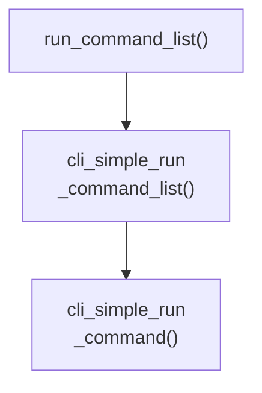

run_command_list()定义，RK3566-2017：

```C
# /common/cli.c

int run_command_list(const char *cmd, int len, int flag)
{
	int need_buff = 1;
	char *buff = (char *)cmd;	/* cast away const */
	int rcode = 0;

	if (len == -1) {
		len = strlen(cmd);
#ifdef CONFIG_HUSH_PARSER
		/* hush will never change our string */
		need_buff = 0;
#else
		/* the built-in parser will change our string if it sees \n */
		need_buff = strchr(cmd, '\n') != NULL;
#endif
	}
	if (need_buff) {
		buff = malloc(len + 1);
		if (!buff)
			return 1;
		memcpy(buff, cmd, len);
		buff[len] = '\0';
	}
#ifdef CONFIG_HUSH_PARSER
	rcode = parse_string_outer(buff, FLAG_PARSE_SEMICOLON);
#else
	/*
	 * This function will overwrite any \n it sees with a \0, which
	 * is why it can't work with a const char *. Here we are making
	 * using of internal knowledge of this function, to avoid always
	 * doing a malloc() which is actually required only in a case that
	 * is pretty rare.
	 */
#ifdef CONFIG_CMDLINE
	rcode = cli_simple_run_command_list(buff, flag);
#else
	rcode = board_run_command(buff);
#endif
#endif
	if (need_buff)
		free(buff);

	return rcode;
}
```

> # 来自GPT的分析法
>
> 下面按 “代码行为→与 U-Boot 2017（RK3566）实际配置的关联→易错点/侧写→调用链” 重新解读这段 **`common/cli.c: run_command_list()`**，聚焦 **U-Boot 2017、Rockchip RK3566** 场景。
>
> ------
>
> ## 1) 它到底做了什么（逐行要点）
>
> ```
> int run_command_list(const char *cmd, int len, int flag)
> ```
>
> - `cmd`：一串命令，可包含多条（`;` 或 `\n` 分隔）。
> - `len`：命令串长度；传 `-1` 则内部用 `strlen()`。
> - `flag`：仅 **内置解析器(simple parser)** 路径会用到，Hush 路径忽略。
>
> ### A. 计算长度 & 是否需要复制
>
> - 若 `len == -1`：
>   - `len = strlen(cmd);`
>   - **Hush 启用**：`need_buff = 0`（Hush 不修改输入串）。
>   - **Hush 关闭**（走 simple parser）：`need_buff = (strchr(cmd, '\n') != NULL)`
>      simple 解析器会把 `'\n'` 原地改成 `'\0'`，只有看到换行才需要复制，避免改坏只读区。
> - 若 `len != -1`：**保守起见总是复制**（`need_buff=1`），因为这可能是非 NUL 结尾的子串。
>
> ### B. 如需复制就 `malloc(len+1)` → `memcpy()` → 末尾补 `'\0'`
>
> ### C. 选择解析器并执行
>
> - **Hush 启用 (`CONFIG_HUSH_PARSER`)**：
>    `rcode = parse_string_outer(buff, FLAG_PARSE_SEMICOLON);`
>    只给分号标志；**不会使用入参 `flag`**。
> - **Hush 关闭**：
>   - 若 `CONFIG_CMDLINE`：`rcode = cli_simple_run_command_list(buff, flag);`
>   - 否则：`rcode = board_run_command(buff);`（极精简配置）
>
> ### D. 如有分配则 `free(buff)`；返回 `rcode`（0 通常表示成功）。
>
> ------
>
> ## 2) 放到 **U-Boot 2017 / RK3566** 的真实环境里
>
> - **使用阶段**：基本只在 **U-Boot proper**（DDR 已可用）编进来；RK3566 的 SPL 通常不启交互命令行，这个函数多在“完整 U-Boot”里用。
> - **Rockchip 常见 defconfig（2017 代）**：
>    多数默认 **启用 Hush 解析器**（`CONFIG_HUSH_PARSER=y`），同时 `CONFIG_CMDLINE=y`、`CONFIG_CMDLINE_EDITING=y`。
>    ⇒ **典型路径**是 **Hush**：`parse_string_outer()`，**零拷贝**（`need_buff=0`）前提是 `len==-1` 传入；否则仍会复制一次。
> - **命令分隔**：
>   - Hush：解析 `;`，并支持更复杂的语法（变量、`&&`、`||`、子 shell 等——取决于裁剪）。
>   - simple parser：把 `\n` 改为 `'\0'` 切开，再逐个喂给 `cli_simple_run_command()`；`flag` 会影响是否把换行当分隔符继续执行等（例如“遇错是否继续”一类标志）。
> - **内存**：proper 阶段 `malloc()` 已可用，分配/释放没问题；SPL 若未启 `CONFIG_SYS_SPL_MALLOC_SIZE` 或未编此模块，则不会走到这里。
>
> ------
>
> ## 3) 行为细节与易错点（2017 分支常见“坑”）
>
> 1. **`len != -1` 就一定复制**
>     这是“安全保守”设计：避免对非 NUL 结尾的子串越界读取/原地修改。
>    - 若你在上层经常用子串调用（带显式 `len`），会多一次 `malloc/memcpy`，有轻微性能/堆碎片成本。
> 2. **Hush 路径忽略 `flag`**
>     在 Hush 下，`flag` 没被传递（始终 `FLAG_PARSE_SEMICOLON`）。
>    - 如果你依赖 `flag` 控制“遇错是否继续”等行为，这在 Hush 与 simple 之间会**不一致**。
>    - 需要时只能在 Hush 侧自己扩展 parse 标志。
> 3. **simple 解析器会改写输入**
>     只有 `cmd` 中真的含 `\n` 时才会触发复制，否则零拷贝、直接改写原串。
>    - 如果原串来自只读段（例如环境里的常量池、字符常量），**务必确保 `len==-1` 且字符串里包含 `\n` 才会复制**；否则可能改坏只读内存（崩）。
> 4. **返回码语义来自下游**
>    - Hush：一般返回 **最后一条命令**的退出码（0/非0）。
>    - simple：`cli_simple_run_command_list()`/`cli_simple_run_command()` 约定通常是 0=成功，1=失败；遇多条命令，可能返回最后一条的码或按“遇错即停”的策略返回（看 `flag`）。
> 5. **大命令串的堆占用**
>     需要复制时是一次性 `len+1`，如果你喂入非常长的脚本，会吃一块儿大堆；Hush 零拷贝能省一次，但还是会在解析期申请临时对象。
>
> ------
>
> ## 4) 建议（针对 RK3566/2017 的工程化取舍）
>
> - **如果你已经启用 Hush（推荐）**
>   - 尽量传 `len==-1` 的 NUL 结尾字符串，省一次复制。
>   - 把**复杂命令行逻辑**放 Hush，避免在 simple 分支里维护两套行为。
>   - 如需“错误继续/停止”等控制逻辑，用 Hush 的语法（`cmd1 && cmd2` / `cmd1 || cmd2`）表达，别依赖 `flag`（Hush 不用它）。
> - **如果必须用 simple 解析器**
>   - 上层**主动复制**或保证传入可写缓冲，尤其当命令里有 `\n`。
>   - 谨慎使用 `flag`，并在调用端明确其语义（比如“遇错是否继续”）。
>
> ------
>
> ## 5) 与下游调用链（2017 典型）
>
> - Hush：
>    `run_command_list → parse_string_outer → run_list → do_run / run_pipe / run_list* → run_command`（内部再分派到内建命令）
> - Simple：
>    `run_command_list → cli_simple_run_command_list → cli_simple_run_command → run_command → cmd_tbl->cmd()`
>
> 你之前已经画过几张调用链，可补一张这个函数的**两分支路径**：
>
> ```mermaid
> flowchart TD
>   A["run_command_list<br>(cmd,len,flag)"]
>   B["是否启用 <br>CONFIG_HUSH_PARSER?"]
>
>   A --> B
>
>   B -->|是| C["检查 need_buff <br>(依据 len 和换行符)"]
>   C -->|是| D["分配内存: malloc <br>+ memcpy + 补 NUL"]
>   C -->|否| E["直接使用原始 cmd"]
>   D --> F["调用 <br>parse_string_outer<br>(...; SEMICOLON)"]
>   E --> F
>   F --> G["如有分配则释放内存 free"]
>   G --> H["返回 rcode"]
>
>   B -->|否| I["检查 need_buff <br>(依据 len 和换行符)"]
>   I -->|是| J["分配内存: malloc +<br> memcpy + 补 NUL"]
>   I -->|否| K["直接使用原始 cmd"]
>   J --> L["调用 <br>cli_simple_run_<br>command_list<br>(buff, flag)"]
>   K --> L
>   L --> M["如有分配则释放内存 free"]
>   M --> N["返回 rcode"]
>
> ```
>
> ------
>
> ## 6) 一句话收束（贴近 RK3566/2017）
>
> > **在 RK3566 的 U-Boot proper（2017 系）里，常见配置启用 Hush：`run_command_list()` 大多“零拷贝+分号分割”直接交给 Hush；只有当你关闭 Hush 或传入子串（显式 `len`）时，才会走复制/simple 分支。**
> >  选 Hush = 语法强 + 更少拷贝；选 simple = 行为可控但要自担改写输入的风险与 `flag` 语义维护成本。
>
>
>
> # 来自cursor的分析
>
> 我来详细分析 `run_command_list` 函数的作用。
>
> Ran tool
> Read file: common/cli.c
> Read file: common/cli_simple.c
> Read file: common/cli_simple.c
> Read file: common/cli_simple.c
> Read file: common/autoboot.c
> Read file: common/main.c
> 现在我来详细分析 `run_command_list` 函数的作用：
>
> ## `run_command_list` 函数详细分析
>
> ### 1. **函数定义和参数**
>
> ```c
> int run_command_list(const char *cmd, int len, int flag)
> ```
>
> **参数说明：**
> - `cmd`: 要执行的命令字符串
> - `len`: 命令字符串长度（-1 表示自动计算）
> - `flag`: 执行标志位
>
> ### 2. **核心功能**
>
> `run_command_list` 函数是 U-Boot 中**批量执行命令的核心函数**，主要作用包括：
>
> #### **A. 命令解析和预处理**
> ```c
> if (len == -1) {
>     len = strlen(cmd);
> #ifdef CONFIG_HUSH_PARSER
>     need_buff = 0;  // Hush 解析器不会修改原字符串
> #else
>     need_buff = strchr(cmd, '\n') != NULL;  // 简单解析器会修改字符串
> #endif
> }
> ```
>
> #### **B. 内存管理**
> - 根据解析器类型决定是否需要复制命令字符串
> - Hush 解析器：不需要复制（不会修改原字符串）
> - 简单解析器：需要复制（会修改字符串中的换行符）
>
> #### **C. 解析器选择**
> ```c
> #ifdef CONFIG_HUSH_PARSER
>     rcode = parse_string_outer(buff, FLAG_PARSE_SEMICOLON);
> #else
>     rcode = cli_simple_run_command_list(buff, flag);
> #endif
> ```
>
> ### 3. **执行流程**
>
> #### **使用 Hush 解析器时：**
> 1. 直接调用 `parse_string_outer()` 解析整个命令字符串
> 2. 支持复杂的 shell 语法（变量、条件、循环等）
>
> #### **使用简单解析器时：**
> 1. 调用 `cli_simple_run_command_list()`
> 2. 按行分割命令（以 `\n` 为分隔符）
> 3. 逐行执行每个命令
>
> ### 4. **命令分割机制**
>
> 在 `cli_simple_run_command_list()` 中：
>
> ```c
> while (*next) {
>     if (*next == '\n') {
>         *next = '\0';  // 将换行符替换为字符串结束符
>         if (*line) {   // 只执行非空命令
>             debug("** exec: \"%s\"\n", line);
>             if (cli_simple_run_command(line, 0) < 0) {
>                 rcode = 1;
>                 break;  // 遇到错误就停止执行
>             }
>         }
>         line = next + 1;
>     }
>     ++next;
> }
> ```
>
> ### 5. **主要使用场景**
>
> #### **A. 自动启动命令**
> ```c
> // common/autoboot.c
> run_command_list(s, -1, 0);  // 执行 bootcmd 环境变量中的命令
> ```
>
> #### **B. 预启动命令**
> ```c
> // common/main.c
> run_command_list(p, -1, 0);  // 执行 preboot 环境变量中的命令
> ```
>
> #### **C. 菜单命令**
> ```c
> // common/autoboot.c
> run_command_list(s, -1, 0);  // 执行 menucmd 环境变量中的命令
> ```
>
> #### **D. 脚本文件执行**
> ```c
> // cmd/source.c
> return run_command_list((char *)data, len, 0);  // 执行脚本文件内容
> ```
>
> ### 6. **错误处理**
>
> - **返回值**：0 表示成功，非 0 表示失败
> - **错误传播**：一旦某个命令执行失败，后续命令将不会执行
> - **中断处理**：支持 Ctrl+C 中断执行
>
> ### 7. **安全特性**
>
> - **字符串保护**：通过复制字符串避免修改原始命令
> - **长度检查**：防止缓冲区溢出
> - **权限控制**：支持安全启动模式下的命令限制
>
> ### 8. **实际应用示例**
>
> ```bash
> # 典型的 bootcmd 内容
> bootcmd=run distro_bootcmd; run bootcmd_0; run bootcmd_1; run bootcmd_2
>
> # 这会被 run_command_list 解析为：
> # 1. run distro_bootcmd
> # 2. run bootcmd_0
> # 3. run bootcmd_1
> # 4. run bootcmd_2
> ```
>
> ### 9. **总结**
>
> `run_command_list` 函数是 U-Boot 命令执行系统的**核心枢纽**，它：
>
> - **统一接口**：为不同来源的命令提供统一的执行入口
> - **批量处理**：支持一次执行多个命令
> - **灵活解析**：支持不同的命令解析器
> - **错误控制**：提供完整的错误处理和中断机制
> - **安全执行**：确保命令执行的安全性和稳定性
>
> 这个函数在 U-Boot 的启动流程、脚本执行、自动启动等关键场景中发挥着重要作用。

### 8.1.2_cli_simple_run_command_list

cli_simple_run_command_list()定义，RK3566-2017：

```c
# /common/cli.c

int cli_simple_run_command_list(char *cmd, int flag)
{
	char *line, *next;
	int rcode = 0;

	/*
	 * Break into individual lines, and execute each line; terminate on
	 * error.
	 */
	next = cmd;
	line = cmd;
	while (*next) {
		if (*next == '\n') {
			*next = '\0';
			/* run only non-empty commands */
			if (*line) {
				debug("** exec: \"%s\"\n", line);
				if (cli_simple_run_command(line, 0) < 0) {
					rcode = 1;
					break;
				}
			}
			line = next + 1;
		}
		++next;
	}
	if (rcode == 0 && *line)
		rcode = (cli_simple_run_command(line, 0) < 0);

	return rcode;
}
```

> # Cursor:
>
> 我来详细分析 `cli_simple_run_command_list()` 函数。
>
> Read file: common/cli_simple.c
> Read file: common/cli_simple.c
> Read file: common/cli_simple.c
> Read file: common/cli_simple.c
> 现在我来详细分析 `cli_simple_run_command_list()` 函数：
>
> ## `cli_simple_run_command_list()` 函数详细分析
>
> ### 1. **函数定义**
>
> ```c
> int cli_simple_run_command_list(char *cmd, int flag)
> ```
>
> **参数说明：**
> - `cmd`: 包含多个命令的字符串，以换行符分隔
> - `flag`: 执行标志位
>
> ### 2. **核心功能**
>
> 这个函数是 U-Boot 简单命令解析器的**批量命令执行器**，主要作用是将包含多个命令的字符串按行分割并逐行执行。
>
> ### 3. **执行流程图**
>
> ```mermaid
> flowchart TD
>     A[开始: cli_simple_run_command_list] --> B[初始化变量]
>     B --> C[next = cmd, line = cmd]
>     C --> D{*next != '\0'?}
>     D -->|否| E{rcode == 0 且 *line 非空?}
>     D -->|是| F{*next == '\n'?}
>     F -->|是| G[*next = '\0']
>     G --> H{*line 非空?}
>     H -->|是| I[执行命令: <br>cli_simple_run_command]
>     H -->|否| J[跳过空命令]
>     I --> K{执行成功?}
>     K -->|否| L[rcode = 1, break]
>     K -->|是| M[line = next + 1]
>     J --> M
>     F -->|否| N[next++]
>     M --> D
>     N --> D
>     L --> O[返回 rcode]
>     E -->|是| P[执行最后一行命令]
>     E -->|否| Q[返回 rcode]
>     P --> R{执行成功?}
>     R -->|否| S[rcode = 1]
>     R -->|是| T[rcode = 0]
>     S --> O
>     T --> O
>     Q --> O
>     O --> U[结束]
> ```
>
> ### 4. **详细执行过程**
>
> #### **A. 初始化阶段**
> ```c
> char *line, *next;
> int rcode = 0;
>
> next = cmd;    // 指向命令字符串开始
> line = cmd;    // 指向当前行开始
> ```
>
> #### **B. 逐字符扫描**
> ```c
> while (*next) {
>     if (*next == '\n') {
>         *next = '\0';  // 将换行符替换为字符串结束符
>         // 处理当前行...
>         line = next + 1;  // 移动到下一行开始
>     }
>     ++next;
> }
> ```
>
> #### **C. 命令执行**
> ```c
> if (*line) {  // 只执行非空命令
>     debug("** exec: \"%s\"\n", line);
>     if (cli_simple_run_command(line, 0) < 0) {
>         rcode = 1;
>         break;  // 遇到错误就停止执行
>     }
> }
> ```
>
> #### **D. 最后一行处理**
> ```c
> if (rcode == 0 && *line)
>     rcode = (cli_simple_run_command(line, 0) < 0);
> ```
>
> ### 5. **关键特性**
>
> #### **A. 错误传播机制**
> ```mermaid
> flowchart LR
>     A[命令1] --> B{执行成功?}
>     B -->|是| C[命令2]
>     B -->|否| D[停止执行]
>     C --> E{执行成功?}
>     E -->|是| F[命令3]
>     E -->|否| D
>     F --> G[继续...]
>     D --> H[返回错误]
> ```
>
> #### **B. 空命令处理**
> - 自动跳过空行
> - 只执行包含实际内容的命令
>
> #### **C. 字符串修改**
> - 直接修改输入字符串中的换行符
> - 这就是为什么 `run_command_list` 需要复制字符串的原因
>
> ### 6. **与 `cli_simple_run_command` 的关系**
>
> ```mermaid
> flowchart TD
>     A[cli_simple_run_command_list] --> B[按行分割命令]
>     B --> C[逐行调用]
>     C --> D[cli_simple_run_command]
>     D --> E[解析单个命令]
>     E --> F[处理分隔符和宏]
>     F --> G[执行命令]
>     G --> H{还有行?}
>     H -->|是| C
>     H -->|否| I[返回结果]
> ```
>
> ### 7. **实际使用示例**
>
> ```bash
> # 输入命令字符串
> "setenv bootdelay 3\nsetenv bootcmd 'run distro_bootcmd'\nboot"
>
> # 执行过程
> # 第1行: setenv bootdelay 3
> # 第2行: setenv bootcmd 'run distro_bootcmd'
> # 第3行: boot
> ```
>
> ### 8. **错误处理**
>
> ```mermaid
> flowchart TD
>     A[开始执行] --> B[执行第1个命令]
>     B --> C{成功?}
>     C -->|是| D[执行第2个命令]
>     C -->|否| E[设置错误标志]
>     D --> F{成功?}
>     F -->|是| G[继续执行]
>     F -->|否| E
>     E --> H[停止执行]
>     H --> I[返回错误码]
>     G --> J[执行完成]
>     J --> K[返回成功]
> ```
>
> ### 9. **性能特点**
>
> - **内存效率**：直接修改原字符串，无需额外内存
> - **执行效率**：逐行处理，支持早期退出
> - **错误处理**：遇到错误立即停止，避免无效执行
>
> ### 10. **限制和注意事项**
>
> #### **A. 字符串修改**
> - 会修改输入字符串中的换行符
> - 调用者需要确保字符串可写
>
> #### **B. 错误传播**
> - 一旦某个命令失败，后续命令不会执行
> - 适合需要严格顺序执行的场景
>
> #### **C. 简单语法**
> - 只支持换行符分隔
> - 不支持复杂的 shell 语法
>
> ### 11. **总结**
>
> `cli_simple_run_command_list()` 函数是 U-Boot 简单命令解析器的核心组件，它：
>
> - **批量处理**：支持一次执行多个命令
> - **错误控制**：严格的错误传播机制
> - **高效执行**：直接字符串操作，无需额外内存
> - **简单可靠**：专注于基本的命令执行功能
>
> 这个函数在 U-Boot 的自动启动、脚本执行等场景中发挥着重要作用，为复杂的启动流程提供了简单而可靠的命令执行基础。

### 8.1.3_cli_simple_run_command

cli_simple_run_command定义，RK3566-2017：

```c
# /common/cli.c

/*
 * WARNING:
 *
 * We must create a temporary copy of the command since the command we get
 * may be the result from env_get(), which returns a pointer directly to
 * the environment data, which may change magicly when the command we run
 * creates or modifies environment variables (like "bootp" does).
 */
int cli_simple_run_command(const char *cmd, int flag)
{
	char cmdbuf[CONFIG_SYS_CBSIZE];	/* working copy of cmd		*/
	char *token;			/* start of token in cmdbuf	*/
	char *sep;			/* end of token (separator) in cmdbuf */
	char finaltoken[CONFIG_SYS_CBSIZE];
	char *str = cmdbuf;
	char *argv[CONFIG_SYS_MAXARGS + 1];	/* NULL terminated	*/
	int argc, inquotes;
	int repeatable = 1;
	int rc = 0;

	debug_parser("[RUN_COMMAND] cmd[%p]=\"", cmd);
	if (DEBUG_PARSER) {
		/* use puts - string may be loooong */
		puts(cmd ? cmd : "NULL");
		puts("\"\n");
	}
	clear_ctrlc();		/* forget any previous Control C */

	if (!cmd || !*cmd)
		return -1;	/* empty command */

	if (strlen(cmd) >= CONFIG_SYS_CBSIZE) {
		puts("## Command too long!\n");
		return -1;
	}

	strcpy(cmdbuf, cmd);

	/* Process separators and check for invalid
	 * repeatable commands
	 */

	debug_parser("[PROCESS_SEPARATORS] %s\n", cmd);
	while (*str) {
		/*
		 * Find separator, or string end
		 * Allow simple escape of ';' by writing "\;"
		 */
		for (inquotes = 0, sep = str; *sep; sep++) {
			if ((*sep == '\'') &&
			    (*(sep - 1) != '\\'))
				inquotes = !inquotes;

			if (!inquotes &&
			    (*sep == ';') &&	/* separator		*/
			    (sep != str) &&	/* past string start	*/
			    (*(sep - 1) != '\\'))	/* and NOT escaped */
				break;
		}

		/*
		 * Limit the token to data between separators
		 */
		token = str;
		if (*sep) {
			str = sep + 1;	/* start of command for next pass */
			*sep = '\0';
		} else {
			str = sep;	/* no more commands for next pass */
		}
		debug_parser("token: \"%s\"\n", token);

		/* find macros in this token and replace them */
		cli_simple_process_macros(token, finaltoken);

		/* Extract arguments */
		argc = cli_simple_parse_line(finaltoken, argv);
		if (argc == 0) {
			rc = -1;	/* no command at all */
			continue;
		}

		if (cmd_process(flag, argc, argv, &repeatable, NULL))
			rc = -1;

		/* Did the user stop this? */
		if (had_ctrlc())
			return -1;	/* if stopped then not repeatable */
	}

	return rc ? rc : repeatable;
}
```

> Cursor说：
>
> ## `cli_simple_run_command()` 函数详细分析
>
> ### 1. **函数定义**
>
> ```c
> int cli_simple_run_command(const char *cmd, int flag)
> ```
>
> **参数说明：**
> - `cmd`: 单个命令字符串，可能包含多个以分号分隔的子命令
> - `flag`: 执行标志位
>
> ### 2. **核心功能**
>
> 这个函数是 U-Boot 简单命令解析器的**单个命令执行器**，主要作用包括：
> - 解析以分号分隔的多个子命令
> - 处理环境变量宏替换
> - 解析命令行参数
> - 执行具体的命令
>
> ### 3. **主执行流程**
>
> ```mermaid
> flowchart TD
>     A[开始: <br>cli_simple_run_command] --> B[初始化变量和缓冲区]
>     B --> C[清除 Ctrl+C 标志]
>     C --> D{命令有效?}
>     D -->|否| E[返回错误 -1]
>     D -->|是| F{命令长度检查}
>     F -->|超长| G[返回错误 -1]
>     F -->|正常| H[复制命令到工作缓冲区]
>     H --> I[开始处理分隔符]
>     I --> J{还有字符?}
>     J -->|否| K[处理最后一个令牌]
>     J -->|是| L[查找分号分隔符]
>     L --> M[处理引号转义]
>     M --> N{找到分隔符?}
>     N -->|是| O[分割命令]
>     N -->|否| P[继续查找]
>     O --> Q[处理宏替换]
>     P --> L
>     Q --> R[解析命令行参数]
>     R --> S{参数有效?}
>     S -->|否| T[继续下一个令牌]
>     S -->|是| U[执行命令]
>     U --> V{执行成功?}
>     V -->|否| W[设置错误标志]
>     V -->|是| X{还有令牌?}
>     T --> X
>     X -->|是| I
>     X -->|否| Y[返回结果]
>     K --> Q
>     W --> Y
>     E --> Z[结束]
>     G --> Z
>     Y --> Z
> ```
>
> ### 4. **详细执行过程**
>
> #### **A. 初始化和验证**
> ```c
> char cmdbuf[CONFIG_SYS_CBSIZE];  // 工作缓冲区
> char *token;                     // 当前令牌开始
> char *sep;                       // 分隔符位置
> char finaltoken[CONFIG_SYS_CBSIZE];  // 宏处理后的令牌
> char *argv[CONFIG_SYS_MAXARGS + 1];  // 参数数组
> int argc, inquotes;
> int repeatable = 1;
> int rc = 0;
>
> clear_ctrlc();  // 清除 Ctrl+C 标志
>
> // 验证命令
> if (!cmd || !*cmd)
>     return -1;  // 空命令
>
> if (strlen(cmd) >= CONFIG_SYS_CBSIZE) {
>     puts("## Command too long!\n");
>     return -1;  // 命令太长
> }
>
> strcpy(cmdbuf, cmd);  // 复制到工作缓冲区
> ```
>
> #### **B. 分隔符处理流程**
>
> ```mermaid
> flowchart TD
>     A[开始处理分隔符] --> B[初始化引号状态]
>     B --> C[逐字符扫描]
>     C --> D{遇到单引号?}
>     D -->|是| E{前一个字符是转义符?}
>     E -->|否| F[切换引号状态]
>     E -->|是| G[继续扫描]
>     F --> H{遇到分号?}
>     G --> H
>     D -->|否| H
>     H -->|是| I{在引号内?}
>     H -->|否| J[继续扫描]
>     I -->|是| J
>     I -->|否| K{前一个字符是转义符?}
>     K -->|是| J
>     K -->|否| L[找到分隔符]
>     J --> M{还有字符?}
>     M -->|是| C
>     M -->|否| N[处理最后一个令牌]
>     L --> O[分割命令]
>     O --> P[处理宏替换]
>     N --> P
> ```
>
> #### **C. 宏处理流程**
>
> ```mermaid
> flowchart TD
>     A[开始宏处理] --> B[状态机初始化]
>     B --> C[逐字符处理]
>     C --> D{当前状态?}
>     D -->|状态0| E{遇到$?}
>     D -->|状态1| F{"遇到(或{?"}
>     D -->|状态2| G{"遇到)或}?"}
>     D -->|状态3| H{遇到'?}
>     E -->|是| I[进入状态1]
>     E -->|否| J[复制字符]
>     F -->|是| K[进入状态2]
>     F -->|否| L[回到状态0]
>     G -->|是| M[获取环境变量值]
>     G -->|否| N[继续状态2]
>     H -->|是| O[回到状态0]
>     H -->|否| P[复制字符]
>     I --> Q[继续处理]
>     J --> Q
>     K --> Q
>     L --> Q
>     M --> Q
>     N --> Q
>     O --> Q
>     P --> Q
>     Q --> R{还有字符?}
>     R -->|是| C
>     R -->|否| S[完成宏处理]
> ```
>
> #### **D. 参数解析流程**
>
> ```mermaid
> flowchart TD
>     A[开始参数解析] --> B[跳过空白字符]
>     B --> C{遇到字符串结束?}
>     C -->|是| D[返回参数数量]
>     C -->|否| E[记录参数开始]
>     E --> F[查找参数结束]
>     F --> G{遇到空白字符?}
>     G -->|是| H[添加字符串结束符]
>     G -->|否| I[继续查找]
>     H --> J[参数计数+1]
>     I --> F
>     J --> K{参数数量超限?}
>     K -->|是| L[返回错误]
>     K -->|否| B
>     D --> M[结束]
>     L --> M
> ```
>
> ### 5. **关键特性**
>
> #### **A. 分隔符处理**
> - 支持分号 `;` 分隔多个命令
> - 支持引号内的分号转义
> - 支持反斜杠转义分号 `\;`
>
> #### **B. 宏替换**
> - 支持 `$(var)` 和 `${var}` 格式
> - 支持单引号内的宏不替换
> - 支持转义字符处理
>
> #### **C. 错误处理**
> - 命令长度检查
> - 参数数量限制
> - Ctrl+C 中断处理
>
> ### 6. **实际执行示例**
>
> ```bash
> # 输入命令
> "setenv bootdelay 3; echo 'Current delay: ${bootdelay}'; boot"
>
> # 执行过程
> # 第1个令牌: setenv bootdelay 3
> # 第2个令牌: echo 'Current delay: ${bootdelay}'
> # 第3个令牌: boot
> ```
>
> ### 7. **与相关函数的关系**
>
> ```mermaid
> flowchart TD
>     A[cli_simple_run_command] --> B[分隔符处理]
>     B --> C[宏替换处理]
>     C --> D[参数解析]
>     D --> E[命令执行]
>
>     B --> F[cli_simple_process_macros]
>     D --> G[cli_simple_parse_line]
>     E --> H[cmd_process]
>
>     F --> I[环境变量替换]
>     G --> J[参数数组构建]
>     H --> K[查找并执行命令]
> ```
>
> ### 8. **性能特点**
>
> - **内存效率**：使用栈上缓冲区，避免动态分配
> - **解析效率**：单次扫描完成分隔符处理和宏替换
> - **错误恢复**：支持部分命令执行失败后的继续处理
>
> ### 9. **限制和注意事项**
>
> #### **A. 语法限制**
> - 只支持基本的分号分隔
> - 不支持复杂的 shell 语法（如管道、重定向）
> - 宏替换功能相对简单
>
> #### **B. 内存限制**
> - 命令长度受 `CONFIG_SYS_CBSIZE` 限制
> - 参数数量受 `CONFIG_SYS_MAXARGS` 限制
>
> #### **C. 错误处理**
> - 遇到错误会继续处理后续命令
> - 返回最后一个错误状态
>
> ### 10. **总结**
>
> `cli_simple_run_command()` 函数是 U-Boot 简单命令解析器的核心执行引擎，它：
>
> - **灵活解析**：支持多命令分隔和宏替换
> - **高效执行**：单次扫描完成多种处理
> - **安全可靠**：完善的错误检查和边界保护
> - **易于扩展**：模块化的设计便于功能增强
>
> 这个函数为 U-Boot 提供了强大而灵活的命令执行能力，是命令行界面的重要基础组件。


run_command_list，从字面意思就知道，它是用于运行多条命令。多条命令之间用“; ”分割。例如定义命令 ：

```text
bootcmd=cmd1; cmd2; cmd3;
```

则 run_command_list(bootcmd, …)就可以依次运行 bootcmd 中指定的多条命令

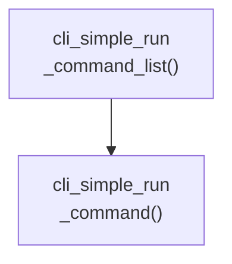

直接调用 cli_simple_run_command，当uboot 等待用户输入命令时，如果你输入了一个命令，就是靠 run_command_repeatable 来解析执行的

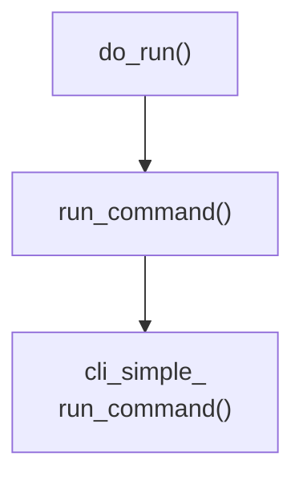

do_run 是 run 命令的实现函数, 当 u-boot 等待用户输入命令时，我们也可以在命令行通过run cmd1的方式来运行命令 cmd1。没有很深入的研究输入run cmd1 和直接输入cmd1有何不同，看上去是一样的，都能运行cmd1 这个命令。

cli_simple_process_macros：替换命令中的宏。这里表明我们可以在命令中使用一些宏。例如用一 个宏。

```text
ALL_CMD=cmd2; cmd3; cmd4;
```

代表一个命令集合，然后编写命令

```text
bootcmd=cmd1;ALL_CMD;
```

那么宏替换完毕之后，

```text
bootcmd=cmd1;cmd2;cmd3;cmd4
```

cli_simple_parse_line：解析出每个命令的参数。

例如

```text
setenv bootargs console=ttyS0;
```

setenv 是命令，后面的是参数。

cmd_process：运行这个命令

### 8.1.4_cmd_process

代码路径: common/command.c

```c
# /common/command.c

enum command_ret_t cmd_process(int flag, int argc, char * const argv[],
			       int *repeatable, ulong *ticks)
{
	enum command_ret_t rc = CMD_RET_SUCCESS;
	cmd_tbl_t *cmdtp;

	/* Look up command in command table */
	cmdtp = find_cmd(argv[0]);
	if (cmdtp == NULL) {
		printf("Unknown command '%s' - try 'help'\n", argv[0]);
		return 1;
	}

	/* found - check max args */
	if (argc > cmdtp->maxargs)
		rc = CMD_RET_USAGE;

#if defined(CONFIG_CMD_BOOTD)
	/* avoid "bootd" recursion */
	else if (cmdtp->cmd == do_bootd) {
		if (flag & CMD_FLAG_BOOTD) {
			puts("'bootd' recursion detected\n");
			rc = CMD_RET_FAILURE;
		} else {
			flag |= CMD_FLAG_BOOTD;
		}
	}
#endif

	/* If OK so far, then do the command */
	if (!rc) {
		if (ticks)
			*ticks = get_timer(0);
		rc = cmd_call(cmdtp, flag, argc, argv);
		if (ticks)
			*ticks = get_timer(*ticks);
		*repeatable &= cmdtp->repeatable;
	}
	if (rc == CMD_RET_USAGE)
		rc = cmd_usage(cmdtp);
	return rc;
}
```

> 我来详细分析 `cmd_process()` 函数。
>
> Read file: common/command.c
> Ran tool
> Read file: common/command.c
> Read file: common/command.c
> Ran tool
> Read file: include/command.h
> 现在我来详细分析 `cmd_process()` 函数：
>
> ## `cmd_process()` 函数详细分析
>
> ### 1. **函数定义**
>
> ```c
> enum command_ret_t cmd_process(int flag, int argc, char * const argv[],
>                                int *repeatable, ulong *ticks)
> ```
>
> **参数说明：**
> - `flag`: 执行标志位（如 CMD_FLAG_REPEAT, CMD_FLAG_BOOTD 等）
> - `argc`: 参数数量
> - `argv`: 参数数组（argv[0] 是命令名）
> - `repeatable`: 可重复执行标志的指针
> - `ticks`: 命令执行时间的指针
>
> **返回值：**
> ```c
> enum command_ret_t {
>     CMD_RET_SUCCESS,    /* 0 = 成功 */
>     CMD_RET_FAILURE,    /* 1 = 失败 */
>     CMD_RET_USAGE = -1, /* 失败，需要显示用法信息 */
> };
> ```
>
> ### 2. **核心功能**
>
> `cmd_process()` 函数是 U-Boot 命令系统的**核心执行引擎**，负责：
> - 在命令表中查找命令
> - 验证参数数量
> - 执行命令函数
> - 处理执行结果和错误
>
> ### 3. **执行流程图**
>
> ```mermaid
> flowchart TD
>     A[开始: cmd_process] --> B[初始化返回值 rc = <br>CMD_RET_SUCCESS]
>     B --> C[在命令表中查找命令: <br>find_cmd]
>     C --> D{命令找到?}
>     D -->|否| E[打印未知命令错误]
>     D -->|是| F{参数数量检查}
>     E --> Z[返回错误码 1]
>     F -->|参数过多| G[设置 rc = <br>CMD_RET_USAGE]
>     F -->|参数正常| H{特殊命令检查}
>     H -->|bootd命令| I{检测递归?}
>     I -->|是| J[设置 rc = <br>CMD_RET_FAILURE]
>     I -->|否| K[设置 <br>CMD_FLAG_BOOTD 标志]
>     H -->|其他命令| L{rc == 0?}
>     G --> L
>     J --> L
>     K --> L
>     L -->|是| M[记录开始时间]
>     L -->|否| N[跳过执行]
>     M --> O[调用命令函数: <br>cmd_call]
>     O --> P[记录结束时间]
>     P --> Q[更新 repeatable 标志]
>     N --> R{rc == CMD_RET_USAGE?}
>     Q --> R
>     R -->|是| S[显示命令用法: <br>cmd_usage]
>     R -->|否| T[返回 rc]
>     S --> T
>     T --> U[结束]
> ```
>
> ### 4. **详细执行过程**
>
> #### **A. 命令查找**
> ```c
> cmdtp = find_cmd(argv[0]);
> if (cmdtp == NULL) {
>     printf("Unknown command '%s' - try 'help'\n", argv[0]);
>     return 1;
> }
> ```
>
> #### **B. 参数验证**
> ```c
> if (argc > cmdtp->maxargs)
>     rc = CMD_RET_USAGE;
> ```
>
> #### **C. 特殊命令处理**
> ```c
> #if defined(CONFIG_CMD_BOOTD)
> /* 避免 "bootd" 递归 */
> else if (cmdtp->cmd == do_bootd) {
>     if (flag & CMD_FLAG_BOOTD) {
>         puts("'bootd' recursion detected\n");
>         rc = CMD_RET_FAILURE;
>     } else {
>         flag |= CMD_FLAG_BOOTD;
>     }
> }
> #endif
> ```
>
> #### **D. 命令执行**
> ```c
> if (!rc) {
>     if (ticks)
>         *ticks = get_timer(0);  // 记录开始时间
>     rc = cmd_call(cmdtp, flag, argc, argv);  // 执行命令
>     if (ticks)
>         *ticks = get_timer(*ticks);  // 计算执行时间
>     *repeatable &= cmdtp->repeatable;  // 更新可重复标志
> }
> ```
>
> #### **E. 错误处理**
> ```c
> if (rc == CMD_RET_USAGE)
>     rc = cmd_usage(cmdtp);  // 显示命令用法
> ```
>
> ### 5. **命令查找机制**
>
> ```mermaid
> flowchart TD
>     A[find_cmd] --> B[获取命令表起始位置和长度]
>     B --> C[调用 find_cmd_tbl]
>     C --> D[遍历命令表]
>     D --> E{比较命令名}
>     E -->|匹配| F{完全匹配?}
>     E -->|不匹配| G[继续下一个命令]
>     F -->|是| H[返回命令指针]
>     F -->|否| I[记录部分匹配]
>     G --> J{还有命令?}
>     J -->|是| D
>     J -->|否| K{只有一个部分匹配?}
>     I --> L[继续查找]
>     L --> J
>     K -->|是| M[返回部分匹配的命令]
>     K -->|否| N[返回 NULL]
>     H --> O[结束]
>     M --> O
>     N --> O
> ```
>
> ### 6. **命令执行机制**
>
> ```mermaid
> flowchart TD
>     A[cmd_call] --> B[调用命令函数指针]
>     B --> C[执行具体命令实现]
>     C --> D{执行结果}
>     D -->|成功| E[返回 0]
>     D -->|失败| F[返回错误码]
>     E --> G[结束]
>     F --> H[打印调试信息]
>     H --> I[返回错误码]
>     I --> G
> ```
>
> ### 7. **关键特性**
>
> #### **A. 命令查找**
> - 支持完全匹配和部分匹配
> - 支持命令名中的点号分隔符（如 `cp.b`）
> - 避免歧义命令
>
> #### **B. 参数验证**
> - 检查参数数量是否超过命令的最大参数限制
> - 参数过多时显示用法信息
>
> #### **C. 递归检测**
> - 防止 `bootd` 命令的无限递归
> - 通过标志位跟踪命令执行状态
>
> #### **D. 性能监控**
> - 可选的时间统计功能
> - 记录命令执行耗时
>
> #### **E. 可重复性**
> - 跟踪命令是否可重复执行
> - 影响命令历史记录功能
>
> ### 8. **错误处理机制**
>
> ```mermaid
> flowchart TD
>     A[命令执行] --> B{执行结果}
>     B -->|CMD_RET_SUCCESS| C[成功返回]
>     B -->|CMD_RET_FAILURE| D[失败返回]
>     B -->|CMD_RET_USAGE| E[显示用法信息]
>     C --> F[结束]
>     D --> F
>     E --> F
> ```
>
> ### 9. **实际使用示例**
>
> ```c
> // 执行 "setenv bootdelay 3" 命令
> char *argv[] = {"setenv", "bootdelay", "3"};
> int repeatable = 1;
> ulong ticks = 0;
>
> int result = cmd_process(0, 3, argv, &repeatable, &ticks);
> if (result == CMD_RET_SUCCESS) {
>     printf("Command executed successfully in %lu ticks\n", ticks);
> } else {
>     printf("Command failed with error %d\n", result);
> }
> ```
>
> ### 10. **总结**
>
> `cmd_process()` 函数是 U-Boot 命令系统的**核心枢纽**，它：
>
> - **统一接口**：为所有命令提供统一的执行入口
> - **安全检查**：验证命令存在性和参数有效性
> - **错误处理**：提供完整的错误处理和反馈机制
> - **性能监控**：支持命令执行时间统计
> - **扩展性**：支持特殊命令的定制处理
>
> 这个函数确保了 U-Boot 命令系统的可靠性、安全性和可维护性，是整个命令行界面的重要基础。

每一个命令在实现的时候，都会定义自己的调用接口(cmdtp->cmd)。

cmd_call 就是通过调用 cmdtp->cmd 来运行这个命令的

```c
if (rc == CMD_RET_USAGE)
    rc = cmd_usage(cmdtp);
```

每一个命令在实现的时候，都会定义一个usage 接口(cmdtp->help)

这里的意思是如果命令执行不成功，则调用cmdtp->help，把本命令的帮助信息打印出来

至此, 命令的执行流程就分析完毕了


## 8.2_定义一个命令

在 u-boot中，该如何定义一个命令呢？弄清楚这个问题后，我们也能知道u-boot 已经定义了哪些命令。

命令的定义用的是一个宏: U_BOOT_CMD

每个命令用一个结构体来描述: cmd_tbl_t

### 8.2.1_cmd_tbl_t

代码路径: include/command.h

```c
# /include/command.h

/*
 * Monitor Command Table
 */

struct cmd_tbl_s {
	char	*name;		/* Command Name			*/
	int		maxargs;	/* maximum number of arguments	*/
	int		repeatable;	/* autorepeat allowed?		*/
						/* Implementation function	*/
	int		(*cmd)(struct cmd_tbl_s *, int, int, char * const []);
	char	*usage;		/* Usage message	(short)	*/
#ifdef	CONFIG_SYS_LONGHELP
	char	*help;		/* Help  message	(long)	*/
#endif
#ifdef CONFIG_AUTO_COMPLETE
	/* do auto completion on the arguments */
	int		(*complete)(int argc, char * const argv[], char last_char, int maxv, char *cmdv[]);
#endif
};

typedef struct cmd_tbl_s	cmd_tbl_t;
```

### 8.2.2_U_BOOT_CMD

代码路径：include/command.h
```c
# /include/command.h
/*
 * Command Flags:
 */
#define CMD_FLAG_REPEAT		0x0001	/* repeat last command		*/
#define CMD_FLAG_BOOTD		0x0002	/* command is from bootd	*/
#define CMD_FLAG_ENV		0x0004	/* command is from the environment */

#ifdef CONFIG_AUTO_COMPLETE
# define _CMD_COMPLETE(x) x,
#else
# define _CMD_COMPLETE(x)
#endif
#ifdef CONFIG_SYS_LONGHELP
# define _CMD_HELP(x) x,
#else
# define _CMD_HELP(x)
#endif

#define U_BOOT_CMD_MKENT_COMPLETE(_name, _maxargs, _rep, _cmd,		\
				_usage, _help, _comp)			\
		{ #_name, _maxargs, _rep, _cmd, _usage,			\
			_CMD_HELP(_help) _CMD_COMPLETE(_comp) }

#define U_BOOT_CMD_MKENT(_name, _maxargs, _rep, _cmd, _usage, _help)	\
	U_BOOT_CMD_MKENT_COMPLETE(_name, _maxargs, _rep, _cmd,		\
					_usage, _help, NULL)

#define U_BOOT_CMD_COMPLETE(_name, _maxargs, _rep, _cmd, _usage, _help, _comp) \
	ll_entry_declare(cmd_tbl_t, _name, cmd) =			\
		U_BOOT_CMD_MKENT_COMPLETE(_name, _maxargs, _rep, _cmd,	\
						_usage, _help, _comp);

#define U_BOOT_CMD(_name, _maxargs, _rep, _cmd, _usage, _help)		\
	U_BOOT_CMD_COMPLETE(_name, _maxargs, _rep, _cmd, _usage, _help, NULL)
```
该文件还有一个分支，不过没有裁剪到uboot：
```c
#ifndef	__ASSEMBLY__			/* 该宏在/Makefile 有所定义，这条分支是不会嵌入到uboot的 */
/*
 * Monitor Command Table
 */

struct cmd_tbl_s {
	char	*name;		/* Command Name			*/
	int		maxargs;	/* maximum number of arguments	*/
	int		repeatable;	/* autorepeat allowed?		*/
						/* Implementation function	*/
	int		(*cmd)(struct cmd_tbl_s *, int, int, char * const []);
	char	*usage;		/* Usage message	(short)	*/
#ifdef	CONFIG_SYS_LONGHELP
	char	*help;		/* Help  message	(long)	*/
#endif
#ifdef CONFIG_AUTO_COMPLETE
	/* do auto completion on the arguments */
	int		(*complete)(int argc, char * const argv[], char last_char, int maxv, char *cmdv[]);
#endif
};

typedef struct cmd_tbl_s	cmd_tbl_t;


#if defined(CONFIG_CMD_RUN)
extern int do_run(cmd_tbl_t *cmdtp, int flag, int argc, char * const argv[]);
#endif

/* common/command.c */
int _do_help (cmd_tbl_t *cmd_start, int cmd_items, cmd_tbl_t * cmdtp, int
	      flag, int argc, char * const argv[]);
cmd_tbl_t *find_cmd(const char *cmd);
cmd_tbl_t *find_cmd_tbl (const char *cmd, cmd_tbl_t *table, int table_len);

extern int cmd_usage(const cmd_tbl_t *cmdtp);

#ifdef CONFIG_AUTO_COMPLETE
extern int var_complete(int argc, char * const argv[], char last_char, int maxv, char *cmdv[]);
extern int cmd_auto_complete(const char *const prompt, char *buf, int *np, int *colp);
#endif

/**
 * cmd_process_error() - report and process a possible error
 *
 * @cmdtp: Command which caused the error
 * @err: Error code (0 if none, -ve for error, like -EIO)
 * @return 0 if there is not error, 1 (CMD_RET_FAILURE) if an error is found
 */
int cmd_process_error(cmd_tbl_t *cmdtp, int err);

/*
 * Monitor Command
 *
 * All commands use a common argument format:
 *
 * void function (cmd_tbl_t *cmdtp, int flag, int argc, char * const argv[]);
 */

#if defined(CONFIG_CMD_MEMORY)		\
	|| defined(CONFIG_CMD_I2C)	\
	|| defined(CONFIG_CMD_ITEST)	\
	|| defined(CONFIG_CMD_PCI)	\
	|| defined(CONFIG_CMD_PORTIO)
#define CMD_DATA_SIZE
extern int cmd_get_data_size(char* arg, int default_size);
#endif

#ifdef CONFIG_CMD_BOOTD
extern int do_bootd(cmd_tbl_t *cmdtp, int flag, int argc, char * const argv[]);
#endif
#ifdef CONFIG_CMD_BOOTM
extern int do_bootm(cmd_tbl_t *cmdtp, int flag, int argc, char * const argv[]);
extern int bootm_maybe_autostart(cmd_tbl_t *cmdtp, const char *cmd);
#else
static inline int bootm_maybe_autostart(cmd_tbl_t *cmdtp, const char *cmd)
{
	return 0;
}
#endif

extern int do_bootz(cmd_tbl_t *cmdtp, int flag, int argc, char * const argv[]);

extern int do_booti(cmd_tbl_t *cmdtp, int flag, int argc, char * const argv[]);

extern int common_diskboot(cmd_tbl_t *cmdtp, const char *intf, int argc,
			   char *const argv[]);

extern int do_reset(cmd_tbl_t *cmdtp, int flag, int argc, char * const argv[]);
extern int do_poweroff(cmd_tbl_t *cmdtp, int flag, int argc, char * const argv[]);

/*
 * Error codes that commands return to cmd_process(). We use the standard 0
 * and 1 for success and failure, but add one more case - failure with a
 * request to call cmd_usage(). But the cmd_process() function handles
 * CMD_RET_USAGE itself and after calling cmd_usage() it will return 1.
 * This is just a convenience for commands to avoid them having to call
 * cmd_usage() all over the place.
 */
enum command_ret_t {
	CMD_RET_SUCCESS,	/* 0 = Success */
	CMD_RET_FAILURE,	/* 1 = Failure */
	CMD_RET_USAGE = -1,	/* Failure, please report 'usage' error */
};

/**
 * Process a command with arguments. We look up the command and execute it
 * if valid. Otherwise we print a usage message.
 *
 * @param flag		Some flags normally 0 (see CMD_FLAG_.. above)
 * @param argc		Number of arguments (arg 0 must be the command text)
 * @param argv		Arguments
 * @param repeatable	This function sets this to 0 if the command is not
 *			repeatable. If the command is repeatable, the value
 *			is left unchanged.
 * @param ticks		If ticks is not null, this function set it to the
 *			number of ticks the command took to complete.
 * @return 0 if the command succeeded, 1 if it failed
 */
int cmd_process(int flag, int argc, char * const argv[],
			       int *repeatable, unsigned long *ticks);

void fixup_cmdtable(cmd_tbl_t *cmdtp, int size);
#endif	/* __ASSEMBLY__ */

```


#

[^ 1 ]: 交叉编译器环境变量
[^ 2 ]: 芯片架构环境变量
[^ 3 ]: 指定开发板的型号，这里的配置需要根据开发板厂商的配置文件来进行选择
[^ crt0.S和crt0_64.S]: crt0.S和crt0_64.S是通过 `CONFIG_ARM` 和 `CONFIG_ARM64` 来选择何时加入到项目中的。


# 第9章_附录

## 9.1_CONFIG_SYS_MALLOC_F_LEN的作用

> [!NOTE]
>
> 内容摘抄至GPT。

**提问：解释下，base +=CONFIG_SYS_MALLOC_F_LEN的作用。我指的是通过uboot对于global_data的划分方面。**

好的，我结合 **U-Boot 的 `global_data` 内存布局** 来解释一下 `base += CONFIG_SYS_MALLOC_F_LEN` 的作用。

------

### 9.1.1_背景_global_data_的存放位置

在 U-Boot 中，`global_data`（简称 **gd**）是一个保存全局运行时状态的重要结构体，定义在 `include/asm-generic/global_data.h` 里。
 它通常被放在一段特殊的内存区域，这块区域的分布大致包含：

- `global_data` 自身结构体（`gd_t`）
- early malloc 区域（`malloc_f`，对应 `CONFIG_SYS_MALLOC_F_LEN`）
- 堆（malloc pool，`malloc_r`，对应 `CONFIG_SYS_MALLOC_LEN`）
- 堆栈（stack）
- 其他运行时需要的 buffer（比如 fdt、bd_info、bootargs 等）

U-Boot 在启动早期就会初始化一块连续的内存作为这些用途。

------

### 9.1.2_CONFIG_SYS_MALLOC_F_LEN_的意义

`CONFIG_SYS_MALLOC_F_LEN` 定义了 **early malloc 区域**（fast malloc）的大小，通常用于在内存管理器完全初始化之前（还没有 DDR 堆或者 malloc_r 的时候），提供一小段动态分配空间。

- 举例：在 DRAM 初始化之前，板级代码或驱动可能需要动态分配一点小内存（比如临时 buffer、I²C 描述符等），这时只能用这块区域。
- 这块内存分配在 `global_data` 紧邻区域，由 `base += CONFIG_SYS_MALLOC_F_LEN` 来推进 `gd` 后续区域的地址。

------

### 9.1.3_base_+=_CONFIG_SYS_MALLOC_F_LEN_的作用

在 `board_init_f_alloc_reserve()`（或类似函数）里，U-Boot 会逐块计算 **gd 所需的内存布局**，类似下面的逻辑：

```c
ulong base = ...;   // 一开始指向预留区域的起始地址

// 1. 先分配 gd 自身
gd = (gd_t *)base;
base += sizeof(gd_t);

// 2. 再分配 early malloc 区
gd->malloc_base = base;
base += CONFIG_SYS_MALLOC_F_LEN;

// 3. 再分配其它，比如 bd_t, 设备树, 堆栈...
```

这里的
 `base += CONFIG_SYS_MALLOC_F_LEN;`
 就是在 **内存布局上跳过一段早期 malloc 区域的大小**，相当于“把指针挪到下一块区域的起点”。

------

### 9.1.4_为什么要这么做

- 保证 **各区域互不覆盖**。gd 自身、early malloc 区、后续堆和栈必须有清晰的边界。
- 这种线性递增的 `base` 用法，能快速、简洁地在启动时把 `global_data` 的内存布局计算出来。
- 由于 `malloc_f` 在 DRAM 可用前就会启用，所以必须紧挨在 `gd` 之后，方便通过 `gd->malloc_base` 管理。

------

✅ 总结一句：
 `base += CONFIG_SYS_MALLOC_F_LEN` 的作用是 **在 U-Boot 初始化 `global_data` 的划分时，跳过 early malloc 区域的大小**，确保 `global_data` 后续的区域（如堆、栈等）不会覆盖这块早期分配用的内存。


