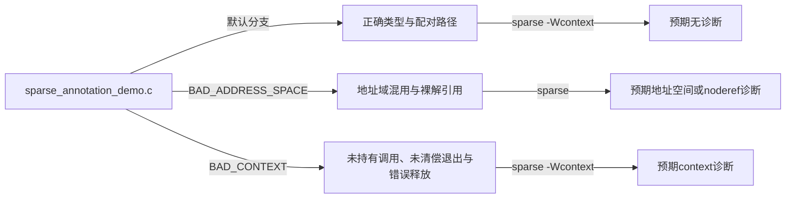

# 第1章\_Sparse\_地址空间与上下文记账实验

## 1.1\_实验目标

本实验用一份不依赖内核启动的 C 文件，分别验证两类正交状态：

1. `address_space + noderef` 怎样把机器表示相同的指针区分成逻辑类型；
2. `context + __context__` 怎样沿成功、失败和返回路径维护抽象计数。

实验不会取得真实锁，也不会访问真实用户地址。它只证明 Sparse 是否看见预期契约，不能证明内核运行时同步、用户访问和对象生命期正确。

专题前置知识见 [Linux 内核编译器与静态分析注解专题](../../../../knowledge/foundations/c_language/kernel_static_annotations/大纲.md#1.3_阅读依赖图)。

## 1.2\_参与者与观察点



| 对象 | 状态保存在哪里 | 谁写入 | 谁读取 |
| --- | --- | --- | --- |
| `struct record __user *` | Sparse 类型系统 | 声明和宏展开 | 赋值、形参匹配与解引用分析 |
| `lock` 的 context 计数 | Sparse 当前控制流状态 | `__acquire()`、`__release()` 与函数属性 | 函数调用、分支合流和返回检查 |
| `BAD_*` 开关 | 预处理条件 | `make` 命令行 | C 预处理器 |

## 1.3\_环境要求

推荐使用 Linux 构建主机：

```text
GNU make
GCC或Clang预处理器
Sparse静态分析器
```

确认工具版本：

```bash
make --version
gcc --version
sparse --version
```

发行版可以使用自己的软件包管理器安装 Sparse，也可以从官方源码构建。实验记录中应保存实际版本，不要只写“使用最新版”。

## 1.4\_先观察两个预处理分支

在实验目录执行：

```bash
make preprocess-sparse | less
make preprocess-compiler | less
```

第一条命令定义 `__CHECKER__`，预期保留 `address_space`、`context` 和 `__context__`；第二条模拟普通编译，预期看到这些注解退化为空或 `(void)0`。

这一步只观察记号展开，不运行 Sparse。若两份输出相同，应先检查命令、当前目录和预处理宏，而不是继续解释后续诊断。

## 1.5\_建立无告警基线

```bash
make check-good
```

默认代码只包含：

- `__user` 指针传入具有相同地址域要求的空检查函数；
- `fake_lock()`、`requires_lock()`、`fake_unlock()` 的完整配对；
- `__cond_lock()` 只在成功分支增加 context，分支内完成释放。

预期 Sparse 不报告 address-space、noderef 或 context 问题。若基线已经告警，应先核对 Sparse 版本和源码，不要把后续故意错误混进结果。

## 1.6\_制造地址空间错误

```bash
make check-address-space
```

`BAD_ADDRESS_SPACE` 打开以下代码：

```c
struct record *plain = source;
return source->value + plain->value;
```

预期诊断至少指向以下一种或多种问题：

- `__user` 指针赋给普通指针时地址域不兼容；
- 直接使用 `source->value` 解引用 `noderef` 指针。

不同 Sparse 版本的警告措辞和数量可能不同。验收重点是能把每条诊断还原到“类型域转换”或“受限指针直接解引用”，不是逐字匹配固定输出。

## 1.7\_制造上下文错误

```bash
make check-context
```

`BAD_CONTEXT` 打开三条错误路径：

1. 没有取得就调用 `__must_hold(lock)` 函数；
2. 取得后直接返回，留下未清偿 context；
3. 没有取得就调用 `__releases(lock)` 函数。

预期出现 context 相关诊断。还原报告时画出每条路径上的计数：

```text
正确：0 → fake_lock → 1 → requires_lock → 1 → fake_unlock → 0
漏取：0 → requires_lock，但入口契约要求1
漏放：0 → fake_lock → 1 → 函数退出仍为1
多放：0 → fake_unlock，但入口契约要求1
```

## 1.8\_同时打开两类错误

```bash
make check-all
```

这一步不是追求更多警告，而是练习分类：

| 诊断类别 | 应回到哪里修复 |
| --- | --- |
| different address spaces、restricted type | 指针声明、转换和访问接口 |
| dereference of noderef expression | 专用访问器边界 |
| context imbalance、unexpected unlock | 函数契约、成功分支和退出配对 |

不要使用 `__force` 处理 context 错误，也不要使用 `__acquire()` 掩盖用户指针裸解引用。两类状态彼此独立。

## 1.9\_变体练习

### 1.9.1\_把成功分支改成无条件登记

临时把：

```c
__cond_lock(lock, succeeds)
```

改成在条件判断前无条件执行 `__acquire(lock)`。预测失败路径会发生什么，再运行 `make check-good`。重点观察“静态账本说已经取得”怎样与真实条件结果分离。

### 1.9.2\_删除检查函数的user形参

把 `check_user_pointer()` 的形参改成普通 `const volatile void *`。预测调用点失去了哪条类型约束，再运行地址空间错误实验。这个变体证明函数名不是 Sparse 关键字。

### 1.9.3\_只运行普通编译器

```bash
gcc -Wall -Wextra -fsyntax-only sparse_annotation_demo.c
```

比较它与 Sparse 输出。普通编译通过不能推出 Sparse 地址域与 context 契约已经检查。

## 1.10\_清理与结果记录

实验不生成持久构建产物，`make clean` 为空操作：

```bash
make clean
```

建议把个人结果记录在独立日期文件中，至少包含：

```text
操作系统与发行版
Sparse版本
GCC或Clang版本
执行命令
原始诊断
按类型状态/路径状态分类后的解释
与本文预期的差异
```

仓库当前 Windows 会话未安装 Sparse，因此本实验在提交前只能进行源码和结构静态审查，不能附带伪造的运行结果。完成 Linux 实机验证后，再将真实观测作为新的 `expected/` 记录提交。

## 1.11\_实验结论边界

完成实验后可以证明：在记录的 Sparse 版本与命令下，分析器能够消费这些最小注解，并对故意打开的类型或 context 错误产生诊断。

它不能证明真实 Linux `copy_from_user()`、锁、Lockdep、RCU 或对象生命期实现正确。继续回到 [使用 Sparse 与设计注解](../../../../knowledge/foundations/c_language/kernel_static_annotations/P06_在Linux内核中使用Sparse与设计注解.md#6.8_与哪些工具搭配)，把静态结果接入对应功能层的验证工具。
