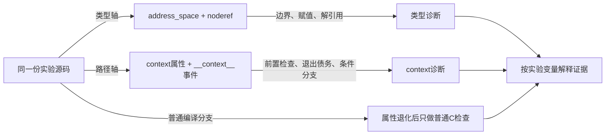

# 第1章\_Sparse\_地址空间与上下文记账实验

## 1.1\_实验目标

前面的知识正文已经说明 `__user` 怎样进入 Sparse 类型系统、`__context__()` 怎样改变路径账本，以及普通编译为什么可能看不见这些约束。本实验不再重复定义，而是让读者从头完成一条 **提出假设 → 建立干净基线 → 一次只改变一个变量 → 观察诊断 → 解释状态变化 → 恢复正确契约 → 自动复验** 的研究闭环。

实验围绕同一个 `struct record __user *source` 和同一个抽象 `lock`，依次回答：

1. `__CHECKER__` 是否真的改变了分析器看到的程序？
2. 一个函数体为空的类型检查函数为什么仍能形成边界？删除形参上的地址域以后，哪条诊断会消失？
3. 地址域转换错误与 `noderef` 裸解引用是不是同一件事？
4. “调用前必须持有”“返回前必须清偿”“不能凭空释放”分别由哪条路径触发？
5. `__cond_lock()` 为什么只能在条件成功的分支增加 context？
6. 包装函数已经执行 `__acquire()` 时，为什么仍需要对调用者可见的 `__acquires()` 契约？
7. 同一份故意错误代码为什么可以通过普通 GCC 语法检查，却被 Sparse 拒绝？

完成实验的判据不是“执行过 `make`”，而是能够针对每一轮写出：实验假设、唯一改变量、原始诊断、诊断对应的类型或路径状态、修复位置和证明边界。

专题前置知识见 [Linux 内核编译器与静态分析注解专题](../../../../knowledge/foundations/c_language/kernel_static_annotations/大纲.md#1.3_阅读依赖图)，工程引导见 [第 6 章：在 Linux 内核中使用 Sparse 与设计注解](../../../../knowledge/foundations/c_language/kernel_static_annotations/P06_在Linux内核中使用Sparse与设计注解.md#6.3_先画实验地图再运行命令)。

## 1.2\_实验对象与两条正交状态轴

实验目录包含三个独立实验文件和一个 Kbuild 子目录：

| 文件 | 职责 | 是否产生真实内核行为 |
| --- | --- | --- |
| `sparse_annotation_demo.c` | 提供正确基线和由 `-D...` 逐个启用的反例 | 否；不访问用户内存，也不取得真实锁 |
| `Makefile` | 固定每轮命令，使一次实验只打开一个变量 | 否；只调用预处理器、编译器和 Sparse |
| `verify.sh` | 核对正确样例必须静默、错误样例必须出现预期诊断类别 | 否；只验证静态分析输出 |
| `kernel_module/` | 在真实内核构建目录中比较 `C=1/C=2`，并让 `CF` 打开地址域反例 | 只构建模块，不加载模块 |



两条状态轴必须分开记录：

| 状态轴 | 状态保存在哪里 | 谁建立或修改 | 谁消费 | 本实验怎样观察 |
| --- | --- | --- | --- | --- |
| 指针类型状态 | Sparse 的类型表示 | `address_space(1)`、`noderef` 与声明位置 | 形参与实参检查、赋值和解引用分析 | `different address spaces`、`dereference of noderef expression` |
| 路径 context 状态 | Sparse 对当前控制流路径维护的抽象账本 | 函数 `context(...)` 契约和 `__context__()` 语句 | 调用点检查、基本块合流和函数退出检查 | `context check failure`、`wrong count at exit`、`unexpected unlock` 等 |

实验中的 `fake_lock()`、`fake_unlock()` 和 `__cond_lock()` 只操纵静态账本。即使变量名叫 `lock`，它们也不会产生原子指令、禁止抢占或影响其他线程。

## 1.3\_环境准备与实验纪律

推荐在 Linux 构建主机运行，至少准备：

```text
POSIX shell
GNU make
GCC或兼容预处理器
Sparse静态分析器
grep
```

进入实验目录后先运行：

```bash
cd labs/foundations/c_language/P01_Sparse地址空间与上下文记账
make doctor
```

`doctor` 应打印 Sparse、GCC 和 GNU make 的实际入口及版本。若第一条命令就提示找不到 `sparse`，先回到第 6 章的[安装与入口确认](../../../../knowledge/foundations/c_language/kernel_static_annotations/P06_在Linux内核中使用Sparse与设计注解.md#6.2_安装并确认Sparse入口)，不要继续把“工具没有运行”误判成“代码没有问题”。

每轮实验遵守四条纪律：

1. 先写预测，再运行命令；
2. 一次只使用本节指定的一个或一组对照宏；
3. 保存完整输出，不只抄最后一行；
4. 先恢复 `make check-good` 的静默基线，再进入下一轮。

建议复制下面的记录模板：

```text
实验编号：
Sparse/GCC/make版本：
待验证假设：
唯一改变量：
执行命令：
预期诊断类别：
实际输出：
类型或路径状态怎样变化：
应修功能代码、接口类型还是注解：
本轮能证明什么：
本轮不能证明什么：
```

## 1.4\_先观察两个预处理分支

### 1.4.1\_假设与操作

假设：同一份源码在定义 `__CHECKER__` 时会保留 Sparse 专用属性和 `__context__` 语句；普通编译分支则把这些记号退化为空属性或无副作用表达式。

执行：

```bash
make preprocess-sparse > /tmp/sparse-branch.i
make preprocess-compiler > /tmp/compiler-branch.i

grep -nE 'address_space\(|noderef|__context__|__attribute__.*context' /tmp/sparse-branch.i
grep -nE 'address_space\(|noderef|__context__|__attribute__.*context' /tmp/compiler-branch.i
```

### 1.4.2\_预期观察与解释

Sparse 分支应能找到 `address_space`、`noderef`、`context` 或 `__context__`；普通编译分支不应保留这些实验宏产生的 Sparse 语义。此时还没有运行 Sparse，观察到的只是 **分析输入不同**，不是“已经发现错误”。

若两份输出相同，按以下顺序定位：

1. 查看 `make` 打印的预处理命令，确认 Sparse 分支包含 `-D__CHECKER__`；
2. 确认当前目录中的源码确实是本实验文件；
3. 搜索完整输出，而不是只看开头几行；
4. 在分支差异没有恢复前，不解释后续静态诊断。

本轮能证明预处理器向两个消费者交付了不同记号，不能证明 Sparse 对这些记号采用了什么语义。下一轮才让分析器消费它们。

## 1.5\_建立无告警基线

### 1.5.1\_先读正确路径

默认源码包含三条正确路径：

```c
static void address_space_good(struct record __user *source)
{
    check_user_pointer(source);
}

static void context_good(int *lock)
{
    fake_lock(lock);
    requires_lock(lock);
    fake_unlock(lock);
}

static void conditional_context_good(int *lock, int succeeds)
{
    if (__cond_lock(lock, succeeds)) {
        requires_lock(lock);
        fake_unlock(lock);
    }
}
```

第一条路径让 `__user` 实参进入同域形参；第二条路径的账本是 `0 → 1 → 1 → 0`；第三条路径只在 `succeeds != 0` 的分支登记 `+1`，并在同一分支清偿 `-1`。

### 1.5.2\_运行与验收

```bash
make check-good
```

预期没有地址域、`noderef` 或 context 诊断。这里的静默结果只有在以下条件同时成立时才有效：

- `make doctor` 已确认 Sparse 入口；
- 命令确实分析 `sparse_annotation_demo.c`；
- 没有打开任何 `BAD_*` 或 `ERASE_*` 宏；
- 当前 Sparse 版本接受实验使用的语法。

若基线已经报警，先保存输出并修复环境或实验基线。带着一个不干净的对照组继续做反例，会使后续任何诊断都无法归因。

## 1.6\_类型边界实验\_空函数怎样把实参送进检查

### 1.6.1\_实验A\_保留形参契约

待验证假设：`check_boundary_pointer()` 即使不读 `pointer`，形参上的 `__user` 仍会迫使 Sparse 在调用点比较实参与形参地址域。

唯一改变量是打开 `BAD_ADDRESS_BOUNDARY`，让普通内核对象地址传给用户地址域形参：

```bash
make check-address-boundary
```

对应反例是：

```c
static struct record kernel_record;

check_boundary_pointer(&kernel_record);
```

预期出现包含 `different address spaces` 的诊断。函数体是否为空不影响形参类型；检查发生在调用表达式的类型匹配阶段。

### 1.6.2\_实验B\_只删除形参地址域

现在保留完全相同的调用点，只通过 `ERASE_BOUNDARY_CONTRACT` 把检查函数形参从 `const volatile void __user *` 退化为普通 `const volatile void *`：

```bash
make check-address-boundary-erased
```

预期本轮不再出现地址域诊断。对照关系是：

| 项目 | 实验A | 实验B |
| --- | --- | --- |
| 调用者 | 相同 | 相同 |
| 传入对象 | 相同的普通内核对象 | 相同的普通内核对象 |
| 函数体 | 相同的空检查体 | 相同的空检查体 |
| 唯一差异 | 形参带 `__user` | 形参不带 `__user` |
| 预期 | 地址域诊断 | 诊断消失 |

这组 A/B 实验说明诊断来自 **类型契约**，不是函数名、函数体或运行时访问。诊断消失也不表示传参突然变安全，而是分析器失去了表达“不允许这样传”的类型证据。

## 1.7\_地址空间与noderef实验\_把两种错误拆开

### 1.7.1\_实验A\_只做地址域赋值

```bash
make check-address-assignment
```

唯一新增代码是：

```c
struct record *plain = source;

(void)plain;
```

这里没有解引用 `source`，所以预期核心诊断是 `different address spaces`。它回答的是：**能否把一个受限地址域指针静默降格为普通指针？**

### 1.7.2\_实验B\_只做受限指针裸解引用

```bash
make check-noderef
```

唯一新增代码是：

```c
return source->value;
```

这里没有先赋给普通指针，预期核心诊断是 `dereference of noderef expression`。它回答的是：**即使变量仍保留正确地址域，是否允许用普通 C 解引用替代专用访问协议？**

### 1.7.3\_为什么必须分两轮

如果把赋值和解引用写在同一反例里，一条后续诊断可能是前一条错误传播产生的次生结果。分开以后可以得到两个独立结论：

- `address_space` 约束指针在哪些逻辑域之间流动；
- `noderef` 约束这种指针能否被普通解引用表达式直接消费。

实验仍不能证明真实 `copy_from_user()` 已完成访问检查，也不能证明用户页在运行时可访问；它只证明分析器能够区分这两种静态误用。

## 1.8\_context基本实验\_前置状态退出债务与错误释放

本节固定同一个账本初值 `0`，分别打开一个错误。不要使用 `make check-all` 代替这三轮，因为那会失去诊断与路径的单一对应关系。

### 1.8.1\_实验A\_未持有就调用

```bash
make check-context-call
```

反例路径：

```text
入口0 → requires_lock要求入口至少为1 → 条件不满足
```

预期出现 `context check failure` 或版本等价的 context 诊断。这里没有 `+1` 或 `-1`，错误来自调用点不满足 `__must_hold(lock)` 的前置状态。

### 1.8.2\_实验B\_取得后直接返回

```bash
make check-context-exit
```

反例路径：

```text
入口0 → fake_lock登记+1 → 函数退出仍为1
```

预期出现 `wrong count at exit` 或版本等价诊断。分析器不是说真实锁一定已经取得，而是说当前函数声明的退出状态与路径账本不一致。

### 1.8.3\_实验C\_没有取得就释放

```bash
make check-context-release
```

反例路径：

```text
入口0 → fake_unlock要求并登记-1 → 账本试图进入负债
```

预期出现 `unexpected unlock` 或版本等价诊断。这里的“unlock”来自 Sparse 对 context 模式的诊断措辞，不表示实验执行了真实解锁指令。

### 1.8.4\_三轮结果怎样比较

| 反例 | 缺失的契约 | 诊断观察点 | 常见真实修复 |
| --- | --- | --- | --- |
| 未持有调用 | 调用前没有建立所需状态 | 调用点 context check | 在正确成功路径取得，或修正错误的 `__must_hold()` 声明 |
| 未清偿退出 | 某条返回路径缺少释放 | 函数退出计数 | 把退出汇聚到统一清理路径 |
| 凭空释放 | 释放前没有相应取得 | `-1` 事件位置 | 删除错误释放，或补回真正被遗漏的取得路径 |

三个问题可能都含有“lock”一词，但它们对应不同时间边界，不能压缩成一句“锁不平衡”。

## 1.9\_条件取得实验\_为什么记账必须跟随成功分支

### 1.9.1\_先预测正确的两条路径

默认实现是：

```c
if (__cond_lock(lock, succeeds)) {
    requires_lock(lock);
    fake_unlock(lock);
}
```

两条路径分别为：

```text
失败：入口0 → condition为0 → 不执行__acquire → 退出0
成功：入口0 → condition非0 → __acquire登记+1 → requires_lock看到1 → fake_unlock登记-1 → 退出0
```

这也是 `make check-good` 静默的组成部分。

### 1.9.2\_制造错误\_在判断结果以前无条件登记

```bash
make check-conditional-context
```

错误变体把 `__acquire(lock)` 放到条件判断以前：

```c
__acquire(lock);
if (succeeds) {
    requires_lock(lock);
    fake_unlock(lock);
}
```

此时路径变成：

| 路径 | 账本变化 | 退出状态 |
| --- | --- | --- |
| `succeeds != 0` | `0 → 1 → 1 → 0` | 平衡 |
| `succeeds == 0` | `0 → 1` | 留下债务 |

预期出现 `different lock contexts for basic block`、`wrong count at exit` 或版本等价诊断。关键不是背诵某一句输出，而是能够指出：错误的 `+1` 发生在条件结果还没有筛掉失败路径以前。

本轮说明 `__cond_lock()` 的价值是让 **布尔结果与账本变化共享同一个分支边界**。它仍不证明 `succeeds` 来自真实 trylock，也不证明这个布尔值与硬件锁状态一致；真实包装层必须先保证功能结果正确。

## 1.10\_包装层契约实验\_函数体正确不等于调用者看得见

`fake_lock()` 的函数体执行 `__acquire(lock)`，声明又带 `__acquires(lock)`。二者职责不同：

- 函数体事件用于核对包装函数自身是否兑现 `0 → 1`；
- 函数属性把入口/出口变化传播给调用者。

### 1.10.1\_红灯\_只擦掉调用者可见契约

```bash
make check-wrapper-contract
```

`ERASE_LOCK_WRAPPER_CONTRACT` 只删除 `fake_lock()` 声明上的 `__acquires(lock)`，保留函数体内的 `__acquire(lock)`。预期至少出现 context 不平衡：包装函数自身产生 `+1` 却没有声明相应出口变化，调用者也无法从一次普通函数调用推断已经取得。

### 1.10.2\_绿灯\_恢复属性并复验

```bash
make check-good
```

恢复属性后，包装函数自身的实现事件与函数契约一致，调用者路径也重新获得 `+1`。这个红灯—绿灯对照说明：**实现动作、实现检查和跨函数传播是三个需要对齐的视角。** 只在函数体塞入静态事件，不能代替公开接口契约。

## 1.11\_普通编译对照\_同一份错误为何仍能通过

本轮同时打开前述所有故意错误，但改由普通 GCC 处理未定义 `__CHECKER__` 的分支：

```bash
make compile-compiler
```

预期 GCC 在 `-Wall -Wextra -Werror -fsyntax-only` 下通过。原因不是故意错误变得正确，而是普通分支中：

- `__user`、`__must_hold()`、`__acquires()` 和 `__releases()` 退化为空；
- `__acquire()`、`__release()` 退化为无副作用表达式；
- 所有指针在普通 C 类型系统中重新具有相同地址表示；
- 编译器没有 Sparse 那份路径 context 账本。

把本轮与 `make check-all` 并排记录，能够建立一个重要反例：**普通编译通过不能推出 Sparse 契约已经检查，更不能推出这些契约对应的运行时协议正确。**

## 1.12\_自动复验与混合诊断分类

### 1.12.1\_先让脚本复验每个单变量实验

```bash
make verify
```

`make verify` 先重复普通 GCC 对照，再由 `verify.sh` 执行以下断言：

- 正确基线必须没有诊断；
- 擦掉空函数形参契约以后，原地址域边界诊断必须消失；
- 地址域赋值和 `noderef` 解引用必须分别出现对应类别；
- 三种 context 基本错误、条件取得错误和包装层缺约必须出现 context 类别。

脚本匹配诊断类别而不固定行号和整句排版，以容纳 Sparse 版本间的输出差异。若脚本失败，应查看它打印的实际输出并判断：是工具版本改变了措辞、实验假设不成立，还是出现了与目标无关的新基线诊断。不要为了让脚本变绿而无条件扩大正则。

### 1.12.2\_最后才同时打开所有错误

```bash
make check-all 2>&1 | tee /tmp/sparse-check-all.log
```

把输出按下表分类：

| 诊断线索 | 状态轴 | 回到哪个单变量实验 | 首先检查的修复位置 |
| --- | --- | --- | --- |
| `different address spaces` | 指针地址域 | 1.6 或 1.7.1 | 形参类型、赋值方向、专用访问接口 |
| `dereference of noderef expression` | 受限指针访问 | 1.7.2 | 访问器边界，不能用普通解引用替代 |
| `context check failure` | 调用前置状态 | 1.8.1 | 调用以前的取得路径或错误契约 |
| `wrong count at exit` | 返回路径债务 | 1.8.2 | 失败返回、`goto` 清理和声明出口状态 |
| `unexpected unlock` | 错误释放 | 1.8.3 | 取得/释放配对 |
| `different lock contexts` | 分支合流不一致 | 1.9 | 条件事件放置位置 |

混合运行只用于训练分类，不用于发现单个机制的因果关系；因果关系已经由前面的单变量实验建立。

## 1.13\_把独立实验接入真实Kbuild

前面的实验直接调用 Sparse，证明的是分析器本身能够消费注解；它还没有证明 Kbuild 会为某个内核配置和目标组织出正确的检查命令。`kernel_module/` 提供第二层验证，只要求一棵已经配置、能够构建外部模块的 Linux 内核构建目录，不要求加载模块。

### 1.13.1\_准备并记录内核构建目录

默认使用当前运行内核的模块构建目录：

```bash
cd kernel_module
make doctor
```

若研究的是另一棵内核，显式传入构建目录：

```bash
make KERNEL_BUILD=/absolute/path/to/kernel/build doctor
```

`doctor` 必须同时确认内核构建目录的顶层 `Makefile` 和 Sparse 入口。若使用单独输出目录，应传入包含生成头文件和配置结果的 **构建目录**，而不是只含源文件的目录。

### 1.13.2\_先建立普通构建基线

```bash
make KERNEL_BUILD=/absolute/path/to/kernel/build build
```

预期生成 `sparse_kbuild_probe.ko`，但实验不执行 `insmod`。这一步只确认 Kbuild、内核配置、生成头文件和外部模块工具链能够组成一个有效翻译单元。

### 1.13.3\_用已是最新状态的目标比较C=1与C=2

在刚完成 `build`、源文件没有变化的前提下运行：

```bash
make KERNEL_BUILD=/absolute/path/to/kernel/build check-c1 \
    2>&1 | tee /tmp/sparse-kbuild-c1.log

make KERNEL_BUILD=/absolute/path/to/kernel/build check-c2 \
    2>&1 | tee /tmp/sparse-kbuild-c2.log

grep -E 'CHECK|sparse' /tmp/sparse-kbuild-c1.log
grep -E 'CHECK|sparse' /tmp/sparse-kbuild-c2.log
```

待验证假设是：`C=1` 只检查本轮因依赖变化而重新编译的 C 文件，因此一个已经是最新状态的模块可能没有 `CHECK`；`C=2` 会对选中目标中的 C 文件运行检查，即使对象无需重新编译。若两轮都有编译或检查动作，应先确认源文件时间戳、构建目录和上一轮是否真正成功，不能只凭日志行数得出结论。

### 1.13.4\_用CF只改变Sparse看到的反例

```bash
make KERNEL_BUILD=/absolute/path/to/kernel/build check-good
make KERNEL_BUILD=/absolute/path/to/kernel/build check-bad
```

`check-good` 使用正常源码分支，预期不产生本实验的地址域诊断；`check-bad` 通过 `CF="-Wcontext -DBUILD_BAD_ADDRESS"` 只向 Sparse 增加选项，使分析器看见：

```c
const int *plain = source;
```

预期出现 `different address spaces`。这一步同时证明：

1. 外部模块目录通过 `M=` 进入 Kbuild；
2. `C=2` 触发 Sparse；
3. `CF` 能把附加分析选项传给检查器；
4. 同一翻译单元的正确分支与故意错误分支可形成对照。

它仍不能证明模块加载、真实用户访问或运行时锁行为，因为实验既没有访问用户地址，也没有加载 `.ko`。

## 1.14\_从实验结论迁移到新注解

现在假设要为一个真正取得对象锁的包装接口补充契约。不要直接把属性写进生产代码，按以下顺序研究：

1. **功能事实：** 先确认函数在哪个条件下真正取得，失败时是否回滚，返回时锁是否仍由调用者持有；
2. **红灯反例：** 准备一个调用者在取得后调用 `__must_hold()` helper 的正确样例，以及未取得调用、错误返回和多释放样例；
3. **最小契约：** 只有无条件成功并保持锁的接口才使用 `__acquires()`；trylock 把布尔成功交给 `__cond_lock()` 所在的控制流；
4. **绿灯复验：** 正确样例静默，所有故意错误仍能触发预期类别；
5. **普通分支：** 再运行普通编译，确认注解没有改变实参求值、ABI 和真实控制流；
6. **运行时配套：** 用 Lockdep、专项测试或其他能观察真实锁事件的证据验证功能层。

这套顺序防止两种相反错误：只修功能代码却没有向分析器传播真实契约，或者为了消除警告而给功能上并不成立的路径贴上注解。

## 1.15\_清理记录与结论边界

实验只产生 `/tmp` 中由读者显式重定向的文本，没有对象文件；清理命令为：

```bash
make clean
rm -f /tmp/sparse-branch.i \
      /tmp/compiler-branch.i \
      /tmp/sparse-check-all.log \
      /tmp/sparse-kbuild-c1.log \
      /tmp/sparse-kbuild-c2.log

cd kernel_module
make KERNEL_BUILD=/absolute/path/to/kernel/build clean
```

最终记录至少包含：

```text
操作系统与发行版
Sparse/GCC/GNU make版本及实际路径
1.4至1.12每轮命令与原始输出
每条诊断对应的类型或路径状态
正反例之间唯一改变的变量
脚本断言结果及任何版本差异
能够证明的结论与未覆盖边界
```

完成本实验后可以证明：在记录的工具版本和命令下，Sparse 实际消费了实验注解；地址域、`noderef`、函数 context 契约和条件路径事件分别能对相应反例产生可分类诊断；普通编译分支不提供同一组证据。

本实验不能证明真实 Linux `copy_from_user()`、锁原语、Lockdep、RCU、对象生命期、硬件 I/O 或数据竞争正确。下一步回到第 6 章的[E7：从独立实验迁移到 Kbuild](../../../../knowledge/foundations/c_language/kernel_static_annotations/P06_在Linux内核中使用Sparse与设计注解.md#6.10_E7把独立实验迁移到真实Kbuild目标)，再把静态结论接入目标内核配置、翻译单元和运行时验证工具。
