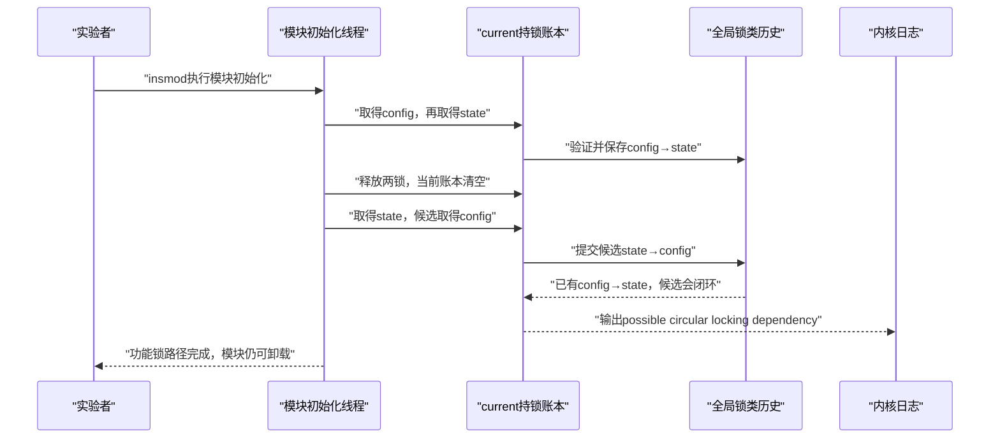

# 第1章\_锁顺序反转与Lockdep报告解读实验

## 1.1\_本实验把哪条推理交给读者完成

本实验不制造两个任务互相等待的真实 ABBA。模块只在同一个初始化线程中依次执行：

```text
S0：config_lock → state_lock，随后全部释放
S1：state_lock  → config_lock，Lockdep在第二次取得config_lock前组合历史
S2：功能mutex仍能完成取得与释放；检查器已经给出潜在循环报告
```

读者要亲自确认三件事：

1. 第一条组件链释放以后，current 的持锁账本已经清空，但全局锁类历史仍保留 `config → state`；
2. 第二条组件链不需要并发任务，仍能让 Lockdep 用“本次候选边＋历史反向边”推出潜在 ABBA；
3. 报告证明的是已执行组件链的动态闭包，不是所有锁路径、数据竞争和对象生命周期都已正确。

机制解释见[为什么需要 Lockdep](../../../../knowledge/linux/synchronization/lockdep/P01_为什么需要_Lockdep.md#1.2_从复现真实死锁转向积累可组合证据)，实验方法见[配置、亲手实验与报告解读](../../../../knowledge/linux/synchronization/lockdep/P08_配置_亲手实验与报告解读.md#8.1_先把使用资格变成环境检查)。

## 1.2\_谁可以做这个实验

| 你的环境 | 能否直接参与 | 需要补什么 |
| --- | --- | --- |
| 可重启的虚拟机、QEMU 或专用开发机，可构建和加载外部模块 | 可以，推荐 | 启用 `CONFIG_PROVE_LOCKING` 并安装匹配的模块构建目录 |
| 自己维护驱动或外部内核模块 | 可以 | 不必修改 Lockdep；标准 mutex 已经自动接入 |
| 只能使用发行版现成内核，但该内核已启用完整 Lockdep | 可以尝试 | 仍需匹配 headers、root 或等价模块加载能力，以及模块签名许可 |
| 生产机、不可重启设备或承载重要业务的目标板 | 不应运行本实验 | 换到可丢弃的复现环境；预期告警可能使本次启动的 `debug_locks` 停检 |
| 只开发用户态 `pthread` 程序 | 不能用内核 Lockdep 检查用户态锁 | 改用 ThreadSanitizer、Helgrind 等用户态工具 |

这里的“资格”不是内核社区身份，而是 **你是否控制实验内核、能否承担一次预期告警并确认目标路径确实执行**。外部驱动作者和学习者完全可以使用；直接接入 `lockdep_map` 则只适合真正实现新同步原语的人。

## 1.3\_参与者与状态接力



日志是检查结果的交付方向；功能 mutex 没有向实验者承诺“修好了锁序”，也没有真的形成两个等待任务。

## 1.4\_实验前检查

优先使用可保存快照并可重启的虚拟机或 QEMU。确认运行内核、构建目录和检查能力来自同一份内核：

```bash
uname -a
test -d /lib/modules/"$(uname -r)"/build

if test -r /proc/config.gz; then
	zgrep -E 'CONFIG_(PROVE_LOCKING|DEBUG_LOCK_ALLOC|LOCKDEP)=' /proc/config.gz
else
	grep -E 'CONFIG_(PROVE_LOCKING|DEBUG_LOCK_ALLOC|LOCKDEP)=' \
		/boot/config-"$(uname -r)"
fi

sudo grep -E 'debug_locks|lock-classes|direct dependencies|dependency chains' \
	/proc/lockdep_stats
```

最低预期是 `CONFIG_PROVE_LOCKING=y`，并且实验前 `/proc/lockdep_stats` 中 `debug_locks` 表示检查器仍有效。若系统没有 `/proc/config.gz` 或 `/boot/config-*`，读取正在运行内核对应构建树的 `.config`；不能拿另一份内核配置代替。

还要确认以下工程边界：

- 当前用户具有加载和卸载测试模块的权限；
- Secure Boot、模块签名策略或 lockdown 没有拒绝该模块；
- 容器拥有的视图与宿主内核一致，而且允许模块操作；
- 当前系统允许出现预期告警并随后重启；
- 已先保存与本实验无关的早期内核错误，避免把旧报告误当成本次结果。

## 1.5\_构建模块

在本目录执行：

```bash
make
modinfo ./lockdep_cycle_demo.ko
```

`make` 默认使用 `/lib/modules/$(uname -r)/build`。交叉编译或为另一台机器构建时，应显式传入与目标运行内核完全匹配的 `kernel_build`、`ARCH` 和 `CROSS_COMPILE`；本实验不把“能够编译”当作“可以加载到当前内核”的证明。

## 1.6\_运行并保留首个报告

终端 A 先跟随新日志，二选一：

```bash
sudo dmesg -wH
```

```bash
sudo journalctl -kf
```

终端 B 记录实验前状态并加载模块：

```bash
sudo grep -E 'debug_locks|lock-classes|direct dependencies|dependency chains' \
	/proc/lockdep_stats > lockdep_stats.before.txt

sudo insmod ./lockdep_cycle_demo.ko

sudo dmesg > lockdep_cycle_demo.full.dmesg
grep -E 'lockdep_cycle_lab|possible circular locking dependency|existing dependency chain|locks held' \
	lockdep_cycle_demo.full.dmesg

sudo grep -E 'debug_locks|lock-classes|direct dependencies|dependency chains' \
	/proc/lockdep_stats > lockdep_stats.after.txt

sudo rmmod lockdep_cycle_demo
```

不要先清空整个 dmesg；完整日志和时间线比只留下几行 `grep` 更容易区分旧报告、本次报告和模块加载失败。生成的 `.ko`、日志和统计快照是本机实验产物，不应提交到知识仓库。

## 1.7\_预期证据

模块自己的标记应按顺序出现：

```text
lockdep_cycle_lab: S0 record config_lock -> state_lock
lockdep_cycle_lab: S1 propose state_lock -> config_lock
lockdep_cycle_lab: S2 functional mutex path completed
```

在 S1 与 S2 之间，Lockdep 报告通常包含以下职责片段，具体措辞和地址会随版本变化：

```text
possible circular locking dependency detected
the existing dependency chain (in reverse order) is:
... trying to acquire lock ...
... already holding lock ...
```

把它还原为同一条因果链：

```text
本次current持有state_lock
  → 准备取得config_lock
  → 候选新边state→config
  → 历史已有config→state
  → 候选边加入后闭合
```

功能 mutex 都是空闲后才进入下一阶段，所以 S2 仍可出现。**报告后 `debug_locks` 很可能变为 0**；这表示验证器为避免不完整状态继续伪装成有效证明而停检，不表示功能 mutex 已经损坏。

## 1.8\_按问题读取报告

不要先从最长调用栈猜结论。为报告填写下面的实验记录：

| 问题 | 本实验应得到的答案 |
| --- | --- |
| 报告类型是什么 | 潜在循环锁依赖 |
| 本次新事件是什么 | 持有 `state_lock` 时准备取得 `config_lock` |
| 本次候选边是什么 | `state → config` |
| 历史反向路径是什么 | `config → state` |
| 哪两个代码位置建立两条边 | 模块 S0 和 S1 对应的两个嵌套取得位置 |
| 功能线程是否真的互相等待 | 没有；两条链由同一线程先后执行 |
| 报告后检查器是否仍有效 | 以 `/proc/lockdep_stats` 的 `debug_locks` 为准 |

只有把这些答案写回代码，报告才从“看见一个 splat”变成可审查的锁协议反例。

## 1.9\_读者继续修改实验

每个变体都应在 **干净重启且 `debug_locks` 有效** 的环境中单独运行：

1. **统一锁序：** 把 S1 也改成 `config → state`。预期不再出现循环报告；这只能证明修改后的两条已执行组件链没有闭环。
2. **增加第三把锁：** 依次建立 `A → B`、`B → C`，最后尝试 `C → A`。在报告中找出两段历史和一段本次候选边。
3. **增加调用契约：** 写一个修改共享状态的辅助函数，在函数内加入 `lockdep_assert_held()`；分别从持锁和未持锁路径调用，比较断言报告。
4. **映射到自己的驱动：** 不再照抄锁名，而是列出真实 probe、IRQ、错误恢复、runtime PM 和 remove 路径中的组件链，再选择能让每条链至少执行一次的测试入口。

若变体没有告警，必须同时保存配置、`debug_locks`、路径执行证据和锁类统计；不能只保存“终端没有输出”。

## 1.10\_清理与恢复

```bash
sudo rmmod lockdep_cycle_demo 2>/dev/null || true
make clean
```

卸载模块只移除功能代码和锁实例，不保证重新开启已经停检的 Lockdep。完成预期错误注入后应重启实验内核，再确认 `debug_locks`，然后才运行下一轮需要有效检查器的测试。

## 1.11\_实验结论边界

本实验能够证明：Lockdep 可以把同一线程先后执行的两条简单组件链组合成潜在 ABBA 报告，因而不必制造真实卡死。它不能证明所有未执行分支安全，也不能替代 KCSAN 的数据竞争检测、KASAN/KFENCE 的内存错误检测、Sparse 的类型检查、lockstat 或 `perf lock` 的竞争分析，以及对象生命周期证明。

回到专题时，继续阅读[报告解读与覆盖计划](../../../../knowledge/linux/synchronization/lockdep/P08_配置_亲手实验与报告解读.md#8.5_再把循环报告还原成同一条因果链)和[成本、覆盖边界与工程选择](../../../../knowledge/linux/synchronization/lockdep/P09_成本_覆盖边界与工程选择.md#9.7_把Lockdep放进完整验证流水线)。
