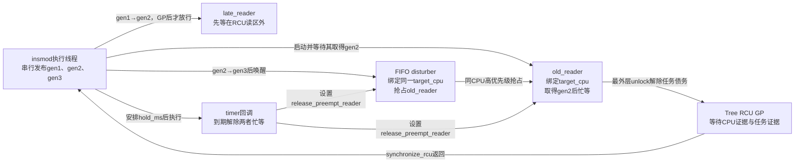

# 第1章\_晚到读者与抢占读者的对象回收实验

## 1.1\_实验要回答的两个问题

同一个模块顺序构造两种容易混淆的读者：

1. **晚到读者：** 任务已经创建并开始运行，但由 completion 确定性地挡在 RCU 读区外；写者替换、完成 GP、释放旧对象以后才放行其 `rcu_dereference()`。预期它只读到新代际。
2. **抢占读者：** 任务已经在 RCU 读侧内取得旧指针，随后在同一 CPU 上被 FIFO 干扰任务抢占。预期 CPU 可以经过 context switch，但 `synchronize_rcu()` 仍等到旧任务恢复并执行最外层 `rcu_read_unlock()`。

实验代码不是性能基准。它用 completion、CPU 绑定和短时间忙等，故意放大两个时间窗口；不要把这种编排复制到生产路径。

第一阶段不是复现“runqueue 前面恰有 999 个任务”的字面调度队列，而是用门闩构造同一个关键前提：任务在旧对象释放前没有进入读侧、没有读取共享入口、没有持有旧地址。真正仍在 runqueue 且尚未获得 CPU 的任务更不可能已经执行 `rcu_dereference()`，证明关系相同。

对应理论和源码解释见：

- [非抢占式 Tree RCU 的问题与证明模型](../../../../knowledge/linux/synchronization/rcu/P05_非抢占式_Tree_RCU_问题与证明模型.md)
- [抢占式 Tree RCU 的问题与任务跟踪模型](../../../../knowledge/linux/synchronization/rcu/P07_抢占式_Tree_RCU_问题与任务跟踪模型.md)
- [抢占式 Tree RCU 源码同步机制](../../../../knowledge/linux/synchronization/rcu/P08_抢占式_Tree_RCU_源码同步机制.md)

## 1.2\_场景和参与者



第二阶段至少需要两个在线 CPU：一个运行模块加载和 GP 等待路径，一个作为 `target_cpu` 运行旧读者及 FIFO 干扰任务。单 CPU 系统仍运行第一阶段，但跳过第二阶段。

## 1.3\_构建前检查

```bash
uname -r
grep -E 'CONFIG_(TREE_RCU|PREEMPT_RCU|PREEMPT|RCU_TRACE)=' /boot/config-"$(uname -r)"
test -d /lib/modules/"$(uname -r)"/build
nproc
```

目标条件：

```text
CONFIG_TREE_RCU=y
CONFIG_PREEMPT_RCU=y
至少2个在线CPU
当前内核对应的外部模块构建目录存在
```

若目标系统没有 `/boot/config-*`，可查看 `/proc/config.gz` 或实际构建树 `.config`。`CONFIG_RCU_TRACE` 只影响 trace 观察，不影响模块的两条基础日志结论。

## 1.4\_构建和运行

```bash
make
sudo dmesg -C
sudo insmod late_and_preempted_reader.ko hold_ms=300
dmesg | grep rcu_lifetime_lab
sudo rmmod late_and_preempted_reader
```

也可显式选择实验 CPU；它必须在线，并且不能是加载模块的线程当时所在的 CPU：

```bash
sudo insmod late_and_preempted_reader.ko target_cpu=1 hold_ms=500
```

`target_cpu=-1` 时模块选择一个不同于加载线程当前 CPU 的在线 CPU。第二阶段持有 CPU hotplug 读锁，目标 CPU 在实验完成前不能被下线；这是为了固定实验前提，不是 RCU API 要求调用者通常禁止 CPU 热插拔。`hold_ms` 只用于放大抢占窗口，允许范围由代码限制在 20～5000 毫秒。

## 1.5\_预期证据

日志至少应出现：

```text
rcu_lifetime_lab: late reader saw generation=2 value=200
rcu_lifetime_lab: preempt phase target_cpu=...
rcu_lifetime_lab: old reader acquired generation=2 value=200
rcu_lifetime_lab: FIFO disturber running on cpu=...
rcu_lifetime_lab: preempt GP returned after ... us
rcu_lifetime_lab: old reader unlocked generation=2
```

第一条证明：任务早已存在并不等于持有旧引用。晚到读者在 `gen1` 已释放后才读取正式入口，所以得到 `gen2`。

第二阶段中，GP 返回耗时通常不少于设定的 `hold_ms` 附近，但调度、定时器粒度和虚拟化会造成偏差；不能把某个固定毫秒数当成 RCU 契约。真正的正确性证据是日志顺序：

```text
old reader acquired gen2
    → FIFO任务在同CPU运行
    → timer回调放行
    → old reader执行unlock
    → synchronize_rcu返回
    → gen2被释放
```

## 1.6\_可选trace证据

若 tracefs 已挂载且事件可用：

```bash
cd /sys/kernel/tracing
echo 0 | sudo tee tracing_on
echo | sudo tee trace
echo 1 | sudo tee events/rcu/rcu_preempt_task/enable
echo 1 | sudo tee events/rcu/rcu_unlock_preempted_task/enable
echo 1 | sudo tee events/rcu/rcu_grace_period/enable
echo 1 | sudo tee tracing_on

sudo insmod /path/to/late_and_preempted_reader.ko hold_ms=500

echo 0 | sudo tee tracing_on
sudo grep -E 'rcu_lifetime_old|rcu_preempt_task|rcu_unlock_preempted_task|rcu_grace_period' trace
sudo rmmod late_and_preempted_reader
```

不同构建可能没有导出全部 RCU trace 事件；先检查 `events/rcu/`，不存在时不要把失败解释为 RCU 机制不存在。任务名 `rcu_lifetime_old` 可将本模块读者与系统中其他 RCU 活动区分开。

理想 trace 关系是：

```text
rcu_preempt_task记录旧读者进入叶节点blocked队列
    → 原CPU可以报告QS
    → rcu_unlock_preempted_task记录任务退出
    → 对应GP随后结束
```

## 1.7\_为什么实验没有在读侧里sleep

旧读者只在读侧内进行 `READ_ONCE()`、`cpu_relax()` 和条件检查。它被 FIFO 任务 **非自愿抢占**，没有调用 `schedule()`、`msleep()` 或等待队列。这样验证的是 PREEMPT_RCU 的设计目标，而不是故意触发“RCU 读侧内主动阻塞”的误用警告。

timer 回调在读侧外设置原子标志；硬件定时器仍可打断 FIFO 任务，FIFO 任务看到标志后退出，旧读者恢复、结束读侧。若删除 timer 的放行操作，实验会故意制造长期 GP/stall，这不属于正常测试步骤。

## 1.8\_反例与失败判定

以下现象必须先区分环境问题和机制错误：

| 现象 | 常见原因 | 处理 |
| --- | --- | --- |
| 第二阶段被跳过 | 只有一个在线 CPU，或未启用 PREEMPT_RCU | 换用多 CPU 抢占式内核 |
| 外部模块编译失败 | 构建目录与运行内核不匹配 | 安装匹配 headers 或使用目标构建树 |
| 找不到 trace 事件 | 内核未启用相应 tracing 配置 | 只使用模块日志，或重构内核 |
| GP 延迟与 `hold_ms` 不完全相等 | timer、workqueue、调度和虚拟化误差 | 只比较因果顺序，不把时间当固定契约 |
| 出现 voluntary context-switch RCU 警告 | 修改代码后在读侧内加入了阻塞调用 | 撤销该调用，恢复非自愿抢占场景 |

真正违反本实验结论的现象是：读者仍能使用 `generation=2` 且尚未执行 unlock 时，GP 已经返回并释放了该对象。正常 Tree RCU 不允许这个顺序。

## 1.9\_清理

```bash
sudo rmmod late_and_preempted_reader 2>/dev/null || true
make clean
```

模块退出会先把正式 RCU 入口改为 `NULL`，执行 `synchronize_rcu()`，再释放最后发布的对象。构建产物由 `.gitignore` 排除，不属于知识仓库正文。
