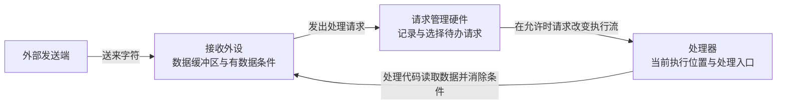
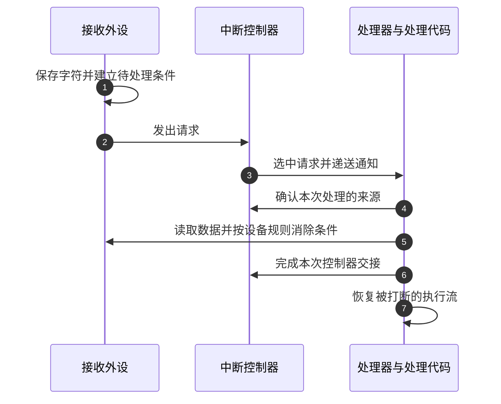

# 第1章\_从外设事件到中断请求

## 1.1\_数据已经到了\_程序为什么还不知道

设想一块芯片：**中央处理器（Central Processing Unit，CPU）** 正在计算一段数据，串口接收部件在另一处接收外部发送的字符。这里选用 **通用异步收发器（Universal Asynchronous Receiver/Transmitter，UART）** 作为串口例子，它是按约定逐位传输数据的外设；不需要先懂它的具体寄存器，也能提出问题：字符已经进入接收部件，为什么程序没有立即处理它？

处理器执行的是当前指令流。除非某条指令读取外设，或者硬件使执行流转向专门入口，否则“外设发生变化”不会自动变成“程序执行了处理代码”。外设和处理器能够各自推进，因此必须建立它们之间的通信。

本章只推导这条通信需要哪些职责。读完后，应能区分 **事件、数据、通知和处理**，并解释为什么中断控制器既不是数据缓冲区，也不是替程序执行任务的另一个处理器。

> 官方对照：[概览 198123，3.2-01](https://developer.arm.com/documentation/198123/0302)，第 1 章 Overview → Background，**可移植文档格式（Portable Document Format，PDF）** 原件第 6 页，以 UART 接收为例说明事件通知。本章用自己的场景推演继续拆开数据、通知与处理，不是原文逐句翻译。

## 1.2\_轮询首先解决了什么

最直接的办法是让程序反复检查外设状态。这叫 **轮询（Polling）**：发起检查的是处理器，是否有新数据的证据保存在外设。下面是行为伪代码，名称表示教学动作，不是某套芯片的真实接口。

```text
重复执行：
    读取接收部件的“有数据”状态
    如果有数据：
        从接收缓冲区取出数据
        交给当前程序处理
    执行一小段其他工作
```

轮询有明确价值：控制流连续，检查时间由程序掌握；没有突然进入另一个处理现场，也不需要保存和恢复被打断的执行状态。在专用处理循环中，事件持续密集，主动检查甚至可能比频繁进出中断更合适。

问题出现在“其他工作”和“接收等待”同时存在时。检查太疏，数据已经到了却还要等；检查太密，没有数据时也会执行状态读取、判断和循环。若一次检查耗时为 c、每隔 T 检查一次，在检查成本稳定且不计处理数据的简化条件下，检查本身占用的时间比例约为 c/T。T 缩短十倍，检查开销也约增加十倍。

这个式子不是芯片性能测量。实际还受总线访问、缓存属性和调度影响；它只是把选择压力展开：为了减少不知道事件发生的时间，处理器付出了更多主动询问。

再增加缓冲区限制：接收部件只能暂存有限数据。如果两次检查之间到来的数据超出容量，后来的数据可能丢失。缩短 T 可以缓解，但若处理速度长期小于输入速度，换成中断也无法从根本上消除溢出。

## 1.3\_把主动检查改成请求通知

另一种方案是：外设在出现待处理条件时，向处理器发出请求。处理器在允许接收时，暂停当前正常执行路径，进入预先准备的处理入口；处理结束后再恢复。这种外部异步请求导致的处理过程，是这里要研究的 **中断（Interrupt）**。

“**异步（Asynchronous）**”只说明事件发生时刻不由当前指令流逐步安排，不表示立即处理、没有状态或不需要同步。请求可能被暂时屏蔽，也可能因为更高优先级工作而等待。

先固定各角色持有的状态，再看通知怎样流动：



数据留在外设，图中的请求箭头没有把字符一起送给处理器。处理入口运行以后，仍然必须执行读取数据的指令。请求管理硬件最多帮助表达“需要处理”，不知道某个字符意味着什么。

成本没有消失，而是换了位置：低事件频率时减少了无效检查；真正发生事件时，要付出异常入口、状态保存、请求识别、退出恢复的成本。频率极高时，频繁进入处理入口也可能让正常计算难以前进。所以“使用中断”是通信方式的选择，不是“永远更快”的承诺。

## 1.4\_一根通知线还缺什么

假设两个外设都能通知同一个处理器。把信号简单合在一起，处理器只能知道“至少有事情发生”，却不知道是哪一个外设。软件可以逐个检查来源，但来源数量增加以后，扫描成本又回来了。

于是增加 **来源编号（Source identifier）**，让软件可以查询被选中的请求。接着出现第二个问题：请求来到时，处理器正在进行不能被打断的操作。若只保留一个瞬时脉冲，等处理器恢复接收时，脉冲可能早已消失。对于这种请求，需要在硬件中保留“尚待处理”的状态。

第三个问题是多个来源同时等待。需要一套 **优先级（Priority）** 规则决定谁先被选择；有些来源暂时不能处理，还需要 **使能（Enable）或屏蔽（Mask）** 来控制它能否被递送。若有多个处理器，还必须知道请求应当交给谁。

这些职责共同构成中断控制器的基本工作：识别来源、管理待处理状态、筛选优先级和接收条件、选择目标、与软件交接处理状态。它们是从问题中推出的，不要求读者先记住任何控制器产品的模块清单。

需要特别小心“记录请求”的含义：一个待处理位通常只表达“至少有一件事”，不是无限长度的事件计数器。如果相同来源连续发生多次事件，软件仍然需要读取外设的数据队列或计数状态，不能把一次中断等同于一个字符。

> 官方对照：[概览 198123，3.2-01](https://developer.arm.com/documentation/198123/0302)，第 3 章 What is a Generic Interrupt Controller?（PDF 第 8～9 页）。核对“管理、优先级、路由”分别解决什么；本节从一根线递增职责的顺序及 c/T 模型是教学推演，不是规范声称的硬件内部算法。

## 1.5\_沿一次接收过程区分四个事实

下面只画一个没有再次来数据的正常过程。处理器最初允许接收中断，处理函数已经安装；这些初始化条件以后再逐项解释。



步骤 1 是数据与设备状态变化，步骤 2～3 是通知，步骤 4 是控制器交接，步骤 5 才是处理设备。步骤 6 不会替步骤 5 读取数据，步骤 7 也不会替步骤 6 修改控制器状态。

可以用一个反例检查理解：如果只执行步骤 6～7，没有读取外设，接收条件还成立，控制器可能很快再次递送请求。反过来，只读完数据却没有完成控制器协议，也可能使该来源一直处于未结束状态。后面必须分别追踪这两类故障。

## 1.6\_现在才给目标控制器命名

Arm 把一套中断控制器的架构规则命名为 **通用中断控制器（Generic Interrupt Controller，GIC）**。它规定软件怎样配置请求、查询和确认中断，以及怎样结束交接。它不规定串口字符的含义，也不代替操作系统的软件管理。

本专题从这些规则与真实硬件之间的关系开始学习 GICv3.0。这里的版本号只标记本专题要核对的规则版本；下一章才解释架构版本、硬件产品和 RK3588 芯片各是什么，不能把它们看成同一条版本序列。

本章能够证明的是：中断把主动检查的一部分工作转移到请求通知路径，但依然需要保存状态、处理数据并完成交接。尚不能证明任意请求都会被接收，也不能证明一个请求位保存了全部事件。

检查自己：若一秒内事件数量翻倍，首先该问“中断次数能否跟上”，还是“外设保留了什么数据、处理速度是否足够”？后者决定正确性，前者只是观察入口之一。

资料定位：[Arm 概览 198123，第 3 章](https://developer.arm.com/documentation/198123/0302)。本章的接收场景和因果推演为仓库教学说明，不是 RK3588 实测。

[专题大纲](大纲.md#1.2_因果阅读地图)

下一篇：[规则与芯片身份](P02_从控制器规则到芯片与软件身份.md#2.1_已经知道职责_为什么还要分清名称)
