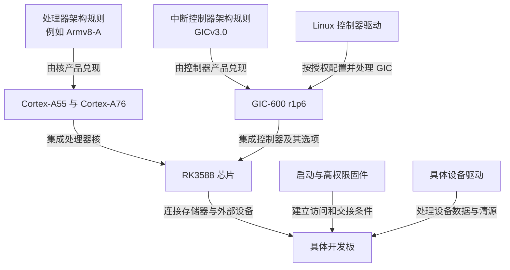

# 第2章\_从控制器规则到芯片与软件身份

## 2.1\_已经知道职责\_为什么还要分清名称

上一章从外设事件推出了中断控制器的职责：保存和选择请求，与处理器的软件交接。Arm 将其中一套规则称为 **通用中断控制器（Generic Interrupt Controller，GIC）**。但买到一块 RK3588 开发板，仍不能把“板子是什么”直接等同于“中断规则是什么”。

实际阅读资料时会同时遇到 Armv8-A、Cortex-A76、GICv3.0、GIC-600、RK3588、固件和 Linux。若把这些名字放在同一条版本链上，就可能推出“处理器更新，所以控制器一定更新”的错误结论。本章先逐个建立身份，最后才画关系图。

## 2.2\_规则与实现不是同一个对象

**架构（Architecture）** 在这里指软件能够观察和依赖的规则。处理器架构规定指令、寄存器、异常等行为；中断控制器架构规定请求状态、路由、确认和完成等行为。两者协作，但各自解决不同问题。

软件依赖规则，并不意味着所有硬件内部都长得一样。例如两个控制器都可以提供“确认后返回一个来源编号”，内部却使用不同的队列、仲裁电路或物理布局。把规则落实成电路结构的具体设计，称为 **实现（Implementation）**。

这解释了为什么需要两类手册：架构规范用来问“这个读写动作应当有什么效果”，具体实现手册用来问“该产品实现了哪些选项、具有什么限制”。后者常称为 **技术参考手册（Technical Reference Manual，TRM）**。手册也是有修订号的文档，文档修订号不自动等于硬件修订号。

**Armv8-A** 是面向应用处理的处理器架构系列名称。这里的 A 是架构配置类别，不是芯片型号。**Cortex-A55** 和 **Cortex-A76** 则是 Arm 的处理器核产品专名；核是执行指令的硬件设计单元。讨论“某核实现哪套指令和异常规则”，与讨论“系统采用哪一代 GIC”是两个判断。

**GICv3.0** 指中断控制器架构版本。**GIC-600** 是 Arm 提供的一款控制器硬件产品，**r1p6** 是该产品的修订标记。数字 600 不能解释为“第六代 GIC”，也不能据此推导它具有 GICv4 的特性。

> 官方对照：[GIC-600 手册 100336，r1p6](https://developer.arm.com/documentation/100336/0106)，Preface → About this book → Product revision status（PDF 第 7 页）解释 rmpn 修订记号；1.3 Compliance（1-17）说明架构符合性。[概览 198123，3.2-01](https://developer.arm.com/documentation/198123/0302) 第 3 章区分架构及实现产品。查这些目录是为了确认名称层次，不按数字大小猜代际。

## 2.3\_芯片把哪些设计组合到一起

**系统级芯片（System on Chip，SoC）** 把处理器核、存储访问部件、互连、控制器和多种外设集成在一颗芯片中。**RK3588** 是 Rockchip 的 SoC 产品专名，不是指令集，也不是中断控制器名称。

“集成”产生了架构规范无法替芯片回答的问题：选了哪个控制器产品？接了多少处理器？哪些外设连到哪些中断来源？寄存器窗口放在哪个地址？控制器访问内存时允许怎样的地址宽度与共享属性？这些必须查芯片手册。

开发板又在芯片外连接存储器、供电、接口和其他设备。同一颗芯片可以被做成不同板子，所以“控制器硬件存在”不表示某个板上设备已经连接，也不表示软件已经把它启用。

因此，平台是一个需要明确范围的组合词。说“RK3588 平台”时，应说明当前结论只涉及芯片集成，还是已经包含某块开发板、启动固件、内核版本和运行配置。省略这些范围，后续代码与现象就可能互相对不上。

## 2.4\_软件也有分工\_不是一个程序包办

**固件（Firmware）** 是在操作系统正式接管前或更高权限环境中执行的软件，它可能准备处理器状态、内存和中断访问权限。**操作系统（Operating System，OS）** 组织任务、设备和公共资源；其中的 **控制器驱动（Interrupt controller driver）** 按架构及实现要求操作 GIC。具体串口驱动则处理接收部件的数据和条件。

这三者不能同时无约束地改同一份控制器状态。如果固件保留某类中断给更高权限软件，普通内核不能假定自己拥有它；如果 Linux 已经管理 GIC，一个设备驱动也不应重新初始化全局控制器。

现在可以把已经解释的对象连起来。图中箭头表示规则实现、集成或软件操作关系，不表示中断信号实际经过这些文档。

## 2.5\_RK3588的第一份可核对结论

身份必须由证据确认，不能只看资料文件名。RK3588 TRM V1.0 Part1 的第 11.1 节、表 11-1，写明所用控制器为 GIC600，修订为 r1p6-00rel0。再查 Arm GIC-600 r1p6 TRM 的 1.3 Compliance，可确认该产品遵循 GIC 架构版本 3.0。

这是一条两步证据链：芯片手册确认 **采用了谁**，实现手册确认 **这个产品遵循什么规则**。两条证据合起来，才得到本专题的首个目标：RK3588 上的 GIC-600 r1p6 / GICv3.0。

更多芯片集成选项与手册冲突单独放在 [RK3588 集成记录](../../rockchip/rk3588/P01_RK3588的GIC-600集成与手册核对.md#1.2_怎样确认控制器身份)。这里不提前用大量参数打断身份关系的学习。

同理，不能因为未来考虑 Armv9-A，就预先认定下一块芯片使用 GICv4。应该重新走一遍“具体芯片 → 控制器实现 → 架构及实现选项”的核对过程。

> 官方对照：RK3588 TRM V1.0 Part1，11.1 Overview → 表 11-1（PDF 第 1312 页）；[GIC-600 r1p6 手册](https://developer.arm.com/documentation/100336/0106)，1.3 Compliance（1-17）。两份材料的版本和取得入口见[资料证据表](../../../../reference/external_resources/arm/README.md#1.4.2_型号判断的证据与适用边界)。前者给集成身份，后者给架构规则，不能只引用其中一份就替另一份作证。

## 2.6\_怎样开始查手册而不被目录淹没

先用一个明确问题决定资料类型，而不是从几千页规范第一页顺读：

| 当前问题 | 已建立的对象层次 | 首选证据 |
| --- | --- | --- |
| 确认一个中断会怎样修改状态？ | 控制器架构 | GIC 架构规范及寄存器条目 |
| 某个可选功能在产品中是否存在？ | 控制器实现 | GIC-600 对应修订的 TRM |
| 地址、接线、访问属性是什么？ | 芯片集成 | RK3588 TRM 与后续硬件能力核对 |
| 为什么板子上没有启用？ | 板与软件配置 | 该板的描述、固件、内核及运行证据 |

表格只是此前身份关系的查询化表达，不是四种彼此替代的材料。架构定义不能代替芯片地址表，设备树中的一个名字也不能代替实测。

现在应能说明：GICv3.0、GIC-600 和 RK3588 为什么不能当作三个同轴产品比较。下一章才进入一个多核 GIC 内部，推导哪些配置需要共享、哪些状态必须按处理器区分。

资料定位：[Arm GIC-600 r1p6 TRM，1.3](https://developer.arm.com/documentation/100336/0106)；RK3588 原件版本、页码与取得入口见[资料索引](../../../../reference/external_resources/arm/README.md#1.4.2_型号判断的证据与适用边界)。

上一篇：[上一章](P01_从外设事件到中断请求.md#1.1_数据已经到了_程序为什么还不知道)

[专题大纲](大纲.md#1.2_因果阅读地图)

下一篇：[多核角色](P03_多核控制器的角色_寄存器与编号.md#3.1_增加第二个处理器后_什么必须拆开)
