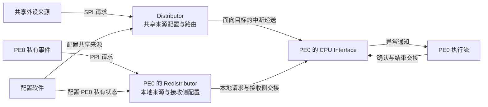

# 第3章\_多核控制器的角色\_寄存器与编号

## 3.1\_增加第二个处理器后\_什么必须拆开

前两章建立了中断控制器与芯片的关系。本章把 **通用中断控制器（Generic Interrupt Controller，GIC）** 的 v3.0 规则放到两个处理器的场景中：同一个串口请求可以交给其中一个处理器，但每个处理器自己的定时事件，不能因为编号相同就混成一个来源。

Arm 文档常把一个能执行指令的处理实体称为 **处理单元（Processing Element，PE）**。本章用 PE0、PE1 表示两个教学对象，不是在声明 RK3588 的真实硬件编号；**中央处理器（Central Processing Unit，CPU）** 接口是每个 PE 对应的中断接收与处理接口。

若把所有状态混在一个全局对象中，就无法同时表达“PE0 正在处理自己的定时事件”和“PE1 尚未确认自己的定时事件”。相反，若把所有配置复制到每个 PE，又难以表达一个外设来源应当只交给一个目标。于是必须先区分共享来源与每个 PE 私有的状态。

## 3.2\_先从三种来源推导编号范围

第一种来源是芯片里的串口、网络等外设，请求可以被路由到适当的 PE。它称为 **共享外设中断（Shared Peripheral Interrupt，SPI）**。“共享”指系统范围内的来源和路由，不等于 Linux 多个驱动共享同一中断线，也不表示广播给所有 PE。

第二种来源与某个 PE 固定关联，例如该 PE 的定时事件。它称为 **私有外设中断（Private Peripheral Interrupt，PPI）**。两个 PE 可以使用相同的编号表示各自的定时中断，但它们不是同一份待处理状态。

第三种来源是软件希望通知另一个 PE，例如提示它检查新任务。它称为 **软件产生中断（Software Generated Interrupt，SGI）**。软件写控制器提供的生成接口，硬件把请求交给指定接收者；待办工作的详细内容仍需另外保存。

来源编号称为 **中断标识符（Interrupt Identifier，INTID）**。在本专题的 GICv3.0 范围内，前三类按以下区间区分：

| 已解释的来源 | INTID 范围 | 确定状态时还需要什么 |
| --- | --- | --- |
| SGI | 0～15 | 接收目标 PE；同号请求不是按发送者分别计数 |
| PPI | 16～31 | 该请求所属 PE |
| SPI | 32～1019 | 系统中的具体来源；实际实现通常只覆盖其中一部分 |

编号范围是架构允许的空间，不是“芯片实际有这么多外设”。1020～1023 是特殊返回值空间，不能分配给普通外设。更大的消息中断空间稍后由具体问题引出；GICv3.1 新增的扩展范围不纳入 RK3588 的 v3.0 主线。

> 官方对照：[规范 IHI0069 H.b](https://developer.arm.com/documentation/ihi0069/hb)，2.2 INTIDs（2-35）与 4.3 Private Peripheral Interrupts、4.4 Software Generated Interrupts、4.5 Shared Peripheral Interrupts；先核对 GICv3.0 编号区间，再看各类型的归属规则。概览 198123 第 4 章的 Interrupt types 是更短的复习入口。

## 3.3\_三种接口怎样分工

**分发器（Distributor）** 管理系统范围内的 SPI 配置及其分发，例如来源使能、优先级、触发类型和目标。它对应需要统一管理的那部分职责。

**再分发器（Redistributor）** 提供每个 PE 关联的配置与状态接口，包括该 PE 的 SGI、PPI，以及后续消息中断所需的内存表入口和电源交接。架构上每个 PE 有对应的再分发器接口；实际产品可以把多个接口组合在一个物理块中，不能从寄存器接口数量直接猜电路块数量。

**CPU Interface（处理器接口）** 负责接收侧的筛选与交接：当前 PE 允许怎样的优先级、确认哪个中断、怎样降低运行优先级和完成停用。它不是一个能替软件读串口数据的工作线程。



这是一张 **软件可见职责图**，省略 PE1 的对称接收侧，不规定 SPI 必须穿过哪些物理电路或总线。GIC-600 在 RK3588 内部怎样连线，需要再看芯片框图，不能把架构接口图当作物理布局图。

> 官方对照：[规范 IHI0069 H.b](https://developer.arm.com/documentation/ihi0069/hb)，3.1 The GIC logical components（3-42）；[概览 198123，3.2-01](https://developer.arm.com/documentation/198123/0302) 第 4 章（PDF 第 18～19 页）给出软件可见接口。重点对照逻辑职责，实际物理组件与连接另查 GIC-600 第 2 章，不能从本图反推电路。

## 3.4\_寄存器不是普通变量\_两种访问路径先分清

寄存器是软件观察或控制硬件行为的接口。读写一个寄存器，可能返回状态、改变配置，甚至推进硬件状态机；不能默认它和普通内存变量一样没有额外副作用。

**内存映射输入输出（Memory-Mapped Input/Output，MMIO；官方常写 Memory-mapped I/O）** 把设备寄存器放入地址空间，处理器通过具有相应访问属性的读写事务访问。Distributor 与 Redistributor 的编程接口采用这种方式。物理基地址由芯片集成决定，操作系统还可能把它映射到自己的虚拟地址。

GICv3 的 CPU Interface 则使用处理器 **系统寄存器（System register）**。它们不是“某个 GIC 基地址加偏移”形成的普通内存位置；在 AArch64 这个 64 位执行状态中，使用 MRS、MSR 这类系统寄存器读写指令访问。MRS、MSR 是指令助记符，下面不把它们杜撰成通用 C 函数。

寄存器名称的前缀帮助定位职责：`GICD_` 表示 Distributor 接口，`GICR_` 表示 Redistributor 接口，`ICC_` 表示 CPU Interface 系统寄存器。它们是规范定义的寄存器名称前缀，后面的具体寄存器会在使用处解释。

为什么不能全部当作地址？如果软件用普通内存读取去“读确认寄存器”，它不会因此完成系统寄存器指令的动作；还可能访问完全无关的设备地址。接口访问路径是编程契约的一部分。

> 官方对照：[规范 IHI0069 H.b](https://developer.arm.com/documentation/ihi0069/hb)，12.1 About the programmers’ model、12.2 AArch64 System register descriptions，以及 12.8/12.10 的 Distributor/Redistributor register map。分别查看系统寄存器编码和内存映射，不要把两种目录当作同一基址下的偏移表。

## 3.5\_一个编号怎样找到对应状态位

以共享来源使能为例。`GICD_ISENABLER<n>` 是 **Interrupt Set-Enable Register（中断置使能寄存器）** 的规范名称，每个 32 位寄存器对应 32 个编号。写某位为 1，使对应来源使能；其他位写 0 不修改它们。对应的 `GICD_ICENABLER<n>` 是 **Interrupt Clear-Enable Register（中断清使能寄存器）**，写 1 清除使能。

对一个已经核实存在、归当前软件所有的 SPI，编号为 i 时，寄存器序号是 i 除以 32 的整数商，位位置是 i 对 32 取余。这是编号到寄存器接口的映射，不是推测控制器内部存储地址。

```text
教学例子：i = 65，不代表 RK3588 串口的实际编号
寄存器序号 = 65 / 32 的整数商 = 2
位位置 = 65 % 32 = 1
置使能：向 GICD_ISENABLER2 写入仅 bit 1 为 1 的值
清使能：向 GICD_ICENABLER2 写入仅 bit 1 为 1 的值
```

这类写 1 执行动作的接口，避免软件为改变一位而对整个共享寄存器做“先读、修改、再写”。但它只解决位更新方式，不消除对同一个来源的所有权冲突；两个软件一边使能、一边禁止，仍须有协调协议。

SGI/PPI 的对应使能操作进入目标 PE 的 Redistributor，不能把上式生搬到 Distributor 后期待它操作另一个 PE 的私有状态。使能也不等于清除请求，下一章将分别观察这两个维度。

> 官方对照：[规范 IHI0069 H.b](https://developer.arm.com/documentation/ihi0069/hb)，12.9.26 GICD_ISENABLER<n>, Interrupt Set-Enable Registers 与 12.9.7 GICD_ICENABLER<n>, Interrupt Clear-Enable Registers。看位与 INTID 的对应关系，以及“写 1 生效、写 0 无作用”的字段语义；同章带 E 后缀的扩展范围不属于这里的 v3.0 算例。

## 3.6\_编号相同不等于对象相同

现在做三个判断：PE0 和 PE1 的同号 PPI 是两份状态；一个 SPI 的路由改变，不意味着它变成了另一个来源；控制器返回的 INTID 也不必等于 Linux 对外显示的中断编号。最后一项属于硬件到软件的映射，后续交接章节再解释。

本章建立了“到哪里配置、按什么编号定位”的模型，仍没解释为什么处理入口已经运行，中断却会一直重复或者再也不来。下一章沿一个来源完整走过确认、处理和结束，追踪状态由谁改变。

资料定位：[198123 第 4～5 章](https://developer.arm.com/documentation/198123/0302)；[IHI0069 H.b 的中断类型、编程接口与使能寄存器条目](https://developer.arm.com/documentation/ihi0069/hb)。本章所有编号算例均为教学值。

上一篇：[上一章](P02_从控制器规则到芯片与软件身份.md#2.1_已经知道职责_为什么还要分清名称)

[专题大纲](大纲.md#1.2_因果阅读地图)

下一篇：[状态与完成](P04_一次中断的状态转换与完成协议.md#4.1_处理入口已经运行_为什么还没有完成)
