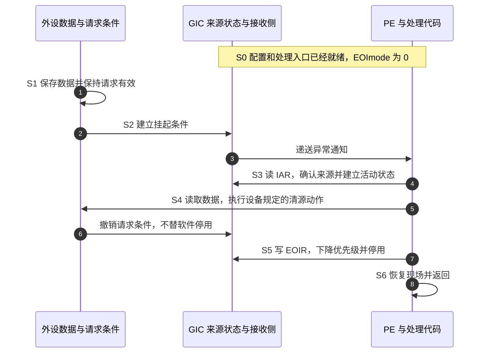
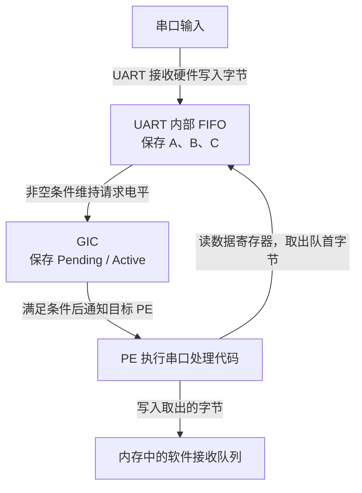
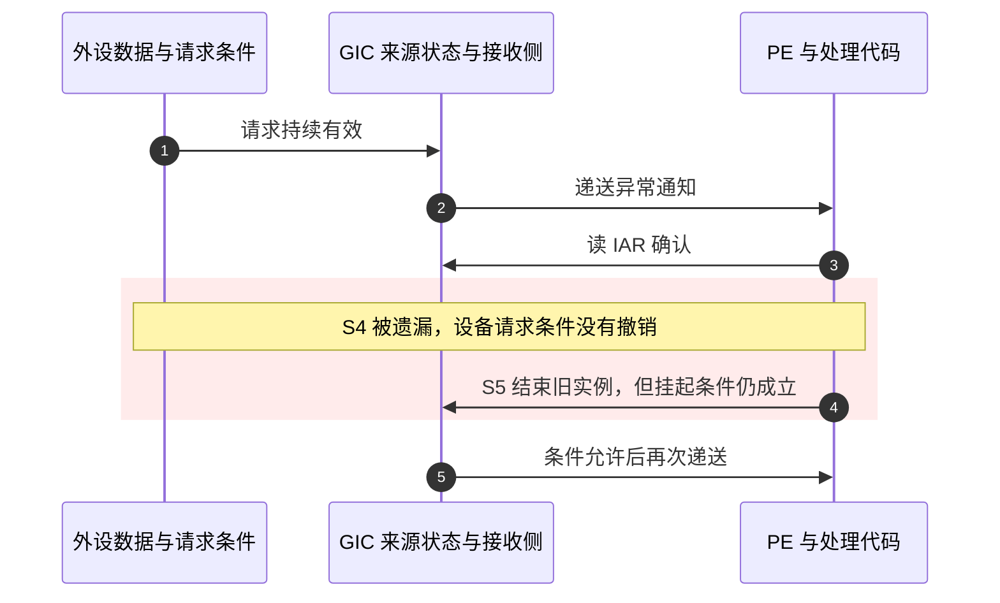

# 第4章\_一次中断的状态转换与完成协议

## 4.1\_处理入口已经运行\_为什么还没有完成

上一章知道了 **通用中断控制器（Generic Interrupt Controller，GIC）** 在何处配置来源。现在假设一个串口来源已经使能，目标 **处理单元（Processing Element，PE）** 也允许接收。数据到达以后，软件进入了处理入口：这是否意味着中断已经结束？

不是。进入入口只证明处理器接受了一次异常通知；外设数据可能尚未取走，控制器也未必已经把具体来源交给软件。本章把这几件事拆开，先闭合一个普通中断的完整周期，再用“处理期间又来事件”检验它。

本章讨论 **共享外设中断（Shared Peripheral Interrupt，SPI）**、**私有外设中断（Private Peripheral Interrupt，PPI）** 和 **软件产生中断（Software Generated Interrupt，SGI）** 的状态模型。后文的消息中断另有差量，不能把本章四状态表无条件推广过去。

## 4.2\_一个正在处理位为什么不够

假设只用一个位记录“这个来源正在处理”。软件确认请求时把它置位，结束时清零。若处理期间该来源又产生一次事件，新事件与正在处理的旧事件就无法区分。

因此需要分别表达两项事实：**挂起（Pending）** 表示当前存在等待确认的请求；**活动（Active）** 表示该来源已经被确认，但尚未完成停用。两者可以同时成立。

| 挂起 | 活动 | 名称 | 能推出什么 |
| --- | --- | --- | --- |
| 0 | 0 | Inactive，非活动 | 当前没有这两类控制器状态；不代表外设永远不会再请求 |
| 1 | 0 | Pending，挂起 | 有请求等待确认 |
| 0 | 1 | Active，活动 | 已确认的交接仍未停用 |
| 1 | 1 | Active and Pending，活动且挂起 | 旧交接未停用，同时存在挂起条件 |

这不是软件维护四个独立布尔变量。它是两个状态维度的组合，由控制器维护；架构提供观察与控制接口，内部物理存储由实现决定。SPI 通过 **分发器（Distributor）** 的共享来源接口观察，SGI/PPI 通过所属 **再分发器（Redistributor）** 的每处理器接口观察。

而且整个系统仍不止这一张状态表。外设保存数据及请求条件；控制器保存挂起/活动与配置；处理器保存异常屏蔽和执行状态；软件保存当前处理进度。这四层组成协作过程，不能用一个“中断完成”变量代替。

> 官方对照：[规范 IHI0069 H.b](https://developer.arm.com/documentation/ihi0069/hb)，4.1.2 Interrupt handling state machine；[概览 198123，3.2-01](https://developer.arm.com/documentation/198123/0302) 第 4 章（PDF 第 13 页）的状态图。核对 Active and Pending 的组合条件；“设备数据、控制器状态、处理器现场、软件进度”四层划分是本专题的分析框架。

## 4.3\_确认\_清源\_优先级下降与停用

**确认（Acknowledge）** 是处理器向控制器领取一个可处理来源的协议动作。先将当前路径命名为 **非安全第 1 组（Non-secure Group 1）**：这是一种中断安全归属，不是优先级高低。在该路径读取 `ICC_IAR1_EL1`，即 **Interrupt Acknowledge Register，IAR（中断确认寄存器）**，取得 **中断标识符（Interrupt Identifier，INTID）**，并推进控制器状态。安全分组在第 6 章完整建立；这里先固定这一条正常路径，不把所有分组混在一起。

为什么选这条路径？本例假设固件已经把串口交给非安全操作系统，将来源配置成 Non-secure Group 1；这是一项 **示例前提**，并非所有中断都必须属于 Group 1。若来源配置成 Group 0，就使用对应的 Group 0 确认接口，不能靠读取 IAR1 把来源改组。

寄存器名中的两个数字也不在同一分类轴上：`IAR1` 的 1 指 **中断安全分组 Group 1**；`EL1` 指 **异常级（Exception Level，EL）** 的命名层次。EL 是处理器的软件权限与异常执行层次，EL1 通常运行整个内核，内存管理、系统调用和中断处理都可以在这一层执行，绝非为中断单独预留。寄存器的 EL1 后缀也不表示只能从 EL1 访问；更高异常级的访问仍依架构权限和截获控制决定。先由 GIC 与处理器的路由配置决定进入哪里，再由入口软件选择匹配的确认接口；完整关系见[安全组与异常路由](P06_权限_安全分组与初始化闭环.md#6.3_安全组不是优先级分组)。

所以读确认寄存器不是无副作用的调试操作。原本留给处理入口确认的来源，可能被这次读取领走。处理器进入异常和读取该寄存器是两个动作；读取也可能发生在软件主动查询时。

**设备清源（Clearing the peripheral interrupt condition）** 则是处理外设条件：读取数据、清除设备状态位或完成设备规定的握手。清源方式由外设定义，不存在一个对所有设备都正确的“往状态寄存器写 1”。控制器不知道具体数据是否已经处理完。

GIC 把结束动作进一步分成两部分：

- **优先级下降（Priority drop）**：结束本次确认对接收侧运行优先级的占用，恢复此前的优先级约束。
- **停用（Deactivation）**：清除该来源已确认但未停用的活动状态；若仍有挂起请求，它不会因此一起消失。

`ICC_EOIR1_EL1` 是 **End Of Interrupt Register（中断结束寄存器）**，`ICC_DIR_EL1` 是 **Deactivate Interrupt Register（中断停用寄存器）**。其配合方式由 `ICC_CTLR_EL1`，即 **中断控制器控制寄存器（Interrupt Controller Control Register）**，中的 `EOImode` 字段决定；EOI 是 End Of Interrupt（中断结束）的缩写，EOImode 是该结束模式的字段标识；这是工作模式，不是由函数名猜出的规则。

| 当前模式 | 写 EOIR 的效果 | 对本章普通中断还需什么 |
| --- | --- | --- |
| EOImode 为 0 | 优先级下降并停用 | 不再为该次确认额外写 DIR |
| EOImode 为 1 | 只做优先级下降 | 合适时再写 DIR 完成停用 |

分离模式允许两件事在不同时间完成，但也增加了配对义务。本专题不预设某套 Linux 一定选择哪种模式；必须查看其控制器初始化和退出路径。

> 官方对照：[规范 IHI0069 H.b](https://developer.arm.com/documentation/ihi0069/hb)，4.1.1 Physical CPU interface 中的中断确认与结束规则；精确寄存器条目为 12.2.14 ICC_IAR1_EL1、12.2.10 ICC_EOIR1_EL1、12.2.8 ICC_DIR_EL1、12.2.6 ICC_CTLR_EL1。顺着目录查“读确认的副作用”和 EOImode 两种完成方式，不把外设清源当成这些寄存器的功能。


### 4.3.1\_同一来源还没收尾\_为什么接收侧可以先释放优先级

两项状态约束的对象不同。**运行优先级（Running priority）** 约束当前 PE 是否接收其他来源；Active 则记录 **这个 INTID 的处理交接尚未停用**。假设来源 A 已确认，但设备条件要由稍后运行的另一个软件上下文清除：若一直保留 A 的运行优先级，不够高的其他来源也会被挡住；若立即同时停用 A，设备尚未撤销的电平又可能使 A 被递送。前者把等待设备的时间扩散到其他来源，后者过早重新开放同一来源。

分离模式使软件可以在协议允许时先写 EOIR，释放接收侧优先级，再保留 A 的 Active 状态，直到真正承担设备处理的路径完成清源后才停用。这期间其他来源仍须通过各自的使能、优先级和处理器屏蔽条件；EOIR 本身不会替软件解除这些条件。

一个典型用途是 **虚拟机（Virtual Machine，VM）** 的设备中断交接。**虚拟机管理程序（Hypervisor）** 管理真实硬件并安排虚拟机运行。管理程序收到物理来源 A 后，可能需要通知虚拟机，由虚拟机里的驱动稍后处理设备。在这个场景中，物理入口的优先级占用可以先结束，而真实来源的停用必须等设备处理完成；虚拟完成怎样与物理停用联动，需要另一个有明确状态和权限的虚拟化协议，不能把虚拟机的一次 EOI 当作天然等于物理 DIR。

| 时刻 | PE 接收侧的约束 | 物理来源 A | 仍欠的动作 |
| --- | --- | --- | --- |
| 确认 A 后 | A 占用运行优先级 | Active；也可能有 Pending | 设备处理、优先级下降、停用 |
| 分离模式下先写 EOIR | 恢复此前运行优先级 | Active 仍保留 | 设备处理与停用 |
| 设备条件消除并完成停用 | 不再被 A 占用 | 无其他挂起条件时回到 Inactive | 按软件协议继续执行 |

如果设备清源与控制器收尾都由当前入口连续完成，合并模式更容易维护：一次 EOIR 同时兑现两项义务。只有需要把两项完成时刻分开，并且能追踪后续停用责任时，分离才有价值；它增加的代价是异步状态、完成配对以及异常退出时的清理责任。这里没有宣称某套内核实际采用了上述交接流程。

> 官方对照：[概览 198123，3.2-01](https://developer.arm.com/documentation/198123/0302)，第 6 章 End of interrupt，PDF 第 34～35 页；[IHI0069 H.b](https://developer.arm.com/documentation/ihi0069/hb)，4.1.1 的 Priority drop 与 Deactivation。表格是按两项协议职责构造的场景，不是虚拟化实现步骤。

## 4.4\_用同一组阶段闭合正常周期

以下 S0～S6 是本专题统一的叙述阶段，不是规范寄存器中的数值编码。本例为 **电平触发（Level-sensitive）** 的 SPI：外设在有未处理条件时持续保持请求，软件清源后才撤销。另一种 **边沿触发（Edge-triggered）** 表示输入出现约定跳变，留到下一节比较。

| 阶段 | 进入与变化 | 状态位置及写入者 | 后续读取者与退出条件 |
| --- | --- | --- | --- |
| S0 准备 | 初始化来源、接收侧和处理入口 | 配置软件写 GIC 寄存器、处理器状态及软件表 | 递送硬件与处理入口使用这些设置；条件具备才放开来源 |
| S1 事件 | 数据到达，外设条件成立 | 外设更新自己的缓冲区和状态 | 请求输入把条件传播给 GIC |
| S2 保留与选择 | 请求挂起，等待满足递送条件 | GIC 保存挂起状态并读取使能、路由、优先级 | 接收侧允许时发出异常通知 |
| S3 确认 | 进入异常后读取 IAR，建立活动状态 | PE 执行读指令，GIC 推进该 INTID 状态和运行优先级 | 软件取得真实 INTID；电平仍高时可为活动且挂起 |
| S4 处理设备 | 读取数据并消除设备条件 | PE 执行驱动读写；外设按自身寄存器语义更新数据/状态并撤销请求 | GIC 观察输入撤销；当前实例仍待结束 |
| S5 完成协议 | 优先级下降；按模式完成停用 | PE 写 EOIR，必要时写 DIR；GIC 更新状态 | 无新挂起条件时回到非活动，否则保留后续请求 |
| S6 继续执行 | 退出当前处理现场 | 软件恢复上下文，处理器执行异常返回 | 恢复原路径，或者继续处理满足条件的请求 |



步骤 4 是确认，不是设备处理；步骤 6 是设备条件撤销，不是控制器停用；步骤 7 是本例模式下的两个控制器动作，不是处理器返回。图中的三个边界正是故障定位时需要分开观察的地方。

## 4.5\_处理期间再次来事件会怎样

先看边沿请求：第一次边沿使状态挂起，S3 确认后成为活动；此时又出现一个边沿，状态变成活动且挂起。S5 停用只结束活动的那一部分，状态回到挂起，后续可以再次被确认。

但若在已经挂起、尚未确认期间连续出现多个边沿，并没有无限多个挂起位替它们计数。实际工作量应当保存在设备队列、计数器或软件队列中。控制器承担通知，不替设备提供无界存储。

### 4.5.1\_串口数据由谁保存\_当前处理能否读走后来到达的字节

**挂起与活动描述中断通知的状态，不给设备事务分配存储空间。** 控制器里没有“第一次中断的数据”和“第二次中断的数据”这两份缓冲。数据在哪里、一次读取消耗多少数据，必须回到外设与驱动的约定。

以 **通用异步收发器（Universal Asynchronous Receiver/Transmitter，UART）** 接收串口字节为例。这里选择一个教学设备：内部有 **先进先出缓冲（First-In, First-Out，FIFO）**，这是保存多个字节的队列类型；接收逻辑把新字节放到队尾，软件读取数据寄存器时取出队首字节，接收中断按“FIFO 非空”保持电平有效。实际 UART 可能使用阈值、超时等条件，必须按对应手册替换，不能把本例当作所有串口的规则。



这里的 **中断服务程序（Interrupt Service Routine，ISR）** 是在 PE 上执行的设备处理代码。UART 硬件保存输入，GIC 硬件保存通知状态，PE 执行 ISR 把字节移入软件队列；没有另一颗处理器暗中替 ISR 工作，GIC 也不会读取串口数据寄存器。

| 本章阶段与动作 | UART FIFO | GIC 能知道什么 | 谁实际移动数据 |
| --- | --- | --- | --- |
| S1：接收 A | `[A]` | 请求输入有效 | UART 接收逻辑写入 A |
| S2～S3：挂起、进入异常、读 IAR | `[A]` | 该 INTID 已确认；电平仍有效时还可有 Pending | 尚未读取设备数据 |
| S4：ISR 尚未读取，B、C 又到达 | `[A,B,C]` | 仍只能看到该来源的请求条件，不知道字节数 | UART 接收逻辑追加 B、C |
| S4：连续三次读数据寄存器 | `[B,C]` → `[C]` → `[]` | 请求条件最终撤销 | PE 每次取一个字节，并写入软件队列 |
| S5：完成对应控制器协议 | `[]` | 无其他挂起条件时结束本轮交接 | 无数据搬运 |

**B、C 可以被当前这次 ISR 一起读走。** “在 Active 期间到达”不会给字节贴上下一轮处理的标签。数据寄存器在本例中是 FIFO 的读取窗口，多次读同一地址可以依次取出不同字节；它不是始终只保存最后一个字节的普通变量。

下面是这个设备模型的接收片段，所有动作是教学伪代码，不能直接作为驱动部署：

```text
读取设备状态，确认是否存在接收数据或错误
当设备报告 FIFO 非空，且本次处理预算未耗尽：
    读取一次数据寄存器，取出一个队首字节
    按软件队列协议保存字节，并处理队列已满的情况
重新检查设备状态，按设备契约清除已处理的中断原因
若预算已耗尽但还有数据：安排可靠的后续消费路径
按当前模式完成 GIC 的优先级下降与停用
```

处理预算用于限制一次入口占用 PE 的时间。不断有输入时，“一直读到空”可能长时间不退出；但有预算就必须有后续处理安排。本例采用电平条件，留下数据就仍有请求条件；采用边沿通知的设备则不能假定“只读一部分，退出后一定再来一次边沿”。

### 4.5.2\_通知合并\_数据溢出与重入分别发生在哪一层

若教学设备改为每次接收字节都产生一个边沿，A、B 在 S3 确认前先后到达，可以只留下一个 Pending，而 FIFO 仍有 `[A,B]`。ISR 检查 FIFO 后可取走两个字节。若 B 在确认后到达，GIC 可以成为 Active and Pending；即使当前 ISR 已经读走 B，锁存的边沿通知仍可能让软件后来再次进入。此时应重新读设备状态，不能凭中断次数推算字节数，也不能凭“设备已经空了”伪造额外数据。

电平方式则表达当前条件：当 FIFO 清空且没有其他中断原因时，设备撤销请求，GIC 按电平规则更新挂起条件。**Active and Pending 不证明一定发生了第二次独立事件**；原来的电平一直未撤销，也能维持待处理条件。

数据是否丢失取决于保存它的资源。如果设备只有一个接收槽，A 尚未取走时 B 到达，设备可能丢弃新字节，也可能按自身规则覆盖旧字节，并报告 **接收溢出（Overrun）**。有 FIFO 时同样可能因容量耗尽而溢出。GIC 只保留通知，无法还原已经丢掉的字节；软件接收队列满了也是另一处独立的数据丢失点。

FIFO、计数器、双缓冲和 **直接内存访问（Direct Memory Access，DMA）** 是不同的保存或搬运方案。DMA 由另一个硬件数据搬运单元按预设描述把设备数据写入内存，不是 GIC 的附带能力；使用它仍须处理缓冲所有权与消费速度。选择哪一种，取决于数据是否需要逐项保存、峰值输入量、处理延迟和资源容量。

因此，ISR 取得的 INTID 只定位到串口来源，仍须读设备状态区分接收数据、发送缓冲可写、接收溢出或 **帧错误（Framing error）** 等具体原因。一个来源可能汇总多种设备条件；它不等于“一份字节数据”或“一项软件工作”。

> 官方对照：[IHI0069 H.b](https://developer.arm.com/documentation/ihi0069/hb)，4.1.2 的边沿、电平及确认/停用状态转换；[概览 198123，3.2-01](https://developer.arm.com/documentation/198123/0302)，第 4 章 Interrupt handling。UART 缓冲、阈值与伪代码是明确限定的教学设备模型，不冒充 RK3588 串口寄存器实测。

### 4.5.3\_忘记清源与忘记停用为什么表现不同


电平请求还有另一种情况：第一次事件尚未清除，线就一直有效，不需要出现“第二次独立事件”也能继续形成挂起条件。下面专门画出忘记清源的错误路径。



步骤 4 结束旧交接，不会让外设自动变好。因此反复进中断时，先核对设备条件与触发类型，不应只加一个强制清活动状态的寄存器写入来掩盖问题。

反方向的错误也成立：分离模式下处理完设备、写了 EOIR，却漏掉 DIR，来源可能保持活动。没有连续中断风暴，不表示配对正确。

> 官方对照：[规范 IHI0069 H.b](https://developer.arm.com/documentation/ihi0069/hb)，4.1.2 Interrupt handling state machine。沿边沿到来、确认、输入电平撤销和停用分别查转换条件；本节错误时序图是为了显化省略 S4 的后果，不是把外设行为变成 GIC 的寄存器规定。

## 4.6\_没有真正确认的编号不能按正常中断结束

IAR 读取可能返回 1023，表示本次没有可确认的合适来源。它不是某个设备的 INTID，也不是“中断号 1023 出故障”。从异常通知到软件实际读取之间，条件可能变化；软件主动读 IAR 时也可能本来就没有可领取的请求。

1020～1023 整段属于特殊值空间，含义与读取接口、版本和执行环境有关。对于本章固定的普通路径，只有确认了真实来源，才形成相应的结束义务；不能把特殊返回值分派给设备处理函数，再无条件写 EOIR 或 DIR。

下面是 **协议伪代码**，用于检查动作配对，不是可直接编译或部署到 Rockchip RK3588（瑞芯微的芯片产品专名）的驱动；现场保存、访问权限和屏障由后续章节解释。

```text
读取确认寄存器并保存完整返回值
如果返回值属于特殊编号：结束本次查询，不伪造一次确认
否则：
    找到该真实来源的软件处理路径
    处理设备数据并按设备契约清源
    写回与本次确认匹配的结束信息，完成优先级下降
    如果当前模式分离结束与停用：完成对应停用
恢复处理器执行现场
```

本章闭合了“谁改变哪项状态”。还没解释一个已经挂起的来源为什么可能迟迟不被选择，下一章继续分析优先级、屏蔽和嵌套。

资料定位：[IHI0069 H.b，第 4.1 节的确认、优先级下降与停用规则](https://developer.arm.com/documentation/ihi0069/hb)；[198123 第 4、6 章](https://developer.arm.com/documentation/198123/0302)。示例未执行板上验证。

上一篇：[上一章](P03_多核控制器的角色_寄存器与编号.md#3.1_增加第二个处理器后_什么必须拆开)

[专题大纲](大纲.md#1.2_因果阅读地图)

下一篇：[优先级与屏蔽](P05_优先级_屏蔽与嵌套处理.md#5.1_已经挂起的请求_为什么仍然不能进入)
