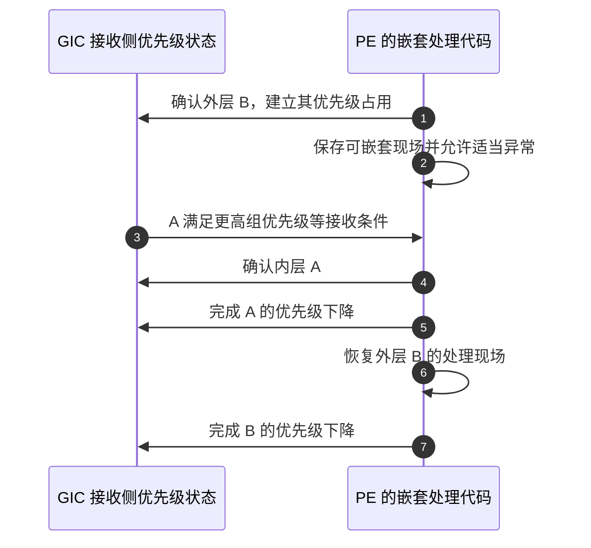

# 第5章\_优先级\_屏蔽与嵌套处理

## 5.1\_已经挂起的请求\_为什么仍然不能进入

**通用中断控制器（Generic Interrupt Controller，GIC）** 保存了一个挂起请求，只表示该请求在等待确认，不代表它现在就能打断处理器。上一章的 [S2～S3](P04_一次中断的状态转换与完成协议.md#4.4_用同一组阶段闭合正常周期)之间，还存在接收条件的筛选。

本章固定同一个安全组、同一个接收 **处理单元（Processing Element，PE）**，先看两个普通来源竞争。这样可以分开“在等待者中选谁”和“能否打断已经运行的处理代码”，不把安全切换、目标路由和嵌套同时倒进一个例子。

## 5.2\_优先级数值为什么越小越紧急

GIC 用无符号数表示优先级，数值较小的来源具有较高优先级。这是编码约定，不是“中断号小所以优先”。**中断标识符（Interrupt Identifier，INTID）** 负责识别来源，优先级是另一个配置维度。

架构提供 8 位优先级字段，但实现可以只实现其中的高若干位。未实现的低位不能提供额外区分能力。因此不能因为字段有 8 位，就宣称有 256 个有效优先级。本章算例取 0x40、0x60、0x68、0x80 这些值，并假设所需高位有效；对具体机器还应核对实现与当前安全访问视图。

两条请求都挂起时，控制器先依据有效优先级选择适合递送的来源。对无法从当前信息区分的请求，不应依赖“刚好这一次先来了谁”建立软件正确性；设备队列和任务依赖不能寄托在未确认的仲裁细节上。

> 官方对照：[规范 IHI0069 H.b](https://developer.arm.com/documentation/ihi0069/hb)，4.8 Interrupt prioritization（4-71），特别是实现优先级位数的规则。数值算例仅在所用位有效、处于相同安全访问视图时成立，不是 RK3588 运行配置。

## 5.3\_先过固定门槛\_再过当前处理的门槛

**优先级屏蔽寄存器（Priority Mask Register，PMR）** 的具体系统寄存器名为 `ICC_PMR_EL1`。它保存当前 PE 的优先级门槛，只有数值严格小于门槛的普通请求，才满足这一项递送条件。这里比较的是同一访问视图中的值；跨安全状态的数值转换不在本算例中混用。

如果门槛是 0x80，优先级 0x40 和 0x60 可以通过，0x80 本身不能通过。通过 PMR 仍不代表可以确认：来源可能未使能、目标不匹配，或者当前已经占用了更高的运行优先级。

**运行优先级（Running priority）** 表达接收侧尚未完成优先级下降的确认带来的约束。它不是 C 函数当前运行到哪行，也不是外设缓冲区的紧急程度。软件确认中断时，控制器更新它；软件按协议写结束寄存器后，再恢复之前的约束。可通过 `ICC_RPR_EL1`，即 **Running Priority Register（运行优先级寄存器）**，观察该接收侧状态。

```text
初始没有占用的中断优先级：运行优先级为 idle 值 0xFF
确认优先级 0x60 的来源：运行优先级收紧
优先级 0x40 的新来源到来：可能满足抢占条件
优先级 0x80 的新来源到来：不能因此抢占 0x60
完成当前优先级下降：恢复此前的接收侧约束
```

**抢占（Preemption）** 指更高优先级的请求引起嵌套处理，打断当前较低优先级的处理过程。硬件允许抢占，还不等于软件现场已经能安全嵌套；处理器异常屏蔽、栈、保存现场和处理程序可重入性仍须满足条件。

> 官方对照：[规范 IHI0069 H.b](https://developer.arm.com/documentation/ihi0069/hb)，4.8.5 Preemption、4.8.6 Priority masking，以及 12.2.19 ICC_PMR_EL1、12.2.20 ICC_RPR_EL1。核对“严格高于屏蔽门槛”与“高于当前运行优先级”是两个条件。

## 5.4\_为什么还要区分组优先级与子优先级

有时希望两个来源在排队时分先后，但不希望它们互相打断。于是需要把优先级拆成两个作用不同的部分：高位的 **组优先级（Group priority）** 用于判断能否抢占，低位的 **子优先级（Subpriority）** 参与等待请求之间的先后选择。

切分由 **二进制分割点寄存器（Binary Point Register，BPR）** 控制；**第 1 组（Group 1，中断的组归属名称）** 对应 `ICC_BPR1_EL1`。它是抢占策略的配置，不是另一个来源编号，也不是第 6 章的“安全组”。

假设一个教学配置把低 4 位作为子优先级，且没有其他改变分割点语义的配置，比较如下：

| 来源 | 完整优先级 | 用于比较抢占的高位部分 | 已在处理 B 时怎么办 |
| --- | --- | --- | --- |
| A | 0x40 | 0x40 | 组优先级更高，可以成为抢占候选 |
| B | 0x60 | 0x60 | 当前占用者 |
| C | 0x68 | 0x60 | 与 B 同组优先级，不能仅凭完整数值不同而互相抢占 |

若 B、C 都只是等待者，完整有效优先级仍能区分它们。这个区别解释了为什么“优先级更高”必须追问具体在比较哪一步：选择等待者，还是打断已确认的处理过程。

> 官方对照：[规范 IHI0069 H.b](https://developer.arm.com/documentation/ihi0069/hb)，4.8.3 Priority grouping、12.2.5 ICC_BPR1_EL1。查分割点如何区分 Group priority 与 Subpriority，并注意文中的安全配置条件；这里的低 4 位算例没有承诺实际 BPR 取值。

## 5.5\_控制器屏蔽与处理器屏蔽不能互相替代

GIC 的 **来源使能** 控制某个请求能否参与递送；**组使能** 控制一组来源；PMR 控制当前 PE 接受的优先级范围。这些状态都属于控制器协议。

处理器还有自己的 **处理器状态（Processor State，PSTATE）**。在本专题使用的 AArch64（64 位执行状态的架构专名）中，PSTATE 的 I 位用于屏蔽普通 IRQ 异常；IRQ 是 **Interrupt Request（中断请求）** 在这一异常输入路径中的名称。屏蔽它不会自动清除控制器的挂起位，也不会读取外设数据。

因此，“临时禁止本地中断”通常只是收紧当前处理器的一项接收条件，不等于关闭所有设备。恢复接收以后，之前保留的请求仍可能被递送。反过来，禁止一个来源，也不等于已经等到别的处理器上正在执行的处理函数退出。

下面这些观察必须分开解释：

| 观察 | 能说明什么 | 不能据此断言什么 |
| --- | --- | --- |
| 来源挂起但未进入 | 请求状态存在 | 处理器已允许接收，或所有配置正确 |
| 来源使能为 0 | 该使能条件不成立 | 外设停止工作、挂起状态清空、旧处理已经结束 |
| PE 普通异常被屏蔽 | 当前 PE 不在这一接收条件下进入普通 IRQ | 其他 PE 也被屏蔽，或者设备数据得到保护 |
| 软件返回了处理函数 | 当前函数执行结束 | 已按正确模式完成全部控制器动作 |

> 官方对照：[概览 198123，3.2-01](https://developer.arm.com/documentation/198123/0302)，第 5 章 Configuring the Arm GIC 与第 6 章 Handling interrupts，对照控制器接收条件与处理器异常屏蔽。处理器异常与返回可继续查 [Exception model，Version 1.0](https://developer.arm.com/-/media/Arm%20Developer%20Community/PDF/Learn%20the%20Architecture/Exception%20model.pdf?revision=a62f2bf2-b08a-4a4f-8cbe-38c67ddf4434) 第 5 章 Handling exceptions，尤其 5.2 Taking an exception。

## 5.6\_嵌套需要成对恢复\_不能乱序结束

假设外层 B 已经确认，软件建立了可嵌套现场并重新允许适当异常，高优先级 A 随后进入。完成时应先结束内层 A 的优先级占用，再结束外层 B；不能为了让某个来源“赶紧恢复”而任意写结束寄存器。



步骤 5 与步骤 7 的顺序对应确认动作的逆序。架构要求正确匹配确认与优先级下降；分离模式还必须独立兑现来源停用义务。为了理解这一协议而画出的嵌套过程，不代表某套 Linux 的普通硬中断入口已经启用这种嵌套策略。

本章解释了 S2 为什么可能等待，以及 S5 为什么不只是清一个来源位。下一章回到 S0：谁有权配置这些状态，怎样保证来源放开以前接收路径已经准备好？

资料定位：[IHI0069 H.b，第 4 章及 ICC_PMR_EL1、ICC_BPR1_EL1、ICC_RPR_EL1 条目](https://developer.arm.com/documentation/ihi0069/hb)；[198123 第 6 章](https://developer.arm.com/documentation/198123/0302)。

上一篇：[上一章](P04_一次中断的状态转换与完成协议.md#4.1_处理入口已经运行_为什么还没有完成)

[专题大纲](大纲.md#1.2_因果阅读地图)

下一篇：[初始化](P06_权限_安全分组与初始化闭环.md#6.1_为什么照着寄存器名写值还不够)
