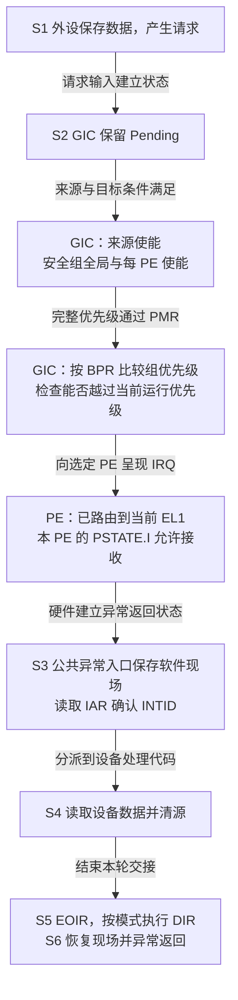
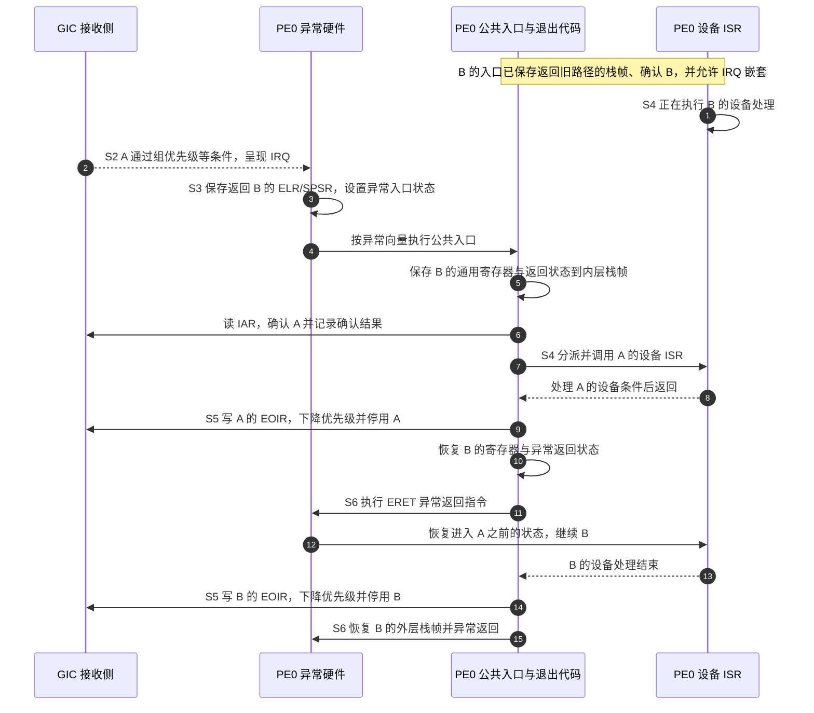

# 第5章\_优先级\_屏蔽与嵌套处理

## 5.1\_已经挂起的请求\_为什么仍然不能进入

**通用中断控制器（Generic Interrupt Controller，GIC）** 保存了一个挂起请求，只表示该请求在等待确认，不代表它现在就能打断处理器。上一章的 [S2～S3](P04_一次中断的状态转换与完成协议.md#4.4_用同一组阶段闭合正常周期)之间，还存在接收条件的筛选。

本章先固定 **非安全第 1 组（Non-secure Group 1）**：这是把来源交给非安全软件使用的中断安全归属，不决定优先级。后文会明确区分它与“组优先级”。再固定同一个接收 **处理单元（Processing Element，PE）**，先看两个来源竞争。这样可以分开“在等待者中选谁”和“能否打断已经运行的处理代码”，不把安全切换、目标路由和嵌套同时倒进一个例子。

## 5.2\_优先级数值为什么越小越紧急

GIC 用无符号数表示优先级，数值较小的来源具有较高优先级。这是编码约定，不是“中断号小所以优先”。**中断标识符（Interrupt Identifier，INTID）** 负责识别来源，优先级是另一个配置维度。

架构提供 8 位优先级字段，但实现可以只实现其中的高若干位。未实现的低位不能提供额外区分能力。因此不能因为字段有 8 位，就宣称有 256 个有效优先级。本章算例取 0x40、0x60、0x68、0x80 这些值，并假设所需高位有效；对具体机器还应核对实现与当前安全访问视图。

两条请求都挂起时，控制器先依据有效优先级选择适合递送的来源。对无法从当前信息区分的请求，不应依赖“刚好这一次先来了谁”建立软件正确性；设备队列和任务依赖不能寄托在未确认的仲裁细节上。

> 官方对照：[规范 IHI0069 H.b](https://developer.arm.com/documentation/ihi0069/hb)，4.8 Interrupt prioritization（4-71），特别是实现优先级位数的规则。数值算例仅在所用位有效、处于相同安全访问视图时成立，不是 RK3588 运行配置。

## 5.3\_先过固定门槛\_再过当前处理的门槛

**优先级屏蔽寄存器（Priority Mask Register，PMR）** 的具体系统寄存器名为 `ICC_PMR_EL1`。它保存当前 PE 的优先级门槛，只有数值严格小于门槛的请求，才满足这一项递送条件。这里比较的是同一访问视图中的值；跨安全状态的数值转换不在本算例中混用。

如果门槛是 0x80，优先级 0x40 和 0x60 可以通过，0x80 本身不能通过。通过 PMR 仍不代表可以确认：来源可能未使能、目标不匹配，或者当前已经占用了更高的运行优先级。

**运行优先级（Running priority）** 表达接收侧尚未完成优先级下降的确认带来的约束。它不是 C 函数当前运行到哪行，也不是外设缓冲区的紧急程度。软件确认中断时，控制器更新它；软件按协议写结束寄存器后，再恢复之前的约束。可通过 `ICC_RPR_EL1`，即 **Running Priority Register（运行优先级寄存器）**，观察该接收侧状态。

```text
初始没有占用的中断优先级：运行优先级为 idle 值 0xFF
确认优先级 0x60 的来源：运行优先级收紧
优先级 0x40 的新来源到来：可能满足抢占条件
优先级 0x80 的新来源到来：不能因此抢占 0x60
完成当前优先级下降：恢复此前的接收侧约束
```

**抢占（Preemption）** 指更高优先级的请求引起嵌套处理，打断当前较低优先级的处理过程。硬件允许抢占，还不等于软件现场已经能安全嵌套；处理器异常屏蔽、栈、保存现场和处理程序可重入性仍须满足条件。

> 官方对照：[规范 IHI0069 H.b](https://developer.arm.com/documentation/ihi0069/hb)，4.8.5 Preemption、4.8.6 Priority masking，以及 12.2.19 ICC_PMR_EL1、12.2.20 ICC_RPR_EL1。核对“严格高于屏蔽门槛”与“高于当前运行优先级”是两个条件。

## 5.4\_为什么还要区分组优先级与子优先级

有时希望两个来源在排队时分先后，但不希望它们互相打断。例如 B、C 都处理同一类低紧急度设备，先处理更紧急的 B 有价值，但在 C 已经执行时再为 B 保存一层现场，未必值得。于是把优先级拆成两个部分：高位的 **组优先级（Group priority）** 决定能否抢占，低位的 **子优先级（Subpriority）** 在等待者之间继续区分先后。这里的“同组优先级”准确地说是 **高位部分相等**，不是又创建了一个名叫 Group 0 或 Group 1 的来源集合。

切分由 **二进制分割点寄存器（Binary Point Register，BPR）** 控制。当前非安全 Group 1 路径通常使用 `ICC_BPR1_EL1`；其中的 1 是安全分组名称，寄存器内容才决定优先级位的分割。**共同二进制分割点（Common Binary Point Register，CBPR）** 是控制字段名称，置位后可以让 Group 1 使用 `ICC_BPR0_EL1` 的分割规则；下面固定 CBPR 为 0，避免两个配置分支混用。

### 5.4.1\_把一个优先级数值按位拆开

先对控制器使用的 **完整 8 位优先级** 做教学计算，暂不把它当作非安全软件直接读写的数值。假设低 4 位属于子优先级，高 4 位属于组优先级：

```text
完整优先级：  b7 b6 b5 b4 | b3 b2 b1 b0
用于抢占：  保留高 4 位 | 低 4 位视为 0
等待者选择：比较完整有效优先级，不因 BPR 相同而丢掉低位信息

B = 0xB0 = 1011 | 0000，抢占比较值 0xB0
C = 0xB4 = 1011 | 0100，抢占比较值 0xB0
A = 0xA0 = 1010 | 0000，抢占比较值 0xA0
```

| 来源 | 完整优先级 | 抢占比较值 | B 已确认且尚未下降优先级时 |
| --- | --- | --- | --- |
| A | 0xA0 | 0xA0 | 小于 B 的比较值，可以成为抢占候选 |
| B | 0xB0 | 0xB0 | 当前占用者 |
| C | 0xB4 | 0xB0 | 高位与 B 相等，不能抢占 B |

反过来，若 C 已在处理，B 也不能抢占 C；若 B、C 都未确认而只是在等待，完整优先级 0xB0 小于 0xB4，B 先被选择。两者没有矛盾：前一个问题比较 **能否打断当前处理**，后一个问题比较 **下次先领取谁**。

### 5.4.2\_分割点编码与软件看到的数值不能混用

在规范的两安全状态模型、CBPR 为 0 时，下列编码都能把 **完整优先级** 切成高 4 位与低 4 位，但属于不同接口视图：

| 使用的分割点寄存器视图 | 分割点值 | 完整优先级中的组优先级位 | 子优先级位 |
| --- | --- | --- | --- |
| Secure `ICC_BPR1_EL1` | 3 | `[7:4]` | `[3:0]` |
| Non-secure `ICC_BPR1_EL1` | 4 | `[7:4]` | `[3:0]` |

这些编码还受实现支持的优先级位数和最小分割点约束，不能跳过读回能力核对。上面的 A、B、C 算例要求区分 0xB0 与 0xB4 的位实际存在；未实现的位写进去不会创造新的优先级。

为什么本节改用 0xA0、0xB0、0xB4？前节 0x40、0x60、0x68 是同一非安全访问视图中的教学值；在启用两安全状态时，非安全优先级的视图存在变换。对本例涉及的有效位，完整优先级为 `0x80 | (非安全视图值 >> 1)`，所以它们分别对应 0xA0、0xB0、0xB4。规范要求优先级分割作用在完整优先级上，不能把非安全读到的数值直接套进完整位图，再猜一个 BPR 编码。

本章只在这个固定边界下做算例。若关闭两安全状态，或改用共同分割点，要重新按对应表格计算；不能把本表当作所有模式都相同的初始化常量。

此外，PMR/RPR 是否使用变换后的非安全数值视图，还与高权限安全路由配置有关。前面的门槛算例以来源与门槛视图已经对齐、PMR 当前允许非安全软件配置为前提；不能只因代码在非安全环境执行，就把两个寄存器读数直接相减。具体访问条件见规范 4.8.2，配置责任由下一章展开。

> 官方对照：[IHI0069 H.b](https://developer.arm.com/documentation/ihi0069/hb)，4.8.3 Priority grouping，Table 4-10、4-11、4-12（印刷页 4-74～4-76）与 4.8.7 Software accesses of interrupt priority；12.2.5 ICC_BPR1_EL1。重点查完整值、非安全视图、CBPR 和分割点编码分别改变哪一步。

## 5.5\_控制器屏蔽与处理器屏蔽不能互相替代

现在把“能不能送达”放回硬件路径。**来源使能** 是一个 INTID 的开关；**中断安全组使能** 是 Group 0、Secure Group 1 或 Non-secure Group 1 对应的递送开关；PMR 是当前 PE 的优先级门槛。中断安全组使能与上节的组优先级不是同一件事：关闭 Non-secure Group 1，会挡住这个安全分组中不同优先级的来源，不是只挡住高位相等的一档优先级。

对共享来源，来源使能保存在 **分发器（Distributor）** 的 `GICD_ISENABLER<n>` 等寄存器接口中；私有来源由对应 **再分发器（Redistributor）** 的 `GICR_ISENABLER0` 等接口管理。全局安全组递送由 `GICD_CTLR` 控制，而每 PE 的 `ICC_IGRPEN1_EL1`，即 **Interrupt Controller Interrupt Group 1 Enable register（中断控制器第 1 组使能寄存器）**，控制该 PE 对相应安全状态 Group 1 的接收。本例需要 Non-secure Group 1 的全局与本 PE 接收条件都成立。

处理器另外维护 **处理器状态（Processor State，PSTATE）**。在本专题的 AArch64（64 位执行状态的架构专名）模型中，**中断请求（Interrupt Request，IRQ）** 是一种异步异常类别。先固定 IRQ 路由到当前执行的 EL1、没有更高异常级接管：此时 **PE0 的 PSTATE.I 为 1，只屏蔽 PE0 对这类 IRQ 的接收**；PE1 的 PSTATE.I 不会随它改变。设备仍可接收数据，GIC 仍可保留请求，已在其他 PE 上运行的处理代码也不会因此停止。

图中的 **中断确认寄存器（Interrupt Acknowledge Register，IAR）** 用于领取具体来源；**中断结束寄存器（End Of Interrupt Register，EOIR）** 与 **中断停用寄存器（Deactivate Interrupt Register，DIR）** 执行第四章的完成协议。下文合写 EOIR/DIR 时只是并列这两类接口，不表示必须无条件写两次。设备处理代码也称 **中断服务程序（Interrupt Service Routine，ISR）**，由公共入口识别来源后调用。



图表示 **逻辑条件与阶段关系**，不宣称 GIC 内部按每个框串行执行软件式检查。若任一递送条件不成立，Pending 不会因为“尚未送达”就自动变为 Active；只有真实确认才建立对应的活动交接。处理器接收异常与入口读 IAR 也必须分开观察。

### 5.5.1\_哪些异常受哪个屏蔽位约束

“普通异常”不是本章采用的正式分类。AArch64 的异常向量区分以下四类；本章主线只处理其中的 IRQ：

| 异常类别 | 从哪里来 | 与本章屏蔽位的关系 |
| --- | --- | --- |
| 同步异常（Synchronous exception） | 执行指令时触发，例如系统调用、地址访问异常 | 不因 PSTATE.I 为 1 就禁止发生 |
| IRQ | 外设或核间通知经中断路径递送 | 在本章当前 EL1 接收模型下，由 I 位屏蔽 |
| FIQ（Fast Interrupt Request，快速中断请求） | 另一类中断异常输入，其呈现与安全分组有关 | 在对应的当前异常级接收模型下，由 F 位屏蔽；Fast 不保证设备更快 |
| SError（System Error，系统错误） | 异步系统错误，例如某些内存系统错误报告 | 由相应错误路由规则及 A 位等控制，不由 I 位统一控制 |

PSTATE 的 D 位还屏蔽适用的调试异常，它不是第五个与上表同级的向量类别。这些位不是“关闭整个 PE”的总开关。尤其是路由到更高异常级的中断，要按目标异常级与架构路由规则判断，不能用低异常级当前的 I/F 位一概推断能否屏蔽。具体路由在下一章建立。

本卷固定 GICv3.0，不把后续 GICv3.3 引入的 **不可屏蔽中断（Non-maskable Interrupt，NMI）** 支持混入当前模型，也不把 FIQ 简称为 NMI。

| 观察 | 能说明什么 | 不能据此断言什么 |
| --- | --- | --- |
| 来源 Pending，但尚未进入 | 控制器有待确认状态 | 路由、优先级和 PE 接收条件都正确 |
| 来源使能为 0 | 该来源不能按此使能条件递送 | 数据停止产生、Pending 已清空、旧处理已结束 |
| 当前 EL1 的 IRQ 被本 PE 的 I 位屏蔽 | 本 PE 暂不接收这一模型中的 IRQ | 其他 PE 被屏蔽，或共享数据已经免于并发访问 |
| 设备 ISR 已返回 | 设备处理函数本次调用结束 | 已按当前模式完成 EOIR/DIR，或已经执行异常返回 |

> 官方对照：[概览 198123，3.2-01](https://developer.arm.com/documentation/198123/0302)，第 5～6 章的使能和递送条件；[Exception model，Version 1.0](https://developer.arm.com/-/media/Arm%20Developer%20Community/PDF/Learn%20the%20Architecture/Exception%20model.pdf?revision=a62f2bf2-b08a-4a4f-8cbe-38c67ddf4434)，第 4 章 Exception types、第 5 章 Handling exceptions、第 6 章 The vector tables。GIC 的 NMI 版本边界见概览第 5 章来源配置中的 Non-maskable 项。

## 5.6\_嵌套需要成对恢复\_不能乱序结束

这里的 A、B 是两个中断来源及其处理过程，不是两个线程。假设外层 B 正在 PE0 的 EL1 执行，高优先级 A 随后满足 GIC 抢占条件，而且入口软件已经允许同 EL 的 IRQ 嵌套。A 不需要知道 B 正在执行哪行代码；B 也不会预知 A 何时到来。**中断接收由硬件触发，现场的保存与恢复由架构公共异常入口负责，设备 ISR 只承担该框架交给它的设备工作。**

### 5.6.1\_硬件先保存什么\_公共入口还必须保存什么

**异常链接寄存器（Exception Link Register，ELR）** 保存异常返回地址，**保存的程序状态寄存器（Saved Program Status Register，SPSR）** 保存进入前的处理器状态。A 被接收时，PE 硬件把返回 B 所需的地址写入 `ELR_EL1`，把进入前的 PSTATE 写入 `SPSR_EL1`，更新屏蔽等执行状态，再转向异常向量。

硬件没有因此把所有通用寄存器自动压栈。公共入口代码必须把需要保留的寄存器、返回地址和状态保存到软件栈帧，再调用 A 的 **中断服务程序（Interrupt Service Routine，ISR）**。这里要保留的不只是普通函数调用约定中的部分寄存器，因为异步打断可能发生在 B 使用任意寄存器保存临时值的时候。

而且同一个 EL 的 ELR/SPSR 不是硬件无限深栈。B 首次进入时，这两个寄存器保存的是返回 B 之前执行路径的信息；如果 B 的公共入口没有先把这份信息保存到软件栈，A 再进入就会覆盖它。因此 **B 的入口在允许嵌套之前要先建立完整栈帧**；这是公共入口保护异常返回链的责任，不是要求 B 的设备函数替未来 A 的代码做备份。

### 5.6.2\_从打断到恢复B的完整时间线

下面固定 EOImode 为 0，且 B 尚未优先级下降。**异常返回指令（Exception Return，ERET）** 根据恢复后的返回状态继续旧路径。图中的“硬件”“公共入口”和“设备 ISR”是同一 PE 上不同职责的阶段，不是三颗处理器。



步骤 3 是硬件建立最小异常返回状态，步骤 5 是公共入口保存软件现场；步骤 8 的 ISR 函数返回也还不是步骤 11 的 **异常返回指令（Exception Return，ERET）**。ERET 根据恢复后的 SPSR/ELR 原子恢复执行状态和返回位置，才使 B 继续。

步骤 9 先结束 A 的优先级占用，步骤 14 再结束 B，顺序与确认相反。若在内层 A 尚未完成优先级下降时先写 B 的结束信息，就破坏接收侧维护的嵌套优先级关系。分离模式还要另外追踪各来源的停用责任，不能只按 C 函数返回顺序猜测全部动作都完成。

即使现场保存正确，设备处理代码也可能因重入、锁或共享数据不允许嵌套。例如 B 持有一个只能由它释放的锁，A 打断 B 后在同一 PE 忙等该锁，B 就没有机会继续释放。因此允许嵌套是整个入口框架与处理代码共同满足的策略条件；本图解释架构可支持的协议，不代表某套 Linux 的硬中断入口采用这种策略。

> 官方对照：[Exception model，Version 1.0](https://developer.arm.com/-/media/Arm%20Developer%20Community/PDF/Learn%20the%20Architecture/Exception%20model.pdf?revision=a62f2bf2-b08a-4a4f-8cbe-38c67ddf4434)，5.2 Taking an exception、5.5 Returning from an exception；[IHI0069 H.b](https://developer.arm.com/documentation/ihi0069/hb)，4.1.1 的确认与优先级下降配对规则、4.8.5 Preemption。


本章解释了 S2 为什么可能等待，以及 S5 为什么不只是清一个来源位。下一章回到 S0：谁有权配置这些状态，怎样保证来源放开以前接收路径已经准备好？

资料定位：[IHI0069 H.b，第 4 章及 ICC_PMR_EL1、ICC_BPR1_EL1、ICC_RPR_EL1 条目](https://developer.arm.com/documentation/ihi0069/hb)；[198123 第 6 章](https://developer.arm.com/documentation/198123/0302)。

上一篇：[上一章](P04_一次中断的状态转换与完成协议.md#4.1_处理入口已经运行_为什么还没有完成)

[专题大纲](大纲.md#1.2_因果阅读地图)

下一篇：[初始化](P06_权限_安全分组与初始化闭环.md#6.1_为什么照着寄存器名写值还不够)
