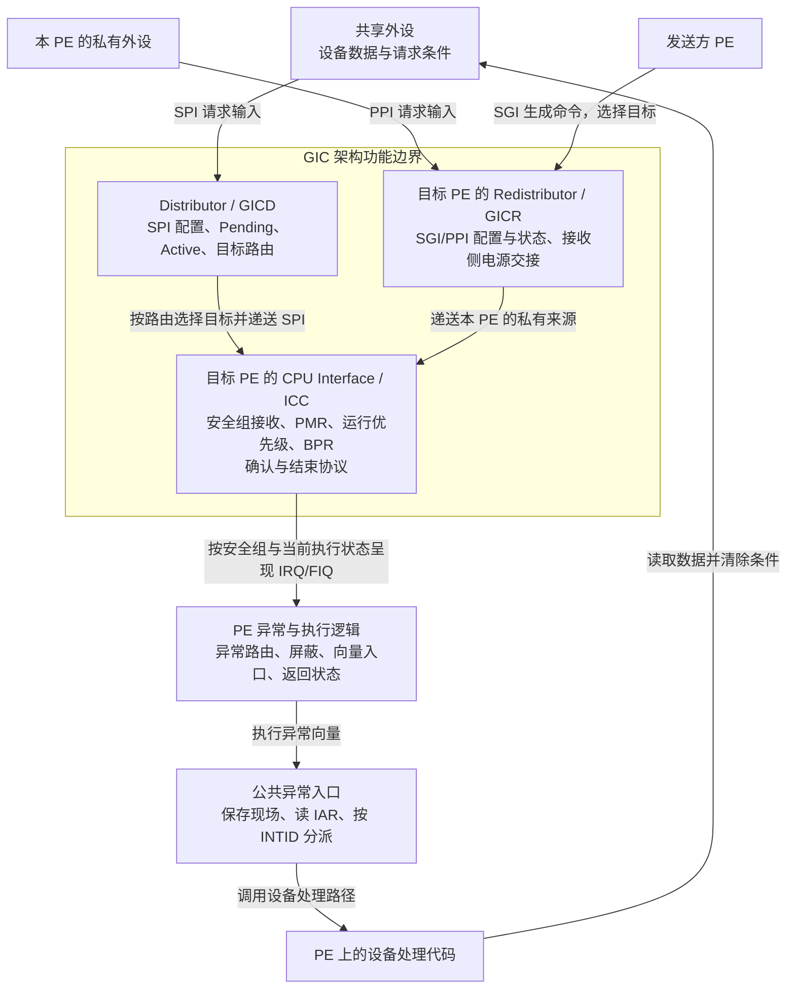

# 第6章\_权限\_安全分组与初始化闭环

## 6.1\_为什么照着寄存器名写值还不够

前面已经能追踪 **通用中断控制器（Generic Interrupt Controller，GIC）** 的请求处理与优先级。但这些过程默认初始化成立。现在把机器放回启动时刻：处理入口还没建立，软件权限可能尚未开放，接收侧也未必处于可接收状态。此时先使能外设，可能让请求进入尚未准备好的路径。

本章放大 [S0 准备阶段](P04_一次中断的状态转换与完成协议.md#4.4_用同一组阶段闭合正常周期)，说明初始化的因果依赖，而不是给出可以在任意开发板上直接运行的寄存器写值表。默认讨论 AArch64 这个 64 位执行状态、GICv3.0 的亲和性路由，以及普通非安全操作系统使用的物理中断路径。

## 6.2\_先区分权限层次与安全状态

设想串口请求已经送到一个 **处理单元（Processing Element，PE）**，这时 PE 正在执行应用。处理代码在哪里运行？应用是否能随意把串口改交给另一个系统？这两个问题需要处理器的权限与安全模型来回答。

**异常级（Exception Level，EL）** 是 Arm 处理器组织软件权限和异常目标的层次。编号 EL0、EL1、EL2、EL3 分别表示第 0～3 异常级。同一个 PE 会随执行过程进入不同 EL，不是每个 EL 各有一颗处理器，也不是把所有来源分成四种中断。

| 异常级 | 常见的软件职责 | 与当前中断路径的关系 |
| --- | --- | --- |
| EL0 | 应用程序 | 可以被中断打断，但不能直接作为物理中断的异常接收目标 |
| EL1 | 操作系统内核 | 运行内存管理、系统调用、驱动等；处理中断是其中一种工作 |
| EL2 | 管理虚拟机的软件 | 可以按配置接管某些物理异常或截获下层访问 |
| EL3 | 安全固件 | 可以配置安全交接与高权限异常路由 |

这些是机制允许的软件安排，不断言所有系统都实际运行四层软件。如果应用能任意改所有中断配置，内核就无法保证隔离；因此访问某个寄存器需要满足当前权限与上层许可。寄存器名带有 EL1，也不等于“只有 EL1 能访问”或“这个寄存器决定去 EL1”。

**安全状态（Security state）** 则描述 PE 当前处在哪个安全访问域。本章采用传统的 **Secure（安全）** 与 **Non-secure（非安全）** 两状态模型；Non-secure 是域名，不表示系统已经遭到攻击。Secure EL1 与 Non-secure EL1 都是 EL1，但属于不同安全环境中的软件上下文。EL 说明权限层次，安全状态说明访问域，两者组合描述 PE 当前的执行位置；传统模型中的 EL3 承担安全切换控制，不能把它们当作任意自由组合的两张标签表。

这时可以定位第三种对象了：**中断安全组描述 GIC 中某个来源的归属；安全状态和 EL 描述处理器及软件当前的执行位置。** 两者通过“GIC 呈现哪种异常输入，处理器把该输入路由到哪层”连接。它们有关联，但来源上的一个分组位不会自行改变 PE 的 EL，也不直接选择某个设备函数。

> 官方对照：[Exception model，Version 1.0，ARM062-1010708621-27](https://developer.arm.com/-/media/Arm%20Developer%20Community/PDF/Learn%20the%20Architecture/Exception%20model.pdf?revision=a62f2bf2-b08a-4a4f-8cbe-38c67ddf4434)，第 2 章 Privilege and Exception levels、3.1 Execution states、3.2 Security state、5.3 Routing asynchronous exceptions。这里不引入后续架构增加的安全状态。

## 6.3\_安全组不是优先级分组

本节沿一条物理来源路径，把“来源归哪个安全域”“先交给哪个 PE”“最后由哪个 EL 接收”分别落到具体硬件状态，再把它们连成一次过程。

### 6.3.1\_来源分组位放在哪里\_与其他组有什么区别

**中断标识符（Interrupt Identifier，INTID）** 标识 GIC 的一个来源。在启用两安全状态的 GICv3 配置中，每个来源可以分配到 **安全第 0 组（Secure Group 0）**、**安全第 1 组（Secure Group 1）** 或 **非安全第 1 组（Non-secure Group 1）**。这些是访问与安全归属类别，影响谁能配置、确认和接收它。

**共享外设中断（Shared Peripheral Interrupt，SPI）** 的这些配置保存在 **分发器（Distributor）** 一侧，通过 `GICD_IGROUPR<n>`，即 **Interrupt Group Registers（中断分组寄存器）**，与 `GICD_IGRPMODR<n>`，即 **Interrupt Group Modifier Registers（中断分组修饰寄存器）** 的对应位表达。下面列的是来源对应的单个位，不是整个寄存器的数值：

| IGROUPR 位 | IGRPMODR 位 | 来源安全归属 |
| --- | --- | --- |
| 0 | 0 | Secure Group 0 |
| 0 | 1 | Secure Group 1 |
| 1 | 任意 | Non-secure Group 1；此时修饰位不决定分组 |

有权安全软件在 S0 初始化或受控重新配置时写这些位；GIC 在后续递送与访问检查中使用它们。**私有外设中断（Private Peripheral Interrupt，PPI）** 与 **软件产生中断（Software Generated Interrupt，SGI）** 的分组由目标 PE 对应的 **再分发器（Redistributor）** 保存，接口为 `GICR_IGROUPR0`、`GICR_IGRPMODR0`。普通非安全内核不能因为需要一个来源，就擅自把安全固件保留的来源改组。

上表限定两安全状态有效，亦即 `GICD_CTLR` 中 **禁用安全状态（Disable Security，DS）** 字段为 0；单安全状态配置应查它自己的编码语义，不能直接套用三类来源表。

后面的 GICD/GICR 是 Distributor 与 Redistributor 寄存器前缀的合写，分别指分发器和再分发器接口。**二进制分割点寄存器（Binary Point Register，BPR）** 把优先级分为用于抢占的高位与用于排队细分的低位；**优先级屏蔽寄存器（Priority Mask Register，PMR）** 保存接收门槛。它们延续上一章的优先级规则，作用与安全归属不同。现在可以把易混名称放在同一张表里：

| 名称 | 分类或控制什么 | 状态位置与作用时刻 | 不会直接决定什么 |
| --- | --- | --- | --- |
| 中断安全组 | 某 INTID 的安全归属 | GICD/GICR 分组位；S0 配置，S2～S3 递送与访问时使用 | 组优先级数值、最终处理函数 |
| 中断安全组使能 | 是否放开指定安全组的递送 | `GICD_CTLR` 的全局使能与每 PE 的 `ICC_IGRPEN*` 接收使能 | 不修改来源归属，也不修改 EL |
| 组优先级 | 优先级高位部分；高位相等的来源互不因子优先级抢占 | 来源优先级与接收侧 BPR；S2 比较抢占条件 | Secure/Non-secure 归属 |
| 安全状态 | PE 当前所在的安全访问域 | 处理器执行状态；影响访问和 IRQ/FIQ 呈现 | 某个设备 INTID 的分组位 |
| 异常级 EL | PE 当前软件权限层次及异常接收层次 | 处理器执行状态与异常路由；S3 建立异常入口 | 外设数据或工作队列长度 |

### 6.3.2\_硬件结构与配置归属先对齐

**处理器接口（CPU Interface）** 是每 PE 的 GIC 架构接口；CPU 是 **Central Processing Unit（中央处理器）**。该接口以 `ICC_*` 系统寄存器提供确认、优先级和结束协议，其中 **中断确认寄存器（Interrupt Acknowledge Register，IAR）** 用于领取具体 INTID。它属于 GIC 的功能模型，但可以集成在处理器核内；下图画的是 **功能边界与状态所有权**，不是声称所有 GIC 电路都物理独立于 CPU 核。

**IRQ（Interrupt Request，中断请求）** 与 **FIQ（Fast Interrupt Request，快速中断请求）** 是呈现给 PE 的两类中断异常输入。设备到 GIC 的请求线，与 GIC 向 PE 呈现的 IRQ/FIQ，不是同一层的“设备原样直连”。



图中 Distributor 到 CPU Interface 的箭头只表达 SPI 的功能递送关系，未展开芯片内部互连。**SPI 的配置与状态不会因为送往某个 PE，就变成该 PE 的 SGI/PPI 状态。** SGI 入口是发送方发出的生成命令，也不能画成某根外设引脚。消息中断的内存状态与翻译服务在后文单独建立。

### 6.3.3\_安全组怎样影响IRQ与FIQ\_又怎样到达EL

第一步由 GIC 选择向目标 PE 呈现哪一种输入。本章使用 GICv3 两安全状态、AArch64 的基础组合：

| 目标 PE 当前执行位置 | Secure Group 0 | Secure Group 1 | Non-secure Group 1 |
| --- | --- | --- | --- |
| Secure EL0/EL1 | FIQ | IRQ | FIQ |
| Non-secure EL0/EL1/EL2 | FIQ | FIQ | IRQ |
| EL3 | FIQ | FIQ | FIQ |

因此，在非安全系统执行时，同为 Group 1 的两个安全归属可以呈现不同输入。GICv3 本章边界内 **Group 0 呈现为 FIQ**；Group 1 则要看当前安全状态与 EL，不能把它永远画成 IRQ。该表不涵盖 Secure EL2 等扩展组合。

第二步由 PE 决定输入进入哪一异常级。`SCR_EL3` 是 **Secure Configuration Register（安全配置寄存器）**，其 IRQ/FIQ 路由字段可以把相应物理异常送往 EL3。`HCR_EL2` 是 **Hypervisor Configuration Register（虚拟机管理程序配置寄存器）**，其中 IMO/FMO 是针对物理 IRQ/FIQ 路由至 EL2 的控制字段。本节只使用不重定向到 EL2 的主线；涉及虚拟化时需联合核对完整路由条件。EL3 路由配置优先于 EL2 路由配置，未被高层接管且符合当前执行条件的请求才按低层路径处理。

**GIC 的目标路由选择“哪个 PE”，处理器的异常路由选择“这个 PE 的哪个 EL”。** `GICD_IROUTER<n>` 是前者的 SPI 路由寄存器；SCR/HCR 是后者的处理器控制。改 SPI 目标不能自动改成 EL2 处理，改来源安全组也不是直接把一个 EL 数字写进 GIC。

固定一个完整例子：串口是 Non-secure Group 1 SPI，目标 PE 正在 Non-secure EL0/EL1；`SCR_EL3.IRQ=0`，EL2 存在时未通过 `HCR_EL2.IMO` 等适用控制接管这条 IRQ；来源、接收侧与屏蔽条件均已准备好。GIC 呈现 IRQ，PE 接收到 EL1，再由 EL1 公共入口读 IAR1 识别来源。若同一时刻到来的是 Secure Group 1，则在这个非安全执行环境中呈现 FIQ；当 `SCR_EL3.FIQ=1` 时先进入 EL3，由安全固件决定安全上下文交接，不能直接画成“GIC 跳到 Secure EL1 的驱动”。

**处理器状态（Processor State，PSTATE）** 的 I/F 位是本 PE 的接收控制之一。目标 EL 高于当前 EL 时不能套用“当前 I 位为 1 就挡住一切”的模型；目标低于当前 EL 时也不会强行降级进入。组归属、输入呈现、异常路由和当前执行状态要顺着同一条请求联合判断。

> 官方对照：[概览 198123，3.2-01](https://developer.arm.com/documentation/198123/0302)，第 4 章 Security model，PDF 第 16～17 页的输入呈现表与路由例子；第 6 章 Handling interrupts 的安全切换例子。[IHI0069 H.b](https://developer.arm.com/documentation/ihi0069/hb)，4.6 Interrupt grouping、12.9.13 GICD_IGROUPR、12.9.15 GICD_IGRPMODR。[Exception model 1.0](https://developer.arm.com/-/media/Arm%20Developer%20Community/PDF/Learn%20the%20Architecture/Exception%20model.pdf?revision=a62f2bf2-b08a-4a4f-8cbe-38c67ddf4434)，5.3 Routing asynchronous exceptions。

### 6.3.4\_把安全归属与异常进入放回S0到S6

下面仍使用[第四章的 S0～S6](P04_一次中断的状态转换与完成协议.md#4.4_用同一组阶段闭合正常周期)，放大刚才的非安全串口主线。**向量基地址寄存器（Vector Base Address Register，VBAR）** 保存异常入口集合的位置；**异常链接寄存器（Exception Link Register，ELR）** 保存返回地址；**保存的程序状态寄存器（Saved Program Status Register，SPSR）** 保存进入前的执行状态。它们由 PE 使用，不能当作 GIC 寄存器。

相对地，`ICC_IAR1_EL1` 是本例的中断确认接口；`ICC_EOIR1_EL1` 是 **中断结束寄存器（End Of Interrupt Register，EOIR）** 接口，`ICC_DIR_EL1` 是 **中断停用寄存器（Deactivate Interrupt Register，DIR）** 接口。它们推进 GIC 状态；**异常返回指令（Exception Return，ERET）** 则恢复 PE 的执行状态与位置。

| 阶段 | 谁执行或改变硬件状态 | 本例的状态落点 | 这一阶段解决的问题 |
| --- | --- | --- | --- |
| S0 准备 | 有权固件、控制器启动代码、设备驱动各自配置所属状态 | GIC 来源分组/优先级/目标；PE 的 SCR/HCR、VBAR 与接收状态；软件分派表 | 谁拥有来源，谁能够安全接收 |
| S1 事件 | 外设硬件保存数据并产生请求 | 外设缓冲与状态寄存器 | 真实工作在哪里 |
| S2 保留与选择 | GIC 保存 Pending，按使能、目标、优先级和安全组选择 | SPI 的 GICD 状态、目标 CPU Interface 的接收状态 | 哪个 PE 现在有资格收到哪个输入 |
| S3 异常进入与确认 | PE 先路由 IRQ 到 EL1，保存 ELR/SPSR 并跳向 VBAR；公共入口保存软件现场，再读 `ICC_IAR1_EL1` | PE 的返回状态、软件栈、GIC 的 Active 与运行优先级 | 先知道从哪里执行，再确认具体 INTID |
| S4 处理设备 | PE 执行来源对应的设备处理代码 | 外设数据/状态与软件队列 | 取走工作并消除设备请求条件 |
| S5 完成协议 | PE 执行结束寄存器写入，GIC 更新交接状态 | `ICC_EOIR1_EL1`，分离模式另用 `ICC_DIR_EL1` | 结束优先级占用，并完成来源停用 |
| S6 返回 | 公共退出代码恢复现场，PE 执行异常返回 | 软件栈、ELR/SPSR 与恢复后的 PSTATE | 返回之前的执行位置 |

S3 先进入架构向量再读 IAR；S5 的控制器结束也不是 S6 的处理器返回。把这两处分开，才能判断故障发生在来源识别、设备处理、控制器交接还是执行现场恢复。

有了这条链，初始化要求就不再是一串孤立寄存器名：必须先为各个后续阶段建立有效状态，才允许 S1 的设备请求进入。


## 6.4\_全局\_每核与每个来源分别准备什么

**处理单元（Processing Element，PE）** 是接收并执行处理代码的实体。对于一个多 PE 系统，至少有三种初始化作用域。**再分发器（Redistributor）** 承担每个 PE 的接收侧配置；**处理器接口（CPU Interface；CPU 即 Central Processing Unit，中央处理器）** 承担确认与优先级交接：

| 作用域 | 状态由谁准备 | 接收路径需要的条件 | 遗漏后的典型结果 |
| --- | --- | --- | --- |
| 全局 | 拥有控制器全局配置的软件 | 分发器的路由模式、组递送和共享来源基础设置 | 多个 PE 同时受到影响，或某类请求无法分发 |
| 每 PE | 固件与该 PE 的内核启动路径按职责交接 | 对应再分发器可用、CPU Interface 可访问、优先级与组接收设置、异常入口 | 其他 PE 正常，某个 PE 收不到 |
| 每来源 | 控制器驱动与设备驱动各管所属部分 | 类型、优先级、路由、使能；设备处理函数与设备条件准备 | 只有某个来源失败或持续重触发 |

**分发器控制寄存器（Distributor Control Register）** `GICD_CTLR` 包含组使能与路由相关字段。**亲和性路由使能（Affinity Routing Enable，ARE）** 表达按处理器硬件坐标路由的模式；GIC-600 不提供旧式兼容操作，其 ARE 固定为开启，不能把“先切到旧模式再初始化”当作当前平台通用步骤。

CPU Interface 的系统寄存器访问由 `ICC_SRE_ELn` 中的 **系统寄存器使能（System Register Enable，SRE）** 等控制决定，n 表示对应异常级。

* 上层允许访问与当前层选择接口需要共同成立；
* 某些核将有关位固定为开启，也必须依据该实现确认，不能默认一次低权限写入就打开所有访问。

每个 PE 还需要有效的异常向量入口、可用栈和现场保存规则。异常向量是处理器在发生异常时使用的入口集合，其位置由 `VBAR_ELn`，即 **Vector Base Address Register（向量基地址寄存器）** 指定。向量入口与某个串口驱动函数不是同一层：先进入架构处理入口，再识别来源并分派到设备逻辑。

> 官方对照：[概览 198123，3.2-01](https://developer.arm.com/documentation/198123/0302)，第 5 章 Configuring the Arm GIC（PDF 第 20～26 页）；[GIC-600 r1p6 手册](https://developer.arm.com/documentation/100336/0106) 第 2 章（2-20）的旧式操作限制。系统寄存器许可继续查规范 IHI0069 H.b 第 12.2 节的 ICC_SRE_EL1/EL2/EL3 条目；向量查 Exception model 第 6 章 The vector tables。

## 6.5\_唤醒接收侧为什么要握手

再分发器的 `GICR_WAKER` 是 **再分发器唤醒寄存器（Redistributor Wake Register）**。其 **`ProcessorSleep`（处理器休眠）** 字段由有权软件表达处理器的睡眠交接请求；**`ChildrenAsleep`（下属接口已休眠）** 由硬件反映有关接收侧接口的握手状态。两个字段不是同一个软件变量的别名。

在适用的启动序列中，软件清除 ProcessorSleep，然后等待 ChildrenAsleep 变为 0，再按契约配置和使用 CPU Interface。原因是软件提出“准备接收”和硬件完成接口状态转换可能相隔一段时间；立即继续访问，不能由刚刚那次写指令证明安全。

这里的“等待”要带失败处理：若硬件、时钟或权限条件不成立，无限循环会把启动故障变成死等。工程实现应提供有依据的超时与诊断，并且 **不能在超时后假装握手已经完成**。具体等待多久由平台和驱动设计决定，本专题不虚构统一的微秒数。

关核时的逆向交接还要考虑未结束的请求和目标迁移，下一章单独解释；执行一条等待中断指令不自动等于应当设置 ProcessorSleep。

> 官方对照：[规范 IHI0069 H.b](https://developer.arm.com/documentation/ihi0069/hb)，12.11.42 GICR_WAKER, Redistributor Wake Register；[GIC-600 r1p6 手册](https://developer.arm.com/documentation/100336/0106)，3.6.2 Processor core power management（3-57～3-58）。对照软件写入的请求字段与硬件报告的完成字段，以及先决条件，不把一次写指令当成已经完成握手。

## 6.6\_写入顺序\_内存可见与硬件完成是三个问题

软件写了一个配置值，至少可能经过处理器、互连和控制器内部更新。**内存屏障（Memory barrier）** 用于建立特定访问的顺序或完成要求；**缓存维护（Cache maintenance）** 用于使某些内存更新被正确观察；**状态轮询（Status polling）** 则确认设备协议已经达到规定状态。三者不能互相冒充。

`GICD_CTLR` 与 `GICR_CTLR` 的 **寄存器写入待完成（Register Write Pending，RWP）** 字段为规范列出的部分写入提供完成观察。例如在适用的来源禁止或组禁止操作后，必须依据对应条目等待受跟踪的写入完成，再依赖其效果继续操作。

RWP 不是“所有 GIC 寄存器都写完”的通用标志；没有被它跟踪的寄存器，要按自己的规则处理。RWP 变为 0 也不意味着设备处理函数已经退出。内存中表项的可见性与后文消息翻译服务的命令完成，稍后还会出现不同的确认方式。

> 官方对照：[规范 IHI0069 H.b](https://developer.arm.com/documentation/ihi0069/hb)，12.9.4 GICD_CTLR, Distributor Control Register 与 12.11.2 GICR_CTLR, Redistributor Control Register 中的 RWP 字段。逐项看它跟踪哪些操作，而不是从 Register Write Pending 的名字推导它跟踪所有寄存器。

## 6.7\_用依赖关系检查一次初始化

下面是启动或独占教学环境下的 **动作级伪代码**。每个动作表示需要实现并验证的职责，不是可直接调用的 Linux 接口；省略了平台时钟、映射、具体访问器和寄存器编码，不能粘贴到运行中的 Linux 后执行。

```text
保持当前处理器异常接收受控，设备请求源暂不启动
确认当前权限、固件交接与控制器身份
建立异常入口、栈、现场保存和来源分派结构
在所有权范围内准备全局路由与组配置
使目标再分发器完成可接收握手；失败则停止启用路径并报告
准备每 PE 的系统寄存器访问、优先级门槛和结束模式
在来源尚未放开时配置其类型、优先级与目标
建立设备处理所需的数据结构，处理遗留设备条件
按照各寄存器契约完成必要的屏障与完成等待
放开组、来源及处理器接收条件，最后允许设备开始产生请求
```

该顺序表达的是关键依赖，不声称全部平台必须用同一条寄存器排列。重要的是：任何已经放开的输入，都只能到达已经准备好的接收者；失败回滚也只清理自己拥有且已经建立的资源，不能重置全系统 GIC。

现在可以检查“初始化完成”的含义：不是某个函数返回了 0，而是从外设请求到安全可用处理入口的每个必要条件都已经成立。下一章把这个结论放到第二个 PE 和电源切换中，检查状态交接还能否成立。

复查顺序：先用本章各节的官方对照核对访问权、分组和握手，再逐项检查初始化依赖。本章没有执行裸机或板级初始化。

上一篇：[上一章](P05_优先级_屏蔽与嵌套处理.md#5.1_已经挂起的请求_为什么仍然不能进入)

[专题大纲](大纲.md#1.2_因果阅读地图)

下一篇：[跨核与电源交接](P07_目标选择_核间通知与电源交接.md#7.1_把请求交给另一个处理器_改变了什么)
