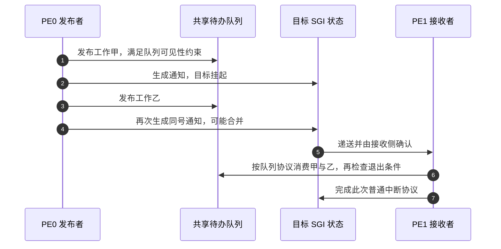

# 第7章\_目标选择\_核间通知与电源交接

## 7.1\_把请求交给另一个处理器\_改变了什么

前面已经准备好一个接收者，并能走完 **通用中断控制器（Generic Interrupt Controller，GIC）** 的确认与完成协议。现在增加第二个 **处理单元（Processing Element，PE）**：请求应当交给谁？原目标准备断电时，已经到来的请求又归谁处理？

这些问题放大 [S0 的目标准备、S2 的选择和 S5 的交接完成](P04_一次中断的状态转换与完成协议.md#4.4_用同一组阶段闭合正常周期)。不能只说“改亲和性”或“换一个核”，必须说明修改的是未来路由、已有挂起状态，还是正在执行的软件工作。

## 7.2\_硬件目标坐标不是Linux逻辑编号

GICv3 用 **亲和性（Affinity）** 标识处理器在硬件层次中的位置。它由 Aff3、Aff2、Aff1、Aff0 四个字段组成；这些是规范中的字段名，不是四种不同的中断。具体层次怎样对应核、线程或核簇，由处理器与芯片集成定义。

处理器的 `MPIDR_EL1` 是 **Multiprocessor Affinity Register（多处理器亲和性寄存器）**，包含硬件亲和性字段。Linux 显示的 CPU0、CPU1 是软件组织的逻辑编号；CPU 是 **Central Processing Unit（中央处理器）** 的缩写。不能把逻辑编号直接塞进亲和性字段，也不能默认 Aff0 一定等于板上看到的 CPU 编号。

**共享外设中断（Shared Peripheral Interrupt，SPI）** 的目标由 **分发器（Distributor）** 的 `GICD_IROUTER<n>` **中断路由寄存器（Interrupt Routing Registers）** 控制。配置专门的目标时，它指向一个完整亲和性坐标；编号 n 关联对应的来源，而不是“第 n 个 CPU”。

该寄存器的 **中断路由模式（Interrupt Routing Mode，IRM）** 还可表达由硬件从合适目标中选择一个，即 1-of-N。它表示“一次交给其中一个”，不是广播，也不保证轮转或平均负载。软件还必须核对当前实现支持与参与接收条件。

**私有外设中断（Private Peripheral Interrupt，PPI）** 本来就属于特定 PE，不能靠 SPI 路由寄存器把它改成另一个 PE 的私有定时事件。

> 官方对照：[规范 IHI0069 H.b](https://developer.arm.com/documentation/ihi0069/hb)，2.3 Affinity routing（2-39）、4.5 Shared Peripheral Interrupts，以及 12.9.22 GICD_IROUTER<n>, Interrupt Routing Registers。核对定向路由与 1-of-N 的条件；MPIDR 与亲和性关系也可在[概览 198123，3.2-01](https://developer.arm.com/documentation/198123/0302) 第 5、7 章检索 Affinity。

## 7.3\_核间中断传的是提醒\_工作内容存在哪里

**软件产生中断（Software Generated Interrupt，SGI）** 是软件通过 GIC 生成的请求，常用于 **处理器间中断（Inter-Processor Interrupt，IPI）**。前者是控制器来源类型，后者描述软件的核间通知用途；两者不能无条件看成同一层 API。

固定一个场景：PE0 为 PE1 准备了一项工作。工作内容保存在共享内存中的待办队列，包含要处理的对象；SGI 只提醒 PE1 去查看该队列，不把整个工作对象放入中断信号。

队列是数据通信，SGI 是通知通信。两条路径要配套：如果先发送 SGI，后发布队列内容，PE1 可能先进入处理入口却看不到工作。只写队列而没有对应通知或接收侧轮询协议，则工作可能一直留在那里。

发布所需的锁、内存顺序和缓存可见性由共享队列协议保证。原始“写一个 SGI 系统寄存器”不能自动替所有先前普通内存写入建立所需的软件同步契约；具体实现应使用目标系统已经封装好的核间调用接口。

> 官方对照：[概览 198123，3.2-01](https://developer.arm.com/documentation/198123/0302)，第 7 章 Sending and receiving Software Generated Interrupts（PDF 第 38～40 页），以及[规范 IHI0069 H.b](https://developer.arm.com/documentation/ihi0069/hb) 4.4 Software Generated Interrupts。共享队列是本专题为解释“数据与通知”添加的教学对象，GIC 规范不替某个软件队列提供锁或发布协议。

## 7.4\_两个发送者会不会得到两次计数

在 GICv3 亲和性路由模型下，SGI 挂起状态按目标 PE 区分，不为每个发送者分别保存同号 SGI 的独立计数。若两个发送者在接收者确认以前发出同一个 SGI，同一挂起状态可以把通知合并。

这不是必然丢失工作。只要两个工作都已经安全发布到队列，接收者按队列协议检查并消费全部待办，一次通知可以对应多个工作。相反，若软件用“收到一次 SGI 就假定只有一个工作”的协议，合并就会暴露错误。

步骤 4 不增加“工作队列长度”，步骤 6 才决定工作是否被完整处理。接收者退出检查与新的发布之间仍要避免丢失唤醒；采用现有队列和通知接口时，应核对它们如何配合，而不是凭这张图自行省略锁或屏障。

普通 **非安全第 1 组（Non-secure Group 1，中断安全归属名称）** 的生成入口为 `ICC_SGI1R_EL1`，即 **Software Generated Interrupt Group 1 Register（Group 1 软件产生中断寄存器）**。其中的来源编号、亲和性字段与目标列表共同选择通知。目标列表是相应亲和性层次下的位集合，不是一个任意长度的 Linux CPU 掩码。该生成寄存器的 IRM 广播选择与 SPI 的 1-of-N 含义不同，不能看到字段同名就混用。

> 官方对照：[规范 IHI0069 H.b](https://developer.arm.com/documentation/ihi0069/hb)，4.4 Software Generated Interrupts、12.2.22 ICC_SGI1R_EL1。查 v3 亲和性路由下的状态归属、目标列表和 IRM 语义；不要把 GICv2 的按发送者状态或 SPI 的 1-of-N 选择带进这条路径。

## 7.5\_目标准备下线时\_要交接的不只是路由

目标变化至少涉及三件事：未来请求往哪里走、旧目标上已经挂起的请求如何处理、已经确认的处理过程怎样收尾。改变一个路由寄存器，不会自动迁移设备驱动的栈或正在执行的代码。

从软件角度，需要先阻止新的工作被分配给即将下线的接收者，再依照来源类型和控制器规则处理已有状态，最后完成接收侧电源交接。普通 SPI、私有 PPI 与后文消息中断的迁移规则不同，不能复用一个“改目标即可”的算法。

**再分发器（Redistributor）** 的 `GICR_WAKER`，即 **再分发器唤醒寄存器（Redistributor Wake Register）**，用于电源握手；**ProcessorSleep（处理器休眠）** 表达软件交接请求，**ChildrenAsleep（下属接口已休眠）** 报告硬件交接状态。这里延续上一章的过程：有权软件在适当关闭接收条件后设置 ProcessorSleep，并等待 ChildrenAsleep 表示相关接口完成休眠交接，随后才由平台电源协议关闭相应资源。接收侧仍在使用，不能仅凭软件已发出请求就切断时钟或电源。

GIC-600 对一个已按协议休眠的专门目标收到请求时，可以通过唤醒请求与平台电源控制器交互。这个信号必须实际连接且相关电源路径可用；它不是对任意开发板“必然能唤醒”的承诺。

还要区分普通等待与真正电源交接：**WFI（Wait For Interrupt，等待中断）** 是处理器指令名称，不等于设置 ProcessorSleep。哪些低功耗状态需要电源控制器唤醒、哪些仍由正常接口接收，必须联合核对处理器与 GIC-600 手册。

现在已能把多核通知拆成“工作状态、通知状态、接收能力”三件事。下一章面对大量消息设备时继续问：若每个事件都需要一个可编程来源，状态应该继续全部挤在寄存器中吗？

官方对照：[GIC-600 r1p6 技术参考手册（Technical Reference Manual，TRM）](https://developer.arm.com/documentation/100336/0106)，3.6.2 Processor core power management（3-57～3-58），核对关核前置条件、握手与唤醒请求。真实 Linux 亲和性使用另见 [Linux 中断管理第 10 章](../../../../knowledge/linux/synchronization_and_asynchrony/asynchrony/interrupts/P10_SMP_与中断亲和性_IPI_机制.md#10.1_章节内容说明)，本章不替它声明版本化调用链。

上一篇：[上一章](P06_权限_安全分组与初始化闭环.md#6.1_为什么照着寄存器名写值还不够)

[专题大纲](大纲.md#1.2_因果阅读地图)

下一篇：[消息与内存状态](P08_从消息请求到内存中的中断状态.md#8.1_来源越来越多_为什么让设备发送一条消息)
