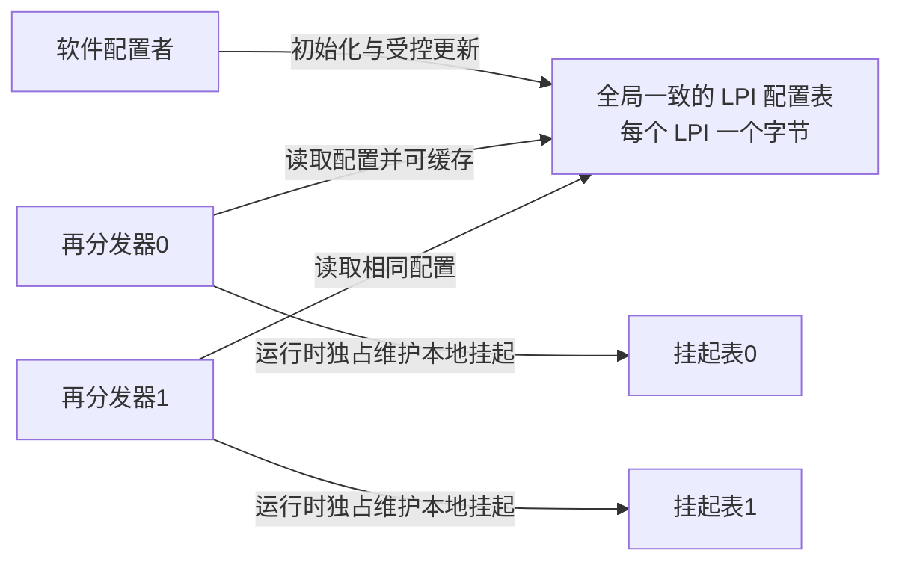

# 第8章\_从消息请求到内存中的中断状态

## 8.1\_来源越来越多\_为什么让设备发送一条消息

前面用 **通用中断控制器（Generic Interrupt Controller，GIC）** 处理普通来源，并把多核通知的数据与信号分开。现在换成一个有许多工作队列的设备：每个队列都可能产生完成事件。若每个事件来源都要求一根专用信号线，连接与收敛的规模就随来源数量增长。

**消息中断（Message-Signaled Interrupt，MSI）** 让设备用一次约定的写事务表达请求。写事务到达控制器的接收接口，控制器再按配置识别和递送；这不是设备直接跳进处理器代码，也不是把完整工作数据都写进一个中断寄存器。

GICv3 引入 **局部性专属外设中断（Locality-specific Peripheral Interrupt，LPI）** 来支持大量消息来源。译名用于辨认术语，关键是职责：它有自己的编号空间、内存配置和挂起状态模型。LPI 总是消息型，但消息型不必然就是 LPI，因为 **共享外设中断（Shared Peripheral Interrupt，SPI）** 也可以由实现提供的消息接口触发。

本章只建立 LPI 的配置与状态。消息中的设备身份怎样翻译成 LPI，下一章再解释，不提前把所有翻译表塞进来。

> 官方对照：[消息指南 102923，1.0-01](https://developer.arm.com/documentation/102923/0100)，第 1 章 Introduction 与第 2 章 LPIs（PDF 第 6～7 页）；[规范 IHI0069 H.b](https://developer.arm.com/documentation/ihi0069/hb)，4.2 Locality-specific Peripheral Interrupts。先确认消息通知方式与 LPI 来源类型不是同一分类轴。

## 8.2\_为什么不再沿用四状态模型

普通来源在确认以后保留 **活动（Active）** 状态，直到 **停用（Deactivation）**；LPI 只有 **Inactive（非挂起）** 与 **Pending（挂起）** 两种状态。确认一个 LPI 就使其从 Pending 转到 Inactive，不会为该 LPI 建立普通来源那样的 Active 状态。

这不表示软件已经处理完设备，也不表示接收侧运行优先级自动恢复。仍然要区分：LPI 来源自身的状态、处理器接口的优先级状态、软件正在处理的数据。**确认清挂起，结束寄存器负责优先级下降；LPI 不需要普通来源的 DIR 停用动作。**

若软件处理期间又来同号消息，它可以再次挂起；是否立即递送还受当前优先级与接收条件限制。同样，挂起位不是无限计数器，工作量仍应保存在设备完成队列等位置。

这里的 DIR 是停用寄存器的简称，对应 **`ICC_DIR_EL1`（Interrupt Controller Deactivate Interrupt Register，中断控制器停用寄存器）**，不是“软件处理结束”的通用命令。**再分发器（Redistributor）** 是与目标处理单元关联的接收侧配置和状态接口。

相对 [S0～S6 普通周期](P04_一次中断的状态转换与完成协议.md#4.4_用同一组阶段闭合正常周期)，LPI 的关键差量是：

| 既有阶段 | LPI 改变了哪一处 |
| --- | --- |
| S0 | 配置和挂起存储需要准备内存表及访问属性 |
| S1～S2 | 设备消息经接收与翻译路径，使目标再分发器中的 LPI 挂起 |
| S3 | 确认清除该挂起实例，没有普通来源的 Active 状态 |
| S4 | 仍然由软件处理设备数据，不由 GIC 代劳 |
| S5 | 仍需结束优先级占用，但不对 LPI 做普通中断停用 |
| S6 | 返回或继续处理满足条件的请求 |

> 官方对照：[规范 IHI0069 H.b](https://developer.arm.com/documentation/ihi0069/hb)，4.2 Locality-specific Peripheral Interrupts 与 5.1 LPIs（5-86 起）；[消息指南 102923，1.0-01](https://developer.arm.com/documentation/102923/0100) 第 2 章 LPIs。重点查“没有 Active 状态”，同时保留处理器接口优先级下降义务。

## 8.3\_两张表分别归谁维护

大量来源需要保存使能、优先级与挂起状态。GICv3 把 LPI 的这些信息放到内存支持的数据结构中，同时允许控制器在内部缓存相关状态。内存不等于“软件和硬件可以随便同时修改”。

**LPI 配置表（LPI Configuration table）** 为每个 LPI 保存属性，由软件初始化和更新，控制器读取。物理 LPI 配置具有全局一致性要求；常见做法是让多个再分发器指向同一份配置表，不能把同一个编号在不同接收者上偷偷配置成不同语义。

**LPI 挂起表（LPI Pending table）** 为每个再分发器保存自己的挂起状态，运行时由该再分发器维护。这些表不能当作多个接收者共用的一张全局挂起表。

`GICR_PROPBASER` 是 **Redistributor Properties Base Address Register（再分发器属性基地址寄存器）**，本节属性就是 LPI 配置；`GICR_PENDBASER` 是 **Redistributor LPI Pending Table Base Address Register（再分发器 LPI 挂起表基地址寄存器）**。它们是寄存器名称，告诉控制器到哪个物理内存位置访问表，以及采用怎样的属性。



软件在初始化时分配并清零挂起表，然后将运行时维护权交给硬件。LPI 启用期间，软件写挂起表会违反架构契约；而且内存中的位不一定实时反映控制器内部缓存，不能把一次内存查看当作完整实时状态。

> 官方对照：[规范 IHI0069 H.b](https://developer.arm.com/documentation/ihi0069/hb)，5.1.1 LPI Configuration tables、5.1.2 LPI Pending tables；寄存器在 12.11.33 GICR_PROPBASER 与 12.11.32 GICR_PENDBASER。查每类表是谁写、谁可以缓存、何时允许软件访问，不把 CPU 能读写某块内存等同于协议允许。

## 8.4\_用一个编号实际计算表项位置

**中断标识符（Interrupt Identifier，INTID）** 是控制器编号。LPI 从 8192 开始。对于编号 N，配置表条目的字节偏移为 N−8192；挂起表中则按 N/8 的整数商找字节，按 N 对 8 的余数找位。两张表的下标起点不同。

```text
教学编号 N = 9000
配置表：字节偏移 808（从 0 计），因为 9000 - 8192 = 808
挂起表：字节偏移 1125（从 0 计）的 bit 0，因为 9000 / 8 = 1125
```

配置条目中的 bit 0 是使能，bit 1 是保留为 1 的位置，bits 7:2 表示优先级高位；优先级低两位按 0 处理，具体实现还可能减少有效位。**RES1（Reserved, must be one，保留且必须为 1）** 是规范对保留位取值的标记，不是软件自定义状态。两安全状态下还要遵循优先级访问视图规则，不能把表内编码不经区分地与安全侧优先级比较。

物理 LPI 在本专题的两安全状态配置中属于 **非安全第 1 组（Non-secure Group 1）**，没有在每个条目里任选安全组的字段。

假设配置支持 B 位编号，编号空间上界为 2 的 B 次方：配置表逻辑数据量为 2 的 B 次方减 8192 字节；每个挂起表逻辑数据量为 2 的 B 次方除以 8 字节。若 B 为 16，分别为 56 KiB 与 8 KiB，KiB 表示 1024 字节。实际分配还要满足寄存器规定的基地址对齐、实现限制与内存属性，不能把逻辑大小直接当成分配器参数。

挂起表前 1 KiB 对应的区域不能被解释为普通中断的挂起位；规范允许它保存实现定义的信息，初次分配时也必须清零。不要因为 LPI 从 8192 开始，就擅自删掉这 1 KiB。

> 官方对照：[规范 IHI0069 H.b](https://developer.arm.com/documentation/ihi0069/hb)，5.1.1 LPI Configuration tables（5-88～5-89）、5.1.2 LPI Pending tables（5-90～5-91）。以规范核对起始下标、配置字节位域和挂起表前 1 KiB；本节 9000 与 16 位空间是按这些规则推导的教学算例。

## 8.5\_软件改了属性\_硬件为什么还在使用旧值

固定一个失败过程：软件把某 LPI 的使能位置 1，写入停留在处理器缓存中；控制器读取内存时可能仍看到旧值。即使更新已经对控制器可见，再分发器还可能持有此前缓存的配置条目。两种旧值来源不同，需要分别处理。

因此受控更新至少包括三件事：修改配置条目；按平台内存访问规则让更新对控制器可见；使控制器的旧配置缓存失效，并等待规定的完成条件。后文的中断翻译服务可以通过命令发起这种失效；这与处理器自身的缓存维护不是同一个动作。

内存屏障约束访问关系，不会凭空让一个不参与缓存一致性的设备取得处理器私有的脏数据。RK3588 对 LPI 表访问的共享属性有具体限制，必须在[平台记录](../../rockchip/rk3588/P01_RK3588的GIC-600集成与手册核对.md#1.3_内存地址与访问属性怎样影响实现)中核对，不能套用其他系统的可缓存共享内存配置。

> 官方对照：[消息指南 102923，1.0-01](https://developer.arm.com/documentation/102923/0100)，3.2 Reconfiguring LPIs（PDF 第 10 页）；[规范 IHI0069 H.b](https://developer.arm.com/documentation/ihi0069/hb)，5.1.1 LPI Configuration tables。分别追踪软件内存更新、控制器配置缓存失效和完成同步，不能用其中一个动作替代另外两个。

## 8.6\_整体关闭与禁止一个来源不是同一保证

单个 LPI 的属性使能位与再分发器 `GICR_CTLR.EnableLPIs` 不同。`GICR_CTLR` 是 **再分发器控制寄存器（Redistributor Control Register）**，EnableLPIs（启用 LPI）是该接收侧物理 LPI 支持的整体启用字段。

当 EnableLPIs 为 0，试图让该再分发器上的 LPI 挂起不会像普通被禁止的 SPI 那样保留请求，而可能被丢弃。不能用“先全局关 LPI，事件都在里面等着”作为无丢失协议。

同样，不能在 EnableLPIs 为 1 时随意换配置表或挂起表基地址。停止访问与释放内存需要按规范完成禁止和写入完成观察，并同时处理消息生产者、翻译映射、在途请求和软件处理。仅把某个寄存器位清零，不足以证明全部内存都可以归还。

还要注意：关闭 LPI 支持不保证控制器把全部缓存挂起状态写回内存；如果任务要求保存并恢复已有请求，应采用对应电源与状态保存协议，而不是把“禁止”当作“刷新快照”。

现在能回答 LPI 的状态在哪里、由谁维护、为什么写内存不等于立即生效。剩下的问题是：来自两个设备的相同事件号，怎样找到正确的全局 LPI 与目标再分发器？

官方对照：[规范 IHI0069 H.b](https://developer.arm.com/documentation/ihi0069/hb)，5.1 LPIs、5.1.2 LPI Pending tables 和 12.11.2 GICR_CTLR 中的 EnableLPIs。核对整体关闭时消息处理与缓存写回保证的边界；大小计算与状态推演是静态说明，不是本机运行寄存器值。

上一篇：[上一章](P07_目标选择_核间通知与电源交接.md#7.1_把请求交给另一个处理器_改变了什么)

[专题大纲](大纲.md#1.2_因果阅读地图)

下一篇：[事件翻译](P09_设备事件翻译与命令完成.md#9.1_两个设备都发事件0_怎样区分)
