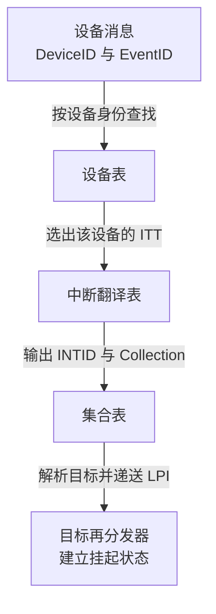
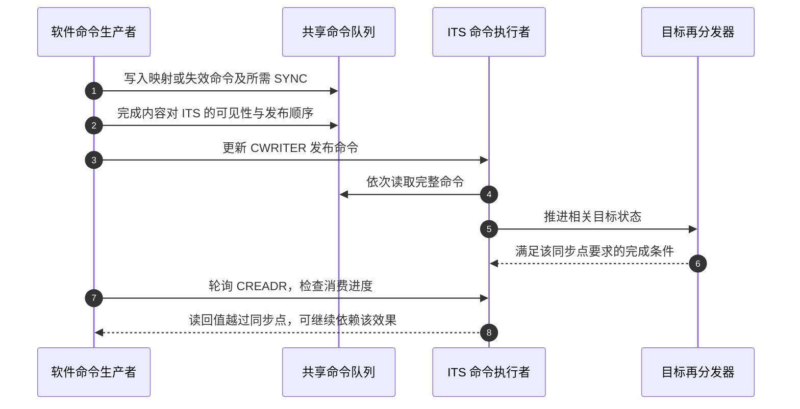

# 第9章\_设备事件翻译与命令完成

## 9.1\_两个设备都发事件0\_怎样区分

上一章建立了 **通用中断控制器（Generic Interrupt Controller，GIC）** 中 **局部性专属外设中断（Locality-specific Peripheral Interrupt，LPI）** 的内存配置和挂起状态。现在有两个设备都发送“事件 0”：如果只看这个数，就无法知道该使用哪条中断和哪个接收者。

于是需要 **中断翻译服务（Interrupt Translation Service，ITS）**。它接收设备消息，把“哪个设备的哪个事件”对应到全局中断编号和目标再分发器。这里的服务是控制器硬件提供的功能，不是 Linux 中一个叫 ITS 的后台进程。

本章先建立一次消息翻译，再说明软件怎样配置和更新这些映射。只有把命令与完成过程讲清，才能理解“表已经写好，消息却仍走旧目标”这类问题。

## 9.2\_设备身份\_事件身份与中断身份分别保存什么

**设备标识（Device Identifier，DeviceID）** 用于区分消息生产者；**事件标识（Event Identifier，EventID）** 用于区分同一设备的不同事件。这两个名字是协议中的标识字段，不是操作系统分配的中断编号。

设备向 `GITS_TRANSLATER` 写入事件值。其官方名称是 ITS Translation Register（ITS 翻译寄存器），承担消息翻译接收接口；EventID 来自约定的写入内容，而 DeviceID 怎样随事务被识别，由芯片互连与设备集成定义。软件不能默认“向某个地址随便写一个数”就能冒充任意设备。

**中断标识符（Interrupt Identifier，INTID）** 则标识 GIC 中的目标中断。EventID 可以和 INTID 相同，也可以不同；这是映射选择，不是必须靠相等建立联系。

目标管理再增加一个角色：**Collection（集合）** 是把若干物理 LPI 关联到同一个目标再分发器的逻辑分组。集合号不是处理器编号，也不是 LPI 编号；它让软件可以共同管理一组中断的递送位置。

> 官方对照：[规范 IHI0069 H.b](https://developer.arm.com/documentation/ihi0069/hb)，5.2 The Interrupt Translation Service、5.2.2 Interrupt collections，以及 12.19.12 GITS_TRANSLATER, ITS Translation Register；[消息指南 102923，1.0-01](https://developer.arm.com/documentation/102923/0100) 第 4 章 ITS（PDF 第 11～12 页）。核对设备身份与写入事件值的不同来源。

## 9.3\_三个查找层次怎样闭合一次翻译

**设备表（Device table）** 先按设备身份找到该设备的 **中断翻译表（Interrupt Translation Table，ITT）**；它再按事件取出全局编号与集合；**集合表（Collection table）** 解析目标。ITS 使用以下映射结构，它们是内存支持或实现内部保存的硬件表结构，不是三份普通驱动数组：

| 结构 | 索引与输出 | 解决的问题 |
| --- | --- | --- |
| Device table，设备表 | DeviceID → 该设备的翻译表 | 相同事件号如何按设备区分 |
| Interrupt Translation Table，ITT，中断翻译表 | EventID → INTID 与 Collection | 设备自己的事件如何进入全局编号空间 |
| Collection table，集合表 | Collection → 目标再分发器 | 一组事件应交给哪个接收者 |

软件为这些结构分配和准备内存，再通过命令让 ITS 建立映射；不能猜测硬件内部表项格式后直接改写。某些集合可以由实现内部保存，概念上的查找职责仍存在。



用一组教学值手算：设备标识 5 的事件 3，被配置为 INTID 9000、集合 2；集合 2 指向接收者甲。消息到来时，先以 5 找 ITT，再在其中以 3 找到 9000 与集合 2，最后找到甲。另一个设备的事件 3 可以映射为不同结果，不会因为事件号相同而天然冲突。

这放大了 [S1～S2 的请求形成与目标选择](P04_一次中断的状态转换与完成协议.md#4.4_用同一组阶段闭合正常周期)；到达再分发器后，继续使用上一章的 LPI 状态，而不是再发明第三套确认协议。

> 官方对照：[规范 IHI0069 H.b](https://developer.arm.com/documentation/ihi0069/hb)，5.2.1 The ITS tables、5.2.3 The Device table、5.2.4 The Interrupt translation table、5.2.5 The Collection table；[消息指南 102923，1.0-01](https://developer.arm.com/documentation/102923/0100) 4.3 The sizes and layout of Collection and Device tables（第 14～15 页）。图中箭头是逻辑查找关系，不承诺每次请求都发生三次外部内存读取。

## 9.4\_为什么用命令队列管理映射

硬件可能缓存表项，多个接收者也可能同时持有有关状态。如果软件只修改内存中的一处字节，ITS 无法知道它应该重建哪部分映射，更无法保证所有受影响接收者都已经看到变化。命令接口把这些更新变成控制器能够执行和确认的协议操作。

**命令队列（Command queue）** 是软件与 ITS 共享的一段环形内存：软件生产命令，ITS 按队列顺序读取。每条命令占 32 字节；队列基地址需要满足 64 KiB 对齐，大小按 4 KiB 的倍数配置，KiB 表示 1024 字节。

三个寄存器分别承载不同的通信状态：**`GITS_CBASER`（ITS Command Queue Descriptor，ITS 命令队列描述符）** 提供基址、大小及访问属性；**`GITS_CWRITER`（ITS Write Register，ITS 写入寄存器）** 由软件发布生产进度；**`GITS_CREADR`（ITS Read Register，ITS 读取寄存器）** 反映 ITS 消费进度。后两者的 Offset 字段是队列偏移，不是指向任意内存的裸指针。

生产一个命令需要先检查空位，再写完整内容，使内容对 ITS 可见，最后更新写入进度。如果先更新 CWRITER，ITS 可能读取尚未准备好的内容。若多个软件执行者共同生产，还需要队列锁或等效串行化；硬件提供两个进度寄存器，不会自动保护软件生产者之间的竞争。

队列要保留区分满与空的空间。当新的写入位置会追上尚未消费的位置时，不能覆盖旧命令；等待必须处理超时和硬件停滞，而不是无限覆盖或假装成功。

> 官方对照：[消息指南 102923，1.0-01](https://developer.arm.com/documentation/102923/0100)，4.1 The command queue、4.4 Adding a new command to the command queue；[规范 IHI0069 H.b](https://developer.arm.com/documentation/ihi0069/hb)，5.2.8 The ITS command interface 与 12.19.2/12.19.3/12.19.5 的队列寄存器条目。核对内存发布与读写偏移的先后、环形空间及停滞条件。

## 9.5\_命令读走了\_不等于全部副作用完成

ITS 按顺序读取命令，但命令对再分发器的副作用可能异步完成。以下简写 CREADR 与 CWRITER 分别指刚才的 ITS Read Register（ITS 读取寄存器）和 ITS Write Register（ITS 写入寄存器）。因此，观察到 CREADR 追上 CWRITER，并不能对任意先前操作宣布“所有目标都已经同步”。

**SYNC** 是协议定义的同步命令名称（Synchronize，同步；保留规范命令拼写，不另造全称），用于等待相关先前命令对指定目标再分发器的效果完成。它不是对所有硬件和所有设备的全局屏障，也不表示设备工作已经完成。需要相应完成保证时，软件提交 SYNC，并等待消费进度越过该同步点。



步骤 2 解决内存内容发布，步骤 6～8 解决协议副作用完成与软件观察。步骤 7～8 是软件主动读取进度，不是 ITS 自动回调通知软件。两类完成不是同一个屏障。多目标更新要依据命令契约选择对应的同步目标，不能把“执行过一次 SYNC”当作万能证明。

> 官方对照：[规范 IHI0069 H.b](https://developer.arm.com/documentation/ihi0069/hb)，5.3.15 SYNC（5-119～5-120）及 5.2.8 The ITS command interface。SYNC 约束指定再分发器相关的先前操作，原文也说明后续翻译必须受这些效果影响；不能从 CREADR 一次追平推出没有相应同步命令保证的结论。

## 9.6\_初始化与创建一个映射的完整职责

先发现 ITS 支持的表类型与条目大小，再准备内存。`GITS_BASER<n>` 是 **ITS Table Descriptors（ITS 表描述符）**，其类型、条目大小和页配置字段用于发现及配置硬件表；不能假定每个实现的第 0、1 个寄存器都固定代表同一种表，也不能自己定义任意 C 结构作为表项。

在 ITS 尚未启用时，软件准备设备表、集合表和命令队列，按规则初始化内存并建立控制器可见性，然后通过 **`GITS_CTLR`（ITS Control Register，ITS 控制寄存器）** 启用。表和队列基址不是运行中可以随意替换的配置。

下面是 **命令语义伪代码**，不是二进制命令编码，也不是可调用的函数清单。MAPD、MAPC、MAPTI 等是规范中的命令名称：分别表示 **设备映射（Map device）**、**集合映射（Map collection）** 和 **翻译后中断映射（Map translated interrupt）**。这些英文短语解释动作，精确命令名以规范标题为准。INV 表示失效（Invalidate）命令；Valid（有效）与 Size（大小）是参数名，取值及目标地址编码必须另外按寄存器能力实现。

```text
设备消息输出保持停止，目标 LPI 表和接收侧已经准备好
为设备分配符合其事件范围与实现格式的 ITT
MAPD：把 DeviceID 5 关联到这张 ITT
MAPC：把 Collection 2 关联到接收者甲的再分发器
MAPTI：把设备5的事件3关联到 INTID 9000 与 Collection 2
按需要提交针对甲的 SYNC，并确认完成
设置 LPI 9000 的属性，使内存更新对控制器可见
INV：使相应配置缓存失效；SYNC 后确认所需更新完成
最后允许设备开始向正确的消息接收接口发送事件
```

`INV` 是针对有关映射所对应中断的失效命令，`INVALL`（Invalidate all，整体失效）用于一个集合相关的配置失效；两者都不替软件处理器执行普通缓存清理。目标再分发器在命令中使用地址还是处理器编号，要核对 **`GITS_TYPER`（ITS Type Register，ITS 类型寄存器）** 的 PTA 字段（Physical Target Addresses，物理目标地址；此处为目标编码方式选择），不能把 Linux CPU 编号直接塞入。

失败路径也有顺序：设备尚未放开时，可按已建立资源逐项撤销；设备已经能够发消息后，应先停止生产并处理在途事务，再撤销映射与接收侧状态。任何硬件仍可能访问的 ITT、队列或挂起表，都不能先释放给其他对象。

> 官方对照：[消息指南 102923，1.0-01](https://developer.arm.com/documentation/102923/0100)，4.2 Initial configuration of an ITS、4.5 Mapping an interrupt to a Redistributor；[规范 IHI0069 H.b](https://developer.arm.com/documentation/ihi0069/hb)，5.3.9 MAPC、5.3.10 MAPD、5.3.12 MAPTI、5.3.6 INV、5.3.7 INVALL，以及 12.19.13 GITS_TYPER 的 PTA。指南给顺序，规范给命令字段和前置条件，两者都不是可以跳过平台内存约束的可运行驱动。

## 9.7\_迁移和删除为什么不能只改一个目标

更改集合映射主要影响后续消息选择；旧目标已经挂起的请求属于另一项状态。把“未来路由”与“既有挂起”混为一体，可能让旧目标下线以后仍留下待办。

ITS 提供 `MOVI`（Move interrupt，移动中断）这类按设备事件迁移的命令，以及 `MOVALL`（Move all，整体移动）这类涉及再分发器挂起状态迁移的命令。它们是不同粒度的协议操作，适用前提和同步目标必须逐项核对。尤其不能为了移动一个设备，就无条件搬走旧再分发器上其他设备的全部挂起状态。

撤销一个事件映射时，通常需要先禁止相应 LPI 并完成配置可见与失效，再发出 `DISCARD`（丢弃映射及相应挂起状态的命令），通过针对相关目标的同步确认效果。删除整个设备映射还需处理它的各个事件，并用无效化的 MAPD 完成设备级撤销。

这些动作不会自动证明设备不会再发消息，也不会等待所有正在执行的软件处理退出。完整拆除还需生产者停止、在途消息收敛、软件处理同步和内存生命周期交接。一次寄存器读数不是所有层次的完成证明。

本章闭合了消息身份、硬件表、命令发布和完成四条关系。下一章把物理中断主线交回实际软件职责，并按故障所在层选择证据。

官方对照：[消息指南 102923，1.0-01](https://developer.arm.com/documentation/102923/0100)，4.6 Migrating interrupts between Redistributors、4.7 Removing interrupt mappings、4.8 Remapping or removing the mapping of devices；精确命令再查 [IHI0069 H.b](https://developer.arm.com/documentation/ihi0069/hb) 的 5.3.13 MOVALL、5.3.14 MOVI、5.3.4 DISCARD 与 5.3.10 MAPD。本文是机制讲解，不是完整 ITS 驱动；命令伪代码不包含全部二进制编码。

上一篇：[上一章](P08_从消息请求到内存中的中断状态.md#8.1_来源越来越多_为什么让设备发送一条消息)

[专题大纲](大纲.md#1.2_因果阅读地图)

下一篇：[软件与排障](P10_软件交接_部署与分层排障.md#10.1_硬件模型闭合后_软件该接管哪一段)
