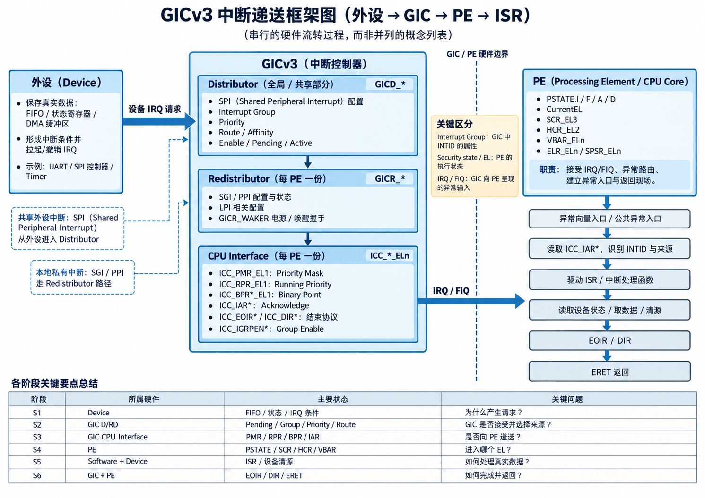
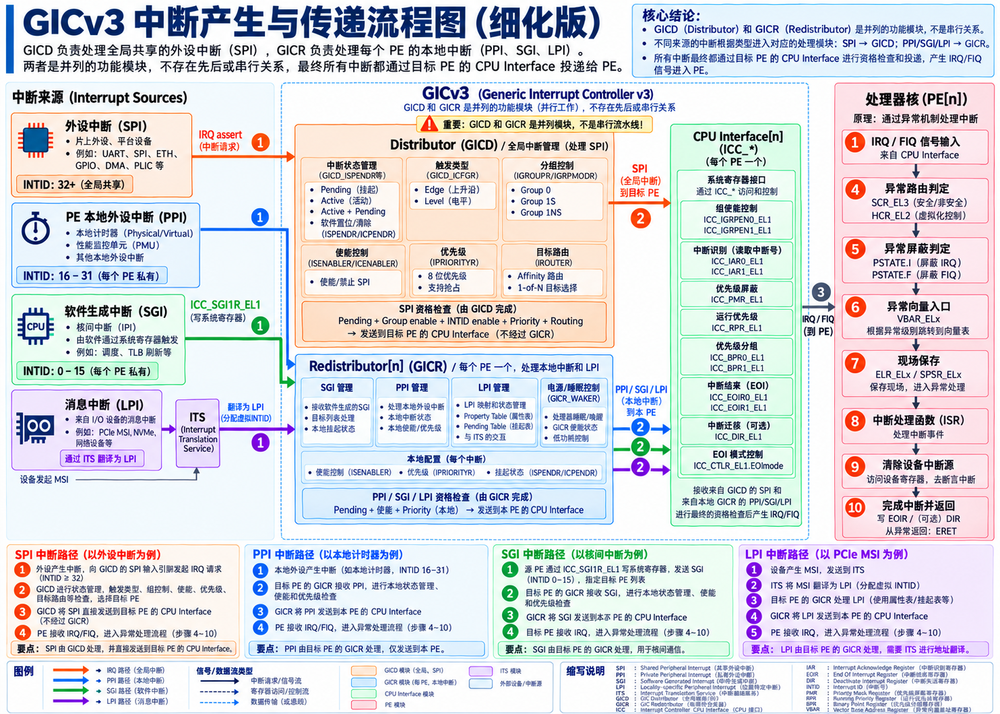
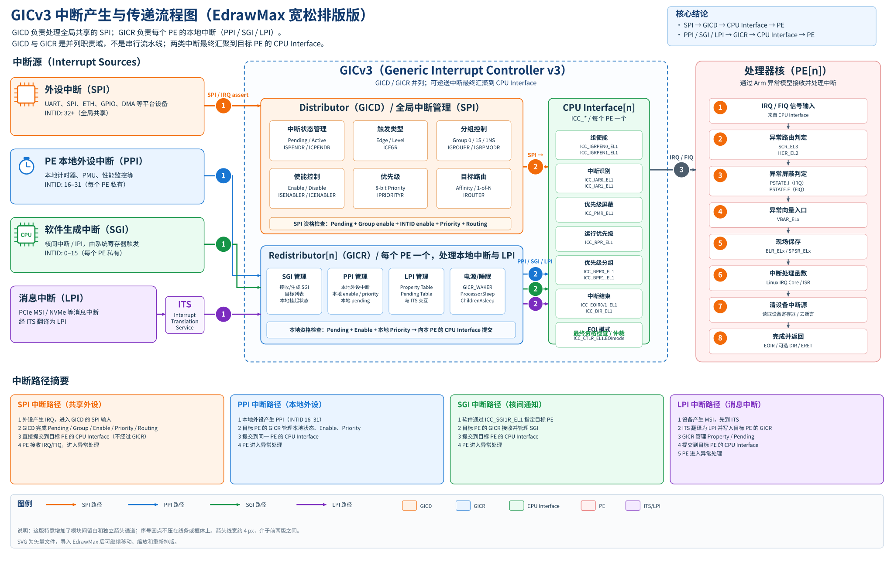

# 第11章\_UART中断的端到端流程复盘

本章保留 UART 场景的配套图解与逐阶段阅读记录，用于复盘前十章的物理中断机制。这里的 S0～S13 是本例的细化步骤，不等同于第四章的 S0～S6；技术内容仍待逐项核对，图解和场景不构成板上实验结果。

阅读入口：[专题大纲](大纲.md#1.2_因果阅读地图)。复盘前可回看[状态与完成协议](P04_一次中断的状态转换与完成协议.md#4.4_用同一组阶段闭合正常周期)、[安全组与异常路由](P06_权限_安全分组与初始化闭环.md#6.3.3_安全组怎样影响IRQ与FIQ_又怎样到达EL)；Linux 实现与实测边界见[软件交接与部署](P10_软件交接_部署与分层排障.md#10.1_硬件模型闭合后_软件该接管哪一段)。



对，这次不要把那张图当“标准答案”。真正应该建立的是一条**GICv3 物理中断从产生到处理结束的完整因果链**。

最重要的是先把整个过程拆成两个控制系统：





这里有一个以后必须始终保持的认识：

> **GIC 的“路由”和 PE 的“异常路由”是两个完全不同的概念。**

`GICD_IROUTER` 回答的是：

> **这个中断送 CPU0、CPU1、CPU2 还是 CPU3？**

`SCR_EL3/HCR_EL2` 回答的是：

> **已经送到这个 CPU 以后，由 EL1、EL2 还是 EL3 接？**

把这两个层次分清，GICv3 一大半就通了。

## 11.1\_阶段导航

| 编号            | 图中含义                                | 跳转到正文                                                   |
| --------------- | --------------------------------------- | ------------------------------------------------------------ |
| [S0](#11.3_阶段_0_GIC_之前_设备自己为什么产生中断)   | 设备产生 IRQ 条件                       | [二、阶段 0：GIC 之前——设备自己为什么产生中断？](#11.3_阶段_0_GIC_之前_设备自己为什么产生中断)    |
| [S1](#11.4_阶段_1_设备_IRQ_到_GIC_首先形成_Pending)   | GIC 记录 Pending                        | [三、阶段 1：设备 IRQ 到 GIC，首先形成 Pending](#11.4_阶段_1_设备_IRQ_到_GIC_首先形成_Pending)     |
| [S2](#11.6_阶段_2_这个_INTID_属于什么_Group)   | Interrupt Group / Group Enable          | [五、阶段 2：这个 INTID 属于什么 Group？](#11.6_阶段_2_这个_INTID_属于什么_Group)           |
| [S3](#11.8_阶段_3_这个_INTID_自己有没有被_Enable)   | INTID Enable                            | [七、阶段 3：这个 INTID 自己有没有被 Enable？](#11.8_阶段_3_这个_INTID_自己有没有被_Enable)      |
| [S4](#11.9_阶段_4_到底送给哪个_PE)   | Routing / 目标 PE / 可接收性            | [八、阶段 4：到底送给哪个 PE？](#11.9_阶段_4_到底送给哪个_PE)                     |
| [S5](#11.11_阶段_5_优先级_有资格送_PE2_不代表现在就送)   | Priority / PMR                          | [十、阶段 5：优先级——有资格送 PE2，不代表现在就送](#11.11_阶段_5_优先级_有资格送_PE2_不代表现在就送)  |
| [S6](#11.14_阶段_6_如果_CPU_正在处理中断_还要看_RPR)   | RPR / BPR / Preemption                  | [十三、阶段 6：如果 CPU 正在处理中断，还要看 RPR](#11.14_阶段_6_如果_CPU_正在处理中断_还要看_RPR)   |
| [S7](#11.18_阶段_7_SCR_EL3_/_HCR_EL2_IRQ_最终送哪个_EL)   | SCR_EL3 / HCR_EL2 / Exception Routing   | [十七、阶段 7：SCR_EL3 / HCR_EL2——IRQ 最终送哪个 EL？](#11.18_阶段_7_SCR_EL3_/_HCR_EL2_IRQ_最终送哪个_EL) |
| [S8](#11.20_阶段_8_PSTATE.I_/_PSTATE.F_CPU_当前允许不允许进异常)   | PSTATE.I / PSTATE.F                     | [十九、阶段 8：PSTATE.I / PSTATE.F——CPU 当前允许不允许进异常？](#11.20_阶段_8_PSTATE.I_/_PSTATE.F_CPU_当前允许不允许进异常) |
| [S9](#11.21_阶段_9_VBAR_ELn_已经决定进_EL1_那代码从哪里开始执行)   | VBAR / 异常入口 / ELR / SPSR            | [二十、阶段 9：VBAR_ELn——已经决定进 EL1，那代码从哪里开始执行？](#11.21_阶段_9_VBAR_ELn_已经决定进_EL1_那代码从哪里开始执行) |
| [S10](#11.23_现在已经进异常了_但软件还不知道到底是谁打断了_CPU) | ICC_IAR* / INTID / Linux 分发到 ISR     | [二十二、现在已经进异常了，但软件还不知道到底是谁打断了 CPU](#11.23_现在已经进异常了_但软件还不知道到底是谁打断了_CPU) |
| [S11](#11.27_阶段_11_ISR_真正处理设备) | ISR / 清设备源                          | [二十六、阶段 11：ISR 真正处理设备](#11.27_阶段_11_ISR_真正处理设备)                |
| [S12](#11.29_阶段_12_EOIR_到底干什么) | EOIR / DIR / Priority Drop / Deactivate | [二十八、阶段 12：EOIR 到底干什么？](#11.29_阶段_12_EOIR_到底干什么)               |
| [S13](#11.33_阶段_13_ERET_和_EOI_又不是一回事) | ERET 返回                               | [三十二、阶段 13：ERET 和 EOI 又不是一回事](#11.33_阶段_13_ERET_和_EOI_又不是一回事)        |

------

## 11.2\_先选一个最典型的场景

我们先不把 SGI、PPI、LPI 全混进来。

假设：

```text
UART
 │
 │ IRQ wire
 ▼
GICv3
 │
 │ SPI INTID = 64
 ▼
PE2
 │
 ▼
Non-secure EL1 Linux
```

假设这个 UART 是普通共享外设中断：

```text
SPI = Shared Peripheral Interrupt
```

也就是 `INTID >= 32` 的普通 SPI。

Arm GICv3 中，SGI、PPI、SPI、LPI 是四类主要中断；SPI 可以路由到不同 PE，而 PPI 是特定 PE 私有的。([Arm Developer](https://developer.arm.com/-/media/Arm Developer Community/PDF/Learn the Architecture/GICv3_v4_overview.pdf?revision=65f91645-cd52-4795-952b-f01095ff5ef8))

下面就跟着 **UART 收到一个字节** 一步一步走。

------

## 11.3\_阶段\_0\_GIC\_之前\_设备自己为什么产生中断

这个阶段实际上**和 GIC 没关系**。

比如 UART 内部可能有：

```text
RX FIFO
RX_FIFO_NOT_EMPTY
RX_INT_ENABLE
RX_INT_MASK
RX_THRESHOLD
ERROR_STATUS
...
```

假设：

```text
RX FIFO 收到数据
        +
RX interrupt enable = 1
        +
RX interrupt mask = 0
        ↓
UART IRQ output = asserted
```

那么 UART 才把 IRQ 信号送出去。

所以：

```text
设备产生 IRQ
```

不等于：

```text
CPU 一定会收到 IRQ
```

甚至不等于：

```text
GIC 一定会把它送出去
```

此时仅仅意味着：

> **设备向 GIC 报告：“我的中断条件成立了。”**

所以第一层控制是：

| 控制对象                       | 谁负责 |
| ------------------------------ | ------ |
| 为什么产生中断                 | 外设   |
| RX/TX/Error 哪一个事件产生中断 | 外设   |
| FIFO threshold                 | 外设   |
| 外设中断 enable/mask           | 外设   |
| INTID 的优先级                 | GIC    |
| INTID 送哪个 CPU               | GIC    |
| 最后进哪个 EL                  | PE     |

GIC 根本不知道：

> “UART FIFO 里面来了 8 个字节。”

GIC只知道：

> “我的 INTID 64 输入现在被 assert 了。”

------

## 11.4\_阶段\_1\_设备\_IRQ\_到\_GIC\_首先形成\_Pending

SoC 设计阶段已经把这个 UART IRQ 线接到了 GIC 的某个 SPI 输入：

```text
UART IRQ
   │
   └──────────────→ GIC SPI INTID 64
```

这个映射主要是**SoC 硬件集成决定的**。

也就是说：

```text
UART → INTID 64
```

通常不是 Linux 启动以后通过 `GICD_*` 随便决定的。

------

### 11.4.1\_GICD\_ICFGR\_这个信号到底是电平还是边沿

这是这个阶段最重要的配置之一：

```text
GICD_ICFGRn
```

对于 SPI，它告诉 GIC：

```text
这个 INTID 是：

Level-sensitive

还是

Edge-triggered
```

PPI/SPI 都需要配置触发类型，而 SGI 天生按 edge 类型处理。([Arm Developer](https://developer.arm.com/-/media/Arm Developer Community/PDF/Learn the Architecture/GICv3_v4_overview.pdf?revision=65f91645-cd52-4795-952b-f01095ff5ef8&utm_source=chatgpt.com))

这个寄存器必须和外设真实行为对应。

例如 UART 经常是：

```text
FIFO 非空
    ↓
IRQ = 1
    ↓
一直保持
    ↓
软件把 FIFO 读空 / 清状态
    ↓
IRQ = 0
```

这就是典型：

```text
Level-sensitive
```

------

## 11.5\_Pending\_并不等于\_马上中断\_CPU

这是理解 GIC 非常关键的一点。

外设 assert 后：

```text
Inactive
   ↓
Pending
```

GIC 内部为 INTID 维护状态。

主要状态是：

```text
Inactive
Pending
Active
Active + Pending
```

Arm 对 SPI/PPI/SGI 就是按照这样的状态机管理。([Arm Developer](https://developer.arm.com/-/media/Arm Developer Community/PDF/Learn the Architecture/GICv3_v4_overview.pdf?revision=65f91645-cd52-4795-952b-f01095ff5ef8))

注意：

> **即使这个中断当前 Disabled，它仍然可以变成 Pending。**

`Enable` 控制的是：

> 能不能继续向 PE 递送。

而不是：

> 能不能产生 Pending。

所以如果：

```text
UART IRQ assert
GICD_ISENABLER[64] = 0
```

可能出现：

```text
INTID 64 = Pending
```

但不会送到 CPU。

以后你再 enable：

```text
GICD_ISENABLER[64] = 1
```

这个早已 pending 的中断就可能马上被递送。

这也是调 GIC 时很容易误解的地方。

------

## 11.6\_阶段\_2\_这个\_INTID\_属于什么\_Group

接下来是：

```text
GICD_IGROUPRn
GICD_IGRPMODRn
```

两者配合决定一个 SPI 属于：

```text
Group 0
Secure Group 1
Non-secure Group 1
```

这里最好别把 `Group` 简单理解为“中断分类标签”。

它实际上参与决定：

```text
Security 属性
       +
GIC 的 Group enable
       +
使用 IAR0 还是 IAR1
       +
使用 EOIR0 还是 EOIR1
       +
最终向 PE 呈现 IRQ 还是 FIQ
```

Arm 的安全模型明确把中断分为这三类。Group 0 始终按 FIQ 呈现；Secure Group 1 和 Non-secure Group 1 根据 PE 当前 Security state 可能呈现 IRQ 或 FIQ。([Arm Developer](https://developer.arm.com/-/media/Arm Developer Community/PDF/Learn the Architecture/TrustZone for Armv8-A.pdf?revision=c3134c8e-f1d0-42ff-869e-0e6a6bab824f&utm_source=chatgpt.com))

对于我们普通 Linux UART：

```text
UART INTID 64
      ↓
Non-secure Group 1
```

最典型。

于是如果 CPU 当前也是：

```text
Non-secure state
```

这个中断正常会作为：

```text
IRQ
```

呈现给 PE。

------

## 11.7\_这里已经出现第一组\_合作配置

光设置：

```text
INTID 64 = Non-secure Group 1
```

还不够。

还需要对应 Group 被打开。

大致是：

```text
GICD_CTLR.EnableGrp1NS
             &&
ICC_IGRPEN1_EL1
```

前者属于 GIC 的全局/Distributor 侧 Group 开关。

后者属于目标 PE CPU Interface 的 Group 开关。

所以可以理解成：

```text
INTID 64
属于 NS Group1
       │
       ├── GIC 全局允许 NS Group1？
       │       GICD_CTLR.EnableGrp1NS
       │
       └── PE2 CPU Interface 允许 Group1？
               ICC_IGRPEN1_EL1

两层都允许
       ↓
才具备递送资格
```

Arm 的官方说明也明确指出：Group enable 同时涉及 Distributor 和每个 CPU interface；Group disabled 时，中断可以保持 Pending，但不能向 PE signal。([Arm Developer](https://developer.arm.com/-/media/Arm Developer Community/PDF/Learn the Architecture/GICv3_v4_overview.pdf?revision=65f91645-cd52-4795-952b-f01095ff5ef8))

所以这里应该建立一个概念：

> **Group 是属性，Group Enable 是门。**

不是一回事。

------

## 11.8\_阶段\_3\_这个\_INTID\_自己有没有被\_Enable

对于 SPI：

```text
GICD_ISENABLERn
GICD_ICENABLERn
```

控制单个 INTID 是否允许递送。

因此现在至少已经有三种状态：

```text
Pending?
Group Enable?
INTID Enable?
```

可以粗略写成：

```text
Pending(INTID)
    &&
InterruptEnabled(INTID)
    &&
GroupEnabled(Group)
```

才继续向后。

比如：

```text
UART 已经 assert
INTID 64 Pending = 1

但是

GICD_ISENABLER bit64 = 0
```

结果就是：

```text
Pending 保留
CPU 不知道
```

这对于驱动开发非常重要：

> `disable_irq()` 类似动作，并不等于硬件事件不存在，也不一定意味着 pending 状态消失。

------

## 11.9\_阶段\_4\_到底送给哪个\_PE

这是：

```text
GICD_IROUTER<n>
```

负责的。

只对 SPI 特别重要。

GICv3 使用 affinity 来标识 PE，和：

```text
MPIDR_EL1
```

对应。

例如：

```text
PE0 affinity = 0.0.0.0
PE1 affinity = 0.0.0.1
PE2 affinity = 0.0.0.2
PE3 affinity = 0.0.0.3
```

假设：

```text
GICD_IROUTER64
    =
Affinity = 0.0.0.2
IRM = 0
```

意思就是：

```text
INTID 64
只能送 PE2
```

Arm 将 `GICD_IROUTERn` 的路由分成两种主要模式：`IRM=0` 指定具体 affinity；`IRM=1` 则允许 Distributor 在参与该中断组分发的 PE 中选择一个，也就是 1-of-N。([Arm Developer](https://developer.arm.com/-/media/Arm Developer Community/PDF/Learn the Architecture/GICv3_v4_overview.pdf?revision=65f91645-cd52-4795-952b-f01095ff5ef8))

------

### 11.9.1\_这里必须特别纠正一个容易形成的错误模型

不要把：

```text
Distributor
    ↓
Redistributor
    ↓
CPU Interface
```

机械理解成：

> 所有中断必须像数据包一样依次经过三个流水站。

更准确的理解是三个**职责域**：

```text
Distributor
    主要负责 SPI
    全局配置
    SPI 路由

Redistributor
    每 PE 一份
    SGI / PPI
    LPI
    PE power/wake 相关

CPU Interface
    每 PE 一份逻辑接口
    Priority mask
    Running priority
    Group enable
    Acknowledge
    EOI
```

所以：

```text
SPI
```

主要在 Distributor 配置。

而：

```text
SGI / PPI
```

主要通过目标 PE 的 Redistributor 配置。

Arm 官方的程序员模型也明确把 SPI 配置归到 `GICD_*`，而 SGI/PPI 配置归到对应 PE 的 `GICR_*`。([Arm Developer](https://developer.arm.com/-/media/Arm Developer Community/PDF/Learn the Architecture/GICv3_v4_overview.pdf?revision=65f91645-cd52-4795-952b-f01095ff5ef8))

因此以后如果你重新画架构图，我反而不建议画成绝对的：

```text
GICD → GICR → ICC
```

串行流水线。

------

## 11.10\_GICR\_WAKER\_目标\_CPU\_现在醒着吗

目标确定成 PE2 后，还有现实问题：

```text
PE2 当前有没有 online？
```

Redistributor 有：

```text
GICR_WAKER
```

其中：

```text
ProcessorSleep
ChildrenAsleep
```

和 PE 的电源/睡眠状态有关。

正常启动一个 PE 时，会把它的 Redistributor 从睡眠状态带出来。

如果 PE 处于 offline/sleep 状态，目标它的中断还可能触发：

```text
Wake Request
      ↓
Power Controller
      ↓
唤醒 PE
```

等 Redistributor/PE 准备好以后再递送。([Arm Developer](https://developer.arm.com/-/media/Arm Developer Community/PDF/Learn the Architecture/GICv3_v4_overview.pdf?revision=65f91645-cd52-4795-952b-f01095ff5ef8))

所以路由不只是：

```text
IROUTER == PE2
```

还隐含：

```text
PE2 能否参与接收
```

------

## 11.11\_阶段\_5\_优先级\_有资格送\_PE2\_不代表现在就送

现在来到 CPU Interface。

这是 GIC 最核心的一层判断之一。

假设：

```text
INTID 64 priority = 0x60
```

SPI 的优先级来自：

```text
GICD_IPRIORITYRn
```

注意 Arm/GIC 优先级：

```text
数值越小
优先级越高

0x00 → 高
...
0xFF → 低
```

这和很多人的直觉相反。

------

## 11.12\_ICC\_PMR\_EL1\_PE\_的优先级门槛

PE2 自己还有：

```text
ICC_PMR_EL1
```

Priority Mask Register。

例如：

```text
ICC_PMR_EL1 = 0x80
```

那么：

```text
INTID 64 priority = 0x60
```

因为：

```text
0x60 < 0x80
```

它的优先级高于 mask threshold，可以通过。

如果另一个中断：

```text
priority = 0xA0
```

那么：

```text
0xA0 > 0x80
```

就被 PMR 挡住。

这个中断不会丢失：

```text
仍 Pending
```

只是：

```text
暂时不 signal PE
```

Arm 的递送条件明确包含 INTID priority 与目标 PE 的 `ICC_PMR_EL1` 比较。([Arm Developer](https://developer.arm.com/-/media/Arm Developer Community/PDF/Learn the Architecture/GICv3_v4_overview.pdf?revision=65f91645-cd52-4795-952b-f01095ff5ef8))

这和稍后的：

```text
PSTATE.I
```

完全不是一回事。

------

## 11.13\_这是第一个必须分清的\_双重屏蔽

### 11.13.1\_GIC\_层屏蔽

```text
ICC_PMR_EL1
```

意思：

> GIC 认为这个中断优先级不够，因此暂时不要向 PE 提 IRQ。

### 11.13.2\_PE\_层屏蔽

```text
PSTATE.I
```

意思：

> GIC 已经在向我报告 IRQ 了，但 CPU 现在不要进入 IRQ exception。

这是两个完全不同的位置：

```text
                     ICC_PMR
                        │
Pending ──→ GIC ────────┤
                        │
                        ▼
                       IRQ
                        │
                     PSTATE.I
                        │
                        ▼
                       PE
```

以后分析“为什么 IRQ 不进 CPU”，这两个必须分开查。

------

## 11.14\_阶段\_6\_如果\_CPU\_正在处理中断\_还要看\_RPR

假设 PE2 此时已经在处理中断 A。

CPU Interface 会维护：

```text
ICC_RPR_EL1
```

Running Priority Register。

它表示：

> 当前 PE 正在处理的中断形成的运行优先级。

空闲状态通常相当于：

```text
RPR = 0xFF
```

假设正在处理中断 A：

```text
A priority = 0x80
```

现在 UART INTID64：

```text
priority = 0x60
```

新的中断比当前中断优先级更高。

于是它**可能**抢占。

为什么说可能？

因为还要看：

```text
ICC_BPR0_EL1
ICC_BPR1_EL1
```

Binary Point。

Arm 明确把 Running Priority 与 Binary Point 用于中断嵌套和抢占。([Arm Developer](https://developer.arm.com/-/media/Arm Developer Community/PDF/Learn the Architecture/GICv3_v4_overview.pdf?revision=65f91645-cd52-4795-952b-f01095ff5ef8))

------

## 11.15\_BPR\_到底做什么

假设 8 位 Priority：

```text
abcdefgh
```

BPR 会把它划成：

```text
Group Priority | Subpriority
```

例如概念上：

```text
aaaa | bbbb
```

决定：

> 两个中断的优先级差异是否已经大到足以发生嵌套抢占。

非常重要的是：

> **BPR 主要控制 preemption，不是普通的“哪个 pending interrupt 更优先”。**

Arm 文档明确说明，选择 pending interrupt 时并不使用 Binary Point 来抹掉 subpriority；Binary Point 影响的是已经在处理中断时，另一个中断是否能抢占。([Arm Developer](https://developer.arm.com/-/media/Arm Developer Community/PDF/Learn the Architecture/GICv3_v4_overview.pdf?revision=65f91645-cd52-4795-952b-f01095ff5ef8))

所以这里实际上是：

```text
GICD_IPRIORITYR
        │
        ├── vs ICC_PMR_EL1
        │       能不能进入候选集？
        │
        └── vs ICC_RPR_EL1 + ICC_BPRn_EL1
                能不能抢占当前中断？
```

这几个寄存器是**合作关系**。

不是各干各的。

------

## 11.16\_到目前为止\_GIC\_的\_可递送条件\_可以写成一个公式

对于某个：

```text
INTID X → PE Y
```

粗略可以理解成：

```text
Deliverable(X, Y) =

    Pending(X)

&&  InterruptEnable(X)

&&  GlobalGroupEnable(Group(X))

&&  CPUInterfaceGroupEnable(Y, Group(X))

&&  RoutingMatches(X, Y)

&&  PE_Y_Available

&&  Priority(X) passes ICC_PMR_EL1(Y)

&&  Priority(X) can beat current RunningPriority(Y)
```

全部成立：

```text
                GIC
                 │
                 │ IRQ / FIQ
                 ▼
                PE
```

Arm 对 pending 中断的路由检查，本身就是按照 Group enable、INTID enable、routing、priority mask、running priority 这些条件逐层判断。([Arm Developer](https://developer.arm.com/-/media/Arm Developer Community/PDF/Learn the Architecture/GICv3_v4_overview.pdf?revision=65f91645-cd52-4795-952b-f01095ff5ef8))

这其实就是整套 GIC 的核心。

------

## 11.17\_接下来已经离开\_GIC\_路由\_进入\_Arm\_PE\_异常模型

比如 INTID 64 是：

```text
Non-secure Group 1
```

而 PE2 当前：

```text
Non-secure
```

那么 GIC 对 PE2 呈现：

```text
IRQ
```

注意这里 GIC 做完的事情是：

> **我给 PE2 一个 IRQ。**

但是 GIC 不负责最终决定：

```text
EL1？
EL2？
EL3？
```

后面是 CPU 自己的异常模型。

------

## 11.18\_阶段\_7\_SCR\_EL3\_/\_HCR\_EL2\_IRQ\_最终送哪个\_EL

这里两个控制寄存器非常关键：

```text
SCR_EL3
HCR_EL2
```

例如针对 IRQ：

```text
SCR_EL3.IRQ
HCR_EL2.IMO
```

可以影响 physical IRQ 往哪个 Exception Level 走。

非常粗略地看：

```text
IRQ
 │
 ├── SCR_EL3.IRQ 要求接管？
 │        ↓
 │       EL3
 │
 └── 否
      │
      ├── HCR_EL2.IMO 要求接管？
      │        ↓
      │       EL2
      │
      └── 否
               ↓
              EL1
```

实际异常路由规则还会受到 Security state、EL2 是否启用等条件约束，但是这个层次关系最重要。

而且：

> `SCR_EL3` 的高层路由控制优先于 `HCR_EL2`。

Arm 的异常模型明确说明，physical IRQ/FIQ/SError 可以被路由到不同 privileged EL，并由 `SCR_EL3` 和 `HCR_EL2` 控制；被路由到低于当前执行 EL 的异步异常会被隐式屏蔽，直到 PE 回到适当 EL。([Arm Developer](https://developer.arm.com/-/media/Arm Developer Community/PDF/Learn the Architecture/Exception model.pdf?utm_source=chatgpt.com))

------

## 11.19\_现在可以看到两个完全不同的\_Route

这个区别值得单独记住：

| 问题                  | 配置                |
| --------------------- | ------------------- |
| INTID 64 送哪个 CPU？ | `GICD_IROUTER64`    |
| 到 CPU 后进哪个 EL？  | `SCR_EL3 / HCR_EL2` |

所以：

```text
GICD_IROUTER
```

是：

```text
PE routing
```

而：

```text
SCR_EL3
HCR_EL2
```

是：

```text
Exception routing
```

以后看到“route”必须先问：

> **是在 GIC 世界里路由 PE，还是在 Arm Exception Model 里路由 EL？**

------

## 11.20\_阶段\_8\_PSTATE.I\_/\_PSTATE.F\_CPU\_当前允许不允许进异常

例如最终确定：

```text
这是一个 IRQ
目标是 EL1
```

还要考虑 CPU 的 exception mask：

```text
PSTATE.I → IRQ mask
PSTATE.F → FIQ mask
```

注意：

```text
PSTATE.A
```

是 SError。

```text
PSTATE.D
```

是 Debug。

它们不是普通 GIC IRQ/FIQ 的 mask。

所以图里面如果列：

```text
PSTATE.I/F/A/D
```

只是完整展示 DAIF，真正 GIC IRQ/FIQ 流程主要关心：

```text
I
F
```

普通 Linux IRQ 最常见：

```text
PSTATE.I = 0
```

于是 IRQ 可以进入。

如果：

```text
PSTATE.I = 1
```

那么即便：

```text
GIC
已经选好了 INTID 64
已经向 PE2 提 IRQ
```

CPU 当前也不会正常进入对应 IRQ exception。

中断仍然存在，等条件允许。

------

## 11.21\_阶段\_9\_VBAR\_ELn\_已经决定进\_EL1\_那代码从哪里开始执行

假设最后决定：

```text
IRQ → EL1
```

于是 CPU 使用：

```text
VBAR_EL1
```

Vector Base Address Register。

它指向：

```text
EL1 exception vector table
```

然后 CPU 根据：

```text
异常类型
+
异常来自哪个 EL
+
当前使用 SP0 还是 SPx
```

选择具体 vector slot。

例如如果：

```text
EL0 AArch64
   ↓ IRQ
EL1
```

对应：

```text
VBAR_EL1 + 0x480
```

而如果：

```text
当前已经 EL1
使用 SP_EL1
发生 IRQ
```

则对应：

```text
VBAR_EL1 + 0x280
```

所以 `VBAR` 不负责：

> “这个 INTID 是 UART。”

它只负责：

> “既然决定进入 EL1 IRQ exception，入口代码在哪里？”

------

## 11.22\_异常入口时\_ELR\_EL1\_/\_SPSR\_EL1\_是做什么的

CPU 进入异常时，会保存原执行现场的关键控制信息：

```text
ELR_EL1
SPSR_EL1
```

可以简单理解：

```text
ELR_EL1
    = 回去以后继续执行的位置

SPSR_EL1
    = 被打断时的 PSTATE 快照
```

例如原先：

```text
EL0 userspace
PC = 0x12345678
```

IRQ 来了：

```text
ELR_EL1  ← return PC
SPSR_EL1 ← old PSTATE
PC       ← VBAR_EL1 + IRQ vector offset
```

所以：

```text
ELR/SPSR
```

和 GIC 的 `IAR/EOIR` 也是两套东西。

前者：

> CPU 异常现场。

后者：

> GIC 中断状态机。

------

## 11.23\_现在已经进异常了\_但软件还不知道到底是谁打断了\_CPU

这是一个特别重要的点。

CPU 收到的本质只是：

```text
IRQ
```

IRQ 信号本身并没有携带：

```text
"UART interrupt"
```

异常入口代码只是知道：

> 有一个 IRQ 需要处理。

于是需要读：

```text
ICC_IAR1_EL1
```

对于 Group1。

如果是 Group0，则通常：

```text
ICC_IAR0_EL1
```

Arm 明确规定 IAR read 会返回 INTID，并完成 interrupt acknowledge。([Arm Developer](https://developer.arm.com/-/media/Arm Developer Community/PDF/Learn the Architecture/GICv3_v4_overview.pdf?revision=65f91645-cd52-4795-952b-f01095ff5ef8))

例如：

```text
MRS x0, ICC_IAR1_EL1
```

结果：

```text
x0 = 64
```

现在软件终于知道：

```text
INTID 64
```

------

## 11.24\_IAR\_不只是\_读编号\_它会修改\_GIC\_状态

这一点非常重要。

读：

```text
ICC_IAR1_EL1
```

不是普通 status read。

它有副作用：

```text
Acknowledge
```

例如：

```text
Pending
   ↓ ICC_IAR1_EL1
Active
```

对于仍然保持 assert 的 level interrupt，可能变成：

```text
Active + Pending
```

所以：

```text
IAR
```

实际上是在告诉 GIC：

> **“PE 已经正式接手处理这个中断。”**

同时 Running Priority 也会随之更新。

------

## 11.25\_更细一点\_异常是因为\_A\_进来的\_IAR\_不一定最终读到\_A

这是 GIC 一个非常值得理解的细节。

假设最开始：

```text
INTID 64 pending
```

GIC 因此向 CPU assert IRQ。

CPU开始进入 exception。

但是在软件真正执行：

```text
MRS x0, ICC_IAR1_EL1
```

之前，又来了：

```text
INTID 32
priority 比 64 更高
```

此时 IAR 读的是：

> **读 IAR 那一刻最高优先级、可 acknowledge 的中断。**

不一定机械绑定到：

> 最初导致 IRQ line assert 的那个 INTID。

这也说明：

```text
IRQ exception
```

和：

```text
具体 INTID
```

不是一回事。

前者是 CPU 异常请求。

后者通过 CPU Interface 的 IAR 确认。

------

## 11.26\_阶段\_10\_Linux\_才开始把\_INTID\_映射到你的驱动\_ISR

到这里 GIC 工作结果是：

```text
INTID = 64
```

然后 Linux GICv3 irqchip 代码再把：

```text
INTID 64
```

通过 irqdomain/generic IRQ framework 映射成 Linux IRQ，并最终找到：

```text
struct irq_desc
        ↓
irqaction
        ↓
你的 handler
```

大概逻辑概念是：

```text
IRQ exception entry
       ↓
GICv3 handler
       ↓
ICC_IAR1_EL1
       ↓
INTID
       ↓
irq_domain
       ↓
Linux IRQ number
       ↓
irq_desc
       ↓
driver ISR
```

所以驱动里面：

```c
request_irq(...)
```

做的不是：

> 往 GIC 里面塞一个 C 函数地址。

而是 Linux 建立：

```text
Linux IRQ → irq_desc → handler
```

的软件映射。

GIC 根本不知道 C 函数是什么。

------

## 11.27\_阶段\_11\_ISR\_真正处理设备

现在 UART ISR 才会干：

```text
读取 UART status
读取 RX FIFO
清 interrupt status
...
```

最关键的是：

> **ISR 必须消除设备侧真正的中断条件。**

例如 level-sensitive UART：

```text
RX FIFO 非空
      ↓
IRQ line = 1
```

ISR：

```text
读取 FIFO
      ↓
FIFO empty
      ↓
IRQ line = 0
```

此时：

```text
Device
        deassert
           ↓
GIC
```

才知道设备已经不再要求服务。

------

## 11.28\_为什么\_level-triggered\_中断特别强调\_先清设备源

因为假如：

```text
UART IRQ line
一直 = 1
```

你却直接：

```text
EOI
```

GIC 会认为：

```text
你说 INTID 64 处理完了

但是……

INTID 64 的外部输入怎么还 assert？
```

于是：

```text
Inactive
  ↓
Pending
```

又来了。

然后：

```text
IRQ
ISR
EOI
IRQ
ISR
EOI
IRQ
...
```

这就是经典：

```text
interrupt storm
```

所以对 level-sensitive interrupt：

```text
ISR
 ↓
处理设备
 ↓
清中断条件 / deassert IRQ
 ↓
EOI / deactivate
```

这个次序非常重要。

------

## 11.29\_阶段\_12\_EOIR\_到底干什么

处理结束以后需要：

```text
ICC_EOIR1_EL1
```

Group1。

Group0 是：

```text
ICC_EOIR0_EL1
```

这里要理解两个概念：

```text
Priority Drop
Deactivation
```

不是天然同一件事。

------

## 11.30\_Priority\_Drop

前面读 IAR 后：

```text
Running Priority
```

被抬到了当前 interrupt priority。

例如：

```text
原来 idle = 0xFF

INTID64 priority = 0x60

IAR
 ↓
RPR = 0x60
```

执行 EOI：

```text
Priority Drop
```

以后恢复之前的 Running Priority，例如：

```text
0xFF
```

或者如果存在嵌套：

```text
恢复外层 IRQ 的 running priority
```

------

## 11.31\_Deactivation

第二件事是：

```text
这个 INTID 不再 Active
```

例如：

```text
Active
 ↓
Inactive
```

这就是：

```text
Deactivation
```

到底 EOIR 是否同时完成 deactivate，由：

```text
ICC_CTLR_ELn.EOImode
```

决定。

------

## 11.32\_EOImode\_=\_0\_和\_EOImode\_=\_1

如果：

```text
EOImode = 0
```

写：

```text
ICC_EOIR1_EL1
```

同时完成：

```text
Priority Drop
+
Deactivation
```

如果：

```text
EOImode = 1
```

那么：

```text
ICC_EOIR1_EL1
```

只做：

```text
Priority Drop
```

之后还要：

```text
ICC_DIR_EL1
```

做：

```text
Deactivation
```

Arm 把这两个动作明确拆开；EOImode=0 合并执行，而 EOImode=1 使用 EOIR 和 DIR 分离。([Arm Developer](https://developer.arm.com/-/media/Arm Developer Community/PDF/Learn the Architecture/GICv3_v4_overview.pdf?revision=65f91645-cd52-4795-952b-f01095ff5ef8))

虚拟化场景特别喜欢 split EOI/deactivate。

------

## 11.33\_阶段\_13\_ERET\_和\_EOI\_又不是一回事

最后 CPU 执行：

```asm
eret
```

ERET 的职责是：

```text
SPSR_EL1 → PSTATE
ELR_EL1  → PC
```

也就是：

> **退出 Arm exception。**

而：

```text
ICC_EOIR1_EL1
ICC_DIR_EL1
```

是：

> **完成 GIC interrupt protocol。**

这两个完全不同。

所以：

```text
EOI
```

不能代替：

```text
ERET
```

反过来也不行。

正确概念：

```text
设备层：
清 interrupt source

GIC 层：
EOIR / DIR

CPU exception 层：
ERET
```

三个不同生命周期。

------

## 11.34\_把整个\_UART\_例子真正跑一次

假设配置：

```text
UART SPI INTID = 64

GICD_ICFGR64
    level sensitive

GICD_IGROUPR / IGRPMODR
    Non-secure Group 1

GICD_ISENABLER64
    enable

GICD_IROUTER64
    PE2

GICD_IPRIORITYR64
    0x60

PE2:
    ICC_PMR_EL1 = 0x80
    ICC_IGRPEN1_EL1 = 1
    RPR = 0xFF

CPU:
    Non-secure
    IRQ → EL1
    PSTATE.I = 0
    VBAR_EL1 valid
```

现在 UART 收到字节：

```text
① UART RX FIFO 非空
        │
        ▼
② UART IRQ = 1
        │
        ▼
③ GIC INTID64 → Pending
        │
        ▼
④ Enable?
   Yes
        │
        ▼
⑤ Group = NS Group1
   Group enabled?
   Yes
        │
        ▼
⑥ IROUTER → PE2
        │
        ▼
⑦ priority 0x60 < PMR 0x80
   Pass
        │
        ▼
⑧ RPR 0xFF
   Pass
        │
        ▼
⑨ GIC → PE2 : IRQ
        │
        ▼
⑩ SCR/HCR
   IRQ → NS EL1
        │
        ▼
⑪ PSTATE.I == 0
        │
        ▼
⑫ CPU 保存 ELR_EL1/SPSR_EL1
        │
        ▼
⑬ PC → VBAR_EL1 + IRQ vector
        │
        ▼
⑭ MRS ICC_IAR1_EL1
        │
        ├── 得到 INTID64
        └── Pending → Active
        │
        ▼
⑮ Linux IRQ subsystem
        │
        ▼
⑯ UART ISR
        │
        ▼
⑰ 读 FIFO / 清 status
        │
        ▼
⑱ UART IRQ = 0
        │
        ▼
⑲ ICC_EOIR1_EL1
   （必要时 ICC_DIR_EL1）
        │
        ▼
⑳ INTID64 → Inactive
        │
        ▼
㉑ ERET
        │
        ▼
返回原程序
```

这条链，我认为就是你现在应该真正掌握的 **GICv3 一次中断完整生命周期**。

------

## 11.35\_把所有关键配置按\_阶段\_+\_合作关系\_汇总

这个表其实可以作为你以后读 GIC 的总索引。

| 配置/状态                 | 所属阶段          | 和谁合作                 | 决定什么                             |
| ------------------------- | ----------------- | ------------------------ | ------------------------------------ |
| 外设 `INT_EN/MASK/STATUS` | 中断产生          | 外设内部状态             | 要不要 assert IRQ                    |
| SoC IRQ wiring            | 中断产生          | 外设 + GIC INTID         | 外设对应哪个 SPI                     |
| `GICD_ICFGRn`             | Pending 形成      | 外设 IRQ 行为            | Edge / Level                         |
| `GICD_ISPENDRn`           | Pending           | 状态机                   | 软件观察/设置 Pending                |
| `GICD_IGROUPRn`           | Group             | `IGRPMODR`               | Group0 / S-G1 / NS-G1                |
| `GICD_IGRPMODRn`          | Group             | `IGROUPR`                | Security/Group 分类                  |
| `GICD_CTLR.EnableGrp*`    | Group Gate        | INTID Group              | 全局是否允许该 Group                 |
| `GICD_ISENABLERn`         | INTID Gate        | Pending                  | 这个 INTID 能否递送                  |
| `GICD_IROUTERn`           | PE Routing        | PE affinity              | SPI 送哪个 PE                        |
| `GICR_WAKER`              | PE 可用性         | power controller         | PE 能否接收/是否需要唤醒             |
| `GICR_CTLR.DPG*`          | 1-of-N            | `IROUTER.IRM`            | 是否参与 1-of-N                      |
| `GICD_IPRIORITYRn`        | Priority          | PMR/RPR/BPR              | INTID 的基础优先级                   |
| `ICC_PMR_EL1`             | Priority Gate     | INTID Priority           | 优先级够不够进入 PE                  |
| `ICC_RPR_EL1`             | Preemption        | 新 INTID Priority        | 当前正在处理多高优先级               |
| `ICC_BPRn_EL1`            | Preemption        | Priority + RPR           | 新 IRQ 能否嵌套抢占                  |
| `ICC_IGRPEN0/1_EL1`       | CPU Interface     | Group                    | PE 是否接受该 Group                  |
| `ICC_SRE_ELn`             | 初始化            | `ICC_*`                  | 软件能否使用系统寄存器 CPU interface |
| Group + Security state    | GIC→PE            | 当前 Security state      | 呈现 IRQ 还是 FIQ                    |
| `SCR_EL3`                 | Exception Routing | IRQ/FIQ + Security state | 是否进 EL3                           |
| `HCR_EL2`                 | Exception Routing | IRQ/FIQ + EL2            | 是否进 EL2                           |
| `PSTATE.I/F`              | CPU Mask          | IRQ/FIQ                  | 当前是否响应                         |
| `VBAR_ELn`                | Exception Entry   | 最终目标 EL              | 跳到哪个 vector table                |
| `ELR_ELn/SPSR_ELn`        | Exception Context | CPU exception entry      | 保存返回现场                         |
| `ICC_IAR0/1_EL1`          | Acknowledge       | Pending arbitration      | 取得 INTID，Pending→Active           |
| 设备 status/FIFO          | ISR               | device IRQ condition     | 真正消除中断原因                     |
| `ICC_CTLR.EOImode`        | Completion        | EOIR/DIR                 | EOI 是否同时 deactivate              |
| `ICC_EOIR0/1_EL1`         | Completion        | RPR                      | Priority Drop / 可选 deactivate      |
| `ICC_DIR_EL1`             | Completion        | EOImode=1                | Deactivate                           |
| `ERET`                    | Exception Return  | ELR/SPSR                 | 返回被打断代码                       |

------

## 11.36\_SPI\_PPI\_SGI\_LPI\_的前半段不同\_后半段趋同

你现在最好把它理解为：

```text
                      ┌─ SPI → Distributor / IROUTER
                      │
Interrupt source ─────┼─ PPI → 本 PE Redistributor
                      │
                      ├─ SGI → SGI register + target PE
                      │
                      └─ LPI → ITS / Redistributor
                                  │
                                  ▼
                          CPU Interface
                                  │
                                  ▼
                              IRQ/FIQ
                                  │
                                  ▼
                             PE Exception
```

其中：

### 11.36.1\_SPI

典型外设：

```text
UART
SPI controller
Ethernet
PCIe legacy interrupt
```

主要配置：

```text
GICD_*
```

并通过：

```text
GICD_IROUTER
```

选 PE。

### 11.36.2\_PPI

比如 Arm Generic Timer。

它天生属于某个 PE：

```text
PE0 timer → PE0 PPI
PE1 timer → PE1 PPI
```

所以不需要像 SPI 一样：

```text
GICD_IROUTER
```

配置由对应 Redistributor 的：

```text
GICR_*
```

管理。

### 11.36.3\_SGI

软件主动产生：

```text
ICC_SGI1R_EL1
```

通常用于：

```text
IPI
reschedule
TLB shootdown
CPU间通知
```

产生的时候就指定目标 affinity/target list。

### 11.36.4\_LPI

这又是另一套模型：

```text
PCIe MSI/MSI-X
       ↓
      ITS
       ↓
DeviceID/EventID translation
       ↓
LPI INTID
       ↓
Redistributor
       ↓
PE
```

而且 LPI 的配置/priority/pending 很多信息来自内存中的 Property/Pending Table，不应该硬套普通 SPI 的 `GICD_ISENABLER/IPRIORITYR` 模型。

所以学习时我建议：

> **先把 SPI 完整走通，再学 PPI/SGI，最后单独学 ITS/LPI。**

否则第一次看 GICv3 很容易把四条不同来源路径搅到一起。

------

最后我认为你现在可以把 GICv3 压缩成一句特别有用的话：

> **设备负责“为什么要中断”；GIC 的 Distributor/Redistributor 负责“哪个 INTID、是否合法、送哪个 PE”；CPU Interface 负责“优先级够不够、现在能不能送”；GIC Group 决定以 IRQ/FIQ 哪种形式呈现；PE 的 SCR/HCR/PSTATE/VBAR 决定“由哪个 EL、哪个异常入口接住”；IAR 完成认领，ISR 消除设备原因，EOIR/DIR 完成 GIC 生命周期，ERET 完成 CPU 异常生命周期。**

这比单纯记 `GICD_* / GICR_* / ICC_*` 寄存器列表有用得多。

上一篇：[软件交接、部署与分层排障](P10_软件交接_部署与分层排障.md#10.1_硬件模型闭合后_软件该接管哪一段)

[专题大纲](大纲.md#1.2_因果阅读地图)
